# Каталог ошибок

:::info
**Статус.** Перечисленные коды **стабильны**. Новые строки ошибок могут добавляться; существующие не изменяются.
:::

Полный перечень HTTP-статусов, соглашений об именовании ошибок, корневых причин и способов устранения. При любых сомнениях относительно обработки ответа, отличного от `202`, обращайтесь сюда в первую очередь.

## Кратко

- **2xx** — успех. MTF-нативные эндпоинты используют корректные HTTP-статус-коды для ошибок, а не флаги ошибок в теле ответа.
- **400** — ошибка на стороне клиента: некорректный запрос, неверный формат подписи, неизвестный вариант действия. Не повторяйте запрос без исправления.
- **401** — ошибка аутентификации подписи. Восстановите адрес локально и проверьте его.
- **404** — ресурс не существует. Часто возникает на `/info`, если запрашиваемый аккаунт / рынок / хранилище никогда не наблюдались.
- **405** — неверный HTTP-метод (большинство эндпоинтов принимают POST).
- **422** — запрос корректно сформирован, но логически недопустим (например, нулевой объём, кредитное плечо выше лимита). Не повторяйте; исправьте и отправьте заново.
- **429** — превышение лимита запросов. Сделайте паузу и повторите согласно `retry_after_ms`.
- **5xx** — ошибка на стороне сервера. Повторяйте с экспоненциальной задержкой; при устойчивых сбоях — инцидент на стороне оператора.

## Структура тела ответа

Все ответы с кодом, отличным от 2xx, на MTF-нативных эндпоинтах имеют следующую форму:

```json
{
  "error":          "<short_string>",
  "detail":         "<optional human-readable elaboration>",
  "retry_after_ms": 1200
}
```

Поля `detail` и `retry_after_ms` присутствуют только при необходимости. Поле `error` является стабильным идентификатором — стройте логику обработчика ошибок именно на нём.

## Каталог

### 400 — некорректный запрос

| `error` | Когда возникает | Способ устранения |
|---------|----------------|-------------|
| `sender: expected 40 hex chars, got N` | Неверная длина поля `sender` | Уберите префикс `0x`; проверьте, что адрес занимает 20 байт |
| `signature: expected 130 hex chars, got N` | В подписи отсутствует байт `v` | Добавьте байт восстановления |
| `invalid hex` | Не-шестнадцатеричные символы в `sender` / `signature` | Очистите входные данные |
| `unknown action variant: <X>` | `action.type` написан с опечаткой или не поддерживается | Сверьтесь с [каталогом действий](./rest/exchange.md#action-catalog) |
| `missing field: params.<X>` | Обязательное поле варианта не указано | Проверьте таблицу для данного варианта |
| `invalid msgpack` | Ошибка сериализации действия / msgpack не соответствует спецификации | Используйте библиотеку msgpack с настройками по умолчанию |
| `nonce must increase` | Повторное или неупорядоченное значение `nonce` | Используйте монотонный счётчик (например, `Date.now()`) |
| `duplicate cloid` | `Order`/`ModifyOrder` повторно использовал клиентский идентификатор ордера | Используйте новый `cloid` |
| `empty batch` | Массив `orders[]` или `cancels[]` пуст | Отправьте хотя бы одну запись |
| `invalid numeric` | Поле с фиксированной точкой не может быть распарсено как `u128` | Передавайте в виде JSON-строки, в десятичном формате, без ведущего `+` или пробелов |
| `unknown info type: <X>` | Тип `type` для `/info` не распознан | Сверьтесь со [справочником info](./rest/info.md) |
| `chain_id mismatch` | Поле chainId в обёртке мультиподписи не совпадает с сетью | Укажите `chainId` соответствующей сети |

### 401 — не авторизован (ошибка подписи)

| `error` | Когда возникает | Способ устранения |
|---------|----------------|-------------|
| `signer is not the sender and not an approved agent` | Восстановленный адрес ≠ sender и не входит в список агентов | Проверьте приватный ключ и адрес; убедитесь, что `ApproveAgent` зафиксирован |
| `agent expired` | Восстановленный адрес является агентом отправителя, но `expires_at_ms` истёк | Повторно согласуйте или смените агента |
| `agent not yet effective` | `ApproveAgent` ещё распространяется (≤1 блок) | Подождите один блок и повторите запрос |
| `unknown chainId` | Неверный `chainId` в домене подписи → ошибочно восстановленный адрес | Укажите [chainId сети](../networks.md) |
| `signature parse failed` | Некорректные байты подписи | Проверьте кодирование `r ‖ s ‖ v` (65 байт) |
| `multisig threshold not met` | Внутреннее действие содержит менее `threshold` действительных подписей | Соберите больше подписей |
| `multisig duplicate signer` | Один и тот же адрес подписывает дважды в мультиподписи | Каждый подписант должен быть уникальным |

### 404 — не найдено

| `error` | Когда возникает |
|---------|----------------|
| `account not found` | Запрос к `/info` с адресом, не имеющим состояния в сети |
| `market not found` | `market_id` / `coin` отсутствует в реестре |
| `vault not found` | `vault_id` не найден |
| `order not found` | `Cancel` применён к oid, который уже был отменён / исполнен / никогда не существовал |

Для запросов `/info` MTF-нативные эндпоинты возвращают `404`, когда запрашиваемый ресурс неизвестен.

### 405 — метод не разрешён

| `error` | Когда возникает |
|---------|----------------|
| (тело отсутствует) | Использован `GET` вместо `POST` (или наоборот) |

### 422 — необрабатываемый объект

Запрос корректно сформирован и подпись действительна, однако само действие логически недопустимо.

| `error` | Когда возникает | Способ устранения |
|---------|----------------|-------------|
| `price not tick-aligned` | `px` не кратен шагу цены рынка | Округлите до ближайшего допустимого тика |
| `size below market minimum` | `size` < минимального значения для рынка | Увеличьте объём или выберите другой рынок |
| `reduce_only would grow position` | Установлен флаг reduce-only, но ордер откроет или увеличит позицию | Уберите `reduce_only` или проверьте текущую позицию |
| `leverage above asset cap` | Запрошенное кредитное плечо превышает `max_leverage` для актива | Используйте значение `≤ max_leverage` (см. информацию `meta`) |
| `pm_min_equity_not_met` | `UserPortfolioMargin{enabled:true}`, но капитал аккаунта ниже порога | Пополните капитал или оставайтесь на классической марже |
| `liquidation tier blocks action` | Аккаунт находится в T1+; дальнейшие сделки заблокированы | Пополните маржу, сначала выйдите из уровня |
| `insufficient balance` | Вывод / перевод превышает свободный баланс | Предварительно проверьте `clearinghouseState` |
| `out of bounds: <param>` | Нарушена граница, установленная управлением (например, кэп финансирования для `PerpDeployGasAuctionBid`) | Используйте значение в опубликованных пределах |

### 429 — превышение лимита запросов

```json
{ "error": "rate limit exceeded", "scope": "per_ip"|"per_account", "retry_after_ms": 1200 }
```

| `scope` | Значение |
|---------|---------|
| `per_ip` | Исчерпан весовой бюджет на IP-адрес на шлюзе |
| `per_account` | Исчерпан лимит QPS на аккаунт на шлюзе |
| `mempool_per_account` | Слишком много ожидающих действий в мемпуле от одного аккаунта |

Подробнее о бюджетах и обработке всплесков — в разделе [лимиты запросов](./rate-limits.md).

### 503 — сервис недоступен

| `error` | Причина | Способ устранения |
|---------|-------|-------------|
| `mempool at capacity` | Перегрузка сети; запрос отклонён из-за переполнения очереди | Экспоненциальная задержка (`retry_after_ms` начинается с 200) |
| `gateway not ready` | Шлюз запускается или не проходит проверку работоспособности | Повторяйте с задержкой; проверяйте [статус](../networks.md#status) |
| `node downstream unreachable` | Шлюз потерял соединение с нодой | Проблема на стороне оператора; делайте паузы и следите за статусом |

### Ошибки при фиксации (не HTTP, в потоке событий)

Часть сбоев происходит уже после `202 Accepted`, поскольку они выявляются только в контексте выполнения блока. Такие ошибки появляются в WS-канале `orderEvents` / `userEvents` в виде `{"error":"<reason>", "action_hash":"0x..."}`.

| `error` | Причина |
|---------|-------|
| `reduce_only_violation_post_admit` | Позиция изменилась между принятием и исполнением (другие сделки её закрыли) |
| `stp_rejected` | Защита от самостоятельной торговли отменила ордер при отправке |
| `mark_price_band_violation` | Цена ордера выходит за допустимое отклонение от маркировочной цены рынка в момент исполнения |
| `evicted_under_cap_pressure` | Принят, но вытеснен из мемпула до предложения блока |
| `liquidation_pre_empted` | Аккаунт перешёл в T1+ между принятием и исполнением |

## Дерево решений

```mermaid
flowchart TD
    Q["got non-202?"]
    Q --> C4["4xx"]
    Q --> C5["5xx"]
    Q --> CT["commit-time error<br/>(in event stream)"]

    C4 --> E400["400"]
    C4 --> E401["401"]

    E400 --> B400["client bug —<br/>fix request, do<br/>not retry blindly"]
    E401 --> B401["check signing<br/>/ chainId<br/>/ agent state"]

    C5 --> B5["backoff & retry<br/>— operator side<br/>recovers, do not<br/>burn nonces<br/>on retry"]

    CT --> BCT["do NOT retry — the<br/>mempool already<br/>accepted — the failure<br/>is at execution"]
```



## См. также

- [`POST /exchange`](./rest/exchange.md) — путь записи
- [`POST /info`](./rest/info.md) — путь чтения
- [Лимиты запросов](./rate-limits.md)
- [Идемпотентность](../integration/idempotency.md) — как безопасно повторять запросы
- [Руководство по обработке ошибок](../integration/error-handling.md) — паттерны для production-клиентов
