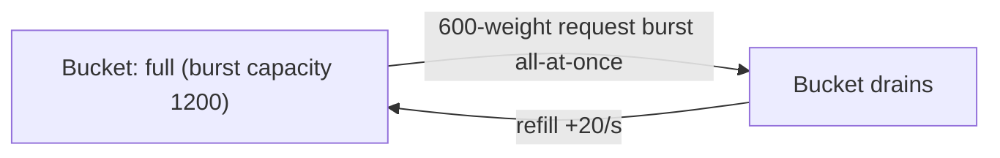
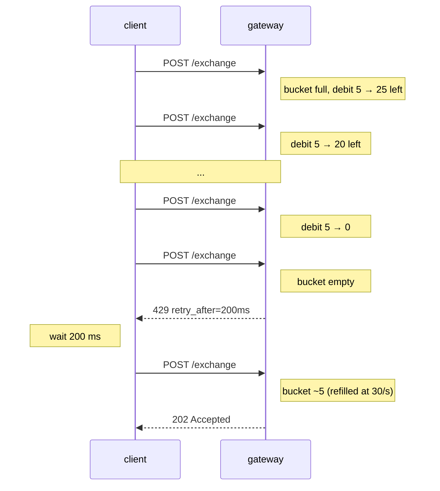

# Ограничения частоты запросов

:::info
**Предварительная версия.** Шлюз применяет приведённые ниже ограничения; незащищённый узел принимает неограниченный трафик от аутентифицированных mTLS-пиров (предназначено только для доверенной инфраструктуры — не открывайте порт `8080` в открытый интернет в продакшене).
:::

## Кратко {#tldr}

- Два бюджета: **вес по IP** (анонимный трафик) и **QPS по аккаунту** (подписанный трафик).
- Нагрузочные всплески расходуют токен-бакет; длительный трафик ограничен скоростью пополнения.
- Ответ `429` всегда содержит `retry_after_ms`. Соблюдайте это значение.
- Запросы к `/info` дёшевы (вес 1); WS-подписки ещё дешевле (вес 1 при подписке, 0 за каждое сообщение). `/exchange` — вес 5 за запрос.
- Мемпул имеет независимое ограничение на количество незавершённых действий на аккаунт.

## Бюджеты {#budgets}

| Бюджет | Лимит (по умолчанию) | Пополнение | Всплеск | Освобождение |
|--------|----------------------|------------|---------|--------------|
| Вес по IP | 1200 единиц / минуту | 20 единиц / секунду | 1200 (полный бакет) | внесённые в белый список IP освобождены |
| Бакет `/exchange` на аккаунт | 30 запр. / секунду | 30 / с | 60 | подписанты metaliquidity освобождены |
| Действия в мемпуле на аккаунт | 50 незавершённых | уменьшается по мере подтверждения действий | — | — |
| WS-подписки на соединение | 64 | — | — | внесённые в белый список соединения освобождены |

- **По IP** покрывает анонимный трафик чтения (`/info`, WS subscribe); **внесённые
  в белый список IP** (назначенные оператором маркет-мейкеры / инфраструктура) обходят это ограничение.
- **Бакет на аккаунт** применяется к подписанным записям `/exchange`. Аккаунты из
  **операторского набора metaliquidity** (доверенные подписанты vault-стратегий)
  **освобождены** от бакета на аккаунт.
- **WS**: не более **64 активных подписок на соединение**; 65-я попытка подписки
  отклоняется. Внесённые в белый список соединения освобождены от этого ограничения.

Все лимиты управляются через механизм управления (governance). Снимок бюджета по аккаунту доступен
через нативный вызов [`user_rate_limit`](./rest/info.md):

```bash
curl -X POST https://api.devnet.mtf.exchange/info \
  -H 'content-type: application/json' \
  -d '{"type":"user_rate_limit","address":"0x<addr>"}'
```

> **Запланировано.** Выделенный маршрут `GET /limits`, публикующий *статическую*
> конфигурацию по IP / по аккаунту, **ещё не реализован** — значения ниже
> являются настроенными по умолчанию и пока не доступны через эндпоинт. Используйте приведённый
> JSON как справочные значения по умолчанию:

```json
{
  "per_ip": {
    "weight_per_minute": 1200,
    "burst":             1200,
    "refill_per_second": 20
  },
  "per_account": {
    "qps":          30,
    "burst":        60,
    "refill":       30
  },
  "mempool_per_account": 50,
  "ws_subs_per_conn":    64
}
```

## Вес по эндпоинту {#weight-by-endpoint}

| Эндпоинт | Вес |
|----------|-----|
| `POST /info` (большинство типов) | 1 |
| `POST /info` `l2_book`, `markets` | 2 |
| `POST /info` `user_fills`, `user_fills_by_time` | 2 |
| `POST /exchange` | 5 |
| WS `subscribe` | 1 |
| WS опубликованное сообщение | 0 |
| WS `unsubscribe` | 0 |

Клиент, выставляющий один ордер в секунду и опрашивающий `account_state` раз в секунду, расходует `5 + 1 = 6 единиц/с = 360 единиц/мин` — значительно ниже лимита.

## QPS по аккаунту {#per-account-qps}

После подписания запроса шлюз аутентифицирует `sender` и начисляет расход в бюджет аккаунта вместо (или в дополнение к) бюджету по IP.

| Состояние отправителя | Учитывается в |
|-----------------------|---------------|
| Анонимный (без подписи, напр. `POST /info`) | по IP |
| Подписан мастер-ключом | по IP + по аккаунту |
| Подписан агентом | по IP + по аккаунту мастера |

Подписанные запросы фактически учитываются дважды — и в бюджете по IP, и в бюджете по аккаунту; клиенты, отправляющие запросы с одного IP в пользу одного аккаунта, упрутся в тот лимит, который окажется жёстче.

## Ограничение мемпула {#mempool-cap}

Независимо от ограничений частоты запросов. Машина состояний отказывается принимать более 50 незавершённых (ещё не подтверждённых) действий на `sender`. Это предотвращает монополизацию пространства мемпула одним аккаунтом.

Если вы отправляете 51-е действие, пока 50 ещё не завершены:

```json
{ "error": "mempool_per_account_full", "retry_after_ms": 100 }
```

На практике это происходит только с некорректно работающими клиентами — при нормальном времени блока ~100 мс легко обрабатывается 30 QPS. Если вы столкнулись с этим, вы укладываетесь в лимит QPS по аккаунту, но отправляете запросы быстрее, чем подтверждаются блоки.

## Поведение при всплесках {#burst-behaviour}

Бакеты заполняются до значения `burst` и пополняются со скоростью `refill` в секунду. Всплеск из `N ≤ burst` запросов обрабатывается немедленно; последующие запросы ограничиваются скоростью пополнения.



Ответ `429` с полем `retry_after_ms` сообщает точное время, через которое в бакете окажется достаточно для ещё одного запроса с весом 1. Для пакетных задач предпочтительно ограничивать темп на стороне клиента; для интерактивных сценариев подходит экспоненциальная выдержка с использованием подсказки.

## Стратегии {#strategies}

### Торговый бот {#order-flow-bot}

- Заблаговременно ограничивайте частоту на стороне клиента до ~25 QPS, оставляя запас.
- Используйте пакетную отправку `Order`: один запрос с 10 ордерами стоит 5 единиц веса (столько же, сколько один ордер); лимит QPS по аккаунту считает запросы, а не позиции.
- Используйте `BatchModify` вместо N отдельных запросов `ModifyOrder`.
- Получайте рыночные данные через WS-фид, а не через опрос `/info`.

### Потребитель рыночных данных {#market-data-consumer}

- Подписывайтесь на WS-каналы (`l2_book`, `trades`, `user_events`); не используйте опрос.
- Вес `subscribe` равен 1, сообщения в потоке стоят 0.
- При переподключении вы заново подписываетесь с чистого снимка (резюме-токенов не существует); каждая подписка снова расходует вес на новом соединении, поэтому держите соединения долгоживущими. Оставайтесь в пределах ограничения в **64 подписки** на соединение.

### Высокочастотный ликвидатор {#high-frequency-liquidator}

- Работайте с собственным самостоятельно развёрнутым узлом (аутентификация mTLS, `localhost:8080`), минуя ограничения публичного шлюза.
- Учтите, что это требует запуска инфраструктуры, подключённой к валидатору.
- Доступа через публичный шлюз достаточно для нагрузок в десятки ордеров в секунду; для HFT этого недостаточно.

## Сценарий — попадание под ограничение и восстановление {#sequence--getting-throttled-and-recovering}



## Каналы с расширенными правами {#override-channels}

| Канал | Примечания |
|-------|------------|
| mTLS-пир валидатора | Обходит ограничения шлюза (вы находитесь на доверенном пути) |
| Внесённый в белый список IP / аккаунт (на стороне оператора) | Операторы могут публиковать повышенные бюджеты для назначенных маркет-мейкеров |
| Специальные эндпоинты (`/limits`, `/health`) | Не подпадают под ограничения |

Публичные значения по умолчанию не учитывают наличие ни одного из этих вариантов.

## См. также {#see-also}

- [Ошибки](./errors.md)
- [WS-подписки](./ws/subscriptions.md)
- [Идемпотентность](../integration/idempotency.md) — повторные попытки в рамках бюджета ограничений

## Часто задаваемые вопросы {#faq}

<details>
<summary>Показать FAQ</summary>

**В: Ограничения действуют на ключевую пару или на адрес?**
О: На `sender` (адрес). Все агенты одного мастера разделяют один бюджет, поскольку при допуске учитывается мастер.

**В: Можно ли объединить один ордер по 10 рынкам, чтобы сэкономить вес?**
О: Да. `Order { orders: [<10 legs>] }` стоит 5 единиц веса, а не 50.

**В: Опросы `/info` и WS-подписки используют общий бюджет?**
О: Да — один бакет по IP / по аккаунту. WS-подписки стоят по 1 единице, затем 0 за каждое сообщение; для высокочастотных потоков данных WS всегда выгоднее опроса.

**В: Как обстоит дело с devnet?**
О: В Devnet установлены более высокие бюджеты и отсутствует ограничение мемпула. Не настраивайте клиент по devnet; пересчитайте бюджеты через `/limits` на той сети, в которой будете работать.

</details>
