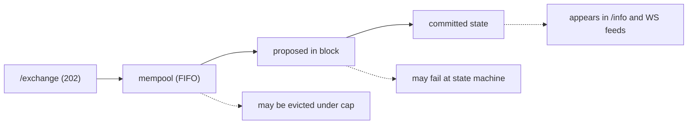
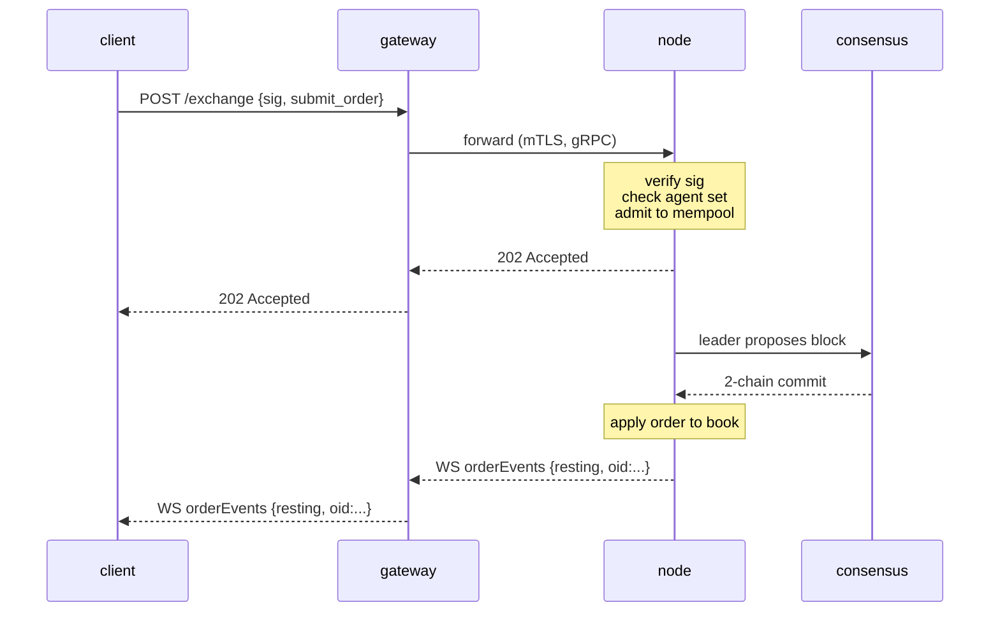

# `POST /exchange` — отправить подписанное действие

:::info
**Статус.** **Стабилен** для перечисленных вариантов действий. Форма эндпоинта зафиксирована для V1.
:::

## Кратко {#tldr}

Каждое изменяющее состояние **пользовательское** действие — размещение ордера, отмена, депозит в хранилище, одобрение агента, стейкинг и т.д. — представляет собой единый JSON-конверт, подписанный по EIP-712, который отправляется на `POST /exchange`. Вариант действия задаётся полем `type`. **Ордер** возвращает `200 OK` с синхронно присвоенным `oid` (обработчик ожидает подтверждения коммита); **каждое другое** действие возвращает `202 Accepted` при приёме заявки, а подтверждение коммита поступает через [WS-поток](../ws/subscriptions.md) или при опросе.

:::warning
**Только пользовательские действия.** `/exchange` — это публичный **пользовательский** путь для записи. Привилегированные / системные записи — отправка оракульных цен, кредиты крана, `SystemUserModify`, `SystemSpotSend`, голоса валидаторов — **никогда** не проходят через `/exchange`. Они поступают через локальные очереди узла, защищённые авторизацией валидатора (см. [таблицу небриджированных действий](#non-bridged-actions) и [кран](./faucet.md#why-this-is-not-on-exchange)).
Отправка системного действия с нативным тегом возвращает `400 unsupported action`.
:::

## URL {#url}

```
POST  https://api.<net>.mtf.exchange/exchange
```

| Путь | Формат на проводе |
|------|-----------|
| `POST /exchange` (шлюз) | **MTF-native** (этот документ) |

Шлюз обслуживает MTF-native `/exchange`. При самостоятельном запуске узла тот же нативный
`/exchange` доступен непосредственно на `http://localhost:8080`.

## Конверт запроса {#request-envelope}

```json
{
  "signature": "0xabcd...1b",
  "nonce":     1735689600001,
  "action": {
    "type": "submit_order",
    "order": { /* один из вариантов ниже */ }
  }
}
```

| Поле | Тип | Обязательно | Описание |
|-------|------|----------|-------------|
| `signature` | hex-строка, 65 байт (130 hex-символов; `0x` необязателен) | да | secp256k1 ECDSA по EIP-712 [дайджесту typed-data](#signing) структурированных полей действия + `nonce`. `r ‖ s ‖ v`. Принимаются как устаревший вариант `v ∈ {27, 28}`, так и EIP-2098 `v ∈ {0, 1}`. |
| `nonce` | uint64 | да | Строго монотонный для каждого актора. Принято использовать `Date.now()`. Включается в подписанный дайджест. См. [идемпотентность](../../integration/idempotency.md). |
| `action` | объект | да | Теговый вариант: `{ "type": "<snake_case_tag>", ... }`. См. [Каталог действий](#action-catalog) ниже. |

:::info
**Поле `sender` отсутствует на верхнем уровне.** Конверт не содержит поля `sender`. Аккаунт, состояние которого изменяется, определяется для каждого действия индивидуально:
- **Действия с указанием владельца** (`submit_order`, `cancel_order`) содержат владельца
  *внутри* тела действия — `action.order.owner` / `action.cancel.owner`. Сервер
  восстанавливает подписанта из подписи и требует, чтобы он совпадал с этим `owner`
  **или** был одобренным [агентом](../../concepts/agent-wallets.md) этого владельца.
- **Действия с авторизацией по подписанту** (управление, маржа, лидер хранилища, стейкинг, …)
  **не содержат** поля владельца: восстановленный подписант *и есть* актор, а
  авторизация на уровне действия (членство в валидаторах, лидер хранилища и т.д.) проверяется при диспетчеризации.
:::

Сервер реконструирует EIP-712 типизированную структуру из `action.type` +
`action.params` и восстанавливает подписанта по **этим значениям полей** — поэтому
`action.params` должен содержать **те же значения** (и те же канонические
десятичные строки), которые были указаны в подписанном типизированном сообщении. Несоответствие
приводит к восстановлению другого подписанта и отклонению запроса с `401`. См.
[typed-data signing](../../integration/typed-data-signing.md).

## Подписание {#signing}

Подпись — это восстановление по secp256k1 ECDSA над стандартным EIP-712-дайджестом. Каждое
действие подписывается как **структурированные EIP-712 typed-data** (`eth_signTypedData_v4`)
с первичным типом для каждого действия `MetaFluxTransaction:<Action>`, поэтому кошелёк
отображает каждое поле по имени. Сервер реконструирует типизированную структуру из `action.type` +
`action.params`, пересчитывает дайджест и восстанавливает подписанта:

```
struct_hash = keccak256( typeHash(MetaFluxTransaction:<Action>) ‖ encodeData(fields) )
signed_hash = keccak256( 0x1901 ‖ domain_separator ‖ struct_hash )
```

где сепаратор домена:

```
domain_separator = keccak256(
  keccak256("EIP712Domain(string name,string version,uint256 chainId,address verifyingContract)") ‖
  keccak256("MetaFlux") ‖
  keccak256("1") ‖
  chainId_as_uint256_be ‖
  address_zero_padded_to_32
)
```

Строки типов для каждого действия, атомарные правила `encodeData` и проработанные примеры
приведены в [typed-data signing](../../integration/typed-data-signing.md) — единой
схеме подписания. Кросс-имплементационный тест с известным ответом фиксирует дайджест каждого действия.

:::info
**`sig_scheme` является пережитком.** В ранних версиях на конверте присутствовал селектор `sig_scheme`;
он больше не требуется и игнорируется сервером (восстановление по typed-data
выполняется безусловно). **Опустите его.** Если он присутствует, единственным принятым значением
является `"typed"`.
:::

### Chain IDs {#chain-ids}

| Сеть | `chainId` |
|---------|-----------|
| Devnet (по умолчанию) | `31337` |
| Testnet | `114514` |
| Mainnet | `8964` |

`chainId` домена подписания **должен совпадать с консенсусным `chain_id` узла** —
запросите его через [`/info` `node_info`](./info.md#node_info) (`data.chain_id`) и используйте
именно это значение. Подписание с неверным `chainId` возвращает `401`, так как
восстановленный адрес отличается от `owner` действия (или, для действий с авторизацией по подписанту,
восстанавливается фантомный адрес, не прошедший ни одну проверку авторизации). Эндпоинты сетей см.
в [networks](../../networks.md).

## Числовые соглашения {#numeric-conventions}

| Тип | Формат на проводе | Причина |
|------|----------|-----|
| `uint64` ≤ 2^53 | JSON-число | Безопасно в IEEE-754 |
| `uint64` > 2^53, `u128`, масштабированные целые | JSON-строка | Нативные JSON-числа молча теряют точность за пределами 2^53 |
| Адрес | hex-строка `"0x..."` | 20 байт, 40 hex-символов (с `0x` или без) |
| Булевы значения | `true` / `false` | Литеральный JSON |
| Необязательные поля | `null` или опущены | Оба варианта принимаются; `null` — канонический |

**Поля с фиксированной точкой.** Поля цены и объёма — целые числа с 8 десятичными знаками; суммы в USDC — базовые единицы с 6 знаками. Масштаб задаётся значением, а не именем поля — например, `px = "10050000000"` означает `100.50`. Всегда передавайте строкой; сервер разбирает до `u128`.

## Семантика «подписано кем» {#signed-by-semantics}

Большинство действий может быть подписано **как** мастер-аккаунтом, **так и** активным [кошельком агента](../../concepts/agent-wallets.md). Подмножество действий доступно **только для мастера** — агентам явно отказано в полномочиях на вывод средств и управление аккаунтом.

| Класс полномочий | Мастер может подписать? | Агент может подписать? |
|------------------|:----------------:|:---------------:|
| Размещение / отмена / изменение ордеров | да | да |
| Обновление кредитного плеча / режима маржи | да | да |
| Депозит / вывод из хранилища | да | да |
| Создание субаккаунта | да | нет |
| Перевод субаккаунта | да | нет |
| Одобрение / отзыв агента | да | нет |
| Внешний вывод средств (USDC, спот) | да | нет |
| Конвертация в мультиподпись | да | нет |
| Обёртка мультиподписи | (особый случай — см. [multi-sig](../../concepts/multi-sig.md)) | нет |

Для каждого действия в [каталоге](#action-catalog) явно указано правило «подписано кем».

---

## Каталог действий {#action-catalog}

Каждый вариант — теговый объект `{ "type": "<snake_case_tag>", <flat body> }`. Ключи
тела расположены **непосредственно под объектом действия** (без PascalCase-поля `type` и
универсальной обёртки `params`) — например, `submit_order` содержит объект `order`,
`cancel_order` — объект `cancel`, а действия с авторизацией по подписанту содержат
объект `params`. Нажмите для просмотра таблицы полей. В обзорных таблицах ниже
все действия сгруппированы по категориям; **полные определения на уровне полей, следующие далее, разбиты по типу торговли** — [Действия с бессрочными ордерами](#perpetual-order-actions),
[Действия в споте](#spot-trading-actions),
[Спот-маржа и Earn](#spot-margin--earn-actions),
[Маржа и управление риском для бессрочных контрактов](#perpetual-margin--risk-actions) и
[Управление аккаунтом, стейкинг, хранилища и бридж](#account-staking-vaults--bridge-actions).

:::warning
**`px` / `size` — беззнаковые `u64` с фиксированной точкой на нативном проводе**, передаются как JSON-числа (узел декодирует их как `u64`, затем расширяет внутри). Адреса — `0x`-hex (40 символов);
`cloid` — `0x` + 32 hex-символа (16 байт).
:::

### Размещение и жизненный цикл ордера {#order-placement--lifecycle}

| `type` | Назначение | Подписано кем | Идемпотентен |
|--------|---------|-----------|-----------|
| [`submit_order`](#submit_order) | Разместить один ордер | владелец / агент | по `cloid` |
| [`batch_order`](#batch_order) | N ордеров / одна подпись | владелец / агент | `cloid` каждой позиции |
| [`cancel_order`](#cancel_order) | Отменить по `oid` | владелец / агент | да |
| [`batch_cancel`](#batch_cancel) | N отмен / одна подпись | владелец / агент | да |
| [`cancel_by_cloid`](#cancel_by_cloid) | Отменить по клиентскому идентификатору ордера | отправитель / агент | да |
| [`cancel_all_orders`](#cancel_all_orders) | Отменить все (необязательный фильтр по активу) | отправитель / агент | да |
| [`modify`](#modify) | Изменить цену / объём лимитного ордера | отправитель / агент | да |
| [`batch_modify`](#batch_modify) | N изменений / одна подпись | отправитель / агент | для каждой позиции |
| [`schedule_cancel`](#schedule_cancel) | Триггер отмены всех ордеров в будущем блоке | отправитель / агент | да |
| [`twap_order`](#twap_order) | Запустить нарезанный (TWAP) ордер | отправитель / агент | по `twap_id` |
| [`twap_cancel`](#twap_cancel) | Отменить активный родительский TWAP-ордер | отправитель / агент | да |

### Спот-торговля {#spot-trading}

Спот — это CLOB токен-на-токен (без кредитного плеча, без позиций) — отдельные стаканы и
балансы от бессрочных контрактов. Лимитный спот-ордер блокирует средства, которые потребовались бы при исполнении,
в **зарезервированный баланс**: заявка `bid` резервирует **котируемый актив** (условную сумму по
лимитной цене), заявка `ask` резервирует **базовый** актив, который предлагается. Объём ордера **урезается
при приёме** до суммы, обеспеченной балансом, а комиссии снимаются со стороны, которую получает каждая сторона. Оба действия
**авторизуются по подписанту** (подписант — это трейдер; поля `owner` нет). Полная концептуальная
модель — в [spot trading](../../products/spot.md).

| `type` | Назначение | Подписано кем | Идемпотентен |
|--------|---------|-----------|-----------|
| [`spot_order`](#spot_order) | Разместить один спот-ордер | отправитель / агент | по `cloid` |
| [`spot_cancel`](#spot_cancel) | Отменить лимитный спот-ордер по `oid` | отправитель / агент | да |

### Спот-маржа и Earn {#spot-margin--earn}

:::info
**Доступно на devnet (предварительная версия).** Маржинальный спот ([spot margin](../../products/spot-margin.md)) и его сторона предложения ликвидности ([Earn](../../concepts/earn.md)) работают сквозным образом на **devnet сегодня**: депозит залога, заимствование из пула Earn, IOC-покупка базового актива с кредитным плечом и закрытие для погашения долга. Рассматривайте это как **предварительную версию** — принудительная ликвидационная расчёт ещё не подключена (принудительное закрытие не реализует PnL и не уменьшает открытый интерес), а коэффициенты технической маржи для каждой пары являются параметрами управления, находящимися в процессе калибровки. Не рассчитывайте на готовность к продакшену при масштабировании.
:::

Маржинальная спот-позиция **изолирована по `(аккаунту, паре)`**: размещённый залог в котируемом активе является чистым буфером убытков, покупка финансируется на 100% заимствованием котируемого актива из пула Earn пары, а купленный базовый актив хранится **обособленно** на маржинальном аккаунте (никогда не в ваших доступных балансах). Earn — это другая сторона: поставщики вносят котируемый актив для кредитования в обмен на доли пула, а проценты по займу, которые платят маржинальные спот-трейдеры, увеличивают стоимость каждой доли. Все шесть действий **авторизуются по подписанту** (подписант — это актор; поля `owner` нет). `amount` / `shares` / `borrow` — десятичные числа, передаваемые как JSON-строки; `size` / `limit_px` — `u64` в единицах плоскости `1e8` / «сырых лотов», как в [`spot_order`](#spot_order). Каждое из них возвращает конверт приёма [`202 Accepted`](#202-accepted--non-order-admission) (не синхронный `oid`); наблюдайте за подтверждённым результатом через [`/info` `spot_margin_state`](./info/spot.md#spot_margin_state) и [`earn_state`](./info/spot.md#earn_state).

| `type` | Назначение | Подписано кем | Идемпотентен |
|--------|---------|-----------|-----------|
| [`spot_margin_deposit`](#spot_margin_deposit) | Внести залог в котируемом активе для пары | отправитель / агент | нет |
| [`spot_margin_withdraw`](#spot_margin_withdraw) | Вывести свободный залог | отправитель / агент | нет |
| [`spot_margin_open`](#spot_margin_open) | Занять + IOC-купить базовый актив с кредитным плечом | отправитель / агент | нет |
| [`spot_margin_close`](#spot_margin_close) | Продать удерживаемый базовый актив, погасить займ | отправитель / агент | нет |
| [`earn_deposit`](#earn_deposit) | Внести котируемый актив в пул кредитования для получения долей | отправитель / агент | нет |
| [`earn_withdraw`](#earn_withdraw) | Погасить доли пула (с учётом лимита незадействованных средств) | отправитель / агент | нет |

### Маржа и управление риском {#margin--risk}

| `type` | Назначение | Подписано кем |
|--------|---------|-----------|
| [`update_leverage`](#update_leverage) | Изменить кредитное плечо / переключатель изоляции для актива | отправитель / агент |
| [`update_isolated_margin`](#update_isolated_margin) | Подписанная дельта изолированной маржи | отправитель / агент |
| [`top_up_isolated_only_margin`](#top_up_isolated_only_margin) | Пополнение строго изолированной маржи | отправитель / агент |
| [`user_portfolio_margin`](#user_portfolio_margin) | Подключение / отключение портфельной маржи | отправитель / агент |

### Управление аккаунтом {#account-management}

| `type` | Назначение | Подписано кем |
|--------|---------|-----------|
| [`approve_agent`](#approve_agent) | Одобрить кошелёк агента | отправитель / агент |
| [`set_display_name`](#set_display_name) | Установить отображаемое имя аккаунта | отправитель / агент |
| [`set_referrer`](#set_referrer) | Привязать к адресу реферера | отправитель / агент |
| [`approve_builder_fee`](#approve_builder_fee) | Одобрить лимит комиссии билдера | отправитель / агент |
| [`create_sub_account`](#create_sub_account) | Открыть субаккаунт под отправителем | отправитель / агент |
| [`sub_account_transfer`](#sub_account_transfer) | Переместить перп-кросс-залог между родителем и субаккаунтом | отправитель / агент |
| [`sub_account_spot_transfer`](#sub_account_spot_transfer) | Переместить спот-баланс токена между родителем и субаккаунтом | отправитель / агент |
| [`convert_to_multi_sig_user`](#convert_to_multi_sig_user) | Перевести аккаунт на мультиподпись | отправитель / агент |
| [`set_position_mode`](#set_position_mode) | Переключить режим позиции: односторонний / хеджевый | отправитель / агент |

### Стейкинг и абстракция {#staking--abstraction}

| `type` | Назначение | Подписано кем |
|--------|---------|-----------|
| [`c_deposit`](#c_deposit) | Переместить спот MTF в свободный баланс стейкинга | отправитель / агент |
| [`c_withdraw`](#c_withdraw) | Переместить свободный баланс стейкинга обратно в спот MTF | отправитель / агент |
| [`token_delegate`](#token_delegate) | Делегировать / отозвать делегирование стейка | отправитель / агент |
| [`claim_rewards`](#claim_rewards) | Получить вознаграждения за стейкинг | отправитель / агент |
| [`link_staking_user`](#link_staking_user) | Создать псевдоним для цели стейкинга | отправитель / агент |
| [`user_dex_abstraction`](#user_dex_abstraction) | Переключить флаг DEX-абстракции пользователя | отправитель / агент |
| [`user_set_abstraction`](#user_set_abstraction) | Настроить конфигурацию абстракции для себя | отправитель / агент |
| [`agent_set_abstraction`](#agent_set_abstraction) | Настроить конфигурацию абстракции для агента | отправитель / агент |
| [`priority_bid`](#priority_bid) | Уплатить приоритетную комиссию за размещение в начале блока | отправитель / агент |

### Зашифрованные ордера {#encrypted-orders}

| `type` | Назначение | Подписано кем |
|--------|---------|-----------|
| [`submit_encrypted_order`](#submit_encrypted_order) | Шифртекст ордера с пороговым шифрованием | отправитель / агент |

### Хранилища {#vaults}

| `type` | Назначение | Подписано кем |
|--------|---------|-----------|
| [`create_vault`](#create_vault) | Лидер создаёт хранилище | отправитель / агент |
| [`vault_transfer`](#vault_transfer) | Начальный перевод лидера | отправитель / агент |
| [`vault_modify`](#vault_modify) | Обновление конфигурации хранилища (только лидер) | отправитель / агент |
| [`vault_withdraw`](#vault_withdraw) | Погашение долей участника | отправитель / агент |

### Вывод через бридж {#bridge-withdrawals}

Внешние выводы средств покидают цепочку через [MetaBridge](../../bridge/index.md).
Действие **авторизуется по подписанту**: восстановленный подписант является дебетуемым аккаунтом,
поэтому полномочия на вывод фактически **только у мастера** — подпись агента будет действовать на
собственном (отдельном) аккаунте агента, но никак не на мастер-аккаунте.

| `type` | Назначение | Подписано кем |
|--------|---------|-----------|
| [`core_evm_transfer`](#core_evm_transfer) | Переместить USDC из реестра Core в MetaFluxEVM | отправитель (мастер) |
| [`mb_withdraw`](#mb_withdraw) | Вывести USDC кросс-залога во внешнюю цепочку | отправитель (мастер) |

### Недоступно на публичном пути `/exchange` {#not-on-the-public-exchange-path}

Эти имена действий встречались в ранних редакциях,
но они **не бриджируются в нативном MTF-обработчике `/exchange`**. Это либо привилегированные /
системные записи, которые никогда не должны проходить через публичный пользовательский путь,
либо распознанные, но не сопоставленные схемные заготовки. При их отправке возвращается
`400 unsupported action`. Диспозиция каждого — в [таблице ниже](#non-bridged-actions).

| Черновое имя | Нативный тег (если распознан) | Почему не бриджируется |
|-----------|----------------------------|-----------------|
| `ScaleOrder` | — | Нативного действия нет; реализуйте лесенку на клиенте через `batch_order` |
| `UpdateMarginMode` | — | Нативного действия нет; изоляция задаётся флагом `is_isolated` в `update_leverage` |
| `MultiSig` | — | Обёртка мультиподписи для сбора и исполнения не бриджируется (предварительная версия / не исполняется — аккаунт *регистрируется* через `convert_to_multi_sig_user`) |
| `RegisterReferrer` | — | Не бриджируется (реферер привязывается по адресу через `set_referrer`) |
| `UsdcTransfer` / `SpotTransfer` | — | Потоки пользовательских переводов не бриджируются |
| `WithdrawUsdc` | — | Черновое имя; внешний вывод — [`mb_withdraw`](#mb_withdraw) |
| `BorrowLend` | — | Не бриджируется |
| `RfqQuote` / `RfqAccept` | `rfq_request` / `rfq_accept` | Распознанная, но не сопоставленная заготовка → `unsupported action` |
| `FbaOrder` | `fba_submit` | Распознанная, но не сопоставленная заготовка → `unsupported action` |
| (vault distribute) | `vault_distribute` | Частичный/черновой обработчик; не бриджируется на `/exchange` |
| (PM lifecycle) | `pm_enroll` / `pm_unenroll` | Соответствуют [`user_portfolio_margin`](#user_portfolio_margin) (подключение / отключение). `pm_rebalance` был **удалён** — отклоняется как неизвестное действие |
| (cross-chain) | `cross_chain_send` | Распознанная, но не сопоставленная заготовка → `unsupported action` |
| (encrypted submit alt) | `encrypted_order_submit` | Заготовка; используйте [`submit_encrypted_order`](#submit_encrypted_order) |

---

## Действия с бессрочными ордерами {#perpetual-order-actions}

Размещение и жизненный цикл ордеров на рынках **бессрочных контрактов** (идентификатор perp `market`). Они
используют общий CLOB; действия для [спот](#spot-trading-actions) и
[спот-маржи](#spot-margin--earn-actions) описаны в отдельных разделах
ниже. Управление кредитным плечом и маржей для бессрочных контрактов — в разделе
[Маржа и управление риском для бессрочных контрактов](#perpetual-margin--risk-actions).

### Разместить один ордер {#submit_order}

Разместить один ордер. Тело ордера передаётся в `action.order`; `owner` —
заявленный аккаунт (сервер требует, чтобы восстановленный подписант совпадал с ним или был
одобренным агентом). Для размещения нескольких ордеров под одной подписью используйте
[`batch_order`](#batch_order).

```json
{
  "type": "submit_order",
  "order": {
    "owner":       "0x00000000000000000000000000000000000000aa",
    "market":       7,
    "side":         "bid",
    "kind":         "limit",
    "size":         100000000,
    "limit_px":     10050000000,
    "tif":          "gtc",
    "stp_mode":     "cancel_oldest",
    "reduce_only":  false,
    "cloid":        "0xabababababababababababababababab",
    "builder":      { "fee": 5, "user": "0x00000000000000000000000000000000000000ff" },
    "position_side": "long"
  }
}
```

| Поле | Тип | Диапазон / значения | Описание |
|-------|------|----------------|-------------|
| `owner` | hex-адрес | 40 hex-символов | Заявленный аккаунт; должен совпадать с восстановленным подписантом или быть одобренным агентом. Только для провода — удаляется при понижении |
| `market` | uint32 | `[0, market_count)` | Идентификатор актива/рынка (сопоставляется один к одному с `AssetId`) |
| `side` | перечисление | `"bid"` / `"ask"` | — |
| `kind` | перечисление | `"limit"` / `"market"` / `"stop_loss"` / `"take_profit"` | `limit` / `market` размещают активный ордер. `stop_loss` / `take_profit` принимаются **только при наличии блока `trigger`** — эта пара паркует одну TP/SL-позицию только на закрытие (см. [триггерные ордера](#trigger-orders-stop_loss--take_profit)); `stop_loss` / `take_profit` *без* блока `trigger` отклоняются (`unsupported order kind`) |
| `trigger` | объект \| null | — | Необязательный [блок триггера](#trigger-orders-stop_loss--take_profit). Его наличие — при **любом** `kind` — превращает этот `submit_order` в одну запаркованную позицию только на закрытие вместо активного ордера: `{ "trigger_px": <u64>, "is_market": <bool>, "tpsl": "tp" \| "sl" }` |
| `size` | uint64 | `> 0` | Единицы тиков с фиксированной точкой (расширяется до `u128`) |
| `limit_px` | uint64 | `> 0` | Единицы тиков с фиксированной точкой (расширяется до `i128`) |
| `tif` | перечисление | `"gtc"`, `"ioc"`, `"alo"` | `"aon"` отклоняется (`unsupported time-in-force` — нет эквивалента в ядре) |
| `stp_mode` | перечисление | `"cancel_oldest"`, `"cancel_newest"`, `"cancel_both"` | `"reject"` отклоняется (`unsupported stp_mode` — нет эквивалента в ядре) |
| `reduce_only` | bool | — | Если true, отклоняется при коммите, если бы увеличил позицию |
| `cloid` | hex-строка \| null | `0x` + 32 hex-символа (16 байт) | Необязательный клиентский идентификатор ордера; позволяет использовать `cancel_by_cloid` и дедупликацию |
| `builder` | объект \| null | — | Необязательный вычет комиссии билдера: `{ "fee": <bps u16>, "user": <0x-hex address> }` |
| `position_side` | перечисление \| null | `"long"` / `"short"` | **Только для [хеджевого режима](../../concepts/hedge-mode.md).** Целевая позиция для ордера. **Опустите для односторонних аккаунтов** (по умолчанию) и **передайте для хеджевых аккаунтов** — односторонний аккаунт, передающий это поле, или хеджевый аккаунт, опускающий его, будет отклонён. `reduce_only` оценивается только относительно указанной позиции. См. [хеджевый режим](#position_side-hedge-mode) ниже |

**Идемпотентность**: дублирующийся `cloid` для одного аккаунта отклоняется при приёме с `error: "duplicate cloid"`. Используйте `cloid` как ключ дедупликации на стороне клиента.

**Частые ошибки**: `px` не выровнен по тику, `size` ниже минимума рынка, `reduce_only` увеличил бы позицию, ордер отклонён по STP, аккаунт находится в уровне ликвидации T1+.

**Записи статуса ответа** (по ордеру, по порядку — полный union см. в
[Ответ → 200 OK](#200-ok--order-path-synchronous-oid)):

```json
{"resting": {"oid": 12345, "cloid": "0x..."}}                       // выставлен в стакан
{"filled":  {"oid": 12345, "total_sz": "100000000", "avg_px": "10050000000"}}
{"error":   "<reason>"}                                             // коммит/приём отклонил эту запись
{"pending": {"action_hash": "0x...", "nonce": 1735689600001}}       // принят, нет коммита в окне ожидания
```

#### `position_side` (хеджевый режим) {#position_side-hedge-mode}

Необязательное поле `position_side` в теле ордера выбирает, к какой позиции применяется ордер,
когда аккаунт находится в [хеджевом режиме](../../concepts/hedge-mode.md).

- **Односторонний аккаунт (по умолчанию):** **опустите** `position_side`. Передача этого поля
  на одностороннем аккаунте отклоняется.
- **Хеджевый аккаунт:** `position_side` **обязателен** для каждого ордера (`"long"`
  или `"short"`). Его отсутствие на хеджевом аккаунте отклоняется.

Позиция выбирается явно — она **никогда не выводится** из `side` — поэтому заявка `bid`,
предназначенная для *уменьшения короткой позиции*, никогда случайно не откроет и не увеличит длинную. Когда
установлен `reduce_only`, он оценивается **только относительно указанной позиции**: ордер
`reduce_only` по `short` никогда не затронет позицию `long`, и наоборот.
Неявного переворота нет — закрытие длинной позиции никогда не открывает короткую.

| `side` | `position_side` | `reduce_only` | Эффект (хеджевый аккаунт) |
|--------|-----------------|---------------|------------------------|
| `bid` | `long` | false | Открыть / увеличить длинную позицию |
| `ask` | `long` | true | Уменьшить / закрыть длинную позицию |
| `ask` | `short` | false | Открыть / увеличить короткую позицию |
| `bid` | `short` | true | Уменьшить / закрыть короткую позицию |

Переключите аккаунт в хеджевый режим (в состоянии без открытых позиций) с помощью
[`set_position_mode`](#set_position_mode).

#### Триггерные ордера (`stop_loss` / `take_profit`) {#trigger-orders-stop_loss--take_profit}

Одноногий защитный триггер (стоп-лосс или тейк-профит) выражается как
`submit_order`, в теле `order` которого присутствует блок `trigger`. Наличие блока
— **не** `kind` — определяет маршрут: ордер **паркуется** в каноническом реестре
триггеров вместо отправки в стакан и срабатывает позднее как
**IOC только на закрытие**, когда цена маркировки пересекает `trigger_px`.

```json
{
  "type": "submit_order",
  "order": {
    "owner":       "0x00000000000000000000000000000000000000aa",
    "market":       7,
    "side":         "ask",
    "kind":         "take_profit",
    "size":         50000000,
    "limit_px":     0,
    "tif":          "ioc",
    "stp_mode":     "cancel_oldest",
    "reduce_only":  false,
    "trigger":     { "trigger_px": 4200000000000, "is_market": true, "tpsl": "tp" }
  }
}
```

| Поле | Тип | Диапазон / значения | Описание |
|-------|------|----------------|-------------|
| `trigger.trigger_px` | uint64 | `> 0` | Цена триггера в единицах тиков с фиксированной точкой (расширяется до `i128`). Запаркованная позиция паркуется **по этой цене** — она повторно используется как цена при срабатывании (собственный `limit_px` ордера для триггера игнорируется) |
| `trigger.is_market` | bool | — | Рекомендательная метка (`true` = сработавшая позиция является рыночной/IOC). Путь парковки всегда срабатывает как IOC только на закрытие независимо от этого; передаётся для точности пути чтения, а не для управления |
| `trigger.tpsl` | перечисление | `"tp"` / `"sl"` | Рекомендательная метка тейк-профит / стоп-лосс. Исполнитель выводит направление срабатывания из `side` позиции относительно цены маркировки; отображается в `/info`, а не служит для управления |

Семантика:

- **Принудительно только на закрытие.** Триггерная позиция всегда закрывает — она никогда не может
  открыть или увеличить позицию — независимо от значения `reduce_only` на проводе.
- **`side` позиции определяет, что защищается.** Триггер `ask` закрывает длинную;
  триггер `bid` закрывает короткую. На [хеджевом аккаунте](#position_side-hedge-mode)
  передайте `position_side` для указания позиции, точно так же, как для активного ордера.
- **`trigger_px` — это запаркованная цена**, а не `limit_px` ордера — передавайте
  `limit_px` по своему усмотрению (`0` допустимо); используется цена из блока триггера.
- **OCO.** Триггерные позиции, сгруппированные вместе, аннулируются при срабатывании (сработавшая позиция завершается;
  её «сосед» отменяется).

При приёме возвращается тот же union статуса по ордеру, что и для активного `submit_order`. Триггер,
который паркуется, отчитывается через путь ордера; последующее срабатывание является
подтверждённым эффектом, наблюдаемым в [WS-потоке](../ws/subscriptions.md) / `/info`.
Многоногие корзины «вход + защита» используют [`batch_order`](#batch_order) с
`grouping: "normalTpsl"` / `"positionTpsl"`.

---

### Разместить несколько ордеров одной подписью {#batch_order}

N ордеров в ОДНОМ подписанном конверте / одном nonce. Каждая запись представляет собой полное тело ордера
[`submit_order`](#submit_order) (те же поля, включая `owner` / `cloid` / `builder` на уровне ордера).

```json
{
  "type": "batch_order",
  "params": {
    "orders": [
      { "owner": "0x...aa", "market": 1, "side": "bid", "kind": "limit",
        "size": 1000, "limit_px": 5000, "tif": "gtc",
        "stp_mode": "cancel_oldest", "reduce_only": false },
      { "owner": "0x...aa", "market": 2, "side": "ask", "kind": "limit",
        "size": 2000, "limit_px": 6000, "tif": "gtc",
        "stp_mode": "cancel_oldest", "reduce_only": false }
    ],
    "grouping": "na"
  }
}
```

| Поле | Тип | Значения | Описание |
|-------|------|--------|-------------|
| `orders[*]` | order | — | Каждая запись имеет полную структуру ордера `submit_order` |
| `grouping` | enum | `"na"`, `"normalTpsl"`, `"positionTpsl"` | Группировка семейства ордеров; по умолчанию `"na"`, если не указано |

Возвращает массив статусов для каждой позиции (то же объединение типов, что и у `submit_order`).

---

### Отменить один ордер по ID {#cancel_order}

Отменяет один ордер по `oid`. Тело отмены передаётся в `action.cancel`; `owner` —
указанный аккаунт (восстановленная подпись должна совпадать с ним или быть утверждённым агентом).
Для массовой отмены под одной подписью используйте [`batch_cancel`](#batch_cancel).

```json
{
  "type": "cancel_order",
  "cancel": {
    "owner":  "0x00000000000000000000000000000000000000aa",
    "market": 3,
    "oid":    12345
  }
}
```

| Поле | Тип | Описание |
|-------|------|-------------|
| `owner` | hex address | Указанный аккаунт; только для передачи по сети |
| `market` | uint32 | Идентификатор актива / рынка |
| `oid` | uint64 | Серверный идентификатор ордера (возвращается в ответе `submit_order`). **Обязательно** — отмена только с `cloid` отклоняется (`cancel requires an oid`); вместо этого используйте [`cancel_by_cloid`](#cancel_by_cloid) |
| `cloid` | hex string \| null | Принимается по сети, но **не** используется для отмены здесь |

**Идемпотентность**: отмена уже отменённого / уже исполненного ордера возвращает `{"error":"order not found"}` и является безопасной.

---

### Отменить несколько ордеров одной подписью {#batch_cancel}

N отмен в одном подписанном конверте. Каждая запись — это тело отмены
[`cancel_order`](#cancel_order) (для каждой записи требуется `oid`;
записи только с `cloid` отклоняются).

```json
{
  "type": "batch_cancel",
  "params": {
    "cancels": [
      { "owner": "0x...aa", "market": 1, "oid": 10 },
      { "owner": "0x...aa", "market": 2, "oid": 11 }
    ]
  }
}
```

Структура ответа для каждой записи аналогична `cancel_order`.

---

### Отменить ордер по клиентскому ID {#cancel_by_cloid}

Отмена по клиентскому идентификатору ордера. Полезно, когда вызывающая сторона ещё не получила
серверный `oid` (гонка между ответом на `submit_order` и решением об отмене).
Это действие с **авторизацией по отправителю** (поле `owner` отсутствует — в роли актора выступает восстановленная подпись).

```json
{
  "type": "cancel_by_cloid",
  "params": {
    "asset": 7,
    "cloid": "0xabababababababababababababababab"
  }
}
```

| Поле | Тип | Описание |
|-------|------|-------------|
| `asset` | uint32 | Идентификатор актива / рынка |
| `cloid` | hex string | `0x` + 32 hex-символа (16 байт) |

Структура ответа аналогична `cancel_order`.

---

### Отменить все открытые ордера {#cancel_all_orders}

Отменяет все открытые ордера отправителя, опционально — только по одному активу.

```json
{
  "type": "cancel_all_orders",
  "params": { "asset": 3 }
}
```

| Поле | Тип | Описание |
|-------|------|-------------|
| `asset` | uint32 \| null | `null` / не указано = все активы; `Some(a)` = только актив `a` |

Возвращает количество отменённых ордеров.

---

### Изменить цену или объём открытого ордера {#modify}

Изменяет цену и/или объём рестующего ордера на месте. Должно быть указано хотя бы одно из полей `new_px` /
`new_size`. Целевой ордер адресуется **по `oid`** или **по `cloid`**
(клиентскому идентификатору, с которым был размещён ордер) — укажите одно из двух.

```json
{
  "type": "modify",
  "params": {
    "market":   3,
    "oid":      12345,
    "new_px":   10049000000,
    "new_size": 100000000
  }
}
```

Адресация по `cloid` вместо `oid` (пропустите `oid` или оставьте равным `0`):

```json
{
  "type": "modify",
  "params": {
    "market":       3,
    "cloid":        "0xabababababababababababababababab",
    "new_px":       10049000000,
    "always_place": true
  }
}
```

| Поле | Тип | Описание |
|-------|------|-------------|
| `market` | uint32 | Идентификатор актива / рынка |
| `oid` | uint64 | Идентификатор целевого ордера. По умолчанию `0` (= адресация по `cloid`), если не указано |
| `cloid` | hex string \| null | `0x` + 32 hex-символа (16 байт). Если указано, цель разрешается по клиентскому идентификатору ордера (тот же резолвер, что использует [`cancel_by_cloid`](#cancel_by_cloid)), а не по `oid`. Некорректный `cloid` отклоняется при поступлении |
| `new_px` | uint64 \| null | Новая цена в единицах фиксированной точки (`null` / не указано = без изменений) |
| `new_size` | uint64 \| null | Новый объём в единицах фиксированной точки (`null` / не указано = без изменений) |
| `always_place` | bool | При значении `true` ордер, которого больше нет в стакане, обрабатывается как «best-effort» без ошибки, а не как отклонение. По умолчанию `false` |

Возвращает один статус изменения.

---

### Изменить несколько ордеров одной подписью {#batch_modify}

Применяет N операций `modify` под одной подписью. Каждая запись имеет ту же структуру, что и
`modify.params`.

```json
{
  "type": "batch_modify",
  "params": {
    "modifications": [
      { "market": 1, "oid": 5, "new_px": 100, "new_size": null },
      { "market": 2, "oid": 6, "new_px": null, "new_size": 7 }
    ]
  }
}
```

| Поле | Тип | Описание |
|-------|------|-------------|
| `modifications[*]` | modify | Каждая запись имеет полную структуру параметров [`modify`](#modify) (`market`, `oid`, опциональные `new_px` / `new_size`) |

**Ответ.** Действие не связано с ордером →
[конверт приёма `202 Accepted`](#202-accepted--non-order-admission):

```json
{ "accepted": true, "mempool_depth": 3, "nonce": 1735689600001, "action_hash": "0x..." }
```

**При фиксации** записи применяются **в порядке входных данных** и **не являются
атомарными**: каждое изменение применяется независимо или завершается ошибкой с указанием причины
(результат фиксации содержит один статус на запись, в порядке входных данных, а также счётчик применённых). HTTP-ответ не содержит статусов по каждой записи — отслеживайте
фиксацию по возвращённому `action_hash`. Пустой массив `modifications` отклоняется (`empty batch`); более **1000** записей отклоняется (троттлинг);
запись, в которой оба поля `new_px` и `new_size` равны null, завершается ошибкой (`nothing to modify`).

---

### Запланировать отмену всех ордеров в будущем блоке {#schedule_cancel}

Устанавливает отмену всех ордеров на будущий блок: при достижении `cancel_at_block` все открытые ордера отправителя
отменяются (механизм «мёртвой руки»).

```json
{
  "type": "schedule_cancel",
  "params": { "cancel_at_block": 999 }
}
```

| Поле | Тип | Описание |
|-------|------|-------------|
| `cancel_at_block` | uint64 | Высота блока, на которой отменяются открытые ордера отправителя |

---

### Запланировать нарезанный TWAP-ордер {#twap_order}

Размещает нарезанный (взвешенный по времени) ордер. Родительский ордер разбивается на `slice_count`
дочерних ордеров с интервалом `delay_ms`.

```json
{
  "type": "twap_order",
  "params": {
    "market":      4,
    "side":        "ask",
    "total_size":  1000000000,
    "slice_count": 10,
    "delay_ms":    500,
    "reduce_only": true
  }
}
```

| Поле | Тип | Описание |
|-------|------|-------------|
| `market` | uint32 | Идентификатор актива / рынка |
| `side` | enum | `"bid"` / `"ask"` |
| `total_size` | uint64 | Общий объём в единицах фиксированной точки (расширяется до `u128`) |
| `slice_count` | uint32 | Количество дочерних частей (`> 0`) |
| `delay_ms` | uint64 | Интервал между частями в мс |
| `reduce_only` | bool | — |

**Ответ.** Действие не связано с ордером →
[конверт приёма `202 Accepted`](#202-accepted--non-order-admission):

```json
{ "accepted": true, "mempool_depth": 1, "nonce": 1735689600001, "action_hash": "0x..." }
```

Родительский `twap_id` (uint64) присваивается **при фиксации** из детерминированного счётчика
на уровне цепочки и передаётся в результате фиксации — в HTTP-ответе его **нет**. Отслеживайте фиксацию по возвращённому `action_hash`. Нулевой `total_size`
или нулевой `slice_count` приводит к ошибке при фиксации. События нарезки передаются через
[WS-канал `user_events`](../ws/subscriptions.md) (выделенный поток `twap*` запланирован в roadmap).

---

### Отменить активный TWAP-ордер {#twap_cancel}

Отменяет выполняющийся родительский ордер TWAP. Уже исполненные части остаются исполненными; будущие части прекращаются.

```json
{
  "type": "twap_cancel",
  "params": { "twap_id": 17 }
}
```

| Поле | Тип | Описание |
|-------|------|-------------|
| `twap_id` | uint64 | Идентификатор родительского TWAP-ордера, возвращённый `twap_order` |

---

## Действия на спот-рынке {#spot-trading-actions}

Действия [спот](../../products/spot.md) «токен на токен» — без кредитного плеча, без позиций,
с книгами ордеров и балансами, полностью отделёнными от бессрочных контрактов.

### Разместить один спот-ордер {#spot_order}

Размещает один ордер на **спот**-рынке. Спот-сделки представляют собой обмен токен на токен
без кредитного плеча и без позиций; книги ордеров и балансы полностью отделены
от бессрочных контрактов. Тело ордера передаётся в `action.order`. Спот-ордера имеют
**авторизацию по отправителю** — восстановленная подпись является трейдером, поэтому поле `owner` **отсутствует**. `pair` — это **идентификатор спот-пары** (`SpotPairSpec.pair_id`), который
отличается от идентификатора рынка бессрочных контрактов `market` и от идентификатора токена.

```json
{
  "type": "spot_order",
  "order": {
    "pair":      200,
    "side":      "bid",
    "size":      100000000,
    "limit_px":  200000000,
    "tif":       "gtc",
    "stp_mode":  "cancel_oldest",
    "cloid":     "0xabababababababababababababababab"
  }
}
```

| Поле | Тип | Диапазон / значения | Описание |
|-------|------|----------------|-------------|
| `pair` | uint32 | активная спот-пара | Идентификатор спот-пары (`SpotPairSpec.pair_id`) — **не** идентификатор токена |
| `side` | enum | `"bid"` / `"ask"` | `bid` покупает базовый актив (платит котировочным); `ask` продаёт базовый актив (получает котировочный) |
| `size` | uint64 | `> 0` | Объём базового актива в сырых лотах (`10^sz_decimals` за целую единицу); расширяется до `u128` |
| `limit_px` | uint64 | `> 0` | Лимитная цена в плоскости `1e8`. Рыночный ордер (`0`) **пока не поддерживается** — всегда отправляйте лимитный |
| `tif` | enum | `"gtc"`, `"ioc"`, `"alo"` | Остатки `gtc` / `alo` **выставляются в стакан** (с обеспечением эскроу); `ioc` никогда не остаётся в стакане. `"aon"` отклоняется |
| `stp_mode` | enum | `"cancel_oldest"`, `"cancel_newest"`, `"cancel_both"` | Защита от самоторговли. `"reject"` отклоняется (нет эквивалента в ядре) |
| `cloid` | hex string \| null | `0x` + 32 hex-символа (16 байт) | Необязательный клиентский идентификатор ордера |

**Эскроу.** Рестующий спот-ордер (остаток `gtc` / `alo`) блокирует средства, которые он должен заплатить при исполнении, в зарезервированном балансе: `bid` резервирует **котировочный актив** (номинал по лимитной цене), `ask` резервирует **базовый актив**, который он предлагает. Зарезервированные средства недоступны для расходования; при исполнении они передаются контрагенту, при отмене, срабатывании защиты от самоторговли или деактивации рынка — возвращаются вам. Балансы по токенам сохраняются точно.

**Доступность средств.** Объём ордера при поступлении ограничивается тем, что вы можете обеспечить
(для покупки — `quote_balance ÷ limit_px`; для продажи — имеющимся базовым активом). Полностью необеспеченный ордер является принятым «холостым» (без исполнения, ничего не выставляется в стакан).

**Комиссии и расчёты.** Исполнение обменивает базовый актив на котировочный по **рестующей цене маркет-мейкера**. Комиссия тейкера взимается с ноги, которую получает тейкер; комиссия маркет-мейкера — с ноги, которую получает маркет-мейкер. Комиссии начисляются на спот-счёт сборов.

**Лимиты.** Каждый аккаунт может держать до **1000** ордеров в стакане на одну спот-пару; новый рестующий ордер сверх этого лимита отклоняется (`spot resting-order cap reached` — сначала отмените часть). Зарегистрированные аккаунты маркет-мейкеров освобождены от этого ограничения. Если спот приостановлен управлением, новые ордера отклоняются (`spot trading disabled`) — но вы всё равно можете использовать [`spot_cancel`](#spot_cancel) и вернуть эскроу.

**Ответ.** Как и в случае бессрочного [`submit_order`](#submit_order), `spot_order`
возвращает **синхронный** статус ордера после его фиксации — фактически присвоенный `oid` с записью `resting` или `filled` (либо `error`), или `pending`, если фиксация не произошла в течение окна ожидания ордера. Объединение статусов аналогично
[`submit_order`](#200-ok--order-path-synchronous-oid). Спот-балансы / открытые
ордера также доступны через [`/info`](./info.md); спот-исполнения пока не передаются
в WebSocket-ленты сделок / свечей.

---

### Отменить открытый спот-ордер {#spot_cancel}

Отменяет один из **ваших** рестующих спот-ордеров по `oid` на паре, возвращая заблокированный эскроу. Авторизация по отправителю; **отменить ордер может только его владелец** —
третья сторона (или неверный владелец) получает отказ (`not the order owner`). Неизвестный или
нерестующий `oid` является типизированным промахом (`order not found`). Отмены **не** блокируются спот-остановкой, поэтому вы всегда можете выйти из рестующего ордера и вернуть эскроу.

```json
{
  "type": "spot_cancel",
  "cancel": { "pair": 200, "oid": 12345 }
}
```

| Поле | Тип | Диапазон / значения | Описание |
|-------|------|----------------|-------------|
| `pair` | uint32 | активная спот-пара | Идентификатор спот-пары, на которой рестует ордер |
| `oid` | uint64 | рестующий спот `oid` | Серверный идентификатор ордера для отмены (отмена по `cloid` для спота пока не реализована) |

---

## Действия для спот-маржи и Earn {#spot-margin--earn-actions}

Торговля с кредитным плечом через [спот-маржу](../../products/spot-margin.md) и
[Earn](../../concepts/earn.md) — сторона кредитного предложения. **Доступно на devnet
(предварительная версия).** Все действия в этом разделе авторизуются отправителем и возвращают
конверт допуска [`202 Accepted`](#202-accepted--non-order-admission).

### Внести залог для спот-маржи {#spot_margin_deposit}

:::info
**Доступно на devnet (предварительная версия).** Смотрите обзор раздела [Спот-маржа и Earn](#spot-margin--earn) для ознакомления с ограничениями предварительной версии.
:::

Внесите залог в виде котировочного актива (USDC) на маржинальный счёт `(account, pair)`, списав средства с вашего доступного спот-баланса. Залог — это чистый **буфер убытков** — он не финансирует покупку (её финансирует заём через [`spot_margin_open`](#spot_margin_open)). Авторизуется отправителем; тело передаётся через `action.params`. `pair` — это **идентификатор спот-пары**. Счёт создаётся при первом пополнении и накапливается при последующих.

```json
{
  "type": "spot_margin_deposit",
  "params": { "pair": 200, "amount": "100" }
}
```

| Поле | Тип | Допустимые значения | Описание |
|-------|------|----------------|-------------|
| `pair` | uint32 | активная спот-пара с включённой маржой | Идентификатор спот-пары (`SpotPairSpec.pair_id`) — **не** идентификатор токена |
| `amount` | десятичная строка | `> 0` | Котировочный залог для внесения (в целых единицах), в виде JSON-строки |

**Условия доступа.** Маржа должна быть **активирована для пары** — паре необходимы параметры риска на уровне пары, которые являются настройкой управления, находящейся в стадии калибровки. Пополнение для пары без этих параметров отклоняется (`spot margin not enabled for pair`). Неизвестная пара, неположительное значение `amount` или сумма, превышающая доступный котировочный баланс, отклоняются на этапе допуска.

**Ответ.** Возвращает конверт допуска [`202 Accepted`](#202-accepted--non-order-admission) (не синхронный `oid`). Подтвердите зачисленный залог через [`/info` `spot_margin_state`](./info/spot.md#spot_margin_state). Смотрите [спот-маржу](../../products/spot-margin.md).

---

### Вывести свободный залог спот-маржи {#spot_margin_withdraw}

:::info
**Доступно на devnet (предварительная версия).** Смотрите обзор раздела [Спот-маржа и Earn](#spot-margin--earn) для ознакомления с ограничениями предварительной версии.
:::

Перенесите свободный залог с маржинального счёта `(account, pair)` обратно на доступный котировочный баланс. **При отсутствии открытой позиции** можно вывести весь залог (опустошённый счёт удаляется). **При наличии открытой позиции** вывод ограничен требованием начальной маржи относительно удерживаемой базы по цене последней спот-сделки пары — если метка отсутствует, вывод отклоняется (детерминированное консервативное правило). Авторизуется отправителем; тело передаётся через `action.params`.

```json
{
  "type": "spot_margin_withdraw",
  "params": { "pair": 200, "amount": "50" }
}
```

| Поле | Тип | Допустимые значения | Описание |
|-------|------|----------------|-------------|
| `pair` | uint32 | активная спот-пара | Идентификатор спот-пары, к которой привязан маржинальный счёт |
| `amount` | десятичная строка | `> 0`, `≤` внесённого залога | Котировочный залог для вывода (в целых единицах), в виде JSON-строки |

**Условия доступа.** Отклоняется, если для пары нет маржинального счёта, если `amount` превышает внесённый залог, или (при наличии открытой позиции) если оставшийся залог упадёт ниже требования начальной маржи, или если отсутствует цена метки для оценки удерживаемой базы.

**Ответ.** Возвращает конверт допуска [`202 Accepted`](#202-accepted--non-order-admission). Подтвердите через [`/info` `spot_margin_state`](./info/spot.md#spot_margin_state).

---

### Открыть маржинальную спот-позицию {#spot_margin_open}

:::info
**Доступно на devnet (предварительная версия).** Смотрите обзор раздела [Спот-маржа и Earn](#spot-margin--earn) для ознакомления с ограничениями предварительной версии. Кредитное плечо работает на devnet сквозным образом; **принудительная ликвидация и расчёты ещё не реализованы**.
:::

Открытие длинной позиции с кредитным плечом: займите `borrow` котировочных единиц из пула Earn пары и **совершите IOC-покупку** `size` базового актива по цене не выше `limit_px`. Покупка финансируется на 100% за счёт займа; ваш внесённый залог является буфером убытков (кредитное плечо ≈ номинал / залог). Купленный базовый актив удерживается **обособленно** на маржинальном счёте — он не зачисляется на ваши доступные балансы. Любая **неиспользованная часть займа немедленно погашается** после исполнения IOC, поэтому остаток кредита соответствует только фактически потраченной сумме. IOC с нулевым исполнением принимается как холостая операция (полный возврат, ничего не заимствовано, счёт остаётся открытым). В v1 допускается **одна открытая позиция на `(account, pair)`** — добавление не предусмотрено. Авторизуется отправителем; тело передаётся через `action.params`.

```json
{
  "type": "spot_margin_open",
  "params": { "pair": 200, "size": 200, "limit_px": 200000000, "borrow": "400" }
}
```

| Поле | Тип | Допустимые значения | Описание |
|-------|------|----------------|-------------|
| `pair` | uint32 | активная спот-пара с включённой маржой | Идентификатор спот-пары (`SpotPairSpec.pair_id`) |
| `size` | uint64 | `> 0` | Объём покупки в базовых лотах (`10^sz_decimals` на целую единицу); расширяется до `u128` |
| `limit_px` | uint64 | `> 0` | Лимитная цена в масштабе `1e8` |
| `borrow` | десятичная строка | `> 0` | Основная сумма котировки для привлечения из пула Earn (в целых единицах), в виде JSON-строки |

**Проверка начальной маржи.** Открытие заранее ограничено **наихудшей стоимостью** (`limit_px × size`): открытие отклоняется, если `collateral ≥ init_ratio × worst_cost` не выполняется, где `init_ratio` — калиброванный параметр начальной маржи для пары. Поскольку проверка использует наихудший случай, прошедшее открытие никогда не потребует отмены — фактические расходы могут быть только ниже (цены мейкера `≤ limit_px`, ограниченный объём).

**Условия доступа.** Отклоняется, если маржа не активирована для пары, если маржинального счёта нет (сначала внесите залог), если позиция по паре уже открыта, если свободная ликвидность пула Earn ниже `borrow`, если спот-торговля приостановлена, или при нулевом `size` / неположительном `borrow`.

**Ответ.** Возвращает конверт допуска [`202 Accepted`](#202-accepted--non-order-admission) (не синхронный `oid` — исполнение внутреннего IOC является зафиксированным эффектом). Наблюдайте за результирующими `borrowed` / `base_held` через [`/info` `spot_margin_state`](./info/spot.md#spot_margin_state); `total_borrowed` пула Earn изменяется через [`earn_state`](./info/spot.md#earn_state). Смотрите [спот-маржу](../../products/spot-margin.md).

---

### Закрыть маржинальную спот-позицию {#spot_margin_close}

:::info
**Доступно на devnet (предварительная версия).** Смотрите обзор раздела [Спот-маржа и Earn](#spot-margin--earn) для ознакомления с ограничениями предварительной версии.
:::

Закрытие позиции: **IOC-продажа** удерживаемого базового актива по цене не ниже `limit_px`, погашение накопленного долга (основной суммы + процентов) в пул Earn и возврат остатка. При **полном закрытии** залог присоединяется к бюджету погашения, остаток возвращается вам, а счёт удаляется. **Частичное исполнение оставляет счёт открытым**: непроданный базовый актив возвращается в обособленное хранение, только фактическая выручка идёт на погашение (залог не затрагивается), а остаток основного долга соответственно уменьшается. V1 предполагает намерение полного закрытия (аргумент `size` отсутствует — предлагается всё удерживаемое). Авторизуется отправителем; тело передаётся через `action.params`.

```json
{
  "type": "spot_margin_close",
  "params": { "pair": 200, "limit_px": 200000000 }
}
```

| Поле | Тип | Допустимые значения | Описание |
|-------|------|----------------|-------------|
| `pair` | uint32 | активная спот-пара | Идентификатор спот-пары, по которой открыта позиция |
| `limit_px` | uint64 | `> 0` | Минимальная цена закрывающей продажи в масштабе `1e8` |

**Расчёт.** Проценты начисляются за `O(1)` операций по индексу заимствований пула с момента открытия. При закрытии, когда выручки и залога недостаточно для покрытия долга, вся основная сумма всё равно списывается из книги заимствований пула, а **недостача социализируется между поставщиками** (суммарное предложение пула уменьшается, но не ниже нуля). Принудительное закрытие/ликвидация в этой предварительной версии **ещё не реализованы** — закрытие является добровольным действием пользователя.

**Условия доступа.** Отклоняется, если маржинального счёта нет, если нет открытой позиции (нечего удерживать), или если позиция имеет задолженность, но пул Earn пары отсутствует.

**Ответ.** Возвращает конверт допуска [`202 Accepted`](#202-accepted--non-order-admission). Подтвердите полное или частичное закрытие и погашенную сумму через [`/info` `spot_margin_state`](./info/spot.md#spot_margin_state) (удалённый счёт больше не отображается); эффекты на стороне поставщика видны через [`earn_state`](./info/spot.md#earn_state).

---

### Внести котируемый актив в пул Earn {#earn_deposit}

:::info
**Доступно на devnet (предварительная версия).** Смотрите обзор раздела [Спот-маржа и Earn](#spot-margin--earn) для ознакомления с ограничениями предварительной версии.
:::

Внесите котировочный актив в кредитный пул и получите **доли пула**, оценённые по стоимости чистых активов (NAV). Первый поставщик в пул получает доли в соотношении **1:1**; последующие депозиты оцениваются по NAV, поэтому, когда проценты заёмщиков повысили пул, депозит того же размера выпускает пропорционально **меньше** долей. Пул **создаётся автоматически при первом депозите** для любого актива, являющегося котировочным в зарегистрированной спот-паре. Авторизуется отправителем; тело передаётся через `action.params`. `asset` — это **идентификатор кредитуемого котировочного актива** (ключ пула), а не идентификатор пары.

```json
{
  "type": "earn_deposit",
  "params": { "asset": 100, "amount": "5000" }
}
```

| Поле | Тип | Допустимые значения | Описание |
|-------|------|----------------|-------------|
| `asset` | uint32 | котировочный актив зарегистрированной спот-пары (или существующий пул) | Идентификатор кредитуемого актива — ключ пула |
| `amount` | десятичная строка | `> 0` | Котировка для предоставления (в целых единицах), в виде JSON-строки |

**Условия доступа.** Отклоняется при неположительном значении `amount`, при доступном балансе ниже `amount`, или если `asset` не является кредитуемым (не является котировочным ни для одной пары и не имеет существующего пула). Депозит, при котором будет выпущено ноль долей, отклоняется.

**Ответ.** Возвращает конверт допуска [`202 Accepted`](#202-accepted--non-order-admission). Подтвердите выпущенные доли / вашу долю участия через [`/info` `earn_state`](./info/spot.md#earn_state) (передайте `user` для включения `user_shares` / `user_value`). Смотрите [Earn](../../concepts/earn.md).

---

### Погасить доли пула Earn {#earn_withdraw}

:::info
**Доступно на devnet (предварительная версия).** Смотрите обзор раздела [Спот-маржа и Earn](#spot-margin--earn) для ознакомления с ограничениями предварительной версии.
:::

Погасите доли пула в обмен на котировочный актив, зачисляемый на ваш доступный баланс. Выплата **ограничена свободной ликвидностью пула** (`total_supplied − total_borrowed`): погашение, превышающее свободные средства, выплачивает ровно свободные средства и сжигает пропорционально меньше долей, поэтому поставщик всегда может выйти в пределах незаимствованных средств, не нарушая книгу займов. **Этап получения вознаграждения отсутствует** — доходность накапливается в стоимости долей по мере роста NAV от процентов заёмщиков и реализуется при выводе. Авторизуется отправителем; тело передаётся через `action.params`.

```json
{
  "type": "earn_withdraw",
  "params": { "asset": 100, "shares": "1234.5" }
}
```

| Поле | Тип | Допустимые значения | Описание |
|-------|------|----------------|-------------|
| `asset` | uint32 | пул, в котором вы владеете долями | Идентификатор кредитуемого актива — ключ пула |
| `shares` | десятичная строка | `> 0`, `≤` ваших долей | Доли пула для погашения, в виде JSON-строки |

**Условия доступа.** Отклоняется, если пул не существует, при неположительном значении `shares`, если `shares` превышает ваши доли, если пул несостоятелен (нулевой NAV при наличии долей), или если **свободная ликвидность пула равна нулю** (всё в данный момент выдано в кредит — дождитесь погашения от заёмщиков). Погашение, квантизирующееся до нуля, отклоняется.

**Ответ.** Возвращает конверт допуска [`202 Accepted`](#202-accepted--non-order-admission); количество сожжённых долей может быть **меньше запрошенного**, если выплата была ограничена свободными средствами. Подтвердите оставшуюся долю участия и итоги пула через [`/info` `earn_state`](./info/spot.md#earn_state). Смотрите [Earn](../../concepts/earn.md).

---

## Действия для маржи и управления рисками по бессрочным контрактам {#perpetual-margin--risk-actions}

Управление кредитным плечом, изолированной маржой и портфельной маржой для позиций по **бессрочным контрактам**. Смотрите [режимы маржи](../../concepts/margin-modes.md) и
[портфельную маржу](../../concepts/portfolio-margin.md) для ознакомления с моделями.

### Установить кредитное плечо и режим маржи {#update_leverage}

Установите кредитное плечо для актива и, при необходимости, переключите актив в режим изолированной маржи.

```json
{
  "type": "update_leverage",
  "params": { "asset": 2, "leverage": 25, "is_isolated": true }
}
```

| Поле | Тип | Диапазон | Описание |
|-------|------|-------|-------------|
| `asset` | uint32 | — | Целевой актив |
| `leverage` | uint32 | `[1, 100]` и ≤ динамический лимит для актива | Новое кредитное плечо |
| `is_isolated` | bool | — | `true` также переключает актив в режим изолированной маржи |

Отдельного действия для переключения режима маржи не предусмотрено: изоляция устанавливается флагом `is_isolated` здесь.

---

### Изменить изолированную маржу на дельту {#update_isolated_margin}

Применить знаковую дельту маржи к изолированной позиции (`+` добавляет, `−` выводит).

```json
{
  "type": "update_isolated_margin",
  "params": { "asset": 1, "delta": "-12.5" }
}
```

| Поле | Тип | Описание |
|-------|------|-------------|
| `asset` | uint32 | Целевой актив |
| `delta` | десятичное значение (строка или число) | Знаковая дельта маржи; ненулевое значение |

---

### Пополнить строго изолированную позицию {#top_up_isolated_only_margin}

Добавить маржу к строго изолированной позиции. Только пополнение (положительная сумма).

```json
{
  "type": "top_up_isolated_only_margin",
  "params": { "asset": 5, "amount": "3.0" }
}
```

| Поле | Тип | Описание |
|-------|------|-------------|
| `asset` | uint32 | Целевой актив |
| `amount` | десятичное значение (строка или число) | Положительная сумма для добавления |

---

### Подключить или отключить портфельную маржу {#user_portfolio_margin}

Подключить или отключить портфельную маржу для аккаунта.

```json
{
  "type": "user_portfolio_margin",
  "params": { "enroll": true }
}
```

| Поле | Тип | Описание |
|-------|------|-------------|
| `enroll` | bool | `true` = подключить, `false` = отключить |

Требуется капитал аккаунта ≥ `pm_min_equity` (параметр управления). Смотрите [портфельную маржу](../../concepts/portfolio-margin.md).

---

## Действия для аккаунта, стейкинга, хранилищ и моста {#account-staking-vaults--bridge-actions}

Общие действия, не привязанные к конкретному торговому продукту — агентские кошельки,
отображаемое имя, реферер, мультиподпись, суб-аккаунты, режим позиций, стейкинг и
абстракция, зашифрованные ордера, хранилища / Metaliquidity и вывод через мост.

### Одобрить кошелёк агента {#approve_agent}

Авторизовать агентский кошелёк для подписания от имени аккаунта. Смотрите [агентские кошельки](../../concepts/agent-wallets.md) для ознакомления с жизненным циклом.

```json
{
  "type": "approve_agent",
  "params": {
    "agent":         "0x00000000000000000000000000000000000000aa",
    "name":          "trading-bot-1",
    "expires_at_ms": 1735689600000
  }
}
```

| Поле | Тип | Описание |
|-------|------|-------------|
| `agent` | hex-адрес | 20-байтовый адрес ключа подписания агента |
| `name` | string \| null | Необязательная метка для учёта |
| `expires_at_ms` | uint64 \| null | Срок действия в Unix-мс; `null` = бессрочно |

**Ответ.** Действие, не связанное с ордером →
[конверт допуска `202 Accepted`](#202-accepted--non-order-admission):

```json
{ "accepted": true, "mempool_depth": 1, "nonce": 1735689600001, "action_hash": "0x..." }
```

В теле HTTP-ответа синхронное подтверждение авторизации отсутствует — отслеживайте
фиксацию по возвращённому `action_hash`.

**Распространённые ошибки** (при фиксации): `cannot approve self` (адрес агента совпадает с
адресом отправителя), `zero address`. Повторная авторизация уже одобренного агента
**перезаписывает** его запись (`name` + `expires_at_ms`), не возвращая ошибку.

Вступает в силу **спустя один блок после фиксации**. Отправка действия, подписанного агентом, до этого момента возвращает `401`.

---

### Установить отображаемое имя аккаунта {#set_display_name}

Установить отображаемый псевдоним аккаунта.

```json
{
  "type": "set_display_name",
  "params": { "display_name": "alice.mtf" }
}
```

| Поле | Тип | Описание |
|-------|------|-------------|
| `display_name` | string | Псевдоним (например, `alice.mtf`) |

---

### Привязать аккаунт к рефереру {#set_referrer}

Привязать аккаунт к **адресу** реферера (не к коду).

```json
{
  "type": "set_referrer",
  "params": { "referrer": "0x00000000000000000000000000000000000000bb" }
}
```

| Поле | Тип | Описание |
|-------|------|-------------|
| `referrer` | hex-адрес | 20-байтовый адрес реферера |

Устанавливается **один раз** для каждого аккаунта; последующие попытки возвращают `{"error":"referrer already set"}`.

---

### Одобрить лимит комиссии билдера {#approve_builder_fee}

Авторизовать адрес строителя с верхним пределом комиссии (bps). `0` — отзыв; основной обработчик ограничивает максимум 8 bps.

```json
{
  "type": "approve_builder_fee",
  "params": {
    "builder": "0x00000000000000000000000000000000000000aa",
    "max_bps": 7
  }
}
```

| Поле | Тип | Описание |
|-------|------|-------------|
| `builder` | hex-адрес | 20-байтовый адрес строителя |
| `max_bps` | uint16 | Максимальная одобренная комиссия в bps (`0` — отзыв; не более 8) |

---

### Перевести аккаунт на мультиподпись {#convert_to_multi_sig_user}

Преобразовать аккаунт в мультиподпись. **Необратимо.**

```json
{
  "type": "convert_to_multi_sig_user",
  "params": {
    "signers": [
      "0x00000000000000000000000000000000000000aa",
      "0x00000000000000000000000000000000000000bb"
    ],
    "threshold": 2
  }
}
```

| Поле | Тип | Описание |
|-------|------|-------------|
| `signers` | массив hex-адресов | Набор подписантов мультиподписи |
| `threshold` | uint32 | Порог M-of-N (`1 ≤ threshold ≤ signers.len()`; проверяется основным обработчиком) |

:::warning
**Конвертация работает; обёртка сбора и исполнения является предварительной версией.**
`convert_to_multi_sig_user` **регистрирует** набор участников (порог + набор подписантов) на
аккаунте и вступает в силу немедленно. Сопутствующий конверт `multi_sig`, который
**собирал бы подписи и исполнял обёрнутое внутреннее действие**, **пока не исполняется**:
он проверяет набор участников, порог и то, что каждый указанный подписант входит в
настроенный набор, но **не верифицирует подписи участников** и
**не выполняет внутреннее действие**. Он также **не маршрутизируется через публичный
путь `/exchange`** (смотрите [таблицу немаршрутизируемых действий](#non-bridged-actions)). Считайте
мультиподпись **только регистрацией / предварительной версией** на данный момент — не полагайтесь на неё для защиты изменений активного состояния.
:::

Смотрите [мультиподпись](../../concepts/multi-sig.md).

---

### Создать субаккаунт {#create_sub_account}

Открыть субсчёт, принадлежащий отправителю (восстановленный подписант становится единственным
владельцем). Субсчёт получает производный on-chain адрес с собственными
балансами. **Авторизация отправителем** — поле `owner` отсутствует.

```json
{
  "type": "create_sub_account",
  "params": {
    "name":             "trading-bot-1",
    "explicit_index":   null,
    "shared_stp_group": true
  }
}
```

| Поле | Тип | Описание |
|-------|------|-------------|
| `name` | string | Понятный пользователю ярлык субсчёта (непустая строка) |
| `explicit_index` | uint32 \| null | Явный индекс субсчёта; `null` = использовать следующий свободный индекс. Уже занятый явный индекс отклоняется при фиксации (`index in use`) |
| `shared_stp_group` | bool | Использует ли субсчёт группу защиты от самоторговли родительского счёта |

**Ответ.** Действие не является ордером →
[`202 Accepted` конверт допуска](#202-accepted--non-order-admission). Назначенный `sub_id` и производный адрес субсчёта содержатся в **результате фиксации**, а не в теле HTTP-ответа — отслеживайте фиксацию по возвращённому `action_hash`.

**Типичные ошибки** (при фиксации): `empty name`, `index in use`.

---

### Перевести залог между основным счётом и субаккаунтом {#sub_account_transfer}

Перевод кросс-маржинального залога USDC по бессрочным контрактам между основным счётом и одним из его
субсчётов. **Авторизация отправителем** — поле `owner` отсутствует; подписант является основным счётом.

```json
{
  "type": "sub_account_transfer",
  "params": {
    "sub_index": 0,
    "deposit":   true,
    "amount":    "150.5"
  }
}
```

| Поле | Тип | Описание |
|-------|------|-------------|
| `sub_index` | uint32 | Индекс субсчёта отправителя (присвоенный при создании) |
| `deposit` | bool | `true` = основной → субсчёт; `false` = субсчёт → основной |
| `amount` | decimal string | Кросс-маржинальный USDC для перевода (`> 0`), как строка JSON |

Источник должен располагать не менее чем `amount` свободного кросс-залога; дебет и кредит
равны, поэтому суммарный баланс основного счёта вместе с субсчётами сохраняется.

**Ответ.** Действие не является ордером →
[`202 Accepted` конверт допуска](#202-accepted--non-order-admission).

**Типичные ошибки** (при фиксации): `amount must be positive`, `sub account not
found` (неизвестный или чужой `sub_index`), `insufficient cross collateral`.

---

### Перевести спот-токены между основным счётом и субаккаунтом {#sub_account_spot_transfer}

Перевод **спот-токена** между основным счётом и одним из его
субсчётов. **Авторизация отправителем** — поле `owner` отсутствует.

```json
{
  "type": "sub_account_spot_transfer",
  "params": {
    "sub_index": 0,
    "token":     101,
    "deposit":   false,
    "amount":    "42"
  }
}
```

| Поле | Тип | Описание |
|-------|------|-------------|
| `sub_index` | uint32 | Индекс субсчёта отправителя |
| `token` | uint32 | Идентификатор спот-токена для перевода |
| `deposit` | bool | `true` = основной → субсчёт; `false` = субсчёт → основной |
| `amount` | decimal string | Количество токенов для перевода (`> 0`), как строка JSON |

Источник должен располагать не менее чем `amount` данного токена; суммарный баланс
основного счёта вместе с субсчётами по каждому токену сохраняется.

**Ответ.** Действие не является ордером →
[`202 Accepted` конверт допуска](#202-accepted--non-order-admission).

**Типичные ошибки** (при фиксации): `amount must be positive`, `sub account not
found`, `insufficient spot balance`.

---

### Переключить режим позиции: односторонний или хеджевый {#set_position_mode}

Переключение счёта отправителя между односторонним режимом (единственная нетто-позиция на рынок) и
[режимом хеджирования](../../concepts/hedge-mode.md) (отдельная длинная и короткая нога на каждый
рынок). Это **авторизованное отправителем** действие — поле `owner` отсутствует; восстановленный
подписант является участником операции.

```json
{
  "type": "set_position_mode",
  "params": { "hedge": true }
}
```

| Поле | Тип | Значения | Описание |
|-------|------|--------|-------------|
| `hedge` | bool | `true` / `false` | `true` = хеджирование (двусторонний), `false` = односторонний (по умолчанию) |

**Предусловие — отсутствие открытых позиций.** Переключение допустимо только тогда, когда у отправителя
**нет открытых позиций ни на одном рынке** (все ноги закрыты). При наличии хотя бы одной открытой позиции
действие отклоняется как **чистая холостая операция** (состояние остаётся побайтово идентичным):
это исключает ситуацию, когда существующая нетто-позиция молча переинтерпретируется как осиротевшая нога. Установка режима в то же значение, которое уже действует, при отсутствии открытых позиций считается успешной холостой операцией.

**Типичные ошибки**: `precondition failed: cannot change position mode with an
open position` (счёт не закрыт).

:::info
После перевода счёта в режим хеджирования **каждый ордер должен содержать явный
`position_side`** (`"long"` / `"short"`) — см.
[`position_side` в `submit_order`](#position_side-hedge-mode). Маржа и ликвидация
по каждой ноге, а также отчётность по двойным позициям всё ещё внедряются; актуальную
доступность см. в разделе [режим хеджирования](../../concepts/hedge-mode.md).
:::

---

### Перевести MTF в свободный баланс стейкинга {#c_deposit}

Перемещение MTF целым числом из **спот-баланса MTF** отправителя в его **свободный баланс стейкинга**
(недегированный пул, из которого черпает [`token_delegate`](#token_delegate)). Чистое перемещение стоимости
между двумя регистрами — без эмиссии и без сжигания — и оно **не** затрагивает делегирование, голосующую
силу или набор валидаторов. **Авторизация отправителем** — поле `owner` отсутствует.

```json
{
  "type": "c_deposit",
  "params": { "amount": "1000" }
}
```

| Поле | Тип | Описание |
|-------|------|-------------|
| `amount` | decimal string | MTF для перемещения спот → свободный баланс стейкинга (`> 0`), как строка JSON |

**Ответ.** Действие не является ордером →
[`202 Accepted` конверт допуска](#202-accepted--non-order-admission). Проверьте итоговые балансы через [`/info`](./info.md).

**Типичные ошибки** (при фиксации): `amount must be positive`, `insufficient spot MTF
balance`, спот-актив MTF не настроен в данной сети.

---

### Вывести MTF из баланса стейкинга {#c_withdraw}

Точная противоположность [`c_deposit`](#c_deposit): перемещение MTF целым числом из **свободного
баланса стейкинга** обратно в **спот-баланс MTF** отправителя. Окно разблокировки не применяется —
это *свободный* (недегированный) баланс; **делегированный** стейк имеет собственное окно отмены
делегирования через [`token_delegate`](#token_delegate), которого данная операция не касается. **Авторизация отправителем** — поле `owner` отсутствует.

```json
{
  "type": "c_withdraw",
  "params": { "amount": "250.25" }
}
```

| Поле | Тип | Описание |
|-------|------|-------------|
| `amount` | decimal string | MTF для перемещения свободный баланс стейкинга → спот (`> 0`), как строка JSON |

**Ответ.** Действие не является ордером →
[`202 Accepted` конверт допуска](#202-accepted--non-order-admission).

**Типичные ошибки** (при фиксации): `amount must be positive`, `insufficient staking
balance`, спот-актив MTF не настроен в данной сети.

---

### Делегировать или отозвать делегирование стейка {#token_delegate}

Делегирование или отмена делегирования стейка валидатору. Сторона делегирования черпает из
**свободного баланса стейкинга** (пополняется через [`c_deposit`](#c_deposit)); отмена делегирования
запускает подверженное слэшингу окно анбондинга, прежде чем стейк вернётся на этот баланс.

```json
{
  "type": "token_delegate",
  "params": {
    "validator":     "0x00000000000000000000000000000000000000aa",
    "amount":        "100.5",
    "is_undelegate": false
  }
}
```

| Поле | Тип | Описание |
|-------|------|-------------|
| `validator` | hex address | 20-байтный адрес валидатора |
| `amount` | decimal (string or number) | Сумма стейка |
| `is_undelegate` | bool | `true` = снять стейк / поставить в очередь на отмену делегирования; `false` = делегировать |

---

### Получить вознаграждения за стейкинг {#claim_rewards}

Получить вознаграждения за стейкинг, при желании ограничив получение одним валидатором.

```json
{
  "type": "claim_rewards",
  "params": { "validator": "0x00000000000000000000000000000000000000bb" }
}
```

| Поле | Тип | Описание |
|-------|------|-------------|
| `validator` | hex address \| null | `null` / не указан = получить по всем делегированиям |

---

### Создать псевдоним для адреса стейкинга {#link_staking_user}

Привязать целевой адрес стейкинга к отправителю.

```json
{
  "type": "link_staking_user",
  "params": { "target": "0x00000000000000000000000000000000000000aa" }
}
```

| Поле | Тип | Описание |
|-------|------|-------------|
| `target` | hex address | 20-байтный целевой адрес стейкинга |

---

### Переключить DEX-абстракцию аккаунта {#user_dex_abstraction}

Переключение глобального флага DEX-абстракции для отправителя.

```json
{
  "type": "user_dex_abstraction",
  "params": { "enabled": true }
}
```

| Поле | Тип | Описание |
|-------|------|-------------|
| `enabled` | bool | `true` = включить, `false` = выключить |

---

### Настроить конфигурацию абстракции для себя {#user_set_abstraction}

Конфигурация абстракции в рамках пользователя. `kind` — непрозрачный тег диспетчеризации; `value` — значение настройки.

```json
{
  "type": "user_set_abstraction",
  "params": { "kind": 3, "value": "42" }
}
```

| Поле | Тип | Описание |
|-------|------|-------------|
| `kind` | uint8 | Тег подтипа (0–255) |
| `value` | decimal (string or number) | Значение настройки (интерпретация зависит от `kind`) |

---

### Настроить конфигурацию абстракции другого пользователя {#agent_set_abstraction}

Конфигурация абстракции в рамках агента: агент подписывает обновление конфигурации другого пользователя.
Основной обработчик при диспетчеризации проверяет одобрение агента по полю `user`.

```json
{
  "type": "agent_set_abstraction",
  "params": {
    "user":  "0x00000000000000000000000000000000000000bb",
    "kind":  1,
    "value": "9.9"
  }
}
```

| Поле | Тип | Описание |
|-------|------|-------------|
| `user` | hex address | Пользователь, чью конфигурацию обновляет агент |
| `kind` | uint8 | Тег подтипа |
| `value` | decimal (string or number) | Значение настройки |

---

### Оплатить приоритетное размещение в блоке {#priority_bid}

Уплатить приоритетную комиссию (в базисных пунктах), чтобы продвинуть поток отправителя ближе к началу следующего блока.

```json
{
  "type": "priority_bid",
  "params": { "asset": 8, "bid_bps": 6 }
}
```

| Поле | Тип | Описание |
|-------|------|-------------|
| `asset` | uint32 | Актив, к которому привязана ставка |
| `bid_bps` | uint16 | Ставка в базисных пунктах (ограничена значением 8 основным обработчиком) |

---

### Отправить ордер с пороговым шифрованием {#submit_encrypted_order}

**Статус: доступно на devnet (предварительная версия).** Действие принимается и описанная ниже механика пула ожидания работает, однако конвейер ордеров с пороговым шифрованием всё ещё является предварительной поверхностью — до выхода в продакшн возможны изменения.

Разместить зашифрованный открытый текст ордера с пороговым шифрованием в пул ожидания. Открытый текст
скрыт до `target_block` и достижения порогового числа долей дешифрования.

```json
{
  "type": "submit_encrypted_order",
  "params": {
    "ciphertext":         [1, 2, 3],
    "commitment":         [0, 0, /* … 32 bytes … */ 0],
    "threshold":          2,
    "target_block":       100,
    "reveal_deadline_ms": 5000
  }
}
```

| Поле | Тип | Описание |
|-------|------|-------------|
| `ciphertext` | byte array | Байты зашифрованного ордера в wire-формате (ограничен по размеру) |
| `commitment` | 32-byte array | Обязательство `keccak(plaintext‖salt)` |
| `threshold` | uint8 | Количество долей, необходимых для раскрытия (`≥ 1`) |
| `target_block` | uint64 | Блок, начиная с которого разрешено дешифрование |
| `reveal_deadline_ms` | uint64 | Консенсусное время (мс), после которого раскрытие запрещено |

**Ответ.** Действие не является ордером →
[`202 Accepted` конверт допуска](#202-accepted--non-order-admission). Глубина пула ожидания после добавления содержится в **результате фиксации**, а не в теле HTTP-ответа. Пустой или превышающий допустимый размер `ciphertext`, нулевой `threshold` или переполненный пул ожидания приводят к ошибке при фиксации.

---

### Создать хранилище {#create_vault}

Лидер создаёт хранилище.

```json
{
  "type": "create_vault",
  "params": {
    "name":             "mlp",
    "lock_period_secs": 604800,
    "parent":           null,
    "kind":             "Metaliquidity"
  }
}
```

| Поле | Тип | Значения | Описание |
|-------|------|--------|-------------|
| `name` | string | — | Отображаемое имя |
| `lock_period_secs` | uint64 | — | Период блокировки (в настоящее время фиксируется протоколом; сохранено для стабильности API) |
| `parent` | uint64 \| null | — | Должно быть `null` (пользовательские хранилища не имеют родителя) |
| `kind` | enum | `"User"` (по умолчанию), `"Metaliquidity"` | `Metaliquidity` требует, чтобы лидер входил в белый список MLP |

Возвращает новый `vault_id` и производный `vault_address`.

---

### Перевести средства между лидером и хранилищем {#vault_transfer}

Перевод начального депозита лидера между основным счётом лидера и суб-счётом хранилища.

```json
{
  "type": "vault_transfer",
  "params": { "vault_id": 4, "deposit": true, "amount": "500" }
}
```

| Поле | Тип | Описание |
|-------|------|-------------|
| `vault_id` | uint64 | Идентификатор целевого хранилища |
| `deposit` | bool | `true` = лидер → хранилище; `false` = хранилище → лидер |
| `amount` | decimal (string or number) | Сумма в USD |

---

### Обновить конфигурацию хранилища {#vault_modify}

Обновление конфигурации хранилища, доступное только лидеру. Каждое поле `new_*` является необязательным (`null` =
без изменений).

```json
{
  "type": "vault_modify",
  "params": {
    "vault_id":               4,
    "new_name":               "v2",
    "new_lock_period_secs":   null,
    "new_management_fee_bps":  100,
    "new_paused":              true
  }
}
```

| Поле | Тип | Описание |
|-------|------|-------------|
| `vault_id` | uint64 | Идентификатор целевого хранилища |
| `new_name` | string \| null | Новое отображаемое имя |
| `new_lock_period_secs` | uint64 \| null | **Всегда отклоняется, если `Some` и значение отличается** (защита от rug pull: период блокировки не может быть сокращён) |
| `new_management_fee_bps` | uint16 \| null | Новая комиссия за управление в базисных пунктах (не более 2000 = 20%) |
| `new_paused` | bool \| null | Новый статус приостановки |

---

### Погасить доли хранилища {#vault_withdraw}

Погашение доли последователя.

```json
{
  "type": "vault_withdraw",
  "params": { "vault_id": 4, "shares": "250" }
}
```

| Поле | Тип | Описание |
|-------|------|-------------|
| `vault_id` | uint64 | Идентификатор хранилища |
| `shares` | decimal (string or number) | Количество долей для погашения (целое число долей = `shares.trunc()`) |

Возвращает выплаченную сумму в центах USD и количество сожжённых долей.

---

### Перевести USDC из Core в EVM {#core_evm_transfer}

Перевод USDC из **клирингового реестра Core** на сторону **MetaFluxEVM**: списывает кросс-обеспечение USDC отправителя на Core и зачисляет конвертированные в 6-десятичный масштаб EVM USDC на адрес `destination` в следующем блоке EVM. MTF-аналог перевода актива Core → EVM. **Авторизация отправителем** — поле `owner` отсутствует; восстановленный подписант является дебетуемым счётом. Подпись агента, таким образом, действует на **собственный** счёт агента, но не на счёт мастера, поэтому фактически это операция только для мастера (согласуется с [таблицей подписантов](#signed-by-semantics)).

Первичный тип EIP-712 [typed-data](#signing) для этого действия —
`MetaFluxTransaction:CoreEvmTransfer`.

```json
{
  "type": "core_evm_transfer",
  "params": {
    "amount":      "250.5",
    "to_evm":      true,
    "destination": "0xabababababababababababababababababababab"
  }
}
```

| Поле | Тип | Диапазон / значения | Описание |
|-------|------|----------------|-------------|
| `amount` | decimal string | `> 0` | Сумма в плоскости **целых USDC** (единица кросс-обеспечения Core), в виде строки JSON. Передаётся без изменений в подписанный дайджест, затем разбирается. На стороне EVM зачисляется `amount × 1e6` базовых единиц FiatToken (6-десятичный масштаб) |
| `to_evm` | bool | только `true` | Направление. `true` = **Core → EVM** (единственное поддерживаемое направление для этого пути). `false` (**EVM → Core**) **отклоняется** — см. ниже |
| `destination` | hex address | 40 шестнадцатеричных символов (`0x` необязателен) | Получатель на стороне EVM (20 байт). Собственный EVM-адрес отправителя для самоперевода; в противном случае — любой EVM-счёт (зачисление на EVM выполняется как минтинг на этот адрес без проверки владельца) |

**Направление (только Core → EVM).** Здесь принимается только `to_evm: true`. Перемещение **EVM → Core** (`to_evm: false`) **отклоняется при фиксации** (`EVM->Core transfer must originate as an EVM burn tx, not /exchange`): списание USDC на стороне EVM представляет собой операцию **сжигания** FiatToken, которую может выполнить только EVM-исполнитель ноды, а зачисление на Core без подтверждённого сжигания создавало бы стоимость из ничего. Для перемещения USDC EVM → Core отправьте EVM-транзакцию, сжигающую EVM USDC на системный адрес вывода; нода зеркально отражает сжигание в реестр Core.

**Масштаб.** USDC на Core — это плоскость кросс-обеспечения с десятичными целыми USDC; EVM USDC — это целочисленный FiatToken с 6 десятичными знаками. Конвертация: `evm_units = whole_usdc × 1e6`. Сумма в целых USDC списывается с Core в момент фиксации действия, поэтому поставленная в очередь кредитовая запись EVM всегда полностью обеспечена (нулевая сумма).

**Проверка финансирования.** Перевод ограничен **свободным обеспечением** (эквити минус маржа, удерживаемая открытыми позициями), а не просто эквити — обеспечение, поддерживающее открытые позиции, не подлежит переводу; это соответствует механизму проверки выводимого обеспечения в [`mb_withdraw`](#mb_withdraw). Перевод при недостаточном обеспечении вызывает ошибку при фиксации (`insufficient free collateral for core->evm transfer`).

**Что происходит при фиксации.** Списание и постановка в очередь минтинга EVM атомарны при фиксации: `amount` покидает баланс кросс-обеспечения Core отправителя, а запись о переводе L1 → EVM ставится в очередь, после чего нода зачисляет конвертированные в 6-десятичный масштаб EVM USDC на адрес `destination` в следующем блоке EVM. Поскольку Core дебетуется при фиксации, поставленная в очередь кредитовая запись полностью обеспечена.

**Ответ.** Действие, не связанное с ордером, →
[Конверт подтверждения `202 Accepted`](#202-accepted--non-order-admission):

```json
{ "accepted": true, "mempool_depth": 1, "nonce": 1735689600001, "action_hash": "0x..." }
```

Минтинг на стороне EVM является асинхронным: списание с Core происходит немедленно при фиксации, зачисление EVM поступает в следующем блоке EVM.

**Типичные ошибки** (при фиксации): `amount must be positive`, `zero destination`,
`evm disabled` (сторона EVM не активирована в данной цепи), `EVM->Core transfer
must originate as an EVM burn tx, not /exchange`, `insufficient free collateral
for core->evm transfer`.

**На что обратить внимание.**
- `destination` — это получатель **на стороне EVM**, проверка владельца **не выполняется** — зачисление EVM является минтингом на этот адрес. Проверяйте его тщательно; перевод на неверный, но корректно сформированный адрес невозможно отменить.
- Установите `to_evm: true`. Обратное направление не является действием `/exchange` — используйте EVM-транзакцию сжигания (см. выше).

---

### Вывести USDC во внешнюю цепь {#mb_withdraw}

Внешний вывод через [MetaBridge](../../bridge/index.md): списывает кросс-обеспечение USDC отправителя и ставит в очередь **исходящее** сообщение моста для совместной подписи валидаторами (⅔ активного стейка), после чего средства передаются на адрес `dst_addr` в целевой цепи. **Авторизация отправителем** — поле `owner` отсутствует; восстановленный подписант является дебетуемым счётом. Подпись агента, таким образом, действует на **собственный** счёт агента, но не на счёт мастера, поэтому полномочия на вывод фактически принадлежат только мастеру (согласуется с [таблицей подписантов](#signed-by-semantics)).

```json
{
  "type": "mb_withdraw",
  "params": {
    "chain":    "Base",
    "asset":    0,
    "amount":   1000000,
    "dst_addr": "0xabababababababababababababababababababab"
  }
}
```

| Поле | Тип | Диапазон / значения | Описание |
|-------|------|----------------|-------------|
| `chain` | enum | `"Base"`, `"Arbitrum"`, `"Solana"` | Целевая цепь. Должен быть зарегистрирован контракт MetaBridge и цепь не должна быть приостановлена, иначе действие завершится ошибкой при фиксации |
| `asset` | uint32 | `0` | Идентификатор актива MetaFlux. Сегодня через мост можно передать только `0` (кросс-обеспечение USDC); любой другой идентификатор вызывает ошибку при фиксации (`only USDC cross-collateral is bridgeable`) |
| `amount` | uint64 | `> 0` | Сумма в базовых единицах USDC с 6 десятичными знаками (`1000000` = 1 USDC); внутренне расширяется до `u128` |
| `dst_addr` | hex string | 40 или 64 шестнадцатеричных символа (`0x` необязателен) | Назначение: 20-байтный EVM-адрес для Base / Arbitrum (внутренне дополняется нулями слева до 32 байт) или полный 32-байтный получатель для Solana. Любая другая длина отклоняется при приёме (`400`) |

**Проверка финансирования.** Вывод ограничен **свободным обеспечением** (эквити минус маржа, удерживаемая открытыми позициями), а не просто эквити — обеспечение, поддерживающее открытые позиции, не подлежит выводу; это соответствует предторговой проверке. Вывод при недостаточном обеспечении вызывает ошибку при фиксации (`insufficient free collateral for withdrawal`).

**Что происходит при фиксации.** Списание и постановка в очередь атомарны при фиксации: сумма покидает баланс кросс-обеспечения, создаётся запись об ожидающем выводе (результат фиксации содержит её `withdrawal_id` — счётчик, уникальный для каждого счёта), а исходящее сообщение MetaBridge ставится в очередь для совместной подписи валидаторами. После того как ⅔ активного стейка совместно подпишут сообщение, ретранслятор отправляет транзакцию высвобождения в целевую цепь — см. [страницу моста](../../bridge/index.md) для описания конвейера высвобождения и его окна оспаривания.

**Ответ.** Действие, не связанное с ордером, →
[Конверт подтверждения `202 Accepted`](#202-accepted--non-order-admission):

```json
{ "accepted": true, "mempool_depth": 2, "nonce": 1735689600001, "action_hash": "0x..." }
```

HTTP-ответ **не** содержит `withdrawal_id`; отслеживайте фиксацию по возвращённому `action_hash`. Высвобождение в целевой цепи происходит асинхронно (кросс-чейн): списание L1 происходит немедленно при фиксации, выплата следует после совместной подписи, отправки ретранслятором и истечения окна оспаривания в блокчейне.

**Типичные ошибки** (при фиксации): `amount must be positive`, `chain paused
(per-chain or global)`, `chain not deployed (no registered MetaBridge
contract)`, `only USDC cross-collateral is bridgeable`, `insufficient free
collateral for withdrawal`.

**На что обратить внимание.**
- `dst_addr` проверяется **только на длину** — контрольная сумма и проверка владельца не выполняются. Средства, высвобождённые на неверный, но корректно сформированный адрес, невозможно вернуть; тщательно проверяйте адрес назначения, особенно в 32-байтной форме Solana.
- Используйте EVM-форму (40 шестнадцатеричных символов) для Base / Arbitrum и 32-байтную форму (64 шестнадцатеричных символа) для Solana. Сервер не может отличить ошибочно набитое 64-символьное EVM-дополнение от настоящего ключа Solana.
- Повторная отправка является **вторым выводом**, а не повторной попыткой — идемпотентность обеспечивается на уровне нонса, и каждый зафиксированный `mb_withdraw` снова производит списание.

---

### Действия без проксирования через мост {#non-bridged-actions}

Следующие наименования черновых действий **не** обрабатываются нативным обработчиком MTF `/exchange`. При их отправке возвращается `400 unsupported action` (распознанные, но не подключённые заглушки) или `400 action: unknown type` (нет нативного тега). Они задокументированы здесь исключительно для перенаправления интеграторов к поддерживаемому пути.

| Черновое имя | Нативный тег | Статус | Используйте вместо |
|-----------|-----------|-------------|-------------|
| `Order` (мульти) / `Cancel` (мульти) | — | Одиночные и пакетные — отдельные теги | [`submit_order`](#submit_order) + [`batch_order`](#batch_order); [`cancel_order`](#cancel_order) + [`batch_cancel`](#batch_cancel) |
| `ScaleOrder` | — | Нет нативного действия | Формируйте лесенку на стороне клиента через [`batch_order`](#batch_order) |
| `UpdateMarginMode` | — | Нет нативного действия | Флаг `is_isolated` в [`update_leverage`](#update_leverage) |
| `MultiSig` | — | Обёртка сбора и исполнения не проксируется (предпросмотр / не выполняется) | [`convert_to_multi_sig_user`](#convert_to_multi_sig_user) *регистрирует* список участников |
| `RegisterReferrer` | — | Не проксируется | [`set_referrer`](#set_referrer) привязывает по адресу |
| `UsdcTransfer` / `SpotTransfer` | — | Потоки переводов между пользователями не проксируются | — |
| `WithdrawUsdc` | — | Черновое имя; не является нативным тегом | [`mb_withdraw`](#mb_withdraw) выводит кросс-обеспечение USDC во внешнюю цепь |
| `BorrowLend` | — | Не проксируется | — |
| `RfqQuote` / `RfqAccept` | `rfq_request` / `rfq_accept` | Распознанная, но не подключённая заглушка → `unsupported action` | — |
| `FbaOrder` | `fba_submit` | Распознанная, но не подключённая заглушка → `unsupported action` | — |
| (распределение хранилища) | `vault_distribute` | Частичный/заглушечный обработчик; не проксируется через `/exchange` | — |
| (жизненный цикл PM) | `pm_enroll` / `pm_unenroll` | Соответствуют каноническому действию подключения/отключения; `pm_rebalance` **удалён** → отклоняется как неизвестное действие | [`user_portfolio_margin`](#user_portfolio_margin) |
| (кросс-чейн) | `cross_chain_send` | Распознанная, но не подключённая заглушка → `unsupported action` | — |
| (альт. зашифрованная отправка) | `encrypted_order_submit` | Заглушка | [`submit_encrypted_order`](#submit_encrypted_order) |

---

## Ответ {#response}

Формат ответа зависит от класса действия:

- **Действия типа «ордер»** (`submit_order`) → `200 OK` с массивом `statuses` (обработчик **ожидает** фиксации и диспетчеризации и возвращает реально присвоенный `oid`).
- **Все остальные действия** → `202 Accepted` с конвертом подтверждения.
- **Любое отклонение при приёме** → конверт отклонения (`accepted:false`) с соответствующим HTTP-статусом.

### `200 OK` — путь ордера (синхронный oid) {#200-ok--order-path-synchronous-oid}

`submit_order` блокируется до истечения окна ожидания ордера ноды (по умолчанию ~5 с; Devnet фиксирует за ~250 мс), поэтому ответ содержит реальный `oid` + статус размещения/исполнения. При таймауте возвращается запись `pending` — **никогда не искусственно сформированный oid**.

```json
{ "statuses": [ { "resting": { "oid": 12345, "cloid": "0x..." } } ] }
```

Объединение статусов для одного ордера (одна запись, по порядку):

```json
{ "resting": { "oid": 12345, "cloid": "0x..." } }                       // размещён в стакане (cloid возвращается только здесь и только если был передан)
{ "filled":  { "oid": 12345, "total_sz": "100000000", "avg_px": "10050000000" } }  // исполнен
{ "error":   "<reason>" }                                               // данная запись отклонена при фиксации/приёме
{ "pending": { "action_hash": "0x<keccak>", "nonce": 1735689600001 } }  // принята, но фиксация не подтверждена в течение окна ожидания
```

Запись `pending` означает, что действие было принято и может ещё зафиксироваться —
отслеживайте его через [WS-ленту](../ws/subscriptions.md) или опрашивая `/info` с
полученным `action_hash`.

### `202 Accepted` — подтверждение приёма (не-ордер) {#202-accepted--non-order-admission}

Каждое действие, не являющееся ордером (отмена, маржа, хранилище, стейкинг, управление, …), возвращает
конверт подтверждения:

```json
{
  "accepted":      true,
  "mempool_depth": 3,
  "nonce":         1735689600001,
  "action_hash":   "0x<keccak256_of_action_json>"
}
```

`mempool_depth` является информационным на момент приёма. `action_hash` — детерминированный идентификатор (`0x` + keccak256 точных байт JSON подписанного поля `action`), который можно сопоставлять с событиями фиксации.

### Конверт отклонения {#rejection-envelope}

Каждое отклонение на этапе приёма (4xx) содержит одинаковое плоское тело — `accepted:false`,
причину в поле `error` и `mempool_depth` на момент отклонения:

```json
{ "accepted": false, "error": "signature: expected 130 hex chars, got 4", "mempool_depth": 0 }
```

### `400 Bad Request` — некорректный запрос {#400-bad-request--malformed}

| Значение `error` | Причина | Способ устранения |
|---------------|-------|-------------|
| `signature: expected 130 hex chars, got N` | Неверная длина подписи / пропущен байт восстановления (`v`) | Отправьте 65 байт `r‖s‖v` |
| `owner: expected 40 hex chars, got N` | Неверная длина поля `owner` внутри действия | Уберите `0x`, пересчитайте шестнадцатеричные символы |
| `action: <parse error>` | Поле `action` содержит невалидный JSON или неизвестный `type` (разбор происходит **после** восстановления подписи — плохая подпись сначала вернёт 401) | Сверьтесь с каталогом выше; передайте валидный JSON |
| `unsupported action: <Variant>` | Вариант действия распознан, но не подключён на `/exchange` | См. [таблицу непроксируемых действий](#non-bridged-actions) |
| `unsupported time-in-force` / `unsupported stp_mode` | Ордер содержит `aon` (нет нативного «всё или ничего») / `reject` (нет нативного эквивалента STP) | Используйте поддерживаемое значение |
| `unsupported order kind` | `stop_loss` / `take_profit` **без** блока `trigger` | Добавьте блок [`trigger`](#trigger-orders-stop_loss--take_profit) или используйте `limit` / `market` |
| `action carries no owner` | Действие без `owner`, не авторизованное отправителем | Используйте поддерживаемое действие |
| `duplicate cloid` | `submit_order` повторно использовал клиентский идентификатор ордера для того же счёта | Используйте новый `cloid` |

### `401 Unauthorized` — ошибка подписи / авторизации {#401-unauthorized--signature--authorization-failed}

| Значение `error` | Причина |
|---------------|-------|
| `recover: <detail>` | Не удалось восстановить подпись (некорректные байты, неверный идентификатор восстановления `v`, неверный `chainId` → фантомный адрес) |
| `signer is neither the owner nor an approved agent` | Восстановленный адрес ≠ `owner` действия И не является активным авторизованным агентом этого счёта |

:::info
**Восстановление выполняется первым.** Обработчик восстанавливает подписанта из необработанных байт `action` **до** разбора типизированного действия. Поэтому запрос с одновременно неверной подписью и неизвестным типом действия вернёт ошибку `401 recover:`, а не `400`.
Защита от повторного воспроизведения (уникальность нонса) применяется в **зафиксированном состоянии** (скользящее окно шириной 64 на каждый счёт), а не при приёме — повторно использованный нонс принимается на HTTP-шлюзе и отбрасывается при фиксации, поэтому синхронного отклонения по `nonce` здесь нет.
:::

### `429 Too Many Requests` — превышен лимит запросов {#429-too-many-requests--rate-limited}

```json
{ "error": "rate limit exceeded", "retry_after_ms": 1200 }
```

См. [лимиты запросов](../rate-limits.md).

### `503 Service Unavailable` — мемпул переполнен {#503-service-unavailable--mempool-full}

```json
{ "error": "mempool at capacity", "retry_after_ms": 200 }
```

Выполните паузу и повторите запрос. Устойчивые ошибки 503 свидетельствуют о перегрузке сети; состояние отражается в двунаправленном WS keepalive.

---

## Приём ≠ фиксация {#admission--commit}

`202` означает принятие в мемпул. Это **не** означает:

- Включение в блок (принятые действия могут быть вытеснены при переполнении буфера до того, как лидер предложит следующий блок).
- Успешное выполнение на уровне машины состояний (например, ордер с нарушением условия reduce-only проходит приём, но завершается с ошибкой при фиксации).



Отслеживайте статус фиксации через [WS-поток](../ws/subscriptions.md) (`orderEvents` / `userEvents`) или опрашивайте `/info` для `openOrders` / `userFills`. `action_hash`, возвращаемый при приёме, появляется в событиях фиксации в неизменном виде.

## Диаграмма последовательности — размещение ордера и его появление в стакане {#sequence-diagram--place-an-order-and-see-it-on-the-book}



## Граничные случаи {#edge-cases}

<details>
<summary>Показать граничные случаи</summary>

- **Гонка между `ApproveAgent` и первым ордером, подписанным агентом.** Отправьте `ApproveAgent`, дождитесь `orderEvents`/фиксации, затем запускайте трафик агента. Либо примите, что первые 1–2 запроса вернут `401`, и повторяйте с линейной задержкой в течение ≤2 блоков (~200 мс).
- **Отмена поступает после фиксации исполнения.** Возвращает `"order not found"`. Это безвредно. Если важна точность, сначала следите за исполнениями.
- **Ордер принят, но не прошёл фиксацию** (например, нарушение условия reduce-only обнаружено после приёма из-за промежуточных исполнений). Событие фиксации содержит `{"error":"<reason>"}`; ордер в стакан не попадает.
- **Числовое переполнение в полях с фиксированной точкой.** Принимается всё, что умещается в `u128`. Сервер возвращает `400 invalid numeric`, если закодированная строка превышает `2^128 - 1`.
- **Пустые `batch_order.orders` / `batch_cancel.cancels`.** Отклоняются при приёме с ошибкой `400 empty batch`.
- **Атомарность в рамках блока.** `batch_order` с несколькими позициями является **блочно-атомарным** — все позиции видят одно и то же состояние начала блока. Они НЕ являются атомарными между блоками (второе действие с ордером в более позднем блоке видит результат первого).

</details>

## См. также {#see-also}

- [`POST /info`](./info.md) — путь чтения (MTF-native)
- [Кошельки агентов](../../concepts/agent-wallets.md)
- [Руководство по подписанию](../../integration/signing.md)
- [Подписание типизированных данных](../../integration/typed-data-signing.md) — схема подписания EIP-712
- [Типы ордеров](../../concepts/order-types.md)
- [Идемпотентность](../../integration/idempotency.md)
- [Ошибки](../errors.md)
- [Лимиты запросов](../rate-limits.md)

## Часто задаваемые вопросы {#faq}

<details>
<summary>Показать FAQ</summary>

**В: Как подписываются действия?**
О: В виде типизированных структурных данных EIP-712 (`eth_signTypedData_v4`), один основной тип на действие (`MetaFluxTransaction:<Action>`), благодаря чему кошельки (MetaMask, Rabby, Ledger) отображают каждое поле по имени, а не как непрозрачный блок данных. Сервер реконструирует типизированную структуру из `action.type` + `action.params`, пересчитывает дайджест и восстанавливает подписанта — поэтому `action.params` должен содержать те же значения полей (и те же канонические десятичные строки), которые вы подписывали. Кросс-платформенный тест с известными ответами фиксирует дайджест каждого действия. Полная спецификация: [подписание типизированных данных](../../integration/typed-data-signing.md).

**В: Можно ли объединить несвязанные действия в один запрос?**
О: Нет. Каждый запрос содержит одно `action`. Для пакетного размещения нескольких ордеров используйте `batch_order` (массив `orders: []` под одной подписью), для массовой отмены — `batch_cancel` (массив `cancels: []`) и т. д.

**В: Каков минимально возможный размер запроса?**
О: Отмена одного ордера по oid: ~250 байт, включая 65-байтовую подпись и 40-символьный адрес отправителя. Большинство ордеров занимают 350–500 байт.

**В: Как обрабатывать `429`?**
О: Линейная задержка с использованием `retry_after_ms`. Торговые боты должны заблаговременно ограничивать интенсивность на стороне клиента, чтобы не превысить `per_account_qps` — см. [лимиты запросов](../rate-limits.md).

**В: Должен ли `nonce` быть временной меткой?**
О: Нет. Он должен строго возрастать для каждого `sender`. По соглашению используется `Date.now()`, поскольку это монотонное значение, удобочитаемое в логах, однако подойдёт любой монотонный uint64.

</details>
