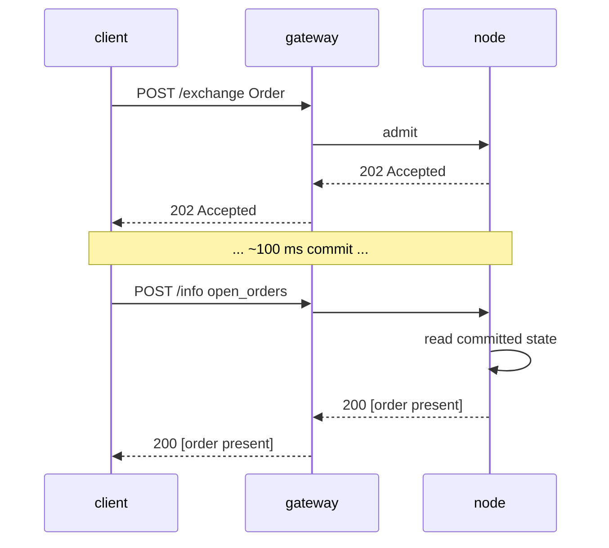

# `POST /info` — эндпоинт чтения и запросов

:::info
**Статус.** Форма **стабильна**. Типы запросов добавляются со временем; конверт зафиксирован.
:::

## Кратко {#tldr}

Единый эндпоинт, несколько типов. Диспетчеризация происходит по полю `type` тела запроса. Только чтение — никогда не изменяет состояние, подпись не требуется.

:::tip
**Разделение по продукту.** Запросы на чтение для бессрочных рынков описаны в разделе [запросы по бессрочным контрактам](./info/perpetuals.md); запросы для спота, спотовой маржи и Earn — в разделе [запросы по споту и марже](./info/spot.md). На этой странице описаны конверт, соглашения, чтение данных по аккаунтам/управлению/хранилищам/валидаторам.
:::

## URL {#url}

```
POST  https://api.<net>.mtf.exchange/info
```

| Путь | Формат данных |
|------|-----------|
| `POST /info` (шлюз) | MTF-native (этот документ) |

Шлюз обслуживает MTF-native `/info`. При самостоятельном запуске ноды тот же нативный
`/info` доступен напрямую по адресу `http://localhost:8080`.

## Конверт {#envelope}

Запрос:

```json
{ "type": "<query_type>", /* аргументы, специфичные для типа */ }
```

Ответ:

```json
{ "type": "<query_type>", "data": { /* специфично для типа */ } }
```

При неизвестном `type`: `400 Bad Request` с телом `{"error":"unknown info type: <X>"}`.
При неизвестном ресурсе (например, неизвестный id хранилища): `404 Not Found` с телом `{"error":"<resource> not found"}`.

## Типы запросов {#query-types}

### Статические сведения о ноде и версия протокола {#node_info}

Статические сведения о ноде + версия протокола. Параметры отсутствуют.

```json
{ "type": "node_info" }
```

Ответ:

```json
{
  "type": "node_info",
  "data": {
    "network":           "testnet",
    "chain_id":          114514,
    "protocol_version":  "1.0.0",
    "validator_index":   null,
    "build_commit":      "unknown",
    "version":           "0.0.1",
    "freeze_halt_supported": true,
    "uptime_seconds":    0
  }
}
```

| Поле | Тип | Описание |
|-------|------|-------------|
| `network` | `"devnet" \| "testnet" \| "mainnet"` | Вариант сети, определяется по `chain_id` (`31337`=devnet, `114514`=testnet, `8964`=mainnet) |
| `chain_id` | uint64 | Id цепочки EIP-712 — то же значение, которое должен использовать домен подписи `/exchange` |
| `protocol_version` | semver string | Версия проводного протокола |
| `validator_index` | uint32 \| null | Индекс данной ноды в активном наборе валидаторов; **ФЛАГ:** `null` до вызова `set_validator_index` рантаймом |
| `build_commit` | hex string | Опубликованный оператором идентификатор сборки; **ФЛАГ:** `"unknown"` до публикации |
| `version` | semver string | Версия ПО ноды, зафиксированная во время сборки. Один релиз использует одну `version` для всех своих бинарников — `build_commit` является уточнителем на уровне конкретной сборки |
| `freeze_halt_supported` | bool | Всегда `true` для данного бинарника — флаг возможности: нода поддерживает [`exchange_status.scheduled_freeze_height`](#exchange_status), корректно останавливаясь с кодом `77` после коммита высоты заморозки, чтобы супервизор ноды мог загрузить следующий релиз |
| `uptime_seconds` | uint64 | Время работы процесса; **ФЛАГ:** `0` до вызова `set_uptime_seconds` рантаймом |

Это поля **конкретной ноды** (идентификация / рантайм), а НЕ состояние консенсуса, поэтому они закономерно различаются у разных нод.

### Маржа, позиции и балансы аккаунта {#account_state}

Снимок состояния аккаунта.

```json
{ "type": "account_state", "address": "0x<addr>" }
```

| Аргумент | Тип | Обязателен |
|-----|------|----------|
| `address` | hex address | да |

**Неизвестный адрес** (никогда не встречавшийся в цепочке) возвращает **200** с полностью обнулённой
записью (`account_value:"0"`, пустые `positions` / `balances.spot`), а НЕ `404`.

Ответ (аккаунт, пополненный через фасет, без позиций):

```json
{
  "type": "account_state",
  "data": {
    "address":         "0x00000000000000000000000000000000000ca11e",
    "account_value":   "3000",
    "free_collateral": "3000",
    "maint_margin":    "0",
    "init_margin":     "0",
    "health":          "3000",
    "tier":            "Safe",
    "mode":            "Cross",
    "pm_enabled":      false,
    "positions": [],
    "balances": {
      "usdc": "3000",
      "spot": { "MTF": { "total": "10", "hold": "0" } }
    }
  }
}
```

Каждый токен в `balances.spot` представлен объектом `{total, hold}` (совместимость с HL): `hold` —
сумма, заблокированная в качестве обеспечения под отложенный спотовый ордер (эскроу), `total` —
полный баланс; доступная для использования сумма равна `total − hold`. Токен, полностью находящийся
в удержании, всё равно отображается. Для **лёгкого** чтения только маржинальных скаляров (без обхода
`positions` и сканирования балансов — оптимальный вариант для опроса состояния ликвидационного
здоровья) используйте [`margin_summary`](#margin_summary).

Аккаунт с открытыми позициями добавляет записи в `positions`:

```json
{
  "asset":             0,
  "size":              "100000000",
  "entry":             "67000.00",
  "upnl":              "5.00",
  "isolated":          false,
  "lev":               10,
  "liq":               "61000.00",
  "roe":               "0.0075",
  "funding":           "-0.12",
  "margin":            "201.00",
  "notional":          "6705.00"
}
```

| Поле | Тип | Описание |
|-------|------|-------------|
| `account_value` | Decimal string | Собственный капитал, включая зафиксированный PnL, **в плоскости целого USDC** (`"3000"` = 3000 USDC, НЕ базовые единицы) |
| `free_collateral` | Decimal string | Собственный капитал за вычетом начальной маржи, удерживаемой открытыми позициями |
| `maint_margin` | Decimal string | Σ используемой маржи по каждому активу (поддерживающей) |
| `init_margin` | Decimal string | Удерживаемое требование по начальной марже |
| `health` | Decimal string | `account_value − maint_margin` (со знаком; может быть отрицательным) |
| `tier` | enum | `"Safe"`, `"T0"`, `"T1"`, `"T2"`, `"T3"` (полоса BOLE соотношения `account_value / maint_margin`; `"Safe"` при отсутствии поддерживающей маржи) — см. [поуровневая ликвидация](../../concepts/tiered-liquidation.md) |
| `mode` | enum | `"Cross"`, `"Isolated"`, `"StrictIso"` (определяется по открытым позициям аккаунта) |
| `pm_enabled` | bool | Статус подключения портфельной маржи |
| `positions[*].asset` | uint32 | Id актива |
| `positions[*].size` | i128 string | Размер позиции со знаком в **сырых лотах** — `size / 10^sz_decimals` = целые единицы (`sz_decimals` — точность размера рынка, например 5 для BTC). Это плоскость РАЗМЕРА, ортогональная ценовой плоскости 1e8. |
| `positions[*].entry` | Decimal string | Цена входа за целую единицу = `\|entry_notional\| / \|real size\|`, **в плоскости целого USDC** |
| `positions[*].upnl` | Decimal string | PnL по рыночной оценке = `real size × mark − signed entry_notional`, **в плоскости целого USDC** (со знаком) |
| `positions[*].isolated` | bool | `true`, если только позиция не является кросс-маржинальной |
| `positions[*].lev` | uint8 | Максимальное кредитное плечо позиции |
| `positions[*].liq` | Decimal string | Цена (целый USDC), при которой данная позиция в одиночку приведёт аккаунт к поддерживающей марже — приближение для кросс-позиции с одним инструментом; `"0"` при нулевом размере / кредитном плече (цена ликвидации не определена) |
| `positions[*].roe` | Decimal string | `upnl / initial_margin` в виде десятичной дроби (`initial_margin = \|entry_notional\| / leverage`); `"0"` при нулевом кредитном плече / номинале |
| `positions[*].funding` | Decimal string | Начисленное, но не урегулированное финансирование по ноге, **в целом USDC** (со знаком); `real_size × (cumulative_funding − funding_entry)` — та же форма, в которой выплачивается урегулирование финансирования |
| `positions[*].margin` | Decimal string | Поддерживающая маржа, которую вносит нога, **в целом USDC**: `\|entry_notional\| × maint_margin_ratio` |
| `positions[*].notional` | Decimal string | Номинал позиции по рыночной оценке, **в целом USDC** (со знаком): `real_size × mark_px` |
| `positions[*].side` | enum \| absent | **Только для [режима хеджирования](../../concepts/hedge-mode.md)** — `"long"` / `"short"`, нога, о которой сообщает данный объект. **Отсутствует в одностороннем аккаунте** (единая *нетто*-позиция, у которой `size` может быть отрицательным). Хедж-аккаунт с обеими ногами по одному активу возвращает **два** объекта — по одному на каждую сторону. |
| `balances.usdc` | Decimal string | **Совпадает с `account_value`** (кросс-обеспечение в USDC), НЕ является отдельным спотовым балансом USDC |
| `balances.spot` | object | Спотовые балансы токенов, отличных от USDC, с ключом **по названию токена** (например, `"MTF"`); каждое значение — объект `{total, hold}` (`hold` = эскроу, заблокированный под отложенные спотовые ордера; доступно = `total − hold`); пусто при отсутствии |

### Облегчённая сводка только по марже аккаунта {#margin_summary}

**Только маржинальные скаляры** — `account_state` без обхода `positions[]` и
сканирования спотовых балансов. Оптимальный вариант для частого опроса состояния
ликвидационного здоровья (бот мониторинга рисков, автоматическое пополнение маржи),
когда детали позиций и балансов не нужны. Обязателен: `address` (0x hex).

```json
{ "type": "margin_summary", "address": "0x<addr>" }
```

Ответ (`data`): `address`, `account_value`, `free_collateral`,
`maint_margin`, `init_margin`, `health`, `tier`, `mode`, `pm_enabled` —
семантика полей идентична одноимённым полям
[`account_state`](#account_state) (вычисляются общим вспомогательным методом, поэтому значения никогда не расходятся).

### TVL, цена доли и стратегия хранилища {#vault_state}

Снимок состояния хранилища.

```json
{ "type": "vault_state", "vault": "0x<vault_addr>" }
```

Ответ:

```json
{
  "type": "vault_state",
  "data": {
    "vault":              "0x<addr>",
    "name":               "MFlux Conservative",
    "tvl":             "10000000000",
    "share_price":     "10500000",
    "depositor_count":    142,
    "high_water_mark": "10500000",
    "performance_fee_bps":1000,
    "lock_period_ms":     86400000,
    "strategy":           "MarketNeutral"
  }
}
```

### Состояние стейкинга и делегирования аккаунта {#staking_state}

```json
{ "type": "staking_state", "address": "0x<addr>" }
```

Ответ:

```json
{
  "type": "staking_state",
  "data": {
    "address":         "0x<addr>",
    "total_staked": "1000000000",
    "delegations": [
      {
        "validator":         "0x<val_addr>",
        "amount":         "500000000",
        "since_ts":          1735000000000,
        "pending_rewards":"1000000"
      }
    ],
    "pending_unstakes": [
      { "amount": "200000000", "matures_at_ts": 1735780000000 }
    ]
  }
}
```

### Комиссии мейкера и тейкера по объёмным уровням {#fee_schedule}

```json
{ "type": "fee_schedule" }
```

Ответ:

```json
{
  "type": "fee_schedule",
  "data": {
    "tiers": [
      { "volume_30d": "0",         "maker_bps": "2.0", "taker_bps": "5.0" },
      { "volume_30d": "100000000", "maker_bps": "1.5", "taker_bps": "4.5" },
      { "volume_30d": "1000000000","maker_bps": "1.0", "taker_bps": "4.0" }
    ],
    "builder_rebate_bps": "0.2",
    "burn_ratio":         "0.30",
    "referrer_share_bps": "1.0"
  }
}
```

Ставки комиссий — десятичные **базисные пункты** в виде строк с одним знаком после запятой (например, `"2.0"` = 2 б.п. = 0,02%, `"0.5"` = 0,5 б.п. = 0,005%), что позволяет задавать точность тоньше одного базисного пункта. `burn_ratio` — десятичная дробь (`"0.30"` = 30% комиссий сжигается). См. [комиссии](../../concepts/fees.md).

### Отложенные ордера аккаунта по всем книгам бессрочных контрактов {#open_orders}

Отложенные ордера аккаунта по всем книгам бессрочных контрактов.

```json
{ "type": "open_orders", "address": "0x<addr>" }
```

| Аргумент | Тип | Обязателен |
|-----|------|----------|
| `address` | hex address | да |

Аккаунт идентифицируется по `address` (0x hex). Отсутствие `address` →
`400 {"error":"missing field address"}`.

Ответ:

```json
{
  "type": "open_orders",
  "data": {
    "address":    "0x<addr>",
    "orders": [
      {
        "oid":          12345,
        "market_id":    0,
        "side":         "bid",
        "px":        "99000",
        "size":      "700",
        "cloid":        "0x000000000000000000000000cafef00d",
        "inserted_at_ms": 1700000000000
      }
    ]
  }
}
```

| Поле | Тип | Описание |
|-------|------|-------------|
| `address` | hex address | Разрешённый адрес аккаунта |
| `orders[*].oid` | uint64 | Серверный id ордера |
| `orders[*].market_id` | uint32 | Id актива / рынка, на котором стоит ордер |
| `orders[*].side` | `"bid"` / `"ask"` | Сторона ордера |
| `orders[*].px` | i128 string | Цена ожидания, десятичная строка с фиксированной точкой |
| `orders[*].size` | u128 string | Оставшийся размер, десятичная строка с фиксированной точкой |
| `orders[*].cloid` | hex string \| null | Клиентский id ордера, с которым он был выставлен (`0x` + 32 hex-символа); `null` если ордер был выставлен без него |
| `orders[*].inserted_at_ms` | uint64 | Временная метка размещения / вставки ордера (консенсусные мс) |

### История последних исполнений аккаунта {#user_fills}

История исполнений аккаунта, обслуживаемая напрямую из зафиксированного состояния ноды (ограниченное кольцо исполнений на аккаунт, встроенное в AppHash — внешний индексер не требуется).

```json
{ "type": "user_fills", "address": "0x<addr>" }
```

| Аргумент | Тип | Обязателен | Описание |
|-----|------|----------|-------------|
| `address` | hex address | да | Адрес аккаунта |
| `limit` | uint32 | нет | Ограничить количество возвращаемых **самых последних** записей; при отсутствии / `0` — полное кольцо |

Аккаунт идентифицируется по `address` (0x hex). Отсутствие `address` →
`400 {"error":"missing field address"}`.

Ответ:

```json
{
  "type": "user_fills",
  "data": {
    "address":    "0x<addr>",
    "fills": [
      {
        "coin":           "BTC",
        "side":           "B",
        "px":             "67042.50",
        "sz":             "0.125",
        "time":           1700000000555,
        "oid":            12345,
        "tid":            90123,
        "fee":            "4.19",
        "closed_pnl":     "0",
        "dir":            "Open Long",
        "start_position": "0",
        "block":          562,
        "hash":           "0x2315b79b9e82c2deb279a59448bf7841f3767d30d874e5b544d75bb9fd1e9b0c"
      }
    ]
  }
}
```

Записи упорядочены от старых к новым (последние — в конце). Кольцо ограничено, поэтому
это окно последних данных, а не полная история. При отсутствии исполнений на аккаунте
возвращается `"fills": []`.

| Поле | Тип | Описание |
|-------|------|-------------|
| `address` | hex address | Разрешённый адрес аккаунта |
| `fills[*].coin` | string | Символ рынка, на котором произошло исполнение |
| `fills[*].side` | `"B"` / `"A"` | Сторона токена данной ноги — `"B"` = покупка/бид, `"A"` = продажа/аск |
| `fills[*].px` | Decimal string | Цена исполнения, **десятичный USDC** (в читаемом формате) |
| `fills[*].sz` | Decimal string | Исполненный объём, **базовые единицы** (целые единицы) |
| `fills[*].time` | uint64 | Временная метка исполнения (консенсусные мс) |
| `fills[*].oid` | uint64 | Id ордера данной стороны |
| `fills[*].tid` | uint64 | Детерминированный id сделки (общий для обеих ног сделки) |
| `fills[*].fee` | Decimal string | Комиссия, уплаченная данной стороной, **десятичный USDC** |
| `fills[*].closed_pnl` | Decimal string | Зафиксированный PnL по закрытой части, **десятичный USDC** (со знаком) |
| `fills[*].dir` | string | Метка направления, например `"Open Long"`, `"Close Short"`, `"Open Short"`, `"Close Long"` |
| `fills[*].start_position` | Decimal string | Размер ноги со знаком ДО исполнения, **базовые единицы** (целые единицы, со знаком) |
| `fills[*].block` | uint64 | Высота зафиксированного блока, в котором урегулировано исполнение (локатор в цепочке) |
| `fills[*].hash` | hex string | Хэш транзакции исходного ордера, шестнадцатеричная строка с префиксом `0x` — позволяет отследить исполнение в цепочке |

### История исполнений с фильтром по временному окну {#user_fills_by_time}

Аналог [`user_fills`](#user_fills), но с фильтрацией по временному окну консенсусного поля `time` каждой записи. Форма записи сделки та же.

```json
{ "type": "user_fills_by_time", "address": "0x<addr>", "start_time": 1700000000000, "end_time": 1700003600000 }
```

| Аргумент | Тип | Обязательный | Описание |
|-----|------|----------|-------------|
| `address` | hex address | да | Адрес аккаунта |
| `start_time` | uint64 | нет | Начало окна (мс, включительно); фильтрация по полю `time` сделки. Если отсутствует — нижняя граница не ограничена |
| `end_time` | uint64 | нет | Конец окна (мс, включительно). Если отсутствует — верхняя граница не ограничена |

Ответ:

```json
{
  "type": "user_fills_by_time",
  "data": {
    "address":    "0x<addr>",
    "start_time": 1700000000000,
    "end_time":   1700003600000,
    "fills": [ /* same record shape as user_fills */ ]
  }
}
```

| Поле | Тип | Описание |
|-------|------|-------------|
| `address` | hex address | Разрешённый адрес аккаунта |
| `start_time` | uint64 \| null | Начало окна из запроса (`null`, если не было указано) |
| `end_time` | uint64 \| null | Конец окна из запроса (`null`, если не было указано) |
| `fills` | array | Записи сделок внутри окна (форма каждой записи аналогична [`user_fills`](#user_fills)), в порядке от старых к новым |

### Просмотр жизненного цикла одного ордера {#order_status}

Просмотр жизненного цикла конкретного ордера по `oid` (серверный идентификатор ордера) **или** `cloid` (клиентский идентификатор ордера). Читает активные книги, реестр триггеров и кольцевой буфер подтверждённых сделок — всё это зафиксированное состояние на узле.

```json
{ "type": "order_status", "oid": 12345 }
```

Или по клиентскому идентификатору ордера:

```json
{ "type": "order_status", "cloid": "0x000000000000000000000000cafef00d" }
```

| Аргумент | Тип | Обязательный | Описание |
|-----|------|----------|-------------|
| `oid` | uint64 | одно из `oid` / `cloid` | Серверный идентификатор ордера |
| `cloid` | hex string | одно из `oid` / `cloid` | Клиентский идентификатор ордера — `0x` + 32 шестнадцатеричных символа |

Если ни одно поле не указано — `400 {"error":"missing field oid or cloid"}`. Некорректный `cloid` → `400`. Поиск останавливается на первом совпадении в следующем порядке: активный ордер в книге → запаркованный триггер → завершённая сделка → неизвестный.

Поле `data.status` определяет ветку:

`"resting"` — активный ордер, открытый в книге бессрочного контракта или спот-рынка:

```json
{
  "type": "order_status",
  "data": {
    "status": "resting",
    "order": {
      "oid":            12345,
      "market_id":      0,
      "side":           "bid",
      "px":             "67000",
      "size":           "700",
      "inserted_at_ms": 1700000000000,
      "cloid":          "0x000000000000000000000000cafef00d"
    }
  }
}
```

`"triggered"` — запаркованный ордер TP/SL/стоп-вход, ожидающий пересечения маркировочной цены:

```json
{
  "type": "order_status",
  "data": {
    "status": "triggered",
    "trigger": {
      "oid":              12345,
      "market_id":        0,
      "side":             "ask",
      "trigger_px":       "66000",
      "trigger_above":    false,
      "size":             "700",
      "registered_at_ms": 1700000000000,
      "fired":            false
    }
  }
}
```

`"filled"` — последнее совпадающее исполнение в кольцевом буфере аккаунта (объект `fill` имеет ту же форму, что и одна запись [`user_fills`](#user_fills)):

```json
{
  "type": "order_status",
  "data": {
    "status": "filled",
    "fill": { /* same shape as a user_fills fill record */ }
  }
}
```

`"unknown"` — ордер никогда не встречался или был вытеснен из ограниченного кольцевого буфера (запрос только по `cloid`, не совпавший ни с одним активным/триггерным ордером, тоже попадает сюда, так как реестр триггеров и кольцевой буфер сделок индексируются по `oid`):

```json
{ "type": "order_status", "data": { "status": "unknown" } }
```

| Поле | Тип | Описание |
|-------|------|-------------|
| `status` | `"resting" \| "triggered" \| "filled" \| "unknown"` | Разрешённое состояние жизненного цикла |
| `order` | object | Присутствует при `"resting"` — `oid`, `market_id`, `side` (`"bid"`/`"ask"`), `px` / `size` (десятичные строки с фиксированной точкой), `inserted_at_ms`, `cloid` (hex \| null) |
| `trigger` | object | Присутствует при `"triggered"` — `oid`, `market_id`, `side`, `trigger_px` / `size` (десятичные строки с фиксированной точкой), `trigger_above` (bool: исполнить при пересечении маркировочной цены вверх), `registered_at_ms`, `fired` (bool) |
| `fill` | object | Присутствует при `"filled"` — совпадающая запись сделки (см. [`user_fills`](#user_fills)) |

### Метаданные последнего зафиксированного блока {#block_info}

Метаданные подтверждённого блока. Обязательных аргументов нет (`height` принимается, но игнорируется — состояние чтения хранит только последний зафиксированный контекст).

```json
{ "type": "block_info" }
```

Ответ:

```json
{
  "type": "block_info",
  "data": {
    "height":       562,
    "round":        562,
    "epoch":        0,
    "timestamp_ms": 1780475491562,
    "block_hash":   "0x2315b79b9e82c2deb279a59448bf7841f3767d30d874e5b544d75bb9fd1e9b0c"
  }
}
```

| Поле | Тип | Описание |
|-------|------|-------------|
| `height` | uint64 | Высота последнего подтверждённого блока |
| `round` | uint64 | Раунд консенсуса данного блока |
| `epoch` | uint64 | Текущая эпоха |
| `timestamp_ms` | uint64 | Временна́я метка блока (консенсусные мс) |
| `block_hash` | hex string (32 bytes) | Реальный хэш подтверждённого блока (теперь передаётся в состояние чтения — больше не используется заглушка из нулей) |

### Одобренные агентские кошельки аккаунта {#agents}

Одобренные агентские / API-кошельки для аккаунта.

```json
{ "type": "agents", "address": "0x<addr>" }
```

| Аргумент | Тип | Обязательный |
|-----|------|----------|
| `address` | hex address | да |

Отсутствие `address` → `400 {"error":"missing field address"}`.

Ответ:

```json
{
  "type": "agents",
  "data": {
    "address":    "0x<master>",
    "agents": [
      { "agent": "0x<agent_addr>", "name": "trading-bot", "expires_at_ms": 1700000500000 }
    ]
  }
}
```

| Поле | Тип | Описание |
|-------|------|-------------|
| `address` | hex address | Разрешённый адрес главного кошелька |
| `agents[*].agent` | hex address | Адрес одобренного агентского кошелька |
| `agents[*].name` | string \| null | Метка агента, заданная при одобрении; `null`, если не указана |
| `agents[*].expires_at_ms` | uint64 \| null | Срок действия одобрения агента (консенсусные мс); `null` для бессрочного одобрения |

### Список субаккаунтов аккаунта {#sub_accounts}

Субаккаунты аккаунта.

```json
{ "type": "sub_accounts", "address": "0x<addr>" }
```

| Аргумент | Тип | Обязательный |
|-----|------|----------|
| `address` | hex address | да |

Отсутствие `address` → `400 {"error":"missing field address"}`.

Ответ:

```json
{
  "type": "sub_accounts",
  "data": {
    "address":    "0x<parent>",
    "sub_accounts": [
      { "index": 0, "address": "0x<sub_addr>" }
    ]
  }
}
```

| Поле | Тип | Описание |
|-------|------|-------------|
| `address` | hex address | Разрешённый адрес родительского кошелька |
| `sub_accounts[*].index` | uint32 | Индекс субаккаунта в рамках родительского |
| `sub_accounts[*].address` | hex address | Адрес субаккаунта |

### Общепротокольные счётчики и аккумуляторы {#protocol_metrics}

Общепротокольные подтверждённые аккумуляторы и счётчики. Параметров нет. Все поля читаются напрямую из подтверждённого состояния `Exchange` (счётчики, пулы комиссий, резервы BOLE, стейкинг) — никаких вычислений на основе матчинг-движка или оракула, поэтому результат воспроизводится при повторном проигрывании точно.

```json
{ "type": "protocol_metrics" }
```

Ответ:

```json
{
  "type": "protocol_metrics",
  "data": {
    "counters": {
      "total_orders":               1000,
      "total_fills":                750,
      "total_liquidations":         3,
      "total_deposits":             40,
      "total_withdrawals":          12,
      "total_vault_transfers":      0,
      "total_sub_account_transfers":0
    },
    "fee_pools": {
      "burned":         "8000",
      "mflux_vault":    "0",
      "validator_pool": "1000",
      "treasury":       "1000",
      "burned_mtf":     "55"
    },
    "insurance_fund_total":    "750",
    "treasury_backstop_total": "9000",
    "bole_pool": {
      "total_deposits":  "20000",
      "shortfall_total": "7"
    },
    "open_interest_total_1e8": "1500000",
    "staking": {
      "total_stake":   "100",
      "n_validators":  1,
      "n_active":      1,
      "n_jailed":      0,
      "current_epoch": 4
    },
    "counts": {
      "n_markets":             1,
      "n_spot_pairs":          5,
      "n_user_vaults":         0,
      "n_accounts_with_state": 12
    }
  }
}
```

| Поле | Тип | Описание |
|-------|------|-------------|
| `counters.total_orders` | uint64 | Суммарное количество принятых ордеров за всё время |
| `counters.total_fills` | uint64 | Суммарное количество сделок за всё время (единственный детализированный торговый сигнал — **количество**, а не объём в деньгах) |
| `counters.total_liquidations` | uint64 | Суммарное количество ликвидаций за всё время |
| `counters.total_deposits` / `total_withdrawals` | uint64 | Суммарное количество депозитов / выводов за всё время |
| `counters.total_vault_transfers` | uint64 | Суммарное количество переводов в/из вaultа за всё время |
| `counters.total_sub_account_transfers` | uint64 | Суммарное количество переводов между субаккаунтами за всё время |
| `fee_pools.burned` | Decimal string | Накопленный объём USDC, направленного на выкуп и сжигание (в целых USDC) |
| `fee_pools.mflux_vault` | Decimal string | Накопленное начисление комиссий в MFlux-vault (`"0"` — доля vault обнулена) |
| `fee_pools.validator_pool` | Decimal string | Накопленное начисление комиссий в пул валидаторов (в целых USDC) |
| `fee_pools.treasury` | Decimal string | Накопленное начисление комиссий в казначейство (в целых USDC) |
| `fee_pools.burned_mtf` | Decimal string | Накопленный объём MTF, погашённого исполнителем выкупа |
| `insurance_fund_total` | Decimal string | Σ резервов `bole_pool.insurance_fund` по всем активам (в целых USDC) |
| `treasury_backstop_total` | Decimal string | Σ резервов `bole_pool.treasury_backstop` по всем активам (в целых USDC) |
| `bole_pool.total_deposits` | Decimal string | Суммарные депозиты в кредитный пул BOLE (в целых USDC) |
| `bole_pool.shortfall_total` | Decimal string | Σ остаточных безнадёжных долгов, оставшихся после применения каскада ADL → страховой фонд → казначейство |
| `open_interest_total_1e8` | u128 string | Σ открытого интереса по всем рынкам, **плоскость книги 1e8** (обозначено `_1e8`, НЕ целые USDC) |
| `staking.total_stake` | Decimal string | Суммарный застейканный MTF (в целых MTF) |
| `staking.n_validators` | uint64 | Валидаторы в подтверждённом наборе |
| `staking.n_active` | uint64 | Активные валидаторы в текущей эпохе |
| `staking.n_jailed` | uint64 | Валидаторы, находящиеся в тюрьме в данный момент |
| `staking.current_epoch` | uint64 | Текущая эпоха стейкинга |
| `counts.n_markets` | uint64 | Зарегистрированные рынки бессрочных контрактов MIP-3 (`mip3_market_specs`) |
| `counts.n_spot_pairs` | uint64 | Зарегистрированные спот-пары (`mip3_spot_pair_specs`) |
| `counts.n_user_vaults` | uint64 | Зарегистрированные пользовательские vault'ы |
| `counts.n_accounts_with_state` | uint64 | Аккаунты с подтверждённым состоянием пользователя |

:::info
**Накопленный объём торгов в деньгах отсутствует.** Движок отслеживает **30-дневный объём комиссий** по каждому пользователю (см. [`user_fees`](#user_fees)) и суммарное **количество** сделок за всё время (`counters.total_fills`) — **общепротокольного нарастающего аккумулятора торгового объёма в USD нет**, поэтому этот запрос намеренно его не содержит, чтобы не создавать видимость существующего суммарного объёма. Счётчики — это монотонные показатели активности, а не денежные величины.
:::

State source: `locus.{counters, fee_tracker.fee_distribution, bole_pool}` + `c_staking` + registry sizes.

### Уровень комиссии и объём аккаунта {#user_fees}

Комиссионный уровень и объём по конкретному аккаунту. Обязательно: `account_id` (u64) **или** `address` (0x hex).

```json
{ "type": "user_fees", "account_id": 42 }
```

| Аргумент | Тип | Обязательный |
|-----|------|----------|
| `account_id` | uint64 | одно из `account_id` / `address` |
| `address` | hex address | одно из `account_id` / `address` |

Если ни одно поле не указано — `400`. Аккаунт без истории комиссий возвращает **200** с нулевыми объёмами и базовым уровнем в б.п. — стандартное поведение с обнулением.

Ответ:

```json
{
  "type": "user_fees",
  "data": {
    "address":          "0x<addr>",
    "account_id":       42,
    "taker_volume_30d": "1250000",
    "maker_volume_30d": "800000",
    "vip_tier":         2,
    "mm_tier":          1,
    "referrer":         "0x<referrer>",
    "referrer_credit":  "420",
    "maker_bps":        1,
    "taker_bps":        3
  }
}
```

| Поле | Тип | Описание |
|-------|------|-------------|
| `address` | hex address | Разрешённый адрес аккаунта |
| `account_id` | uint64 | Возвращается только если в запросе использовался `account_id` |
| `taker_volume_30d` | Decimal string | Скользящий 30-дневный объём тейкера (в целых USDC) |
| `maker_volume_30d` | Decimal string | Скользящий 30-дневный объём мейкера (в целых USDC) |
| `vip_tier` | uint | Подтверждённый VIP-уровень пользователя; `0` при отсутствии данных |
| `mm_tier` | uint | Подтверждённый уровень маркетмейкера пользователя; `0` при отсутствии данных |
| `referrer` | hex address \| null | Реферер данного аккаунта, если установлен; иначе `null` |
| `referrer_credit` | Decimal string | Σ накопленного реферального вознаграждения *для* данного адреса как реферера (в целых USDC) |
| `maker_bps` | uint | **Эффективные** б.п. комиссии мейкера, рассчитанные по подтверждённой таблице уровней [`fee_schedule`](#fee_schedule) исходя из 30-дневного объёма мейкера данного аккаунта |
| `taker_bps` | uint | **Эффективные** б.п. комиссии тейкера, рассчитанные по подтверждённой таблице исходя из 30-дневного объёма тейкера данного аккаунта |

Эффективные `maker_bps` / `taker_bps` определяются по каждой стороне из подтверждённой таблицы объёмных уровней ([`fee_schedule`](#fee_schedule)) — ставка мейкера по объёму мейкера аккаунта, ставка тейкера по объёму тейкера — с использованием той же процедуры, что применяется при расчётах, поэтому указанные б.п. совпадают с тем, что будет списано с аккаунта. Переопределение ставки для конкретного рынка через спецификацию MIP-3 **здесь не отражается**: это базовая межрыночная ставка. `vip_tier` / `mm_tier` остаются подтверждёнными индексами уровней пользователя и являются самостоятельным сигналом, отображаемым наряду с эффективными б.п.

State source: `locus.fee_tracker.{user_to_taker_volume_30d, user_to_maker_volume_30d, user_to_vip_tier, user_to_mm_tier, referee_to_referrer, referrer_credit}` + the committed volume-tier ladder.

### Эффективный APR стейкинга и его входные параметры {#staking_apr}

Эффективная годовая ставка эмиссии стейкинга и зафиксированные входные параметры. Параметры не требуются.

```json
{ "type": "staking_apr" }
```

Ответ:

```json
{
  "type": "staking_apr",
  "data": {
    "total_stake":             "1000000",
    "effective_apr":           "0.08",
    "effective_apr_bps":       "800",
    "governance_rate_bps":     800,
    "emission_floor_stake":    "50000000",
    "n_active_validators":     1,
    "current_epoch":           2,
    "is_gross_pre_commission": true
  }
}
```

| Поле | Тип | Описание |
|-------|------|-------------|
| `total_stake` | Decimal string | Суммарный стейк MTF (в целых MTF) |
| `effective_apr` | Decimal string | Годовая ставка эмиссии, фактически применяемая эффектом вознаграждения в начале блока (дробное значение) |
| `effective_apr_bps` | Decimal string | `effective_apr × 10_000`, усечённое |
| `governance_rate_bps` | uint | Зафиксированный `reward_rate_bps`, установленный управлением, — см. флаг |
| `emission_floor_stake` | uint string | Пороговый стейк (`50M` MTF), ниже которого ставка постоянна |
| `n_active_validators` | uint64 | Валидаторы, активные в текущей эпохе |
| `current_epoch` | uint64 | Текущая эпоха стейкинга |
| `is_gross_pre_commission` | bool | Всегда `true` — APR является валовым, до вычета комиссии валидатора |

`effective_apr` — кривая, по которой эффект вознаграждения в начале блока вычисляет ставку:

```text
effective_apr = 0.08 × √( 50M / max(total_stake, 50M) )
```

то есть **фиксированные 8%** при объёме стейка на уровне 50M MTF или ниже, с убыванием ∝ 1/√stake выше этого порога (например,
суммарный стейк = 200M ⇒ в 4× больше порога ⇒ соотношение 1/4 ⇒ √ = 1/2 ⇒ 4% / 400 bps).

:::warning
**`governance_rate_bps` зафиксирован, однако НЕ используется эффектом вознаграждения.** Эффект вознаграждения вычисляет ставку выплаты по **кривой стейка** выше, а не по `reward_rate_bps`. Оба значения публикуются, чтобы расхождение было наблюдаемым, а не скрытым — эффективная ставка выплаты APR — это `effective_apr`, а не `governance_rate_bps`. При этом `effective_apr` является **валовой ставкой эмиссии** (`is_gross_pre_commission: true`): чистый APR отдельного делегатора составляет `effective_apr × (1 − commission)`.
:::

Источник состояния: `c_staking.{total_stake, reward_rate_bps, current_epoch, validators}` + кривая эмиссии.

### Подмножество источников оракула для рынка {#oracle_sources}

Зафиксированное подмножество источников оракула для рынка. Рынок определяется по `coin` (символ).

```json
{ "type": "oracle_sources", "coin": "BTC" }
```

| Аргумент | Тип | Обязательный |
|-----|------|----------|
| `coin` | symbol | да |

Отсутствие `coin` → `400 {"error":"missing field coin"}`; неизвестный рынок →
`404 {"error":"market not found"}`.

Ответ:

```json
{
  "type": "oracle_sources",
  "data": {
    "coin":              "BTC",
    "oracle_set":        true,
    "source_count":      10,
    "num_sources":       10,
    "enabled_sources":   [0, 1, 2, 3, 4, 5, 6, 7, 8, 9],
    "subset_mask":       1023,
    "weights_committed": false
  }
}
```

| Поле | Тип | Описание |
|-------|------|-------------|
| `coin` | string | Эхо-ответ / разрешённый символ рынка |
| `oracle_set` | bool | Был ли деплоером явно подтверждён набор через `SetOracle` |
| `source_count` | uint64 | Количество активных источников (число установленных бит маски) |
| `num_sources` | uint8 | Общее количество слотов источников (`NUM_ORACLE_SOURCES = 10`) |
| `enabled_sources` | uint8[] | Индексы установленных бит маски подмножества (активные слоты источников) |
| `subset_mask` | uint16 | Зафиксированная 10-битная `oracle_source_subset_mask` (бит `i` установлен ⇒ источник `i` участвует в вычислении медианы) |
| `weights_committed` | bool | Всегда `false` — веса отдельных источников НЕ зафиксированы (см. флаг) |

:::warning
**На блокчейне хранится только числовая битовая маска — НАИМЕНОВАНИЯ и ВЕСА источников НЕ зафиксированы** (`weights_committed: false`). Идентификаторы 10 источников закреплены в протоколе вне сети, их веса также фиксированы протоколом, поэтому в зафиксированном состоянии присутствует только битовая маска подмножества. Данный запрос возвращает `enabled_sources` как **индексы битов**, а не наименования площадок, и не включает список весов по отдельным площадкам вместо того, чтобы их синтезировать.
:::

Источник состояния: `mip3_market_specs[asset].{oracle_source_subset_mask, oracle_set}`.

## Типы запросов управления {#governance-query-types}

Интерфейс управления на блокчейне: живая машина голосования (`gov_state`), представление ожидающих предложений по всем категориям с расстоянием до кворума (`gov_proposals`) и журнал аудита принятых параметров (`gov_history`). Все запросы читают зафиксированное состояние `Exchange` и используют единый конверт `{type, data}`. Кворум по стейку составляет ⅔ (взвешенный по стейку); **исключённые (jailed)** валидаторы не учитываются в знаменателе активного стейка и в каждом подсчёте голосов, что соответствует проверке принятия решений на блокчейне.

### Текущее состояние управления и параметры {#gov_state}

Живой интерфейс управления — контекст кворума по стейку, ожидающие раунды голосований по изменению параметров, открытые предложения и ТЕКУЩЕЕ значение каждого управляемого параметра. Параметры не требуются.

```json
{ "type": "gov_state" }
```

Ответ:

```json
{
  "type": "gov_state",
  "data": {
    "total_stake":  "150000",
    "quorum_bps":   6667,
    "quorum_stake": "100005",
    "pending_vote_global": [
      {
        "kind":          "set_reward_rate_bps",
        "kind_id":       3,
        "votes": [
          { "validator": "0x<val>", "value": "900", "stake": "60000", "submitted_at_ms": 1700000000000 }
        ],
        "leading_stake": "60000"
      }
    ],
    "open_proposals": [
      { "proposal_id": 5, "voters": 2, "aye_stake": "90000", "nay_stake": "30000" }
    ],
    "params": {
      "reward_rate_bps":   800,
      "default_taker_bps": 5,
      "default_maker_bps": 2,
      "burn_bps":          8000
    },
    "oracle_weight_overrides": [
      { "asset_id": 0, "weights": [1000, 1000, 1000] }
    ]
  }
}
```

| Поле | Тип | Описание |
|-------|------|-------------|
| `total_stake` | decimal string | Σ стейк по всем валидаторам |
| `quorum_bps` | uint | Порог кворума ⅔ в bps (`6667`) |
| `quorum_stake` | decimal string | Стейк, необходимый для принятия решения (`total_stake × quorum_bps / 10000`) |
| `pending_vote_global[*].kind` | string | Наименование управляемого параметра (snake_case), например `"set_reward_rate_bps"` |
| `pending_vote_global[*].kind_id` | uint | Числовой идентификатор типа параметра |
| `pending_vote_global[*].votes[*].validator` | hex address | Голосующий валидатор |
| `pending_vote_global[*].votes[*].value` | decimal string | Декодированное предлагаемое значение (hex `0x…`, если содержимое непрозрачно) |
| `pending_vote_global[*].votes[*].stake` | decimal string | Стейк голосующего |
| `pending_vote_global[*].votes[*].submitted_at_ms` | uint64 | Временная метка подачи голоса (мс консенсуса) |
| `pending_vote_global[*].leading_stake` | decimal string | Наибольший стейк, собранный за единое содержимое в данном раунде |
| `open_proposals[*].proposal_id` | uint64 | Идентификатор раунда предложения |
| `open_proposals[*].voters` | uint64 | Количество поданных голосов |
| `open_proposals[*].aye_stake` / `nay_stake` | decimal string | Стейк, голосующий «за» / «против» |
| `params` | object | Текущее значение каждого управляемого параметра (каждый — зафиксированный скаляр) |
| `oracle_weight_overrides[*].asset_id` | uint32 | Актив с индивидуальным переопределением весов оракула |
| `oracle_weight_overrides[*].weights` | uint[] | Зафиксированные веса по каждому источнику для данного актива |

Объект `params` содержит полный набор управляемых параметров, которыми может оперировать машина голосования (распределение комиссий, настройки стейкинга, лимиты MIP-3, риск-кэпы, период / кэп финансирования по каждому активу, флаги спот / EVM / моста, набор отключённых EVM-прекомпилов и т. д.); каждое значение является живым зафиксированным значением.

### Активные предложения по управлению и статус кворума {#gov_proposals}

Все АКТИВНЫЕ предложения по управлению по ВСЕМ категориям голосования (не только
прямые голосования по параметрам), каждое с живым подсчётом стейка по содержимому и расстоянием до кворума ⅔. Представление типа «что сейчас ставится на голосование и насколько близко к принятию» в разрезе всех категорий. Параметры не требуются.

```json
{ "type": "gov_proposals" }
```

Ответ:

```json
{
  "type": "gov_proposals",
  "data": {
    "total_active_stake":  "120000",
    "quorum_bps":          6667,
    "quorum_needed_stake": "80004",
    "proposals": [
      {
        "round":         1000003,
        "category":      "vote_global",
        "sub_id":        3,
        "proposer":      "0x<val>",
        "created_at_ms": 1700000000000,
        "voter_count":   1,
        "leading_stake": "60000",
        "meets_quorum":  false,
        "payloads": [
          { "payload_hex": "0392…", "stake": "60000", "meets_quorum": false }
        ],
        "proposal": {
          "kind":         3,
          "kind_name":    "set_reward_rate_bps",
          "value":        "900",
          "title":        "Raise staking rewards",
          "proposer":     "0x<val>",
          "opened_at_ms": 1700000000000
        }
      }
    ]
  }
}
```

| Поле | Тип | Описание |
|-------|------|-------------|
| `total_active_stake` | decimal string | Σ стейк незаблокированных (не jailed) валидаторов (знаменатель кворума) |
| `quorum_bps` | uint | Порог кворума ⅔ в bps (`6667`) |
| `quorum_needed_stake` | decimal string | Стейк, который должен собрать единый вариант содержимого для принятия |
| `proposals[*].round` | uint64 | Синтетический идентификатор раунда голосования |
| `proposals[*].category` | string | Категория голосования, например `"gov_propose"`, `"vote_global"`, `"dynamic_risk"`, `"treasury"`, `"metaliquidity"`, `"oracle_weights"`, `"funding_formula"`, `"spot_margin"` |
| `proposals[*].sub_id` | uint64 | Идентификатор относительно категории (раунд минус базовое значение диапазона категории) |
| `proposals[*].proposer` | hex address \| null | Первый проголосовавший (прокси-инициатор) |
| `proposals[*].created_at_ms` | uint64 | Временная метка первого голоса (мс консенсуса) |
| `proposals[*].voter_count` | uint64 | Количество поданных голосов в раунде |
| `proposals[*].leading_stake` | decimal string | Наибольший стейк, собранный за единый вариант содержимого |
| `proposals[*].meets_quorum` | bool | Набирает ли ведущий вариант кворум ⅔ |
| `proposals[*].payloads[*].payload_hex` | hex string | Отдельный проголосованный вариант содержимого (без префикса `0x`) |
| `proposals[*].payloads[*].stake` | decimal string | Активный стейк, собранный за данный вариант |
| `proposals[*].payloads[*].meets_quorum` | bool | Набирает ли данный вариант кворум самостоятельно |
| `proposals[*].proposal` | object \| null | Типизированная запись предложения, если раунд был открыт через предложение, иначе `null` |
| `proposals[*].proposal.kind` | uint | Числовой идентификатор типа управляемого параметра |
| `proposals[*].proposal.kind_name` | string \| null | Декодированное наименование типа (snake_case), `null` если неизвестно |
| `proposals[*].proposal.value` | decimal string | Предлагаемое значение |
| `proposals[*].proposal.title` | string | Читаемое название предложения |
| `proposals[*].proposal.proposer` | hex address | Аккаунт, открывший предложение |
| `proposals[*].proposal.opened_at_ms` | uint64 | Временная метка открытия предложения (мс консенсуса) |

### История принятых изменений параметров управления {#gov_history}

Журнал аудита принятых решений по управлению (ограниченное кольцо, начиная с наиболее старых записей) — каждая запись доказывает, что параметр БЫЛ ИЗМЕНЁН посредством управления на блокчейне относительно первоначального значения. Параметры не требуются. Дополняет `gov_proposals` (сторона ОЖИДАЮЩИХ решений).

```json
{ "type": "gov_history" }
```

Ответ:

```json
{
  "type": "gov_history",
  "data": {
    "count": 1,
    "enacted": [
      {
        "round":         1000003,
        "kind":          3,
        "kind_name":     "set_reward_rate_bps",
        "value":         "900",
        "via":           "vote_global",
        "enacted_at_ms": 1700000900000,
        "description":   "reward_rate_bps -> 900"
      }
    ]
  }
}
```

| Поле | Тип | Описание |
|-------|------|-------------|
| `count` | uint | Количество записей в кольце |
| `enacted[*].round` | uint64 | Синтетический раунд голосования, в котором решение было принято |
| `enacted[*].kind` | uint | Числовой идентификатор типа управляемого параметра |
| `enacted[*].kind_name` | string \| null | Декодированное наименование типа (snake_case), `null` если неизвестно |
| `enacted[*].value` | decimal string | Принятое значение |
| `enacted[*].via` | `"proposal" \| "vote_global" \| "other"` | Источник принятия — отслеживается предложением vs прямое голосование по параметру |
| `enacted[*].enacted_at_ms` | uint64 | Временная метка принятия решения (мс консенсуса) |
| `enacted[*].description` | string | Читаемое описание изменения |

Кольцо ограничено размером журнала принятых решений на блокчейне, поэтому это актуальное окно, а не полная история.

## Расширенные типы запросов (RFQ / FBA / портфельная маржа) {#advanced-query-types-rfq--fba--portfolio-margin}

Эти запросы читают живое состояние движков RFQ, FBA и портфельной маржи — они дополняют флаги `market_info.fba_enabled` / `account_state.pm_enabled` непосредственно состоянием движков. Тот же конверт `{type, data}` и нативные соглашения MTF. **Ценовая плоскость:** цены / объёмы RFQ и FBA являются необработанными целочисленными строками в **формате 1e8 с фиксированной точкой** (плоскость книги / ордеров, идентичная [`open_orders`](#open_orders) / [`l2_book`](./info/perpetuals.md#l2_book)),
**не** целые USDC; величины портфельной маржи — целочисленные строки в **центах USD**.

### Открытые RFQ-запросы и котировки мейкеров {#rfq_open}

Все открытые RFQ-запросы и котировки маркет-мейкеров. Параметры не требуются. См. [концепцию RFQ](../../concepts/rfq.md).

```json
{ "type": "rfq_open" }
```

Ответ:

```json
{
  "type": "rfq_open",
  "data": {
    "rfqs": [
      {
        "rfq_id":              1,
        "market_id":           7,
        "side":                "bid",
        "size":                "1000",
        "requester":           "0x<addr>",
        "requester_stp_group": 42,
        "expiry_ms":           5000,
        "limit_px":            "105",
        "created_at_ms":       10,
        "quotes": [
          {
            "maker":           "0x<addr>",
            "maker_stp_group": null,
            "price":           "104",
            "max_size":        "800",
            "valid_until_ms":  4000,
            "submitted_at_ms": 20
          }
        ]
      }
    ]
  }
}
```

`rfqs` перебирает записи детерминированно по `rfq_id`. Пустой движок возвращает `"rfqs": []`.

| Поле | Тип | Описание |
|-------|------|-------------|
| `rfqs[*].rfq_id` | uint64 | Идентификатор RFQ-запроса |
| `rfqs[*].market_id` | uint32 | Идентификатор актива / рынка, для которого создан RFQ |
| `rfqs[*].side` | `"bid"` / `"ask"` | Сторона, которую хочет занять запрашивающая сторона |
| `rfqs[*].size` | u128 string | Запрашиваемый объём, фиксированная точка 1e8 |
| `rfqs[*].requester` | hex address | Запрашивающий аккаунт |
| `rfqs[*].requester_stp_group` | uint \| null | Группа защиты от самоисполнения запрашивающей стороны; `null` если не задана |
| `rfqs[*].expiry_ms` | uint64 | Временная метка истечения срока RFQ (мс консенсуса) |
| `rfqs[*].limit_px` | i128 string \| null | Лимитная цена запрашивающей стороны, фиксированная точка 1e8; `null` если не задана |
| `rfqs[*].created_at_ms` | uint64 | Временная метка создания (мс консенсуса) |
| `rfqs[*].quotes[*].maker` | hex address | Маркет-мейкер, выставивший котировку |
| `rfqs[*].quotes[*].maker_stp_group` | uint \| null | Группа STP маркет-мейкера; `null` если не задана |
| `rfqs[*].quotes[*].price` | i128 string | Цена котировки, фиксированная точка 1e8 |
| `rfqs[*].quotes[*].max_size` | u128 string | Максимальный объём, который готов исполнить маркет-мейкер, фиксированная точка 1e8 |
| `rfqs[*].quotes[*].valid_until_ms` | uint64 | Срок действия котировки (мс консенсуса) |
| `rfqs[*].quotes[*].submitted_at_ms` | uint64 | Временная метка подачи котировки (мс консенсуса) |

### RFQ-запросы, инициированные аккаунтом или с его котировками {#rfq_user}

RFQ, в которых участвует аккаунт — разделённые на те, которые он инициировал, и те, по которым он выставлял котировки. См. [концепцию RFQ](../../concepts/rfq.md).

```json
{ "type": "rfq_user", "address": "0x<addr>" }
```

| Аргумент | Тип | Обязательность |
|-----|------|----------|
| `address` | hex address | да |

Аккаунт идентифицируется по `address` (0x hex). Отсутствие `address` →
`400 {"error":"missing field address"}`; некорректный формат `address` → `400 {"error":"invalid hex"}`.

Ответ:

```json
{
  "type": "rfq_user",
  "data": {
    "address":    "0x<addr>",
    "requested": [ /* <rfq>, та же структура RFQ, что и в rfq_open */ ],
    "quoted":    [ /* <rfq> */ ]
  }
}
```

| Поле | Тип | Описание |
|-------|------|-------------|
| `address` | hex address | Разрешённый адрес аккаунта |
| `requested` | array&lt;rfq&gt; | RFQ, инициированные этим аккаунтом (как запросчик); та же структура RFQ, что и в [`rfq_open`](#rfq_open) |
| `quoted` | array&lt;rfq&gt; | RFQ, по которым этот аккаунт выставлял котировки (фигурирует как `maker`); та же структура RFQ |

Каждый список упорядочен детерминированно по `rfq_id`. Аккаунт, не участвующий ни в одном RFQ, возвращает **200** с обоими пустыми списками (устоявшаяся идиома нулевых значений).

### Текущий пул FBA и ориентировочный клиринг {#fba_batch_state}

Текущий пул FBA и ориентировочный клиринг по одному рынку. См. [концепцию FBA](../../concepts/fba.md).

```json
{ "type": "fba_batch_state", "coin": "BTC" }
```

| Аргумент | Тип | Обязательность |
|-----|------|----------|
| `coin` | symbol | да |

Отсутствие `coin` → `400 {"error":"missing field coin"}`. **404 не возвращается** для незарегистрированного рынка: FBA подключается на уровне отдельных рынков, поэтому рынок без пула возвращает **200** с нулевыми полями (`enabled:false`, `period_ms:0`, пустой `orders`, `indicative:null`).

Ответ:

```json
{
  "type": "fba_batch_state",
  "data": {
    "coin":           "BTC",
    "enabled":        true,
    "period_ms":      200,
    "min_lot":        "1",
    "last_settle_ms": 500,
    "next_settle_ms": 700,
    "order_count":    2,
    "bid_count":      1,
    "ask_count":      1,
    "bid_size":       "10",
    "ask_size":       "6",
    "orders": [
      {
        "oid":             1,
        "owner":           "0x<addr>",
        "side":            "bid",
        "price":           "105",
        "size":            "10",
        "stp_group":       null,
        "submitted_at_ms": 1
      }
    ],
    "indicative": { "clearing_px": "100", "matched_size": "6" }
  }
}
```

| Поле | Тип | Описание |
|-------|------|-------------|
| `coin` | string | Эхо-ответ символа рынка |
| `enabled` | bool | Включён ли FBA для данного рынка |
| `period_ms` | uint32 | Период пакетной обработки |
| `min_lot` | u128 string | Минимальный размер лота, фиксированная точка 1e8 |
| `last_settle_ms` | uint64 | Временная метка последнего пакетного расчёта (мс консенсуса) |
| `next_settle_ms` | uint64 | **Производное значение** `last_settle_ms + period_ms` — следующая граница, используемая проверкой `is_due` в начале блока (не хранится явно); `0` при `period_ms == 0` |
| `order_count` | uint64 | Ордера в текущем окне |
| `bid_count` / `ask_count` | uint64 | Количество ордеров по каждой стороне в окне |
| `bid_size` / `ask_size` | u128 string | Суммарный объём по каждой стороне, фиксированная точка 1e8 |
| `orders[*].oid` | uint64 | Серверный идентификатор ордера |
| `orders[*].owner` | hex address | Владелец ордера |
| `orders[*].side` | `"bid"` / `"ask"` | Сторона ордера |
| `orders[*].price` | i128 string | Цена ордера, фиксированная точка 1e8 |
| `orders[*].size` | u128 string | Объём ордера, фиксированная точка 1e8 |
| `orders[*].stp_group` | uint \| null | Группа защиты от самоисполнения; `null` если не задана |
| `orders[*].submitted_at_ms` | uint64 | Временная метка подачи ордера (мс консенсуса) |
| `indicative` | object \| null | Равновесная цена максимизации объёма и соответствующий исполненный объём, которые **следующий** пакет *исполнил бы* при текущем окне — вычисляется только для чтения, **ещё не рассчитан / не зафиксирован**. `null` при отсутствии пересечения (одностороннее или пустое окно) |
| `indicative.clearing_px` | i128 string | Ориентировочная единая цена клиринга, фиксированная точка 1e8 |
| `indicative.matched_size` | u128 string | Объём, который был бы исполнен по `clearing_px`, фиксированная точка 1e8 |

### Подключение к портфельной марже и сценарные показатели {#pm_summary}

Подключение к портфельной марже + последние вычисленные показатели сценариев для аккаунта. См. [Портфельная маржа](../../concepts/portfolio-margin.md).

```json
{ "type": "pm_summary", "address": "0x<addr>" }
```

| Аргумент | Тип | Обязательность |
|-----|------|----------|
| `address` | hex address | да |

Аккаунт идентифицируется по `address` (0x hex). Отсутствие `address` →
`400 {"error":"missing field address"}`. Аккаунт без подключения к портфельной марже возвращает **200** с `enrolled:false` и нулевыми показателями.

Ответ:

```json
{
  "type": "pm_summary",
  "data": {
    "address":                     "0x<addr>",
    "enrolled":                    true,
    "enrolled_at_ms":              1000,
    "last_computed_block":         77,
    "pm_maint_margin_cents":       "250000",
    "net_value_cents":             "9000000",
    "concentration_penalty_cents": "1500"
  }
}
```

| Поле | Тип | Описание |
|-------|------|-------------|
| `address` | hex address | Разрешённый адрес аккаунта |
| `enrolled` | bool | Подключён ли аккаунт к портфельной марже |
| `enrolled_at_ms` | uint64 | Временная метка подключения (мс консенсуса); `0` если не подключён |
| `last_computed_block` | uint64 | Высота блока последнего вычисления сценария PM |
| `pm_maint_margin_cents` | u128 string | Последнее вычисленное требование к поддерживающей марже PM, **центы USD** |
| `net_value_cents` | i128 string | Последнее вычисленное чистое значение аккаунта, **центы USD** |
| `concentration_penalty_cents` | u128 string | Последний вычисленный штраф за концентрацию, **центы USD** |

Потери в худшем сценарии намеренно **не включены**: они не сохраняются в зафиксированном состоянии, а их пересчёт потребовал бы повторного запуска перебора сценариев, что не является операцией только для чтения.

## Типы запросов к снимку состояния узла {#node-snapshot-query-types}

Следующие типы запросов открывают доступ к поверхности снимка зафиксированного состояния узла. Каждый читает зафиксированный `core_state::Exchange` и использует единый конверт `{type, data}` и нативные соглашения MTF (денежные значения в виде десятичных строк, адреса в формате `0x`-hex, идентификаторы активов `u32`, порядок `BTreeMap`). Это точечные запросы по ключам (по адресу / активу), а не O(N)-сканирование, кроме случаев, когда набор данных заведомо мал (рынки / хранилища / валидаторы) или уже индексирован (`liquidatable` через индекс BOLE). Снимки состояния для спота / спот-маржи / Earn описаны на отдельной странице ([запросы по споту и марже](./info/spot.md)); чтение данных по бессрочным контрактам — на странице [запросов по перпетуалам](./info/perpetuals.md). Общие (межпродуктовые) запросы к снимку состояния приведены ниже.

## Общие типы запросов к снимку состояния узла {#general-node-snapshot-query-types}

Запросы к снимку состояния узла, не привязанные к конкретному торговому продукту, — статус биржи, вспомогательные данные для интерфейса / открытых ордеров, ликвидация, лимиты частоты запросов, хранилища, валидаторы и мультиподпись.

### Глобальный статус торгов биржи {#exchange_status}

Глобальный статус торгов. Параметры отсутствуют.

```json
{ "type": "exchange_status" }
```

Ответ:

```json
{
  "type": "exchange_status",
  "data": {
    "spot_disabled": false,
    "post_only_until_time_ms": 0,
    "post_only_until_height": 0,
    "scheduled_freeze_height": null,
    "mip3_enabled": true
  }
}
```

| Поле | Тип | Описание |
|-------|------|-------------|
| `spot_disabled` | bool | Спотовая торговля глобально отключена |
| `post_only_until_time_ms` | uint64 | Конец периода только-постинг (мс консенсуса); `0` = отсутствует |
| `post_only_until_height` | uint64 | Конец периода только-постинг (высота); `0` = отсутствует |
| `scheduled_freeze_height` | uint64 \| null | Запланированная высота остановки для обновления; `null` если не задана |
| `mip3_enabled` | bool | `true` после регистрации любой спецификации рынка/пары MIP-3 |

Источник состояния: `spot_disabled`, `post_only_until_*`, `scheduled_freeze_height`, `mip3_market_specs` / `mip3_spot_pair_specs`.

### Открытые ордера с деталями TIF и триггера {#frontend_open_orders}

Аналог `open_orders`, дополненный деталями `tif` / `cloid` / `trigger` для каждого ордера. Обязательный параметр: `address` (0x hex).

```json
{ "type": "frontend_open_orders", "address": "0x<addr>" }
```

Ответ:

```json
{
  "type": "frontend_open_orders",
  "data": {
    "address": "0x<addr>",
    "orders": [
      {
        "oid": 7, "market_id": 0, "side": "bid", "px": "50000", "size": "20000",
        "tif": "gtc", "cloid": "0x000…cafe",
        "trigger": { "trigger_px": "49000", "trigger_above": false },
        "inserted_at_ms": 1700000000000
      }
    ]
  }
}
```

| Поле | Тип | Описание |
|-------|------|-------------|
| `orders[*].oid` | uint64 | On-chain идентификатор ордера |
| `orders[*].market_id` | uint32 | Идентификатор актива |
| `orders[*].side` | `"bid" \| "ask"` | Сторона ордера |
| `orders[*].px` / `size` | decimal string | Выставленная цена / остаток объёма |
| `orders[*].tif` | `"alo" \| "ioc" \| "gtc"` | Время действия ордера |
| `orders[*].cloid` | hex string \| null | Клиентский идентификатор ордера; `null` если не задан |
| `orders[*].trigger` | object \| null | `{trigger_px, trigger_above}` если для oid зарегистрирован триггер, иначе `null` |
| `orders[*].inserted_at_ms` | uint64 | Временная метка размещения ордера (мс консенсуса) |

Источник состояния: активные ордера каждого стакана + `Exchange.trigger_registry`.

### Сводка по всем хранилищам {#vault_summaries}

Сводная информация по всем хранилищам. Параметры отсутствуют.

```json
{ "type": "vault_summaries" }
```

Ответ:

```json
{
  "type": "vault_summaries",
  "data": {
    "vaults": [
      { "id": 7, "address": "0x<vault>", "leader": "0x<leader>", "tvl": "10000000000", "follower_count": 2, "kind": "user" }
    ]
  }
}
```

| Поле | Тип | Описание |
|-------|------|-------------|
| `vaults[*].id` | uint64 | Идентификатор хранилища |
| `vaults[*].address` / `leader` | hex address | On-chain адрес хранилища / управляющий |
| `vaults[*].tvl` | decimal string | Прокси NAV (отметка максимума, центы USD) |
| `vaults[*].follower_count` | uint64 | Количество держателей долей |
| `vaults[*].kind` | `"user" \| "metaliquidity"` | Тип хранилища |

Источник состояния: `Exchange.user_vaults`.

> **ОТМЕЧЕНО.** `tvl` использует отметку максимума как прокси NAV; полный NAV требует данных матчинг-движка + оракула.

### Хранилища, в которые пользователь внёс средства {#user_vault_equities}

Хранилища, в которые пользователь внёс средства, с информацией о долях и стоимости. Обязательный параметр: `address` (0x hex).

```json
{ "type": "user_vault_equities", "address": "0x<addr>" }
```

Ответ:

```json
{
  "type": "user_vault_equities",
  "data": {
    "address": "0x<addr>",
    "equities": [ { "vault_id": 7, "vault_address": "0x<vault>", "shares": "1000000000000000000", "equity": "5000000000" } ]
  }
}
```

| Поле | Тип | Описание |
|-------|------|-------------|
| `equities[*].vault_id` | uint64 | Идентификатор хранилища |
| `equities[*].vault_address` | hex address | Адрес хранилища |
| `equities[*].shares` | decimal string | Количество долей вызывающего (18 знаков после запятой) |
| `equities[*].equity` | decimal string | `shares × цена_доли(отметка_максимума)`, усечённое |

Источник состояния: `user_vaults[*].follower_shares[addr]` (ключ по хранилищу).

### Хранилища под управлением пользователя {#leading_vaults}

Хранилища под управлением пользователя. Обязательный параметр: `address` (0x hex). Возвращает ту же структуру строки, что и `vault_summaries`.

```json
{ "type": "leading_vaults", "address": "0x<addr>" }
```

Ответ:

```json
{ "type": "leading_vaults", "data": { "address": "0x<addr>", "vaults": [ /* <строка vault_summaries> */ ] } }
```

Источник состояния: `Exchange.user_vaults`, отфильтрованные по `leader == addr`.

### Статистика действий и лимит частоты запросов пользователя {#user_rate_limit}

Статистика действий пользователя и доступный лимит частоты запросов. Обязательный параметр: `address` (0x hex).

```json
{ "type": "user_rate_limit", "address": "0x<addr>" }
```

Ответ:

```json
{
  "type": "user_rate_limit",
  "data": { "address": "0x<addr>", "last_nonce": 9, "pending_count": 2, "lifetime_count": 123 }
}
```

| Поле | Тип | Описание |
|-------|------|-------------|
| `last_nonce` | uint64 | Последний принятый нонс действия |
| `pending_count` | uint32 | Количество ожидающих (в обработке) действий |
| `lifetime_count` | uint64 | Суммарное количество отправленных действий за всё время |

Источник состояния: `locus.user_action_registry[addr]` (`UserActionStats`); отсутствующий аккаунт → нулевые значения.

### Сводка по стейкингу для адреса {#delegator_summary}

Сводная информация по стейкингу для адреса. Обязательный параметр: `address` (0x hex).

```json
{ "type": "delegator_summary", "address": "0x<addr>" }
```

Ответ:

```json
{
  "type": "delegator_summary",
  "data": {
    "address": "0x<addr>", "total_delegated": "500", "pending_withdrawal": "50",
    "claimable_rewards": "7", "n_delegations": 2
  }
}
```

| Поле | Тип | Описание |
|-------|------|-------------|
| `total_delegated` | decimal string | Сумма активных делегирований |
| `pending_withdrawal` | decimal string | Сумма ожидающих отзывов делегирования |
| `claimable_rewards` | decimal string | Накопленное вознаграждение делегатора |
| `n_delegations` | uint64 | Количество активных делегирований |

Источник состояния: `c_staking.{delegations, pending_undelegations, delegator_rewards}`.

### Утверждённый потолок комиссии билдера {#max_builder_fee}

Утверждённый потолок комиссии билдера для пары `(address, builder)`. Обязательные параметры: `address` (0x hex) + `builder` (0x hex).

```json
{ "type": "max_builder_fee", "address": "0x<addr>", "builder": "0x<builder>" }
```

Ответ:

```json
{
  "type": "max_builder_fee",
  "data": { "address": "0x<addr>", "builder": "0x<builder>", "max_fee_bps": 8, "approved": true }
}
```

| Поле | Тип | Описание |
|-------|------|-------------|
| `max_fee_bps` | uint32 | Утверждённый потолок в базисных пунктах; `0` если не утверждено |
| `approved` | bool | Является ли пара `(address, builder)` утверждённой |

Источник состояния: `locus.fee_tracker.approved_builders[addr][builder]` (ключевой доступ).

### Конфигурация мультиподписи для адреса {#user_to_multi_sig_signers}

Конфигурация мультиподписи для адреса. Обязательный параметр: `address` (hex, 0x).

```json
{ "type": "user_to_multi_sig_signers", "address": "0x<addr>" }
```

Ответ:

```json
{
  "type": "user_to_multi_sig_signers",
  "data": { "address": "0x<addr>", "is_multi_sig": true, "threshold": 2, "signers": ["0x…", "0x…"] }
}
```

| Поле | Тип | Описание |
|-------|------|-------------|
| `is_multi_sig` | bool | Является ли аккаунт мультиподписным |
| `threshold` | uint32 | Порог M-of-N; `0`, если мультиподпись не используется |
| `signers` | hex address[] | Набор подписантов; пуст, если мультиподпись не используется |

Источник состояния: `multi_sig_tracker.configs[addr]` (`MultiSigConfig`).

### Производная роль аккаунта {#user_role}

Производная роль аккаунта. Обязательный параметр: `address` (hex, 0x).

```json
{ "type": "user_role", "address": "0x<addr>" }
```

Ответ:

```json
{ "type": "user_role", "data": { "address": "0x<addr>", "role": "user" } }
```

| Поле | Тип | Описание |
|-------|------|-------------|
| `role` | `"missing" \| "user" \| "agent" \| "vault" \| "sub_account"` | Производная роль |

Приоритет: `vault` (адрес из `user_vaults[*].vault_address`) → `sub_account` (`sub_account_tracker.sub_to_parent`) → `agent` (одобренный агент какого-либо мастера) → `user` (имеет пользовательское состояние / конфигурацию / спот-запись) → `missing`.

### Текущие метаданные голосов валидаторов по оракулу {#validator_l1_votes}

Текущие голоса валидатора на L1. Параметры отсутствуют.

```json
{ "type": "validator_l1_votes" }
```

Ответ:

```json
{
  "type": "validator_l1_votes",
  "data": {
    "latest_round": 5,
    "votes": [ { "round": 5, "validator": "0x<validator>", "submitted_at_ms": 1700000000000 } ]
  }
}
```

| Поле | Тип | Описание |
|-------|------|-------------|
| `latest_round` | uint64 | Раунд последнего принятого голоса |
| `votes[*].round` | uint64 | Раунд голосования |
| `votes[*].validator` | hex address | Проголосовавший валидатор |
| `votes[*].submitted_at_ms` | uint64 | Временная метка отправки (мс консенсуса) |

Источник состояния: `validator_l1_vote_tracker.round_to_votes`. Полезная нагрузка голоса представляет собой непрозрачные байты оракула (декодируются Модулем H) — поверхность чтения возвращает метаданные, а не исходную нагрузку.

### Снимок стейка и статуса по каждому валидатору {#validator_summaries}

Снимок состояния по каждому валидатору (HL `validatorSummaries`). Параметры отсутствуют. Перечисляет всех валидаторов из зафиксированного `c_staking.validators` (небольшой ограниченный набор) в порядке зафиксированного `BTreeMap`.

```json
{ "type": "validator_summaries" }
```

Ответ:

```json
{
  "type": "validator_summaries",
  "data": {
    "epoch": 3,
    "total_stake": "1400",
    "n_active": 1,
    "validators": [
      {
        "validator": "0x1111…", "signer": "0xa1a1…", "validator_index": 0,
        "stake": "1000", "self_stake": "100", "commission_bps": 500,
        "is_active": true, "is_jailed": false, "jailed_at_ms": null,
        "unjail_at_ms": null, "first_active_epoch": 2
      }
    ]
  }
}
```

| Поле | Тип | Описание |
|-------|------|-------------|
| `epoch` | uint64 | Текущая эпоха стейкинга (`c_staking.current_epoch`) |
| `total_stake` | decimal string | Σ ставок по всем валидаторам |
| `n_active` | uint64 | Размер активного набора |
| `validators[*].validator` | 0x address | Основной адрес валидатора |
| `validators[*].signer` | 0x address | Операционный подписант (горячий ключ) |
| `validators[*].validator_index` | uint32 | Индекс консенсуса |
| `validators[*].stake` | decimal string | Общая делегированная ставка |
| `validators[*].self_stake` | decimal string | Собственный вклад валидатора |
| `validators[*].commission_bps` | uint32 | Комиссия (в базисных пунктах) |
| `validators[*].is_active` | bool | Входит ли в активный набор в данную эпоху |
| `validators[*].is_jailed` | bool | Находится ли в заключении в данный момент |
| `validators[*].jailed_at_ms` | uint64 \| null | Временная метка начала заключения (null, если не заключён) |
| `validators[*].unjail_at_ms` | uint64 \| null | Ранняя временная метка освобождения (null, если не заключён) |
| `validators[*].first_active_epoch` | uint64 | Первая эпоха, в которую валидатор был активен |

Источник состояния: `c_staking.{validators, jailed, validator_index, active_set, current_epoch, total_stake}`. Поля `name` / `n_recent_blocks` не отслеживаются в сети — пропущены, а не заполнены искусственно.

### Настроенные конечные точки gossip-пиров {#gossip_root_ips}

Настроенные конечные точки корневых/начальных узлов протокола gossip (HL `gossipRootIps`). Параметры отсутствуют. Топология сети — **не** зафиксированное состояние: в момент запуска исполняемая среда публикует конечные точки `network.peers[].gossip` этого узла на уровень чтения. У одиночного узла нет пиров → честный пустой ответ.

```json
{ "type": "gossip_root_ips" }
```

Ответ:

```json
{ "type": "gossip_root_ips", "data": { "root_ips": ["seed-a.example:4001", "seed-b.example:4001"] } }
```

| Поле | Тип | Описание |
|-------|------|-------------|
| `root_ips` | string[] | Настроенные конечные точки gossip-пиров (`host:port`); пусто на одиночном узле |

Источник состояния: конфигурация узла `network.peers[].gossip` (публикуется в `NodeReadState` при запуске; НЕ является зафиксированным состоянием, НЕ включается в AppHash).

### `web_data2` — удалён {#web_data2--removed}

:::warning
**`web_data2` был УДАЛЁН** (как тип REST `/info`, так и WS-канал).
Запрос теперь возвращает `400 {"error":"unknown info type: web_data2"}`; подписка
через WS возвращает `{"channel":"error","data":{"error":"unknown channel: web_data2"}}`.

Вместо этого собирайте эквивалентное представление из отдельных целевых запросов —
они содержат те же данные в стабильных, независимо версионируемых форматах:

| Старый раздел `web_data2` | Используйте вместо него |
|-------------------------|-------------|
| `clearinghouse` (маржа + позиции) | [`account_state`](#account_state) (REST) / WS-канал `account_state` |
| `spot_balances` | [`spot_clearinghouse_state`](./info/spot.md#spot_clearinghouse_state) (REST) / WS-канал `spot_state` |
| `open_orders` | [`frontend_open_orders`](#frontend_open_orders) |
| `vault_equities` | [`user_vault_equities`](#user_vault_equities) |
| `exchange_status` | [`exchange_status`](#exchange_status) |
:::

## Ошибки {#errors}

| HTTP | Тело | Причина |
|------|------|-------|
| 200 | обычный ответ | успех (для **неизвестного адреса** в `account_state` и др. возвращается **200** с нулевой записью, а НЕ 404) |
| 400 | `{"error":"missing field \`type\`"}` | Отсутствует дискриминатор `type` |
| 400 | `{"error":"unknown info type: <X>"}` | Опечатка или неподдерживаемый `type` |
| 400 | `{"error":"missing field: address"}` / `{"error":"missing field coin"}` | Пропущен обязательный аргумент для данного типа (регистр зависит от ридера) |
| 400 | `{"error":"invalid hex"}` | Некорректный формат аргумента-адреса |
| 404 | `{"error":"market not found"}` | Неизвестный символ `coin` (`market_info` и др.) |
| 404 | `{"error":"vault not found"}` | Неизвестный адрес хранилища (только `vault_state`) |
| 405 | (тело отсутствует) | Не POST |
| 429 | `{"error":"rate limit exceeded","retry_after_ms":N}` | См. [ограничения скорости](../rate-limits.md) |

:::warning
Ошибки **`account not found` не существует**: ридеры с ключом по аккаунту (`account_state`,
`open_orders`, `user_rate_limit`, `staking_state`, …) возвращают **200** с нулевой
записью для адреса, который никогда не появлялся в сети — они никогда не возвращают 404.
:::

## Согласованность чтения после записи {#read-after-write-consistency}

`/info` читает из последнего зафиксированного блока. `POST /exchange`, принятый в момент времени `T`, не будет виден в `/info`, пока лидер не зафиксирует блок, содержащий эту транзакцию (как правило, менее 200 мс при стандартном тике).

Для семантики «читаю то, что сам записал» подпишитесь на [WS-канал `userEvents`](../ws/subscriptions.md#userevents); принятые и затем зафиксированные события поступают по порядку, что исключает необходимость поллинга.

## Последовательность — запрос аккаунта, просмотр собственного ордера {#sequence--query-an-account-see-your-own-order}



## См. также {#see-also}

- [`POST /exchange`](./exchange.md) — путь записи
- [`POST /faucet`](./faucet.md) — выдача тестовых средств в devnet/testnet (USDC + MTF)
- [WS-подписки](../ws/subscriptions.md) — push-эквиваленты

## FAQ {#faq}

<details>
<summary>Показать FAQ</summary>

**Q: Как адресовать рынок — по id или по имени?**
A: По символу `coin` (`"BTC"`). Устаревшие числовые аргументы запроса `asset_id` / `market_id`
удалены; принимается только `coin`, и во всех ответах рынки представлены символами.
(Подписываемый путь записи `/exchange` по-прежнему использует числовой `asset` —
это поле зафиксировано консенсусом и не связано с данными аргументами чтения.)

**Q: Требуют ли `user_fills` / `recent_trades` внешнего индексатора?**
A: Нет. Оба читают зафиксированную на узле ленту (ограниченное кольцо заполнений по аккаунту и кольцо сделок по рынку, включённые в AppHash), поэтому любой узел напрямую возвращает реальные записи — внешний индексатор не нужен. Кольца ограничены по размеру и хранят только последнее окно; для непрерывного живого потока подпишитесь на [WS-каналы](../ws/subscriptions.md).

**Q: Детерминирован ли ответ на разных узлах?**
A: Да. Любой честный узел возвращает идентичные ответы на один и тот же запрос при одной и той же зафиксированной высоте. Узлы с разными высотами фиксации могут различаться. Поля идентификации узла (`node_info.validator_index` / `uptime_seconds`, `gossip_root_ips`) НЕ являются состоянием консенсуса и могут законно различаться. Используйте [`block_info`](#block_info), чтобы узнать высоту, зафиксированную узлом.

</details>
