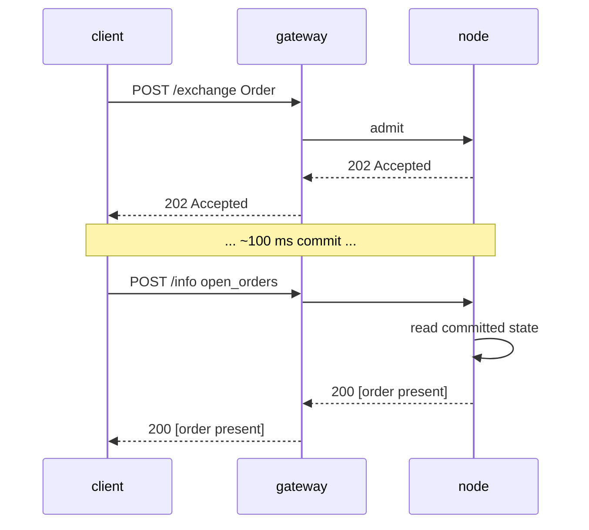

# `POST /info` — путь чтения (MTF-native)

:::info
**Статус.** Структура **стабильна**. Типы запросов добавляются со временем; конверт зафиксирован.
:::

## TL;DR

Единый эндпоинт, множество типов. Диспетчеризация выполняется по полю `type` в теле запроса. Только чтение — никогда не изменяет состояние, не требует подписи.

## URL

```
POST  https://<net>-gateway.mtf.exchange/info
```

| Путь | Формат передачи |
|------|-----------|
| `POST /info` (шлюз по умолчанию) | MTF-native (данный документ) |
| `POST /hl/info` (шлюз, под `/hl`) | **HL-совместимый** — см. [hl-compat.md](./hl-compat.md) |

MTF-native — путь шлюза по умолчанию; HL-совместимый — в пространстве имён `/hl/*`.
При самостоятельном запуске ноды тот же нативный `/info` доступен напрямую по адресу
`http://localhost:8080`.

## Конверт

Запрос:

```json
{ "type": "<query_type>", /* type-specific args */ }
```

Ответ:

```json
{ "type": "<query_type>", "data": { /* type-specific */ } }
```

При неизвестном `type`: `400 Bad Request` с телом `{"error":"unknown info type: <X>"}`.
При неизвестном ресурсе (например, неизвестный идентификатор хранилища): `404 Not Found` с телом `{"error":"<resource> not found"}`.

## Типы запросов

### `node_info`

Статическая идентификация ноды и версия протокола. Параметры отсутствуют.

```json
{ "type": "node_info" }
```

Ответ:

```json
{
  "type": "node_info",
  "data": {
    "network":           "testnet",
    "chain_id":          114514,
    "protocol_version":  "1.0.0",
    "validator_index":   null,
    "build_commit":      "unknown",
    "version":           "0.0.1",
    "freeze_halt_supported": true,
    "uptime_seconds":    0
  }
}
```

| Поле | Тип | Описание |
|-------|------|-------------|
| `network` | `"devnet" \| "testnet" \| "mainnet"` | Вариант сети, производный от `chain_id` (`31337`=devnet, `114514`=testnet, `8964`=mainnet) |
| `chain_id` | uint64 | Идентификатор сети EIP-712 — то же значение, которое обязан использовать домен подписи `/exchange` |
| `protocol_version` | semver string | Версия проводного протокола |
| `validator_index` | uint32 \| null | Индекс данной ноды в активном наборе валидаторов; **FLAGGED:** `null` до вызова `set_validator_index` средой выполнения |
| `build_commit` | hex string | Идентификатор сборки, публикуемый оператором; **FLAGGED:** `"unknown"` до публикации |
| `version` | semver string | Версия выпуска программного обеспечения ноды, встроенная при сборке. Один выпуск разделяет единую `version` среди своих бинарников — `build_commit` является различителем на уровне конкретной сборки |
| `freeze_halt_supported` | bool | Всегда `true` для данного бинарника — флаг возможности: нода соблюдает [`exchange_status.scheduled_freeze_height`](#exchange_status), чисто завершая работу с кодом выхода `77` после подтверждения высоты заморозки, чтобы супервизор ноды мог подключить следующий выпуск |
| `uptime_seconds` | uint64 | Время работы процесса; **FLAGGED:** `0` до вызова `set_uptime_seconds` средой выполнения |

Это поля **ноды** (идентификация ноды / среда выполнения), а НЕ состояние консенсуса, поэтому они правомерно могут различаться на разных нодах.

### `account_state`

Снимок состояния аккаунта.

```json
{ "type": "account_state", "address": "0x<addr>" }
```

| Аргумент | Тип | Обязателен |
|-----|------|----------|
| `address` | hex address | да |

**Неизвестный адрес** (никогда не встречавшийся в сети) возвращает **200** с полностью обнулённой
записью (`account_value:"0"`, пустые `positions` / `balances.spot`), а НЕ `404`.

Ответ (аккаунт, пополненный через faucet, без позиций):

```json
{
  "type": "account_state",
  "data": {
    "address":         "0x00000000000000000000000000000000000ca11e",
    "account_value":   "3000",
    "free_collateral": "3000",
    "maint_margin":    "0",
    "init_margin":     "0",
    "health":          "3000",
    "tier":            "Safe",
    "mode":            "Cross",
    "pm_enabled":      false,
    "positions": [],
    "balances": {
      "usdc": "3000",
      "spot": { "MTF": { "total": "10", "hold": "0" } }
    }
  }
}
```

Каждый токен в `balances.spot` представлен объектом `{total, hold}` (совместимость с HL): `hold` —
сумма, заблокированная под выставленный спотовый ордер (эскроу); `total` — полный баланс;
доступная к использованию сумма равна `total − hold`. Токен, находящийся полностью на удержании,
всё равно отображается. Для **лёгкого** чтения только маржинальных скалярных значений (без обхода `positions` и
сканирования балансов — оптимальный вызов для периодического опроса состояния ликвидации) используйте
[`margin_summary`](#margin_summary).

Аккаунт с открытыми позициями добавляет записи в `positions`:

```json
{
  "asset":             0,
  "size":              "100000000",
  "entry":             "67000.00",
  "upnl":              "5.00",
  "isolated":          false,
  "lev":               10,
  "liq":               "61000.00",
  "roe":               "0.0075",
  "funding":           "-0.12",
  "margin":            "201.00",
  "notional":          "6705.00"
}
```

| Поле | Тип | Описание |
|-------|------|-------------|
| `account_value` | Decimal string | Стоимость позиции с учётом реализованного PnL, **плоскость целых USDC** (`"3000"` = 3000 USDC, НЕ базовые единицы) |
| `free_collateral` | Decimal string | Стоимость позиции минус начальная маржа, удерживаемая открытыми позициями |
| `maint_margin` | Decimal string | Σ использованной маржи по каждому активу (поддерживающей) |
| `init_margin` | Decimal string | Требование к удерживаемой начальной марже |
| `health` | Decimal string | `account_value − maint_margin` (со знаком; может быть отрицательным) |
| `tier` | enum | `"Safe"`, `"T0"`, `"T1"`, `"T2"`, `"T3"` (диапазон BOLE для `account_value / maint_margin`; `"Safe"` при отсутствии поддерживающей маржи) — см. [уровневую ликвидацию](../../concepts/tiered-liquidation.md) |
| `mode` | enum | `"Cross"`, `"Isolated"`, `"StrictIso"` (определяется на основе открытых позиций аккаунта) |
| `pm_enabled` | bool | Состояние подключения портфельной маржи |
| `positions[*].asset` | uint32 | Идентификатор актива |
| `positions[*].size` | i128 string | Размер позиции со знаком в **сырых лотах** — `size / 10^sz_decimals` = целые единицы (`sz_decimals` — точность размера рынка, например 5 для BTC). Это плоскость РАЗМЕРА, ортогональная ценовой плоскости 1e8. |
| `positions[*].entry` | Decimal string | Цена входа за целую единицу = `\|entry_notional\| / \|real size\|`, **плоскость целых USDC** |
| `positions[*].upnl` | Decimal string | PnL по рыночной цене = `real size × mark − signed entry_notional`, **плоскость целых USDC** (со знаком) |
| `positions[*].isolated` | bool | `true`, если позиция не находится в кросс-маржинальном режиме |
| `positions[*].lev` | uint8 | Максимальное кредитное плечо позиции |
| `positions[*].liq` | Decimal string | Цена (в целых USDC), при достижении которой данная позиция в одиночку доводит аккаунт до уровня поддерживающей маржи — кросс-аппроксимация для одной позиции; `"0"` при нулевом размере / кредитном плече (цена ликвидации не определена) |
| `positions[*].roe` | Decimal string | `upnl / initial_margin` в виде десятичной дроби (`initial_margin = \|entry_notional\| / leverage`); `"0"` при нулевом кредитном плече / номинале |
| `positions[*].funding` | Decimal string | Начисленное, но не урегулированное финансирование по ноге, **целые USDC** (со знаком); `real_size × (cumulative_funding − funding_entry)` — та же форма, что и при расчёте финансирования |
| `positions[*].margin` | Decimal string | Поддерживающая маржа, вносимая данной ногой, **целые USDC**: `\|entry_notional\| × maint_margin_ratio` |
| `positions[*].notional` | Decimal string | Номинал позиции по рыночной цене, **целые USDC** (со знаком): `real_size × mark_px` |
| `positions[*].side` | enum \| absent | **Только в [режиме хеджирования](../../concepts/hedge-mode.md)** — `"long"` / `"short"`, нога, о которой сообщает данный объект. **Отсутствует для одностороннего аккаунта** (единая *нетто* позиция, где `size` может быть отрицательным). Хеджевый аккаунт, удерживающий обе ноги по одному активу, возвращает **два** объекта — по одному на каждую сторону. |
| `balances.usdc` | Decimal string | **Совпадает с `account_value`** (кросс-обеспечение USDC), а НЕ является отдельным спотовым балансом USDC |
| `balances.spot` | object | Спотовые балансы токенов, отличных от USDC, с ключом по **названию токена** (например, `"MTF"`); каждое значение — объект `{total, hold}` (`hold` = эскроу, заблокированный под выставленные спотовые ордера; доступно = `total − hold`); пусто, если нет токенов |

### `margin_summary`

**Только маржинальные скалярные значения** — `account_state` без обхода `positions[]` и
сканирования спотовых балансов. Оптимальный вызов для частого опроса состояния ликвидации (бот
мониторинга рисков, автоматическое пополнение маржи), когда детали позиций и баланса не нужны.
Обязательный параметр: `address` (hex с префиксом 0x).

```json
{ "type": "margin_summary", "address": "0x<addr>" }
```

Ответ (`data`): `address`, `account_value`, `free_collateral`,
`maint_margin`, `init_margin`, `health`, `tier`, `mode`, `pm_enabled` —
семантика полей идентична одноимённым полям в
[`account_state`](#account_state) (вычисляется общим вспомогательным методом, поэтому оба значения всегда совпадают).

### `market_info`

Метаданные конкретного рынка.

```json
{ "type": "market_info", "asset_id": 0 }
```

Или по названию:

```json
{ "type": "market_info", "coin": "BTC" }
```

Ответ:

```json
{
  "type": "market_info",
  "data": {
    "asset_id":        0,
    "name":            "BTC",
    "kind":            "perp",
    "sz_decimals":     5,
    "mark_px":         "67079.265",
    "oracle_px":       "67073.35",
    "mid_px":          "67079.27",
    "premium":         "0.0015",
    "tick_size":       "1000000",
    "step_size":       "1",
    "min_order":       "1",
    "max_leverage":    50,
    "maint_margin_ratio": "300",
    "init_margin_ratio":  "200",
    "funding": {
      "rate_per_hr":  "0",
      "cap_per_hr":   "400",
      "interval_ms":     3600000,
      "next_payment_ts": 0
    },
    "mark_source": "MedianOfOraclesAndMid",
    "fba_enabled": false,
    "open_interest": "0"
  }
}
```

:::info
**Плоскость отображения цен.** В данном ответе чтения как `mark_px`, так и `oracle_px` указаны в
**плоскости целых USDC в десятичном формате** (реальные доллары — `"67079.265"` / `"67073.35"`),
в тех же единицах, что и цены позиций аккаунта. `mark_px` — внутрибиржевая расчётная цена,
приведённая из внутреннего представления движка с фиксированной точкой 1e8; при отсутствии расчётной
цены в стакане используется цена оракула; `oracle_px` — последняя подтверждённая индексная цена.
Каждое из значений равно `"0"`, если не задано. Обратите внимание: **плоскость подачи ордеров/стакана
по-прежнему использует фиксированную точку 1e8** — цены уровней `l2_book` и `limit_px` ордеров
НЕ являются целыми USDC; MTF разграничивает эти два масштаба и выводит цены в целых USDC только
в пользовательских ответах чтения (`market_info`, `markets`, позиции). Семантика остальных полей
записи описана в таблице [`markets`](#markets) ниже.
:::

:::info
**Точность цены и `sz_decimals`.** `mark_px` и `oracle_px` **выровнены по тиковому шагу цены**
рынка (`tick_size`, усечение к нулю), поэтому ответ чтения никогда не содержит значений меньше тика —
при тике `$0.01` (`tick_size: "1000000"` в плоскости 1e8) значение `66735.255` отображается как
`"66735.25"`. Важно: `sz_decimals` — это точность **РАЗМЕРА** (гранулярность количества в ордере;
`5` ⇒ `0.00001` единицы), она **не** определяет десятичные знаки цены; за это отвечает тиковый шаг.
Оба параметра являются независимыми осями (та же логика разделения, что и в HL).
:::

### `markets`

Все зарегистрированные бессрочные рынки MIP-3 — в одном запросе. Параметры отсутствуют.

```json
{ "type": "markets" }
```

Полезная нагрузка `data` — **массив** тех же расширенных записей по каждому рынку, которые
[`market_info`](#market_info) возвращает для одного актива. Записи упорядочены
детерминированно по возрастанию `asset_id` (нода итерирует `BTreeMap`
`mip3_market_specs`). При пустой вселенной возвращается `"data": []`.

Ответ:

```json
{
  "type": "markets",
  "data": [
    {
      "asset_id":        0,
      "name":            "BTC",
      "kind":            "perp",
      "sz_decimals":     5,
      "mark_px":         "67042.335",
      "oracle_px":       "67042.335",
      "mid_px":          "67042.33",
      "premium":         "0.0015",
      "tick_size":       "1000000",
      "step_size":       "1",
      "min_order":       "1",
      "max_leverage":    50,
      "maint_margin_ratio": "300",
      "init_margin_ratio":  "200",
      "funding": {
        "rate_per_hr":  "0",
        "cap_per_hr":   "400",
        "interval_ms":     3600000,
        "next_payment_ts": 0
      },
      "mark_source": "MedianOfOraclesAndMid",
      "fba_enabled": false,
      "open_interest": "0"
    }
  ]
}
```

| Поле | Тип | Описание |
|-------|------|-------------|
| `asset_id` | uint32 | Канонический идентификатор актива (ключ сортировки) |
| `name` | string | Символ рынка, например `"BTC"` |
| `kind` | `"perp"` | Тип рынка (строчные буквы) |
| `sz_decimals` | uint8 | Знаков после запятой для отображения размера (из реестра базовых спотовых токенов; `0`, если спецификация токена отсутствует) |
| `mark_px` | Decimal string | Внутрибиржевая расчётная цена, **плоскость целых USDC** (расчётная цена стакана, приведённая из 1e8; резервный вариант — оракул; `"0"`, если не задана) |
| `oracle_px` | Decimal string | Индексная цена, **плоскость целых USDC** (`"0"`, если не задана) |
| `mid_px` | Decimal string \| null | Реальная середина стакана ордеров `(best_bid + best_ask) / 2`, **плоскость целых USDC** (с выравниванием по тику); `null` при одностороннем или пустом стакане |
| `premium` | Decimal string \| null | Последний подтверждённый образец премии финансирования (со знаком); `null` при отсутствии образца |
| `tick_size` | i128 string | Минимальный шаг цены, **фиксированная точка 1e8** (плоскость подачи ордеров/стакана) |
| `step_size` | u128 string | Минимальный шаг размера (размер лота), фиксированная точка |
| `min_order` | u128 string | Минимальный размер ордера |
| `max_leverage` | uint8 | Максимальное кредитное плечо |
| `maint_margin_ratio` | bps string | Коэффициент поддерживающей маржи, в базисных пунктах |
| `init_margin_ratio` | bps string | Коэффициент начальной маржи (`1 / max_leverage`), в базисных пунктах |
| `funding.rate_per_hr` | bps string | Последний образец премии финансирования, в базисных пунктах |
| `funding.cap_per_hr` | bps string | Предельная ставка финансирования в час, в базисных пунктах |
| `funding.interval_ms` | uint64 | Периодичность финансирования (1 ч = `3600000`) |
| `funding.next_payment_ts` | uint64 | Временная метка следующей выплаты финансирования (`0` до появления образца) |
| `mark_source` | string | Дескриптор расчётной цены (`"MedianOfOraclesAndMid"`) |
| `fba_enabled` | bool | Режим частого пакетного аукциона включён для данного рынка |
| `open_interest` | u128 string | Текущий открытый интерес, фиксированная точка |

Каждый элемент побайтово идентичен полю `data` соответствующего ответа одноактивного `market_info` —
оба строятся на основе одного и того же построителя записей рынка, поэтому единичная и групповая
формы никогда не расходятся. Семантика полей и примечания о прокси-флагах (`mark_source`,
`next_payment_ts`) описаны в разделе [`market_info`](#market_info).

### `vault_state`

Снимок состояния хранилища.

```json
{ "type": "vault_state", "vault": "0x<vault_addr>" }
```

Ответ:

```json
{
  "type": "vault_state",
  "data": {
    "vault":              "0x<addr>",
    "name":               "MFlux Conservative",
    "tvl":             "10000000000",
    "share_price":     "10500000",
    "depositor_count":    142,
    "high_water_mark": "10500000",
    "performance_fee_bps":1000,
    "lock_period_ms":     86400000,
    "strategy":           "MarketNeutral"
  }
}
```

### `staking_state`

```json
{ "type": "staking_state", "address": "0x<addr>" }
```

Ответ:

```json
{
  "type": "staking_state",
  "data": {
    "address":         "0x<addr>",
    "total_staked": "1000000000",
    "delegations": [
      {
        "validator":         "0x<val_addr>",
        "amount":         "500000000",
        "since_ts":          1735000000000,
        "pending_rewards":"1000000"
      }
    ],
    "pending_unstakes": [
      { "amount": "200000000", "matures_at_ts": 1735780000000 }
    ]
  }
}
```

### `fee_schedule`

```json
{ "type": "fee_schedule" }
```

Ответ:

```json
{
  "type": "fee_schedule",
  "data": {
    "tiers": [
      { "volume_30d": "0",         "maker_bps": "2.0", "taker_bps": "5.0" },
      { "volume_30d": "100000000", "maker_bps": "1.5", "taker_bps": "4.5" },
      { "volume_30d": "1000000000","maker_bps": "1.0", "taker_bps": "4.0" }
    ],
    "builder_rebate_bps": "0.2",
    "burn_ratio":         "0.30",
    "referrer_share_bps": "1.0"
  }
}
```

Ставки комиссий указаны в десятичных **базисных пунктах** в виде строк (`"2.0"` = 2 б.п. = 0,02%). `burn_ratio` — десятичная дробь (`"0.30"` = 30% от сжигаемых комиссий). См. [комиссии](../../concepts/fees.md).

### `open_orders`

Активные заявки аккаунта по всем книгам бессрочных контрактов.

```json
{ "type": "open_orders", "account_id": 42 }
```

| Аргумент | Тип | Обязательный |
|-----|------|----------|
| `account_id` | uint64 | одно из `account_id` / `address` |
| `address` | hex-адрес | одно из `account_id` / `address` |

Аккаунт идентифицируется либо через `account_id` (u64), либо через `address` (hex с префиксом 0x). Если в запросе передан `account_id`, он возвращается обратно в `data.account_id`.

Ответ:

```json
{
  "type": "open_orders",
  "data": {
    "address":    "0x<addr>",
    "account_id": 42,
    "orders": [
      {
        "oid":          12345,
        "market_id":    0,
        "side":         "bid",
        "px":        "99000",
        "size":      "700",
        "cloid":        "0x000000000000000000000000cafef00d",
        "inserted_at_ms": 1700000000000
      }
    ]
  }
}
```

| Поле | Тип | Описание |
|-------|------|-------------|
| `address` | hex-адрес | Разрешённый адрес аккаунта |
| `account_id` | uint64 | Возвращается только при запросе по `account_id` |
| `orders[*].oid` | uint64 | Серверный идентификатор заявки |
| `orders[*].market_id` | uint32 | Идентификатор актива / рынка, на котором стоит заявка |
| `orders[*].side` | `"bid"` / `"ask"` | Сторона заявки |
| `orders[*].px` | строка i128 | Цена заявки, строка с фиксированной запятой |
| `orders[*].size` | строка u128 | Остаток объёма, строка с фиксированной запятой |
| `orders[*].cloid` | hex-строка \| null | Клиентский идентификатор заявки при размещении (`0x` + 32 hex-символа); `null`, если не был указан |
| `orders[*].inserted_at_ms` | uint64 | Временная метка размещения / добавления заявки (мс консенсуса) |

### `l2_book`

Агрегированные уровни заявок на покупку и продажу по рынку.

```json
{ "type": "l2_book", "market_id": 0 }
```

| Аргумент | Тип | Обязательный |
|-----|------|----------|
| `market_id` | uint32 | да |

Ответ:

```json
{
  "type": "l2_book",
  "data": {
    "market_id": 0,
    "bids": [ { "px": "99000", "size": "700", "n_orders": 1 } ],
    "asks": [ { "px": "101000", "size": "750", "n_orders": 2 } ]
  }
}
```

Заявки на покупку отсортированы от лучшей (цена по убыванию), заявки на продажу — по возрастанию. На каждом уровне агрегируется суммарный `size` и количество активных заявок `n_orders`. Для неизвестного или пустого рынка возвращаются пустые массивы `bids` / `asks`.

| Поле | Тип | Описание |
|-------|------|-------------|
| `market_id` | uint32 | Идентификатор рынка (эхо) |
| `bids[*].px` / `asks[*].px` | строка i128 | Цена уровня, строка с фиксированной запятой |
| `bids[*].size` / `asks[*].size` | строка u128 | Суммарный объём на уровне |
| `bids[*].n_orders` / `asks[*].n_orders` | uint64 | Количество активных заявок на уровне |

### `recent_trades`

Публичная лента сделок по рынку, получаемая напрямую из зафиксированного состояния ноды
(ограниченное кольцо сделок по каждому рынку, встроенное в AppHash — без внешнего индексера).

```json
{ "type": "recent_trades", "market_id": 0 }
```

| Аргумент | Тип | Обязательный | Описание |
|-----|------|----------|-------------|
| `market_id` | uint32 | да | Идентификатор актива / рынка |
| `limit` | uint32 | нет | Ограничение числа возвращаемых **последних** записей; отсутствие / `0` ⇒ всё кольцо |

Ответ:

```json
{
  "type": "recent_trades",
  "data": {
    "market_id":      0,
    "last_trade_ms":  1700000000555,
    "trades": [
      {
        "coin":  0,
        "side":  "B",
        "px":    "67042.50",
        "sz":    "0.125",
        "time":  1700000000555,
        "tid":   90123,
        "block": 562,
        "hash":  "0x2315b79b9e82c2deb279a59448bf7841f3767d30d874e5b544d75bb9fd1e9b0c"
      }
    ]
  }
}
```

Записи упорядочены от старых к новым (новейшие — в конце). Кольцо ограничено, поэтому это лишь последнее временное окно, а не вся история. Для неизвестного или никогда не торговавшегося рынка возвращаются `"trades": []` и `last_trade_ms: 0`.

| Поле | Тип | Описание |
|-------|------|-------------|
| `market_id` | uint32 | Идентификатор рынка (эхо) |
| `last_trade_ms` | uint64 | Временная метка последней сделки (`0`, если сделок не было) |
| `trades[*].coin` | uint32 | Идентификатор актива / рынка, на котором исполнена сделка |
| `trades[*].side` | `"B"` / `"A"` | Сторона тейкера (агрессора) — `"B"` = покупка, `"A"` = продажа |
| `trades[*].px` | Десятичная строка | Цена исполнения, **USDC в десятичном формате** (человекочитаемый) |
| `trades[*].sz` | Десятичная строка | Исполненный объём, **базовые единицы** (целые единицы) |
| `trades[*].time` | uint64 | Временная метка сделки (мс консенсуса) |
| `trades[*].tid` | uint64 | Детерминированный идентификатор сделки (общий для обеих сторон) |
| `trades[*].block` | uint64 | Высота зафиксированного блока, в котором расчитана сделка (локатор в цепочке) |
| `trades[*].hash` | hex-строка | Хэш транзакции исходной заявки, hex с префиксом `0x` — позволяет отследить сделку в цепочке |

### `candle`

Исторические OHLCV-бары для `(coin, interval)` за заданный временной диапазон. REST-аналог живого WS-канала [`candles`](../ws/subscriptions.md#candles) — WS отправляет формируемый бар по мере исполнения сделок, а этот запрос возвращает закрытую историю.

```json
{ "type": "candle", "coin": "BTC", "interval": "1m" }
```

| Аргумент | Тип | Обязательный | Описание |
|-----|------|----------|-------------|
| `coin` | string | да | Символ рынка, например `"BTC"` |
| `interval` | string | да | Токен интервала — одно из `1m`, `5m`, `15m`, `1h`, `4h`, `1d` |
| `start_time` | uint64 | нет | Начало окна (мс); фильтрует по времени открытия бара. По умолчанию `0` |
| `end_time` | uint64 | нет | Конец окна (мс); фильтрует по времени открытия бара. По умолчанию без ограничений |

Аргументы можно передавать в плоском виде (как выше) или вложенными в объект `req`; `start_time` /
`end_time` также принимают camelCase-варианты `startTime` / `endTime`. Отсутствие `coin` или `interval` → `400 {"error":"missing field <name>"}`.

Ответ:

```json
{
  "type": "candle",
  "data": [
    {
      "t": 1700000040000,
      "T": 1700000099999,
      "s": "BTC",
      "i": "1m",
      "o": "67000.00",
      "c": "67042.50",
      "h": "67080.00",
      "l": "66990.00",
      "v": "12.5",
      "q": "837843.75",
      "n": 37
    }
  ]
}
```

Бары упорядочены от старых к новым по `t` (время открытия); последний элемент — формируемый бар. Пустой массив — корректный ответ при неподдерживаемом токене `interval`, рынке без индексированных сделок или при отсутствии подключённого индексера.

| Поле | Тип | Описание |
|-------|------|-------------|
| `t` | uint64 | Временная метка **открытия** бара (мс, выровнена по интервалу) |
| `T` | uint64 | Временная метка **закрытия** бара (мс) — `t + interval − 1` |
| `s` | string | Символ монеты / рынка |
| `i` | string | Токен интервала |
| `o` / `c` / `h` / `l` | Десятичная строка | Цены **открытия** / **закрытия** / **максимума** / **минимума**, **USDC в десятичном формате** (человекочитаемый, например `"67042.50"`) |
| `v` | Десятичная строка | **Объём базового актива** — Σ торгуемого размера в баре (объём монеты, НЕ условная сумма) |
| `q` | Десятичная строка | **Объём в котируемой валюте (USD)** — `Σ цена × размер` по всем сделкам бара |
| `n` | uint64 | Количество сделок (исполнений) в баре |

:::info
**Серия непрерывна.** Интервал **без сделок** всё равно генерирует плоский бар, сохраняющий цену закрытия предыдущего бара: `o = h = l = c = предыдущее закрытие`, при этом `v = q = 0`, `n = 0`. Потребители получают непрерывную серию баров — по одному на каждый интервал, без пропусков для интерполяции. **Ни один бар не генерируется до первой сделки на рынке** — серия начинается с бакета первой сделки, поэтому пустой массив означает, что рынок никогда не торговался (или история не подключена), а не то, что ранние бакеты были отброшены.
:::

:::info
**Этот тип обслуживается шлюзом, а не нодой.** Свечи — это производные отображаемые данные, формируемые из публичного потока сделок; они **не** являются зафиксированным состоянием цепочки, не попадают в app-hash и не имеют гарантии консенсуса. Шлюз отвечает на `candle` из собственного скользящего хранилища; голая нода при прямом запросе возвращает `unknown info type: candle`. При отсутствии истории сделок по рынку шлюз возвращает честно-пустой ответ (`"data": []`).
:::

### `user_fills`

История исполнений заявок по аккаунту, получаемая напрямую из зафиксированного состояния ноды (ограниченное кольцо исполнений по каждому аккаунту, встроенное в AppHash — без внешнего индексера).

```json
{ "type": "user_fills", "account_id": 42 }
```

| Аргумент | Тип | Обязательный | Описание |
|-----|------|----------|-------------|
| `account_id` | uint64 | одно из `account_id` / `address` | Внутренний идентификатор аккаунта |
| `address` | hex-адрес | одно из `account_id` / `address` | Адрес аккаунта |
| `limit` | uint32 | нет | Ограничение числа возвращаемых **последних** записей; отсутствие / `0` ⇒ всё кольцо |

Аккаунт идентифицируется либо через `account_id` (u64), либо через `address` (hex с префиксом 0x). Если в запросе передан `account_id`, он возвращается обратно в `data.account_id`.

Ответ:

```json
{
  "type": "user_fills",
  "data": {
    "address":    "0x<addr>",
    "account_id": 42,
    "fills": [
      {
        "coin":           0,
        "side":           "B",
        "px":             "67042.50",
        "sz":             "0.125",
        "time":           1700000000555,
        "oid":            12345,
        "tid":            90123,
        "fee":            "4.19",
        "closed_pnl":     "0",
        "dir":            "Open Long",
        "start_position": "0",
        "block":          562,
        "hash":           "0x2315b79b9e82c2deb279a59448bf7841f3767d30d874e5b544d75bb9fd1e9b0c"
      }
    ]
  }
}
```

Записи упорядочены от старых к новым (новейшие — в конце). Кольцо ограничено, поэтому это лишь последнее временное окно, а не вся история. Для аккаунта без исполнений возвращается `"fills": []`.

| Поле | Тип | Описание |
|-------|------|-------------|
| `address` | hex-адрес | Разрешённый адрес аккаунта |
| `account_id` | uint64 | Возвращается только при запросе по `account_id` |
| `fills[*].coin` | uint32 | Идентификатор актива / рынка, на котором исполнена заявка |
| `fills[*].side` | `"B"` / `"A"` | Токен стороны данной ноги — `"B"` = покупка/bid, `"A"` = продажа/ask |
| `fills[*].px` | Десятичная строка | Цена исполнения, **USDC в десятичном формате** (человекочитаемый) |
| `fills[*].sz` | Десятичная строка | Исполненный объём, **базовые единицы** (целые единицы) |
| `fills[*].time` | uint64 | Временная метка исполнения (мс консенсуса) |
| `fills[*].oid` | uint64 | Идентификатор заявки данной стороны |
| `fills[*].tid` | uint64 | Детерминированный идентификатор сделки (общий для обеих сторон) |
| `fills[*].fee` | Десятичная строка | Комиссия, уплаченная данной стороной, **USDC в десятичном формате** |
| `fills[*].closed_pnl` | Десятичная строка | Реализованный PnL по закрытой части позиции, **USDC в десятичном формате** (со знаком) |
| `fills[*].dir` | string | Метка направления, например `"Open Long"`, `"Close Short"`, `"Open Short"`, `"Close Long"` |
| `fills[*].start_position` | Десятичная строка | Объём ноги со знаком ДО исполнения, **базовые единицы** (целые единицы, со знаком) |
| `fills[*].block` | uint64 | Высота зафиксированного блока, в котором расчитано исполнение (локатор в цепочке) |
| `fills[*].hash` | hex-строка | Хэш транзакции исходной заявки, hex с префиксом `0x` — позволяет отследить исполнение в цепочке |

### `user_fills_by_time`

Аналог [`user_fills`](#user_fills), но с фильтрацией по временному окну на основе поля `time` каждой записи консенсуса. Структура записей об исполнении идентична.

```json
{ "type": "user_fills_by_time", "address": "0x<addr>", "start_time": 1700000000000, "end_time": 1700003600000 }
```

| Аргумент | Тип | Обязательный | Описание |
|-----|------|----------|-------------|
| `account_id` | uint64 | одно из `account_id` / `address` | Внутренний идентификатор аккаунта |
| `address` | hex-адрес | одно из `account_id` / `address` | Адрес аккаунта |
| `start_time` | uint64 | нет | Начало окна (мс, включительно); фильтрует по полю `time` исполнения. Отсутствие ⇒ открытая нижняя граница |
| `end_time` | uint64 | нет | Конец окна (мс, включительно). Отсутствие ⇒ открытая верхняя граница |

Ответ:

```json
{
  "type": "user_fills_by_time",
  "data": {
    "address":    "0x<addr>",
    "account_id": 42,
    "start_time": 1700000000000,
    "end_time":   1700003600000,
    "fills": [ /* same record shape as user_fills */ ]
  }
}
```

| Поле | Тип | Описание |
|-------|------|-------------|
| `address` | hex-адрес | Разрешённый адрес аккаунта |
| `account_id` | uint64 | Возвращается только при запросе по `account_id` |
| `start_time` | uint64 \| null | Начало окна (эхо; `null`, если не указано) |
| `end_time` | uint64 \| null | Конец окна (эхо; `null`, если не указано) |
| `fills` | array | Записи об исполнениях в заданном окне (та же структура, что и в [`user_fills`](#user_fills)), от старых к новым |

### `order_status`

Получение жизненного цикла отдельной заявки по `oid` (серверный идентификатор) **или** `cloid` (клиентский идентификатор). Запрашивает активные книги заявок, реестр триггеров и зафиксированное кольцо исполнений — всё из зафиксированного состояния ноды.

```json
{ "type": "order_status", "oid": 12345 }
```

Или по клиентскому идентификатору:

```json
{ "type": "order_status", "cloid": "0x000000000000000000000000cafef00d" }
```

| Аргумент | Тип | Обязательный | Описание |
|-----|------|----------|-------------|
| `oid` | uint64 | одно из `oid` / `cloid` | Серверный идентификатор заявки |
| `cloid` | hex-строка | одно из `oid` / `cloid` | Клиентский идентификатор — `0x` + 32 hex-символа |

Отсутствие обоих → `400 {"error":"missing field oid or cloid"}`. Некорректный `cloid` → `400`. Поиск останавливается на первом совпадении в следующем порядке: активная заявка → припаркованный триггер → исполненная заявка → неизвестна.

Поле `data.status` определяет ветку ответа:

`"resting"` — живая заявка, открытая в книге бессрочных контрактов или спота:

```json
{
  "type": "order_status",
  "data": {
    "status": "resting",
    "order": {
      "oid":            12345,
      "market_id":      0,
      "side":           "bid",
      "px":             "67000",
      "size":           "700",
      "inserted_at_ms": 1700000000000,
      "cloid":          "0x000000000000000000000000cafef00d"
    }
  }
}
```

`"triggered"` — припаркованный TP/SL/стоп-ордер, ожидающий пересечения маркировочной цены:

```json
{
  "type": "order_status",
  "data": {
    "status": "triggered",
    "trigger": {
      "oid":              12345,
      "market_id":        0,
      "side":             "ask",
      "trigger_px":       "66000",
      "trigger_above":    false,
      "size":             "700",
      "registered_at_ms": 1700000000000,
      "fired":            false
    }
  }
}
```

`"filled"` — последнее совпадающее исполнение в кольце аккаунта (объект `fill`
имеет ту же структуру, что и одна запись в [`user_fills`](#user_fills)):

```json
{
  "type": "order_status",
  "data": {
    "status": "filled",
    "fill": { /* same shape as a user_fills fill record */ }
  }
}
```

`"unknown"` — заявка никогда не встречалась или вытеснена из ограниченного кольца (запрос только по `cloid`, не совпавший ни с активной, ни с триггерной заявкой, также попадает сюда, поскольку реестр триггеров и кольцо исполнений индексированы по `oid`):

```json
{ "type": "order_status", "data": { "status": "unknown" } }
```

| Поле | Тип | Описание |
|-------|------|-------------|
| `status` | `"resting" \| "triggered" \| "filled" \| "unknown"` | Разрешённое состояние жизненного цикла |
| `order` | object | Присутствует при `"resting"` — `oid`, `market_id`, `side` (`"bid"`/`"ask"`), `px` / `size` (строки с фиксированной запятой), `inserted_at_ms`, `cloid` (hex \| null) |
| `trigger` | object | Присутствует при `"triggered"` — `oid`, `market_id`, `side`, `trigger_px` / `size` (строки с фиксированной запятой), `trigger_above` (bool: активировать при пересечении маркировочной цены вверх), `registered_at_ms`, `fired` (bool) |
| `fill` | object | Присутствует при `"filled"` — совпадающая запись об исполнении (см. [`user_fills`](#user_fills)) |

### `funding_history`

Выборки финансовой премии в разрезе рынка.

```json
{ "type": "funding_history", "market_id": 0 }
```

| Аргумент | Тип | Обязателен |
|-----|------|----------|
| `market_id` | uint32 | да |

Ответ:

```json
{
  "type": "funding_history",
  "data": {
    "market_id": 0,
    "samples": [
      { "ts_ms": 1700000000000, "premium": "0.0015", "funding_rate": "0.0015" },
      { "ts_ms": 1700000008000, "premium": "-0.0007", "funding_rate": "-0.0007" }
    ]
  }
}
```

Выборки представляют собой упорядоченное кольцо снимков премии из трекера финансирования.
`premium` — точное значение `Decimal` до применения ограничения, представленное в виде строки (со знаком, полная
точность); `funding_rate` — та же премия, прошедшая через ограничитель финансирования для данного актива
(`±funding_rate_cap`, динамическое переопределение риска, либо базовое значение `0.04`/ч)
— т. е. фактическая ставка, которая будет применена. Если премия
не выходит за пределы ограничителя, то `funding_rate == premium`; при превышении `funding_rate` усекается
до подписанного ограничения. Для неизвестного/пустого рынка возвращается `"samples": []`.

| Поле | Тип | Описание |
|-------|------|-------------|
| `market_id` | uint32 | Идентификатор рынка из запроса |
| `samples[*].ts_ms` | uint64 | Метка времени выборки (консенсусные мс) |
| `samples[*].premium` | decimal string | Сырая выборка финансовой премии, до ограничения (со знаком) |
| `samples[*].funding_rate` | decimal string | Фактическая ставка = `premium`, усечённая до ограничителя для данного актива (со знаком) |

### `predicted_fundings`

Прогнозируемая ставка финансирования и время следующей выплаты по каждому рынку — для всех
зарегистрированных бессрочных рынков. Параметры не требуются.

```json
{ "type": "predicted_fundings" }
```

Полезная нагрузка `data` — **массив**, упорядоченный детерминированно по возрастанию
`asset` (узел обходит `BTreeMap` спецификаций рынка). При пустой вселенной возвращается
`"data": []`.

Ответ:

```json
{
  "type": "predicted_fundings",
  "data": [
    { "asset": 0, "predicted_rate": "0.0015", "next_funding_time": 1700003600000 }
  ]
}
```

`predicted_rate` — последняя выборка премии (прокси почасовой ставки, строка-десятичное число)
— `"0"` до получения первой выборки. `next_funding_time` — расчётное время следующей выплаты
(`last_sample_ts + 1ч`), `0` до первой выборки.

| Поле | Тип | Описание |
|-------|------|-------------|
| `asset` | uint32 | Идентификатор актива / рынка |
| `predicted_rate` | decimal string | Последняя выборка премии (прокси почасовой ставки); `"0"` до первой выборки |
| `next_funding_time` | uint64 | Метка времени следующей выплаты финансирования (консенсусные мс); `0` до первой выборки |

### `block_info`

Метаданные подтверждённого блока. Обязательные аргументы отсутствуют (`height` принимается, но игнорируется —
состояние чтения хранит только последний подтверждённый контекст).

```json
{ "type": "block_info" }
```

Ответ:

```json
{
  "type": "block_info",
  "data": {
    "height":       562,
    "round":        562,
    "epoch":        0,
    "timestamp_ms": 1780475491562,
    "block_hash":   "0x2315b79b9e82c2deb279a59448bf7841f3767d30d874e5b544d75bb9fd1e9b0c"
  }
}
```

| Поле | Тип | Описание |
|-------|------|-------------|
| `height` | uint64 | Высота последнего подтверждённого блока |
| `round` | uint64 | Раунд консенсуса для данного блока |
| `epoch` | uint64 | Текущая эпоха |
| `timestamp_ms` | uint64 | Метка времени блока (консенсусные мс) |
| `block_hash` | hex string (32 bytes) | Реальный хеш подтверждённого блока (теперь передаётся в состояние чтения — больше не является нулевым плейсхолдером) |

### `agents`

Утверждённые кошельки агентов / API для аккаунта.

```json
{ "type": "agents", "account_id": 42 }
```

| Аргумент | Тип | Обязателен |
|-----|------|----------|
| `account_id` | uint64 | один из `account_id` / `address` |
| `address` | hex address | один из `account_id` / `address` |

Ответ:

```json
{
  "type": "agents",
  "data": {
    "address":    "0x<master>",
    "account_id": 42,
    "agents": [
      { "agent": "0x<agent_addr>", "name": "trading-bot", "expires_at_ms": 1700000500000 }
    ]
  }
}
```

| Поле | Тип | Описание |
|-------|------|-------------|
| `address` | hex address | Разрешённый мастер-адрес |
| `account_id` | uint64 | Возвращается только если в запросе использовался `account_id` |
| `agents[*].agent` | hex address | Адрес утверждённого кошелька агента |
| `agents[*].name` | string \| null | Метка агента, заданная при утверждении; `null` если не задана |
| `agents[*].expires_at_ms` | uint64 \| null | Срок действия утверждения агента (консенсусные мс); `null` для бессрочного утверждения |

### `sub_accounts`

Субаккаунты аккаунта.

```json
{ "type": "sub_accounts", "account_id": 42 }
```

| Аргумент | Тип | Обязателен |
|-----|------|----------|
| `account_id` | uint64 | один из `account_id` / `address` |
| `address` | hex address | один из `account_id` / `address` |

Ответ:

```json
{
  "type": "sub_accounts",
  "data": {
    "address":    "0x<parent>",
    "account_id": 42,
    "sub_accounts": [
      { "index": 0, "address": "0x<sub_addr>" }
    ]
  }
}
```

| Поле | Тип | Описание |
|-------|------|-------------|
| `address` | hex address | Разрешённый родительский адрес |
| `account_id` | uint64 | Возвращается только если в запросе использовался `account_id` |
| `sub_accounts[*].index` | uint32 | Индекс субаккаунта у родителя |
| `sub_accounts[*].address` | hex address | Адрес субаккаунта |

### `mip3_active_bids`

Снимок газового аукциона для беспрепятственного развёртывания бессрочных контрактов по MIP-3. Параметры не требуются.

```json
{ "type": "mip3_active_bids" }
```

Ответ:

```json
{
  "type": "mip3_active_bids",
  "data": {
    "auction_round":   2,
    "current_bid":     "12345",
    "current_winner":  "0x<bidder>",
    "auction_end_ms":  1700086400000,
    "started_at_ms":   1700000000000,
    "bids": [
      {
        "bidder":          "0x<bidder>",
        "amount":          "12345",
        "submitted_at_ms": 1700000000500,
        "tag":             "ETH-PERP"
      }
    ]
  }
}
```

| Поле | Тип | Описание |
|-------|------|-------------|
| `auction_round` | uint64 | Текущий раунд аукциона |
| `current_bid` | decimal string | Сумма лидирующей ставки |
| `current_winner` | hex address \| null | Текущий победитель аукциона; `null` если нет ставок |
| `auction_end_ms` | uint64 | Метка времени закрытия аукциона (консенсусные мс) |
| `started_at_ms` | uint64 | Метка времени начала аукциона (консенсусные мс) |
| `bids[*].bidder` | hex address | Адрес участника аукциона |
| `bids[*].amount` | decimal string | Сумма ставки |
| `bids[*].submitted_at_ms` | uint64 | Метка времени подачи ставки (консенсусные мс) |
| `bids[*].tag` | string | Тег ставки (например, предлагаемое название рынка) |

### `protocol_metrics`

Общепротокольные подтверждённые аккумуляторы / счётчики. Параметры не требуются. Каждое поле
читается непосредственно из подтверждённого состояния `Exchange` (счётчики, пулы комиссий, резервы BOLE,
стейкинг) — ничего не вычисляется по матчинг-движку или оракулу, поэтому воспроизведение даёт
идентичный результат.

```json
{ "type": "protocol_metrics" }
```

Ответ:

```json
{
  "type": "protocol_metrics",
  "data": {
    "counters": {
      "total_orders":               1000,
      "total_fills":                750,
      "total_liquidations":         3,
      "total_deposits":             40,
      "total_withdrawals":          12,
      "total_vault_transfers":      0,
      "total_sub_account_transfers":0
    },
    "fee_pools": {
      "burned":         "8000",
      "mflux_vault":    "0",
      "validator_pool": "1000",
      "treasury":       "1000",
      "burned_mtf":     "55"
    },
    "insurance_fund_total":    "750",
    "treasury_backstop_total": "9000",
    "bole_pool": {
      "total_deposits":  "20000",
      "shortfall_total": "7"
    },
    "open_interest_total_1e8": "1500000",
    "staking": {
      "total_stake":   "100",
      "n_validators":  1,
      "n_active":      1,
      "n_jailed":      0,
      "current_epoch": 4
    },
    "counts": {
      "n_markets":             1,
      "n_spot_pairs":          5,
      "n_user_vaults":         0,
      "n_accounts_with_state": 12
    }
  }
}
```

| Поле | Тип | Описание |
|-------|------|-------------|
| `counters.total_orders` | uint64 | Совокупное количество принятых ордеров за всё время |
| `counters.total_fills` | uint64 | Совокупное количество исполнений за всё время (единственный детализированный сигнал торгов — **счётчик**, не номинал) |
| `counters.total_liquidations` | uint64 | Совокупное количество ликвидаций за всё время |
| `counters.total_deposits` / `total_withdrawals` | uint64 | Совокупное количество депозитов / выводов средств за всё время |
| `counters.total_vault_transfers` | uint64 | Совокупное количество переводов депозитов/выводов из хранилища за всё время |
| `counters.total_sub_account_transfers` | uint64 | Совокупное количество переводов между субаккаунтами за всё время |
| `fee_pools.burned` | Decimal string | Накопленный USDC, направленный на выкуп и сжигание (целые USDC) |
| `fee_pools.mflux_vault` | Decimal string | Накопленное начисление комиссий в хранилище MFlux (`"0"` — доля хранилища обнулена) |
| `fee_pools.validator_pool` | Decimal string | Накопленное начисление комиссий в пул валидаторов (целые USDC) |
| `fee_pools.treasury` | Decimal string | Накопленное начисление комиссий в казначейство (целые USDC) |
| `fee_pools.burned_mtf` | Decimal string | Совокупный MTF, списанный исполнителем выкупа |
| `insurance_fund_total` | Decimal string | Σ резервов `bole_pool.insurance_fund` по всем активам (целые USDC) |
| `treasury_backstop_total` | Decimal string | Σ резервов `bole_pool.treasury_backstop` по всем активам (целые USDC) |
| `bole_pool.total_deposits` | Decimal string | Совокупные депозиты в кредитный пул BOLE (целые USDC) |
| `bole_pool.shortfall_total` | Decimal string | Σ остаточных безнадёжных долгов, списанных после каскада ADL → страховой фонд → казначейство |
| `open_interest_total_1e8` | u128 string | Σ открытого интереса по всем рынкам, **плоскость книги 1e8** (обозначено `_1e8`, НЕ целые USDC) |
| `staking.total_stake` | Decimal string | Совокупный стейкинг MTF (целые MTF) |
| `staking.n_validators` | uint64 | Валидаторы в подтверждённом наборе |
| `staking.n_active` | uint64 | Активные валидаторы в текущей эпохе |
| `staking.n_jailed` | uint64 | Валидаторы, находящиеся под арестом в настоящий момент |
| `staking.current_epoch` | uint64 | Текущая эпоха стейкинга |
| `counts.n_markets` | uint64 | Зарегистрированные бессрочные рынки MIP-3 (`mip3_market_specs`) |
| `counts.n_spot_pairs` | uint64 | Зарегистрированные спотовые пары (`mip3_spot_pair_specs`) |
| `counts.n_user_vaults` | uint64 | Зарегистрированные пользовательские хранилища |
| `counts.n_accounts_with_state` | uint64 | Аккаунты с подтверждённым пользовательским состоянием |

:::info
**Накопленный номинал торгов отсутствует.** Движок отслеживает **30-дневный объём комиссий** по каждому пользователю
(см. [`user_fees`](#user_fees)) и совокупный **счётчик** исполнений за всё время
(`counters.total_fills`) — **подтверждённого накопленного аккумулятора объёмов в USD на уровне протокола нет**,
поэтому данный эндпоинт намеренно его не включает, чтобы не создавать ложного впечатления о наличии итоговых объёмов. Счётчики — это монотонные показатели активности, а не денежные величины.
:::

State source: `locus.{counters, fee_tracker.fee_distribution, bole_pool}` + `c_staking` + registry sizes.

### `user_fees`

Уровень комиссий / объёма для аккаунта. Обязателен: `account_id` (u64) **или** `address` (0x hex).

```json
{ "type": "user_fees", "account_id": 42 }
```

| Аргумент | Тип | Обязателен |
|-----|------|----------|
| `account_id` | uint64 | один из `account_id` / `address` |
| `address` | hex address | один из `account_id` / `address` |

Если ни один параметр не передан — `400`. Аккаунт без истории комиссий возвращает **200** с
нулевыми объёмами и базовыми bps — стандартный нулевой идиом.

Ответ:

```json
{
  "type": "user_fees",
  "data": {
    "address":          "0x<addr>",
    "account_id":       42,
    "taker_volume_30d": "1250000",
    "maker_volume_30d": "800000",
    "vip_tier":         2,
    "mm_tier":          1,
    "referrer":         "0x<referrer>",
    "referrer_credit":  "420",
    "maker_bps":        1,
    "taker_bps":        3
  }
}
```

| Поле | Тип | Описание |
|-------|------|-------------|
| `address` | hex address | Разрешённый адрес аккаунта |
| `account_id` | uint64 | Возвращается только если в запросе использовался `account_id` |
| `taker_volume_30d` | Decimal string | Скользящий 30-дневный объём тейкера (целые USDC) |
| `maker_volume_30d` | Decimal string | Скользящий 30-дневный объём мейкера (целые USDC) |
| `vip_tier` | uint | Подтверждённый VIP-уровень пользователя; `0` если не отслеживается |
| `mm_tier` | uint | Подтверждённый уровень маркет-мейкера пользователя; `0` если не отслеживается |
| `referrer` | hex address \| null | Реферер данного аккаунта, если задан; иначе `null` |
| `referrer_credit` | Decimal string | Σ накопленного рибейта для данного адреса в роли реферера (целые USDC) |
| `maker_bps` | uint | **Эффективные** bps комиссии мейкера, определённые по подтверждённой шкале [`fee_schedule`](#fee_schedule) на основе 30-дневного объёма мейкера данного аккаунта |
| `taker_bps` | uint | **Эффективные** bps комиссии тейкера, определённые по подтверждённой шкале на основе 30-дневного объёма тейкера данного аккаунта |

Эффективные `maker_bps` / `taker_bps` определяются раздельно по стороне сделки согласно подтверждённой
шкале объёмных уровней ([`fee_schedule`](#fee_schedule)) — ставка мейкера по объёму мейкера аккаунта,
ставка тейкера по объёму тейкера — с использованием той же процедуры, что применяется при расчёте,
поэтому отображаемые bps совпадают с фактически выставляемыми счетами. Переопределение на уровне
рынка MIP-3 здесь **не отражается**: это межрыночная базовая ставка. `vip_tier` / `mm_tier` остаются
подтверждёнными уровневыми индексами пользователя и являются отдельным сигналом, отображаемым вместе с эффективными bps.

State source: `locus.fee_tracker.{user_to_taker_volume_30d, user_to_maker_volume_30d, user_to_vip_tier, user_to_mm_tier, referee_to_referrer, referrer_credit}` + the committed volume-tier ladder.

### `staking_apr`

Эффективная годовая ставка эмиссии стейкинга и исходные данные для её расчёта. Параметры не требуются.

```json
{ "type": "staking_apr" }
```

Ответ:

```json
{
  "type": "staking_apr",
  "data": {
    "total_stake":             "1000000",
    "effective_apr":           "0.08",
    "effective_apr_bps":       "800",
    "governance_rate_bps":     800,
    "emission_floor_stake":    "50000000",
    "n_active_validators":     1,
    "current_epoch":           2,
    "is_gross_pre_commission": true
  }
}
```

| Поле | Тип | Описание |
|-------|------|-------------|
| `total_stake` | Decimal string | Совокупный стейкинг MTF (целые MTF) |
| `effective_apr` | Decimal string | Годовая ставка эмиссии, фактически применяемая эффектом вознаграждения в начале блока (дробная) |
| `effective_apr_bps` | Decimal string | `effective_apr × 10_000`, усечённая |
| `governance_rate_bps` | uint | Установленный управлением `reward_rate_bps` (подтверждённый) — см. флаг |
| `emission_floor_stake` | uint string | Пороговый стейк (`50M` MTF), ниже которого ставка фиксирована |
| `n_active_validators` | uint64 | Активные валидаторы в текущей эпохе |
| `current_epoch` | uint64 | Текущая эпоха стейкинга |
| `is_gross_pre_commission` | bool | Всегда `true` — APR является валовым, до вычета комиссии валидатора |

`effective_apr` — кривая, по которой эффект вознаграждения в начале блока определяет свои значения:

```text
effective_apr = 0.08 × √( 50M / max(total_stake, 50M) )
```

т. е. **фиксированные 8%** при стейкинге не выше 50M MTF, убывающие пропорционально 1/√stake свыше этого порога (например,
совокупный стейк = 200M ⇒ 4× порогового значения ⇒ соотношение 1/4 ⇒ √ = 1/2 ⇒ 4% / 400 bps).

:::warning
**`governance_rate_bps` подтверждён, но НЕ используется эффектом вознаграждения.** Эффект вознаграждения
выводит ставку выплаты из **кривой стейка** выше, а не из `reward_rate_bps`. Оба значения
представлены, чтобы расхождение было наблюдаемым, а не скрытым — фактическая APR выплат — это
`effective_apr`, а не `governance_rate_bps`. При этом `effective_apr` является **валовой ставкой эмиссии** (`is_gross_pre_commission: true`):
чистая APR отдельного делегатора равна `effective_apr × (1 − комиссия)`.
:::

State source: `c_staking.{total_stake, reward_rate_bps, current_epoch, validators}` + the emission curve.

### `oracle_sources`

Зафиксированное подмножество источников оракула для каждого рынка. Рынок определяется по `asset_id`
(u32) **ИЛИ** `coin` (символ).

```json
{ "type": "oracle_sources", "asset_id": 0 }
```

Или по имени:

```json
{ "type": "oracle_sources", "coin": "BTC" }
```

| Аргумент | Тип | Обязателен |
|-----|------|----------|
| `asset_id` | uint32 | одно из `asset_id` / `coin` |
| `coin` | symbol | одно из `asset_id` / `coin` |

Отсутствие обоих → `400`; неизвестный рынок → `404 {"error":"market not found"}`.

Ответ:

```json
{
  "type": "oracle_sources",
  "data": {
    "asset_id":          0,
    "name":              "BTC",
    "oracle_set":        true,
    "source_count":      3,
    "num_sources":       10,
    "enabled_sources":   [0, 2, 5],
    "subset_mask":       37,
    "weights_committed": false
  }
}
```

| Поле | Тип | Описание |
|-------|------|-------------|
| `asset_id` | uint32 | Переданный / разрешённый идентификатор актива |
| `name` | string | Символ рынка |
| `oracle_set` | bool | Подтвердил ли деплоер подмножество явно через `SetOracle` |
| `source_count` | uint64 | Количество активных источников (popcount маски) |
| `num_sources` | uint8 | Общее число слотов источников (`NUM_ORACLE_SOURCES = 10`) |
| `enabled_sources` | uint8[] | Индексы установленных битов маски подмножества (активные слоты источников) |
| `subset_mask` | uint16 | Зафиксированная 10-битная `oracle_source_subset_mask` (бит `i` установлен ⇒ источник `i` участвует в медиане) |
| `weights_committed` | bool | Всегда `false` — веса отдельных источников НЕ фиксируются (см. флаг) |

:::warning
**В цепочке хранится только числовая битовая маска — ИМЕНА и ВЕСА источников НЕ
зафиксированы** (`weights_committed: false`). Идентификаторы 10 источников закреплены
протоколом вне цепочки, а их веса фиксированы протоколом, поэтому в on-chain состоянии
хранится лишь битовая маска подмножества. Этот запрос возвращает `enabled_sources` как
**индексы битов**, а не имена площадок, и не возвращает список весов по площадкам вместо
того, чтобы его конструировать.
:::

Источник состояния: `mip3_market_specs[asset].{oracle_source_subset_mask, oracle_set}`.

## Типы запросов управления

On-chain поверхность управления: действующий механизм голосования (`gov_state`),
кросс-категорийное представление ожидающих предложений с расстоянием до кворума (`gov_proposals`)
и журнал аудита вступивших в силу параметров (`gov_history`). Все запросы читают зафиксированное
состояние `Exchange`; используется тот же конверт `{type, data}`. Кворум по стейку равен ⅔
(взвешенный по стейку); **заблокированные** валидаторы исключаются из знаменателя активного стейка
и из всех подсчётов, что соответствует проверке вступления в силу on-chain.

### `gov_state`

Живая поверхность управления — контекст стейк-кворума, ожидающие раунды `voteGlobal`,
открытые предложения `govPropose` и ТЕКУЩЕЕ значение каждого управляемого параметра.
Параметры запроса отсутствуют.

```json
{ "type": "gov_state" }
```

Ответ:

```json
{
  "type": "gov_state",
  "data": {
    "total_stake":  "150000",
    "quorum_bps":   6667,
    "quorum_stake": "100005",
    "pending_vote_global": [
      {
        "kind":          "set_reward_rate_bps",
        "kind_id":       3,
        "votes": [
          { "validator": "0x<val>", "value": "900", "stake": "60000", "submitted_at_ms": 1700000000000 }
        ],
        "leading_stake": "60000"
      }
    ],
    "open_proposals": [
      { "proposal_id": 5, "voters": 2, "aye_stake": "90000", "nay_stake": "30000" }
    ],
    "params": {
      "reward_rate_bps":   800,
      "default_taker_bps": 5,
      "default_maker_bps": 2,
      "burn_bps":          8000
    },
    "oracle_weight_overrides": [
      { "asset_id": 0, "weights": [1000, 1000, 1000] }
    ]
  }
}
```

| Поле | Тип | Описание |
|-------|------|-------------|
| `total_stake` | decimal string | Σ стейков всех валидаторов |
| `quorum_bps` | uint | Порог кворума ⅔ в bps (`6667`) |
| `quorum_stake` | decimal string | Стейк, необходимый для вступления в силу (`total_stake × quorum_bps / 10000`) |
| `pending_vote_global[*].kind` | string | Название управляемого параметра (snake_case), напр. `"set_reward_rate_bps"` |
| `pending_vote_global[*].kind_id` | uint | Числовой идентификатор вида |
| `pending_vote_global[*].votes[*].validator` | hex address | Голосующий валидатор |
| `pending_vote_global[*].votes[*].value` | decimal string | Декодированное предлагаемое значение (hex `0x…`, если полезная нагрузка непрозрачна) |
| `pending_vote_global[*].votes[*].stake` | decimal string | Стейк голосующего |
| `pending_vote_global[*].votes[*].submitted_at_ms` | uint64 | Временная метка подачи голоса (мс консенсуса) |
| `pending_vote_global[*].leading_stake` | decimal string | Наибольший стейк, объединённый за единую полезную нагрузку в этом раунде |
| `open_proposals[*].proposal_id` | uint64 | Идентификатор раунда govPropose |
| `open_proposals[*].voters` | uint64 | Количество поданных голосов |
| `open_proposals[*].aye_stake` / `nay_stake` | decimal string | Стейк «за» / «против» |
| `params` | object | Текущее значение каждого управляемого параметра (каждый является зафиксированным скаляром) |
| `oracle_weight_overrides[*].asset_id` | uint32 | Актив с переопределёнными весами оракула |
| `oracle_weight_overrides[*].weights` | uint[] | Зафиксированные веса по источникам для актива |

Объект `params` содержит полный набор управляемых параметров, которые может изменить механизм
голосования (распределение комиссий, параметры стейкинга, лимиты MIP-3, риск-ограничения,
флаги спот / EVM / мост, …); каждый отражает живое зафиксированное значение.

### `gov_proposals`

Все АКТИВНЫЕ предложения по управлению во ВСЕХ категориях голосования (не только
`voteGlobal`), каждое с текущим подсчётом стейка по полезным нагрузкам и расстоянием
до кворума ⅔. Кросс-категорийное представление «что сейчас на голосовании и насколько
это близко к принятию». Параметры запроса отсутствуют.

```json
{ "type": "gov_proposals" }
```

Ответ:

```json
{
  "type": "gov_proposals",
  "data": {
    "total_active_stake":  "120000",
    "quorum_bps":          6667,
    "quorum_needed_stake": "80004",
    "proposals": [
      {
        "round":         1000003,
        "category":      "vote_global",
        "sub_id":        3,
        "proposer":      "0x<val>",
        "created_at_ms": 1700000000000,
        "voter_count":   1,
        "leading_stake": "60000",
        "meets_quorum":  false,
        "payloads": [
          { "payload_hex": "0392…", "stake": "60000", "meets_quorum": false }
        ],
        "proposal": {
          "kind":         3,
          "kind_name":    "set_reward_rate_bps",
          "value":        "900",
          "title":        "Raise staking rewards",
          "proposer":     "0x<val>",
          "opened_at_ms": 1700000000000
        }
      }
    ]
  }
}
```

| Поле | Тип | Описание |
|-------|------|-------------|
| `total_active_stake` | decimal string | Σ стейков незаблокированных валидаторов (знаменатель кворума) |
| `quorum_bps` | uint | Порог кворума ⅔ в bps (`6667`) |
| `quorum_needed_stake` | decimal string | Стейк, который должна набрать единственная полезная нагрузка для вступления в силу |
| `proposals[*].round` | uint64 | Синтетический идентификатор раунда голосования |
| `proposals[*].category` | string | Категория голосования, напр. `"gov_propose"`, `"vote_global"`, `"dynamic_risk"`, `"treasury"`, `"metaliquidity"`, `"oracle_weights"`, `"funding_formula"`, `"spot_margin"` |
| `proposals[*].sub_id` | uint64 | Идентификатор относительно категории (раунд минус базовое смещение диапазона категории) |
| `proposals[*].proposer` | hex address \| null | Самый ранний голосующий (прокси-инициатор) |
| `proposals[*].created_at_ms` | uint64 | Временная метка самого раннего голоса (мс консенсуса) |
| `proposals[*].voter_count` | uint64 | Количество голосов в раунде |
| `proposals[*].leading_stake` | decimal string | Наибольший стейк за одну полезную нагрузку |
| `proposals[*].meets_quorum` | bool | Достигает ли стейк ведущей полезной нагрузки кворума ⅔ |
| `proposals[*].payloads[*].payload_hex` | hex string | Отдельная проголосованная полезная нагрузка (без префикса `0x`) |
| `proposals[*].payloads[*].stake` | decimal string | Активный стейк за эту полезную нагрузку |
| `proposals[*].payloads[*].meets_quorum` | bool | Достигает ли данная полезная нагрузка кворума самостоятельно |
| `proposals[*].proposal` | object \| null | Типизированная запись govPropose, если раунд был открыт через `govPropose`, иначе `null` |
| `proposals[*].proposal.kind` | uint | Числовой идентификатор вида управляемого параметра |
| `proposals[*].proposal.kind_name` | string \| null | Декодированное имя вида (snake_case), `null` если неизвестно |
| `proposals[*].proposal.value` | decimal string | Предлагаемое значение |
| `proposals[*].proposal.title` | string | Читаемое название предложения |
| `proposals[*].proposal.proposer` | hex address | Аккаунт, открывший предложение |
| `proposals[*].proposal.opened_at_ms` | uint64 | Временная метка открытия предложения (мс консенсуса) |

### `gov_history`

Журнал аудита вступивших в силу решений управления (ограниченное кольцо, от старых к новым) —
каждая запись подтверждает, что параметр был изменён on-chain управлением по сравнению с
начальным значением. Параметры запроса отсутствуют. Дополняет `gov_proposals` (ожидающие решения).

```json
{ "type": "gov_history" }
```

Ответ:

```json
{
  "type": "gov_history",
  "data": {
    "count": 1,
    "enacted": [
      {
        "round":         1000003,
        "kind":          3,
        "kind_name":     "set_reward_rate_bps",
        "value":         "900",
        "via":           "vote_global",
        "enacted_at_ms": 1700000900000,
        "description":   "reward_rate_bps -> 900"
      }
    ]
  }
}
```

| Поле | Тип | Описание |
|-------|------|-------------|
| `count` | uint | Число записей в кольце |
| `enacted[*].round` | uint64 | Синтетический раунд голосования, принявший решение |
| `enacted[*].kind` | uint | Числовой идентификатор вида управляемого параметра |
| `enacted[*].kind_name` | string \| null | Декодированное имя вида (snake_case), `null` если неизвестно |
| `enacted[*].value` | decimal string | Вступившее в силу значение |
| `enacted[*].via` | `"proposal" \| "vote_global" \| "other"` | Источник — `govPropose`/`govVote` либо прямой `voteGlobal` |
| `enacted[*].enacted_at_ms` | uint64 | Временная метка вступления в силу (мс консенсуса) |
| `enacted[*].description` | string | Читаемое описание изменения |

Кольцо ограничено on-chain лимитом журнала принятых решений, поэтому здесь представлено
только последнее временное окно, а не вся история.

## Типы запросов дифференциаторов (RFQ / FBA / портфельная маржа)

Эти запросы читают живое состояние движков дифференциаторов MTF — они дополняют флаги
`market_info.fba_enabled` / `account_state.pm_enabled` самим состоянием движка. Используется
тот же конверт `{type, data}` и нативные соглашения MTF. **Ценовая плоскость:** цены и объёмы
RFQ + FBA представлены как целые числа в **формате с фиксированной точкой 1e8** (плоскость книги /
ордеров, идентична [`open_orders`](#open_orders) / [`l2_book`](#l2_book)),
**а не** целые USDC; суммы портфельной маржи — целые числа в **центах USD**.

### `rfq_open`

Все открытые RFQ-запросы и котировки маркет-мейкеров. Параметры запроса отсутствуют. См. [концепцию RFQ](../../concepts/rfq.md).

```json
{ "type": "rfq_open" }
```

Ответ:

```json
{
  "type": "rfq_open",
  "data": {
    "rfqs": [
      {
        "rfq_id":              1,
        "market_id":           7,
        "side":                "bid",
        "size":                "1000",
        "requester":           "0x<addr>",
        "requester_stp_group": 42,
        "expiry_ms":           5000,
        "limit_px":            "105",
        "created_at_ms":       10,
        "quotes": [
          {
            "maker":           "0x<addr>",
            "maker_stp_group": null,
            "price":           "104",
            "max_size":        "800",
            "valid_until_ms":  4000,
            "submitted_at_ms": 20
          }
        ]
      }
    ]
  }
}
```

`rfqs` итерируется детерминированно по `rfq_id`. Пустой движок возвращает `"rfqs": []`.

| Поле | Тип | Описание |
|-------|------|-------------|
| `rfqs[*].rfq_id` | uint64 | Идентификатор RFQ-запроса |
| `rfqs[*].market_id` | uint32 | Идентификатор актива / рынка для RFQ |
| `rfqs[*].side` | `"bid"` / `"ask"` | Сторона, которую хочет взять запрашивающая сторона |
| `rfqs[*].size` | u128 string | Запрошенный объём, с фиксированной точкой 1e8 |
| `rfqs[*].requester` | hex address | Запрашивающий аккаунт |
| `rfqs[*].requester_stp_group` | uint \| null | Группа защиты от самоисполнения запрашивающего; `null` если не задана |
| `rfqs[*].expiry_ms` | uint64 | Временная метка истечения RFQ (мс консенсуса) |
| `rfqs[*].limit_px` | i128 string \| null | Лимитная цена запрашивающего, с фиксированной точкой 1e8; `null` если не задана |
| `rfqs[*].created_at_ms` | uint64 | Временная метка создания (мс консенсуса) |
| `rfqs[*].quotes[*].maker` | hex address | Котирующий маркет-мейкер |
| `rfqs[*].quotes[*].maker_stp_group` | uint \| null | Группа STP маркет-мейкера; `null` если не задана |
| `rfqs[*].quotes[*].price` | i128 string | Цена котировки, с фиксированной точкой 1e8 |
| `rfqs[*].quotes[*].max_size` | u128 string | Максимальный объём, который готов исполнить маркет-мейкер, с фиксированной точкой 1e8 |
| `rfqs[*].quotes[*].valid_until_ms` | uint64 | Срок действия котировки (мс консенсуса) |
| `rfqs[*].quotes[*].submitted_at_ms` | uint64 | Временная метка подачи котировки (мс консенсуса) |

### `rfq_user`

RFQ, в которых аккаунт является участником — разделены на открытые им и те, на которые он выставил котировки. См. [концепцию RFQ](../../concepts/rfq.md).

```json
{ "type": "rfq_user", "account_id": 42 }
```

| Аргумент | Тип | Обязателен |
|-----|------|----------|
| `account_id` | uint64 | одно из `account_id` / `address` |
| `address` | hex address | одно из `account_id` / `address` |

Аккаунт идентифицируется либо через `account_id` (u64), либо через `address` (0x hex); при
передаче `account_id` он возвращается в `data.account_id`. Отсутствие обоих → `400`;
некорректный `address` → `400 {"error":"invalid hex"}`.

Ответ:

```json
{
  "type": "rfq_user",
  "data": {
    "address":    "0x<addr>",
    "account_id": 42,
    "requested": [ /* <rfq>, та же структура, что и в rfq_open */ ],
    "quoted":    [ /* <rfq> */ ]
  }
}
```

| Поле | Тип | Описание |
|-------|------|-------------|
| `address` | hex address | Разрешённый адрес аккаунта |
| `account_id` | uint64 | Возвращается только если запрос использовал `account_id` |
| `requested` | array&lt;rfq&gt; | RFQ, открытые этим аккаунтом (запрашивающий); та же структура на уровне RFQ, что и в [`rfq_open`](#rfq_open) |
| `quoted` | array&lt;rfq&gt; | RFQ, на которые аккаунт выставил котировки (значится как `maker`); та же структура на уровне RFQ |

Каждый список итерируется детерминированно по `rfq_id`. Аккаунт без участия в RFQ
возвращает **200** с обоими пустыми списками (устоявшийся идиом с нулями).

### `fba_batch_state`

Живой пул FBA и индикативный клиринг для одного рынка. См. [концепцию FBA](../../concepts/fba.md).

```json
{ "type": "fba_batch_state", "market_id": 3 }
```

| Аргумент | Тип | Обязателен |
|-----|------|----------|
| `market_id` | uint32 | да |

Отсутствие `market_id` → `400`. **404 отсутствует** для незарегистрированного рынка: FBA
подключается к рынку по желанию, поэтому рынок без пула возвращает **200** с нулевыми
полями (`enabled:false`, `period_ms:0`, пустые `orders`, `indicative:null`).

Ответ:

```json
{
  "type": "fba_batch_state",
  "data": {
    "market_id":      3,
    "enabled":        true,
    "period_ms":      200,
    "min_lot":        "1",
    "last_settle_ms": 500,
    "next_settle_ms": 700,
    "order_count":    2,
    "bid_count":      1,
    "ask_count":      1,
    "bid_size":       "10",
    "ask_size":       "6",
    "orders": [
      {
        "oid":             1,
        "owner":           "0x<addr>",
        "side":            "bid",
        "price":           "105",
        "size":            "10",
        "stp_group":       null,
        "submitted_at_ms": 1
      }
    ],
    "indicative": { "clearing_px": "100", "matched_size": "6" }
  }
}
```

| Поле | Тип | Описание |
|-------|------|-------------|
| `market_id` | uint32 | Переданный идентификатор рынка |
| `enabled` | bool | Включён ли FBA для этого рынка |
| `period_ms` | uint32 | Период батча |
| `min_lot` | u128 string | Минимальный размер лота, с фиксированной точкой 1e8 |
| `last_settle_ms` | uint64 | Временная метка последнего батч-расчёта (мс консенсуса) |
| `next_settle_ms` | uint64 | **Вычисляемое** `last_settle_ms + period_ms` — следующая граница, проверяемая `is_due` в начале блока (не хранится явно); `0` при `period_ms == 0` |
| `order_count` | uint64 | Ордера в текущем окне |
| `bid_count` / `ask_count` | uint64 | Количество ордеров по стороне в окне |
| `bid_size` / `ask_size` | u128 string | Суммарный объём по стороне, с фиксированной точкой 1e8 |
| `orders[*].oid` | uint64 | Серверный идентификатор ордера |
| `orders[*].owner` | hex address | Владелец ордера |
| `orders[*].side` | `"bid"` / `"ask"` | Сторона ордера |
| `orders[*].price` | i128 string | Цена ордера, с фиксированной точкой 1e8 |
| `orders[*].size` | u128 string | Объём ордера, с фиксированной точкой 1e8 |
| `orders[*].stp_group` | uint \| null | Группа защиты от самоисполнения; `null` если не задана |
| `orders[*].submitted_at_ms` | uint64 | Временная метка подачи ордера (мс консенсуса) |
| `indicative` | object \| null | Единая цена с максимальным объёмом и объём сделки, которые **следующий** батч *бы* исполнил при текущем окне — вычисляется только для чтения, **ещё не исполнено / не зафиксировано**. `null` при отсутствии пересечения (одностороннее или пустое окно) |
| `indicative.clearing_px` | i128 string | Индикативная единая цена клиринга, с фиксированной точкой 1e8 |
| `indicative.matched_size` | u128 string | Объём, который был бы исполнен по `clearing_px`, с фиксированной точкой 1e8 |

### `pm_summary`

Статус подключения к портфельной марже и последние рассчитанные сценарные показатели для аккаунта. См. [Портфельная маржа](../../concepts/portfolio-margin.md).

```json
{ "type": "pm_summary", "account_id": 42 }
```

| Аргумент | Тип | Обязательность |
|-----|------|----------|
| `account_id` | uint64 | один из `account_id` / `address` |
| `address` | hex address | один из `account_id` / `address` |

Требуется либо `account_id` (u64), либо `address` (0x hex); если оба отсутствуют — `400`. Аккаунт, не подключённый к портфельной марже, возвращает **200** с `enrolled:false` и нулевыми показателями.

Ответ:

```json
{
  "type": "pm_summary",
  "data": {
    "address":                     "0x<addr>",
    "account_id":                  42,
    "enrolled":                    true,
    "enrolled_at_ms":              1000,
    "last_computed_block":         77,
    "pm_maint_margin_cents":       "250000",
    "net_value_cents":             "9000000",
    "concentration_penalty_cents": "1500"
  }
}
```

| Поле | Тип | Описание |
|-------|------|-------------|
| `address` | hex address | Разрешённый адрес аккаунта |
| `account_id` | uint64 | Возвращается только если в запросе использовался `account_id` |
| `enrolled` | bool | Подключён ли аккаунт к портфельной марже |
| `enrolled_at_ms` | uint64 | Временная метка подключения (консенсусное время в мс); `0` если не подключён |
| `last_computed_block` | uint64 | Высота блока последнего расчёта PM-сценария |
| `pm_maint_margin_cents` | u128 string | Последнее рассчитанное требование к поддерживающей PM-марже, **центы USD** |
| `net_value_cents` | i128 string | Последнее рассчитанное чистое значение аккаунта, **центы USD** |
| `concentration_penalty_cents` | u128 string | Последний рассчитанный штраф за концентрацию, **центы USD** |

Убыток по наихудшему сценарию намеренно **исключён**: он не сохраняется в зафиксированном состоянии, а его повторный расчёт потребовал бы запуска сценарного перебора, который не является операцией только чтения.

## Типы запросов к снимку узла

Перечисленные ниже типы запросов предоставляют доступ к поверхности снимка зафиксированного состояния узла. Каждый из них читает зафиксированный `core_state::Exchange` и использует единый конверт `{type, data}` вместе с нативными соглашениями MTF (денежные значения в виде строк с десятичной точкой, адреса в формате `0x`-hex, идентификаторы активов `u32`, порядок `BTreeMap`). Применяются точечные выборки по ключу (по адресу / активу), а не полные сканирования O(N), за исключением случаев, когда набор изначально невелик (рынки / хранилища / валидаторы) или уже проиндексирован (`liquidatable` через индекс BOLE). Далее запросы разделены по типу торговли: сначала идут запросы к [спот / спот-марже / Earn](#spot-spot-margin--earn-query-types), затем [общие](#general-node-snapshot-query-types) (перпы и сквозные) снимки состояния. Запросы к бессрочным рынкам расположены в основном разделе [Типы запросов](#query-types) выше, где перпы являются режимом по умолчанию.

## Типы запросов для спот, спот-маржи и Earn

Поверхность чтения для [спот](../../products/spot.md)-рынков, маржинальной
[спот-торговли](../../products/spot-margin.md) с кредитным плечом и
кредитного пула [Earn](../../concepts/earn.md).

### `spot_meta`

Список спот-пар и реестр токенов. Параметров нет.

```json
{ "type": "spot_meta" }
```

Ответ:

```json
{
  "type": "spot_meta",
  "data": {
    "pairs": [
      { "id": 100, "name": "USDC", "base": 100, "quote": 100, "taker_fee_bps": 0, "min_notional": "0", "active": true },
      { "id": 101, "name": "BTC",  "base": 101, "quote": 101, "taker_fee_bps": 0, "min_notional": "0", "active": false },
      { "id": 104, "name": "MTF",  "base": 104, "quote": 104, "taker_fee_bps": 0, "min_notional": "0", "active": false },
      { "id": 110, "name": "BTC/USDC", "base": 101, "quote": 100, "taker_fee_bps": 5, "min_notional": "100", "active": true },
      { "id": 113, "name": "MTF/USDC", "base": 104, "quote": 100, "taker_fee_bps": 5, "min_notional": "100", "active": true }
    ],
    "tokens": [
      { "id": 100, "name": "USDC", "sz_decimals": 2, "wei_decimals": 6 },
      { "id": 101, "name": "BTC",  "sz_decimals": 5, "wei_decimals": 8 },
      { "id": 102, "name": "ETH",  "sz_decimals": 4, "wei_decimals": 18 },
      { "id": 103, "name": "SOL",  "sz_decimals": 2, "wei_decimals": 9 },
      { "id": 104, "name": "MTF",  "sz_decimals": 2, "wei_decimals": 8 }
    ]
  }
}
```

:::info
**`pairs` содержит два вида записей.** «Самопары» на каждый токен (`id` =
идентификатор токена, `base == quote`, например `100`/USDC, `101`/BTC, …, `104`/MTF) —
это реестр токенов, представленный в виде пар; **реально торгуемые пары** имеют id `110+`
(`BTC/USDC`=110, `ETH/USDC`=111, `SOL/USDC`=112, `MTF/USDC`=113) с различными
`base`/`quote` и `active:true`. Поле `active` самопары отражает, активна ли
отдельная книга заявок данного токена (на devnet активна только USDC).
:::

| Поле | Тип | Описание |
|-------|------|-------------|
| `pairs[*].id` | uint32 | Идентификатор пары (`SpotPairSpec.pair_id`); `110+` = реальные пары `BASE/USDC` |
| `pairs[*].name` | string | Название пары (например, `"BTC/USDC"`) |
| `pairs[*].base` / `quote` | uint32 | Идентификатор базового / котируемого актива (совпадают для самопар) |
| `pairs[*].taker_fee_bps` | uint16 | Комиссия тейкера (б.п.); `0` если не задана |
| `pairs[*].min_notional` | decimal string | Минимальный номинал (центы USDC); `"0"` если не задан |
| `pairs[*].active` | bool | Активна ли пара для торговли |
| `tokens[*].id` | uint32 | Идентификатор спот-токена (`100`=USDC, `101`=BTC, `102`=ETH, `103`=SOL, `104`=MTF) |
| `tokens[*].name` | string | Название токена (например, `"USDC"`, `"MTF"`) |
| `tokens[*].sz_decimals` | uint8 | Точность отображения / размера позиции |
| `tokens[*].wei_decimals` | uint8 | Нативные десятичные знаки токена в стиле ERC-20 (USDC=6, BTC=8, ETH=18, SOL=9, MTF=8) |

`tokens` и `pairs` отсортированы в порядке зафиксированного `BTreeMap` (по идентификатору актива / пары).

Источник состояния: `Exchange.mip3_spot_pair_specs` (пары) + `Exchange.mip3_spot_token_specs` (токены).

### `spot_clearinghouse_state`

Спот-балансы токенов по аккаунту. Обязательно: `address` (0x hex).

```json
{ "type": "spot_clearinghouse_state", "address": "0x<addr>" }
```

Ответ:

```json
{
  "type": "spot_clearinghouse_state",
  "data": {
    "address": "0x<addr>",
    "balances": [ { "asset": 104, "name": "MTF", "total": "10", "hold": "0" } ]
  }
}
```

| Поле | Тип | Описание |
|-------|------|-------------|
| `balances[*].asset` | uint32 | Идентификатор спот-актива (`104` = MTF) |
| `balances[*].name` | string | Название токена / пары, иначе `asset:<id>` |
| `balances[*].total` | decimal string | Полный баланс, усечённый к нулю |
| `balances[*].hold` | decimal string | Заблокировано в рамках активных спот-заявок (эскроу); доступно = `total − hold` |

Набор токенов — это объединение ключей баланса аккаунта и эскроу (`reserved`) —
токен с нулевым доступным балансом, но ненулевой заблокированной суммой, всё равно отображается. Диапазонное сканирование по аккаунту (не полный обход таблицы). Источник состояния:
`locus.spot_clearinghouse.{balances, reserved}` (оба индексированы по `(owner, asset)`).

### `spot_margin_state`

:::info
**Доступно на devnet (предпросмотр).** Поверхность чтения для маржинальной [спот-торговли](../../products/spot-margin.md) с кредитным плечом; см. соответствующую концептуальную страницу с оговорками по предпросмотру.
:::

Все позиции спот-маржи, открытые одним аккаунтом. Обязательно: `user` (0x hex).

```json
{ "type": "spot_margin_state", "user": "0x<addr>" }
```

Ответ:

```json
{
  "type": "spot_margin_state",
  "data": {
    "user": "0x<addr>",
    "accounts": [
      {
        "pair": 200,
        "collateral": "5",
        "borrowed": "20",
        "borrow_index_snapshot": "1",
        "base_held": "9.99",
        "current_debt": "22",
        "params": { "init_bps": 2000, "maint_bps": 1000 }
      }
    ]
  }
}
```

| Поле | Тип | Описание |
|-------|------|-------------|
| `accounts[*].pair` | uint32 | Идентификатор спот-пары, по которой открыта позиция |
| `accounts[*].collateral` | decimal string | Внесённый котируемый залог (буфер потерь) |
| `accounts[*].borrowed` | decimal string | Непогашенный **основной долг** по займу (по индексу на момент снимка) |
| `accounts[*].borrow_index_snapshot` | decimal string | Индекс займов пула, зафиксированный при открытии (база для начисления долга) |
| `accounts[*].base_held` | decimal string | Базовый актив, купленный с кредитным плечом и сегрегированный (не входит в доступные балансы) |
| `accounts[*].current_debt` | decimal string | Долг, накопленный на текущий момент: `borrowed × (pool_index / snapshot)` |
| `accounts[*].params` | object \| null | Параметры `{ init_bps, maint_bps }` для пары; `null` = маржа не включена / не откалибрована для пары |

Позиции перечислены в порядке возрастания идентификатора пары. Аккаунт без позиций возвращает пустой массив `accounts`.

### `earn_state`

:::info
**Доступно на devnet (предпросмотр).** Поверхность чтения для кредитных пулов [Earn](../../concepts/earn.md); см. соответствующую концептуальную страницу с оговорками по предпросмотру.
:::

Все кредитные пулы Earn, а также позиция одного аккаунта, если передан параметр `user`. Необязательно: `user` (0x hex).

```json
{ "type": "earn_state", "user": "0x<addr>" }
```

Ответ:

```json
{
  "type": "earn_state",
  "data": {
    "pools": [
      {
        "asset": 100,
        "total_supplied": "1000",
        "total_borrowed": "20",
        "idle": "980",
        "shares_total": "1000",
        "share_value": "1",
        "borrow_index": "1",
        "reserve_factor_bps": 1000,
        "borrow_rate_bps_annual": 0,
        "reserve_accrued": "0",
        "user_shares": "100",
        "user_value": "100"
      }
    ]
  }
}
```

| Поле | Тип | Описание |
|-------|------|-------------|
| `pools[*].asset` | uint32 | Идентификатор котируемого актива, доступного для кредитования (ключ пула) |
| `pools[*].total_supplied` | decimal string | СЧА пула — вложенный основной капитал плюс реинвестированные проценты |
| `pools[*].total_borrowed` | decimal string | Котируемый актив, в данный момент выданный в долг маржинальным заёмщикам |
| `pools[*].idle` | decimal string | `total_supplied − total_borrowed` — верхняя граница мгновенно доступных для вывода средств |
| `pools[*].shares_total` | decimal string | Общее количество выпущенных долей |
| `pools[*].share_value` | decimal string | `total_supplied / shares_total` (`0` при отсутствии долей) |
| `pools[*].borrow_index` | decimal string | Кумулятивный индекс займов (база для начисления долга) |
| `pools[*].reserve_factor_bps` | uint16 | Доля протокола в процентах по займу (б.п.) |
| `pools[*].borrow_rate_bps_annual` | uint32 | Годовая ставка по займу (б.п.) |
| `pools[*].reserve_accrued` | decimal string | Резерв протокола, накопленный из процентных платежей |
| `pools[*].user_shares` | decimal string | **Только при указании `user`** — количество долей пула, принадлежащих аккаунту |
| `pools[*].user_value` | decimal string | **Только при указании `user`** — `user_shares × share_value` |

Пулы перечислены в порядке возрастания идентификатора актива. При отсутствии параметра `user` поля `user_shares` / `user_value` не включаются в ответ.

## Общие типы запросов к снимку узла

Снимки состояния узла, не относящиеся к какому-либо конкретному торговому продукту: статус биржи, вспомогательные данные для фронтенда / открытых заявок, ликвидация, лимиты запросов, хранилища, валидаторы, мультиподпись и агрегированный `web_data2`.

### `exchange_status`

Глобальный статус торговли. Параметров нет.

```json
{ "type": "exchange_status" }
```

Ответ:

```json
{
  "type": "exchange_status",
  "data": {
    "spot_disabled": false,
    "post_only_until_time_ms": 0,
    "post_only_until_height": 0,
    "scheduled_freeze_height": null,
    "mip3_enabled": true
  }
}
```

| Поле | Тип | Описание |
|-------|------|-------------|
| `spot_disabled` | bool | Спот-торговля отключена глобально |
| `post_only_until_time_ms` | uint64 | Конец режима «только постинг» (консенсусное время в мс); `0` = режим не активен |
| `post_only_until_height` | uint64 | Конец режима «только постинг» (по высоте блока); `0` = режим не активен |
| `scheduled_freeze_height` | uint64 \| null | Запланированная высота блока для остановки при обновлении, `null` если не задана |
| `mip3_enabled` | bool | `true` после регистрации хотя бы одной спецификации рынка/пары MIP-3 |

Источник состояния: `spot_disabled`, `post_only_until_*`, `scheduled_freeze_height`, `mip3_market_specs` / `mip3_spot_pair_specs`.

### `frontend_open_orders`

Аналог `open_orders`, дополненный деталями `tif` / `cloid` / `trigger` для каждой заявки. Обязательно: `address` (0x hex).

```json
{ "type": "frontend_open_orders", "address": "0x<addr>" }
```

Ответ:

```json
{
  "type": "frontend_open_orders",
  "data": {
    "address": "0x<addr>",
    "orders": [
      {
        "oid": 7, "market_id": 0, "side": "bid", "px": "50000", "size": "20000",
        "tif": "gtc", "cloid": "0x000…cafe",
        "trigger": { "trigger_px": "49000", "trigger_above": false },
        "inserted_at_ms": 1700000000000
      }
    ]
  }
}
```

| Поле | Тип | Описание |
|-------|------|-------------|
| `orders[*].oid` | uint64 | Идентификатор заявки в блокчейне |
| `orders[*].market_id` | uint32 | Идентификатор актива |
| `orders[*].side` | `"bid" \| "ask"` | Направление заявки |
| `orders[*].px` / `size` | decimal string | Цена в стакане / остаток размера |
| `orders[*].tif` | `"alo" \| "ioc" \| "gtc"` | Условие исполнения по времени |
| `orders[*].cloid` | hex string \| null | Клиентский идентификатор заявки, `null` если отсутствует |
| `orders[*].trigger` | object \| null | `{trigger_px, trigger_above}` если для oid зарегистрирован триггер, иначе `null` |
| `orders[*].inserted_at_ms` | uint64 | Временная метка добавления заявки (консенсусное время в мс) |

Источник состояния: активные заявки каждой книги + `Exchange.trigger_registry`.

### `liquidatable`

Аккаунты, в данный момент отмеченные для ликвидации. Параметров нет.

```json
{ "type": "liquidatable" }
```

Ответ:

```json
{
  "type": "liquidatable",
  "data": { "accounts": [ { "address": "0x<addr>", "tier": "PartialMarket50" } ] }
}
```

| Поле | Тип | Описание |
|-------|------|-------------|
| `accounts[*].address` | hex address | Аккаунт, требующий вмешательства |
| `accounts[*].tier` | `"YellowCard" \| "PartialMarket50" \| "FullMarket" \| "BackstopTakeover"` | Уровень BOLE |

Источник состояния: `Exchange.bole_index.tier` (индекс требующих вмешательства аккаунтов BOLE — **не** полное повторное сканирование аккаунтов).

> **ВАЖНО.** `bole_index` имеет атрибут `#[serde(skip)]` и является неканоническим состоянием, которое восстанавливается полным сканированием при первом обращении / после загрузки снимка. В только что опубликованном снимке индекс пуст до тех пор, пока среда выполнения не проведёт как минимум один проход BOLE.

### `active_asset_data`

Кредитное плечо / режим маржи / максимальный размер сделки пользователя по конкретному активу. Обязательно: `address` (0x hex) + `asset_id` (u32).

```json
{ "type": "active_asset_data", "address": "0x<addr>", "asset_id": 0 }
```

Ответ:

```json
{
  "type": "active_asset_data",
  "data": {
    "address": "0x<addr>", "asset_id": 0, "leverage": 7,
    "margin_mode": "isolated", "max_trade_size": "5000000000", "has_position": true
  }
}
```

| Поле | Тип | Описание |
|-------|------|-------------|
| `leverage` | uint32 | Кредитное плечо открытой позиции; если позиции нет — значение по умолчанию для аккаунта; если не задано — максимум рынка |
| `margin_mode` | `"cross" \| "isolated" \| "strict_iso"` | Действующий режим маржи |
| `max_trade_size` | decimal string | Максимальный потолок объёма заявки по активу (см. `max_market_order_ntls`) |
| `has_position` | bool | Есть ли у пользователя ненулевая позиция по данному активу |

Источник состояния: `locus.clearinghouses[asset].positions[addr]`, `locus.user_account_configs[addr]`, спецификация рынка / динамический риск.

### `max_market_order_ntls`

Максимальный условный объём рыночного ордера по каждому активу. Параметры не требуются.

```json
{ "type": "max_market_order_ntls" }
```

Ответ:

```json
{
  "type": "max_market_order_ntls",
  "data": { "ntls": [ { "asset_id": 0, "max_market_order_ntl": "5000000000" } ] }
}
```

| Поле | Тип | Описание |
|-------|------|-------------|
| `ntls[*].asset_id` | uint32 | Идентификатор актива |
| `ntls[*].max_market_order_ntl` | decimal string | Верхняя граница объёма, рассчитанная на основе лимита открытого интереса |

Источник состояния: `PerpAnnotation.oi_cap` для каждого рынка, при отсутствии — `default_mip3_limits.max_oi_per_market`.

> **ОТМЕЧЕНО.** В зафиксированном состоянии отсутствует отдельное поле «максимальный условный объём рыночного ордера» для каждого актива; лимит открытого интереса является ближайшим зафиксированным риск-ограничением и выражается в единицах **объёма** (механизм сопоставления конвертирует его в условный объём по текущей расчётной цене).

### `vault_summaries`

Сводка по всем хранилищам. Параметры не требуются.

```json
{ "type": "vault_summaries" }
```

Ответ:

```json
{
  "type": "vault_summaries",
  "data": {
    "vaults": [
      { "id": 7, "address": "0x<vault>", "leader": "0x<leader>", "tvl": "10000000000", "follower_count": 2, "kind": "user" }
    ]
  }
}
```

| Поле | Тип | Описание |
|-------|------|-------------|
| `vaults[*].id` | uint64 | Идентификатор хранилища |
| `vaults[*].address` / `leader` | hex address | Адрес хранилища в сети / лидер |
| `vaults[*].tvl` | decimal string | Прокси стоимости чистых активов (значение «высшей отметки», в центах USD) |
| `vaults[*].follower_count` | uint64 | Количество держателей долей |
| `vaults[*].kind` | `"user" \| "metaliquidity"` | Тип хранилища |

Источник состояния: `Exchange.user_vaults`.

> **ОТМЕЧЕНО.** `tvl` использует значение «высшей отметки» в качестве прокси стоимости чистых активов; для точного расчёта NAV необходимы данные механизма сопоставления и оракула.

### `user_vault_equities`

Хранилища, в которые внёс средства пользователь, с указанием доли и стоимости. Обязательный параметр: `address` (0x hex).

```json
{ "type": "user_vault_equities", "address": "0x<addr>" }
```

Ответ:

```json
{
  "type": "user_vault_equities",
  "data": {
    "address": "0x<addr>",
    "equities": [ { "vault_id": 7, "vault_address": "0x<vault>", "shares": "1000000000000000000", "equity": "5000000000" } ]
  }
}
```

| Поле | Тип | Описание |
|-------|------|-------------|
| `equities[*].vault_id` | uint64 | Идентификатор хранилища |
| `equities[*].vault_address` | hex address | Адрес хранилища |
| `equities[*].shares` | decimal string | Количество долей запрашивающего (18 знаков) |
| `equities[*].equity` | decimal string | `shares × share_price(high_water_mark)`, с усечением |

Источник состояния: `user_vaults[*].follower_shares[addr]` (индексировано по хранилищу).

### `leading_vaults`

Хранилища, которыми руководит пользователь. Обязательный параметр: `address` (0x hex). Возвращает строки в том же формате, что и `vault_summaries`.

```json
{ "type": "leading_vaults", "address": "0x<addr>" }
```

Ответ:

```json
{ "type": "leading_vaults", "data": { "address": "0x<addr>", "vaults": [ /* <vault_summaries row> */ ] } }
```

Источник состояния: `Exchange.user_vaults`, отфильтровано по условию `leader == addr`.

### `user_rate_limit`

Статистика действий пользователя и бюджет лимита запросов. Обязательный параметр: `address` (0x hex).

```json
{ "type": "user_rate_limit", "address": "0x<addr>" }
```

Ответ:

```json
{
  "type": "user_rate_limit",
  "data": { "address": "0x<addr>", "last_nonce": 9, "pending_count": 2, "lifetime_count": 123 }
}
```

| Поле | Тип | Описание |
|-------|------|-------------|
| `last_nonce` | uint64 | Последний принятый одноразовый номер действия |
| `pending_count` | uint32 | Количество ожидающих (находящихся в обработке) действий |
| `lifetime_count` | uint64 | Общее количество отправленных действий за всё время |

Источник состояния: `locus.user_action_registry[addr]` (`UserActionStats`); для отсутствующего аккаунта — нулевые значения.

### `spot_deploy_state`

Состояние газового аукциона для развёртывания спотовой торговой пары по MIP-1. Параметры не требуются.

```json
{ "type": "spot_deploy_state" }
```

Ответ:

```json
{
  "type": "spot_deploy_state",
  "data": {
    "auction_round": 3, "current_bid": "999", "current_winner": "0x<bidder>",
    "auction_end_ms": 0, "started_at_ms": 0, "total_burned": "4200", "deposit": "0"
  }
}
```

| Поле | Тип | Описание |
|-------|------|-------------|
| `auction_round` | uint64 | Текущий раунд |
| `current_bid` | decimal string | Лидирующая ставка |
| `current_winner` | hex address \| null | Текущий участник с наибольшей ставкой |
| `auction_end_ms` / `started_at_ms` | uint64 | Временное окно аукциона (мс консенсуса) |
| `total_burned` | decimal string | Накопленный сожжённый условный объём выигрышных ставок |
| `deposit` | decimal string | Общий условный депозит (в базовых единицах) |

Источник состояния: `Exchange.spot_pair_deploy_gas_auction`.

### `delegator_summary`

Сводка по стейкингу для указанного адреса. Обязательный параметр: `address` (0x hex).

```json
{ "type": "delegator_summary", "address": "0x<addr>" }
```

Ответ:

```json
{
  "type": "delegator_summary",
  "data": {
    "address": "0x<addr>", "total_delegated": "500", "pending_withdrawal": "50",
    "claimable_rewards": "7", "n_delegations": 2
  }
}
```

| Поле | Тип | Описание |
|-------|------|-------------|
| `total_delegated` | decimal string | Сумма активных делегирований |
| `pending_withdrawal` | decimal string | Сумма ожидающих отмен делегирования |
| `claimable_rewards` | decimal string | Накопленные вознаграждения делегатора |
| `n_delegations` | uint64 | Количество активных делегирований |

Источник состояния: `c_staking.{delegations, pending_undelegations, delegator_rewards}`.

### `max_builder_fee`

Утверждённый потолок комиссии билдера для пары `(address, builder)`. Обязательные параметры: `address` (0x hex) + `builder` (0x hex).

```json
{ "type": "max_builder_fee", "address": "0x<addr>", "builder": "0x<builder>" }
```

Ответ:

```json
{
  "type": "max_builder_fee",
  "data": { "address": "0x<addr>", "builder": "0x<builder>", "max_fee_bps": 8, "approved": true }
}
```

| Поле | Тип | Описание |
|-------|------|-------------|
| `max_fee_bps` | uint32 | Утверждённый потолок в базисных пунктах; `0`, если не утверждено |
| `approved` | bool | Является ли пара `(address, builder)` утверждённой |

Источник состояния: `locus.fee_tracker.approved_builders[addr][builder]` (индексировано).

### `user_to_multi_sig_signers`

Конфигурация мультиподписи для указанного адреса. Обязательный параметр: `address` (0x hex).

```json
{ "type": "user_to_multi_sig_signers", "address": "0x<addr>" }
```

Ответ:

```json
{
  "type": "user_to_multi_sig_signers",
  "data": { "address": "0x<addr>", "is_multi_sig": true, "threshold": 2, "signers": ["0x…", "0x…"] }
}
```

| Поле | Тип | Описание |
|-------|------|-------------|
| `is_multi_sig` | bool | Является ли аккаунт мультиподписным |
| `threshold` | uint32 | Порог M из N; `0`, если не мультиподпись |
| `signers` | hex address[] | Набор подписантов; пустой, если не мультиподпись |

Источник состояния: `multi_sig_tracker.configs[addr]` (`MultiSigConfig`).

### `user_role`

Производная роль аккаунта. Обязательный параметр: `address` (0x hex).

```json
{ "type": "user_role", "address": "0x<addr>" }
```

Ответ:

```json
{ "type": "user_role", "data": { "address": "0x<addr>", "role": "user" } }
```

| Поле | Тип | Описание |
|-------|------|-------------|
| `role` | `"missing" \| "user" \| "agent" \| "vault" \| "sub_account"` | Производная роль |

Приоритет: `vault` (адрес из `user_vaults[*].vault_address`) → `sub_account` (`sub_account_tracker.sub_to_parent`) → `agent` (утверждённый агент какого-либо мастер-аккаунта) → `user` (имеет пользовательское состояние / конфигурацию / спотовую запись) → `missing`.

### `perps_at_open_interest_cap`

Активы, открытый интерес по которым достиг или превысил установленный лимит. Параметры не требуются.

```json
{ "type": "perps_at_open_interest_cap" }
```

Ответ:

```json
{ "type": "perps_at_open_interest_cap", "data": { "assets": [0] } }
```

| Поле | Тип | Описание |
|-------|------|-------------|
| `assets` | uint32[] | Идентификаторы активов, достигших или превысивших `oi_cap`, в возрастающем порядке |

Источник состояния: `open_interest` каждой книги в сравнении с `PerpAnnotation.oi_cap` (книги без положительного лимита пропускаются).

### `validator_l1_votes`

Текущие голоса валидаторов на уровне L1. Параметры не требуются.

```json
{ "type": "validator_l1_votes" }
```

Ответ:

```json
{
  "type": "validator_l1_votes",
  "data": {
    "latest_round": 5,
    "votes": [ { "round": 5, "validator": "0x<validator>", "submitted_at_ms": 1700000000000 } ]
  }
}
```

| Поле | Тип | Описание |
|-------|------|-------------|
| `latest_round` | uint64 | Последний принятый раунд голосования |
| `votes[*].round` | uint64 | Раунд голосования |
| `votes[*].validator` | hex address | Голосующий валидатор |
| `votes[*].submitted_at_ms` | uint64 | Метка времени подачи голоса (мс консенсуса) |

Источник состояния: `validator_l1_vote_tracker.round_to_votes`. Полезная нагрузка голоса — непрозрачные байты оракула (декодируются Модулем H); интерфейс чтения возвращает метаданные, а не саму полезную нагрузку.

### `margin_table`

Таблица уровней маржи (кредитное плечо → коэффициенты поддерживающей / начальной маржи). Параметры не требуются.

```json
{ "type": "margin_table" }
```

Ответ:

```json
{
  "type": "margin_table",
  "data": { "tiers": [ { "asset_id": 0, "max_leverage": 50, "maint_margin_ratio": "300", "init_margin_ratio": "200" } ] }
}
```

| Поле | Тип | Описание |
|-------|------|-------------|
| `tiers[*].asset_id` | uint32 | Идентификатор актива |
| `tiers[*].max_leverage` | uint8 | Эффективное максимальное кредитное плечо (переопределённое или статическое) |
| `tiers[*].maint_margin_ratio` | bps string | Коэффициент поддерживающей маржи (переопределённый или статический минимум 3%) |
| `tiers[*].init_margin_ratio` | bps string | `1 / max_leverage` |

Источник состояния: `dynamic_risk_overrides[asset]`, при отсутствии — статический базовый уровень.

> **ОТМЕЧЕНО.** В зафиксированном состоянии хранится один эффективный риск-уровень на рынок (переопределённый или статический), а не многоуровневая лестница кредитного плеча, как в HL. Прокси — один уровень на рынок, тот, который механизм применяет в данный момент.

### `perp_dexs`

Список бессрочных DEX. Параметры не требуются.

```json
{ "type": "perp_dexs" }
```

Ответ:

```json
{ "type": "perp_dexs", "data": { "dexs": [ { "index": 0, "n_assets": 1, "assets": [0] } ] } }
```

| Поле | Тип | Описание |
|-------|------|-------------|
| `dexs[*].index` | uint64 | Индекс DEX в `Exchange.perp_dexs` |
| `dexs[*].n_assets` | uint64 | Количество книг активов в DEX |
| `dexs[*].assets` | uint32[] | Идентификаторы активов в DEX |

Источник состояния: `Exchange.perp_dexs`.

### `validator_summaries`

Снимок состояния по каждому валидатору (HL `validatorSummaries`). Параметры не требуются. Перечисляет все валидаторы из зафиксированного `c_staking.validators` (небольшой ограниченный набор) в порядке зафиксированного `BTreeMap`.

```json
{ "type": "validator_summaries" }
```

Ответ:

```json
{
  "type": "validator_summaries",
  "data": {
    "epoch": 3,
    "total_stake": "1400",
    "n_active": 1,
    "validators": [
      {
        "validator": "0x1111…", "signer": "0xa1a1…", "validator_index": 0,
        "stake": "1000", "self_stake": "100", "commission_bps": 500,
        "is_active": true, "is_jailed": false, "jailed_at_ms": null,
        "unjail_at_ms": null, "first_active_epoch": 2
      }
    ]
  }
}
```

| Поле | Тип | Описание |
|-------|------|-------------|
| `epoch` | uint64 | Текущая эпоха стейкинга (`c_staking.current_epoch`) |
| `total_stake` | decimal string | Σ стейка по всем валидаторам |
| `n_active` | uint64 | Размер активного набора |
| `validators[*].validator` | 0x address | Основной адрес валидатора |
| `validators[*].signer` | 0x address | Операционный подписант (горячий ключ) |
| `validators[*].validator_index` | uint32 | Индекс в консенсусе |
| `validators[*].stake` | decimal string | Общий делегированный стейк |
| `validators[*].self_stake` | decimal string | Собственный вклад валидатора |
| `validators[*].commission_bps` | uint32 | Комиссия (в базисных пунктах) |
| `validators[*].is_active` | bool | Входит ли в активный набор в текущую эпоху |
| `validators[*].is_jailed` | bool | Находится ли в заключении в настоящее время |
| `validators[*].jailed_at_ms` | uint64 \| null | Метка времени начала заключения (null, если не в заключении) |
| `validators[*].unjail_at_ms` | uint64 \| null | Ближайшая метка времени освобождения (null, если не в заключении) |
| `validators[*].first_active_epoch` | uint64 | Первая эпоха, в которой валидатор был активен |

Источник состояния: `c_staking.{validators, jailed, validator_index, active_set, current_epoch, total_stake}`. Поля `name` / `n_recent_blocks` не отслеживаются в сети — опущены, а не сфабрикованы.

### `gossip_root_ips`

Настроенные конечные точки корневых/начальных пиров gossip (HL `gossipRootIps`). Параметров нет. Топология сети, **не** зафиксированное состояние: среда выполнения публикует эндпоинты `network.peers[].gossip` данного узла в слой чтения при запуске. Одиночный узел не имеет пиров → пустой список (по правилам).

```json
{ "type": "gossip_root_ips" }
```

Ответ:

```json
{ "type": "gossip_root_ips", "data": { "root_ips": ["seed-a.example:4001", "seed-b.example:4001"] } }
```

| Поле | Тип | Описание |
|-------|------|-------------|
| `root_ips` | string[] | Настроенные конечные точки gossip-пиров (`host:port`); пусто на одиночном узле |

Источник состояния: конфигурация узла `network.peers[].gossip` (публикуется в `NodeReadState` при запуске; НЕ зафиксированное состояние, НЕ включается в AppHash).

### `web_data2`

Составной снимок «всего для фронтенда» по адресу. Обязательный параметр: `address` (hex с префиксом 0x). Формируется из других читателей, поэтому форматы никогда не расходятся.

```json
{ "type": "web_data2", "address": "0x<addr>" }
```

Ответ:

```json
{
  "type": "web_data2",
  "data": {
    "address": "0x<addr>",
    "clearinghouse": {
      "account_value": "1000000", "margin_used": "100000",
      "positions": [ { "asset": 0, "size": "50", "entry_ntl": "2500", "mode": "cross", "lev": 10 } ]
    },
    "spot_balances": [ /* <spot_clearinghouse_state.balances> */ ],
    "open_orders": [ /* <frontend_open_orders.orders> */ ],
    "vault_equities": [ /* <user_vault_equities.equities> */ ],
    "exchange_status": { /* <exchange_status.data> */ }
  }
}
```

| Поле | Тип | Описание |
|-------|------|-------------|
| `clearinghouse.account_value` | decimal string | Стоимость кросс-счёта |
| `clearinghouse.margin_used` | decimal string | Σ использованной маржи по каждому активу |
| `clearinghouse.positions` | object[] | Открытые позиции по каждому активу |
| `spot_balances` | object[] | Переиспользует `spot_clearinghouse_state.balances` |
| `open_orders` | object[] | Переиспользует `frontend_open_orders.orders` |
| `vault_equities` | object[] | Переиспользует `user_vault_equities.equities` |
| `exchange_status` | object | Переиспользует `exchange_status.data` |

Источник состояния: составной, поверх перечисленных выше читателей.

## Таблица соответствия: псевдонимы hl-compat → нативные типы MTF

Поверхность [hl-compat](./hl-compat.md) шлюза предоставляет каждый тип снимка узла под псевдонимом в camelCase для совместимых клиентов. Левый столбец — псевдоним; средний — нативный тип MTF, на который он отображается; ✅ = обслуживается, ⚠️ = обслуживается с помеченным прокси (точного источника в зафиксированном состоянии нет).

| Псевдоним hl-compat | Нативный тип MTF | Статус | Примечания |
|----------------------------|------------------------------|--------|-------|
| `meta` | `markets` | ✅ | уже обслуживается (S6) |
| `spotMeta` | `spot_meta` | ✅ | `mip3_spot_pair_specs` + `mip3_spot_token_specs` |
| `clearinghouseState` | `account_state` | ✅ | уже обслуживается (S6) |
| `spotClearinghouseState` | `spot_clearinghouse_state` | ✅ | ключ: `(owner, asset)` |
| `exchangeStatus` | `exchange_status` | ✅ | скалярные флаги |
| `openOrders` | `open_orders` | ✅ | уже обслуживается (S6) |
| `frontendOpenOrders` | `frontend_open_orders` | ✅ | + trigger / tif / cloid |
| `liquidatable` | `liquidatable` | ✅ | индекс BOLE (⚠️ пусто до первого прохода BOLE) |
| `activeAssetData` | `active_asset_data` | ✅ | позиция / конфигурация / рынок |
| `maxMarketOrderNtls` | `max_market_order_ntls` | ⚠️ | ограничение OI как прокси потолка размера |
| `vaultSummaries` | `vault_summaries` | ✅ | ⚠️ `tvl` = прокси NAV на уровне максимальной отметки |
| `userVaultEquities` | `user_vault_equities` | ✅ | ключ по хранилищу |
| `leadingVaults` | `leading_vaults` | ✅ | отфильтровано по лидеру |
| `userRateLimit` | `user_rate_limit` | ✅ | `UserActionStats` |
| `spotDeployState` | `spot_deploy_state` | ✅ | спот-аукцион газа |
| `delegatorSummary` | `delegator_summary` | ✅ | сводка по стейкингу |
| `maxBuilderFee` | `max_builder_fee` | ✅ | `approved_builders` |
| `userToMultiSigSigners` | `user_to_multi_sig_signers` | ✅ | `MultiSigConfig` |
| `userRole` | `user_role` | ✅ | производится из реестров |
| `perpsAtOpenInterestCap` | `perps_at_open_interest_cap` | ✅ | OI vs `oi_cap` |
| `validatorL1Votes` | `validator_l1_votes` | ✅ | метаданные (непрозрачная нагрузка) |
| `validatorSummaries` | `validator_summaries` | ✅ | стейк / комиссия / флаги active+jailed |
| `gossipRootIps` | `gossip_root_ips` | ✅ | настроенные конечные точки пиров (пусто на одиночном) |
| `marginTable` | `margin_table` | ⚠️ | один эффективный уровень на рынок (многоуровневой лестницы нет) |
| `perpDexs` | `perp_dexs` | ✅ | индекс + количество активов |
| `webData2` | `web_data2` | ✅ | составной |
| `userFees` | `fee_schedule` | ✅ | уже обслуживается (S6) |
| `delegations` | `staking_state` | ✅ | уже обслуживается (S6) |
| `perpDeployAuctionStatus` | `mip3_active_bids` | ✅ | уже обслуживается (S6) |
| `subAccounts` | `sub_accounts` | ✅ | уже обслуживается (S6) |

## Ошибки

| HTTP | Тело | Причина |
|------|------|-------|
| 200 | обычный ответ | успех (**неизвестный адрес** в `account_state` и т.д. возвращает **200** с обнулённой записью, а не 404) |
| 400 | `{"error":"missing field \`type\`"}` | Отсутствует дискриминатор `type` |
| 400 | `{"error":"unknown info type: <X>"}` | Ошибка в написании или неподдерживаемый `type` |
| 400 | `{"error":"missing field: address"}` / `{"error":"missing field market_id"}` | Обязательный аргумент типа не указан (регистр зависит от читателя) |
| 400 | `{"error":"invalid hex"}` | Некорректный формат аргумента address |
| 404 | `{"error":"market not found"}` | Неизвестный id актива / имя монеты (только `market_info`) |
| 404 | `{"error":"vault not found"}` | Неизвестный адрес хранилища (только `vault_state`) |
| 405 | (тело отсутствует) | Запрос не является POST |
| 429 | `{"error":"rate limit exceeded","retry_after_ms":N}` | См. [лимиты запросов](../rate-limits.md) |

:::warning
Ошибки **`account not found` не существует**: читатели с ключом по аккаунту (`account_state`,
`open_orders`, `user_rate_limit`, `staking_state`, …) возвращают **200** с обнулённой
записью для адреса, который никогда не появлялся в сети, — они никогда не возвращают 404.
:::

## Согласованность чтения после записи

`/info` читает из последнего зафиксированного блока. Запрос `POST /exchange`, принятый в момент `T`, не будет виден в `/info` до тех пор, пока лидер не зафиксирует содержащий его блок (обычно <200 мс при тике по умолчанию).

Для семантики «читать свои записи» подпишитесь на [WS-канал `userEvents`](../ws/subscriptions.md#userevents): принятые и затем зафиксированные события поступают по порядку, устраняя необходимость в опросе.

## Последовательность — запрос аккаунта, просмотр собственного ордера



## См. также

- [`POST /exchange`](./exchange.md) — путь записи
- [`POST /faucet`](./faucet.md) — выдача тестовых средств в devnet/testnet (USDC + MTF)
- [HL-compat `/info`](./hl-compat.md) — формат camelCase, дополнительные типы запросов
- [WS-подписки](../ws/subscriptions.md) — push-эквиваленты

## Часто задаваемые вопросы

<details>
<summary>Показать FAQ</summary>

**В: Почему `market_info` принимает и `asset_id`, и `coin`?**
О: `asset_id` — каноническая форма; `coin` — удобство для пользователей-людей. Оба разрешаются в одну и ту же запись.

**В: Нужен ли внешний индексатор для `user_fills` / `recent_trades`?**
О: Нет. Оба читают зафиксированную ленту на узле (ограниченное кольцо заполнений на аккаунт и кольцо сделок на рынок, включённое в AppHash), поэтому любой узел выдаёт реальные записи напрямую — внешний индексатор не требуется. Кольца ограничены, поэтому хранят только недавнее окно; для непрерывной живой ленты подпишитесь на [WS-каналы](../ws/subscriptions.md).

**В: Детерминирован ли ответ на разных узлах?**
О: Да. Любой честный узел возвращает идентичные ответы на один и тот же запрос при одинаковой зафиксированной высоте. Узлы с разными высотами фиксации могут различаться. Поля идентификации узла (`node_info.validator_index` / `uptime_seconds`, `gossip_root_ips`) НЕ являются состоянием консенсуса и могут законно отличаться. Используйте [`block_info`](#block_info), чтобы узнать высоту, до которой зафиксировал узел.

</details>
