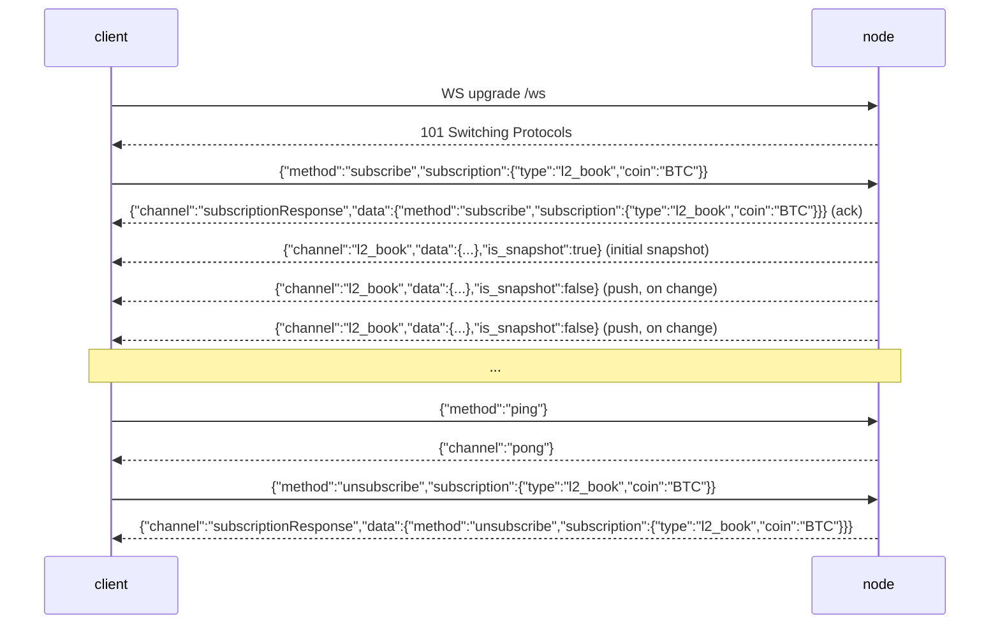

# WebSocket API

:::info
**Статус.** На ноде уже работает: `l2_book`, `bbo` (стакан/лучшие котировки), `trades`, `active_asset_ctx` (метки/оракул/финансирование/OI по каждому рынку), `all_mids`, `fills`, `user_events` и `candles` (скользящие OHLCV-бары по `(coin, interval)`) — все каналы транслируют реальные подтверждённые данные, обновления идут по событиям (кадр по каналу отправляется только при изменении состояния с момента последнего коммита). Также поддерживаются `post` (запрос/ответ через WS) и `ping`/`pong`. Форматы каждого канала описаны в разделе [подписки](./subscriptions.md).
:::

:::info
**Имена каналов в snake_case (нативный формат MTF).** Эндпоинт `/ws` ноды использует нативный формат MTF, поэтому имена каналов передаются в snake_case: `l2_book`, `bbo`, `trades`, `active_asset_ctx`, `fills`, `candles`, `user_events`. Шлюз предоставляет этот же нативный WS по адресу `api.<net>.mtf.exchange/ws`.
:::

## Кратко

Одно WS-соединение мультиплексирует подписки на множество каналов. Протокол кадров повторяет HL (`{"method":"subscribe","subscription":{"type":...}}`), однако **имена каналов в нативном формате MTF — snake_case** (`l2_book`, `user_events`, …): клиент отправляет подписку, сервер отвечает подтверждением `subscriptionResponse`, затем начальным снимком состояния, после чего отправляет кадры `{"channel":...,"data":...}` при каждом коммите состояния. Каналы стакана (`l2_book`, `bbo`) привязаны **к конкретному рынку** и требуют указания `coin`. На этой странице описан жизненный цикл соединения; каталог каналов — в разделе [подписки](./subscriptions.md).

## URL

```
wss://api.<net>.mtf.exchange/ws
```

Нативный WS MTF (каналы в snake_case) обслуживается шлюзом по адресу `/ws`. Точка входа шлюза терминирует TLS (`wss://`). При самостоятельном запуске ноды нативный WS доступен без шифрования по адресу `ws://localhost:8080/ws` — протокол кадров идентичен в обоих случаях.

## Жизненный цикл соединения



## Кадры

Все кадры — JSON-**текстовые** фреймы. Бинарные фреймы отклоняются с кадром ошибки (соединение при этом остаётся открытым). Входящие кадры идентифицируются по полю `method`; исходящие — по полю `channel`.

### `subscribe`

```json
{
  "method": "subscribe",
  "subscription": { "type": "<channel>", "coin": "<coin>" }
}
```

- `subscription.type` (обязательно) — имя канала (snake_case, например `l2_book`). Неизвестные имена возвращают кадр ошибки.
- `subscription.coin` (обязательно для каналов привязанных к рынку: `l2_book` / `bbo` / `trades` / `active_asset_ctx`; не указывается для `user_events`) — см. [Параметр coin](#параметр-coin).

Сервер отвечает **двумя** кадрами по порядку:

1. Подтверждение:

```json
{
  "channel": "subscriptionResponse",
  "data": { "method": "subscribe", "subscription": { "type": "l2_book", "coin": "BTC" } }
}
```

2. Начальный снимок состояния по подписанному каналу (см. каждый канал в разделе [подписки](./subscriptions.md)). Для `l2_book` / `bbo` это реальный снимок последнего подтверждённого стакана; для каналов без активного источника данных — пустое, но структурно корректное тело.

Повторная подписка на ту же пару `(type, coin)` **молча игнорируется** (без повторного подтверждения, без ошибки) — поведение идентично HL.

### `unsubscribe`

```json
{ "method": "unsubscribe", "subscription": { "type": "l2_book", "coin": "BTC" } }
```

Подтверждение (зеркалирует подтверждение подписки с `method: "unsubscribe"`):

```json
{
  "channel": "subscriptionResponse",
  "data": { "method": "unsubscribe", "subscription": { "type": "l2_book", "coin": "BTC" } }
}
```

После подтверждения кадры по данной паре `(type, coin)` поступать не будут, пока вы не подпишетесь заново. Отписка от пары `(type, coin)`, на которую подписки не было, является операцией-заглушкой (подтверждение всё равно придёт).

### `ping` / `pong`

```json
{ "method": "ping" }
```

```json
{ "channel": "pong" }
```

Простой кадр `{"method":"ping"}` (без `subscription`) является сердцебиением на уровне приложения; сервер отвечает `{"channel":"pong"}`. Нода также автоматически отвечает на низкоуровневые пинги WebSocket (управляющие кадры `Ping` по RFC 6455) пакетом `Pong`, поэтому работает любой из двух механизмов.

### Кадр ошибки

Любой некорректный или нераспознанный входящий кадр порождает кадр ошибки **без закрытия соединения**:

```json
{ "channel": "error", "data": { "error": "<reason>" } }
```

Возможные причины: некорректный JSON, отсутствие поля `method`, отсутствие `subscription` / `subscription.type`, неизвестное имя канала (`"unknown channel: <name>"`), бинарный кадр или неизвестный метод. Клиент может исправить запрос и повторить его на том же соединении.

### Push-сообщения

Кадры с живыми данными используют единый конверт:

```json
{ "channel": "<channel>", "data": { /* channel-specific */ }, "is_snapshot": false }
```

- `is_snapshot` — булево значение: `true` в начальном кадре при подписке (полный снимок), `false` в последующих обновлениях по событиям. **Каждый кадр содержит полный снимок состояния** (например, `l2_book` — полные 20 уровней, `all_mids` — полная карта, `account_state` — полное состояние аккаунта); поле `is_snapshot` носит информационный характер и не означает «это дифф». Клиент, который просто заменяет локальное состояние при каждом кадре, всегда будет корректен и может игнорировать это поле.
- В кадре **нет** полей `seq`, `ts` или `sub_id`. Демультиплексирование выполняется по `channel` (а для каналов, привязанных к рынку, — по `coin` внутри `data`).

Обновления **идут по событиям**: после каждого коммита нода публикует кадр для подписанного канала **только тогда, когда подтверждённое состояние этого канала реально изменилось** с момента предыдущего коммита. Коммит, не затронувший отслеживаемый канал, не порождает для него никаких кадров — вы получаете меньше кадров, чем создаётся блоков, и никогда не получаете повторную отправку неизменившихся данных (см. [Push на каждого подписчика](#push-на-каждого-подписчика)).

### `post` (запрос/ответ через WS)

`post` позволяет выполнить разовый вызов запрос/ответ через то же соединение, не открывая REST-соединение. Тело `request` — тот же конверт `{type, payload}`, который принимают REST-маршруты, и обрабатывается через **те же самые обработчики**, что и `POST /info` и `POST /exchange`, включая проверку подписи на действиях.

Запрос:

```json
{
  "method": "post",
  "id": 42,
  "request": { "type": "info", "payload": { "type": "node_info" } }
}
```

Ответ (корреляция по `id`):

```json
{
  "channel": "post",
  "data": {
    "id": 42,
    "response": { "type": "info", "payload": { /* same body as POST /info */ } }
  }
}
```

- `request.type` принимает значения `"info"` или `"action"`.
- Для `"action"` поле `payload` должно быть полным подписанным конвертом биржевого запроса (`signature` / `nonce` / `action`), идентичным тому, что используется в [`POST /exchange`](../rest/exchange.md). Действие подписывается по **компактной сериализации `serde_json` объекта `action`** — детерминированной канонической форме, которую фиксирует SDK.
- Ошибки возвращаются как обычный кадр `post` с `response.type: "error"` и строковым `payload` (соединение при этом не закрывается):

```json
{ "channel": "post", "data": { "id": 42, "response": { "type": "error", "payload": "<message>" } } }
```

Действие, которое завершилось неудачей, но было корректно сформировано (например, неверная подпись), возвращается как обычный ответ на `action` с `payload.accepted: false` и строкой `error` — не как ответ с типом `error`.

## Параметр coin

Хаб маршрутизации ключируется по `(channel, coin)`. Для каналов, привязанных к рынку, — `l2_book` и `bbo` — это означает:

- **`coin` обязателен.** Без него вы попадаете в бакет `(channel, None)`, в который издатель стакана по конкретному рынку ничего не пишет — вы получите только начальный пустой снимок и никаких обновлений в режиме реального времени.
- **Подписчик `BTC` получает только кадры по `BTC`.** Коммиты по ETH никогда не достигают подписки на BTC, и наоборот.

Значение `coin` перед использованием в качестве ключа канонизируется в **строку идентификатора актива**, поэтому два разных формата ссылаются на один и тот же бакет:

- **Числовой идентификатор актива** — например, `"0"`, `"7"` — напрямую указывает на этот рынок (нативный канонический ключ MTF).
- **Символ** — например, `"BTC"` — разрешается в идентификатор актива через подтверждённую вселенную (`mip3_market_specs`, по совпадению с `symbol` или `asset_name`).

Таким образом, подписчик с ключом `"BTC"` и подписчик с числовым идентификатором `"0"` (если BTC — актив 0) используют **один и тот же** бакет маршрутизации при публикации. Coin, который не является ни числом, ни известным символом вселенной, сохраняется буквально как собственный бакет — вы получите подтверждение и пустой снимок, но никаких живых кадров (честный ответ «неизвестный рынок» вместо произвольного маппинга).

## Push на каждого подписчика

Отправка push-уведомлений **контролируется подписчиком, происходит на уровне рынка и только при изменении данных**. После каждого подтверждённого блока нода для каждого рынка проверяет `has_receivers(channel, coin)` — операция O(1) — и только затем агрегирует стакан этого рынка и транслирует его **только в случае изменения** с момента предыдущего коммита. Следствия:

- Рынок, за которым никто не следит, стоит только одну проверку O(1); стакан не строится.
- Подписчик на `BTC` никогда не инициирует построение стакана по `ETH`.
- Рынок, стакан которого не изменился при коммите, не рассылает ничего для этого коммита — повторная отправка исключена.
- Кадры доставляются **всем** текущим подписчикам данного бакета `(channel, coin)`.

## Противодавление и отставание

Каждая подписка опирается на ограниченный широковещательный кольцевой буфер ёмкостью **256** кадров. Потребитель, отставший более чем на 256 кадров, **отключается**: сервер отправляет финальный кадр ошибки с описанием отставания и прекращает пересылку по данной подписке.

```json
{ "channel": "error", "data": { "error": "lagged behind broadcast by <n> messages" } }
```

При получении этого сигнала следует повторно подписаться (вы получите свежий снимок). Нода **не пропускает кадры молча** — для блокчейна производных инструментов пропуск в состоянии стакана хуже явного сброса.

## Аутентификация

Публичные рыночные каналы (`l2_book`, `bbo`, `trades`, `all_mids`) **не требуют аутентификации**.

Каналы на уровне аккаунта (`fills`, `user_events`) работают в реальном времени и маршрутизируются по 0x-адресу `user`, однако **шлюз аутентификации пока не реализован** — любое соединение может подписаться на фид любого адреса (данные — те же публичные подтверждённые сделки, ключ — аккаунт). Отдельный конверт аутентификации при подписке (чтобы соединение видело только свой аккаунт) запланирован в дорожной карте. Для аутентифицированного чтения и записи в настоящее время используйте канал `post` (информационные запросы и подписанные действия через ту же верификацию EIP-712, что и `POST /exchange`). См. раздел [подписки](./subscriptions.md).

## Мультиплексирование

Одно соединение может содержать множество подписок; каждая демультиплексируется по паре `(channel, coin)`. У каждой подписки — собственный получатель широковещательной рассылки и задача-пересылка; соединение чередует их кадры в одном сокете. Входящие кадры маршрутизируются по `channel` и `coin` внутри `data`.

```
l2_book  coin "0" (BTC)
l2_book  coin "1" (ETH)
bbo      coin "0" (BTC)
```

## Поведение при закрытии

- Кадр `close` от клиента (или EOF) разрывает соединение и прерывает все задачи-пересылки.
- Ошибка чтения логируется и закрывает соединение.
- Отстающая подписка отбрасывается отдельно (кадр ошибки), однако **соединение остаётся открытым** — остальные подписки продолжают работать.

Специальной таблицы кодов закрытия нет; применяются стандартные коды закрытия WebSocket.

## Стратегия переподключения

1. При разрыве соединения переподключайтесь с экспоненциальной выдержкой (рекомендуется: базовая 200 мс, максимум 30 с, джиттер ±20%).
2. Заново подпишитесь на каждую пару `(type, coin)` с нуля. Первый кадр после каждой подписки — свежий снимок, поэтому токен возобновления не нужен — сбрасывайте локальное состояние стакана и восстанавливайте его из снимка.
3. При получении кадра ошибки `lagged` обрабатывайте его так же, как разрыв соединения для данной подписки, и переподписывайтесь.

:::warning
Механизм `seq` / `resume` / `resume_token` **не реализован**. Каждая (повторная) подписка начинается со свежего снимка. Буферы возобновления — в дорожной карте, пока не реализованы.
:::

## См. также

- [Каталог WS-подписок](./subscriptions.md)
- [`POST /exchange`](../rest/exchange.md) — тот же конверт EIP-712, используемый в пути `post` action
- [`POST /info`](../rest/info.md) — REST-эквиваленты для разовых запросов (также доступны через `post`)
