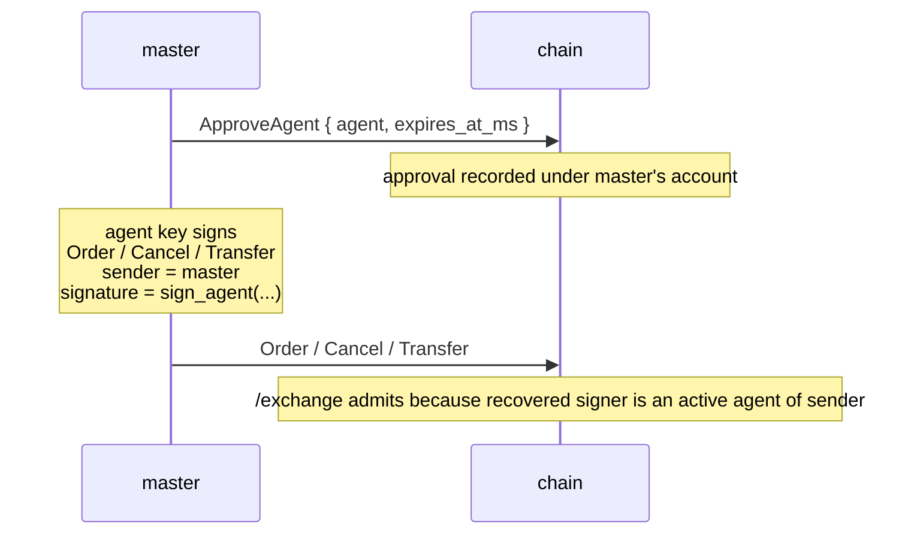

# Агентские кошельки

:::tip
**Стабильно.**
:::

**Агентский кошелёк** (или «API-кошелёк») — это ключ, который подписывает торговые действия от имени основного аккаунта, не обладая при этом правом на вывод средств. Именно так работает любой серьёзный маркет-мейкер: основной ключ хранится в холодном хранилище, а горячий ключ управляет ботами.

Этот примитив идентичен API-кошелькам ведущего on-chain перп-DEX и полностью совместим с ним на уровне протокола.

## Зачем использовать агентский кошелёк

- **Основной ключ в холодном хранилище.** Одно подтверждение с холодного кошелька — и высокоценный ключ больше никогда не выходит на связь.
- **Изоляция по боту.** Разные агенты для каждой стратегии или каждой машины; скомпрометированный агент можно отозвать, не затрагивая остальных.
- **Срок действия.** Подтверждение выдаётся с временной меткой истечения; ключ самостоятельно прекращает работу, даже если вы забыли его отозвать.
- **Аудит.** Каждое действие подписано конкретным агентом — журнал блокчейна пригоден для криминалистического анализа.

## Жизненный цикл



Основной кошелёк подписывает `ApproveAgent` один раз. После того как блок подтверждён, агент может подписывать любые действия с `sender = master_addr`, и блокчейн воспринимает их так, как будто их подписал сам основной кошелёк. В подтверждение можно заложить явный срок действия, чтобы горячие ключи самостоятельно прекращали работу, даже если явный отзыв так и не последовал.

## Проверка авторизации

Каждый запрос к [`POST /exchange`](../api/rest/exchange.md) содержит три элемента:

```
sender    = "0x<claimed master address>"
signature = secp256k1 ECDSA over the EIP-712 envelope
action    = the state-mutating action
```

Блокчейн выполняет следующую проверку при каждом входящем запросе:

```
recovered_addr = ecrecover(eip712_envelope(action), signature)

if recovered_addr == sender:
    admit                                # master signed
else if recovered_addr is an active agent of sender (not expired):
    admit                                # an active agent of sender signed
else:
    return 401
```

Два важных следствия:

1. **Ни токенов на предъявителя, ни API-ключей.** Подпись сама по себе является аутентификацией. Право доступа подтверждается владением приватным ключом агента — ни URL запроса, ни заголовки никакого доступа не дают.
2. **`sender` принимается сервером только благодаря подписи.** Указать `sender = anyone` ничего не докажет, пока восстановленный подписант не совпадёт с множеством одобренных для этого аккаунта.

## Конверт EIP-712, подробно

Подписываемые данные для любого действия:

```
message_hash  = keccak256( msgpack(action) )
signed_hash   = keccak256( 0x1901 ‖ domain_separator ‖ message_hash )
signature     = secp256k1_sign( signed_hash, agent_private_key )
```

где:

```
domain_separator = keccak256(
    keccak256("EIP712Domain(string name,string version,uint256 chainId,address verifyingContract)") ‖
    keccak256("MetaFlux") ‖
    keccak256("1") ‖
    chain_id_as_uint256_be ‖
    address(0).padded_to_32
)
```

Такая структура соответствует стандартной семантике конверта EIP-712; клиенты в стеке EVM, уже поддерживающие EIP-712 (MetaMask, Rabby, Ledger, WalletConnect), могут работать с этим доменом без каких-либо изменений.

`action` подписывается как **типизированные структурированные данные EIP-712** — один первичный тип на каждый вариант действия (`MetaFluxTransaction:<Action>`), что позволяет кошелькам отображать каждое поле по имени. Строки типов для каждого действия описаны в разделе [подписание типизированных данных](../integration/typed-data-signing.md). Восстановление подписи и совместимость с EVM не меняются независимо от того, кто подписывает — основной кошелёк или одобренный агент.

## Что хранит блокчейн

Для каждого основного аккаунта хранится набор одобренных агентов:

```
approval = {
  agent          : address (20 bytes),
  approved_at_ms : u64 (block time at approval),
  expires_at_ms  : u64 or null (null = no expiry),
  name           : optional label for bookkeeping
}
```

Все временные поля берутся из времени блока, определённого консенсусом, — не из системных часов. Детерминизм: все валидаторы согласны со статусом агента на одной и той же высоте блока.

## Одобрение агента

Основной кошелёк отправляет действие `ApproveAgent` через [`POST /exchange`](../api/rest/exchange.md):

```json
{
  "sender":    "0x<master_addr>",
  "signature": "0x<master_signature>",
  "action": {
    "type": "ApproveAgent",
    "params": {
      "agent":          "0x<agent_addr>",
      "expires_at_ms":  1735689600000,
      "name":           "trading-bot-1"
    }
  }
}
```

`expires_at_ms`:
- `null` → без срока действия (действует до явного отзыва)
- положительное целое число → unix-время в миллисекундах, после которого блокчейн отклоняет запросы, подписанные агентом

`name` — исключительно метка для вашего собственного учёта; она отображается в запросах `userState` / `subAccounts`.

## Торговля через агента

После того как блок с подтверждением зафиксирован, подписывайте любые действия ключом **агента**, но отправляйте с адресом **основного** кошелька в поле `sender`. SDK формирует конверт EIP-712 и отправляет подписанный пакет. Блокчейн восстанавливает адрес агента из подписи, замечает расхождение с `sender`, проверяет набор одобрений — и пропускает запрос.

## Задержка распространения

После того как `ApproveAgent` зафиксирован на высоте блока `H`:
- запросы в блоке `H+1` и позже видят новое одобрение

На практике это означает: подождите один тик консенсуса после отправки `ApproveAgent`, прежде чем запускать трафик, подписанный агентом. Политика повторных попыток SDK с линейным откатом корректно обрабатывает эту граничную ситуацию.

Ужесточение срока действия (фактический отзыв агента) подчиняется той же задержке в один блок.

## Ротация и истечение срока действия

Есть два способа прекратить полномочия агента:

- **Истечение срока** задаётся при одобрении и выполняется автоматически — как только `now > expires_at_ms`, запросы начинают отклоняться. Никаких дополнительных действий не требуется.
- **Повторное одобрение** с ужесточённым сроком действия. Отправка нового `ApproveAgent` для того же адреса агента перезаписывает предыдущую запись; установка `expires_at_ms` в прошедшее время фактически отзывает ключ.

Для плановой ротации предпочтительнее использовать истечение срока. SDK прозрачно управляет циклом обновления.

## Защита от повторного воспроизведения

Блокчейн применяет нонсы на уровне пользователя:

- Каждое действие содержит `nonce`
- Повторное использование нонса для одного и того же пользователя отклоняется, даже если подпись в остальном корректна

Практическое следствие: один агент может безопасно отправлять параллельные действия при условии, что каждое содержит уникальный нонс. SDK, как правило, используют unix-время в миллисекундах с небольшим случайным сдвигом.

Для запросов, подписанных агентом, пространство нонсов привязано к **основному** кошельку (`sender`), а не к агенту. Два разных агента одного основного кошелька разделяют общее пространство нонсов.

## Чеклист для продакшна

Проверенные паттерны для эксплуатации парка агентских ключей в продакшне:

| Пункт | Зачем |
|-------|-------|
| Основной ключ в холодном хранилище (аппаратный кошелёк / HSM) | Основной ключ подписывает только `ApproveAgent` (и `WithdrawUsdc` при выводах) — редкие события |
| Один агент на хост / контейнер | При компрометации хоста под угрозой оказывается только полномочие этого агента; отзыв не затрагивает остальных |
| `expires_at_ms` не позднее 30 дней с момента одобрения | Задаёт обязательный цикл обновления; пропущенные обновления автоматически отзывают ключ |
| Имя агента содержит имя хоста и время запуска | Делает криминалистический анализ тривиальным: `mm-host-3 / 2026-Q2` |
| Скрипт ротации: предварительно регистрировать новый агент до истечения старого | Отправить `ApproveAgent` для нового ключа за 24ч до истечения старого; переключить трафик; дать старому истечь |
| Регулярные учения по компрометации: план отзыва и ротации тестируется ежеквартально | Когда ключ реально утекает, важна механическая исполнимость плана |
| Следить за `userEvents` на предмет событий `agentApproved` / `agentExpired` | Убедиться, что состояние на стороне блокчейна соответствует ожиданиям |
| Использовать разные агенты для отмены ордеров и полноценной торговли | Ключи только для отмены безопаснее в частично доверенных средах |

### Паттерн ротации

```
day -1   submit ApproveAgent { agent: new_key, expires_at_ms: NOW + 30d }
          wait 1 block (consensus tick); confirm via /info agents
day 0    flip traffic in your bot: stop using old_key, start using new_key
day 0    submit ApproveAgent { agent: old_key, expires_at_ms: NOW + 1h }
          to bound the old key's remaining authority window
day +1h  old_key expires automatically
```

Предварительная регистрация исключает любое окно, в котором оба ключа могли бы использоваться параллельно
(что, впрочем, тоже допустимо — параллельные агенты разделяют пространство нонсов основного кошелька).

## Что агент не может делать

По замыслу, агенты **не имеют права на вывод средств**. Всё, что перемещает средства с основного аккаунта (вывод в внешние сети, переводы на другие адреса), должно быть подписано основным ключом. Управление агентами (создание или продление одобрений) — тоже исключительная прерогатива основного кошелька; рекурсия «агент агента» не предусмотрена.

Агенты *могут* торговать, отменять ордера, изменять режим маржи в установленных пределах, размещать/отменять TWAP и выполнять большинство обычных торговых операций.

## Случаи ошибок

| Симптом | Причина | Решение |
|---------|---------|---------|
| `401` на каждый запрос, подписанный агентом | Одобрение ещё не зафиксировано | Подождать один блок после `ApproveAgent` |
| `401` после заведомо рабочего периода | Срок действия агента истёк | Выдать новое одобрение (с новым сроком) или перейти на свежего агента |
| `401` только на действия по выводу | Агенты не могут выводить средства (по замыслу) | Подписывать выводы основным ключом |
| `401` сразу на новом основном аккаунте | `sender` указан как основной, но подписант — другой адрес, и одобрения нет | Проверить, что подпись выполнена правильным ключом |

## Смотрите также

- [`POST /exchange`](../api/rest/exchange.md) — путь принятия запросов
- [Руководство по подписанию](../integration/signing.md) — конкретный пример EIP-712 от начала до конца
- [Миграция с HL](../integration/migrating-from-hl.md) — паттерны переноса ботов с HL
