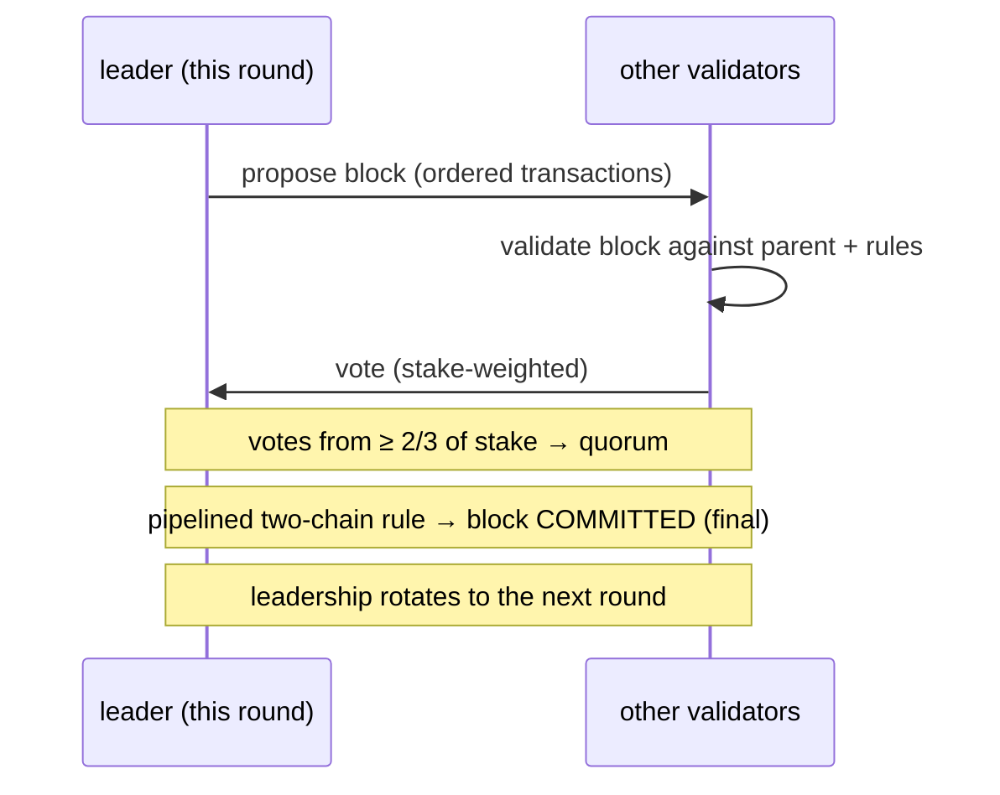
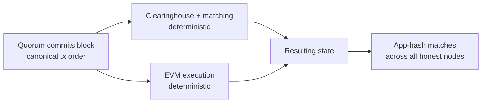

# Консенсус (MetaFluxBFT)

:::info
**В продакшне.** MetaFluxBFT — это производственный движок консенсуса, защищающий L1 MetaFlux. Он упорядочивает каждую транзакцию — ордера, отмены, ликвидации, переводы, EVM-вызовы — в единую каноническую цепочку с детерминированной и мгновенной финальностью.
:::

## Коротко о главном

**MetaFluxBFT** — это отказоустойчивый к Byzantine-сбоям (BFT) движок консенсуса на основе Proof-of-Stake для MetaFlux. Множество валидаторов с взвешенными долями приходит к согласию, блок за блоком, относительно единого канонического порядка каждой транзакции. Как только блок подтверждается кворумом, он становится **окончательным немедленно** — никаких вероятностных подтверждений, никакого «ожидания N блоков», никаких реорганизаций. Именно это мгновенное, тотальное упорядочение позволяет MetaFlux запускать полностью on-chain книгу ордеров и клиринговую палату: каждый матч, исполнение, платёж по финансированию и ликвидация рассчитываются по ордеру, с которым уже согласна вся сеть.

## Почему биржа нуждается в этом

Торговая площадка справедлива лишь тогда, когда все участники видят одну и ту же книгу в одном и том же порядке. MetaFluxBFT обеспечивает два свойства, которые непосредственно важны для трейдеров и разработчиков:

| Свойство | Что это значит для вас |
|----------|------------------------|
| **Тотальное упорядочение** | Каждая транзакция занимает одну согласованную позицию в последовательности. Матчинговый движок обрабатывает ордера именно в этом порядке — не существует привилегированного канала, способного переупорядочить транзакции в обход вас. |
| **Мгновенная финальность** | Подтверждённый блок не может быть отменён. Исполнение ордера или расчёт завершены в момент фиксации блока — вам никогда не нужно делать скидку на риск реорганизации. |

Вместе эти свойства обеспечивают **матчинг, устойчивый к фронтраннингу**, и **немедленный расчёт**: та же каноническая последовательность, которая защищает цепочку, является последовательностью, по которой сопоставляется книга ордеров.

## Происхождение дизайна

MetaFluxBFT — это **нативная реализация MetaFlux**, созданная в академической традиции семейства конвейерных BFT-протоколов **HotStuff / Jolteon** (линия исследований, включающая также DiemBFT). Это семейство характеризуется следующим:

- **Основанность на лидере** — в каждом раунде один валидатор предлагает следующий блок, а остальные голосуют за него.
- **Частичная синхронность** — протокол всегда остаётся *безопасным* (никогда не производит конфликтующую финализированную историю) и обеспечивает *прогресс*, когда сеть своевременно доставляет сообщения.
- **Двухцепочечная фиксация** — финальность достигается через короткую конвейерную цепочку голосований, а не через единый раунд «всё или ничего», что снижает задержку подтверждения при сохранении BFT-безопасности.

MetaFlux создаёт собственный движок на основе этих публичных исследовательских разработок, не разветвляя существующую кодовую базу, что позволяет настроить протокол под потребности on-chain биржи (детерминированное исполнение, интегрированная EVM, набор валидаторов, определяемый стейкингом).

## Валидаторы и стейкинг

Набор валидаторов формируется непосредственно из **on-chain стейка** — MetaFluxBFT является протоколом Proof-of-Stake. Любой, кто соответствует требованиям по стейку, может запустить валидатор; делегаторы поддерживают валидаторов с помощью MTF (см. [Стейкинг](./staking.md)).

- **Голосование, взвешенное по стейку.** Влияние валидатора на консенсус пропорционально поддерживающему его стейку, а не одному голосу на узел.
- **Кворум = две трети стейка.** Блок фиксируется только тогда, когда за него проголосуют валидаторы, представляющие **не менее двух третей от общей взвешенной силы голосов**. Этот кворум в две трети является основой BFT-гарантии.
- **Ротация лидерства.** Право предлагать блоки ротируется по набору валидаторов, так что ни один валидатор не контролирует производство блоков.

### Эпохи

Набор валидаторов фиксируется в рамках **эпохи** и может меняться только на границах эпох. Стабильность набора на протяжении эпохи делает консенсус детерминированным и предсказуемым, при этом позволяя набору эволюционировать со временем по мере перераспределения стейка, присоединения или выхода валидаторов. При смене эпохи протокол принимает новый набор, определённый стейкингом, для следующей эпохи.

## Безопасность и живость

Два свойства определяют гарантии MetaFluxBFT в классическом BFT-смысле:

:::tip Безопасность
**Цепочка никогда не финализирует две конфликтующие истории**, при условии, что **более двух третей** взвешенной силы голосов принадлежат честным участникам. Иными словами, MetaFluxBFT терпит до **одной трети** голосующей силы с Byzantine-поведением (произвольными сбоями), не допуская фиксации конфликтующих блоков. Безопасность сохраняется даже при медленной сети или задержках сообщений.
:::

:::tip Живость
**Цепочка продолжает двигаться вперёд** — фиксировать новые блоки — когда сеть достаточно синхронна для своевременной доставки сообщений. Поскольку лидерство ротируется, единственный зависший или не отвечающий лидер не может остановить цепочку: протокол передаёт лидерство дальше и продолжает работу.
:::

Это стандартное разделение в частично-синхронном BFT: *безопасность всегда*, *живость при синхронности*.

## Финальность и детерминированное исполнение

Финальность в MetaFluxBFT является **немедленной и абсолютной**. В момент, когда кворум фиксирует блок, этот блок — вместе с точным порядком транзакций, который он несёт, — становится постоянным. Нет вероятностного периода расчётов и нет риска реорганизации.

Исполнение накладывается поверх этого зафиксированного упорядочения и является **полностью детерминированным**:

1. Консенсус устанавливает канонический порядок транзакций в блоке.
2. Каждый узел запускает **одинаковый** переход состояния для этого порядка — клиринговую палату и матчинговый движок для торговли, а также EVM для транзакций со смарт-контрактами.
3. Поскольку входные данные (упорядоченные транзакции) и функция перехода идентичны, каждый честный узел независимо приходит к **одному и тому же итоговому состоянию**.

Узлы подтверждают согласие, сравнивая компактный отпечаток итогового состояния («app-hash»). Идентичное упорядочение плюс детерминированное исполнение означает, что app-hash каждого честного узла совпадает — сеть остаётся в точном согласии без необходимости доверять вычислениям какого-либо одного узла.

## Ответственность

Валидаторы несут экономическую ответственность за своё участие. Валидатор, **доказуемо нарушивший правила**, может быть **заключён в тюрьму** (исключён из активного участия) и **оштрафован (слэшинг)** (лишится части стейка). Продолжительная недоступность также может привести к заключению в тюрьму. Это привязывает экономическое положение валидатора к честной работе и подкрепляет гарантии консенсуса реальным стейком, находящимся под угрозой. Делегаторам следует учитывать операционный опыт валидатора; см. [Стейкинг](./staking.md) для понимания того, как слэшинг и заключение в тюрьму распространяются на делегированный стейк.

## Как всё связано воедино

MetaFluxBFT является фундаментом, на котором стоит весь остальной протокол:

- **Книга ордеров и клиринговая палата** выполняют матчинг и расчёты на основе единого канонического упорядочения — именно это делает on-chain матчинг справедливым.
- **Ликвидации** и **финансирование** применяются в точках, определённых консенсусом в этом же упорядочении, поэтому каждый узел ликвидирует и начисляет финансирование одинаково.
- **EVM-сайдчейн** также исполняется на основе зафиксированного упорядочения, разделяя ту же финальность.
- **Стейкинг** и **управление** влияют на консенсус: стейк определяет набор валидаторов, а параметры, устанавливаемые управлением, сами фиксируются через цепочку.

## Смотрите также

- [Стейкинг](./staking.md) — делегирование MTF, поддержка валидаторов, получение наград, а также правила слэшинга и заключения в тюрьму, обеспечивающие консенсус
- [Расчётные цены](./mark-prices.md) — цены, определяемые консенсусом, которые управляют маржой и ликвидациями
- [Многоуровневая ликвидация](./tiered-liquidation.md) — как ликвидации применяются на зафиксированном упорядочении
- [Модель исполнения EVM](../evm/execution-model.md) — как EVM исполняется на зафиксированном упорядочении блоков

## Часто задаваемые вопросы

Показать FAQ

**В: Сколько подтверждений нужно ожидать?**
О: Ни одного. Финальность мгновенна — как только блок зафиксирован, он окончателен и не может быть реорганизован. Исполнение ордера завершается в момент фиксации его блока.

**В: Может ли цепочка откатить сделку?**
О: Нет. Реорганизаций не существует. Зафиксированная история постоянна.

**В: Что происходит, если текущий лидер уходит офлайн?**
О: Лидерство ротируется. Зависший лидер не может остановить цепочку; протокол передаёт лидерство дальше и продолжает фиксировать блоки, как только сеть своевременно доставляет сообщения.

**В: Какой объём неисправного стейка может выдержать сеть?**
О: До одной трети от общей взвешенной силы голосов может обладать Byzantine-поведением без того, чтобы цепочка когда-либо финализировала конфликтующую историю. Безопасность требует, чтобы более двух третей голосующей силы было честным.

**В: Это Proof-of-Work?**
О: Нет. MetaFluxBFT работает на Proof-of-Stake — набор валидаторов и голосующая сила определяются on-chain стейком MTF, а не майнингом.

