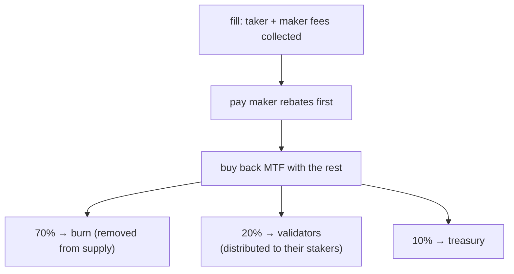

# Комиссии

:::info
**Концептуальная страница.** На этой странице объясняется, как рассчитывается торговая комиссия за каждое исполнение, как начисляются кредиты строителю и рефереру, какие комиссии применяются к спот-торговле и ликвидациям, а также куда поступают собранные средства. Актуальные ставки — уровни комиссий по объёму, уровни рибейта для мейкеров и скидки за стейкинг — см. в разделе [Тарифная сетка](./fee-schedule.md). Значения комиссий являются сетевыми параметрами и могут обновляться через управление.
:::

## Кратко

За каждое исполнение взимается комиссия мейкера и тейкера согласно [Тарифной сетке](./fee-schedule.md). Кредит строителя позволяет направить часть средств источнику потока ордеров, а кредит реферера — передать долю комиссии тейкера реферальному адресу. После выплаты рибейтов мейкерам протокол направляет оставшийся доход на **выкуп MTF**, после чего выкупленный MTF распределяется в соотношении **70% сжигается / 20% валидаторам / 10% в казначейство**. Комиссии списываются с вашего баланса в момент исполнения и отображаются в [`userFills`](../api/rest/info.md#user_fills).

## Как рассчитывается комиссия

Комиссии рассчитываются в пространстве целых USDC: условная стоимость — это произведение цены на объём, усечённое к нулю.

### За каждое исполнение

```text
notional    = |price × size|
taker_fee   = notional × taker_rate
maker_fee   = notional × maker_rate
builder_fee = notional × builder_rate    # additive, taker-only, capped
```

Ставки тейкера и мейкера определяются вашим уровнем в [Тарифной сетке](./fee-schedule.md): базовая ставка по объёму за 30 дней, дополнительный рибейт мейкера по доле объёма мейкера и скидка тейкера в зависимости от количества застейканного MTF. Отрицательная эффективная ставка мейкера означает рибейт, выплачиваемый **мейкеру** из комиссий тейкера, собранных на том же потоке — протокол никогда не выплачивает больше, чем собирает.

Комиссия за каждое исполнение отображается в каждой записи [`userFills`](../api/rest/info.md#user_fills) в поле `fee` (базовые единицы USDC; положительное значение = уплачено, отрицательное = получен рибейт).

## Кредит строителя

Источник потока ордеров может получить долю комиссии тейкера, указав адрес строителя в ордере. Кредит выплачивается за каждое исполнение на этот адрес. Типичные варианты использования:

- фронтенд или агрегатор, направивший поток,
- API рыночных данных, объединяющий исполнения,
- автоматизированный сервис управления рисками, выставляющий защитные ордера.

Строитель должен быть зарегистрированным адресом (см. [`approve_builder_fee`](../api/rest/exchange.md#approve_builder_fee)). Незарегистрированные строители молча игнорируются. Кредит строителя является аддитивным и применяется только к тейкеру с ограничением на ордер; на сторону мейкера он не влияет.

## Кредит реферера

Когда у аккаунта установлен реферер, доля его **комиссии тейкера** направляется рефереру **до** распределения остатка — она вычитается из доли протокола, а не является дополнительной нагрузкой на тейкера. Комиссия мейкера кредит реферера не предусматривает.

Реферальная система одноуровневая (без многоуровневых цепочек — защита от пирамиды). Реферер устанавливается однократно через [`set_referrer`](../api/rest/exchange.md#set_referrer) и не может быть изменён впоследствии; установка себя собственным рефером отклоняется.

Кредит строителя и кредит реферера могут применяться одновременно к одному исполнению — они выплачиваются независимо друг от друга.

## Куда поступают комиссии

Собранные комиссии проходят через единый механизм накопления стоимости:



1. **Сначала выплачиваются рибейты мейкерам.** Отрицательные чистые ставки мейкера (см. [Тарифную сетку](./fee-schedule.md)) погашаются из комиссий, собранных на том же потоке.
2. **Остаток идёт на выкуп MTF.** Весь доход от комиссий после рибейтов используется для рыночного выкупа MTF по протокольной цене. Это создаёт давление на покупку и конвертирует доход от комиссий в MTF до его распределения.
3. **Выкупленный MTF делится в соотношении 70 / 20 / 10:**
   - **70% сжигается** — навсегда изымается из обращения (дефляционный механизм).
   - **20% передаётся валидаторам**, которые распределяют их среди своих стейкеров. Это **дивиденд стейкера** — доход от комиссий достигает стейкеров через долю их валидатора.
   - **10% поступает в казначейство** (которое также поглощает остатки от округления, обеспечивая точность распределения).

Накопленные итоги пулов (выкупленный и сожжённый MTF, пул валидаторов, казначейство) фиксируются в зафиксированном состоянии и доступны через API по пути чтения [`protocol_metrics`](../api/rest/info.md#protocol_metrics):

```bash
curl -X POST https://api.devnet.mtf.exchange/info -d '{"type":"protocol_metrics"}'
```

Поскольку дивиденд стейкера выплачивается через долю валидатора, стейкайте больше MTF (или делегируйте валидатору), чтобы получать большую долю — см. [Стейкинг](./staking.md).

## Спот-комиссии

Та же схема мейкера/тейкера применяется к спот-исполнениям, однако спот-комиссии начисляются на **отдельный комиссионный счёт** в отличие от бессрочных контрактов, и они взимаются **с актива, который получает каждая сторона** — не всегда с баланса котируемой валюты:

- комиссия **тейкера** взимается с актива, который получает тейкер,
- комиссия **мейкера** взимается с актива, который получает мейкер.

Таким образом, спот-**покупатель** (получающий базовый актив) платит комиссию в **базовом активе**, а **продавец** (получающий котируемую валюту) платит комиссию в **котируемой валюте**. Каждая спот-пара может устанавливать собственные ставки мейкера/тейкера; если пара не задала их, применяются глобальные спот-умолчания. Спот-уровни см. в ответе [`/info fee_schedule`](../api/rest/info.md#fee_schedule), модель расчётов описана в разделе [спот-торговля](../products/spot.md#matching-fills-and-fees).

## Комиссии при ликвидационных исполнениях

Ликвидационные закрытия маршрутизируются через стандартный путь комиссии тейкера, описанный выше. Отдельная комиссия за ликвидацию — дополнительный сбор, разделяемый между страховым фондом и казначейством для поддержания платёжеспособности страхового фонда и компенсации мейкерам, поглощающим принудительный поток — является запланированным функционалом, который пока не активен. После внедрения ликвидированные аккаунты будут уплачивать её как часть убытка при закрытии; она будет помечена в ликвидационных исполнениях в [`userFills`](../api/rest/info.md#user_fills). Механику закрытия см. в разделе [уровневая ликвидация](./tiered-liquidation.md).

## Запросы

```bash
# tier overview (MTF-native — gateway default path; running the node yourself: localhost:8080)
curl -X POST https://api.devnet.mtf.exchange/info -d '{"type":"fee_schedule"}'

# your personal tier and recent volume — MTF-native (gateway default path)
curl -X POST https://api.devnet.mtf.exchange/info \
  -d '{"type":"user_fees","address":"0x<addr>"}'
```

## Граничные случаи

<details>
<summary>Показать граничные случаи</summary>

- **Объём по суб-аккаунтам.** Мастер-аккаунт и все его суб-аккаунты разделяют один уровень по объёму. Торговый стол, ведущий несколько стратегий под одним мастером, получает совокупный уровень.
- **Периодичность пересмотра уровней.** Уровни пересматриваются непрерывно в текущем окне 30 дней — снимков с фиксированным расписанием нет. Сделка, переводящая вас на новый уровень, применяется при следующем исполнении.
- **Кредит строителя ≠ кредит реферера.** Оба могут применяться к одному исполнению — когда у аккаунта есть реферер, а ордер этого исполнения задал строителя. Оба канала выплачиваются независимо.
- **Уровень мейкера с отрицательной комиссией.** Когда чистая ставка мейкера ниже нуля, мейкеру выплачивается рибейт из комиссий тейкера, собранных на том же потоке (и по всем исполнениям одного блока); протокол никогда не выплачивает больше, чем собирает.

</details>

## См. также

- [Тарифная сетка](./fee-schedule.md) — прейскурант: уровни комиссий по объёму, уровни рибейта мейкера и скидки за стейкинг, а также принцип их совместного применения
- [Стейкинг](./staking.md) — стейкайте MTF для получения дивиденда от доли валидатора и скидки тейкера
- [`POST /info fee_schedule`](../api/rest/info.md#fee_schedule)
- [`POST /info user_fees`](../api/rest/info.md#user_fees) — MTF-native уровень и объём за 30 дней по конкретному пользователю
- [`POST /info protocol_metrics`](../api/rest/info.md#protocol_metrics) — накопленные комиссионные пулы (сжигание / казначейство / валидаторы)
- [Уровневая ликвидация](./tiered-liquidation.md) — механика ликвидации

## Часто задаваемые вопросы

<details>
<summary>Показать FAQ</summary>

**В: Комиссии начисляются за каждое исполнение или за ордер?**
О: За каждое исполнение. По частично исполненному ордеру комиссия накапливается пропорционально исполненному объёму при каждом исполнении.

**В: Комиссии уплачиваются в USDC или в MTF?**
О: Вы платите в валюте исполнения (USDC для бессрочных контрактов; в получаемом активе для спота). Протокол затем использует доход от комиссий для выкупа MTF, и именно выкупленный MTF сжигается и распределяется.

**В: Есть ли минимальный порог комиссии?**
О: Нет. Очень маленькое исполнение даст комиссию менее цента (при отображении округляется вниз, внутренне начисляется с полной точностью).

**В: Каждый фрагмент TWAP оплачивает комиссию тейкера?**
О: Да — каждый фрагмент является IOC на усмотрение протокола. Общая комиссия TWAP = сумма комиссий фрагментов.

**В: Может ли кредит строителя быть нулевым?**
О: Да. Если в ордере не указан строитель, кредит не выделяется; вся доля протокола поступает в конвейер выкупа и распределения.

**В: Как стейкеры зарабатывают на комиссиях?**
О: Через долю валидатора. После выкупа 20% выкупленного MTF передаётся валидаторам, которые распределяют его среди своих стейкеров — таким образом, стейкинг (или делегирование) даёт вам долю дохода от комиссий. См. [Стейкинг](./staking.md).

</details>
