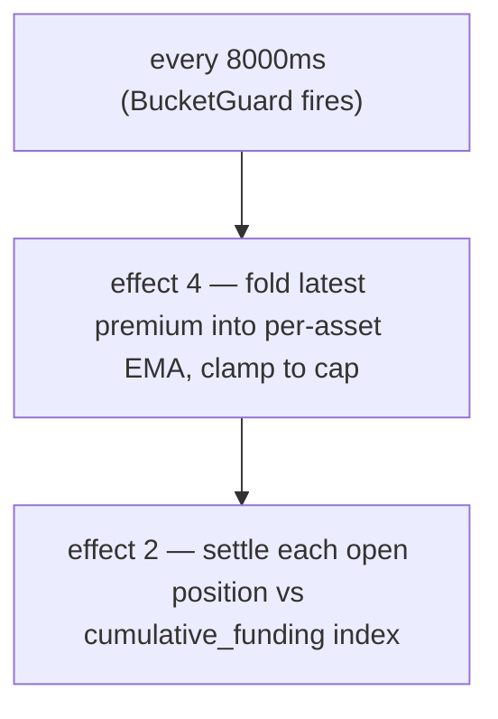

# Ставки финансирования

:::tip
**Стабильно.**
:::

## Кратко

Открытые позиции по бессрочным контрактам непрерывно начисляют финансирование (расчёт производится каждые **8 секунд** на блокчейне), пропорциональное **премии контракта к оракулу** — вычисляемой через взвешенную по глубине книги **ударную цену**, а не по последней сделке — плюс небольшая базовая ставка **процента**. Лонги платят шортам, когда цена бессрочного контракта выше оракула; шорты платят лонгам, когда ниже. Итоговое значение ограничено дефолтным лимитом для каждого рынка — **`±4% / час`**, и расчёт производится по **оракулу**.

## Зачем нужно финансирование

Бессрочные контракты не имеют даты истечения, поэтому нет механизма арбитража, который привязывал бы их к базовому активу. Эту функцию выполняет финансирование: когда цена бессрочного контракта уходит выше спота, лонги платят — это стимулирует открытие шортов и сдерживает открытие лонгов до тех пор, пока цена не вернётся к равновесию. Протокол никогда не встаёт ни на одну из сторон — это расчёт пользователей между собой.

## Формула

> Изложенное выше — концептуальная модель. Числа ниже — **реализованные** значения. В случае расхождений между текстом и кодом приоритет за кодом; расхождения отмечены по месту.

### Как вычисляется ставка

Финансирование определяется **детерминированной EMA** (экспоненциальной скользящей средней) премии (ударная цена − оракул) и рассчитывается каждые **8 секунд**, а не раз в час. Ограничение составляет **4% / час**, а не 0,05%.

Каждый блок выполняются два эффекта, каждый за блокировкой `BucketGuard` на 8000 мс:

- **Эффект 4 `update_funding_rates`** — добавляет последний образец премии в EMA по активу, затем применяет ограничение.
- **Эффект 2 `distribute_funding`** — рассчитывает каждую открытую позицию по кумулятивному индексу финансирования.

#### 0. База премии — ударная цена (не последняя сделка)

**Образец премии** за блок — это разница между **ударной ценой** бессрочного контракта и ценой оракула:

```
premium = (impact_mid − oracle) / oracle
impact_mid = mid( impact_bid, impact_ask )
impact_bid/ask = VWAP при прохождении книги заявок до исполнения фиксированного объёма (по умолчанию ~$10k)
```

Использование *ударной* цены — средневзвешенной по объёму цены исполнения реальной заявки — вместо последней сделки или лучшей котировки означает, что одна распечатка или заявка на один лот по нереалистичной цене **не может** сдвинуть финансирование: для этого нужно затронуть реальную глубину книги. Подход зеркалит референсный дизайн бессрочных контрактов. (Устаревший режим для отдельных рынков вместо этого берёт `premium = (mark − oracle)/oracle`; новые и мигрированные рынки используют ударную базу, описанную выше.)

#### 1. EMA индекса премии (по рынку)

Премия сглаживается с помощью **детерминированной EMA** (*индекс премии*). Аккумулятор хранит дробь с фиксированной точкой `(num, denom)` — без чисел с плавающей точкой, точная арифметика `rust_decimal::Decimal`, так что состояние побитово идентично на всех узлах. Каждый образец добавляется следующим образом:

```
num'   = num   * decay + sample
denom' = denom * decay + 1
value  = num / denom
```

- `sample` = последняя премия по активу × `funding_rate_multiplier` по активу (по умолчанию `1.0`; регулируется движком динамического риска).
- `decay = 0.5` (предлагаемое значение → полупериод ≈ 7 с при периоде выборки 5 с). Ограничивается в пределах `[0, 1]` при обновлении.
- Период выборки: **5 с**; период свёртки EMA + расчёта: **8000 мс** (`funding_update_guard` / `funding_distribute_guard`).

> **Статус:** полный цикл финансирования **работает** от начала до конца. Каждые 8 с драйвер ставки берёт образец премии из зафиксированного состояния (премия ударная цена vs. оракул, описанная выше, один образец на рынок), добавляет его в EMA индекса премии по активу, выводит ставку (проценты + ограничение), применяет лимит, затем расчёт продвигает кумулятивный индекс финансирования и переносит `size × Δindex` между балансами владельцев позиций (с нулевой суммой: лонги платят шортам или наоборот, без эмиссии/сжигания) — всё из зафиксированного состояния рынка, без внешнего поставщика премии. Прошло фаззинг-тестирование на сохранение суммы и детерминизм, а также e2e-тест на 4 узлах, подтверждающий: расхождение → премия → EMA → индекс → перевод баланса.

#### 2. Ставка из индекса премии (проценты + ограничение)

Ставка финансирования — это **не** сырое значение индекса премии. Сглаженный индекс `premium_idx` объединяется с базовым уровнем **процентов** через пошаговое ограничение:

```
interest = 0.0000125 / h        # = 0.01% / 8h — базовый уровень переноса
clamp    = ±0.0005              # пошаговое ограничение

funding = premium_idx + clamp( interest − premium_idx, −clamp, +clamp )
```

Когда индекс премии мал, финансирование дрейфует к базовому уровню `interest`; когда премия велика, доминирует слагаемое `premium_idx`, а ограничение определяет, насколько сильно проценты могут притягивать ставку обратно за каждый шаг. Оба параметра — `interest` и `clamp` — могут быть переопределены для каждого актива через управление. (Устаревший режим для отдельных рынков читает значение EMA напрямую как ставку, без трансформации проценты/ограничение.)

#### 3. Внешний лимит

`funding` в конечном счёте ограничивается почасовым лимитом:

```
cap_per_hour = 0.04          # 4 %/h по умолчанию
funding = clamp(funding, −cap_per_hour, +cap_per_hour)
```

Лимит — параметр управления для каждого рынка: `dynamic_risk_overrides[asset].funding_rate_cap` заменяет значение по умолчанию `0.04`, если задан.

#### 4. Выплата (по позиции, по расчёту)

Финансирование накапливается в кумулятивный индекс по рынку (`clearinghouse.cumulative_funding`); каждая позиция хранит индекс последнего расчёта (`funding_entry`). При расчёте:

```
payment = size_signed * oracle_px * (cum_global - funding_entry) * funding_rate_multiplier[asset]
funding_entry := cum_global      # сдвигаем вперёд
```

(Арифметика проводная и детерминированно зафиксирована; фактический перевод баланса выполняется с полным расчётом BOLE.)

| Символ | Значение / плоскость |
|--------|-----------------|
| `size_signed` | Знаковый размер позиции; `i128`. Лонг > 0, шорт < 0. |
| `oracle_px` | Составная цена оракула — плоскость целых USDC `Decimal` (см. [цены марки](./mark-prices.md)). |
| `cum_global − funding_entry` | Накопленное финансирование по этому рынку с момента последнего расчёта позиции. |
| `decay` | Коэффициент затухания EMA 0.5. |
| `cap_per_hour` | По умолчанию `0.04` (4%/ч); переопределяется для каждого рынка через динамический риск. |
| `funding_rate_multiplier` | Множитель для каждого актива, по умолчанию `1.0`, регулируется динамическим риском. |

`funding_rate` (значение EMA) имеет знак: положительное → лонги платят шортам; отрицательное → шорты платят лонгам.

**Базовый процент:** `0.0000125/h` (= `0.01%/8h`) — базовый уровень переноса, к которому добавляется EMA премии.

> ⚠️ **Исправление по сравнению с предыдущим текстом.** В более ранних материалах говорилось «каждый час», «60-минутное окно EMA» и «лимит 0,05%/час». В реализации расчёт производится каждые **8 с**, `decay` EMA равен **0,5** (полупериод ≈ 7 с), а лимит составляет **4%/час**. Почасовая модель удобна для приблизительных расчётов переноса, но реальный ончейн-ритм и лимит соответствуют значениям выше.

## Периодичность выплат

Финансирование рассчитывается **каждые 8 секунд** (интервал `funding_distribute_guard`), на основе временных меток блоков, полученных из консенсуса, — не по астрономическим часам. Позиции рассчитываются по кумулятивному индексу финансирования, поэтому позиция, открытая в середине интервала, платит только за накопленное с момента её открытия (никаких «снимков на начало часа»).



Выплаты оформляются как корректировки баланса — без ончейн-сделки, без комиссии. В истории пользователя они отображаются с `kind: "funding"`.

## Блокировка при недоверии к оракулу

Финансирование **рассчитывается по оракулу**, поэтому цена, которой протокол не доверяет, не должна приводить к выплатам. Каждый период образец премии *проверяется на допустимость*: он пропускается (считается равным **0**) если:

- **оракул отсутствует или ≤ 0** для данного рынка, или
- **оракул устарел** сверх `funding_oracle_staleness_ms` (по умолчанию **60 с**), или
- **книга слишком тонкая**, чтобы заполнить ударной объём с обеих сторон (ударная цена недоступна).

Пропущенный образец вносится как 0, поэтому EMA индекса премии **затухает к 0**, а ставка финансирования постепенно угасает, а не рассчитывается по устаревшей или манипулируемой базе. (См. также [пограничные случаи](#edge-cases).)

:::info
**Вот почему можно наблюдать большой разрыв марка↔оракул при финансировании ≈ 0.** Если фид оракула по рынку сломан или не вызывает доверия, финансирование блокируется и затухает до 0 — даже когда [марка](./mark-prices.md#mark-vs-oracle--why-they-diverge) (формируемая по книге заявок и внешним бессрочным контрактам) существенно отклонена от последнего достоверного значения оракула. Широкий разрыв при ~0 финансировании — это протокол, *отказывающийся начислять финансирование по плохому оракулу*, а не ошибка в механизме финансирования.
:::

## Практический пример

Рынок: бессрочный контракт BTC, текущее состояние (плоскость оракула в целых USDC):

```
mark         = 100.50
oracle       = 100.00
premium      = mark - oracle = 0.50
EMA(premium) settles toward 0.50 with decay 0.5 over a few 5s samples
funding cap  = 4% / hour (default)
```

Предположим, EMA даёт ставку финансирования `+0.0005` (0,05%) за интервал (значительно ниже лимита 4%/ч). Позиции счёта:

```
long 1 BTC      → pays funding
short 0.5 BTC   → receives funding
```

```
funding_rate = clamp(ema_value, -0.04, +0.04) = +0.0005   (not capped — far below 4%/h)

long 1 BTC:
  payment = +1   * oracle_px * Δcum  ≈ +1   * 100.00 * 0.0005 = +0.0500 USDC  (long pays)

short 0.5 BTC:
  payment = -0.5 * oracle_px * Δcum  ≈ -0.5 * 100.00 * 0.0005 = -0.0250 USDC  (short receives 0.0250)
```

(Выплата использует `size_signed * oracle_px * (cum_global - funding_entry)`; здесь `Δcum` — накопленное финансирование с момента последнего расчёта позиции.) Рассчитываемый каждые 8 с, размер каждой выплаты ничтожен; лимит важен только при устойчивом одностороннем дисбалансе, где 4%/ч является потолком.

## Лимиты финансирования и динамические ограничения

| Параметр | По умолчанию | Источник / переопределение |
|-----------|---------|-------------------|
| лимит финансирования (в час) | `0.04` (`4 %/h`) | `dynamic_risk_overrides[asset].funding_rate_cap` (голосование управления) |
| `decay` EMA | `0.5` (≈ 7 с полупериод) | Предложено; калибровка может скорректировать до 0.3/0.7 |
| период выборки | `5 s` | зафиксировано протоколом |
| интервал расчёта / обновления | `8000 ms` | BucketGuards `funding_distribute_guard` / `funding_update_guard` |
| базовый процент | `0.0000125/h` (`0.01 %/8h`) | зафиксировано протоколом |
| `funding_rate_multiplier` | `1.0` | по активу, регулируется динамическим риском |

`funding_rate_multiplier` по активу — это дифференциация MTF по сравнению со статически управляемым значением HL: он автоматически регулируется на основе реализованной волатильности за 30 дней движком динамического риска, масштабируя образец премии до его внесения в EMA.

## История финансирования

История по счёту через [`POST /info userFills`](../api/rest/info.md) или [HL-compat `userFills`](../api/rest/hl-compat.md) — выплаты финансирования отображаются с `kind: "funding"` и соответствующим активом.

История по рынку:

```bash
curl -X POST https://devnet-gateway.mtf.exchange/info \
  -H 'content-type: application/json' \
  -d '{"type":"funding_history","market_id":0}'
```

Возвращает упорядоченное кольцо образцов `(ts_ms, premium)` (см.
[`funding_history`](../api/rest/info.md#funding_history)):

```json
{
  "type": "funding_history",
  "data": {
    "market_id": 0,
    "samples": [
      { "ts_ms": 1700000000000, "premium": "0.0015" },
      { "ts_ms": 1700000008000, "premium": "-0.0007" }
    ]
  }
}
```

Выделенный канал WS `fundingTicks` включён в [план развития WS](../api/ws/subscriptions.md#roadmap--not-yet-available); пока используйте опрос [`funding_history`](../api/rest/info.md#funding_history).

## Чем финансирование не является

- **Не связано с комиссиями.** Финансирование — это расчёт между пользователями; комиссии — это скидки мейкеру/тейкеру, поступающие на биржу. См. [комиссии](./fees.md).
- **Проценты на залог не начисляются.** Баланс USDC не приносит процентов через финансирование. Финансирование служит исключительно для закрытия разрыва марка-оракул.
- **Непредсказуемо на длительных горизонтах.** Знак финансирования может меняться час за часом. Не моделируйте его как постоянный перенос.

## Пограничные случаи

<details>
<summary>Показать пограничные случаи</summary>

- **Позиция открывается в середине интервала.** **Почасового снимка нет** — финансирование накапливается в кумулятивный индекс, и позиция платит только за движение индекса с момента последнего расчёта. Открыв позицию сразу после расчёта, вы платите почти ничего за этот период; никакого «попал в снимок / не попал» обрыва не существует.
- **Позиция закрывается в середине интервала.** То же — позиция рассчитывает накопленное на момент закрытия; никакого округления за частичный период в ту или иную сторону.
- **Отрицательный режим.** На рынке, где бессрочный контракт устойчиво торгуется ниже оракула (шорты платят лонгам), `funding_rate` отрицателен продолжительное время; лонги получают финансирование.
- **Устаревший оракул / тонкая книга.** Образец премии блокируется на 0, и ставка затухает к 0 — см. [Блокировка](#gating-when-the-oracle-is-untrusted). Финансирование не рассчитывается по ненадёжному оракулу.

</details>

## Смотрите также

- [Цены марки](./mark-prices.md) — как формируется `oracle`
- [Многоуровневая ликвидация](./tiered-liquidation.md) — выплаты финансирования корректируют `account_value`, что влияет на `health`
- [Канал WS `fundingTicks` (план развития)](../api/ws/subscriptions.md#roadmap--not-yet-available)
- [Комиссии](./fees.md) — отдельно от финансирования

## Часто задаваемые вопросы

<details>
<summary>Показать FAQ</summary>

**В: Аналогично ли финансирование тому, что на CEX?**
О: Концептуальная модель та же. На большинстве CEX расчёт производится раз в 8 часов; MetaFlux рассчитывает каждые 8 секунд (интервал `funding_distribute_guard`), поэтому воздействие каждой отдельной выплаты ничтожно, а перенос более равномерный. Лимит 4%/ч ограничивает устойчивую одностороннюю ставку.

**В: Может ли финансирование принудительно ликвидировать меня?**
О: Да — выплата финансирования снижает `account_value`. Расчёты производятся каждые 8 с небольшими порциями (никаких крупных почасовых списаний), однако устойчивая односторонняя ставка вблизи лимита постепенно уменьшает `account_value` со временем и может перевести вас из зоны T0 в T1. Следите за `health`, если ваша позиция крупная и ставка устойчиво против вас.

**В: Распространяется ли финансирование на спотовые позиции?**
О: Нет. Финансирование — механизм исключительно для бессрочных контрактов. Спотовые позиции не приносят переноса.

**В: Облагаются ли выплаты финансирования налогом?**
О: Это не вопрос к протоколу. Обратитесь к налоговым консультантам в вашей юрисдикции.

</details>
