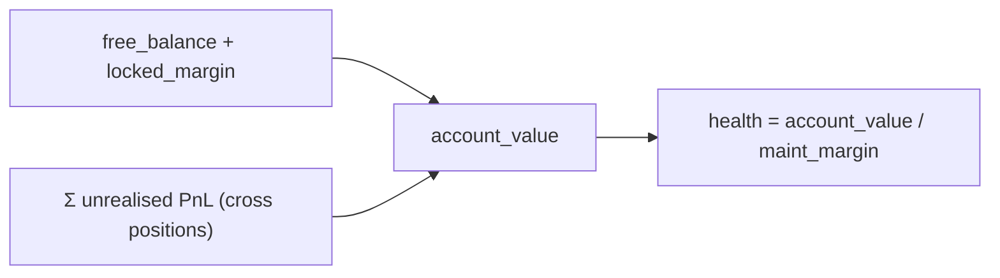
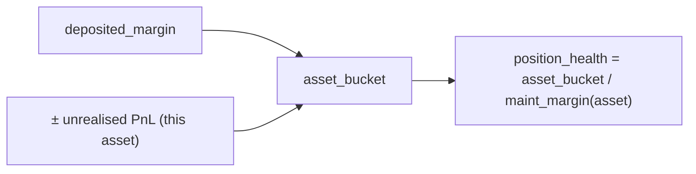
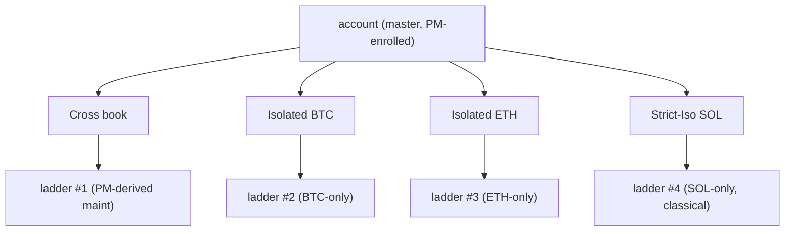
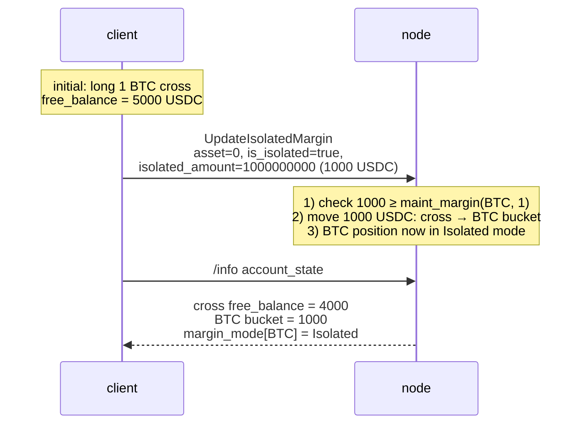

# Режимы маржи

:::tip
**Стабильно.**
:::

## Кратко

Три режима для каждого актива: **Cross**, **Isolated**, **Strict-Iso**. Cross объединяет залог по всем вашим позициям; Isolated изолирует маржу на уровне отдельного актива; Strict-Iso дополнительно исключает этот актив из любого зачёта в рамках [портфельной маржи](./portfolio-margin.md).

## Сравнение

| Режим | Источник залога | Потери могут затронуть | Доступ к PM | Изоляция ликвидации |
|-------|-----------------|------------------------|-------------|---------------------|
| **Cross** | Свободный баланс, в масштабе всего аккаунта | Другие позиции | Да | Лестница по всему аккаунту |
| **Isolated** | Предварительно выделенный бакет на актив | Только этот бакет | Нет | Лестница по активу; максимальный убыток = бакет |
| **Strict-Iso** | Предварительно выделенный бакет на актив | Только этот бакет | Нет (исключается, даже если мастер-аккаунт зарегистрирован в PM) | Лестница по активу |

В режиме Cross прибыльные позиции могут компенсировать менее здоровые — ваш свободный баланс взаимозаменяем в рамках аккаунта. В режиме Isolated уничтожение одного актива ограничено бакетом этого актива.

## Как рассчитывается маржа

> Все суммы находятся в **плоскости `Decimal` целых USDC** (номинал, залог, маржа), а не в плоскости книги заявок 1e8 — см. [цены маркировки: две ценовые плоскости](./mark-prices.md#two-price-planes-read-this-before-reading-any-number).

### Начальная маржа (предторговый барьер)

Заявка, открывающая новую позицию, должна предоставить начальную маржу:

```
notional        = |px × size|                         # raw integer product, Decimal scale-0
effective_lev   = dynamic_risk_override.max_leverage   # if set, else position cap, else MAX_LEVERAGE_CAP (50)
required_init    = ceil( notional / effective_lev )    # rounded UP — conservative
free_collateral  = cross_account_value − Σ held_initial_margin
reject  iff  required_init > free_collateral            # InsufficientMargin
```

Таким образом, `init_margin = notional / max_leverage` — классическое соотношение `1 / max_leverage`. `effective_lev` равно `max(1, …)`; глобальный предел — `MAX_LEVERAGE_CAP = 50`, с жёстким потолком `UpdateLeverage` в **100×** и динамическими риск-переопределениями на уровне актива, которые могут его сузить. Округление выполняется **вверх** (`Decimal::ceil`), так что остаток всегда ужесточает барьер. Заявки с флагом `reduce_only` обходят барьер (они только уменьшают экспозицию).

`held_initial_margin` суммирует `ceil(|entry_notional| / effective_lev(asset))` по всем **cross** открытым позициям (изолированные позиции исключены — их залогом служит отдельно внесённый бакет).

### Поддерживающая маржа и здоровье

```
health = account_value / maint_margin
```

- `account_value` = `cross_account_value` (свободный баланс ± нереализованный PnL), тип `i128` со знаком.
- `maint_margin` = сумма по каждой ноге удерживаемой позиции: `|entry_notional| × maint_margin_ratio` (вычисляется в реальном времени из позиций) **или** число PM при подключении [портфельной маржи](./portfolio-margin.md) (`last_computed_pm_cents / 100`).

Коэффициент поддерживающей маржи по активу берётся из динамического риск-переопределения для рынка (если оно установлено управлением), иначе используется базовое значение протокола — **300 bps = 3 %**. Производный нижний порог проскальзывания при принудительном закрытии равен половине эффективного коэффициента (1,5 % для базового рынка), если только явно не переопределён.

Поддерживающая маржа находится ниже требования к начальной марже (`notional / max_leverage`), поэтому позиция может быть открыта и затем опускаться до порога поддерживающей маржи перед ликвидацией. Здоровье < 1,0 запускает [лестницу ликвидации](./tiered-liquidation.md) по уровням (1,1 / 1,0 / 0,8 / 0,667).

> Все вычисления используют `Decimal` / `i128` (без числел с плавающей запятой); решение об уровне при необходимости сдвигает оба операнда вправо на общую величину перед делением `Decimal`, когда стоимость аккаунта превышает `Decimal::MAX`, — это сохраняет коэффициент здоровья и не влияет на выбор уровня.

## Cross — режим по умолчанию



`maint_margin` — это сумма требований к поддерживающей марже по каждой позиции (или число PM, если подключена [портфельная маржа](./portfolio-margin.md)).

Следствие: неблагоприятное движение BTC на 10 % снижает здоровье аккаунта в целом, даже если ваша позиция по ETH в порядке. Позицию по BTC можно поддержать, закрыв прибыльную позицию по ETH.

## Isolated

:::warning
**Пробел в реализации.** Концептуальная модель ниже описывает **целевое поведение**.
Предторговый барьер по марже в настоящее время реализует только
путь **Cross / единого пула залога** — торговый путь открывает каждую позицию в режиме Cross. Поле `margin_mode` позиции (0 = cross, 1 = isolated) уже считывается для *исключения* изолированных позиций из суммы удерживаемой маржи Cross, однако отдельный предторговый барьер для изолированной маржи (сверяющий внесённую `isolated_margin` заявки с её номиналом) пока не подключён.
:::

Когда вы включаете `is_isolated: true` для актива, протокол перемещает `isolated_amount` USDC из кросс-баланса в бакет, привязанный к позиции. Прибыль и убытки этой позиции расчитываются только в рамках бакета:



Если `position_health` опускается до уровня ликвидации, срабатывает лестница **по отдельной позиции**. Остальная часть аккаунта не затрагивается.

Пополнять или выводить средства из бакета можно в то время, когда позиция открыта:

```json
// add 500 USDC to the isolated bucket on asset 0
{ "type":"UpdateIsolatedMargin", "params": {
  "asset": 0, "is_isolated": true, "isolated_amount": "500000000"
}}
```

`isolated_amount` может быть **положительным** (перевод из Cross в бакет) или **отрицательным** (вывод из бакета в Cross). Вывод, который опустит позицию до худшего уровня, будет отклонён.

## Strict-Iso

Те же ограничения, что в Isolated, плюс явный отказ от включения в сценарии PM. Даже если ваш мастер-аккаунт подключён к портфельной марже, позиция Strict-Iso:

- НЕ участвует в движке кросс-сценариев
- НЕ получает зачёт хеджирования
- Маржируется по **классической** модели (базовый уровень по активу)

Используйте Strict-Iso для:
- Новых / неликвидных активов, к которым не применимы корреляционные допущения PM
- Спекулятивного бюджета, который нужно изолировать от вашей хеджированной основной книги
- Листингов (MIP-3), где коэффициент поддерживающей маржи остаётся консервативным до накопления ликвидности

## Когда использовать каждый режим

| Цель | Режим |
|------|-------|
| Максимальная капитальная эффективность для связной книги | Cross (+ PM) |
| Несколько несвязанных стратегий в одном аккаунте | Isolated для каждой стратегии или суб-аккаунты |
| Изоляция одной рискованной позиции от остальных | Isolated или Strict-Iso |
| Хеджирование между активами с получением зачёта | Cross + PM |
| Торговля листингом с неизвестным волатильным режимом | Strict-Iso |

Для изоляции нескольких стратегий [суб-аккаунты](./sub-accounts.md) обычно подходят лучше, чем Isolated — суб-аккаунты изолируют весь аккаунт целиком, включая ключи агентов и пространство заявок, а не только маржу.

## Переходы между режимами

Переключение режимов выполняется через действие [`update_isolated_margin`](../api/rest/exchange.md#update_isolated_margin) (флаг `is_isolated` — отдельного действия для смены режима маржи не существует) и разрешено только при следующих условиях:

| Откуда → Куда | Разрешено, когда |
|---------------|-----------------|
| Cross → Isolated | Вы указываете `isolated_amount`, покрывающий не менее поддерживающей маржи |
| Isolated → Cross | Бакет сливается с кросс-балансом; разрешено в любое время, если объединённый аккаунт остаётся на уровне `Safe` |
| Isolated → Strict-Iso | Всегда (без движения маржи) |
| Strict-Iso → Isolated | Всегда |
| Strict-Iso/Isolated → Cross (при зарегистрированном PM мастере) | Требуется, чтобы позиция вписывалась в набор PM-сценариев |

Смена режима при открытой позиции — это **не** закрытие и повторное открытие: позиция остаётся, меняется только учёт маржи.

## Поведение при ликвидации

Лестница [многоуровневой ликвидации](./tiered-liquidation.md) применяется независимо для каждого контекста:

- **Cross**: одна лестница для всего аккаунта
- **Isolated**: одна лестница для каждого изолированного актива
- **Strict-Iso**: одна лестница для каждого актива в Strict-Iso

Уровень T1 в режиме Cross закрывает позиции в кросс-книге пропорционально их вкладу в поддерживающую маржу. Уровень T1 в Isolated закрывает только изолированную позицию. Страховочный уровень T3 и ADL уровня T4 применяются в рамках своего контекста — убыток по изолированной позиции не изымает средства из кросс-прибыли.



## Последовательность — переход Cross → Isolated



## Граничные случаи

<details>
<summary>Показать граничные случаи</summary>

- **Автодовнесение маржи.** Изолированные позиции покрывают нехватку поддерживающей маржи только из бакета — как только бакет исчерпан, позиция ликвидируется. Cross НЕ пополняет Isolated-бакет автоматически; для пополнения необходимо вручную вызвать `UpdateIsolatedMargin` с положительным `isolated_amount`.
- **Закрытие Isolated-позиции.** При полном закрытии позиции бакет возвращается в кросс-баланс.
- **Режим для нового актива.** Новые позиции по умолчанию открываются в режиме Cross, если флаг `meta` актива `onlyIsolated: true` не принудительно устанавливает режим Isolated (задаётся для каждого рынка при деплое через [MIP-3](../mip/mip-3.md)).
- **Isolated при PM-мастере.** Зачёт хеджирования PM применяется только к Cross-позициям. Isolated-позиции суммируются по классической схеме. Мастер-аккаунт с PM, у которого одна крупная Isolated-позиция и небольшая Cross-книга, почти не получает преимуществ PM.

</details>

## См. также

- [Портфельная маржа](./portfolio-margin.md) — математика PM в сравнении с классической моделью
- [Многоуровневая ликвидация](./tiered-liquidation.md) — лестницы по контекстам
- [Суб-аккаунты](./sub-accounts.md) — изоляция на уровне всего аккаунта
- [`update_isolated_margin`](../api/rest/exchange.md#update_isolated_margin) — режим маржи задаётся флагом `is_isolated`; отдельного действия для смены режима не существует

## Часто задаваемые вопросы

<details>
<summary>Показать FAQ</summary>

**В: Может ли один актив иметь одновременно Isolated- и Strict-Iso-бакеты?**
О: Нет. Режим задаётся для каждого актива отдельно и принимает единственное значение: `Cross | Isolated | StrictIso`.

**В: Смена режима требует совершения сделки?**
О: Нет комиссий, нет исполнения. Это чистый переход состояния.

**В: Что происходит, если Isolated-бакет опускается ниже поддерживающей маржи?**
О: Срабатывает лестница ликвидации для этого актива. Остальная часть вашего аккаунта не затрагивается.

**В: Авто-делеверидж (ADL) применяется ко всему аккаунту или по отдельным контекстам?**
О: По отдельным контекстам. ADL по Isolated-позиции изымает средства только у контрагентов *этого* актива, но не из вашей Cross-книги или других Isolated-позиций.

</details>
