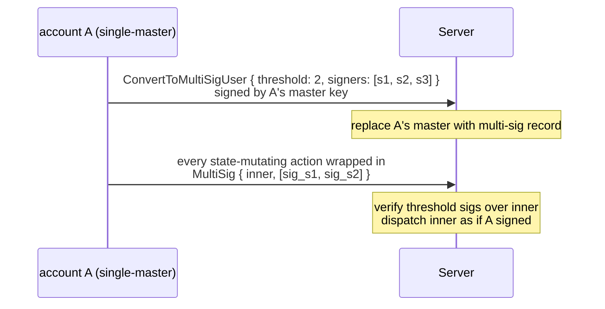
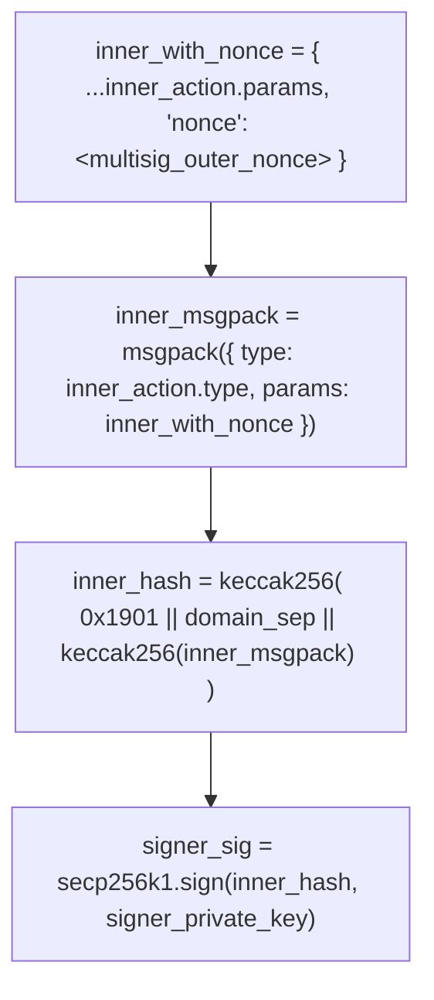

# Мультиподписные аккаунты

:::info
**Предварительная версия.**
:::

## Кратко

Преобразуйте обычный аккаунт в мультиподпись M-of-N: мастер-ключ заменяется набором подписантов, каждое действие, изменяющее состояние, должно собрать `threshold` подписей от `signers`, а само преобразование **необратимо**. Предназначено для институционального хранения, казначейств DAO и торговых столов с совместным управлением.

## Зачем нужна мультиподпись

У обычных аккаунтов один мастер-ключ. Его потеря означает полную потерю доступа. Мультиподпись распределяет риск хранения между несколькими подписантами:

- 2-of-3: любые двое из трёх подписантов могут действовать; потеря одного не блокирует аккаунт.
- 3-of-5: требуются 3 подписи; допускается потеря до 2 ключей; до 2 скомпрометированных ключей не смогут вывести средства.

Это тот же примитив, что лежит в основе каждого Gnosis Safe и институциональной схемы самостоятельного хранения, реализованный на уровне протокола, а не через смарт-контракт.

## Жизненный цикл



## Преобразование

```json
{
  "type": "ConvertToMultiSigUser",
  "params": {
    "threshold": 2,
    "signers": [ "0x...s1", "0x...s2", "0x...s3" ]
  }
}
```

Подписывается **текущим** мастер-ключом (единственная самостоятельная подпись аккаунта — последняя).

| Ограничение | Значение |
|------------|-------|
| `threshold` | `[1, len(signers)]` |
| `len(signers)` | `[2, 16]` |
| `signers[*]` | уникальные адреса |

После фиксации:
- У аккаунта устанавливаются `is_multisig: true` и `multisig_set: { threshold, signers }`.
- Последующие прямые (без обёртки) действия, подписанные кем угодно (включая старый мастер-ключ), отклоняются с ошибкой `{"error":"account is multisig"}`.

**Необратимо**: действия `RevertFromMultiSig` не существует. Набор подписантов можно **обновить** через `UpdateMultiSig`, обёрнутый в мультиподпись (см. ниже), однако вернуться к единственному мастер-ключу невозможно.

## Действия от имени мультиподписного аккаунта

Оборачивайте каждое действие в `MultiSig`:

```json
{
  "sender":    "0x<multisig_addr>",
  "signature": "0x<any_signer_sig>",   ← outer envelope signed by any one signer
  "action": {
    "type": "MultiSig",
    "params": {
      "inner_action": {
        "type": "Order",
        "params": { ... }
      },
      "signatures": [
        { "signer": "0x...s1", "signature": "0x<sig over inner>" },
        { "signer": "0x...s2", "signature": "0x<sig over inner>" }
      ],
      "nonce": 1735689600099
    }
  }
}
```

Проверки на стороне сервера:

1. Подпись во внешней обёртке восстанавливается до одного из `signers` (любая единственная подпись из набора).
2. Каждая `signatures[*].signature` восстанавливается до `signatures[*].signer`.
3. Восстановленные подписанты входят в `signers`, не повторяются и их количество ≥ `threshold`.
4. Каждая внутренняя подпись охватывает **канонический msgpack `inner_action` с `nonce` обёртки**, упакованный в EIP-712-конверт, идентичный обычному действию.

При провале любой проверки возвращается: `{"error":"multisig threshold not met"}`, `{"error":"multisig duplicate signer"}` или `{"error":"signer not in set"}`.

При успехе всех проверок внутреннее действие выполняется так, как если бы `sender` подписал его напрямую.

### Подпись внутреннего действия

Каждый подписант вычисляет:



Пакет обёртки затем формируется вне сети (координатор собирает подписи) и отправляется любым подписантом.

## Обновление набора подписантов

```json
{
  "type": "UpdateMultiSig",
  "params": {
    "threshold": 3,
    "signers":   [ "0x...s1", "0x...s2", "0x...s4", "0x...s5", "0x...s6" ]
  }
}
```

Оборачивается в `MultiSig` и требует `threshold` подписей от **текущего** набора. Вступает в силу со следующего блока; с этого момента действует новый набор.

Применяется для:
- Ротации скомпрометированных ключей
- Добавления или удаления подписантов
- Изменения `threshold` (например, переход с 2-of-3 на 3-of-5 по мере роста стола)

## Координация вне сети

Протокол не включает в себя процесс координации мультиподписи — подписантам необходим внеполосный канал для обмена сообщением на подпись и сбора подписей. Распространённые схемы:

| Схема | Механизм |
|---------|-----------|
| Внутренний сервис-координатор | Кошелёк каждого подписанта опрашивает общий инбокс; сериализует внутреннее действие; подписывает; загружает подпись обратно; координатор отправляет транзакцию по достижении порога |
| Общий приватный канал | Зашифрованный групповой чат или электронная почта; каждый подписант вставляет свою подпись; один подписант агрегирует и отправляет |
| Мультиподписной SDK (в разработке) | Официальный SDK будет включать процесс сбора подписей, скрывающий слой координации |

До выхода SDK интеграторы реализуют собственный координатор. Протокольная часть остаётся неизменной — важны только подписи.

## Совместимость с субаккаунтами и агентами

| Вопрос | Ответ |
|----------|--------|
| Может ли мультиподписной аккаунт иметь субаккаунты? | Да. `CreateSubAccount` — само по себе действие, обёрнутое в мультиподпись. Каждый субаккаунт наследует требование мультиподписи. |
| Может ли мультиподписной аккаунт подтверждать агентские кошельки? | Да. `ApproveAgent` оборачивается в мультиподпись. После подтверждения агент может подписывать самостоятельно **без** дополнительного сбора мультиподписей — подпись агента достаточна для разрешённых ему действий. Это стандартная институциональная схема: мультиподпись управляет правом вывода и агентами; агент ведёт ежедневный торговый процесс. |
| Может ли сам мультиподписной аккаунт выступать агентом другого аккаунта? | Да — мультиподписные аккаунты можно одобрять как агентов. Другие аккаунты, одобряющие их, вызывают `ApproveAgent { agent: <multisig_addr> }`. После этого набор подписантов мультиподписи подписывает по мере необходимости. |

## Граничные случаи

<details>
<summary>Показать граничные случаи</summary>

- **Потеря ключей**: M-of-N допускает потерю до `N - M` ключей. Планируйте хранение ключей так, чтобы распределить риск потери (разные юрисдикции, разные HSM, разные люди).
- **Скомпрометированный ключ**: M-of-N допускает компрометацию до `M - 1` ключей без возможности вывода средств. Выявляйте угрозу заблаговременно — настройте мониторинг скорости на `userEvents` для мультиподписного аккаунта.
- **Коллизии nonce**: nonce мультиподписи — это общий счётчик аккаунта, монотонно возрастающий, как и в случае обычной подписи. Если два параллельных процесса подписания используют один и тот же nonce, фиксируется только один; второй возвращает `{"error":"nonce_too_small"}`. Координатор должен самостоятельно распределять nonce.
- **Срок действия подписей**: подписи сами по себе не имеют срока действия — подпись, собранная сегодня, действительна вплоть до отправки пакета. Часть интеграторов вводит собственный внеполосный TTL.

</details>

## Запрос данных

```bash
curl -X POST https://devnet-gateway.mtf.exchange/info \
  -d '{"type":"user_to_multi_sig_signers","user":"0x<multisig>"}'
```

```json
{
  "type": "user_to_multi_sig_signers",
  "data": {
    "address":      "0x<multisig>",
    "is_multi_sig": true,
    "threshold":    2,
    "signers":      ["0x...", "0x...", "0x..."]
  }
}
```

`is_multi_sig` равно `false` (а `signers` пуст) для обычного аккаунта. Набор подписантов и порог берутся напрямую из зафиксированной конфигурации `multi_sig_tracker`.

## Последовательность — мультиподписной ордер

```mermaid
sequenceDiagram
    participant S1 as signer s1
    participant S2 as signer s2
    participant C as coordinator
    participant Chain as chain
    Note over S1: T-1 prepares inner_action = Order{...}<br/>computes inner_hash; signs → sig_s1
    S1->>C: sends inner_action + sig_s1 to coordinator
    Note over S2: T-2 receives inner_action via coordinator<br/>verifies inner_hash; signs → sig_s2
    S2->>C: sends sig_s2 to coordinator
    Note over C: T-3 coordinator (any signer or service):<br/>assembles MultiSig{ inner_action, signatures: [sig_s1, sig_s2], nonce }<br/>wraps in outer envelope; signs outer with own key
    C->>Chain: POST /exchange
    Note over Chain: T-4 chain admits:<br/>verify outer sig<br/>verify both inner sigs ≥ threshold(2)<br/>dispatch Order → admit to mempool
    Chain-->>C: return 202
    Note over Chain: T+commit inner Order applied; orderEvents fires;<br/>multi-sig account now has the new resting order
```

## См. также

- [`POST /exchange convert_to_multi_sig_user`](../api/rest/exchange.md#convert_to_multi_sig_user)
- [Семантика подписи `/exchange`](../api/rest/exchange.md#signed-by-semantics) — конверт обёртки мультиподписи
- [Агентские кошельки](./agent-wallets.md) — совместное использование мультиподписи и делегирования агентам
- [Субаккаунты](./sub-accounts.md) — мультиподписные аккаунты могут иметь субаккаунты

## FAQ

<details>
<summary>Показать FAQ</summary>

**Q: Можно ли использовать 1-of-N (любая подпись)?**
A: Да — `threshold: 1`. Полезно для резервирования без необходимости координации. Функционально эквивалентно наличию N отдельных аккаунтов с общим правом вывода, но дешевле на уровне протокола.

**Q: Можно ли использовать подписи внутреннего действия повторно для других внутренних действий?**
A: Нет. Каждая подпись привязана к конкретному внутреннему действию и nonce. Попытка повторного использования подписи для другого внутреннего действия возвращает `{"error":"multisig threshold not met"}`.

**Q: Можно ли вкладывать мультиподписные обёртки рекурсивно?**
A: Нет. `MultiSig { inner_action: MultiSig { ... } }` отклоняется. Допускается только один уровень вложенности.

**Q: Может ли мультиподпись обернуть `MultiSig`? (Метавопрос.)**
A: То же, что выше — рекурсия заблокирована. Чтобы действовать от имени одной мультиподписи через другую, внешний аккаунт одобряет внутреннюю мультиподпись как агента.

</details>
