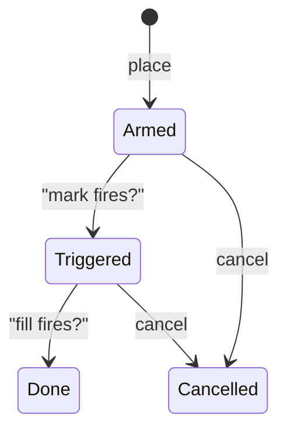
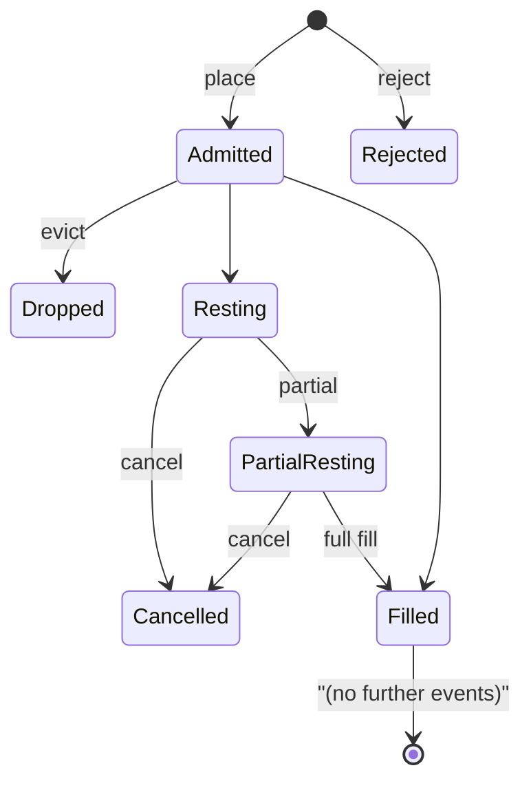

# Типы ордеров

:::tip
**Стабильно.**
:::

## Кратко

MetaFlux поддерживает полный набор ордерных примитивов — лимитный, IOC, ALO, FOK, рыночный, стоп-лосс, тейк-профит, триггерные лимиты, TWAP, лестничный и reduce-only — а также режимы предотвращения самоисполнения (STP), которые управляют матчингом ваших собственных ордеров между собой. Каждый вариант имеет структуру `POST /exchange { type: "Order", ... }`; специализированные сценарии, такие как TWAP и Scale, используют собственные варианты действий.

## Время жизни ордера (TIF)

| TIF | Поведение | Когда применять |
|-----|-----------|-----------------|
| `Gtc` | Good-till-cancelled. Остаётся в стакане до исполнения или отмены. | По умолчанию; пассивное мейкерство, постоянное котирование |
| `Ioc` | Immediate-or-cancel. Матчится с доступными встречными ордерами, неисполненный остаток отменяется. | Забрать ликвидность немедленно; никогда не оставаться в стакане |
| `Alo` | Add-limit-only («только добавление»). Если какая-либо часть пересечёт стакан, весь ордер отменяется. | Строгий мейкер; гарантированно никогда не платит тейкерскую комиссию |
| `Fok` | Fill-or-kill. Либо весь объём исполняется немедленно, либо ордер полностью отменяется. | Атомарное исполнение на одном ценовом уровне |

```
Buy 1 BTC @ 100.5 Gtc      →  rests on book, fills as ask reaches 100.5 or lower
Buy 1 BTC @ 100.5 Ioc      →  immediately matches asks ≤ 100.5; cancels rest
Buy 1 BTC @ 100.5 Alo      →  IF any ask ≤ 100.5  THEN reject  ELSE rest
Buy 1 BTC @ 100.5 Fok      →  IF total ≥ 1.0 @ ≤ 100.5  THEN fill  ELSE reject
```

## Reduce-only

`reduce_only: true` отклоняет ордер при приёме, если его исполнение **увеличит** абсолютный размер позиции. Удобно для защитных выходов — стоп-лосс с reduce-only не позволит случайно развернуть позицию из лонга в шорт.

```
position: long 1 BTC
sell 0.5 reduce_only=true   →  ok (closes 0.5 of long)
sell 2.0 reduce_only=true   →  rejected: would flip to short 1
buy  0.5 reduce_only=true   →  rejected: would grow long to 1.5
```

Проверка reduce-only выполняется **на этапе коммита**, а не при приёме — позиция считывается из последнего закоммиченного состояния. Конкурентное исполнение, закрывшее позицию в промежутке между приёмом и диспетчеризацией, может вызвать ошибку `reduce_only_violation_post_admit` на этапе коммита (см. [ошибки](../api/errors.md#commit-time-errors-not-http-in-event-stream)).

## Предотвращение самоисполнения

Если новый ордер должен сматчиться с существующим ордером того же `sender`, срабатывает механизм STP.

| Режим STP | Когда новый пересекается со старым | Когда оба с одинаковой ценой остаются |
|----------|---------------------|-----------------------------|
| `None` | Сделка разрешена | Оба остаются в стакане |
| `CancelNewest` | Новый отменяется | Новый отменяется |
| `CancelOldest` | Старый отменяется, новый может сматчиться в другом месте | Старый отменяется, новый остаётся |
| `CancelBoth` | Оба отменяются | Оба отменяются |
| `DecrementAndCancel` | Матч на `min(new, old)`; меньший отменяется; у большего остаётся остаток | То же — матч, затем отмена меньшего |

Пример работы — `DecrementAndCancel`:

```
your resting bid:  buy 1 BTC @ 100.5  (oid 1)
you place sell:    sell 0.4 BTC @ 100.5  (oid 2)  with stp=DecrementAndCancel

result:
  - oid 1 is decremented to 0.6 BTC remaining
  - oid 2 is cancelled (smaller order)
  - no trade fires (no fee, no fill event)
  - your position is unchanged
```

STP применяется на этапе матчинга, поэтому работает независимо от стороны актива, цены и времени. STP учитывает только ордера, подписанные тем же `sender` — ордера от агентов под одним мастер-аккаунтом учитываются.

## Триггеры

**Триггерный ордер** — это рестующее условие, при выполнении которого во внутрь книги отправляется дочерний ордер.

| Тип триггера | Срабатывает когда | Дочерний ордер |
|--------------|-----------|-------------|
| `StopLoss` | Марк пересекает `trigger_px` в направлении «безопасно» → «убыток» | Рыночный или лимитный; как правило, reduce-only |
| `TakeProfit` | Марк пересекает `trigger_px` в направлении «убыток» → «прибыль» | Рыночный или лимитный; как правило, reduce-only |
| `StopLimit` | Аналогично `StopLoss` | Только лимитный дочерний |
| `TakeProfitLimit` | Аналогично `TakeProfit` | Только лимитный дочерний |

Для длинной позиции:
- `StopLoss` срабатывает при `mark ≤ trigger_px` (падение цены срезает лонг)
- `TakeProfit` срабатывает при `mark ≥ trigger_px` (рост цены фиксирует прибыль)

Для короткой позиции неравенства инвертируются.

`limit_px`:
- `null` → отправляется рыночный (`Ioc`) ордер по триггеру
- задан → отправляется лимитный ордер по `limit_px`

Конечный автомат триггера:



Триггеры оцениваются при каждом обновлении марк-цены (каждый коммит). Они сохраняются между блоками и между перезапусками.

## Группировка

`Order { grouping: ... }` объединяет «ноги» в семейство ордеров.

| Группировка | Смысл |
|----------|---------|
| `Na` | Независимые ордера |
| `NormalTpsl` | Два ордера: вход + один из {StopLoss, TakeProfit}. Исполнение одного отменяет другой (OCO). |
| `PositionTpsl` | Два триггерных ордера, привязанных к **позиции**, а не к входному ордеру. Они сохраняются при изменениях позиции (например, усреднении) и отменяются только при закрытии позиции. |

Используйте `PositionTpsl`, когда нужно «всегда держать стоп на чистой позиции» — одни и те же TPSL-скобки остаются активными при добавлении к позиции или её сокращении.

## Лестничные ордера

`ScaleOrder` выставляет лестницу лимитных ордеров.

```json
{
  "type": "ScaleOrder",
  "params": {
    "asset": 0, "side": "Buy",
    "total_size": "1000000000",
    "start_price": "9900000000",
    "end_price":   "9800000000",
    "n_levels": 10,
    "shape": "Flat"
  }
}
```

Формы распределения:

| Форма | Распределение размера по ногам |
|-------|------------------------------|
| `Flat` | Равномерно по каждой ноге |
| `Linear` | Линейное нарастание от одного конца к другому |
| `Geometric` | Геометрическое нарастание (меньше вблизи спреда, больше вдали) |

Каждой ноге автоматически присваивается `cloid`, производный от `cloid_prefix + leg_index`. Отменить всю лестницу можно, отменив каждую ногу, или воспользоваться [`cancel_by_cloid`](../api/rest/exchange.md#cancel_by_cloid) с раскрытием префикса.

## TWAP

`TwapOrder` планирует срезы на протяжении `duration_ms`.

```
duration = 1 hour = 3,600,000 ms
slices   = duration / SLICE_INTERVAL  (default 60s slice; 60 slices per hour)
sz_per_slice = size / slices

slice  1: send IOC near mid at t = randomize(0, SLICE_INTERVAL * (1 + jitter%))
slice  2: send IOC at t = slice_1_t + SLICE_INTERVAL * (1 + jitter%)
...
slice 60: send last IOC just before t = duration
```

`randomize_pct` ∈ `[0, 50]` добавляет случайное смещение ко времени срезов в диапазоне ±`randomize_pct/100 × slice_interval`. Большее значение затрудняет обнаружение; меньшее обеспечивает жёсткий контроль по времени.

Срезы отправляются протоколом; клиенту ничего не нужно делать после подачи `TwapOrder`. События срезов поступают через [WS-канал `userEvents`](../api/ws/subscriptions.md#userevents) (отдельный поток `twap*` запланирован в roadmap).

TWAP можно отменить в процессе выполнения с помощью `TwapCancel`; уже исполненные срезы остаются исполненными, будущие срезы прекращаются.

## Рыночные ордера

Отдельного действия «рыночный ордер» не существует — «рыночный ордер» представляет собой `Ioc`-лимит по экстремальной цене (`MAX_PRICE` для покупки, `0` для продажи). SDK делает это за вас при вызове `marketBuy(...)`. Стакан матчится на доступной ликвидности; непересечённый остаток отменяется.

Предостережение: ВСЕ рыночные ордера подпадают под **полосу марк-цены** — если лучший аск на 5% выше марка, ваш рыночный ордер на покупку заберёт доступную ликвидность вплоть до `mark × (1 + band_pct)`, а остаток отменится. См. [марк-цены](./mark-prices.md).

## Конечный автомат жизненного цикла ордера



Каждый переход состояния порождает соответствующее событие в [`userEvents`](../api/ws/subscriptions.md#userevents) (события жизненного цикла ордеров поступают через этот канал).

## Граничные случаи

<details>
<summary>Показать граничные случаи</summary>

- **Гонка reduce-only с исполнением.** Стоп является reduce-only; исполнение закрывает позицию; стоп срабатывает; проверка на этапе коммита завершается с ошибкой `reduce_only_violation_post_admit`. Решение: подписывайтесь на события `userFills` в боте и отменяйте скобки при полном закрытии.
- **STP при приёме против STP при матчинге.** STP применяется только на этапе матчинга. Два ордера с противоположными сторонами, которые не пересекаются, оба останутся в стакане. STP срабатывает только тогда, когда ордера фактически породили бы сделку.
- **TWAP в период высокой волатильности.** Каждый срез — это IOC вблизи мида; если ликвидность иссякает между срезами, срезы могут вернуться полностью неисполненными. Следите за событиями срезов.
- **ALO и пересечение стакана.** ALO, который пересекал бы *любой* уровень, отклоняется полностью, а не частично. Чтобы войти в стакан по плотной цене, используйте непересекающийся лимит на один тик хуже лучшего встречного.
- **Триггер и TIF.** `StopLoss` с заданным `limit_px` при срабатывании остаётся в стакане как Gtc-лимит. При необходимости лестничного выхода добавьте TWAP-подобный спред вручную.

</details>

## Примеры — TypeScript

```typescript
// limit buy, GTC, post-only
await client.order({
  asset: 0, side: 'Buy', priceE8: '10050000000', sizeE8: '100000000',
  tif: 'Alo', reduceOnly: false, stpMode: 'CancelNewest'
});

// stop-loss attached to a long position
await client.trigger({
  asset: 0, side: 'Sell', sizeE8: '100000000',
  triggerPxE8: '9500000000', limitPxE8: null,
  triggerKind: 'StopLoss', reduceOnly: true
});

// 1-hour TWAP buy
await client.twap({
  asset: 0, side: 'Buy', sizeE8: '1000000000',
  durationMs: 3_600_000, randomizePct: 20, reduceOnly: false
});

// 10-level scale buy
await client.scale({
  asset: 0, side: 'Buy',
  totalSizeE8: '1000000000',
  startPriceE8: '9900000000',
  endPriceE8: '9800000000',
  nLevels: 10, shape: 'Linear'
});
```

## Дополнительно

- [`POST /exchange`](../api/rest/exchange.md) — полные схемы по каждому варианту
- [Режимы маржи](./margin-modes.md)
- [Марк-цены](./mark-prices.md) — как срабатывают триггеры
- [Многоуровневая ликвидация](./tiered-liquidation.md) — управление позициями в стрессовых условиях

## Часто задаваемые вопросы

<details>
<summary>Показать FAQ</summary>

**В: Платит ли ордер ALO когда-либо тейкерскую комиссию?**
О: Никогда. Если ордер пересёк бы стакан, он полностью отклоняется при приёме — частичного тейкера не бывает.

**В: Может ли одно действие `Order` смешивать разные TIF?**
О: Да. `orders: []` является гетерогенным; каждая запись имеет собственный `tif`.

**В: Как движок матчинга разрешает конфликты на одном ценовом уровне?**
О: Строгий FIFO — побеждает ордер с наименьшим `oid`. Ордера ALO получают приоритет, занимая место в стакане первыми — в этом и состоит их естественное преимущество в виде рибейта комиссии.

**В: Учитываются ли срезы TWAP в счёт моего лимита запросов?**
О: Нет — они отправляются протоколом внутренне, а не вашим клиентом. Отправка `TwapOrder` считается одним списанием лимита запросов.

</details>
