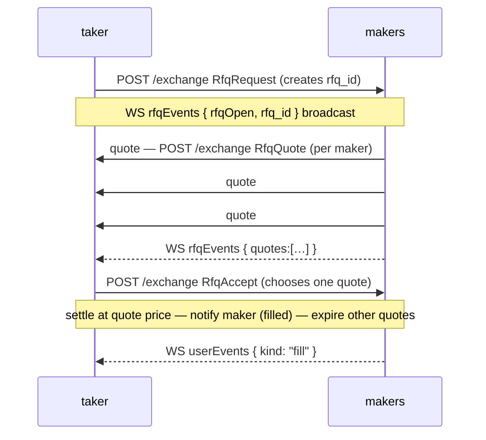
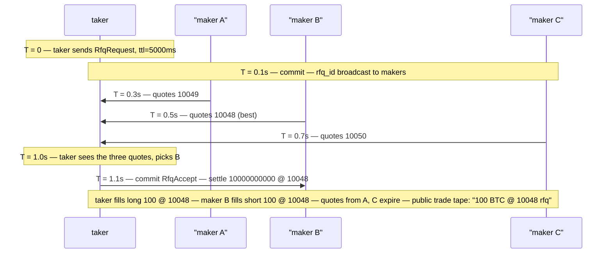

# Запрос котировки (RFQ)

:::info
**Предварительная версия.**
:::

## Кратко

RFQ позволяет тейкеру запросить приватную котировку на конкретный объём у набора зарегистрированных маркет-мейкеров, принять лучшую из них и осуществить расчёт по этой цене — не раскрывая объём в публичном стакане заранее. Полезно для объёмов, способных сдвинуть видимый стакан.

## Зачем нужен RFQ

Исполнение на публичном CLOB раскрывает намерения. Заявка на $5M в активе с малой ликвидностью сигнализирует всем участникам ещё до первого исполнения. RFQ меняет модель:

- **Тейкер** публикует RFQ с указанием актива, стороны, объёма и необязательной ориентировочной цены.
- **Маркет-мейкеры** (зарегистрированные и включившие опцию для данного актива) отвечают котировками в пределах окна (как правило, 1–5 секунд).
- **Тейкер** принимает лучшую котировку → атомарный расчёт по этой цене; остальные котировки истекают.

Котировки видны только тейкеру (не публикуются в стакане). Остальные участники видят сделку постфактум в [`trades` WS-ленте](../api/ws/subscriptions.md#trades) с тегом `kind: "rfq"`.

## Жизненный цикл



## Последовательность действий

### Тейкер — запрос RFQ

`RfqRequest` (вариант действия; структура аналогична [`submit_order`](../api/rest/exchange.md#submit_order)):

```json
{
  "type": "RfqRequest",
  "params": {
    "asset":          0,
    "side":           "Buy",
    "size":        "10000000000",
    "reference_px":"10050000000",
    "max_slippage_bps": 50,
    "ttl_ms":         5000
  }
}
```

| Поле | Значение |
|-------|---------|
| `reference_px` | Ориентировочная цена тейкера (как правило, публичная маркировочная цена); маркет-мейкеры используют её как ориентир |
| `max_slippage_bps` | Максимально допустимое отклонение цены от ориентира; котировки за пределами диапазона отбрасываются |
| `ttl_ms` | Время, в течение которого RFQ остаётся открытым до автоматического истечения |

Ответ:

```json
{ "accepted": true, "rfq_id": "0x<16 bytes>" }
```

RFQ рассылается подключившимся маркет-мейкерам через [`userEvents` WS-канал](../api/ws/subscriptions.md#userevents) (выделенный поток событий `rfq*` — в дорожной карте).

### Маркет-мейкер — отправка котировки

`RfqQuote`:

```json
{
  "type": "RfqQuote",
  "params": {
    "rfq_id":       "0x<...>",
    "px":     "10049000000",
    "size":      "10000000000",
    "expires_at_ms":1735690000000
  }
}
```

Маркет-мейкер может отправить несколько котировок (например, частичные исполнения по разным ценам) за время действия RFQ. Каждый `RfqQuote` является самостоятельным действием и получает собственный `quote_id`.

### Тейкер — принятие котировки

`RfqAccept`:

```json
{
  "type": "RfqAccept",
  "params": { "rfq_id": "0x<...>", "quote_id": "0x<...>" }
}
```

Расчёт атомарен в следующем блоке:
- Позиция тейкера увеличивается на `size` по цене `px`.
- Позиция маркет-мейкера увеличивается на `size` с противоположной стороны по той же цене.
- Остальные котировки по данному `rfq_id` истекают.
- Структура комиссий: те же уровни для маркет-мейкера/тейкера, что и при исполнении в публичном стакане ([комиссии](./fees.md)).

### Автоматическое истечение

Когда `ttl_ms` истекает без принятия котировки:

```json
{ "kind": "rfqExpired", "rfq_id": "0x<...>" }
```

Без списания средств; все отправленные котировки аннулируются.

## Регистрация маркет-мейкеров

Чтобы иметь право выставлять котировки по активу, маркет-мейкер проходит регистрацию через `RfqRegister`:

```json
{
  "type": "RfqRegister",
  "params": { "asset": 0, "active": true, "min_size": "1000000000" }
}
```

`min_size` позволяет маркет-мейкерам игнорировать мелкие RFQ, на которые они не хотят реагировать. Для отмены регистрации используется `active: false`.

Зарегистрированные маркет-мейкеры получают RFQ-рассылки через `rfqEvents`. Они НЕ обязаны выставлять котировки — участие в каждом RFQ добровольно.

## Семантика расчётов

| Свойство | Исполнение RFQ |
|----------|----------|
| Цена | `px` из котировки, независимо от публичного стакана |
| Контрагент | Только один маркет-мейкер (подписант выбранной котировки) |
| Влияние на стакан | Отсутствует — сделка не исполняется против рестинговых заявок |
| Публичная видимость | Лента сделок показывает исполнение постфактум с тегом `rfq` |
| Комиссии | Стандартные уровни маркет-мейкера/тейкера согласно тарифному расписанию |
| Маржа | Аналогично обычному исполнению (`init_margin` списывается с обеих сторон) |
| Ликвидация | Аналогично — после расчёта позиция становится обычной |

## Ограничения RFQ

- **Не обходит маржевые требования.** Тейкер должен иметь маржу для позиции; при недостаточной марже возвращается стандартный `422`.
- **Не скрывает сделку постфактум.** Сделка публикуется в публичной ленте после расчёта с тегом `rfq`.
- **Не является голландским аукционом.** Котировки не затухают; маркет-мейкеры выставляют фиксированные цены; тейкер выбирает одну.
- **Не допускает исполнения через нескольких маркет-мейкеров.** Одно принятие RFQ соответствует одной котировке маркет-мейкера в полном объёме. Для разделения между маркет-мейкерами необходимо запустить несколько RFQ.

## Запрос открытых RFQ

Состояние движка RFQ доступно через путь чтения `/info` на узле посредством двух типов запросов — см. [`rfq_open`](../api/rest/info.md#rfq_open) и [`rfq_user`](../api/rest/info.md#rfq_user) для полного описания структур ответов и таблиц полей. Значения `size` / `price` / `max_size` / `limit_px` — это целочисленные строки в формате **1e8 с фиксированной точкой** (плоскость стакана/заявок).

`rfq_open` **не принимает параметров** и возвращает все открытые RFQ-запросы вместе с котировками маркет-мейкеров:

```bash
curl -X POST https://devnet-gateway.mtf.exchange/info \
  -H 'content-type: application/json' \
  -d '{"type":"rfq_open"}'
```

Для получения RFQ, в которых участвует конкретный аккаунт, `rfq_user` принимает `account_id` (u64) или `address` (0x hex) и разделяет результат на `requested` (RFQ, открытые аккаунтом) и `quoted` (RFQ, по которым аккаунт выставлял котировки):

```bash
curl -X POST https://devnet-gateway.mtf.exchange/info \
  -H 'content-type: application/json' \
  -d '{"type":"rfq_user","address":"0x..."}'
```

Если аккаунт не является стороной ни одной сделки, возвращается ответ 200 с обоими пустыми списками.

## Граничные случаи

<details>
<summary>Показать граничные случаи</summary>

- **Несколько котировок от одного маркет-мейкера.** Разрешено; тейкер выбирает лучшую.
- **Котировка маркет-мейкера поступает после принятия тейкером.** Котировка молча отбрасывается; ошибка не возникает.
- **RFQ истекает, пока тейкер подписывает принятие.** Принятие возвращает `{"error":"rfq expired"}`. Повторите попытку с новым `RfqRequest`.
- **Аккаунт тейкера становится неподходящим в момент принятия.** Если аккаунт тейкера переходит в T1+ между запросом и принятием, принятие отклоняется. Маркет-мейкер сохраняет право котировать в будущих RFQ.
- **Недостаточная маржа маркет-мейкера в момент принятия.** Принятие отклоняется с `{"error":"maker margin"}`. Тейкер может попробовать другую котировку из того же RFQ.

</details>

## Последовательность — принятое RFQ



## См. также

- [Типы ордеров](./order-types.md) — альтернативы в публичном стакане
- [Каталог действий `/exchange`](../api/rest/exchange.md#action-catalog) — `RfqQuote` / `RfqAccept` (в настоящее время распознаются, но ещё не подключены)
- [`userEvents` WS](../api/ws/subscriptions.md#userevents) — события RFQ передаются через этот канал
- [Комиссии](./fees.md) — исполнения RFQ облагаются комиссиями по стандартному уровню

## Часто задаваемые вопросы

<details>
<summary>Показать FAQ</summary>

**В: Зачем не просто разместить скрытую заявку в стакане?**
О: Скрытые заявки всё равно раскрываются через исполнения. RFQ не публикует ничего — объём невидим до момента расчёта.

**В: Можно ли отменить котировку RFQ?**
О: Да — `RfqCancelQuote { quote_id }`. Полезно, когда риск маркет-мейкера меняется в ходе действия RFQ.

**В: Есть ли особый алгоритм матчинга только для RFQ, о котором нужно знать?**
О: Нет — после принятия тейкером расчёт происходит напрямую между тейкером и выбранным маркет-мейкером. Движок CLOB не задействован.

**В: Может ли рынок с небольшой ликвидностью CLOB иметь рынок RFQ?**
О: Да — зарегистрированные маркет-мейкеры могут котировать на любом рынке вне зависимости от глубины стакана. RFQ особенно полезен для неликвидных и долгохвостовых активов, где публичный стакан не способен поглотить крупный объём.

</details>
