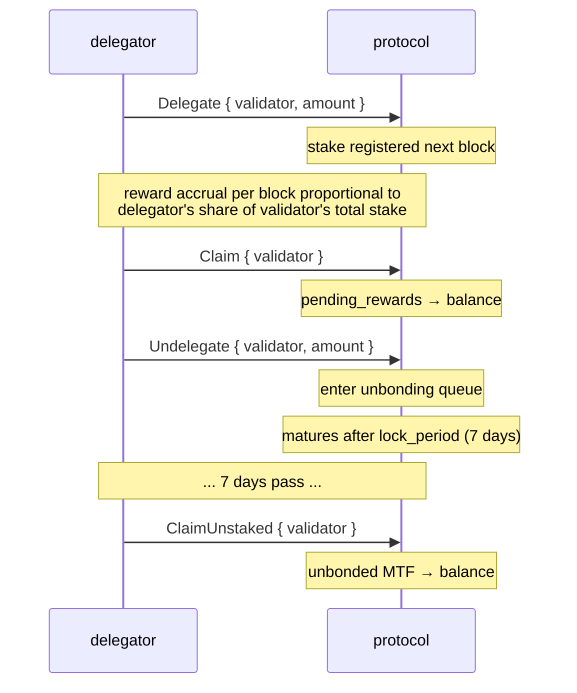
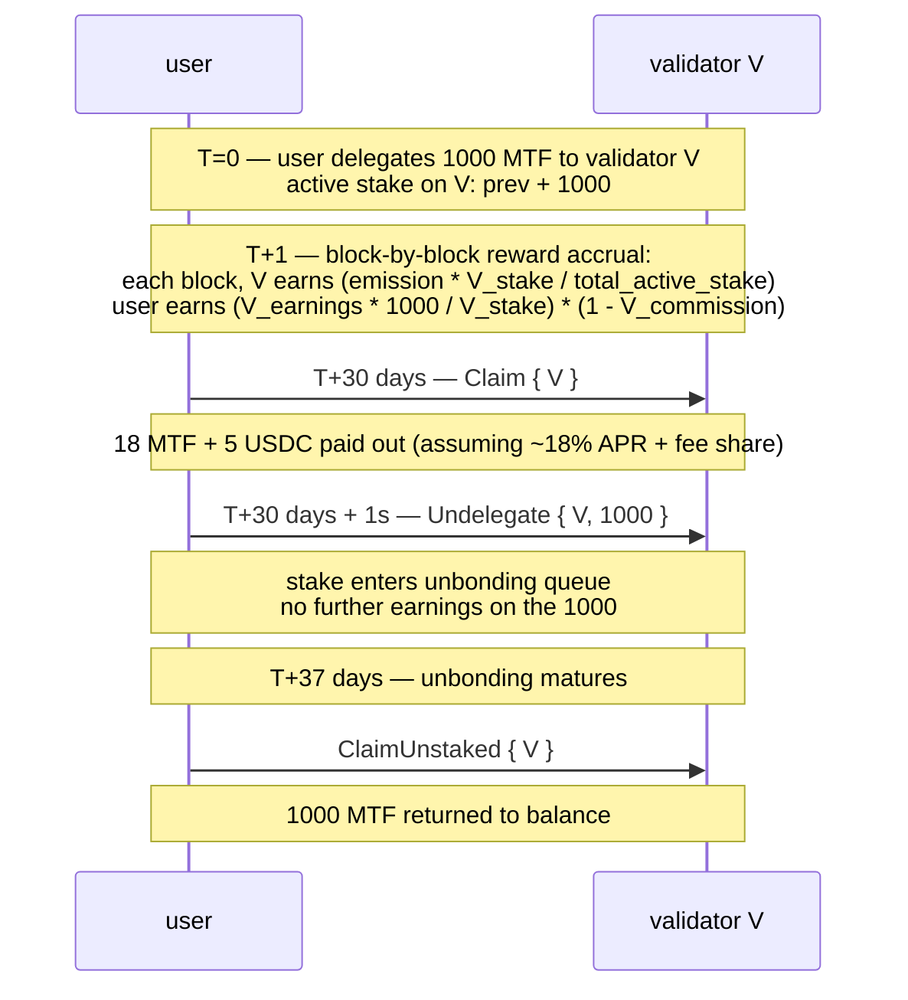

# Стейкинг

:::info
**Активно на devnet.** Делегирование, снятие делегирования, получение вознаграждений и регистрация валидаторов работают и полностью проверены сквозным тестированием в 4-узловой сети devnet.
:::

## Кратко

Держите MTF, делегируйте их валидатору и получайте эмиссионные вознаграждения протокола плюс долю комиссионного дохода. Стейк остаётся ликвидным вплоть до истечения `lock_period`; вывод из стейкинга занимает `7 дней` для полного разблокирования. Слэшинг применяется к нарушающим правила валидаторам; делегаторы несут частичную ответственность по слэшингу.

## Участники

| Роль | Описание |
|------|-------------|
| **Валидатор** | Запускает узел консенсуса, предлагает блоки, голосует. Обязан иметь собственный бонд выше `min_self_bond` (по умолчанию 100 000 MTF). |
| **Делегатор** | Держит MTF, выбирает валидатора и получает вознаграждения за вычетом комиссии валидатора. |
| **Протокол** | Начисляет вознаграждения за каждый блок пропорционально доле в стейке. |

## Процесс стейкинга



## Действия

### `Delegate`

```json
{
  "type": "Delegate",
  "params": { "validator": "0x<val_addr>", "amount": "10000000000" }
}
```

Переводит MTF с баланса в пул делегирования валидатора. Вступает в силу со следующего блока. Вознаграждения начисляются с этого момента.

### `Undelegate`

```json
{
  "type": "Undelegate",
  "params": { "validator": "0x<val_addr>", "amount": "10000000000" }
}
```

Выводит токены из активного стейка и помещает их в очередь разблокирования. Вознаграждения в период разблокирования не начисляются. Завершается в момент `now + lock_period_ms`.

### `Redelegate`

```json
{
  "type": "Redelegate",
  "params": { "from": "0x<val1>", "to": "0x<val2>", "amount": "10000000000" }
}
```

Перемещает стейк между валидаторами **без** помещения в очередь разблокирования. Допускается не более одного переделегирования для каждой пары `(from, to)` в рамках 24-часового окна (защита от резких переключений).

### `Claim`

```json
{
  "type": "Claim",
  "params": { "validator": "0x<val_addr>" }
}
```

Переводит накопленные вознаграждения из `pending_rewards` на MTF-баланс делегатора. Если ожидающие вознаграждения равны нулю, действие не производится.

Автовывод **не** выполняется автоматически — запрашивайте вознаграждения по расписанию (ежедневно / еженедельно) или перед изменением делегирования.

### `ClaimUnstaked`

```json
{
  "type": "ClaimUnstaked",
  "params": { "validator": "0x<val_addr>" }
}
```

Переводит созревшие разблокирования (по которым истёк период блокировки) обратно на MTF-баланс. Операция идемпотентна.

## Источники вознаграждений

| Источник | Периодичность | Доля |
|--------|---------|-------|
| Эмиссия протокола | За каждый блок | `emission_per_block × stake_share × (1 - validator_commission)` |
| Комиссионный доход (казначейство → стейкеры) | За эпоху | `treasury_inflow × staker_share × stake_share × (1 - commission)` |

`emission_per_block`: задаётся управлением; текущее значение доступно через запрос `staking_state`.
`staker_share` от казначейства: задаётся управлением, по умолчанию `50%`.
`validator_commission`: устанавливается каждым валидатором, ограничена `20%` по решению управления.

Вознаграждения рассчитываются в MTF (эмиссия) и USDC (комиссионный доход) — при получении выплачиваются оба. В `staking_state` отображается ожидаемая сумма в каждой валюте.

## Период блокировки

По умолчанию: **7 дней** для вывода из стейкинга. Настраивается управлением для каждого пула стейкинга.

| Состояние | Длительность | Начисляются вознаграждения? | Подвержено слэшингу? |
|-------|----------|:--------------:|:----------:|
| Активный (делегированный) | бессрочно | да | да |
| Разблокирование | `lock_period_ms` | нет | да (до созревания) |
| Разблокированный (в очереди получения) | до получения | нет | нет |

Риск слэшинга в период разблокирования — ловушка: если валидатор подвергается слэшингу в процессе разблокирования, это затрагивает и делегаторов, находящихся в разблокировании, несмотря на то что они уже заявили о выходе.

## Слэшинг

Валидаторы подвергаются слэшингу за:

| Нарушение | Слэш | Последствия для делегатора |
|---------|-------|--------------------------|
| Двойная подпись (подписаны два конфликтующих блока на одной высоте) | 5% стейка + заключение в jail | Пропорциональная потеря 5% делегирования |
| Простой (пропущено `downtime_blocks` последовательных слотов предложения блока) | 0.1% стейка + заключение в jail | Пропорциональная потеря 0.1% |
| Голосование за недействительный форк | 5% + постоянное исключение | Пропорциональная потеря 5% |

У делегаторов, попавших под слэшинг, значение `delegation.amount` уменьшается на блоке слэшинга. Без предупреждения — слэшинг определяется консенсусом.

Меры снижения рисков:
- Выбирайте хорошо управляемых валидаторов (история аптайма, стабильность комиссии).
- Диверсифицируйте по нескольким валидаторам (слэшинг одного затрагивает только соответствующую долю).
- Избегайте валидаторов с суммой вблизи `min_self_bond` (выше вероятность некорректного выхода).

## Выбор валидатора

```bash
curl -X POST https://devnet-gateway.mtf.exchange/info -d '{"type":"validator_summaries"}'
```

Возвращает активный набор валидаторов (`{epoch, total_stake, n_active, validators[]}`);
каждая запись содержит:

```json
{
  "validator":          "0x<val>",
  "signer":             "0x<signer>",
  "validator_index":    3,
  "stake":              "10000000000000",
  "self_stake":         "100000000000",
  "commission_bps":     500,
  "is_active":          true,
  "is_jailed":          false,
  "first_active_epoch": 12
}
```

Критерии выбора:
- **Комиссия** (`commission_bps`): чем ниже — тем выше чистый APR. Остерегайтесь схемы «приманки и подмены» (повышение лимита комиссии).
- **Собственный бонд** (`self_stake`): чем выше — тем больше оператор рискует собственными средствами.
- **Статус jail** (`is_jailed`): заключённый в jail валидатор не приносит дохода до освобождения.
- **Активность** (`is_active`): только валидаторы с `is_active: true` входят в живой набор подписантов.

## Оценка APR

Тип запроса [`staking_apr`](../api/rest/info.md#staking_apr) через `/info` является **актуальным** — он возвращает эффективный APR эмиссии, который фактически применяется эффектом вознаграждения при открытии блока, а также связанные с ним входные параметры:

```bash
curl -X POST https://devnet-gateway.mtf.exchange/info -d '{"type":"staking_apr"}'
```

```json
{
  "type": "staking_apr",
  "data": {
    "total_stake":             "1000000",
    "effective_apr":           "0.08",
    "effective_apr_bps":       "800",
    "governance_rate_bps":     800,
    "emission_floor_stake":    "50000000",
    "n_active_validators":     1,
    "current_epoch":           2,
    "is_gross_pre_commission": true
  }
}
```

`effective_apr` определяется из **кривой стейка**, а не из ставки управления:

```text
effective_apr = 0.08 × √( 50M / max(total_stake, 50M) )
```

то есть фиксированные **8%** при объёме стейка до 50M MTF включительно, с убыванием ∝ 1/√stake выше этого порога (чем больше стейк — тем ниже доля каждого стейкера). `governance_rate_bps` зафиксирован, но **НЕ** используется эффектом вознаграждения — оба значения отображаются, чтобы расхождение было наблюдаемым. APR является **валовым**, без учёта индивидуальной комиссии валидатора (`is_gross_pre_commission: true`).

Чистый APR для делегатора:

```
net_apr  =  effective_apr  ×  (1 - validator_commission_bps/10_000)
```

## Граничные случаи

<details>
<summary>Показать граничные случаи</summary>

- **Валидатор выходит в период разблокирования вашего стейка.** Ваш разблокируемый стейк переносится к следующему в очереди валидатору на блоке слэшинга. Вы можете выполнить переделегирование после выхода, если предпочитаете другого валидатора; период блокировки продолжается применительно к новому валидатору.
- **Смена состава активного набора.** Если валидатор выбывает из активного набора (объём делегирования опускается ниже порога), ваш стейк не приносит вознаграждений в период отсутствия валидатора. Вы можете переделегировать активному валидатору.
- **Минимальный собственный бонд.** Валидатор, чей собственный бонд падает ниже `min_self_bond` (вследствие слэшинга или вывода средств), помещается в jail; делегаторы не получают вознаграждений в период jail.

</details>

## Последовательность — полный цикл



## См. также

- [`POST /exchange Delegate / Undelegate / Claim`](../api/rest/exchange.md) (поддерживаемые варианты действий на devnet)
- [`POST /info staking_state`](../api/rest/info.md#staking_state)
- [`POST /info staking_apr`](../api/rest/info.md#staking_apr) — эффективный APR эмиссии и связанные входные параметры
- [`POST /info protocol_metrics`](../api/rest/info.md#protocol_metrics) — агрегированные показатели стейкинга по протоколу (`staking.*`)
- [Совместимость с HL: `delegations`](../api/rest/hl-compat.md#delegations)
- [Комиссии](./fees.md) — комиссионный доход является одним из источников вознаграждений за стейкинг

## Часто задаваемые вопросы

<details>
<summary>Показать FAQ</summary>

**В: Можно ли одновременно держать стейк и торговать?**
О: Да — застейканные MTF и торговый баланс USDC являются отдельными суб-балансами одного и того же аккаунта.

**В: Нужен ли агентский кошелёк для стейкинга?**
О: Нет — но его можно использовать. Агентские кошельки могут вызывать `Delegate` / `Undelegate` / `Claim` (права на вывод средств для изменений стейкинга не требуются).

**В: Можно ли отменить разблокирование?**
О: Нет — после отправки заявки необходимо дождаться истечения полного `lock_period`. Вместо этого воспользуйтесь переделегированием, если вам может понадобиться стейк в другом месте.

**В: Откуда берутся токены MTF при запуске?**
О: Из генезис-распределения и эмиссии за каждый блок. Подробнее о распределении — в [документации по токеномике] (готовится). Протокол не проводит произвольных аирдропов — эмиссия является единственным постоянным источником.

</details>
