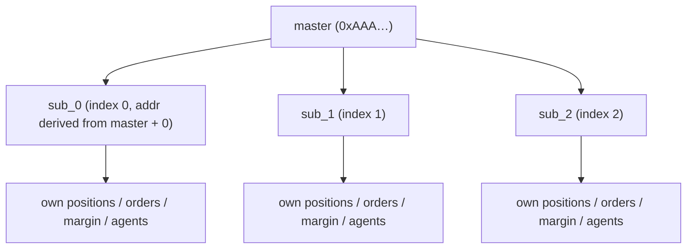
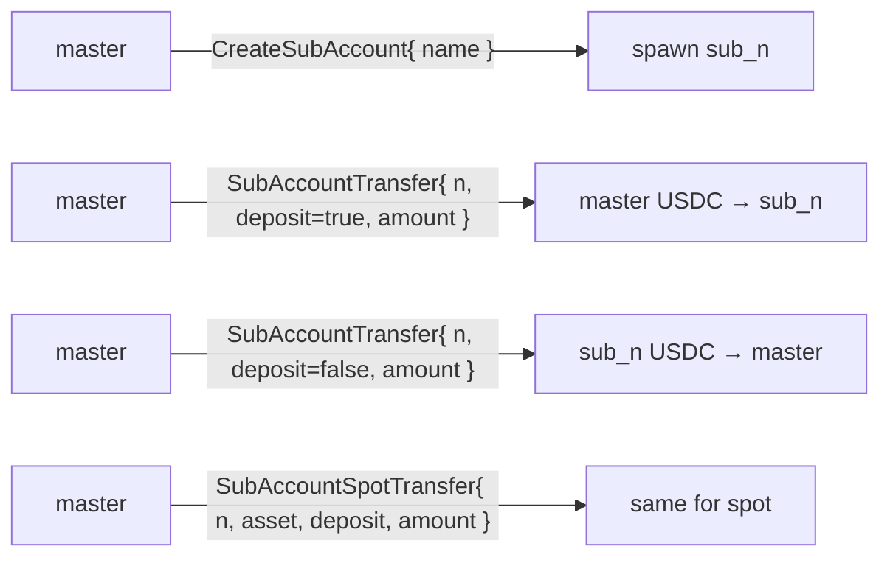
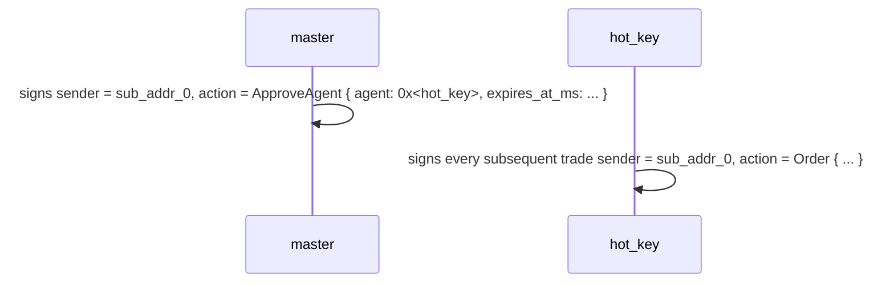
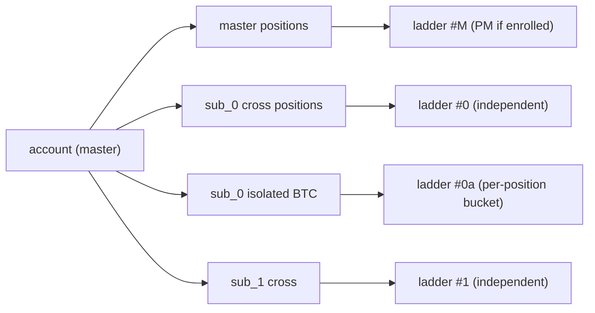
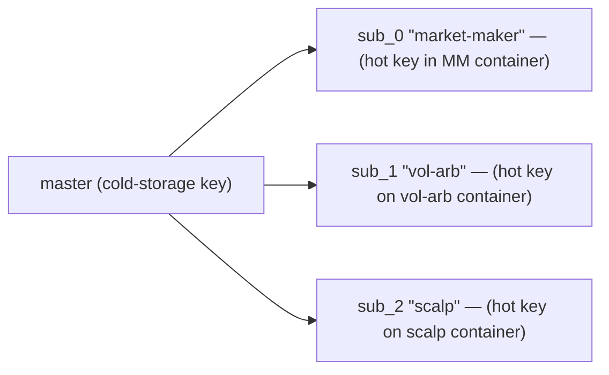
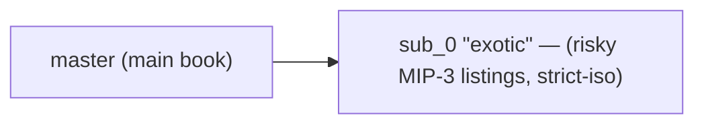
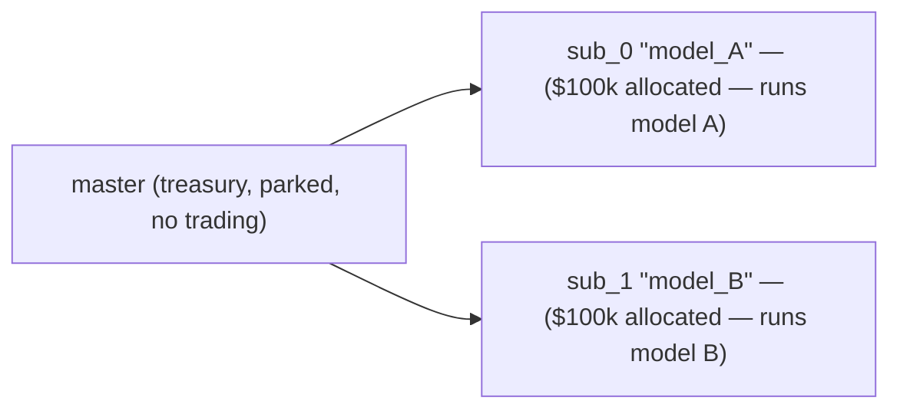
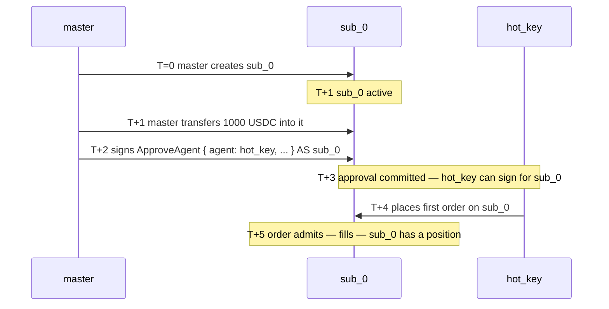

# Субсчета

:::info
**Предварительная версия.** Пользовательский API стабилен; схема деривации адресов зафиксирована до запуска в основной сети.
:::

## Кратко

Субсчёт — это производный адрес, привязанный к мастер-счёту: у него собственные позиции, маржа и ордера, однако пополнение и вывод средств возможны только через мастер. На один мастер допускается до 32 субсчетов. Используйте их для изоляции стратегий, разделения торговых деск или A/B-портфелей без повторного прохождения онбординга.

## Концептуальная модель



Каждый субсчёт является полноценным аккаунтом в машине состояний — с собственным балансом, позициями, порогом ликвидации и [агентскими кошельками](./agent-wallets.md). Связь мастер–субсчёт записывается в отдельную карту.

Жёсткий лимит: **32 субсчёта** на мастер (возможно расширение в V2). При достижении лимита операция `CreateSubAccount` возвращает `{"error":"sub_account_cap"}`.

## Переводы

Переводы возможны только между мастером и субсчётом:



Внешние выводы средств (вне сети, на сторонний адрес) должны выполняться через **мастер**. Субсчета не могут выводить средства напрямую вне сети.

## Деривация адресов

Каждому индексу субсчёта `n` детерминированно соответствует адрес, производный от 20-байтового адреса мастера:

```
sub_addr_n = first_20_bytes( keccak256( master_addr || uint64_be(n) ) )
```

Адрес субсчёта можно вычислить без обращения к состоянию блокчейна. Схема деривации зафиксирована консенсусом при запуске V1; до этого момента возвращаемые адреса следует считать авторитетными.

## Гарантии сегрегации средств

| Гарантия | Механизм |
|-----------|-----------|
| Убытки субсчёта не затрагивают мастер | Субсчёт ликвидируется за счёт собственного баланса; мастер видит только реестр переводов |
| Убытки субсчёта не затрагивают другие субсчета | Аналогично — каждый субсчёт является самостоятельной границей изоляции |
| Мастер МОЖЕТ добровольно поддержать убыточный субсчёт | Добровольно, через `SubAccountTransfer` с пополнением |
| Мастер НЕ МОЖЕТ быть принудительно привлечён к покрытию | Банкротство субсчёта — дело субсчёта, без исключений |
| Мастер может вывести средства **из** субсчёта | Вывод через `SubAccountTransfer` (только если субсчёт остаётся в уровне Safe после перевода) |

## Создание

```json
{
  "type": "CreateSubAccount",
  "params": { "name": "scalping-desk", "explicit_index": null }
}
```

| Поле | Тип | Описание |
|-------|------|-------------|
| `name` | string ≤ 64 chars | Метка для учёта |
| `explicit_index` | uint32 \| null | Конкретный слот для занятия; `null` → следующий свободный |

Ответ:

```json
{
  "accepted": true,
  "data": {
    "sub_index":   0,
    "sub_address": "0x<derived>",
    "name":        "scalping-desk"
  }
}
```

**Индексы монотонны** — однажды выделенный индекс никогда не переиспользуется, даже если субсчёт опустел и заброшен. Используйте `explicit_index` осмотрительно.

## Пополнение

```json
{
  "type": "SubAccountTransfer",
  "params": { "sub_index": 0, "deposit": true, "amount": "1000000000" }
}
```

`amount` указывается в базовых единицах USDC (6 знаков после запятой). `deposit: true` — перевод с мастера на субсчёт; `false` — с субсчёта на мастер.

Для спот-активов используйте `SubAccountSpotTransfer` (добавляет поле `asset`).

**Перевод должен оставить субсчёт в уровне Safe** — вывод, который перевёл бы субсчёт в уровень T0+, отклоняется с ошибкой `{"error":"insufficient sub balance"}`. Сначала пополните субсчёт, затем выведите излишек.

## Торговля через субсчёт

Субсчёт является обычным аккаунтом. Подписывайте транзакции ключом субсчёта (или [одобренным агентом](./agent-wallets.md)) и отправляйте, указывая адрес субсчёта в поле `sender`.

Типичный сценарий: мастер подписывает `ApproveAgent` для каждого субсчёта с адреса субсчёта — мастер обладает полномочиями делегирования над своими субсчетами, поэтому это разрешено, несмотря на то что `ApproveAgent` в общем случае доступен только мастеру. У каждого субсчёта затем появляется собственный горячий ключ для торговли.



SDK представляет каждый субсчёт в виде отдельного экземпляра `Client` со своей парой ключей, привязанного к соответствующему производному адресу.

## Изоляция ликвидации

[Ступенчатая ликвидация](./tiered-liquidation.md) субсчёта рассчитывается относительно **собственной** стоимости счёта и поддерживающей маржи. Банкротство `sub_0` не ставит под угрозу `sub_1` или мастер.

Можно также установить режим маржи субсчёта `StrictIso` для отдельного актива, чтобы позиции по этому активу не учитывались в кросс-активном PM, даже если мастер зарегистрирован в PM.



## Подключение PM на уровне субсчёта

Каждый субсчёт независимо регистрируется в [портфельной марже](./portfolio-margin.md) (с собственной проверкой капитала по `pm_min_equity`).

```json
{
  "sender": "0x<sub_0_addr>",
  "action": { "type": "UserPortfolioMargin", "params": { "enabled": true } }
}
```

Мастер может оставаться в классическом режиме, пока субсчёт переходит на PM; это удобно, когда один субсчёт ведёт хеджированную книгу, а остальные — направленные сделки.

## Запрос данных

```bash
curl -X POST https://devnet-gateway.mtf.exchange/info \
  -d '{"type":"sub_accounts","address":"0x<master>"}'
```

Возвращает список субсчетов с индексами, производными адресами, метками и снимком состояния клирингового дома каждого субсчёта.

Каждый субсчёт также можно запросить как полноценный аккаунт через `account_state`, `open_orders`, `user_fills` и т.д., передав его адрес в параметре `address`.

## Ограничения

| Ограничение | По умолчанию | Примечания |
|-------|---------|-------|
| Субсчетов на мастер | 32 | В V2 возможно расширение |
| Длина имени субсчёта | 64 символа | UTF-8; валидация только по длине |
| Одновременных переводов в полёте | 8 на мастер | Ограничение мемпула |
| Мастер может выводить из субсчёта | да, если субсчёт остаётся в Safe | Иначе отклоняется |
| Субсчёт может выводить вне сети | нет | Должен маршрутизировать через мастер |
| Субсчёт может иметь агентов | да | Настраивается отдельно для каждого субсчёта |
| Субсчёт может быть мультиподписным | нет | В V1 только мастер может быть мультиподписным |

## Типичные сценарии использования

### Разделение стратегий



Каждая стратегия имеет собственный агентский ключ, собственный лимит ликвидации и собственную отчётность по PnL.

### Риск-файрвол



Основная книга получает весь потенциальный доход; банкротство sub_0 ограничено его депозитом.

### A/B-портфели



Ежеквартальное сравнение NAV по субсчетам определяет, какой из них получит большую аллокацию.

## Граничные случаи

<details>
<summary>Показать граничные случаи</summary>

- **Гонка между `CreateSubAccount` и первым трафиком агента.** Субсчёт вступает в силу в следующем блоке, как и все изменения состояния. Последовательность: создать → одобрить агента → подождать 1 блок → торговать.
- **Мастер пытается перевести средства из субсчёта во время его ликвидации T1.** Отклоняется; залог субсчёта используется для защиты. Перевод разрешён после того, как субсчёт вновь перейдёт в уровень Safe.
- **Мастер удаляет / бросает субсчёт.** В V1 не предусмотрено. Субсчета остаются в индексе навсегда. Пустые субсчета не требуют ресурсов состояния; об этом не стоит беспокоиться.
- **Агентский ключ субсчёта скомпрометирован.** Отзовите через мастер (мастер является вышестоящим и обладает полномочиями делегирования). Используйте тот же `ApproveAgent` с `expires_at_ms` в прошлом.
- **Субсчёт субсчёта.** Не поддерживается. `CreateSubAccount` от субсчёта отклоняется.

</details>

## Последовательность — полная настройка



## См. также

- [Агентские кошельки](./agent-wallets.md) — горячие ключи для каждого субсчёта
- [Портфельная маржа](./portfolio-margin.md) — взаимодействие с кросс-активным PM
- [Режимы маржи](./margin-modes.md) — Cross / Isolated / Strict-Iso для каждого субсчёта
- [`POST /info sub_accounts`](../api/rest/info.md#sub_accounts) — нативный запрос MTF

## FAQ

<details>
<summary>Показать FAQ</summary>

**В: Агрегируются ли комиссии субсчёта с мастером для определения уровня?**
О: Да. Объём торгов за 30 дней суммируется по мастеру и всем субсчетам. Торговля через субсчета учитывается в скидке уровня мастера.

**В: Может ли субсчёт получать средства напрямую от другого аккаунта (не через мастер)?**
О: Да — `UsdcTransfer` на адрес субсчёта работает так же, как и на любой другой аккаунт. После этого средства не ограничены маршрутом через мастер; они просто находятся на балансе субсчёта.

**В: Разделяют ли субсчета пространство нонсов с мастером?**
О: Нет. У каждого субсчёта своя последовательность нонсов. Нонсы мастера принадлежат мастеру; нонсы sub_0 — sub_0; и так далее.

**В: Можно ли преобразовать субсчёт в мастер или отвязать его?**
О: В V1 — нет. Субсчёт навсегда остаётся субсчётом. Для «отвязки» создайте новый аккаунт по другому адресу и переведите на него средства.

</details>
