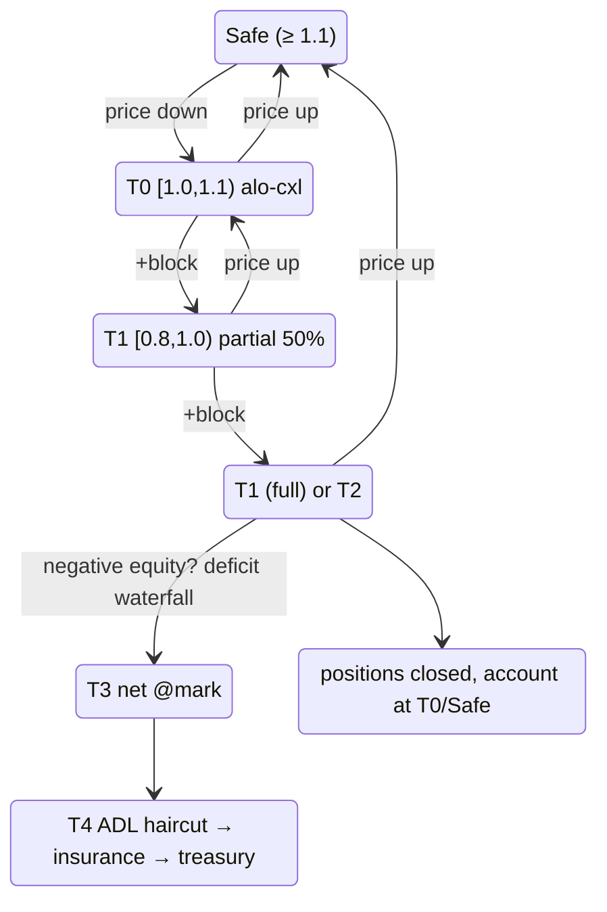

# Многоуровневая ликвидация

:::tip
**Стабильно.**
:::

## Кратко

5-уровневая лестница на основе формулы `health = account_value / maint_margin`. Каждый уровень определяет действия протокола по мере снижения показателя здоровья счёта. [Жёлтая карточка](#почему-жёлтая-карточка) (T0) — это гистерезисный grace-период MetaFlux: один блок предупреждения перед тем, как будет закрыта любая позиция. T4 [ADL](./adl.md) — финальный механизм социализации убытков.

| Уровень | Диапазон health | Действие | Затрагивается позиция? |
|---------|-----------------|---------|---|
| (безопасно) | `health ≥ 1.1` | Бездействие | — |
| **T0** | `1.0 ≤ health < 1.1` | **Жёлтая карточка**: ордера ALO принудительно отменяются, кошелёк уведомляется | Нет |
| **T1** | `0.8 ≤ health < 1.0` | Частичное [закрытие по лимиту с полом](#как-выполняется-принудительное-закрытие-ценовой-пол) (50%) — полное закрытие, если T1 сработал в течение `cooldown_ms` | Да (50%) или Да (100%) |
| **T2** | `0.667 ≤ health < 0.8` | Полное [закрытие по лимиту с полом](#как-выполняется-принудительное-закрытие-ценовой-пол) | Да (100%) |
| **T3** | `health < 0.667` | [Неттинг по марку](#t3-бэкстоп--неттинг-по-марку) против прибыльных контрагентов (незаполненные остатки T1/T2 тоже эскалируются сюда) | Да — неттинг по марку |
| **T4** | отрицательный капитал после T3 | [Каскад покрытия дефицита](#t4--каскад-покрытия-дефицита): стрижка ADL → страховой фонд → очередь казначейства | Стрижка реализованной прибыли победителей |

`account_value` включает нереализованный PnL. `maint_margin` — базовый показатель по активу (классический) или рассчитанный по SPAN (при подключении к PM).

## Вычисление уровней

Диапазоны ниже — **буквальные константы из кода**, а не приближения.

`BoleEngine::decide(account, account_value: i128, maintenance_margin: u128, ts_ms)` — **чистая функция** (pure function): считывает состояние кулдауна, но не изменяет его, возвращая одно значение `BoleDecision`:

```
if maintenance_margin == 0            → Idle
if account_value < 0                  → Backstop { deficit = maintenance_margin + |account_value| }

health = account_value / maintenance_margin            # Decimal division

if health ≥ 1.1   (yellow_card_threshold)              → Idle            (Safe)
if health ≥ 1.0                                        → YellowCard      (T0)
if health < 0.667 (full_market_floor)                 → Backstop { deficit = maintenance_margin − account_value }   (T3)
if health < 0.8   (partial_threshold)                 → FullMarket { size_to_close = maintenance_margin }           (T2)
# else 0.8 ≤ health < 1.0  (T1):
if partial_cooldown_active(account)                   → FullMarket { size_to_close = maintenance_margin }
else                                                  → PartialMarket50 { size_to_close = maintenance_margin / 2 }
```

| Константа | Значение | Символ |
|-----------|----------|--------|
| Порог жёлтой карточки (верхняя граница T0) | `1.1` | `default_yellow_card_threshold` |
| Порог частичного закрытия (верхняя граница T1) | `0.8` | `default_partial_threshold` |
| Пол полного рыночного закрытия (вход в T3) | `0.667` (≈ 2/3) | `full_market_floor` |
| Кулдаун частичного→полного закрытия | `30_000 ms` | `DEFAULT_PARTIAL_COOLDOWN_MS` |

- Все сравнения выполняются через `rust_decimal::Decimal` (без чисел с плавающей точкой). Если `account_value` превышает `Decimal::MAX`, функция `decide` сначала сдвигает оба операнда вправо на одинаковое число бит — это сохраняет соотношение health, и выбранный уровень при таких значениях не меняется.
- **Только `PartialMarket50` взводит кулдаун** (`record_attempt`); `FullMarket` и `Backstop` не блокируют последующие частичные закрытия. Таким образом, эскалация T1 с частичного до полного закрытия происходит только тогда, когда *предыдущее частичное* закрытие ещё находится в 30-секундном окне.
- `size_to_close` для частичного закрытия равен `maintenance_margin / 2` (с усечением до целого). `deficit` для бэкстопа: `maintenance_margin − account_value` при `account_value ≥ 0`, иначе `maintenance_margin + |account_value|`.
- Движок обрабатывает **инкрементальный «грязный» набор** в каждом блоке (счета, помеченные событиями, + скользящий срез самовосстановления) — не полный скан. Эквивалентность полному скану с нуля доказана фазз-тестами. Рестинговая ликвидность ALO счетов T0 принудительно отменяется после классификации.

## Как выполняется принудительное закрытие (ценовой пол)

Принудительное закрытие T1/T2 — это **никогда не рыночная свип-продажа**. Оно исполняется как IOC LIMIT-ордер с привязкой к зафиксированному марку:

```
sell (long leg):      limit = mark × (1 − liq_floor)
buy-back (short leg): limit = mark × (1 + liq_floor)
```

- `liq_floor` — рисковый параметр конкретного рынка; **по умолчанию он равен половине поддерживаемого отношения рынка** (на рынке с поддерживаемой маржой 5% исполнение ограничено отклонением 2,5% от марка). Поддерживаемое отношение откалибровано так, чтобы покрывать проскальзывание при ликвидации плюс комиссии, поэтому пол гарантирует: принудительное закрытие никогда не даст проскальзывания больше, чем предусмотрено буфером.
- Срез заполняется только по ценам на уровне пола или лучше. **То, что не заполняется выше пола, НЕ продаётся в тонкий стакан** — оно немедленно эскалируется в очередь бэкстопа T3. Это антикаскадная граница: принудительное закрытие не может опустить марк ниже пола, а значит, не может затянуть другие счета в ликвидацию.
- Заполнение проходит по **тому же пути расчётов, что и обычное исполнение**: реализованный PnL начисляется на счёт, открытый интерес двигается, сторона мейкера контрагента рассчитывается в штатном режиме.
- **Комиссия за ликвидацию** (по умолчанию 50 б.п. от закрытого номинала, настраивается на уровне рынка) списывается из оставшегося положительного капитала счёта — она никогда не создаёт дефицита — и зачисляется в страховой фонд, который является именно тем пулом, что покрывает нехватку при бэкстопе.
- **Собственные рестинговые ордера счёта на противоположной стороне отменяются, а не самоисполняются** (самоисполнение вновь откроет то, что было только что закрыто).

Размер частичного закрытия (T1) составляет 50% от целевой стороны на базовых рынках; рынки, развёрнутые билдерами, могут настроить рамп, затухающий по health (закрывать небольшой срез чуть ниже уровня поддерживаемой маржи, бо́льшие срезы — по мере дальнейшего падения health, с ограничением на рынок), а также 30-секундный кулдаун между срезами.

## Полная диаграмма состояний



`cooldown_ms` по умолчанию равен `30 s`. Если в течение окна кулдауна счёт снова попадает в T1, происходит эскалация до полного закрытия.

## Почему жёлтая карточка

На большинстве публичных деривативных блокчейнов переход сразу от «здорового» состояния к «частичному закрытию». Всплеск волатильности, который опускает health с 1,5 до 0,95 за один тик, запускает принудительную продажу, которая давит на марк, втягивая другие счета на тот же уровень. Каскад — главный источник боли при ликвидации в наблюдаемых событиях.

T0 — это **однобловый гистерезисный слой**. Счёт входит в диапазон; чейн замораживает его рестинговые открытые ордера (только ALO — см. ниже) и уведомляет клиента, но ничего не продаётся. До следующего блока консенсуса есть время:

- пополнить маржу через `Deposit` (или `UpdateIsolatedMargin` для добавления в бакет),
- вручную закрыть часть позиции,
- или не делать ничего — тогда T1 сработает при следующей проверке.

При времени блока 100 мс grace-окно коротко, но детерминировано и достаточно велико для реакции автоматизированного риск-процесса.

### Почему отменяются только ордера ALO

| TIF ордера | Отменяется на T0? | Причина |
|-----------|:-----------------:|-------|
| `Alo` | да | Только пассивный рест, без начисленных комиссий; капитал лучше использовать для защиты позиции |
| `Gtc` (активный лимит) | нет | Может быть вашим активным инструментом обнаружения цены; его отмена может ухудшить ситуацию |
| `Ioc` (в полёте) | н/п | Разрешается при добавлении; никогда не рестует |
| Trigger (StopLoss / TakeProfit) | нет | Часто именно та защита, которая должна сработать |

Цель: высвободить заблокированный капитал из пассивного реста, сохранив ваши активные риск-решения.

## Переход T1 с частичного на полное закрытие

T1 начинается с 50%-го частичного закрытия. Логика кулдауна:

- **Первое срабатывание T1**: закрытие 50%. `cooldown_armed_at = now`.
- **Если health возвращается в T0/Safe** до `cooldown_armed_at + cooldown_ms`: кулдаун естественно снимается, как только счёт покидает T1.
- **Если health остаётся в T1** на протяжении `cooldown_ms`: следующая проверка T1 эскалирует до **полного** закрытия вместо очередного частичного.
- На T2 или T3 кулдаун НЕ взводится повторно.

```
T = 0       T1 fire #1, 50% close, cooldown armed
T = 5s      mark slips further, still in T1
T = 20s     mark recovers slightly; in T0
T = 31s     cooldown elapsed (would have escalated, but we're not in T1)
            account considered T0/Safe; cooldown reset
```

Versus:

```
T = 0       T1 fire #1, 50% close
T = 5s      still T1
T = 30s     STILL T1 (cooldown elapses while in T1)
T = 30s+    T1 fire #2 → full close
```

Кулдаун — *не* период бездействия: T1 продолжает запускать частичные закрытия. Кулдаун управляет только апгрейдом с частичного до полного закрытия.

### Наглядный пример

Счёт: лонг 1 BTC по цене входа 100, изолированный бакет USDC = 20.

```
mark = 100   account_value = 20 + 0 = 20   maint = 5 (5% of 100)  health = 4.0  → Safe
mark = 90    account_value = 20 - 10 = 10  maint = 4.5            health = 2.2  → Safe
mark = 85    account_value = 20 - 15 = 5   maint = 4.25           health = 1.18 → T0 (alo cancel)
mark = 84.5  account_value = 20 - 15.5     maint = 4.225          health = 1.06 → T0
mark = 84    account_value = 20 - 16 = 4   maint = 4.2            health = 0.95 → T1
                  T1 fire: close 0.5 BTC at mark 84
                  realised PnL: -8 (closed 0.5 BTC, entry 100, exit 84)
                  bucket: 20 - 8 = 12
                  remaining position: 0.5 BTC long entry 100, mark 84
                  account_value = 12 - 8 = 4 (unrealised -8 on 0.5 BTC)
                  maint = 0.5 * 84 * 0.05 = 2.1
                  health = 4 / 2.1 = 1.9 → back to Safe
```

Частичное закрытие на 50% восстановило health с 0,95 (T1) до 1,9 (Safe). Цель частичного закрытия — привести размер позиции в соответствие с возможностями оставшегося бакета нести меньшую экспозицию.

Если 50%-е закрытие не восстанавливает health (при более глубоком падении), второе срабатывание T1 в течение кулдауна эскалирует:

```
mark = 84    T1 fire partial: 0.5 BTC closed, health → 1.9
mark = 82    health = 0.95 again (still in T1, cooldown active)
              T1 escalates to full close: remaining 0.5 BTC closed at 82
              realised PnL: -9
              bucket: 12 - 9 = 3
              position: 0
              account closed cleanly with 3 USDC remaining; insurance untouched
```

## T3 бэкстоп — неттинг по марку

Ниже `health = 0.667` (≈2/3 от поддерживаемой маржи) чейн прекращает попытки обратиться к стакану. Позиция — и любые лоты принудительного закрытия, которые стакан не смог поглотить в рамках [ценового пола](#как-выполняется-принудительное-закрытие-ценовой-пол) — **неттингуется по зафиксированному МАРКУ** против наиболее прибыльных позиций противоположной стороны по тому же инструменту (в порядке убывания нереализованного PnL, детерминированный тай-брейк):

```
when account enters T3 (or parked un-fillable lots exist):
   match its position lots against profitable opposite-side holders
   close BOTH sides at MARK              # no book interaction, no price impact
   both sides realise PnL at that mark   # value-neutral: equity unchanged
                                         # by the netting itself
   lots with no profitable counterparty stay parked for the next block
```

Контрагенты, задействованные в неттинге, сохраняют **весь PnL до последнего цента** (реализованный по марку) — они лишь теряют открытую позицию. Комиссия ни с одной из сторон не взимается. Неттинг без применимой цены марка или без прибыльной противоположной стороны просто ждёт — чейн никогда не продаёт принудительно в пустой стакан.

## T4 — каскад покрытия дефицита

Если счёт полностью закрыт по всем позициям, а его капитал **отрицательный**, это безнадёжный долг социализируется в фиксированном порядке (ADL **до** страхового фонда — реализованная прибыль делевериджированных победителей поглощается первой, что сохраняет фонд для подлинных хвостовых событий):

1. **Стрижка ADL** — адаптивный контроллер серьёзности урезает до суммы прибыли, которую контрагенты по неттингу **только что реализовали** (не более полученного ими и никогда не нереализованный PnL на бумаге).
2. **Страховой фонд** — автоматически поглощает остаток (это тот самый пул, который пополняется [комиссией за ликвидацию](#как-выполняется-принудительное-закрытие-ценовой-пол)).
3. **Резерв казначейства** — оставшаяся сумма встаёт в очередь на изъятие из казначейства с мультисиг-авторизацией (человеческий контроль, крайняя мера).

После этого отрицательный баланс счёта обнуляется — долг переходит в каскад. Подробнее о математике контроллера см. [ADL](./adl.md).

## Двойная проверка маржи

Соответствие условиям ликвидации проверяется в **двух точках** каждого блока:

1. **Начало блока**, после обновления цен марка — охватывает счета, которые только что перешли на более низкий уровень вследствие изменения цены.
2. **После действия**, после каждого `Order` / `Cancel` / `Withdraw` от этого счёта — охватывает счета, которые сами спустились на более низкий уровень (например, при выводе слишком большого обеспечения).

Это предотвращает «бесплатное» внутриблоковое манипулирование, при котором пользователь наращивает риск между началом блока и остальными операциями в нём.

## Стратегии восстановления

| Сценарий | Стратегия |
|----------|-----------|
| Движение к T0 | Пополните через `UpdateIsolatedMargin` (Isolated) или `Deposit` (Cross). Заблаговременно выставьте триггерные ордера. |
| Уже на T0 | То же самое. Ордера ALO уже отменены; выставьте новые лимитные ордера на защитных уровнях. |
| Качание между T0 и Safe | Ужесточите внутренние алерты до `health < 1.2`. Разберитесь с причиной — платёж по ставке финансирования? граница марк-бэнда? сбой оракула? |
| Только что сработало частичное T1 | Переоцените ситуацию. Позиция уменьшилась на 50%; рассмотрите добровольное закрытие остатка до того, как кулдаун эскалирует до полного закрытия. |
| Повторное попадание в ловушку кулдауна T1 | Размер позиции не соответствует бакету. Не пополняйте бакет, не скорректировав размер позиции. |

## Как оставаться в безопасной зоне

- Следите за `health` через запросы [`account_state`](../api/rest/info.md#account_state).
- Настройте внутренние алерты на `health < 1.2` — значительно выше T0.
- Для автоматизированных стратегий зарегистрируйте [бота-наблюдателя за рисками](../integration/risk-watcher.md), чтобы пополнять депозит при пересечении порогового значения health.
- Следите за [`userEvents`](../api/ws/subscriptions.md#userevents) в WS-фиде для немедленного получения уведомлений о переходах уровней (события маржи и ликвидации проходят по этому каналу).

## Граничные случаи

<details>
<summary>Показать граничные случаи</summary>

- **Задействован бэнд цены марка.** При активации бэнда цены марка проверки ликвидации по-прежнему выполняются — но относительно бандированного марка. Стакан может быть по цене хуже, чем позволяет протоколу признать марк. На практике: резкий скачок цены, зажатый бэндом, НЕ ликвидирует вас мгновенно; health вычисляется относительно ограниченного марка.
- **Платёж по ставке финансирования пересекает границу уровня.** Платёж по ставке финансирования уменьшает `account_value`. Если при `health = 1.05` списание 0,1% по ставке финансирования опускает показатель до 0,99, T1 срабатывает в том же блоке. Следите за периодичностью финансирования относительно вашего буфера.
- **Два одновременных срабатывания T1 по разным активам (Cross).** Оба частичных закрытия происходят в одном блоке. Порядок: алфавитный по названию актива (детерминированный для всех валидаторов). Страховой фонд и право на ADL применяются по каждому активу отдельно.
- **Вход в T0 с выходом до следующего блока.** Возможно, если клиент пополняет маржу в том же блоке (T0 в начале блока → действие пользователя `Deposit` → постдействие проходит T0). Ордера ALO, отменённые в начале блока, остаются отменёнными; ничто не восстанавливает их автоматически.

</details>

## См. также

- [Портфельная маржа](./portfolio-margin.md) — опциональная кросс-активная маржа снижает базовую поддерживаемую маржу
- [Алгоритм распределения ADL](./adl.md) — математика T4
- [Режимы маржи](./margin-modes.md) — Cross / Isolated / Strict-Iso задают область применения лестницы
- [Цены марка](./mark-prices.md) — что влияет на health
- [WS-канал `userEvents`](../api/ws/subscriptions.md#userevents) — переходы уровней проходят по этому каналу
- [Паттерн бота-наблюдателя за рисками](../integration/risk-watcher.md) — автоматическое пополнение маржи

## FAQ

<details>
<summary>Показать FAQ</summary>

**В: Могу ли я вручную запустить T1 для чужого счёта?**
О: Нет. Ликвидация производится консенсусом на основе зафиксированного марка и состояния счёта. Никакого действия «ликвидировать», которое мог бы отправить пользователь, не существует; протокол запускает процесс самостоятельно в точках начала блока / постдействия.

**В: Каков минимальный health, с которым можно войти в жёлтую карточку и выйти без потерь?**
О: T0 срабатывает при `1.0 ≤ health < 1.1`. Если до следующей проверки вы возвращаетесь в Safe (`health ≥ 1.1`), ордера ALO НЕ восстанавливаются (нужно подать их заново), но никаких дальнейших действий T0 не происходит.

**В: Есть ли способ отказаться от T1 (принудительно пропустить частичное и перейти к полному)?**
О: Нет. T1 всегда сначала пробует частичное закрытие. Если хотите полное закрытие на своих условиях — отправьте ручной ордер на закрытие ещё на T0.

**В: Как определяется цена закрытия на T1/T2?**
О: IOC **лимитный** ордер по текущему стакану с полом на уровне `mark × (1 ∓ liq_floor)` — см. [ценовой пол](#как-выполняется-принудительное-закрытие-ценовой-пол). Реализованное проскальзывание ограничено полом (по умолчанию: половина поддерживаемого отношения); всё, что стакан не может поглотить в пределах пола, эскалируется в бэкстоп, а не сметает более глубокие уровни.

</details>
