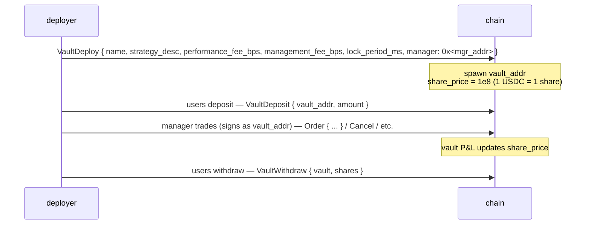
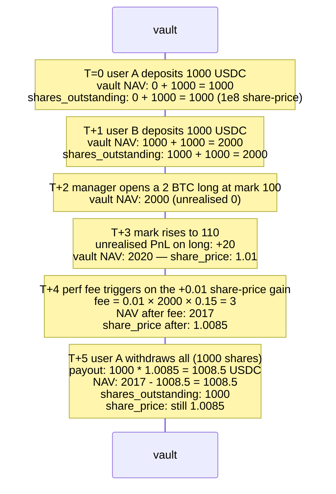

# Хранилища

:::info
**Работает в devnet.** Полный жизненный цикл хранилища — создание, пополнение, вывод,
перевод, распределение, изменение — реализован и протестирован в devnet.
Сквозные тесты консенсуса ещё дополняются.
:::

## Кратко

Две семьи хранилищ: управляемое протоколом **MFlux Vault** (страховой/резервный пул) и **пользовательские хранилища** (стратегии, разворачиваемые сообществом, куда можно вносить средства). Оба используют одну и ту же модель ценообразования долей: пополнения выпускают доли по текущей `share_price`; выводы сжигают доли по текущей `share_price`.

## MFlux Vault

Собственный пул протокола. Выполняет три функции:

1. **Резервный контрагент**: когда ликвидация T3 передаёт позицию протоколу, MFlux Vault принимает эту позицию и любые остаточные убытки.
2. **Маркет-мейкинг (в планах)**: свободный капитал MFlux может направляться в стратегии маркет-мейкинга на выбранных рынках.
3. **Страхование**: хранит резервы для социализации небольших убытков без активации T4 ADL.

### Пополнение MFlux Vault

```json
{
  "type": "VaultDeposit",
  "params": {
    "vault":       "<mflux_vault_addr>",
    "amount":   "1000000000"
  }
}
```

В следующем блоке начисляет депозитору `amount / share_price × 10^8` долей.

### Вывод средств

```json
{
  "type": "VaultWithdraw",
  "params": {
    "vault":       "<mflux_vault_addr>",
    "shares":   "100000000000"
  }
}
```

Сжигает `shares` долей; в следующем блоке выплачивает `shares × share_price / 10^8` USDC.

### Период блокировки

MFlux Vault имеет период блокировки по умолчанию `24 ч` с момента пополнения до первого допустимого вывода. Блокировка применяется к каждой доле; вывод по долям старше 24 ч не ограничен.

Это предотвращает ситуацию, когда капитал вносится непосредственно перед известным событием T3 и выводится сразу после социализации убытка (проблема «безбилетника»).

### Доходность и комиссии

MFlux Vault взимает:
- **Комиссия за управление**: 0 б.п. (управляющего нет — пул управляется протоколом).
- **Комиссия с прибыли**: 0 б.п.
- **Комиссия за вывод**: 0 б.п.

Доходность рассчитывается за вычетом убытков резервного пула T3 плюс прибыль маркет-мейкеров T1/T2. Исторический график цены доли доступен в запросе `vault_state` в реальном времени (см. [`/info`](../api/rest/info.md#vault_state)).

## Пользовательские хранилища

Любой желающий может развернуть хранилище, которое аккумулирует USDC и реализует стратегии под подписью назначенного управляющего.

### Жизненный цикл



Адрес хранилища — полноценный аккаунт в машине состояний: у него есть собственные позиции, баланс и ордера. Управляющий подписывает сделки **от имени хранилища** (адрес хранилища является `sender`, ключ управляющего подписывает; допуск проходит через тот же механизм подтверждения агентов, что и обычные кошельки агентов).

### Развёртывание

```json
{
  "type": "VaultDeploy",
  "params": {
    "name":                 "Yield Arb Strategy",
    "description":          "Funding-rate arbitrage",
    "manager":              "0x<mgr>",
    "performance_fee_bps":  1500,
    "management_fee_bps":   100,
    "lock_period_ms":       86400000,
    "high_water_mark":      true
  }
}
```

| Поле | Диапазон | Примечания |
|-------|-------|-------|
| `performance_fee_bps` | `[0, 3000]` | Комиссия с положительной доходности сверх предыдущего максимума (high-water mark) |
| `management_fee_bps` | `[0, 500]` в год | Взимается независимо от доходности |
| `lock_period_ms` | `[0, 30 days]` | Блокировка для каждого отдельного пополнения |
| `high_water_mark` | bool | Если true, комиссия с прибыли взимается только с новых максимумов |

### Ценообразование

```
share_price(t) = vault_account_value(t) / total_shares(t) × 10^8
```

`vault_account_value` включает нереализованный PnL по открытым позициям.

Цена обновляется при каждом коммите. Пополнения выпускают доли по цене **после коммита** (цена предыдущего блока не применяется); выводы сжигают доли по цене после коммита.

### Механизм комиссий

Комиссия с прибыли начисляется на адрес, указанный управляющим, при каждом тике цены доли выше предыдущего high-water mark:

```
on every commit:
    if share_price > high_water_mark:
        gain     = (share_price - high_water_mark) * shares_outstanding
        perf_fee = gain * performance_fee_bps / 1e4
        accrue perf_fee to manager (paid as vault → manager USDC)
        high_water_mark = share_price
```

Комиссия за управление выплачивается поблочно линейно:

```
mgmt_per_block = management_fee_bps / 1e4 / (blocks_per_year)
```

Обе комиссии вычитаются из NAV хранилища до расчёта цены доли — цена доли уже отражает уплаченные комиссии.

### Риски

Пользовательские хранилища могут нести убытки. Если NAV хранилища ≥ обязательства + 1 базовая единица, выводы исполняются по текущей цене доли. При падении ниже этого уровня хранилище **приостанавливается**, и выводы ставятся в очередь до восстановления NAV (возможно, путём закрытия убыточных позиций управляющим).

Хранилище, достигшее уровня T3 (собственный ярус ликвидации), следует лестнице [ярусной ликвидации](./tiered-liquidation.md). T4 ADL по хранилищу снижает цену доли, что затрагивает депозиторов.

Адрес хранилища существует в блокчейне бессрочно; даже пустое хранилище остаётся (оплаченное хранилище не подлежит освобождению в V1).

### Запрос данных

```bash
curl -X POST https://devnet-gateway.mtf.exchange/info \
  -d '{"type":"vault_state","vault":"0x<vault>"}'
```

```json
{
  "type": "vault_state",
  "data": {
    "vault":              "0x<addr>",
    "name":               "Yield Arb Strategy",
    "manager":            "0x<mgr>",
    "tvl":             "10000000000",
    "share_price":     "11500000",
    "depositor_count":    142,
    "high_water_mark": "11500000",
    "performance_fee_bps":1500,
    "management_fee_bps": 100,
    "lock_period_ms":     86400000,
    "your_shares":     "5000000000",
    "your_position_value": "575000",
    "your_withdrawable_at_ts": 1735690000000
  }
}
```

## Страховой пул

Часть MFlux Vault составляет **страховой пул** — выделенный резерв, который расходуется при резервных событиях T3. См. [ярусную ликвидацию](./tiered-liquidation.md#t3-backstop--netting-at-mark).

Когда страховой пул истощается, MFlux Vault автоматически пополняет его из общего пула (соотношение задаётся управлением, по умолчанию 10% от NAV MFlux резервируется как страховой пул).

## Пограничные случаи

<details>
<summary>Показать пограничные случаи</summary>

- **Смена управляющего.** Управляющего хранилища может заменить его создатель (или мультиподпись, если хранилище было развёрнуто через мультиподпись). Новый управляющий наследует все права подписи.
- **Управляющий перестаёт реагировать.** Существующие позиции остаются; автоматической торговли нет. Депозиторы по-прежнему могут выводить средства по цене доли (отражающей рыночную оценку этих позиций). Если позиции ликвидируются из-за движения цены, это ударяет по NAV.
- **Пополнение в ходе ликвидации.** Хранилище на уровне T0/T1 по-прежнему принимает пополнения (это хорошо — новый капитал может его спасти), если только управляющий не установил `accept_deposits` в `false`.
- **Математика блокировки.** Блокировка на 24 ч применяется к каждому пополнению отдельно. Два пополнения с разницей 6 ч разблокируются в разное время; отслеживайте каждое пополнение, если управляете потоками.
- **High-water mark и выводы.** Вывод части долей не сбрасывает HWM; управляющий по-прежнему получает комиссию с прибыли при следующем росте выше HWM, исходя из **оставшихся** долей.

</details>

## Последовательность — пополнение, торговля управляющего, вывод



## См. также

- [Ярусная ликвидация](./tiered-liquidation.md) — резервный пул T3, страховой пул
- [`POST /info vault_state`](../api/rest/info.md#vault_state)
- [`userEvents` WS](../api/ws/subscriptions.md#userevents) — события пополнения / вывода / комиссий хранилища передаются по этому каналу
- [Стейкинг](./staking.md) — отдельный механизм, не связанный с хранилищами

## FAQ

<details>
<summary>Показать FAQ</summary>

**В: Застрахованы ли пополнения в MFlux Vault?**
О: Нет. Они получают доход от резервной деятельности T1/T2 и поглощают убытки T3. При нормальных условиях чистая доходность положительная, при серьёзных стрессах — может быть отрицательной.

**В: Может ли хранилище держать активы не в USDC?**
О: Пользовательские хранилища V1 номинированы только в USDC. Хранилища спот-активов появятся в V2.

**В: Можно ли передавать доли хранилища?**
О: Нет — доли V1 не являются передаваемыми. Депозитор должен вывести средства, а получатель — внести их заново. В V2 возможно появление передаваемых токенов долей.

**В: Может ли управляющий вывести капитал хранилища на свой адрес?**
О: Нет. Управляющий обладает только полномочиями **торговли**, но не вывода средств. Вывод в пользу лиц, не являющихся депозиторами, требует явного управленческого решения на уровне хранилища (в V1 не предусмотрено).

</details>
