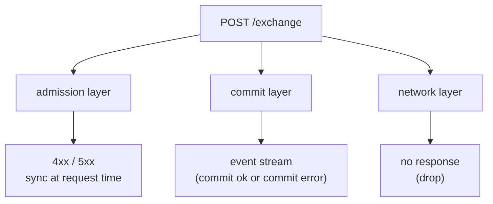
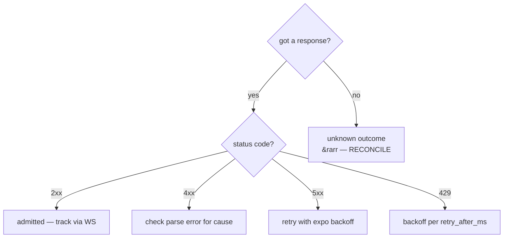
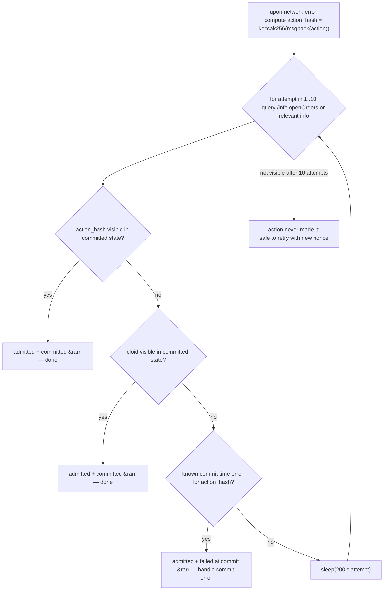

# Обработка ошибок

:::tip
**Стабильно.**
:::

Дерево решений для production-клиентов. Полный каталог строк ошибок находится в разделе [ошибки](../api/errors.md); эта страница объясняет, **что делать** с каждым классом ошибок.

## Три уровня сбоев



| Уровень | Момент срабатывания | Способ оповещения |
|---------|--------------------|--------------------|
| Admission | При запросе к `/exchange` | HTTP-статус + тело ответа |
| Commit | При фиксации блока, после admission | Push-уведомления WS через `userEvents` / `orderEvents`, либо видно в `userFills` / `openOrders` |
| Network | В любом месте | Ошибка TCP, таймаут, неполный ответ |

Каждый уровень имеет свою семантику. Путаница между ними — наиболее распространённая ошибка в production.

## Дерево решений



## Уровень 1 — ошибки admission

Запрос был разобран, но отклонён на этапе admission. Статус `400`, `401`, `404`, `405`, `422`.

| Класс | Примеры | Правило повтора |
|-------|---------|-----------------|
| **Ошибка клиента** | `400 invalid_msgpack`, `400 unknown_action_variant`, `400 missing_field` | НЕ повторять — исправить код |
| **Ошибка подписи** | `401 signer_not_sender`, `401 unknown_chainId` | НЕ повторять — проверить chainId / ключ / состояние агента |
| **Ошибка nonce** | `400 nonce_must_increase` | Увеличить nonce; повторить |
| **Логическая** | `422 price_not_tick_aligned`, `422 reduce_only_would_grow` | Вычислить правильное значение; повторить |
| **Состояние** | `422 liquidation_tier_blocks_action`, `422 insufficient_balance` | Пополнить счёт / дождаться смены тира; повторить |
| **Состояние авторизации** | `401 agent_not_yet_effective` | Подождать один блок; повторить |
| **Не найдено** | `404 order_not_found`, `404 account_not_found` | Не повторять; проверить ресурс |

```typescript
async function handleAdmissionResponse(r: Response) {
  if (r.status === 202) return { admitted: true };

  const body = await r.json();
  switch (r.status) {
    case 400:
      // client bug — log loudly, do not retry
      throw new ClientBugError(body.error);

    case 401:
      // signing — depends on the cause
      if (body.error === 'agent not yet effective') {
        // wait + retry
        await sleep(200);
        return { admitted: false, retry: true };
      }
      throw new AuthError(body.error);

    case 422:
      // logical — caller can correct and retry
      throw new LogicalError(body.error);

    case 429:
      await sleep(body.retry_after_ms);
      return { admitted: false, retry: true };

    case 503:
      await sleep(body.retry_after_ms);
      return { admitted: false, retry: true };

    default:
      throw new UnknownError(`${r.status}: ${body.error}`);
  }
}
```

## Уровень 2 — ошибки commit

Действие было допущено (`202`), но завершилось сбоем на этапе commit. Об этом можно узнать только через поток событий.

| Ошибка | Причина | Повторить? |
|--------|---------|------------|
| `reduce_only_violation_post_admit` | Позиция изменилась между admit и dispatch | ДА, если намерение по-прежнему актуально |
| `stp_rejected` | Ордер был отклонён механизмом защиты от самоторговли | НЕТ — другой ордер того же пользователя совпал первым |
| `mark_price_band_violation` | Цена ордера слишком далека от mark-цены на момент dispatch | НЕТ — переоценить цену и выставить заново |
| `evicted_under_cap_pressure` | Допущен, но вытеснен из мемпула до включения в блок | ДА (с задержкой) |
| `liquidation_pre_empted` | Аккаунт перешёл в T1+ между admit и dispatch | НЕТ — сначала восстановить маржу |

Подпишитесь на [`userEvents` WS](../api/ws/subscriptions.md#userevents) (события жизненного цикла ордеров передаются по этому каналу) и обрабатывайте по типу события:

```typescript
ws.subscribe('orderEvents', { user: address }, (event) => {
  switch (event.data.kind) {
    case 'resting':       /* order is on the book; track oid */            break;
    case 'partialFill':   /* size partially filled; cloid still on book */ break;
    case 'filled':        /* fully filled; remove from open-order set */   break;
    case 'cancelled':     /* terminal */                                   break;
    case 'error':         /* commit-time error; handle per table above */
      handleCommitError(event.data);
      break;
  }
});
```

## Уровень 3 — сетевые ошибки

Наиболее неоднозначный класс. Получил ли сервер запрос? Было ли действие зафиксировано?

| Симптом | Действие |
|---------|----------|
| TCP RST до получения ответа | Выверка: запросить состояние для определения результата |
| Таймаут ответа (задаётся вами) | То же — выверка |
| Частичный / усечённый ответ | То же — выверка |
| Отказ в подключении | Сервер недоступен; повторить с экспоненциальной задержкой |
| Ошибка DNS | Проблема сети / DNS; повторить с экспоненциальной задержкой |

### Паттерн выверки



Паттерн cloid-on-orders (см. [идемпотентность](./idempotency.md)) делает это недорогим: запросите открытые ордера и проверьте, есть ли там ваш cloid.

Для действий, не связанных с ордерами, сопоставляйте по `action_hash` (детерминированно вычисляется из локального msgpack-кодирования). Поток `userEvents` WS включает `action_hash` в каждом событии.

## Рецепты для production

### Выставление ордера с повтором

```typescript
async function placeOrderSafely(client: Client, order: Order, maxAttempts = 3) {
  const cloid = '0x' + randomBytes(16).toString('hex');
  let lastNonce = Date.now();

  for (let attempt = 1; attempt <= maxAttempts; attempt++) {
    try {
      const res = await client.exchange.order({ ...order, cloid }, { nonce: lastNonce });
      return res;
    } catch (e) {
      if (e instanceof NetworkError) {
        // reconcile via cloid
        const placed = await client.info.findOpenOrderByCloid(client.address, cloid);
        if (placed) return placed;

        // bump nonce and retry
        lastNonce = Date.now();
        continue;
      }
      if (e instanceof RateLimitError) {
        await sleep(e.retryAfterMs);
        lastNonce = Date.now();
        continue;
      }
      throw e;  // client / signing / logical bug — propagate
    }
  }
  throw new Error('order failed after retries');
}
```

### Отмена с идемпотентной защитой

```typescript
async function cancelSafely(client: Client, asset: number, oid: number) {
  try {
    return await client.exchange.cancel({ asset, oid });
  } catch (e) {
    if (e.body?.error === 'order not found') return { alreadyDone: true };
    if (e instanceof NetworkError) {
      // re-query the order
      const orders = await client.info.openOrders(client.address);
      if (!orders.find(o => o.oid === oid)) return { alreadyDone: true };
      // it's still there — actually retry
      return cancelSafely(client, asset, oid);
    }
    throw e;
  }
}
```

### Выверка commit через WS

```typescript
const pendingByHash = new Map<string, PendingAction>();

ws.subscribe('userEvents', { user: address }, (event) => {
  const hash = event.data.action_hash;
  const pending = pendingByHash.get(hash);
  if (!pending) return;

  if (event.data.kind === 'error') pending.reject(new CommitError(event.data));
  else                              pending.resolve(event.data);
  pendingByHash.delete(hash);
});

async function submit(action: Action) {
  const hash = keccak256(msgpack(action));
  const p = new Promise((resolve, reject) => pendingByHash.set(hash, { resolve, reject }));
  await client.exchange.submit(action);
  return Promise.race([p, timeout(5000)]);
}
```

## Граничные случаи

<details>
<summary>Показать граничные случаи</summary>

- **Шлюз вернул 5xx, но действие фактически было зафиксировано.** Может произойти, если ответ шлюза после admit был потерян. Обрабатывайте как сетевую потерю: выверяйте по cloid/action_hash.
- **Поток WS отстаёт от реального состояния.** Буфер восстановления мог вытеснить события в процессе переподключения. При возобновлении сделайте повторный опрос `/info` для синхронизации; используйте WS только для актуальных событий.
- **Один и тот же nonce отправлен дважды — один раз успешно.** Сервер обеспечивает монотонность nonce; второй запрос получит `nonce_too_small`, что сигнализирует о том, что первый запрос активен. Используйте этот сигнал.
- **Отложенные логические ошибки.** Ордер типа `Trigger`, который допускается сегодня, но никогда не срабатывает, потому что условие триггера никогда не выполняется. Ошибки нет — просто открытый ордер, который висит. Периодически сверяйте свой набор открытых ордеров с ожидаемым набором вашего бота.

</details>

## Смотрите также

- [Ошибки](../api/errors.md) — полный каталог
- [Идемпотентность](./idempotency.md) — механика nonce и cloid
- [WS-подписки](../api/ws/subscriptions.md) — события на этапе commit
- [Лимиты запросов](../api/rate-limits.md) — управление интервалами повторов

## FAQ

<details>
<summary>Показать FAQ</summary>

**Q: Следует ли обрабатывать ошибки commit-времени как исключения или как данные?**
A: Как данные. Это обычные исходы ордеров — `cancelled` из-за STP, `error` из-за нарушения reduce-only после admit. Логируйте и обрабатывайте согласно бизнес-логике; не допускайте аварийного завершения на них.

**Q: Есть ли смысл игнорировать ошибку admission?**
A: Для чисто идемпотентных сценариев (отмена несуществующего ордера) `404` можно проглотить. В остальных случаях логируйте на уровне INFO+ и либо повторяйте, либо уведомляйте оператора.

**Q: Как ограничить количество повторов?**
A: Используйте бюджет по стенным часам на каждую логическую операцию. Для выставления ордера 5 секунд — достаточно щедро; для отмены — 2 секунды. Если лимит превышен, уведомите оператора или систему контроля рисков.

</details>
