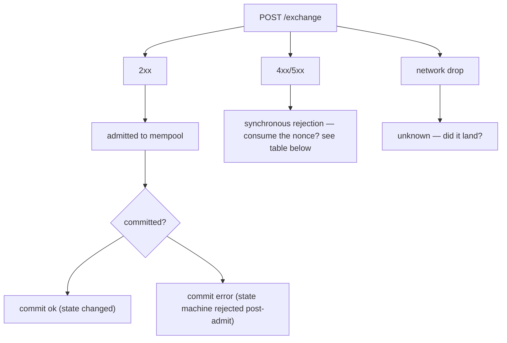
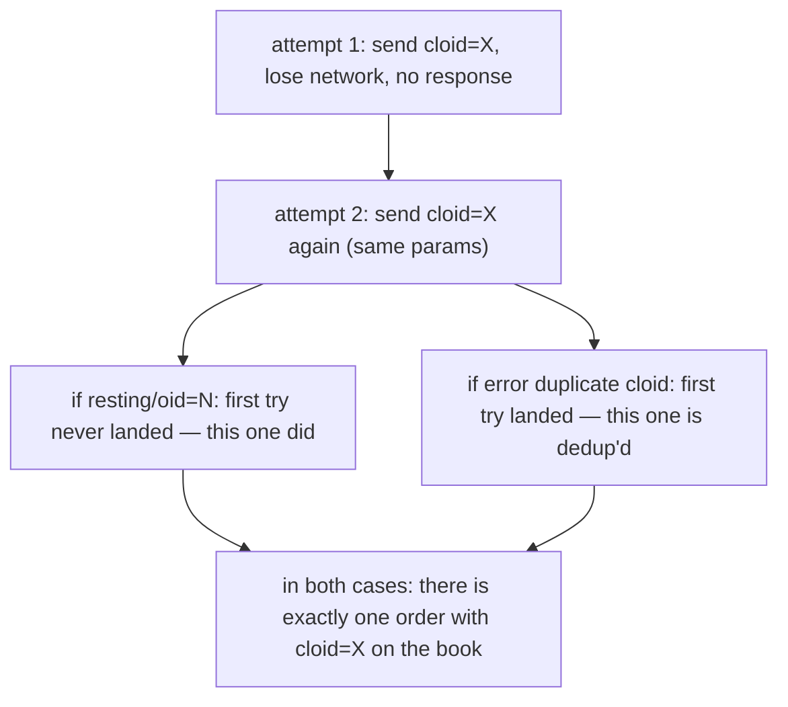
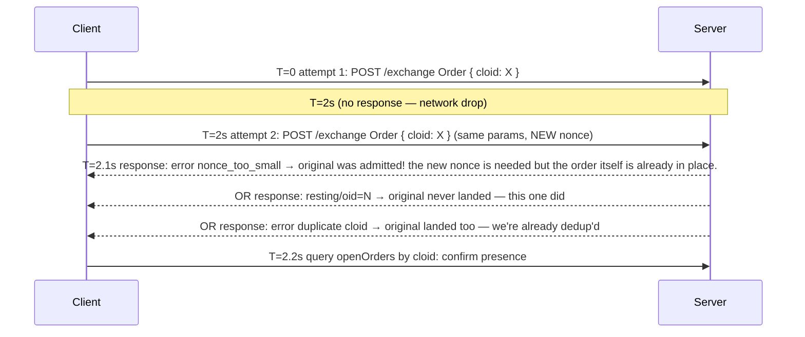

# Идемпотентность

:::tip
**Стабильно.**
:::

Как безопасно повторять запросы, не расходуя нонсы дважды и не дублируя ордера.

## TL;DR

- У каждого действия есть `nonce`. Повторное использование одного нонса возвращает `400 nonce_must_increase`.
- Устанавливайте уникальный `cloid` для каждого `Order` / `ModifyOrder`; сервер отклоняет дублирующий `cloid` в рамках одного аккаунта, поэтому повтор запроса безопасен.
- Для действий, не связанных с ордерами, **конечный автомат** по своей природе идемпотентен (отмена несуществующего ордера безвредна; перевод контролируется проверкой баланса).
- Модель сетевых ошибок делится на три класса — синхронное отклонение, ошибка при фиксации, потеря сетевого пакета — каждый требует своей стратегии повтора.

## Три класса ошибок



## Расход нонсов

| Исход | Нонс израсходован? | Безопасен повтор? |
|-------|:------------------:|:-----------------:|
| `202 admitted` | ДА | НЕТ — приведёт к дублированию |
| `400 nonce_must_increase` | НЕТ (уже устарел) | НЕТ — отправьте с бо́льшим нонсом |
| `400 invalid_msgpack` / другие ошибки разбора | НЕТ | ДА — исправьте и отправьте с тем же нонсом |
| `401 signer_*` | НЕТ | НЕТ — пока не устранена проблема подписи; нонс не потрачен |
| `422 reduce_only_violation` и другие логические ошибки на этапе приёмки | НЕТ | ДА — после устранения логической ошибки |
| `429 rate_limit` | НЕТ | ДА — после паузы `retry_after_ms` |
| `503 mempool_full` | НЕТ | ДА — после паузы `retry_after_ms` |
| Потеря пакета (нет ответа) | НЕИЗВЕСТНО | СВЕРЬТЕ СОСТОЯНИЕ — см. [сверка после потери пакета](#reconcile-after-network-drop) ниже |

Правило: **если на запрос получен ответ сервера → решение по нонсу принято**. Потеря сетевого пакета — единственный неоднозначный случай.

## Стратегия: cloid

Для размещения ордеров идентификатор ордера на стороне клиента — наиболее надёжный инструмент дедупликации.

```typescript
const cloid = crypto.randomBytes(16);  // 16 bytes

await client.order({
  asset: 0, side: 'Buy', priceE8: '...', sizeE8: '...',
  tif: 'Gtc', cloid: '0x' + cloid.toString('hex'),
});
```

Сервер возвращает:

| Ответ сервера | Значение |
|---------------|----------|
| `{"resting":{"oid":N,"cloid":"0x..."}}` | Ордер выставлен, дедупликация подтверждена |
| `{"error":"duplicate cloid"}` | Предыдущий запрос с тем же cloid был принят; **ордер уже находится в стакане**. Найдите его по cloid. |
| `{"error":"<other>"}` | Эта попытка не удалась; можно повторить с новым или тем же cloid |

Правило повтора для ордеров: **одинаковый cloid + одинаковые параметры** — идемпотентно на всём пути. Если первая попытка прошла, вторая получит `duplicate cloid`, и вы будете знать, что исходный ордер на месте.



Та же логика применима к `ModifyOrder` — установите новый cloid для изменения, чтобы обеспечить дедупликацию изменения.

## Стратегия: идемпотентность конечного автомата

Большинство действий, не связанных с ордерами, идемпотентны на уровне конечного автомата:

| Действие | Идемпотентно? | Причина |
|----------|:-------------:|---------|
| `Cancel` | да | Отмена несуществующего или уже отменённого ордера возвращает `{"error":"order not found"}` — безвредно |
| `CancelByCloid` | да | Аналогично |
| `UpdateLeverage` | да | Установка текущего значения кредитного плеча — операция без эффекта |
| `UpdateMarginMode` | да | Аналогично |
| `UserPortfolioMargin` | да | Аналогично |
| `ApproveAgent` | да | Те же данные одобрения перезаписывают существующую запись |
| `UsdcTransfer` | НЕТ | Каждый раз переводит новую сумму |
| `WithdrawUsdc` | НЕТ | Аналогично |
| `Delegate` / `Undelegate` | НЕТ | Каждый вызов добавляется в очередь действий |

Для НЕ-идемпотентных действий используйте один из вариантов:
- **Нонс как ключ дедупликации**: отслеживайте отправленные нонсы, никогда не отправляйте один нонс дважды. Сервер в любом случае это обеспечивает.
- **Внешняя таблица дедупликации**: ведите карту `{request_id → nonce}`; если при повторе для данного request_id уже существует нонс, запрос уже был отправлен.

## Сверка после потери сетевого пакета {#reconcile-after-network-drop}

Если ответ потерян (TCP закрыт, таймаут и т.п.), неизвестно, было ли действие зафиксировано. Выполните сверку:

### Для ордеров

Запросите по cloid:

```bash
curl -X POST $BASE/info \
  -d '{"type":"openOrders","user":"0x..."}' | jq '.[] | select(.cloid == "0x<cloid>")'
```

Если присутствует → принят; считайте успехом.
Если отсутствует → проверьте `userFills` на предмет исполнения по этому cloid.
Если всё равно отсутствует → приёмка не прошла (или был вытеснен из мемпула). Отправьте снова с тем же cloid.

### Для переводов / снятий средств

Запросите `userFills` аккаунта (включает финансирование и переводы) или `block_info` в промежутке времени около момента потери. Сопоставьте по action_hash, вычисленному локально — каждое действие имеет детерминированный хеш независимо от результата приёмки.

```typescript
const actionHash = keccak256(msgpack(action));
// search for events with this action_hash in WS history or info queries
```

Если определить исход невозможно:
- **Для идемпотентного действия**: повторите безопасно (используйте новый нонс, так как старый мог уже быть потрачен).
- **Для не-идемпотентного действия**: приостановитесь; запросите состояние аккаунта, чтобы убедиться, произошёл ли побочный эффект; возобновляйте только при полной уверенности.

## Последовательность — повтор с cloid после таймаута



Комбинация cloid и серверных проверок делает повтор безопасным даже при ненадёжной сети.

## Диагностика проблем с нонсами

| Симптом | Причина | Решение |
|---------|---------|---------|
| `nonce_must_increase` на каждый запрос | Расхождение локальных часов (использование `Date.now()`) | Синхронизируйте часы; или используйте монотонный счётчик |
| Конфликт нонсов между двумя скриптами | Использование одного аккаунта | Используйте общий сервис нонсов или отдельный скрипт для каждого аккаунта |
| `nonce_too_small` после переподключения | Счётчик нонсов сброшен до значения до потери пакета | Сохраняйте последний отправленный нонс между перезапусками |

## См. также

- [`POST /exchange`](../api/rest/exchange.md) — полный конверт запроса, включая `nonce`
- [Ошибки](../api/errors.md) — все строки ошибок и способы устранения
- [Обработка ошибок](./error-handling.md) — дерево решений: приёмка vs фиксация vs сеть
- [Ограничения скорости](../api/rate-limits.md) — выдерживайте паузы между повторами

## FAQ

<details>
<summary>Показать FAQ</summary>

**В: Что использовать — `Date.now()` или счётчик?**
О: `Date.now()` подходит для однопроцессных клиентов. Для многопроцессных клиентов на одном аккаунте используйте общий монотонный счётчик (например, Redis `INCR`), чтобы два экземпляра не конфликтовали.

**В: Что если нужно намеренно повторить идемпотентное действие?**
О: Используйте тот же `cloid` (для ордеров) и новый `nonce`. Сервер обеспечивает дедупликацию через cloid; нонс просто поддерживает корректность передачи.

**В: Можно ли повторно использовать cloid после отмены или исполнения исходного ордера?**
О: Нет. Cloid уникальны в рамках аккаунта навсегда. Для каждого нового ордера используйте новый cloid.

**В: Даёт ли WS-поток подтверждение на момент фиксации, пригодное для сверки?**
О: Да. Подпишитесь на `userEvents` и сопоставляйте по `action_hash` или `cloid`. WS-поток — рекомендуемый способ подтверждения состояния фиксации при повторах.

</details>
