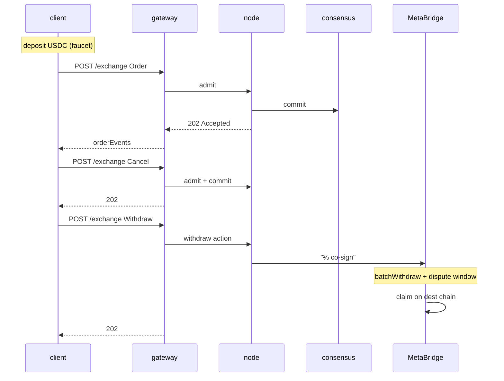

# Быстрый старт — полный цикл за 5 минут

:::info
**Статус.** **Стабильная** поверхность API. Эндпоинты Devnet, без гарантий для mainnet.
:::

Пополнение счёта, выставление ордера, отмена, вывод средств. К концу этой страницы ваша сессия TypeScript / Python / curl совершит полный круговой рейс против devnet.

## Требования

- Приватный ключ EVM (любые 32 байта в hex-формате; для devnet сгенерируйте новый — не используйте повторно ключ от mainnet)
- USDC в исходной сети MetaBridge (Base; Solana и Arbitrum в процессе подключения) — в devnet вместо этого доступен маршрут через фасет
- `curl` или любой HTTP-клиент

## Эндпоинты

Шлюз является единственной публичной точкой входа и обслуживает MTF-нативную поверхность.

| Сервис | URL (devnet) |
|---------|--------------|
| Шлюз (точка входа) | `https://api.devnet.mtf.exchange` |
| MTF-нативный | `POST /info` · `POST /exchange` · `GET /ws` |
| EVM JSON-RPC | `POST /evm` |
| Фасет (devnet) | `POST /faucet` |
| Обозреватель | `https://app.mtf.exchange/explorer` |

> Фасет — **не** отдельный сервис, это маршрут `POST /faucet` на шлюзе.
> Запускаете собственный узел? Та же нативная поверхность
> (`/info` · `/exchange` · `/ws` · `/faucet`) доступна напрямую по адресу
> `http://localhost:8080`. См. [`POST /faucet`](../api/rest/faucet.md).

Полный список сетей, включая testnet и (после запуска) mainnet, см. в разделе [Сети](../networks.md).

## Шаг 1 — Получить USDC в devnet

```bash
curl -X POST https://api.devnet.mtf.exchange/faucet \
  -H 'content-type: application/json' \
  -d '{"address":"0x<YOUR_ADDRESS>"}'
# -> {"address":"0x…","usdc":3000,"mtf":10,"status":"queued"}
```

Одно обращение выдаёт **3000 USDC** в качестве кросс-залогового обеспечения **и 10 MTF** спот-токенов —
**по одному разу на адрес** (повторное обращение вернёт `429 address already funded`),
с ограничением 1 запрос / минута / IP. Необязательный параметр `amount` позволяет лишь *снизить* размер выплаты USDC
(≤ 3000); количество MTF фиксировано. Выплата переходит в статус `"queued"` — она зачисляется примерно через 1 блок,
поэтому перед проверкой баланса подождите немного:

Приведённые ниже примеры curl используют **MTF-нативный** формат на шлюзе
(snake_case-типы вроде `account_state` / `open_orders`). Примеры на `@metaflux/sdk`
используют ту же нативную поверхность — SDK просто собирает подписанный конверт за вас.

```bash
curl -X POST https://api.devnet.mtf.exchange/info \
  -H 'content-type: application/json' \
  -d '{"type":"account_state","address":"0x<YOUR_ADDRESS>"}'
```

В ответе должно быть `data.account_value: "3000"`.

## Шаг 2 — Выставить лимитный ордер

Полная процедура подписания описана в разделе [Подписание](./signing.md). В этом руководстве используется официальный TypeScript SDK (`@metaflux/sdk` — выйдет до mainnet; см. [TypeScript SDK](./typescript-sdk.md)).

```typescript
import { MetaFluxClient } from '@metaflux/sdk';

const client = new MetaFluxClient({
  privateKey: process.env.PRIVATE_KEY!,
  baseUrl:    'https://api.devnet.mtf.exchange', // MTF-native is the gateway default path
  chainId:    31337,
});

const meta = await client.info.meta();
const btcId = meta.universe.findIndex(m => m.name === 'BTC');

const result = await client.exchange.order({
  asset:    btcId,
  isBuy:    true,
  price:    '50000',
  size:     '0.1',
  tif:      'Gtc',
  reduceOnly: false,
});

console.log('order id:', result.oid);
```

Пример через curl (MTF-нативный формат — подпись формируете самостоятельно; см. [Подписание](./signing.md)):

```bash
curl -X POST https://api.devnet.mtf.exchange/exchange \
  -H 'content-type: application/json' \
  -d @order.json
```

где `order.json` — собранный вами подписанный конверт в формате MTF-native.

### Пример спот-торговли

[Спот](../products/spot.md) — это CLOB формата токен-в-токен, отдельный от
бессрочных контрактов: без кредитного плеча, без позиций. Выставьте спот-ордер с помощью нативного
действия [`spot_order`](../api/rest/exchange.md#spot_order): оно принимает **идентификатор спот-пары**
(не `market` бессрочного контракта), `side`, `limit_px`, `size` и `tif`. Висящий ордер `gtc`/`alo`
блокирует зарезервированный баланс в эскроу; `ioc` никогда не остаётся в стакане.

```jsonc
// the `action` you sign and POST to /exchange (sender-authorized, no `owner`)
{
  "type": "spot_order",
  "order": {
    "pair":     200,           // spot pair id from /info, not a perp market id
    "side":     "bid",         // bid = buy base (pays quote); ask = sell base
    "size":     100000000,
    "limit_px": 200000000,     // a limit is required — market spot is not yet supported
    "tif":      "gtc",
    "stp_mode": "cancel_oldest"
  }
}
```

Синхронный ответ содержит присвоенный `oid` со статусом `resting` или `filled`
(то же объединение статусов, что и у ордера на бессрочный контракт). Спот-балансы и открытые
спот-ордера можно запросить через [`POST /info`](../api/rest/info.md); отмена выполняется через
[`spot_cancel`](../api/rest/exchange.md#spot_cancel) — средства из эскроу возвращаются.

## Шаг 3 — Убедиться, что ордер стоит в книге

```bash
curl -X POST https://api.devnet.mtf.exchange/info \
  -H 'content-type: application/json' \
  -d '{"type":"open_orders","address":"0x<YOUR_ADDRESS>"}'
```

В ответе должен быть ваш ордер с `oid` из шага 2.

Или подпишитесь на обновления в реальном времени (предпочтительно для любого нетривиального использования):

```typescript
const ws = client.ws();
ws.subscribe('userEvents', { user: client.address }, (event) => {
  console.log('event:', event);
});
```

## Шаг 4 — Отменить ордер

```typescript
await client.exchange.cancel({ asset: btcId, oid: result.oid });
```

```bash
# raw curl
curl -X POST https://api.devnet.mtf.exchange/exchange \
  -d @cancel.json
```

## Шаг 5 — Вывести средства

```typescript
await client.exchange.withdrawUsdc({
  amount:           '100',
  destinationChain: 'Arbitrum',
  destinationAddr:  '0x<DESTINATION>',
});
```

Это ставит вывод через MetaBridge в очередь. После того как набор валидаторов MetaFlux совместно подпишет транзакцию до достижения кворума ⅔ взвешенной доли стейка и истечёт период оспаривания (несколько минут), можно выполнить `claim` в сети назначения (см. [мост](../bridge/)).

## Что только что произошло



## Следующие шаги

- [Подписание](./signing.md) — что скрыто внутри подписания в SDK
- [Кошельки-агенты на практике](./agent-wallets-howto.md) — продакшн-паттерн с горячим ключом
- [Типы ордеров](../concepts/order-types.md) — за пределами обычных лимитных ордеров
- [Обработка ошибок](./error-handling.md) — admission vs commit vs сеть
- [WS-подписки](../api/ws/subscriptions.md) — push-уведомления для данных в реальном времени
- [Миграция с HL](./migrating-from-hl.md) — уже есть HL-бот? Сначала прочитайте эту страницу

## Устранение неполадок

<details>
<summary>Показать устранение неполадок</summary>

| Симптом | Вероятная причина | Решение |
|---------|--------------|-----|
| `401 signer is not the sender` | Неверный `chainId` | Используйте `31337` для devnet |
| `400 invalid msgpack` | Кодировщик переставляет ключи в map | Используйте стандартно-совместимую библиотеку msgpack |
| `404 unknown user` при запросе info | У адреса ещё нет состояния on-chain | Сначала пополните счёт (фасет) |
| `429 rate limit` | Слишком много запросов | См. [ограничения частоты запросов](../api/rate-limits.md); сделайте паузу |
| Вывод застрял в сети назначения | Вывод через MetaBridge ожидает обработки (период оспаривания) | Дождитесь совместной подписи ⅔ и истечения периода оспаривания; затем выполните `claim` в сети назначения (см. [мост](../bridge/)) |

</details>

## Смотрите также

- [Сети](../networks.md) — эндпоинты и chainId для devnet / testnet / mainnet
- [Подписание](./signing.md) — полная спецификация конверта
- [`POST /exchange`](../api/rest/exchange.md)
- [`POST /info`](../api/rest/info.md)
- [WS](../api/ws/index.md)
