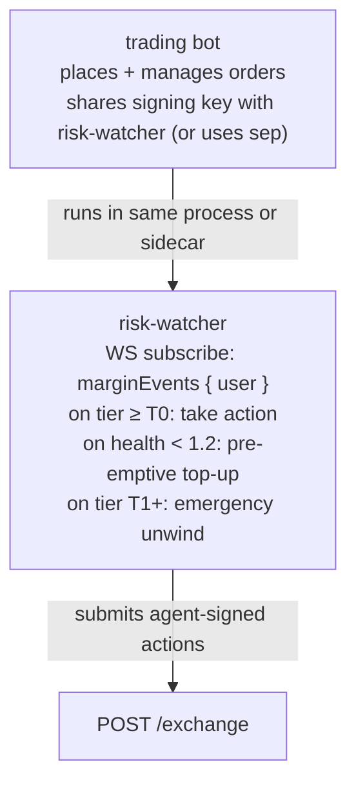

# Паттерн «наблюдатель за риском»

:::tip
**Стабильно.**
:::

Наблюдатель за риском (risk-watcher) — это автоматизированный процесс, который отслеживает состояние вашего счёта и вмешивается — пополняя маржу, сокращая позицию или торгуя в защитном режиме — прежде чем протокол запустит против вас [ступенчатую ликвидацию](../concepts/tiered-liquidation.md).

Производственные торговые боты, держащие позиции на ночь, обязаны его запускать. Жёлтая карточка T0 протокола даёт вам один блок (~100 мс); наблюдатель использует этот блок продуктивно.

## Кратко

Подпишитесь на `marginEvents`, реагируйте на переходы между уровнями, пополняйте маржу через `UpdateIsolatedMargin` (изолированный режим) или `Deposit` (кросс-режим) до того, как `maint_margin` станет критическим.

## Архитектура



Наблюдатель является отдельным логическим процессом даже при совместном размещении — его решения независимы от решений торговой стратегии. Распространённая ошибка — смешивать вопросы «стоит ли закрыть эту позицию?» и «стоит ли открыть эту сделку?»; наблюдатель отвечает только на первый.

## Источники данных

- WS-поток `marginEvents`: текущие `account_value`, `maint_margin`, `health`, `tier`.
- WS-поток `mark` (по каждому удерживаемому активу): для перспективной оценки.
- WS-поток `fundingTicks`: для прогнозирования почасовых платежей по ставке финансирования.

## Правила реагирования

| Триггер | Действие | Обоснование |
|---------|----------|-------------|
| `health < 1.5` и снижается на протяжении 5 последовательных выборок | Превентивный депозит до достижения health = 1.8 | Буфер перед T0 |
| Переход на уровень `T0` | Немедленный депозит ИЛИ частичное закрытие | Один блок до перехода в T1 |
| Переход на уровень `T1` | Экстренное закрытие позиции с наибольшим убытком | Опережение частичного закрытия по невыгодной цене |
| Платёж по ставке финансирования в следующую 1 минуту > 0,5 × free_collateral | Превентивный депозит | Плата за финансирование может перевести счёт в T0 |
| Mark-цена движется > 3× сигма за последний час за 30 с | Снимок позиций + уведомление оператора | Возможная смена режима |

Настройте пороги под свою стратегию. Агрессивные маркет-мейкеры: более жёсткие буферы (нижняя граница health 1,3). Консервативные книги: более мягкие (нижняя граница health 1,8).

## Набросок реализации (TypeScript)

```typescript
import { MetaFluxClient } from '@metaflux/sdk';

const trader = new MetaFluxClient({ /* trading agent */ });
const watcher = new MetaFluxClient({ /* dedicated watcher agent */ });

const TARGET_HEALTH = 1.8;
const T0_DEPOSIT_USDC = 1000;  // tune to position size

let recentSamples: number[] = [];

watcher.ws().subscribe('marginEvents', { user: trader.address }, async (event) => {
  const { health, tier, account_value, maint_margin } = event.data;

  recentSamples.push(health);
  if (recentSamples.length > 5) recentSamples.shift();

  // Tier-based reactions
  if (tier === 'T1') {
    console.log('[ALERT] T1 — emergency unwind');
    await emergencyUnwind(trader);
    return;
  }
  if (tier === 'T0') {
    console.log('[WARN] T0 — top up');
    await deposit(watcher, T0_DEPOSIT_USDC);
    return;
  }

  // Pre-emptive
  const allFalling = recentSamples.length === 5
    && recentSamples.every((h, i) => i === 0 || h < recentSamples[i-1]);
  if (allFalling && health < 1.5) {
    console.log('[INFO] pre-emptive top-up');
    const needed = Math.ceil((TARGET_HEALTH * maint_margin - account_value) / 1e6);
    await deposit(watcher, needed);
  }
});

async function deposit(c: MetaFluxClient, usdc: number) {
  // For Cross: assume USDC already in the master's free balance
  // For Isolated: use UpdateIsolatedMargin to add to the bucket
  await c.exchange.updateIsolatedMargin({
    asset: 0,
    isIsolated: true,
    isolatedAmount: (usdc * 1e6).toString(),
  });
}

async function emergencyUnwind(c: MetaFluxClient) {
  const state = await c.info.clearinghouseState();
  for (const pos of state.assetPositions) {
    // close the largest-loss position first
    await c.exchange.order({
      asset: pos.coin,
      isBuy: pos.szi < 0,    // opposite side closes
      price: '0',            // market (extreme price)
      size:  Math.abs(pos.szi).toString(),
      tif:   'Ioc',
      reduceOnly: true,
    });
  }
}
```

## Ключевые решения

- **Отдельный агент для наблюдателя.** Агент трейдера занимается торговлей; агент наблюдателя — управлением маржой. Компрометация торгового хоста не позволяет манипулировать маржой.
- **Полномочия наблюдателя.** Агенты могут отправлять `UpdateIsolatedMargin` и размещать/отменять ордера. Агенты НЕ МОГУТ выводить средства, поэтому наблюдатель не может перемещать средства со счёта — только между суб-бакетами. Это ожидаемое поведение.
- **Пространство nonce наблюдателя.** Наблюдатель и трейдер совместно используют пространство nonce мастер-счёта (см. [агентские кошельки](../concepts/agent-wallets.md)). Используйте `Date.now()` в обоих — риск коллизии составляет менее миллисекунды.

## Математика предварительного депозита

Чтобы поднять health с H₀ до целевого H₁:

```
needed_deposit = (H₁ - H₀) × maint_margin
```

Пример: maint = 10 USDC, текущий health 1,0, цель 1,5.
needed = (1,5 - 1,0) × 10 = 5 USDC.

Ограничьте размер депозита наблюдателя за один блок, чтобы не тратить слишком много при временном неблагоприятном режиме. Агрессивное значение по умолчанию: 1× номинал позиции, зарезервированный для пополнений; при исчерпании — эскалация к оператору.

## Последовательность — превентивное пополнение

```mermaid
sequenceDiagram
    Note over Watcher: T = 0  health = 1.6 (Safe)
    Note over Watcher: T = 1s  mark drops 1%; health = 1.4 → sample drop
    Note over Watcher: T = 2s  mark drops 0.5%; health = 1.3 → 2nd drop
    Note over Watcher: T = 3s  ... → 3rd
    Note over Watcher: T = 4s  ... → 4th
    Note over Watcher: T = 5s  health = 1.0 → 5 samples falling; pre-empt
    Note over Watcher: T = 5s  compute needed = (1.8 - 1.0) × maint = 0.8 × maint
    Watcher->>Exchange: T = 5.1s  submit UpdateIsolatedMargin deposit
    Exchange-->>Watcher: T = 5.2s  202 admitted
    Note over Exchange: T = 5.3s  commit; health = 1.8 → Safe
    Exchange-->>Watcher: T = 5.3s  marginEvents push: tier=Safe; reaction loop continues
```

## Сценарии отказов

- **Гонка наблюдателя и трейдера.** Трейдер открывает новую позицию; наблюдатель реагирует на позицию в процессе обработки. Решение: реагировать только после подтверждения (события маржи срабатывают при коммите, поэтому это уже обеспечено).
- **Истёк агент наблюдателя.** В момент стресса наблюдатель не может действовать. Меры защиты: жёсткий цикл ротации, мониторинг срока действия агента, никогда не допускать менее 24 часов до истечения.
- **Мемпул переполнен во время стресса.** Депозит наблюдателя получает ответ 503. Повтор с экспоненциальным джиттером; отправка не чаще одного раза в 100 мс.
- **Депозит успешен, но оракул остаётся неблагоприятным.** Депозит повышает account_value; если maint_margin также вырос (mark-цена движется против вас), health может не улучшиться достаточно. Цикл: повторная оценка после коммита; повторный депозит или закрытие позиции.

## Когда НЕ стоит использовать наблюдатель за риском

- Очень краткосрочные позиции (открытие и закрытие в пределах одного блока) — health не имеет значения.
- Чистая спот-торговля без маржи — ступенчатая ликвидация не применяется.
- Полностью изолированные однопозиционные боты, где вы явно приняли лимит потерь бакета — автоматизация пополнений нарушает изоляцию.

## См. также

- [Ступенчатая ликвидация](../concepts/tiered-liquidation.md) — лестница, от которой вы защищаетесь
- [`userEvents` WS](../api/ws/subscriptions.md#userevents) — переходы по марже/уровням проходят через этот канал
- [`update_isolated_margin`](../api/rest/exchange.md#update_isolated_margin)
- [Агентские кошельки](../concepts/agent-wallets.md) — наблюдатель требует собственного одобренного агента
- [Обработка ошибок](./error-handling.md) — логика повторных попыток при отправке депозита
