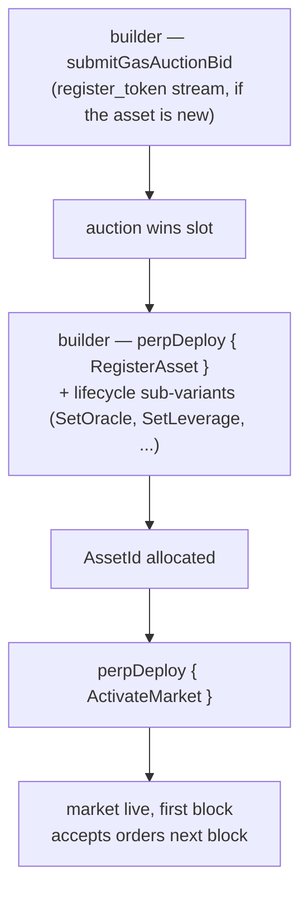

# MIP-3 — Развёртывание рынка бессрочных контрактов без разрешений

:::info
**Реализовано.**
:::

Любой разработчик может развернуть новый рынок бессрочных контрактов на MetaFlux, оплатив участие через аукцион газа на блокчейне. Здесь нет шлюза команды протокола, ревизионного комитета или белого списка. Единственными барьерами являются аукционная цена и минимальный депозит. (Развёртывание рынка **спот** без разрешений — смежное предложение [MIP-1](./mip-1.md).)

## Зачем это нужно

Это ключевое конкурентное преимущество. Централизованные биржи самостоятельно отбирают листинги; MetaFlux делает сам процесс листинга частью протокола. Разработчикам, которым нужен рынок для нишевого актива, не требуется ничьё разрешение — достаточно выиграть аукцион и предоставить начальные параметры.

Это адаптация MetaFlux дизайна беспрепятственного развёртывания рынков, впервые реализованного ведущими on-chain площадками бессрочных контрактов, со следующими соответствиями и изменениями:

- Три отдельных потока аукциона газа (`perp_deploy_gas_auction`, `spot_pair_deploy_gas_auction`, `register_token_gas_auction`) — аналогичная структура. Развёртывание perp — MIP-3; потоки спот обеспечивает [MIP-1](./mip-1.md).
- Параметры аукциона (затухание, окно возврата средств, интервал слота) настраиваются через управление протоколом
- Начальный коэффициент поддерживающей маржи, максимальное кредитное плечо, ограничение ставки финансирования — передаются вместе с заявкой на развёртывание и ограничены диапазонами, установленными управлением протоколом

## Процесс развёртывания



Развёртывание рынка бессрочных контрактов осуществляется через действие `perpDeploy`, которое принимает подварианты `PerpDeployKind`, охватывающие полный жизненный цикл рынка (8 подвариантов):

1. **`RegisterAsset`** — регистрация нового актива бессрочного контракта; выделяет `AssetId`. (Требует предварительной регистрации символа токена через поток `register_token_gas_auction`, если он ещё не зарегистрирован.)
2. **`SetOracle`** — привязка / ротация подмножества источников оракула для актива.
3. **`SetLeverage`** — установка максимального ограничения кредитного плеча.
4. **`SetFeeTier`** — установка уровня комиссий мейкера / тейкера (в базисных пунктах, ограничено лимитами на уровне рынка).
5. **`SetMakerRebate`** — установка скидки мейкера (в базисных пунктах, ≤ 2).
6. **`SetMinSize`** — установка минимального размера ордера для рынка.
7. **`ActivateMarket`** — активация рынка (открытие торгов; требует полной конфигурации).
8. **`DeactivateMarket`** — закрытие для новых ордеров (существующие позиции сохраняются).

Получение слота развёртывания происходит через аукцион газа: разработчик вызывает **`submitGasAuctionBid { auction_kind, bid_amount, ... }`** в соответствующем потоке. Каждая заявка содержит:
- Сумму в USDC, депонируемую при подаче и возвращаемую при проигрыше (за вычетом небольшой комиссии).
- Спецификацию рынка — начальное кредитное плечо, коэффициент поддерживающей маржи, параметры финансирования, конфигурацию источников оракула.

Аукционы завершаются на границах блоков — победителем каждого слота становится участник с наибольшей ставкой, уплаченная сумма сжигается (не перечисляется никому), а параметры спецификации становятся параметрами развёрнутого рынка.

## Эскроу и возврат ставок

Ставки удерживаются в эскроу в течение всего аукциона. При проигрыше ставка возвращается на счёт разработчика за вычетом небольшой аукционной комиссии. При выигрыше победившая сумма сжигается по закрытии слота (не перечисляется никому).

Активные ставки можно просмотреть через:

```json
POST /info { "type": "mip3_active_bids" }
```

## Границы параметров

Управление протоколом устанавливает границы, в рамках которых должны находиться параметры спецификации ставки:

- Начальное кредитное плечо в диапазоне `[1, max_leverage]` (по умолчанию `max_leverage = 50`)
- Коэффициент поддерживающей маржи ≥ `min_maintenance_ratio` (по умолчанию 1%)
- Ограничение ставки финансирования ≤ `max_funding_per_hour` (по умолчанию 0.5%)
- Источник оракула из утверждённого списка

Ставки с параметрами, выходящими за установленные границы, отклоняются при подаче.

## Параметры аукциона

Для каждого потока (perp / спот / регистрация токена) аукцион имеет следующие параметры:

- **Интервал слота** — периодичность завершения нового аукциона (задаётся управлением протоколом, по умолчанию 1 час)
- **Затухание** — темп снижения минимальной ставки при незанятом слоте (задаётся управлением протоколом, по умолчанию линейное в течение 24 ч)
- **Окно возврата средств** — срок, в течение которого проигравшие участники могут затребовать возврат после закрытия слота (задаётся управлением протоколом, по умолчанию 7 дней)

Все три параметра можно изменить через управление протоколом с помощью действия `SetGlobal` (глобальные параметры управления разработчиков MIP-3: `SetGasAuctionDuration`, `SetMinDeployStake`, `SetGasAuctionMinBid`, `SetDeployerFeeCap`, `SetPerMarketLimits`, `SetEnableMip3`).

## После развёртывания

Новый рынок появляется в каноническом реестре активов начиная со следующего блока. Обеспечение ликвидности — задача разработчика; протокол не предоставляет начальных ордеров.

Разработчики, как правило, создают глубину рынка, совмещая развёртывание по MIP-3 с источником ликвидности на том же рынке — [Металиквидность MIP-2](./mip-2.md), внешним маркет-мейкером, привлечённым скидками на комиссии разработчика, или созданным пользователем хранилищем.

## MIP-4

Подробнее об агрегаторе MetaFlux, дополняющем развёртывание без разрешений, см. в [MIP-4 — агрегатор / интернализатор ликвидности perp](mip-4.md).

## См. также

- [MIP-1 — стандарт спот-токенов + развёртывание рынка](./mip-1.md) — спот-аналог развёртывания без разрешений
- [Многоуровневая ликвидация](../concepts/tiered-liquidation.md) — применяется к рынкам, развёрнутым по MIP-3, так же как и к рынкам, включённым протоколом
- [Портфельная маржа](../concepts/portfolio-margin.md) — рынки MIP-3 подключаются к PM через стандартное включение в сценарий
