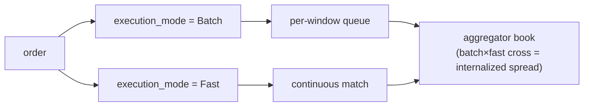

# MIP-4 — Агрегатор / интернализатор ликвидности для бессрочных контрактов

:::info
**Запланировано.** Ориентировано на V2; в область V1 mainnet не входит.
:::

MIP-4 — это **агрегатор / интернализатор ликвидности для бессрочных контрактов**, которым управляет MetaFlux, — оптовый посредник, поглощающий входящий поток ордеров за счёт собственной книги и получающий спред интернализации. Модель напрямую заимствована из структуры рынка акций, где единственный оптовик, обрабатывающий значительную долю розничного потока, ведёт наиболее прибыльное направление бизнеса. MIP-4 переносит этот паттерн на бессрочные контракты в сети.

## Зачем это нужно

Ось дифференциации на основе возможностей: вместо конкуренции за широту листинга (это задача [MIP-3](./mip-3.md)) MIP-4 конкурирует за качество исполнения розничного потока. Интернализуя поток против собственной рестинговой книги, агрегатор может рекуперировать спред, который иначе был бы выплачен в виде комиссий мейкера, — и вернуть часть этого пользователю в виде улучшения цены. Это тот же аргумент, что использует розничный брокер-оптовик: «лучшая цена, зачастую лучше топа книги».

Это естественным образом сочетается с розничным UI в стиле Robinhood, построенным поверх существующих клиентских SDK, — это продуктовый / фронтенд-уровень, а не протокол.

## Что это такое

Новый режим рынка и уровень протокола, который:

1. **Ведёт собственную книгу ордеров по каждому активу** — `BTC-AGG`, `ETH-AGG`, `SOL-AGG` и т. д. — параллельно с соответствующими рынками MIP-3 (`BTC`, `ETH`, `SOL`). Книга агрегатора отделена от канонического CLOB и имеет собственную структуру цен и глубины.
2. **Исполняет ордера в двух режимах**, выбираемых для каждого ордера через поле `execution_mode`:
   - **Batch** (низкая комиссия, ~1–2 bps тейкер) — ордера накапливаются в очереди окна и исполняются по единой цене каждые `batch_window_ms` (по умолчанию 200–300 мс). Клиринг по единой цене в стиле FBA в рамках книги агрегатора. Метка в UI: «Лучшая цена».
   - **Fast** (более высокая комиссия, ~5–8 bps тейкер) — ордера непрерывно матчатся против рестинговой книги агрегатора по топу книги. Метка в UI: «Мгновенно».
3. **Захватывает спред интернализации** — когда поток Batch пересекается с потоком Fast (или два ордера Batch пересекаются), агрегатор выступает посредником и захватывает спред. Это основной драйвер дохода.

Для рынков агрегатора поле `execution_mode` обязательно; для канонических рынков Continuous/FBA оно игнорируется.

## Два режима исполнения — Batch и Fast

Оба режима исполняются против **собственной** книги агрегатора; пользователь выбирает режим для каждого ордера через поле `execution_mode`. Интернализация — это то, что происходит *внутри* книги агрегатора, когда два режима пересекаются.

- **Batch** — ордера накапливаются в очереди окна и исполняются по единой цене каждые `batch_window_ms` (по умолчанию 200–300 мс) по принципу FBA.
- **Fast** — ордера непрерывно матчатся против рестинговой книги агрегатора по топу книги.
- **Интернализация** — когда поток Batch пересекается с потоком Fast (или два ордера Batch пересекаются), агрегатор выступает посредником и захватывает спред. Это основной драйвер дохода.

### Остаточная маршрутизация (последующие фазы)

Когда собственная книга агрегатора слишком тонкая для поглощения ордера, **остаток** маршрутизируется дальше — сначала в канонический CLOB в сети (рынки MIP-3), а в последующей фазе — на внешние площадки по мере созревания MetaBridge. Откат на внешние площадки — это апгрейд **V3+**; целью маршрутизации V2 является исключительно CLOB в сети. Архитектура оставляет для этого место, но V2 не реализует данную функциональность.

## Управляется MetaFlux, а не разворачивается билдерами

В отличие от [MIP-3](./mip-3.md) — где любой билдер может permissionlessly развернуть рынок через газовый аукцион — агрегатором управляет **сам MetaFlux**. Только управляющий мультисиг может разворачивать экземпляры агрегатора, и для каждого актива существует единственный канонический экземпляр.

Это осознанное, зафиксированное проектное решение:

- **Предотвращает неблагоприятный отбор** из-за фрагментации одного и того же потока несколькими конкурирующими агрегаторами.
- **Устраняет регуляторную неопределённость** в отношении permissionless маркет-мейкинга.
- **Направляет доходы в протокол** — доход от интернализации поступает в тот же водопад распределения комиссий, что и всё остальное (см. ниже), а не в карман стороннего оператора.

## Взаимосвязь с MIP-3 — взаимодополняющие, а не конкурирующие

MIP-3 и MIP-4 обслуживают два разных вида потока:

- **Рынки MIP-3** несут **профессиональный поток** и остаются площадкой для **ценообразования**. Это канонические, permissionlessly развёртываемые рынки бессрочных / спот-контрактов.
- **Агрегатор MIP-4** несёт **розничный поток** через курируемую, интернализованную книгу.

Агрегатор не вытесняет MIP-3: профессиональные трейдеры продолжают торговать на книгах MIP-3 (именно там живёт референсная цена), а агрегатор даже хеджирует свои позиции обратно в эти книги. Двустороннее устройство — по замыслу. Рынки агрегатора имеют пространство имён (`-AGG`) именно для того, чтобы два вида рынков никогда не пересекались.

## Экономика комиссий

Доходы от интернализации поступают в **тот же водопад распределения комиссий, что и в MIP-3** — отдельной экономики MIP-4 не существует. Согласно [модели комиссий](../concepts/fees.md), доходы агрегатора распределяются следующим образом:

- **80%** — выкуп и сжигание (сокращает эффективное предложение)
- **10%** — валидаторы
- **10%** — Фонд / Казначейство

На розничной стороне комиссия по коду билдера (с ограничением в 8 bps) является естественным экономическим инструментом для розничного UI — тем же местом, где розничный брокер монетизирует свой поток ордеров.

## Outcomes → MIP-6, перенесено на V3

Под номером «MIP-4» ранее рассматривались **Outcomes / предсказательные рынки**. Этот механизм **переименован в [MIP-6](./mip-6.md)** и перенесён на **V3**. MIP-4 теперь означает исключительно агрегатор; не следует повторно использовать MIP-4 для Outcomes.

## См. также

- [MIP-3 — permissionless развёртывание рынка бессрочных контрактов](./mip-3.md) — взаимодополняющая сторона: профессиональный поток / ценообразование
- [MIP-6 — Outcomes / предсказательные рынки](./mip-6.md) — переименованное предложение Outcomes, перенесённое на V3
- [Комиссии](../concepts/fees.md) — общий водопад распределения комиссий, куда поступают доходы от интернализации
- [FBA](../concepts/fba.md) — механика пакетного клиринга, на которой строится режим Batch
