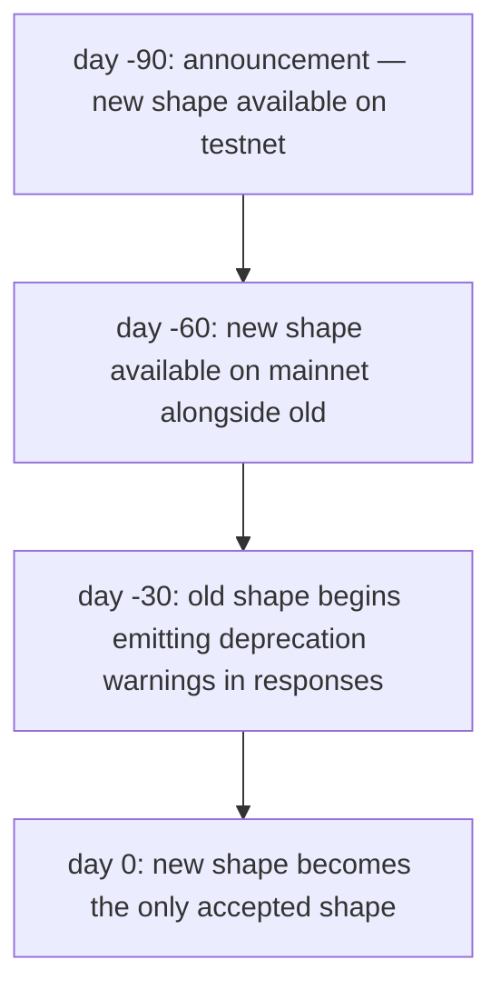
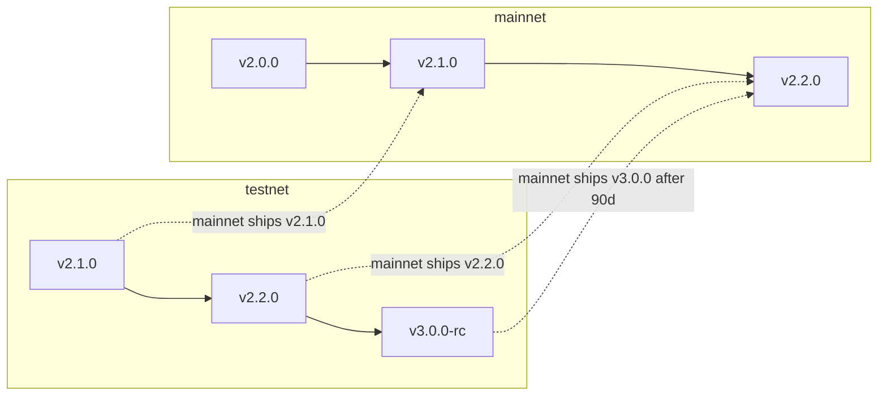

# Версионирование и депрекация

:::info
**Статус.** **Стабильная** политика. Конкретные переходы между версиями описаны в журнале изменений.
:::

## Кратко

- Версия протокола — это триплет в формате semver (`MAJOR.MINOR.PATCH`).
- Ломающие изменения формата передачи данных входят в `MAJOR`; обратно совместимые дополнения — в `MINOR`; исправления — в `PATCH`.
- Ломающие изменения в mainnet требуют 90-дневного периода депрекации, в течение которого принимаются оба формата — старый и новый.
- Testnet опережает mainnet, чтобы выявить проблемы миграции до выхода в продакшн.

## Компоненты версии

`protocol_version` протокола доступен через `/info node_info`:

```json
{
  "type": "node_info",
  "data": { "protocol_version": "1.2.0", ... }
}
```

| Компонент | Значение | Примеры |
|-----------|---------|----------|
| MAJOR | Ломающее изменение формата передачи данных | Переименование полей `Order`; удаление варианта действия; изменение домена подписи; изменение формата URL RPC |
| MINOR | Дополнение без нарушения совместимости | Новый вариант действия; новый тип info; новый WS-канал; новая строка ошибки |
| PATCH | Только исправление поведения | Исправления ошибок без изменения формата передачи данных; оптимизация производительности |

## Что такое «формат передачи данных»

Формат передачи данных — это всё, с чем клиент работает в логике сериализации и подписи. В частности:

| Относится к формату | Примеры |
|-----------|----------|
| Да | Строки `type` действий, имена полей, типы полей, значения перечислений, структура ответов, коды статусов, строки ошибок, домен EIP-712 |
| Да | Соглашения о числовом масштабировании (целые числа с фиксированной запятой, базовые единицы USDC) |
| Да | Имена WS-каналов, структуры payload, формат фреймов |
| Нет | Внутреннее хранилище сервера; реализация консенсуса; веса источников mark/oracle (управляются через governance, не версионируются протоколом); пороги уровней комиссий (governance) |

Параметры, изменяемые через governance (уровни комиссий, веса состава mark, шоки сценариев, пороги ликвидации), **не** являются частью обязательств по формату передачи данных. Их **структура** зафиксирована; значения могут меняться в любое время.

## Обязательства mainnet

| Класс изменения | Уведомление | Льготный период |
|--------------|--------------|--------------|
| MAJOR (ломающее) | За 90 дней до активации | Оба формата — старый и новый — принимаются не менее 90 дней |
| MINOR (дополнение) | 0 дней; анонсируется в журнале изменений | н/п |
| PATCH (исправление) | 0 дней | н/п |

Развёртывание изменения MAJOR происходит следующим образом:



90-дневное окно соответствует циклам управления изменениями в корпоративной среде. У операторов ботов достаточно времени для миграции; клиенты могут использовать двойной код передачи данных в период перекрытия.

## Предупреждения о депрекации

В течение периода перекрытия ответы на запросы в старом формате содержат не фатальное предупреждение:

```json
{
  "accepted": true,
  "mempool_depth": 3,
  "_deprecation": {
    "field":      "params.price",
    "deprecated_at_version": "2.0.0",
    "removal_at_version":    "3.0.0",
    "migration": "use px (string, fixed-point 10^8)"
  }
}
```

Поле `_deprecation` всегда является необязательным в вашем парсере — клиенты, использующие новый формат, никогда его не видят.

## Журнал изменений

Журнал изменений протокола публикуется по адресу `https://mtf.exchange/changelog` (URL уточняется до запуска) и зеркалируется в этом репозитории в файле `CHANGELOG.md`. Каждая запись содержит:

- Триплет версии
- Дату активации
- Класс (MAJOR / MINOR / PATCH)
- Описание каждого изменения с примечаниями по миграции для MAJOR / MINOR

Подписаться можно через:
- RSS по адресу `https://mtf.exchange/changelog.rss`
- GitHub Releases в этом репозитории
- WS push на планируемом канале `_meta` (TBD)

## Testnet опережает mainnet

Testnet, как правило, опережает mainnet на 1–2 минорные версии. Проблемы, выявленные при миграции в testnet, устраняются до даты развёртывания в mainnet. Операторы ботов с интеграцией в testnet получают заблаговременное предупреждение о ломающих изменениях.



## Что governance может изменять без версионирования

Протокольный уровень версионируется по формату передачи данных. Через governance можно изменять:

- Параметры каждого рынка (шаг цены, ограничение кредитного плеча, коэффициент поддерживающей маржи, состав mark, ограничение ставки финансирования)
- Пороги уровней комиссий и ставки
- Величины шоков сценариев PM и корреляционную матрицу
- Пороги уровней ликвидации и периоды охлаждения (в пределах ограничений — существенные изменения требуют MAJOR)
- Бюджеты ограничения частоты запросов
- Коэффициенты пополнения страхового фонда

Эти изменения НЕ увеличивают версию протокола. Они ДА генерируют события на планируемом WS-канале `_governance` и доступны для запроса через `/info` для получения текущих значений.

Клиенты, выполняющие вычисления на основе текущих значений параметров (например, расчёт маржи PM на стороне клиента), должны считывать параметры в реальном времени — никогда не используйте жёстко закодированные значения.

## Версионирование клиентских SDK

SDK (`@metaflux/sdk`, `metaflux-client` для Rust, `metaflux-client` для Python) следуют semver независимо от протокола:

- `0.x.y` — до запуска mainnet; ломающие изменения допускаются при каждом минорном приращении
- `1.x.y` — после запуска mainnet; строгое соблюдение semver на поверхности API

Поверхность API `1.x` SDK ориентирована на конкретную MAJOR-версию протокола. При повышении MAJOR протокола повышается MAJOR SDK; SDK 1.x поддерживает протокол 2.x, SDK 2.x поддерживает протокол 3.x, с перекрывающейся поддержкой в течение 90-дневного окна.

## Оговорки до запуска mainnet

До запуска mainnet:
- Devnet может нарушить формат передачи данных с уведомлением за 24 часа.
- Testnet работает на последней MINOR/MAJOR-версии протокола, опережая плановый выпуск mainnet; сбои в testnet ожидаемы.
- Баннеры статуса в каждом документе отражают, что является стабильным, превью или запланированным.

## См. также

- [Сети](./networks.md) — эндпоинты и chainId для каждой сети
- [Безопасность](./security.md) — модель безопасности и политика раскрытия информации
