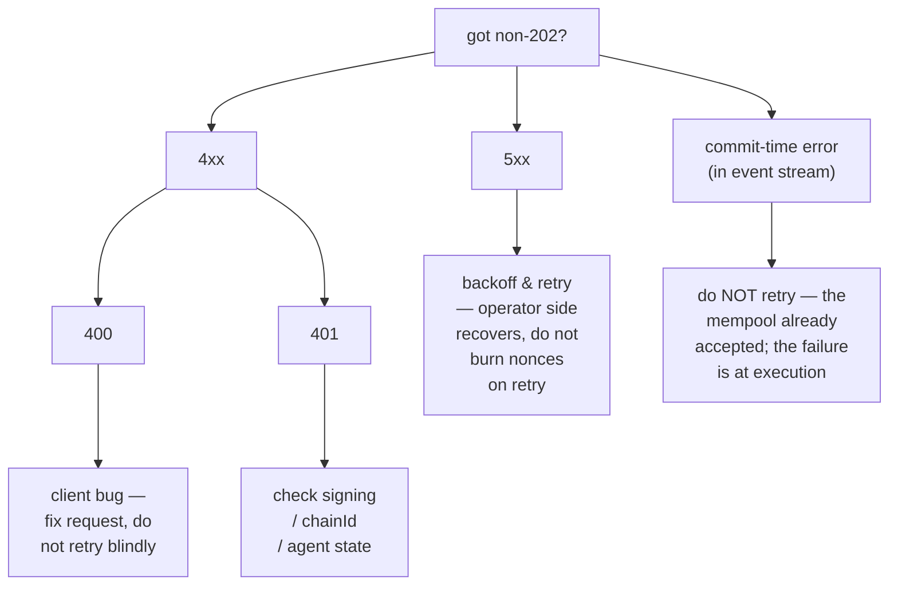

# 错误目录

:::info
**状态。** **稳定** 适用于所列代码。新的错误字符串可能会被添加；现有的错误字符串是稳定的。
:::

完整的 HTTP 状态码、错误字符串约定、根本原因和补救措施的列表。当不确定如何处理非 `202` 状态时，请先查阅此页面。

## TL;DR

- **2xx** — 成功。请注意 HL-compat 端点即使在应用层错误时也返回 `200 OK`，并在响应体中声明（`{"status":"err"}`）。MTF 原生端点使用正确的状态码。
- **400** — 客户端 bug：格式错误的请求、错误的签名形式、未知的操作变种。不要在不修复的情况下重试。
- **401** — 签名认证失败。在本地恢复地址并检查。
- **404** — 资源不存在。常见于 `/info`，当查询的账户/市场/金库从未被记录时。
- **405** — 错误的 HTTP 方法（大多数端点是 POST）。
- **422** — 请求格式正确但逻辑无效（例如零大小、杠杆超过上限）。不要重试；更正并重新提交。
- **429** — 速率限制。按照 `retry_after_ms` 退避并重试。
- **5xx** — 服务器端。使用指数退避重试；持续失败表示运营商端出现事故。

## 响应体形式

MTF 原生端点上的所有非 2xx 响应使用：

```json
{
  "error":          "<short_string>",
  "detail":         "<optional human-readable elaboration>",
  "retry_after_ms": 1200
}
```

`detail` 和 `retry_after_ms` 仅在适用时出现。`error` 字段是稳定的标识符 — 应该根据它来设置错误处理器。

HL-compat 端点（网关上的 `/info`、`/exchange`）则将所有内容包装在：

```json
{ "status": "ok"|"err", "response": ... }
```

中，其中 `status: "err"` 在 HTTP 200 时在 `response` 中携带字符串用于应用层错误。传输层错误（格式错误的 JSON、错误的方法）仍作为 4xx 出现。

## 目录

### 400 — 错误的请求

| `error` | 触发条件 | 补救措施 |
|---------|----------------|-------------|
| `sender: expected 40 hex chars, got N` | `sender` 字段长度错误 | 去掉 `0x` 前缀；验证 20 字节地址 |
| `signature: expected 130 hex chars, got N` | 签名缺少 `v` 字节 | 附加恢复字节 |
| `invalid hex` | `sender`/`signature` 中有非十六进制字符 | 清理输入 |
| `unknown action variant: <X>` | `action.type` 拼写错误或不支持 | 检查[操作目录](./rest/exchange.md#action-catalog) |
| `missing field: params.<X>` | 变种中缺少必填字段 | 检查变种的表格 |
| `invalid msgpack` | 操作序列化错误/非规范 msgpack | 使用默认选项 msgpack 库 |
| `nonce must increase` | 重用或乱序的 `nonce` | 使用单调计数器（例如 `Date.now()`） |
| `duplicate cloid` | `Order`/`ModifyOrder` 重用了客户端订单 id | 使用新的 `cloid` |
| `empty batch` | `orders[]` 或 `cancels[]` 为空 | 至少发送一个条目 |
| `invalid numeric` | 定点字段无法解析为 `u128` | 作为 JSON 字符串发送，基数为 10，无前导 `+` 或空格 |
| `unknown info type: <X>` | `/info` `type` 无法识别 | 检查[信息参考](./rest/info.md) |
| `chain_id mismatch` | 多签包装器的 chainId 字段与网络不匹配 | 匹配网络的 `chainId` |

### 401 — 未授权（签名失败）

| `error` | 触发条件 | 补救措施 |
|---------|----------------|-------------|
| `signer is not the sender and not an approved agent` | 恢复的地址 ≠ 发送方且不在代理集合中 | 验证私钥+地址；检查 `ApproveAgent` 是否已提交 |
| `agent expired` | 恢复的地址是发送方的代理，但 `expires_at_ms` 已过期 | 重新批准或轮换代理 |
| `agent not yet effective` | `ApproveAgent` 仍在传播中（≤1 区块） | 等待一个区块，重试 |
| `unknown chainId` | 签名域中的 `chainId` 错误 → 幻象恢复的地址 | 匹配[网络的 chainId](../networks.md) |
| `signature parse failed` | 格式错误的签名字节 | 验证 `r ‖ s ‖ v` 编码（65 字节） |
| `multisig threshold not met` | 内部操作有 < `threshold` 个有效签名 | 收集更多签名 |
| `multisig duplicate signer` | 同一地址在多签包装中签名两次 | 每个签名者必须不同 |

### 404 — 未找到

| `error` | 触发条件 |
|---------|----------------|
| `account not found` | `/info` 使用没有链上状态的地址查询 |
| `market not found` | `market_id`/`coin` 不在注册表中 |
| `vault not found` | `vault_id` 不存在 |
| `order not found` | `Cancel` 针对已取消/已成交/从未存在的 oid |

对于 `/info` 查询，MTF 原生返回 `404`；HL-compat 返回 `200` 且 `{"status":"err","response":"<msg>"}` （HL 的约定）。

### 405 — 方法不允许

| `error` | 触发条件 |
|---------|----------------|
| (无响应体) | 在 `POST` 端点上使用了 `GET` （反之亦然） |

### 422 — 无法处理的实体

请求格式正确，签名有效，但操作本身在逻辑上无效。

| `error` | 触发条件 | 补救措施 |
|---------|----------------|-------------|
| `price not tick-aligned` | `px` 不是市场跳度的倍数 | 舍入到最近的有效跳度 |
| `size below market minimum` | `size` < 市场最小值 | 增加大小或选择不同的市场 |
| `reduce_only would grow position` | 设置了仅减少，但订单会开仓或扩大头寸 | 删除 `reduce_only` 或检查当前头寸 |
| `leverage above asset cap` | 请求的杠杆 > 资产的 `max_leverage` | 使用 `≤ max_leverage` （见 `meta` 信息） |
| `pm_min_equity_not_met` | `UserPortfolioMargin{enabled:true}` 但账户低于阈值 | 增加权益或保持在经典模式 |
| `liquidation tier blocks action` | 账户在 T1+；进一步交易被阻止 | 补充保证金，先退出阶段 |
| `insufficient balance` | 提取/转账超过自由余额 | 先检查 `clearinghouseState` |
| `out of bounds: <param>` | 违反治理限制（例如 `PerpDeployGasAuctionBid` 上的融资上限） | 使用已发布限制范围内的值 |

### 429 — 速率限制

```json
{ "error": "rate limit exceeded", "scope": "per_ip"|"per_account", "retry_after_ms": 1200 }
```

| `scope` | 含义 |
|---------|---------|
| `per_ip` | 网关的按 IP 权重预算已用尽 |
| `per_account` | 网关的按账户 QPS 已用尽 |
| `mempool_per_account` | 来自一个账户的待处理操作在内存池中过多 |

有关预算和突发处理，请参见[速率限制](./rate-limits.md)。

### 503 — 服务不可用

| `error` | 原因 | 补救措施 |
|---------|-------|-------------|
| `mempool at capacity` | 网络拥塞；队列末尾被拒绝 | 指数退避（`retry_after_ms` 从 200 开始） |
| `gateway not ready` | 网关正在启动/健康检查失败 | 通过退避重试；检查[状态](../networks.md#status) |
| `node downstream unreachable` | 网关丢失了节点连接 | 运营商端；退避并观察状态 |

### 提交时错误（不是 HTTP，在事件流中）

某些失败发生在 `202 Accepted` 之后，因为它们只能在区块执行上下文中才能知道。这些在 `orderEvents`/`userEvents` WS 通道上显示为 `{"error":"<reason>", "action_hash":"0x..."}` 。

| `error` | 原因 |
|---------|-------|
| `reduce_only_violation_post_admit` | 头寸在允许和分派之间更改（其他成交平仓了它） |
| `stp_rejected` | 自成交预防在分派时杀死了订单 |
| `mark_price_band_violation` | 订单价格在匹配时超出市场允许的偏差范围 |
| `evicted_under_cap_pressure` | 被允许但在区块提议前从内存池中驱逐 |
| `liquidation_pre_empted` | 账户在允许和分派之间移至 T1+ |

## 决策树



## 另请参阅

- [`POST /exchange`](./rest/exchange.md) — 写入路径
- [`POST /info`](./rest/info.md) — 读取路径
- [速率限制](./rate-limits.md)
- [幂等性](../integration/idempotency.md) — 如何安全地重试
- [错误处理指南](../integration/error-handling.md) — 生产客户端的模式
