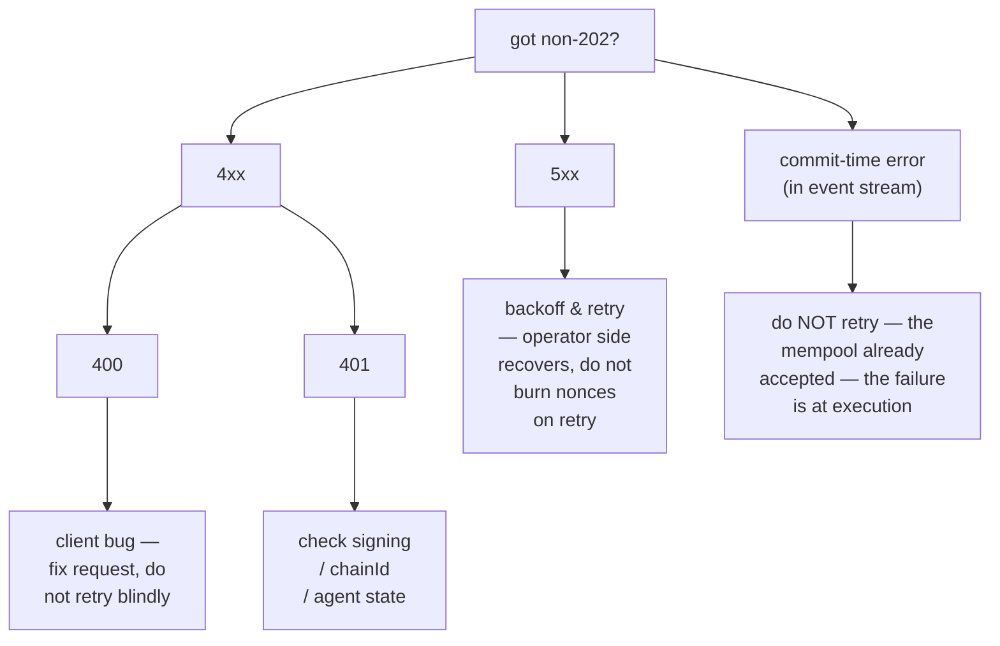

# 错误代码手册

:::info
**状态说明。** 以下列出的错误码均处于 **stable（稳定）** 状态。后续可能新增错误字符串，但已有的不会更改。
:::

本文完整列出了 HTTP 状态码、错误字符串规范、根本原因及修复建议。遇到非 `202` 响应时，请先查阅此处。

## 速查

- **2xx** — 成功。请注意，兼容 HL 的端点即使在应用层出错也会返回 `200 OK`，并在响应体中标记错误（`{"status":"err"}`）；MTF 原生端点则使用标准 HTTP 状态码。
- **400** — 客户端错误：请求格式有误、签名结构不正确、action 类型未知。不要在未修复的情况下重试。
- **401** — 签名验证失败。请在本地还原地址并逐一核查。
- **404** — 资源不存在。常见于 `/info` 查询从未出现过的账户、市场或 vault。
- **405** — HTTP 方法错误（大多数端点仅接受 POST）。
- **422** — 请求格式正确，但逻辑上无效（例如下单数量为零、杠杆超过上限）。请勿重试，修正后重新提交。
- **429** — 触发限频。请按 `retry_after_ms` 退避后重试。
- **5xx** — 服务端错误。使用指数退避重试；若持续失败，说明运营方出现故障。

## 响应体格式

MTF 原生端点的所有非 2xx 响应均使用以下格式：

```json
{
  "error":          "<short_string>",
  "detail":         "<optional human-readable elaboration>",
  "retry_after_ms": 1200
}
```

`detail` 和 `retry_after_ms` 仅在适用时出现。`error` 字段是稳定标识符——请以它作为错误处理逻辑的键值。

兼容 HL 的端点（网关上的 `/info`、`/exchange`）则将所有内容包装为：

```json
{ "status": "ok"|"err", "response": ... }
```

应用层错误在 HTTP 200 下以 `status: "err"` 表示，`response` 字段包含错误说明字符串。传输层错误（JSON 格式有误、HTTP 方法错误）仍会返回 4xx。

## 错误目录

### 400 — 错误请求

| `error` | 触发条件 | 修复建议 |
|---------|----------|----------|
| `sender: expected 40 hex chars, got N` | `sender` 字段长度不正确 | 去掉 `0x` 前缀；确认为 20 字节地址 |
| `signature: expected 130 hex chars, got N` | 签名缺少 `v` 字节 | 补充恢复字节 |
| `invalid hex` | `sender` / `signature` 中含有非十六进制字符 | 净化输入内容 |
| `unknown action variant: <X>` | `action.type` 拼写错误或不受支持 | 查阅 [action 目录](./rest/exchange.md#action-catalog) |
| `missing field: params.<X>` | 该 variant 缺少必填字段 | 查阅对应 variant 的字段表 |
| `invalid msgpack` | action 序列化错误 / msgpack 格式不符合规范 | 使用默认选项的 msgpack 库 |
| `nonce must increase` | `nonce` 重复使用或顺序错误 | 使用单调递增计数器（例如 `Date.now()`） |
| `duplicate cloid` | `Order`/`ModifyOrder` 复用了客户端订单 ID | 使用全新的 `cloid` |
| `empty batch` | `orders[]` 或 `cancels[]` 为空 | 至少提交一条记录 |
| `invalid numeric` | 定点数字段无法解析为 `u128` | 以 JSON 字符串形式发送，十进制，不含前导 `+` 或空白字符 |
| `unknown info type: <X>` | `/info` 的 `type` 字段不被识别 | 查阅 [info 参考文档](./rest/info.md) |
| `chain_id mismatch` | 多签包装器中 chainId 字段与网络不匹配 | 与网络的 `chainId` 保持一致 |

### 401 — 未授权（签名验证失败）

| `error` | 触发条件 | 修复建议 |
|---------|----------|----------|
| `signer is not the sender and not an approved agent` | 还原地址既不等于 sender，也不在授权代理集合中 | 核验私钥与地址；确认 `ApproveAgent` 已上链 |
| `agent expired` | 还原地址是 sender 的代理，但 `expires_at_ms` 已过期 | 重新授权或轮换代理 |
| `agent not yet effective` | `ApproveAgent` 仍在传播中（≤1 个区块） | 等待一个区块后重试 |
| `unknown chainId` | 签名域中 `chainId` 错误，导致还原出幽灵地址 | 与[网络的 chainId](../networks.md) 保持一致 |
| `signature parse failed` | 签名字节格式有误 | 确认 `r ‖ s ‖ v` 编码正确（65 字节） |
| `multisig threshold not met` | 内层 action 的有效签名数量低于 `threshold` | 收集更多签名 |
| `multisig duplicate signer` | 同一地址在多签包装中签名两次 | 每位签名者地址必须唯一 |

### 404 — 资源未找到

| `error` | 触发条件 |
|---------|----------|
| `account not found` | `/info` 查询的地址在链上无任何状态 |
| `market not found` | `market_id` / `coin` 不在注册表中 |
| `vault not found` | `vault_id` 不存在 |
| `order not found` | 对一个已撤销 / 已成交 / 从未存在的 oid 执行 `Cancel` |

对于 `/info` 查询，MTF 原生端点返回 `404`；兼容 HL 的端点返回 `200`，响应体为 `{"status":"err","response":"<msg>"}`（符合 HL 的约定）。

### 405 — 方法不允许

| `error` | 触发条件 |
|---------|----------|
| （无响应体） | 对 `POST` 端点使用了 `GET`（或反之） |

### 422 — 请求无法处理

请求格式正确且签名有效，但 action 本身在逻辑上不合法。

| `error` | 触发条件 | 修复建议 |
|---------|----------|----------|
| `price not tick-aligned` | `px` 不是该市场最小价格步长的整数倍 | 四舍五入至最近的有效价格档位 |
| `size below market minimum` | `size` 小于市场最小下单量 | 增加数量或选择其他市场 |
| `reduce_only would grow position` | 设置了只减仓，但该订单会开仓或扩大持仓 | 去掉 `reduce_only`，或先核查当前持仓 |
| `leverage above asset cap` | 请求的杠杆倍数超过该资产的 `max_leverage` | 使用 `≤ max_leverage` 的杠杆（参见 `meta` 信息） |
| `pm_min_equity_not_met` | `UserPortfolioMargin{enabled:true}` 但账户权益低于门槛 | 增加权益，或继续使用经典保证金模式 |
| `liquidation tier blocks action` | 账户处于 T1+ 清算档位，进一步交易已被阻止 | 补充保证金，先退出当前档位 |
| `insufficient balance` | 提款 / 划转金额超过可用余额 | 先查询 `clearinghouseState` |
| `out of bounds: <param>` | 违反治理边界（例如 `PerpDeployGasAuctionBid` 的资金费率上限） | 使用已公布边界范围内的值 |

### 429 — 请求限频

```json
{ "error": "rate limit exceeded", "scope": "per_ip"|"per_account", "retry_after_ms": 1200 }
```

| `scope` | 含义 |
|---------|------|
| `per_ip` | 网关层的单 IP 权重预算已耗尽 |
| `per_account` | 网关层的单账户 QPS 配额已耗尽 |
| `mempool_per_account` | 单账户在内存池中的待处理 action 过多 |

有关配额和突发流量处理，请参阅[限频说明](./rate-limits.md)。

### 503 — 服务不可用

| `error` | 原因 | 修复建议 |
|---------|------|----------|
| `mempool at capacity` | 网络拥堵，队列末尾请求被拒绝 | 指数退避（`retry_after_ms` 初始值为 200） |
| `gateway not ready` | 网关正在启动 / 健康检查失败 | 退避重试；查看[状态页](../networks.md#status) |
| `node downstream unreachable` | 网关丢失与节点的连接 | 运营方问题，退避等待并关注状态页 |

### 提交时错误（非 HTTP，出现在事件流中）

部分错误发生在返回 `202 Accepted` 之后，因为它们只能在区块执行上下文中被检测到。这些错误以 `{"error":"<reason>", "action_hash":"0x..."}` 的形式出现在 `orderEvents` / `userEvents` WebSocket 频道中。

| `error` | 原因 |
|---------|------|
| `reduce_only_violation_post_admit` | 从接受到派发期间仓位已发生变化（其他成交已将其平仓） |
| `stp_rejected` | 自成交保护机制在派发时撤销了该订单 |
| `mark_price_band_violation` | 撮合时订单价格超出该市场允许的偏差范围 |
| `evicted_under_cap_pressure` | 已接受入池，但在区块提案前被逐出内存池 |
| `liquidation_pre_empted` | 从接受到派发期间账户进入了 T1+ 清算档位 |

## 决策流程图



## 参见

- [`POST /exchange`](./rest/exchange.md) — 写入路径
- [`POST /info`](./rest/info.md) — 读取路径
- [限频说明](./rate-limits.md)
- [幂等性](../integration/idempotency.md) — 如何安全重试
- [错误处理指南](../integration/error-handling.md) — 生产客户端的最佳实践
