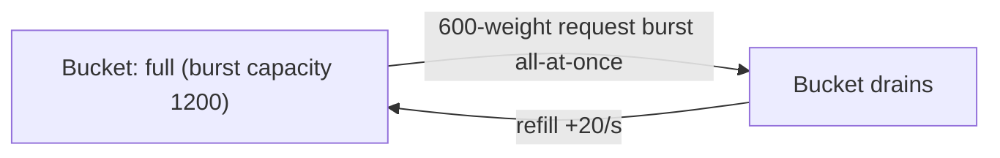
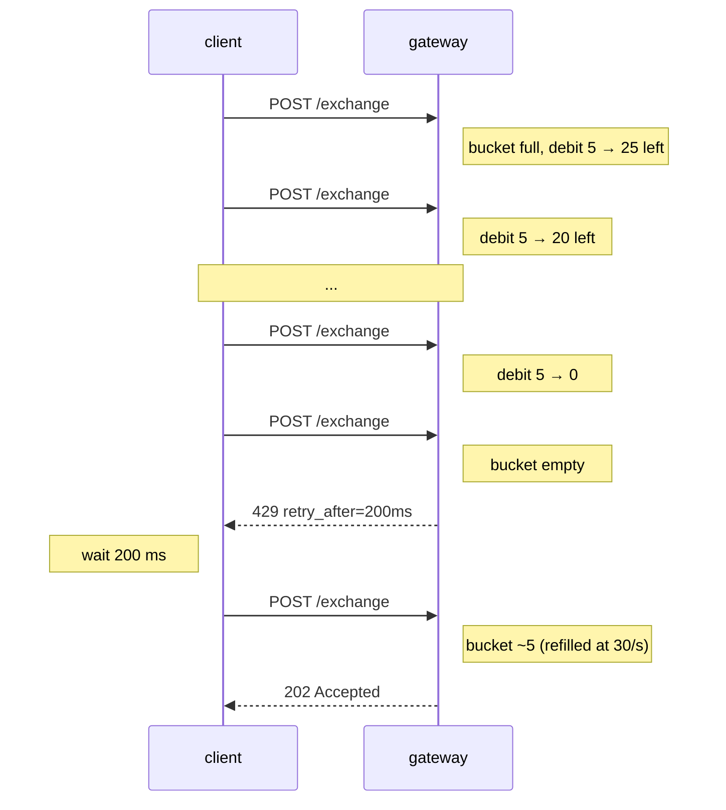

# 速率限制

:::info
**预览版。** 网关会强制执行下述限制；裸节点对已通过 mTLS 认证的对等方接受无限制流量（仅供受信任的内部基础设施使用——生产环境中请勿将 `8080` 端口暴露在公网）。
:::

## 速览

- 两种配额：**按 IP 权重**（匿名流量）和**按账户 QPS**（已签名流量）。
- 突发请求消耗令牌桶；持续流量受补充速率限制。
- `429` 响应始终包含 `retry_after_ms`，请务必遵守。
- `/info` 查询权重低（权重 1）；WS 订阅更低（订阅时消耗 1 权重，每条消息 0 权重）。`/exchange` 每次请求权重 5。
- 内存池对每个账户的待处理操作数有独立上限。

## 配额

| 配额 | 限制（默认） | 补充速率 | 突发上限 |
|------|-------------|---------|---------|
| 按 IP 权重 | 1200 权重 / 分钟 | 20 权重 / 秒 | 1200（满桶） |
| 按账户 QPS | 30 请求 / 秒 | 30 / 秒 | 60 |
| 每账户内存池操作数 | 50 个待处理 | 随操作提交自动释放 | — |
| 每连接 WS 订阅数 | 256 | — | — |

所有限制均由治理控制。可通过原生 [`user_rate_limit`](./rest/info.md) 接口查询账户配额快照：

```bash
curl -X POST https://api.devnet.mtf.exchange/info \
  -H 'content-type: application/json' \
  -d '{"type":"user_rate_limit","address":"0x<addr>"}'
```

> **计划中的接口。** 用于发布*静态*按 IP / 按账户配置的专用 `GET /limits` 路由**尚未实现**——下列值为配置默认值，暂未通过接口提供。请将以下 JSON 视为参考默认值：

```json
{
  "per_ip": {
    "weight_per_minute": 1200,
    "burst":             1200,
    "refill_per_second": 20
  },
  "per_account": {
    "qps":          30,
    "burst":        60,
    "refill":       30
  },
  "mempool_per_account": 50,
  "ws_subs_per_conn":    256
}
```

## 各端点权重

| 端点 | 权重 |
|------|------|
| `POST /info`（大多数类型） | 1 |
| `POST /info` `l2Book`、`metaAndAssetCtxs` | 2 |
| `POST /info` `userFills`、`historicalOrders`（分页） | 2 |
| `POST /exchange` | 5 |
| WS `subscribe` | 1 |
| WS 推送消息 | 0 |
| WS `unsubscribe` | 0 |

客户端以每秒 1 笔订单的频率下单，同时每秒轮询一次 `clearinghouseState`，共消耗 `5 + 1 = 6 权重/秒 = 360 权重/分钟`——远低于配额上限。

## 按账户 QPS

请求经签名后，网关会验证 `sender` 身份，并计入账户配额（而非仅计入 IP 配额，或同时计入两者）。

| 发送方状态 | 计入对象 |
|-----------|---------|
| 匿名（无签名，如 `POST /info`） | 按 IP |
| 主账户签名 | 按 IP + 按账户 |
| 代理账户签名 | 按 IP + 按主账户 |

已签名请求会同时计入 IP 配额和账户配额；当大量请求从同一 IP 代表同一账户发出时，哪个配额先触达上限，哪个就会成为瓶颈。

## 内存池上限

独立于速率限制之外。状态机拒绝每个 `sender` 超过 50 个待处理（尚未提交）操作，以防止单一账户独占内存池空间。

提交第 51 个操作而当前已有 50 个待处理时：

```json
{ "error": "mempool_per_account_full", "retry_after_ms": 100 }
```

实际上只有行为异常的客户端才会触发此限制——正常约 100 ms 的出块时间足以轻松消化 30 QPS。如果你触达了此限制，说明按账户速率限制本身没问题，但你提交操作的速度比出块还快。

## 突发行为

令牌桶容量为 `burst`，以每秒 `refill` 的速率补充。`N ≤ burst` 的突发请求可立即全部处理；后续请求则被限速至补充速率。



收到 `429` 响应时，`retry_after_ms` 会告知你确切的等待时长，届时桶中将有足够的配额处理下一个权重 1 的请求。批量任务建议在客户端主动限速；交互式工作负载则可使用该提示值进行指数退避。

## 最佳实践

### 订单流机器人

- 在客户端主动限速至约 25 QPS，保留余量。
- 使用 `Order` 批量接口：一次包含 10 笔订单的请求仅消耗 5 权重（与单笔相同）；按账户 QPS 计算的是请求数，而非订单腿数。
- 使用 `BatchModify` 替代多次独立的 `ModifyOrder`。
- 行情数据通过 WS 推送获取，避免轮询 `/info`。

### 行情数据消费者

- 订阅 WS 频道（`l2Book`、`trades`、`userEvents`），不要轮询。
- `subscribe` 权重为 1，流内消息权重为 0。
- 断线重连时使用 `resume_token`，而非重新订阅所有频道（新连接重新订阅会再次消耗权重）。

### 高频清算机器人

- 从自托管节点运行（mTLS 认证，`localhost:8080`），绕过公共网关的速率限制。
- 请注意，这需要与验证者节点对等运行基础设施。
- 公共网关适用于每秒数十笔订单的场景，不适合高频交易。

## 时序——被限速与恢复



## 豁免渠道

| 渠道 | 说明 |
|------|------|
| 验证者 mTLS 对等方 | 绕过网关速率限制（走受信任路径） |
| IP / 账户白名单（运营商侧） | 运营商可为指定做市商提升配额上限 |
| 特殊端点（`/limits`、`/health`） | 不受速率限制 |

公共默认配额假设上述豁免均不适用。

## 参见

- [错误处理](./errors.md)
- [WS 订阅](./ws/subscriptions.md)
- [幂等性](../integration/idempotency.md) — 如何在速率限制配额内安全重试

## 常见问题

<details>
<summary>展开常见问题</summary>

**Q：限制是按密钥对还是按地址计算的？**
A：按 `sender`（地址）计算。同一主账户的所有代理共享同一配额，因为准入计数以主账户为单位。

**Q：我能否将一笔订单分拆到 10 个市场来节省权重？**
A：可以。`Order { orders: [<10 legs>] }` 消耗 5 权重，而非 50。

**Q：`/info` 轮询和 WS 订阅共享同一配额吗？**
A：是的——共享同一按 IP / 按账户令牌桶。WS 订阅每次消耗 1 权重，订阅后每条消息 0 权重；对于高频行情数据，WS 始终比轮询更经济。

**Q：Devnet 有何不同？**
A：Devnet 的配额上限更高，且无内存池上限。不要以 Devnet 为基准调整客户端参数；请针对你实际部署的网络，通过 `/limits` 重新计算配额预算。

</details>
