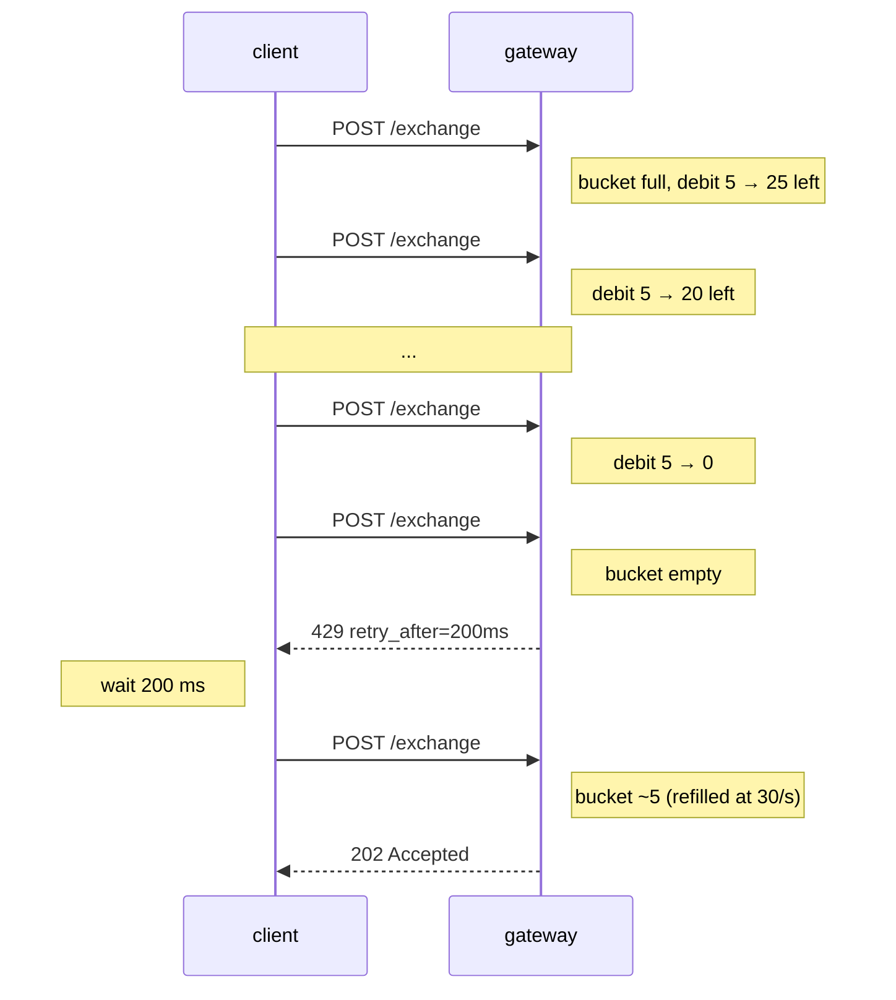

# 速率限制

:::info
**预览版**。网关会强制执行下面的限制；裸节点接受来自已认证 mTLS 对等方的无限流量（仅供可信基础设施使用——在生产环境中不要向开放网络暴露 `8080`）。
:::

## 快速概览

- 两个预算：**按 IP 权重**（匿名流量）和**按账户 QPS**（签名流量）。
- 突发工作负载消耗令牌桶；持续流量由补充速率控制。
- `429` 总是携带 `retry_after_ms`。请尊重它。
- `/info` 查询成本低（权重 1）；WS 订阅成本更低（订阅时权重 1，之后每条消息 0）。`/exchange` 每个请求权重 5。
- 内存池对每个账户的待处理操作有独立的上限。

## 预算

| 预算 | 限制（默认值） | 补充 | 突发 |
|--------|-----------------|--------|-------|
| 按 IP 权重 | 1200 权重 / 分钟 | 20 权重 / 秒 | 1200（满桶） |
| 按账户 QPS | 30 请求 / 秒 | 30 / 秒 | 60 |
| 每个账户的内存池操作 | 50 个待处理 | 随操作提交而排空 | — |
| 每个连接的 WS 订阅 | 256 | — | — |

所有限制都由治理控制。按账户预算快照可通过在网关默认路径上进行原生 [`user_rate_limit`](./rest/info.md) 读取获得（网关也在 `/hl` 下将相同数据作为 HL 兼容 `userRateLimit` 暴露）：

```bash
curl -X POST https://devnet-gateway.mtf.exchange/info \
  -H 'content-type: application/json' \
  -d '{"type":"user_rate_limit","address":"0x<addr>"}'
```

> **计划中的读取**。发布*静态*按 IP / 按账户配置的专用 `GET /limits` 路由（如下所示）**尚未实现**——这些值是配置的默认值，尚未从端点提供。将下面的 JSON 视为参考默认值：

```json
{
  "per_ip": {
    "weight_per_minute": 1200,
    "burst":             1200,
    "refill_per_second": 20
  },
  "per_account": {
    "qps":          30,
    "burst":        60,
    "refill":       30
  },
  "mempool_per_account": 50,
  "ws_subs_per_conn":    256
}
```

## 按端点的权重

| 端点 | 权重 |
|----------|--------|
| `POST /info`（大多数类型） | 1 |
| `POST /info` `l2Book`, `metaAndAssetCtxs` | 2 |
| `POST /info` `userFills`, `historicalOrders`（分页） | 2 |
| `POST /exchange` | 5 |
| `GET /ccxt/markets`, `GET /ccxt/ticker` | 1 |
| `GET /ccxt/orderbook`, `GET /ccxt/ohlcv` | 2 |
| `GET /ccxt/balance`, `/positions`, `/myTrades` | 2 |
| `POST /ccxt/orders`, `DELETE /ccxt/orders/{id}` | 5 |
| WS `subscribe` | 1 |
| WS 发布消息 | 0 |
| WS `unsubscribe` | 0 |

发送一个订单每秒并轮询 `clearinghouseState` 一次每秒的客户端花费 `5 + 1 = 6 权重/秒 = 360 权重/分钟`——远在预算范围内。

## 按账户 QPS

一旦请求被签名，网关就会认证 `sender` 并计数到按账户预算而不是（或除了）按 IP 预算。

| 发送方状态 | 计数对象 |
|--------------|-----------------|
| 匿名（无签名，例如 `GET /ccxt/markets`） | 按 IP |
| 由主账户签名 | 按 IP + 按账户 |
| 由代理签名 | 按 IP + 按主账户 |

签名请求有效地双重计数到按 IP 和按账户；从单个 IP 代表一个账户的客户端将击中较严格的预算。

## 内存池上限

独立于速率限制。状态机拒绝接纳 > 50 个待处理（尚未提交）的每个 `sender` 的操作。这防止一个账户垄断内存池空间。

如果你在 50 个待处理时提交第 51 个操作：

```json
{ "error": "mempool_per_account_full", "retry_after_ms": 100 }
```

实际上，这只会被行为不当的客户端触发——健康的约 100 毫秒的区块时间可以轻松处理 30 QPS。如果你触发了这个，你在按账户是速率限制正确的，但发送速度比块提交更快。

## 突发行为

桶填充到 `burst` 并以每秒 `refill` 的速率补充。`N ≤ burst` 个请求的突发立即满足；随后的请求被限制到补充速率。


`429` 响应加 `retry_after_ms` 告诉你桶何时准备好再承载一个权重 1 请求。对于批处理作业，倾向于客户端寻呼；对于交互式工作负载，指数退避加提示是可以的。

## 策略

### 订单流机器人

- 在客户端主动速率限制到约 25 QPS 以留出余量。
- 使用 `Order` 批处理：一个包含 10 个订单的请求成本 5 权重（与一个订单相同）；按账户 QPS 计算请求，不计腿数。
- 使用 `BatchModify` 而不是 N 个独立的 `ModifyOrder`。
- 在 WS 源上保持市场数据，不要轮询 `/info`。

### 市场数据消费者

- 订阅 WS 频道（`l2Book`, `trades`, `userEvents`）；不要轮询。
- `subscribe` 权重为 1，流内消息成本为 0。
- 使用 `resume_token` 重新连接而不是从头重新订阅所有频道（订阅在新连接上再次花费权重）。

### 高频清算人

- 从你自己的自托管节点运行（mTLS 认证，`localhost:8080`），绕过公网网关的限制。
- 承认这需要运行与验证者对等的基础设施。
- 公网网关访问足以应对每秒数十个订单的工作负载；不足以应对高频交易。

## 顺序——被限制和恢复



## 覆盖频道

| 频道 | 注释 |
|---------|-------|
| 验证者的 mTLS 对等方 | 绕过网关速率限制（你在受信路径上） |
| 白名单 IP / 账户（运营方面） | 运营者可能为指定的做市商发布提高的预算 |
| 特殊端点（`/limits`, `/health`） | 不受速率限制 |

公网默认假设这两个覆盖都不适用。

## 另见

- [错误](./errors.md)
- [WS 订阅](./ws/subscriptions.md)
- [幂等性](../integration/idempotency.md)——如何在速率限制预算内重试

## 常见问题

<details>
<summary>显示常见问题</summary>

**问：限制是按密钥对还是按地址？**
答：按 `sender`（地址）。同一主账户的所有代理共享预算，因为入场计数主账户。

**问：我能否将一个订单跨 10 个市场批处理来节省权重？**
答：是的。`Order { orders: [<10 legs>] }` 成本 5 权重，不是 50。

**问：`/info` 轮询和 WS 订阅共享预算吗？**
答：是的——相同的按 IP / 按账户桶。WS 订阅各成本 1，然后每条消息 0；对于高速率数据源，WS 总是比轮询便宜。

**问：开发网怎么样？**
答：开发网有更高的预算且没有内存池上限。不要根据开发网调整客户端；对你将部署的网络重新运行预算数学和 `/limits`。

</details>
