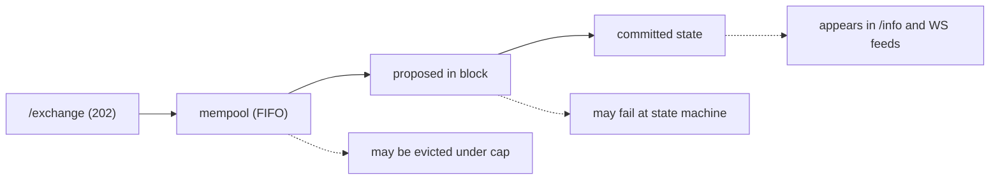
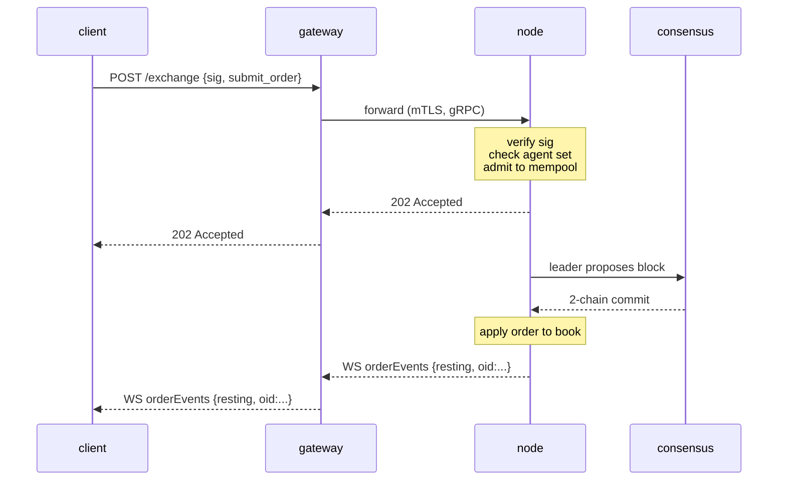

# `POST /exchange` — 提交已签名操作

:::info
**状态。** 已列出的操作变体均为 **stable（稳定版）**。端点形式已锁定至 V1。
:::

## 概述 {#tldr}

所有改变状态的**用户**操作——下单、撤单、金库存款、代理授权、质押等——均封装为一个经 EIP-712 签名的 JSON 信封，发送至 `POST /exchange`。操作变体由 `type` 字段选定。**订单**操作返回 `200 OK`，同步携带分配的 `oid`（处理器等待提交完成）；**其他所有**操作在准入时返回 `202 Accepted`，提交确认通过 [WS 订阅](../ws/subscriptions.md) 推送或轮询获取。

:::warning
**仅限用户操作。** `/exchange` 是公开的**用户**写入路径。特权/系统写入——预言机价格提交、水龙头充值、`SystemUserModify`、`SystemSpotSend`、验证者投票——**绝不**经由 `/exchange`。它们通过受验证者权限控制的节点本地队列注入（参见[非桥接操作表](#non-bridged-actions)及[水龙头](./faucet.md#why-this-is-not-on-exchange)）。提交系统操作的原生标签将返回 `400 unsupported action`。
:::

## URL {#url}

```
POST  https://api.<net>.mtf.exchange/exchange
```

| 路径 | 线格式 |
|------|-----------|
| `POST /exchange`（网关） | **MTF 原生**（本文档） |

网关提供 MTF 原生 `/exchange` 接口。若自行运行节点，同一原生 `/exchange` 直接服务于 `http://localhost:8080`。

## 请求信封 {#request-envelope}

```json
{
  "signature": "0xabcd...1b",
  "nonce":     1735689600001,
  "action": {
    "type": "submit_order",
    "order": { /* 以下变体之一 */ }
  }
}
```

| 字段 | 类型 | 是否必填 | 说明 |
|-------|------|----------|-------------|
| `signature` | 十六进制字符串，65 字节（130 个十六进制字符；`0x` 可选） | 是 | 对操作结构化字段 + `nonce` 的 EIP-712 [类型数据摘要](#signing) 执行 secp256k1 ECDSA 签名。`r ‖ s ‖ v`。兼容传统 `v ∈ {27, 28}` 和 EIP-2098 `v ∈ {0, 1}`。 |
| `nonce` | uint64 | 是 | 每个操作者严格单调递增。惯例使用 `Date.now()`。绑定至签名摘要。参见[幂等性](../../integration/idempotency.md)。 |
| `action` | object | 是 | 标签化变体：`{ "type": "<snake_case_tag>", ... }`。参见下方[操作目录](#action-catalog)。 |

:::info
**无顶层 `sender`。** 信封不含 `sender` 字段。状态被变更的账户由各操作自身决定：
- **携带所有者的操作**（`submit_order`、`cancel_order`）在操作体内部携带所有者——`action.order.owner` / `action.cancel.owner`。服务器从签名恢复签名者，并要求其等于该 `owner` **或**其已授权的[代理](../../concepts/agent-wallets.md)。
- **发送者授权操作**（治理、保证金、金库领导者、质押等）完全**不**含 owner 字段：恢复的签名者即为操作者，操作级别的授权（验证者成员资格、金库领导者等）在分发时执行。
:::

服务器从 `action.type` + `action.params` 重建 EIP-712 类型化结构体，并对**这些字段值**恢复签名者——因此你发送的 `action.params` 必须携带与你签名时放入类型化消息中**完全相同的值**（以及相同的规范十进制字符串）。值不匹配将恢复出不同的签名者，请求将被拒绝并返回 `401`。参见[类型数据签名](../../integration/typed-data-signing.md)。

## 签名 {#signing}

签名是对标准 EIP-712 摘要执行的 secp256k1 ECDSA 恢复签名。每个操作均作为**结构化 EIP-712 类型数据**（`eth_signTypedData_v4`）进行签名，主类型为 `MetaFluxTransaction:<Action>`，钱包因此可按字段名展示每个字段。服务器从 `action.type` + `action.params` 重建类型化结构体，重新计算摘要，并恢复签名者：

```
struct_hash = keccak256( typeHash(MetaFluxTransaction:<Action>) ‖ encodeData(fields) )
signed_hash = keccak256( 0x1901 ‖ domain_separator ‖ struct_hash )
```

其中域分隔符为：

```
domain_separator = keccak256(
  keccak256("EIP712Domain(string name,string version,uint256 chainId,address verifyingContract)") ‖
  keccak256("MetaFlux") ‖
  keccak256("1") ‖
  chainId_as_uint256_be ‖
  address_zero_padded_to_32
)
```

各操作的类型字符串、原子 `encodeData` 规则及示例详见[类型数据签名](../../integration/typed-data-signing.md)——这是唯一的签名方案。跨实现的已知答案测试固定了每个操作的摘要。

:::info
**`sig_scheme` 为遗留字段。** 早期版本在信封上携带 `sig_scheme` 选择器；目前已不再需要，服务器会忽略它（类型数据恢复无条件执行）。**请省略该字段。** 若存在，唯一接受的值为 `"typed"`。
:::

### 链 ID {#chain-ids}

| 网络 | `chainId` |
|---------|-----------|
| Devnet（默认） | `31337` |
| 测试网 | `114514` |
| 主网 | `8964` |

签名域的 `chainId` **必须等于节点共识的 `chain_id`**——通过 [`/info` `node_info`](./info.md#node_info)（`data.chain_id`）查询，并使用该精确值。对错误的 `chainId` 签名将返回 `401`，因为恢复的地址与操作的 `owner` 不符（或对于发送者授权操作，恢复出一个无法通过任何授权检查的幻影地址）。端点信息参见[网络](../../networks.md)。

## 数值规范 {#numeric-conventions}

| 类型 | 线格式 | 原因 |
|------|----------|-----|
| `uint64` ≤ 2^53 | JSON number | IEEE-754 安全范围 |
| `uint64` > 2^53、`u128`、缩放整数 | JSON string | 原生 JSON 数值在超过 2^53 后会静默丢失精度 |
| 地址 | 十六进制字符串 `"0x..."` | 20 字节，40 个十六进制字符（有无 `0x` 均可） |
| 布尔值 | `true` / `false` | 字面量 JSON |
| 可选字段 | `null` 或省略 | 两者均接受；`null` 为规范形式 |

**定点字段。** 价格和数量字段为 8 位小数定点整数；USDC 金额为 6 位小数基础单位。值本身携带精度，而非字段名——例如 `px = "10050000000"` 表示 `100.50`。始终以字符串形式发送；服务器解析为 `u128`。

## 签名者语义 {#signed-by-semantics}

大多数操作可由**主账户**或活跃的[代理钱包](../../concepts/agent-wallets.md)**任意一方**签名。部分操作为**仅限主账户**——代理被明确拒绝提款权限和账户管理权限。

| 能力类别 | 主账户可签名？ | 代理可签名？ |
|------------------|:----------------:|:---------------:|
| 下单 / 撤单 / 改单 | 是 | 是 |
| 更新杠杆 / 保证金模式 | 是 | 是 |
| 金库存款 / 取款 | 是 | 是 |
| 创建子账户 | 是 | 否 |
| 子账户划转 | 是 | 否 |
| 代理授权 / 撤销 | 是 | 否 |
| 外部提款（USDC、现货） | 是 | 否 |
| 转换为多签 | 是 | 否 |
| 多签封装器 | （特殊——参见[多签](../../concepts/multi-sig.md)） | 否 |

[目录](#action-catalog)中每个操作条目均明确列出其签名者规则。

---

## 操作目录 {#action-catalog}

每个变体均为标签化对象 `{ "type": "<snake_case_tag>", <扁平体> }`。体键在操作对象下**扁平展开**（没有 PascalCase 的 `type`，也没有通用的 `params` 包装层）——例如 `submit_order` 携带 `order` 对象，`cancel_order` 携带 `cancel` 对象，发送者授权操作携带 `params` 对象。点击可查看字段级表格。下方概览表按类别分组列出所有操作；**后续完整的字段级定义按交易类型拆分**——[永续合约订单操作](#perpetual-order-actions)、[现货交易操作](#spot-trading-actions)、[现货保证金与 Earn 操作](#spot-margin--earn-actions)、[永续合约保证金与风险操作](#perpetual-margin--risk-actions)，以及[账户、质押、金库与桥接操作](#account-staking-vaults--bridge-actions)。

:::warning
**`px` / `size` 在原生线格式上为无符号定点 `u64`**，以 JSON number 发送（节点解码为 `u64`，随后在内部加宽）。地址为 `0x` 十六进制（40 字符）；`cloid` 为 `0x` + 32 个十六进制字符（16 字节）。
:::

### 订单下单与生命周期 {#order-placement--lifecycle}

| `type` | 用途 | 签名者 | 幂等性 |
|--------|---------|-----------|-----------|
| [`submit_order`](#submit_order) | 下单（单笔） | owner / agent | 按 `cloid` |
| [`batch_order`](#batch_order) | N 笔订单 / 单次签名 | owner / agent | 各腿按 `cloid` |
| [`cancel_order`](#cancel_order) | 按 `oid` 撤单 | owner / agent | 是 |
| [`batch_cancel`](#batch_cancel) | N 笔撤单 / 单次签名 | owner / agent | 是 |
| [`cancel_by_cloid`](#cancel_by_cloid) | 按客户端订单 ID 撤单 | sender / agent | 是 |
| [`cancel_all_orders`](#cancel_all_orders) | 撤销全部订单（可选资产过滤） | sender / agent | 是 |
| [`modify`](#modify) | 修改挂单的价格 / 数量 | sender / agent | 是 |
| [`batch_modify`](#batch_modify) | N 笔改单 / 单次签名 | sender / agent | 各条目 |
| [`schedule_cancel`](#schedule_cancel) | 未来区块的定时全撤触发 | sender / agent | 是 |
| [`twap_order`](#twap_order) | 安排分批（TWAP）订单 | sender / agent | 按 `twap_id` |
| [`twap_cancel`](#twap_cancel) | 取消运行中的 TWAP 父单 | sender / agent | 是 |

### 现货交易 {#spot-trading}

现货是代币对代币的 CLOB（无杠杆、无持仓）——与永续合约的订单簿和余额相互独立。挂单会将其成交所需资金锁入**预留余额**：`bid` 预留**报价资产**（按限价计算的名义金额），`ask` 预留其挂出的**基础资产**。订单数量在准入时**截断**至你的余额所能覆盖的上限，手续费从各方收到的资产中扣取。两个操作均为**发送者授权**（签名者即为交易者；无 `owner`）。完整概念模型参见[现货交易](../../products/spot.md)。

| `type` | 用途 | 签名者 | 幂等性 |
|--------|---------|-----------|-----------|
| [`spot_order`](#spot_order) | 下单（单笔现货） | sender / agent | 按 `cloid` |
| [`spot_cancel`](#spot_cancel) | 按 `oid` 撤销挂单现货订单 | sender / agent | 是 |

### 现货保证金与 Earn {#spot-margin--earn}

:::info
**在 devnet 上可用（预览版）。** 杠杆现货（[现货保证金](../../products/spot-margin.md)）及其借贷供给端（[Earn](../../concepts/earn.md)）目前已在 **devnet** 上端到端运行：存入抵押品、从 Earn 池借款、IOC 买入基础资产加杠杆，并平仓还款。请将其视为**预览版**——强制清算结算尚未接入（强制平仓不实现 PnL 或扣减未平仓量），各交易对的维持保证金比率仍为治理参数，尚在校准中。请勿在大规模生产环境中依赖其安全性。
:::

杠杆现货持仓对每个 `(账户, 交易对)` **隔离**：挂出的报价抵押品为纯亏损缓冲，买入资金 100% 来自从该交易对 Earn 池借出的报价借款，买入的基础资产**隔离**保存在保证金账户中（不计入可用余额）。Earn 是另一侧——供给方将可借贷的报价资产存入池中换取份额，现货保证金交易者支付的借款利息提升每份份额的价值。以上六个操作均为**发送者授权**（签名者即为操作者；无 `owner`）。`amount` / `shares` / `borrow` 为以 JSON 字符串发送的十进制数；`size` / `limit_px` 与 [`spot_order`](#spot_order) 相同，在 `1e8` / 原始手数平面上为 `u64`。每个操作均返回 [`202 Accepted`](#202-accepted--non-order-admission) 准入信封（而非同步的 `oid`）；通过 [`/info` `spot_margin_state`](./info/spot.md#spot_margin_state) 和 [`earn_state`](./info/spot.md#earn_state) 观察已提交结果。

| `type` | 用途 | 签名者 | 幂等性 |
|--------|---------|-----------|-----------|
| [`spot_margin_deposit`](#spot_margin_deposit) | 为交易对存入报价抵押品 | sender / agent | 否 |
| [`spot_margin_withdraw`](#spot_margin_withdraw) | 提取闲置抵押品 | sender / agent | 否 |
| [`spot_margin_open`](#spot_margin_open) | 借款 + IOC 买入基础资产加杠杆 | sender / agent | 否 |
| [`spot_margin_close`](#spot_margin_close) | 卖出持有的基础资产，偿还借款 | sender / agent | 否 |
| [`earn_deposit`](#earn_deposit) | 向借贷池供给报价资产换取份额 | sender / agent | 否 |
| [`earn_withdraw`](#earn_withdraw) | 赎回池份额（受闲置上限约束） | sender / agent | 否 |

### 保证金与风险 {#margin--risk}

| `type` | 用途 | 签名者 |
|--------|---------|-----------|
| [`update_leverage`](#update_leverage) | 修改某资产的杠杆 / 逐仓开关 | sender / agent |
| [`update_isolated_margin`](#update_isolated_margin) | 有符号逐仓保证金变动 | sender / agent |
| [`top_up_isolated_only_margin`](#top_up_isolated_only_margin) | 严格逐仓保证金补充 | sender / agent |
| [`user_portfolio_margin`](#user_portfolio_margin) | 加入 / 退出组合保证金 | sender / agent |

### 账户管理 {#account-management}

| `type` | 用途 | 签名者 |
|--------|---------|-----------|
| [`approve_agent`](#approve_agent) | 授权代理钱包 | sender / agent |
| [`set_display_name`](#set_display_name) | 设置账户昵称 | sender / agent |
| [`set_referrer`](#set_referrer) | 绑定推荐人地址 | sender / agent |
| [`approve_builder_fee`](#approve_builder_fee) | 批准建造者手续费上限 | sender / agent |
| [`create_sub_account`](#create_sub_account) | 在发送者下开设子账户 | sender / agent |
| [`sub_account_transfer`](#sub_account_transfer) | 在父账户与子账户之间划转永续合约全仓抵押品 | sender / agent |
| [`sub_account_spot_transfer`](#sub_account_spot_transfer) | 在父账户与子账户之间划转现货代币余额 | sender / agent |
| [`convert_to_multi_sig_user`](#convert_to_multi_sig_user) | 将账户升级为多签 | sender / agent |
| [`set_position_mode`](#set_position_mode) | 切换单向 / 对冲持仓模式 | sender / agent |

### 质押与抽象 {#staking--abstraction}

| `type` | 用途 | 签名者 |
|--------|---------|-----------|
| [`c_deposit`](#c_deposit) | 将现货 MTF 移入自由质押余额 | sender / agent |
| [`c_withdraw`](#c_withdraw) | 将自由质押余额转回现货 MTF | sender / agent |
| [`token_delegate`](#token_delegate) | 委托 / 取消委托质押 | sender / agent |
| [`claim_rewards`](#claim_rewards) | 领取质押奖励 | sender / agent |
| [`link_staking_user`](#link_staking_user) | 为质押目标设置别名 | sender / agent |
| [`user_dex_abstraction`](#user_dex_abstraction) | 切换用户 DEX 抽象标志 | sender / agent |
| [`user_set_abstraction`](#user_set_abstraction) | 用户自身作用域抽象配置 | sender / agent |
| [`agent_set_abstraction`](#agent_set_abstraction) | 代理作用域抽象配置 | sender / agent |
| [`priority_bid`](#priority_bid) | 支付优先费用以获得区块靠前排序 | sender / agent |

### 加密订单 {#encrypted-orders}

| `type` | 用途 | 签名者 |
|--------|---------|-----------|
| [`submit_encrypted_order`](#submit_encrypted_order) | 门限加密订单密文 | sender / agent |

### 金库 {#vaults}

| `type` | 用途 | 签名者 |
|--------|---------|-----------|
| [`create_vault`](#create_vault) | 领导者创建金库 | sender / agent |
| [`vault_transfer`](#vault_transfer) | 领导者种子划转 | sender / agent |
| [`vault_modify`](#vault_modify) | 仅限领导者的金库配置更新 | sender / agent |
| [`vault_withdraw`](#vault_withdraw) | 跟随者份额赎回 | sender / agent |

### 桥接提款 {#bridge-withdrawals}

外部提款通过 [MetaBridge](../../bridge/index.md) 离链。该操作为**发送者授权**：恢复的签名者即为被扣款账户，因此提款权限实际上**仅限主账户**——代理签名仅作用于代理自身的（独立）账户，绝不会作用于主账户。

| `type` | 用途 | 签名者 |
|--------|---------|-----------|
| [`core_evm_transfer`](#core_evm_transfer) | 将 USDC 从核心账本移至 MetaFluxEVM | sender（主账户） |
| [`mb_withdraw`](#mb_withdraw) | 将 USDC 全仓抵押品跨链提款至外部链 | sender（主账户） |

### 不在公开 `/exchange` 路径上的操作 {#not-on-the-public-exchange-path}

这些操作名称出现在早期草案中，但它们**未在 MTF 原生 `/exchange` 处理器上桥接**。它们要么是绝不应经由公共用户路径的特权/系统写入，要么是已识别但未映射的 schema 存根。提交它们将返回 `400 unsupported action`。各条目的处置详见[下表](#non-bridged-actions)。

| 草案名称 | 原生标签（如已识别） | 未桥接原因 |
|-----------|----------------------------|-----------------|
| `ScaleOrder` | — | 无原生操作；请在客户端将其拆分为 `batch_order` |
| `UpdateMarginMode` | — | 无原生操作；隔离由 `update_leverage` 上的 `is_isolated` 标志控制 |
| `MultiSig` | — | 多签收集并执行封装器未桥接（预览版/尚未执行——账户通过 `convert_to_multi_sig_user` *注册*） |
| `RegisterReferrer` | — | 未桥接（推荐人通过地址经 `set_referrer` 绑定） |
| `UsdcTransfer` / `SpotTransfer` | — | 用户间划转流程未桥接 |
| `WithdrawUsdc` | — | 草案名称；外部提款请使用 [`mb_withdraw`](#mb_withdraw) |
| `BorrowLend` | — | 未桥接 |
| `RfqQuote` / `RfqAccept` | `rfq_request` / `rfq_accept` | 已识别但未映射存根 → `unsupported action` |
| `FbaOrder` | `fba_submit` | 已识别但未映射存根 → `unsupported action` |
| （金库分发） | `vault_distribute` | 部分/存根处理器；未在 `/exchange` 上桥接 |
| （PM 生命周期） | `pm_enroll` / `pm_unenroll` | 映射至 [`user_portfolio_margin`](#user_portfolio_margin)（开通 / 关闭）。`pm_rebalance` 已被**移除**——作为未知操作被拒绝 |
| （跨链） | `cross_chain_send` | 已识别但未映射存根 → `unsupported action` |
| （加密提交备选） | `encrypted_order_submit` | 存根；请改用 [`submit_encrypted_order`](#submit_encrypted_order) |

---

## 永续合约订单操作 {#perpetual-order-actions}

在**永续合约**市场（永续 `market` ID）上的订单下单与生命周期。这些操作使用共享 CLOB；[现货](#spot-trading-actions)和[现货保证金](#spot-margin--earn-actions)交易操作位于下方独立章节。永续合约的杠杆和保证金控制详见[永续合约保证金与风险操作](#perpetual-margin--risk-actions)。

### 提交单笔订单 {#submit_order}

下单（单笔）。订单体携带于 `action.order` 下；`owner` 为声明的账户（服务器要求恢复的签名者等于该账户或其已授权代理）。如需在单次签名下批量下单，请使用 [`batch_order`](#batch_order)。

```json
{
  "type": "submit_order",
  "order": {
    "owner":       "0x00000000000000000000000000000000000000aa",
    "market":       7,
    "side":         "bid",
    "kind":         "limit",
    "size":         100000000,
    "limit_px":     10050000000,
    "tif":          "gtc",
    "stp_mode":     "cancel_oldest",
    "reduce_only":  false,
    "cloid":        "0xabababababababababababababababab",
    "builder":      { "fee": 5, "user": "0x00000000000000000000000000000000000000ff" },
    "position_side": "long"
  }
}
```

| 字段 | 类型 | 范围 / 值 | 说明 |
|-------|------|----------------|-------------|
| `owner` | 十六进制地址 | 40 个十六进制字符 | 声明的账户；必须等于恢复的签名者或其已授权代理。仅在线格式中存在——下沉时丢弃 |
| `market` | uint32 | `[0, market_count)` | 资产/市场 ID（与 `AssetId` 一一映射） |
| `side` | enum | `"bid"` / `"ask"` | — |
| `kind` | enum | `"limit"` / `"market"` / `"stop_loss"` / `"take_profit"` | `limit` / `market` 挂出有效订单。`stop_loss` / `take_profit` **仅在同时存在 `trigger` 块时**才被接受——该组合挂起单腿减仓止盈/止损腿（参见[触发订单](#trigger-orders-stop_loss--take_profit)）；不带 `trigger` 块的 `stop_loss` / `take_profit` 将被拒绝（`unsupported order kind`） |
| `trigger` | object \| null | — | 可选[触发块](#trigger-orders-stop_loss--take_profit)。其**存在**——对**任意** `kind`——均会将此 `submit_order` 转变为单腿挂起减仓止盈/止损腿，而非有效订单：`{ "trigger_px": <u64>, "is_market": <bool>, "tpsl": "tp" \| "sl" }` |
| `size` | uint64 | `> 0` | 定点 tick 单位（加宽为 `u128`） |
| `limit_px` | uint64 | `> 0` | 定点 tick 单位（加宽为 `i128`） |
| `tif` | enum | `"gtc"`, `"ioc"`, `"alo"` | `"aon"` 被拒绝（`unsupported time-in-force`——无对应核心等效项） |
| `stp_mode` | enum | `"cancel_oldest"`, `"cancel_newest"`, `"cancel_both"` | `"reject"` 被拒绝（`unsupported stp_mode`——无对应核心等效项） |
| `reduce_only` | bool | — | 若为 true，则在提交时若会增加持仓则被拒绝 |
| `cloid` | hex string \| null | `0x` + 32 个十六进制字符（16 字节） | 可选客户端订单 ID；用于 `cancel_by_cloid` 及去重 |
| `builder` | object \| null | — | 可选建造者手续费分成：`{ "fee": <bps u16>, "user": <0x-hex address> }` |
| `position_side` | enum \| null | `"long"` / `"short"` | **仅限[对冲模式](../../concepts/hedge-mode.md)。** 订单的目标腿。**单向账户请省略**（默认），**对冲账户必须发送**——单向账户发送该字段，或对冲账户省略该字段，均会被拒绝。`reduce_only` 仅对指定腿进行评估。详见下方[对冲模式](#position_side-hedge-mode) |

**幂等性**：同一账户上重复的 `cloid` 在准入时将被拒绝，返回 `error: "duplicate cloid"`。请将 `cloid` 用作客户端去重键。

**常见错误**：`px` 未对齐 tick、`size` 低于市场最小值、`reduce_only` 会增加持仓、被 STP 机制拒绝、账户处于 T1+ 清算层级。

**响应状态条目**（按订单顺序——完整联合类型参见[响应 → 200 OK](#200-ok--order-path-synchronous-oid)）：

```json
{"resting": {"oid": 12345, "cloid": "0x..."}}                       // posted to book
{"filled":  {"oid": 12345, "total_sz": "100000000", "avg_px": "10050000000"}}
{"error":   "<reason>"}                                             // commit/admission rejected this entry
{"pending": {"action_hash": "0x...", "nonce": 1735689600001}}       // admitted, no commit in the wait window
```

#### `position_side`（对冲模式） {#position_side-hedge-mode}

订单体上的可选 `position_side` 字段，在账户处于[对冲模式](../../concepts/hedge-mode.md)时选择订单适用的腿。

- **单向账户（默认）：** **省略** `position_side`。在单向账户上发送该字段将被拒绝。
- **对冲账户：** 每笔订单**必须**填写 `position_side`（`"long"` 或 `"short"`）。在对冲账户上省略该字段将被拒绝。

腿的选择是明确指定的——**绝不**从 `side` 推断——因此意在*减少空头*的 `bid` 永远不会意外开仓或增加多头。当设置了 `reduce_only` 时，仅对**指定腿**进行评估：`short` 腿上的 `reduce_only` 订单永远不会触及 `long` 腿，反之亦然。没有隐式翻转——平掉多头腿不会开空头。

| `side` | `position_side` | `reduce_only` | 效果（对冲账户） |
|--------|-----------------|---------------|------------------------|
| `bid` | `long` | false | 开仓 / 增加多头腿 |
| `ask` | `long` | true | 减仓 / 平掉多头腿 |
| `ask` | `short` | false | 开仓 / 增加空头腿 |
| `bid` | `short` | true | 减仓 / 平掉空头腿 |

使用 [`set_position_mode`](#set_position_mode) 在平仓状态下将账户切换至对冲模式。

#### 触发订单（`stop_loss` / `take_profit`） {#trigger-orders-stop_loss--take_profit}

单腿保护性触发（止损或止盈）表示为一个 `submit_order`，其 `order` 体中携带 `trigger` 块。该块的**存在**——而非 `kind`——决定了路由方式：订单被**挂起**在规范触发注册表中而非进入订单簿，当标记价格穿越 `trigger_px` 时，以**仅减仓 IOC** 方式触发。

```json
{
  "type": "submit_order",
  "order": {
    "owner":       "0x00000000000000000000000000000000000000aa",
    "market":       7,
    "side":         "ask",
    "kind":         "take_profit",
    "size":         50000000,
    "limit_px":     0,
    "tif":          "ioc",
    "stp_mode":     "cancel_oldest",
    "reduce_only":  false,
    "trigger":     { "trigger_px": 4200000000000, "is_market": true, "tpsl": "tp" }
  }
}
```

| 字段 | 类型 | 范围 / 值 | 说明 |
|-------|------|----------------|-------------|
| `trigger.trigger_px` | uint64 | `> 0` | 定点 tick 单位的触发价格（加宽为 `i128`）。挂起腿**以此价格**挂起——触发后重用为触发腿的价格（触发订单忽略订单自身的 `limit_px`） |
| `trigger.is_market` | bool | — | 建议性标签（`true` = 触发腿为市价/IOC）。挂起路径无论如何始终以减仓 IOC 触发；该字段用于读取路径保真度，不作为控制参数 |
| `trigger.tpsl` | enum | `"tp"` / `"sl"` | 建议性止盈/止损标签。执行器根据腿的 `side` 与标记价格推断触发方向；该字段在 `/info` 中展示，不作为控制参数 |

语义：

- **强制减仓。** 触发腿始终平仓——无论订单的 `reduce_only` 线格式值如何，它永远不能开仓或增加持仓。
- **腿的 `side` 决定保护对象。** `ask` 触发平掉多头；`bid` 触发平掉空头。在[对冲账户](#position_side-hedge-mode)上，携带 `position_side` 以指定腿，与普通订单完全相同。
- **`trigger_px` 是挂起价格**，不是订单的 `limit_px`——`limit_px` 随意填写（`0` 亦可）；触发块中的价格才是实际使用的价格。
- **OCO。** 分组在一起的触发腿在触发时相互取消（一腿触发后，其兄弟腿被撤销）。

准入返回与普通 `submit_order` 相同的每订单状态联合类型。挂起成功的触发订单通过订单路径上报；最终触发是一个可在 [WS 订阅](../ws/subscriptions.md) / `/info` 上观察的已提交效果。多腿入场加保护性止盈/止损篮子请使用带 `grouping: "normalTpsl"` / `"positionTpsl"` 的 [`batch_order`](#batch_order)。

---

### 在同一签名下批量下单 {#batch_order}

N 笔订单由**一个**已签名信封 / 一个 nonce 承载。每条条目均为完整的
[`submit_order`](#submit_order) 订单体（字段相同，包括每笔订单的
`owner` / `cloid` / `builder`）。

```json
{
  "type": "batch_order",
  "params": {
    "orders": [
      { "owner": "0x...aa", "market": 1, "side": "bid", "kind": "limit",
        "size": 1000, "limit_px": 5000, "tif": "gtc",
        "stp_mode": "cancel_oldest", "reduce_only": false },
      { "owner": "0x...aa", "market": 2, "side": "ask", "kind": "limit",
        "size": 2000, "limit_px": 6000, "tif": "gtc",
        "stp_mode": "cancel_oldest", "reduce_only": false }
    ],
    "grouping": "na"
  }
}
```

| 字段 | 类型 | 取值 | 说明 |
|-------|------|--------|-------------|
| `orders[*]` | order | — | 每条条目具有完整的 `submit_order` 订单结构 |
| `grouping` | enum | `"na"`, `"normalTpsl"`, `"positionTpsl"` | 订单族分组；省略时默认为 `"na"` |

返回每腿状态的数组（与 `submit_order` 的联合类型相同）。

---

### 按订单 ID 撤销单笔订单 {#cancel_order}

通过 `oid` 撤销单笔订单。撤单体位于 `action.cancel` 下；`owner`
为声明账户（恢复出的签名方必须与其一致，或为已授权的代理）。
如需在同一签名下批量撤单，请使用 [`batch_cancel`](#batch_cancel)。

```json
{
  "type": "cancel_order",
  "cancel": {
    "owner":  "0x00000000000000000000000000000000000000aa",
    "market": 3,
    "oid":    12345
  }
}
```

| 字段 | 类型 | 说明 |
|-------|------|-------------|
| `owner` | hex address | 声明账户；仅用于传输 |
| `market` | uint32 | 资产/市场 id |
| `oid` | uint64 | 服务端订单 id（在 `submit_order` 响应中返回）。**必填** — 仅含 `cloid` 的撤单请求会被拒绝（`cancel requires an oid`）；请改用 [`cancel_by_cloid`](#cancel_by_cloid) |
| `cloid` | hex string \| null | 可在传输层接受，但**不**用于此处的撤单操作 |

**幂等性**：对已撤销 / 已成交订单的撤单请求将返回 `{"error":"order not found"}`，无副作用。

---

### 在同一签名下批量撤单 {#batch_cancel}

N 笔撤单由一个已签名信封承载。每条条目均为
[`cancel_order`](#cancel_order) 撤单体（每条条目必须提供 `oid`；
仅含 `cloid` 的条目将被拒绝）。

```json
{
  "type": "batch_cancel",
  "params": {
    "cancels": [
      { "owner": "0x...aa", "market": 1, "oid": 10 },
      { "owner": "0x...aa", "market": 2, "oid": 11 }
    ]
  }
}
```

每条条目的响应结构与 `cancel_order` 相同。

---

### 按客户端订单 ID 撤单 {#cancel_by_cloid}

通过客户端订单 id 撤单。适用于调用方尚未收到服务端
`oid` 的场景（`submit_order` 响应与撤单决策之间存在竞态）。
此操作为**发送方自授权**操作（无 `owner` 字段 — 恢复出的签名方即为操作者）。

```json
{
  "type": "cancel_by_cloid",
  "params": {
    "asset": 7,
    "cloid": "0xabababababababababababababababab"
  }
}
```

| 字段 | 类型 | 说明 |
|-------|------|-------------|
| `asset` | uint32 | 资产/市场 id |
| `cloid` | hex string | `0x` + 32 位十六进制字符（16 字节） |

响应结构与 `cancel_order` 相同。

---

### 撤销所有挂单 {#cancel_all_orders}

撤销发送方的所有挂单，可选择仅针对某一资产进行过滤。

```json
{
  "type": "cancel_all_orders",
  "params": { "asset": 3 }
}
```

| 字段 | 类型 | 说明 |
|-------|------|-------------|
| `asset` | uint32 \| null | `null` / 省略 = 所有资产；`Some(a)` = 仅资产 `a` |

返回已撤销订单的数量。

---

### 修改挂单的价格或数量 {#modify}

就地修改挂单的价格和/或数量。`new_px` / `new_size` 至少须提供其一。
目标订单通过 **`oid`** 或 **`cloid`**（下单时使用的客户端订单 id）寻址 — 二者选其一发送。

```json
{
  "type": "modify",
  "params": {
    "market":   3,
    "oid":      12345,
    "new_px":   10049000000,
    "new_size": 100000000
  }
}
```

使用 `cloid` 而非 `oid` 寻址（省略 `oid` 或将其设为 `0`）：

```json
{
  "type": "modify",
  "params": {
    "market":       3,
    "cloid":        "0xabababababababababababababababab",
    "new_px":       10049000000,
    "always_place": true
  }
}
```

| 字段 | 类型 | 说明 |
|-------|------|-------------|
| `market` | uint32 | 资产/市场 id |
| `oid` | uint64 | 目标订单 id。省略时默认为 `0`（即通过 `cloid` 寻址） |
| `cloid` | hex string \| null | `0x` + 32 位十六进制字符（16 字节）。设置后，目标通过客户端订单 id 解析（与 [`cancel_by_cloid`](#cancel_by_cloid) 使用相同的解析器），而非 `oid`。格式错误的 `cloid` 将在准入时被拒绝 |
| `new_px` | uint64 \| null | 以固定精度 tick 单位表示的新价格（`null` / 省略 = 不变） |
| `new_size` | uint64 \| null | 以固定精度 tick 单位表示的新数量（`null` / 省略 = 不变） |
| `always_place` | bool | 为 `true` 时，目标订单不再挂单的情况将尽力处理为无操作而非拒绝。默认为 `false` |

返回单条修改状态。

---

### 在同一签名下批量改单 {#batch_modify}

在同一签名下执行 N 条 `modify` 操作。每条条目的结构与
`modify.params` 相同。

```json
{
  "type": "batch_modify",
  "params": {
    "modifications": [
      { "market": 1, "oid": 5, "new_px": 100, "new_size": null },
      { "market": 2, "oid": 6, "new_px": null, "new_size": 7 }
    ]
  }
}
```

| 字段 | 类型 | 说明 |
|-------|------|-------------|
| `modifications[*]` | modify | 每条条目具有完整的 [`modify`](#modify) 参数结构（`market`、`oid`，以及可选的 `new_px` / `new_size`） |

**响应。** 非订单操作 →
[`202 Accepted` 准入信封](#202-accepted--non-order-admission)：

```json
{ "accepted": true, "mempool_depth": 3, "nonce": 1735689600001, "action_hash": "0x..." }
```

**提交时**，各条目按**输入顺序**依次执行，且**不具备原子性**：
每条修改操作独立生效或以原因报错（提交结果包含每条条目的状态（按输入顺序）及已应用的数量）。HTTP 响应中不携带每条条目的状态 — 请通过返回的 `action_hash` 追踪提交结果。`modifications` 数组为空将被拒绝（`empty batch`）；超过 **1000** 条将被限流拒绝；`new_px` 和 `new_size` 同时为 null 的条目将报错（`nothing to modify`）。

---

### 设置未来区块的全撤触发器 {#schedule_cancel}

设置未来区块的全量撤单：在 `cancel_at_block` 区块高度，发送方的所有挂单将被撤销（即"死人开关"机制）。

```json
{
  "type": "schedule_cancel",
  "params": { "cancel_at_block": 999 }
}
```

| 字段 | 类型 | 说明 |
|-------|------|-------------|
| `cancel_at_block` | uint64 | 触发发送方挂单撤销的区块高度 |

---

### 安排分片 TWAP 订单 {#twap_order}

提交一笔分片（时间加权）订单。父订单将被切分为 `slice_count` 笔子订单，每笔间隔 `delay_ms` 毫秒执行。

```json
{
  "type": "twap_order",
  "params": {
    "market":      4,
    "side":        "ask",
    "total_size":  1000000000,
    "slice_count": 10,
    "delay_ms":    500,
    "reduce_only": true
  }
}
```

| 字段 | 类型 | 说明 |
|-------|------|-------------|
| `market` | uint32 | 资产/市场 id |
| `side` | enum | `"bid"` / `"ask"` |
| `total_size` | uint64 | 以固定精度 tick 单位表示的总数量（扩展为 `u128`） |
| `slice_count` | uint32 | 子分片数量（`> 0`） |
| `delay_ms` | uint64 | 分片间隔时间（毫秒） |
| `reduce_only` | bool | — |

**响应。** 非订单操作 →
[`202 Accepted` 准入信封](#202-accepted--non-order-admission)：

```json
{ "accepted": true, "mempool_depth": 1, "nonce": 1735689600001, "action_hash": "0x..." }
```

父订单的 `twap_id`（uint64）**在提交时**从链上确定性计数器分配，并记录在提交结果中 — **不**包含在 HTTP 响应里。请通过返回的 `action_hash` 追踪提交结果。`total_size` 或 `slice_count` 为零将在提交时报错。分片事件通过
[`user_events` WS 频道](../ws/subscriptions.md) 推送（专属 `twap*` 流已列入路线图）。

---

### 撤销运行中的 TWAP 订单 {#twap_cancel}

撤销正在运行的 TWAP 父订单。已成交的分片保持不变；未来分片停止执行。

```json
{
  "type": "twap_cancel",
  "params": { "twap_id": 17 }
}
```

| 字段 | 类型 | 说明 |
|-------|------|-------------|
| `twap_id` | uint64 | `twap_order` 返回的 TWAP 父订单 id |

---

## 现货交易操作 {#spot-trading-actions}

基于代币对代币的[现货](../../products/spot.md)操作 — 无杠杆、无持仓，
订单簿与余额与永续合约完全独立。

### 提交单笔现货订单 {#spot_order}

在**现货**市场挂单。现货交易为代币对代币的兑换，无杠杆、无持仓；
订单簿与余额与永续合约完全独立。订单体位于 `action.order` 下。现货订单为
**发送方自授权** — 恢复出的签名方即为交易者，因此**无 `owner` 字段**。
`pair` 为**现货交易对 id**（`SpotPairSpec.pair_id`），与永续合约的 `market` id 及代币 id 均不同。

```json
{
  "type": "spot_order",
  "order": {
    "pair":      200,
    "side":      "bid",
    "size":      100000000,
    "limit_px":  200000000,
    "tif":       "gtc",
    "stp_mode":  "cancel_oldest",
    "cloid":     "0xabababababababababababababababab"
  }
}
```

| 字段 | 类型 | 范围 / 取值 | 说明 |
|-------|------|----------------|-------------|
| `pair` | uint32 | 有效的现货交易对 | 现货交易对 id（`SpotPairSpec.pair_id`）— **非**代币 id |
| `side` | enum | `"bid"` / `"ask"` | `bid` 买入基础资产（支付计价资产）；`ask` 卖出基础资产（收取计价资产） |
| `size` | uint64 | `> 0` | 基础资产数量，以原始 lot 表示（每整单位对应 `10^sz_decimals` lot）；扩展为 `u128` |
| `limit_px` | uint64 | `> 0` | 限价，以 `1e8` 精度平面表示。市价单（`0`）**暂不支持** — 请始终填写限价 |
| `tif` | enum | `"gtc"`, `"ioc"`, `"alo"` | `gtc` / `alo` 残余数量将**挂单**（以保证金托管）；`ioc` 不挂单。`"aon"` 将被拒绝 |
| `stp_mode` | enum | `"cancel_oldest"`, `"cancel_newest"`, `"cancel_both"` | 自成交防护模式。`"reject"` 将被拒绝（无对应的核心实现） |
| `cloid` | hex string \| null | `0x` + 32 位十六进制字符（16 字节） | 可选的客户端订单 id |

**保证金托管。** 挂单的现货订单（`gtc` / `alo` 残余单）会将成交所需资金锁入预留余额：`bid` 预留**计价资产**（按限价计算的名义金额），`ask` 预留所提供的**基础资产**。预留资金不可使用；成交时支付给对手方，撤单、自成交防护触发或市场停用时退还给您。每种代币的余额严格守恒。

**资金充足性校验。** 订单数量在准入时将被压缩至您实际可负担的上限（买单为 `quote_balance ÷ limit_px`；卖单为您持有的基础资产量）。若订单完全无法负担，则视为已接受的无操作（无成交，不挂单）。

**手续费与结算。** 成交时按**挂单方**的挂单价格进行基础资产与计价资产的互换。吃单方手续费从吃单方收到的资产中扣除；挂单方手续费从挂单方收到的资产中扣除。手续费累计至现货手续费账户。

**限制。** 每个账户在每个现货交易对上最多可挂 **1000** 笔订单；超出上限的新挂单将被拒绝（`spot resting-order cap reached` — 请先撤销部分订单）。已认证的做市商账户豁免此限制。若现货交易因治理被暂停，新订单将被拒绝（`spot trading disabled`） — 但您仍可执行 [`spot_cancel`](#spot_cancel) 并取回托管资金。

**响应。** 与永续合约的 [`submit_order`](#submit_order) 类似，`spot_order`
在订单提交后**同步**返回每笔订单的状态 — 包含实际分配的 `oid` 以及 `resting` 或 `filled` 条目（或 `error`），若在订单等待窗口内未收到提交结果则返回 `pending`。状态联合类型与
[`submit_order`](#200-ok--order-path-synchronous-oid) 相同。现货余额 / 挂单也可通过 [`/info`](./info.md) 查询；现货成交暂未推送至 WebSocket 成交 / K 线数据流。

---

### 撤销挂单中的现货订单 {#spot_cancel}

通过 `oid` 撤销**您**在某交易对上的某笔现货挂单，并退还其锁定的托管资金。
此操作为发送方自授权；**只有订单所有者方可撤销** — 第三方（或错误的所有者）将被拒绝（`not the order owner`）。未知或非挂单状态的 `oid` 将返回类型化未命中（`order not found`）。撤单操作**不受**现货暂停限制，因此您随时可以退出挂单并取回托管资金。

```json
{
  "type": "spot_cancel",
  "cancel": { "pair": 200, "oid": 12345 }
}
```

| 字段 | 类型 | 范围 / 取值 | 说明 |
|-------|------|----------------|-------------|
| `pair` | uint32 | 有效的现货交易对 | 订单所在的现货交易对 id |
| `oid` | uint64 | 有效的现货挂单 `oid` | 待撤销的服务端订单 id（现货暂不支持按 `cloid` 撤单） |

---

## 现货保证金与 Earn 操作 {#spot-margin--earn-actions}

带杠杆的[现货保证金](../../products/spot-margin.md)及其
[Earn](../../concepts/earn.md) 借贷供给端。**仅在 Devnet 上可用（预览版）。** 此处所有操作均需发送方授权，并返回
[`202 Accepted`](#202-accepted--non-order-admission) 准入信封。

### 为现货保证金存入抵押品 {#spot_margin_deposit}

:::info
**仅在 Devnet 上可用（预览版）。** 预览版注意事项请参阅[现货保证金与 Earn](#spot-margin--earn) 概览。
:::

将报价代币（USDC）抵押品存入您的 `(account, pair)` 保证金账户，从您的可用现货余额中扣除。抵押品是纯粹的**亏损缓冲**——它不为买入提供资金（资金来源于 [`spot_margin_open`](#spot_margin_open) 的借款）。发送方授权；请求体通过 `action.params` 传递。`pair` 为**现货交易对 id**。账户在首次存款时创建，并在后续存款时累积。

```json
{
  "type": "spot_margin_deposit",
  "params": { "pair": 200, "amount": "100" }
}
```

| 字段 | 类型 | 范围 / 取值 | 描述 |
|-------|------|----------------|-------------|
| `pair` | uint32 | 已启用保证金的活跃现货交易对 | 现货交易对 id（`SpotPairSpec.pair_id`）——**非**代币 id |
| `amount` | 十进制字符串 | `> 0` | 要存入的报价代币抵押品数量（整数单位），以 JSON 字符串形式表示 |

**准入条件。** 保证金必须**对该交易对启用**——该交易对需要已配置每对风险参数，该参数为仍在校准中的治理设置。对未配置风险参数的交易对存款将被拒绝（`spot margin not enabled for pair`）。未知的交易对、非正数的 `amount`，或超出可用报价代币余额的金额，均会在准入阶段被拒绝。

**响应。** 返回 [`202 Accepted`](#202-accepted--non-order-admission) 准入信封（非同步 `oid`）。通过 [`/info` `spot_margin_state`](./info/spot.md#spot_margin_state) 确认已入账的抵押品。参见[现货保证金](../../products/spot-margin.md)。

---

### 提取闲置的现货保证金抵押品 {#spot_margin_withdraw}

:::info
**仅在 Devnet 上可用（预览版）。** 预览版注意事项请参阅[现货保证金与 Earn](#spot-margin--earn) 概览。
:::

将 `(account, pair)` 保证金账户中的可用抵押品转回您的可用报价代币余额。**无未平仓头寸**时，全部抵押品均可提取（账户清空后将被删除）。**有未平仓头寸**时，提款受初始保证金要求约束——以该交易对最近一次现货成交价对持仓基础代币进行估值——若无标记价格则拒绝提款（确定性保守规则）。发送方授权；请求体通过 `action.params` 传递。

```json
{
  "type": "spot_margin_withdraw",
  "params": { "pair": 200, "amount": "50" }
}
```

| 字段 | 类型 | 范围 / 取值 | 描述 |
|-------|------|----------------|-------------|
| `pair` | uint32 | 活跃现货交易对 | 保证金账户对应的现货交易对 id |
| `amount` | 十进制字符串 | `> 0`，`≤` 已存抵押品 | 要提取的报价代币抵押品数量（整数单位），以 JSON 字符串形式表示 |

**准入条件。** 以下情况将被拒绝：该交易对不存在保证金账户、`amount` 超过已存抵押品、（有未平仓头寸时）提款后剩余抵押品低于初始保证金要求，或无标记价格可供对持仓基础代币估值。

**响应。** 返回 [`202 Accepted`](#202-accepted--non-order-admission) 准入信封。通过 [`/info` `spot_margin_state`](./info/spot.md#spot_margin_state) 确认。

---

### 开立杠杆现货仓位 {#spot_margin_open}

:::info
**仅在 Devnet 上可用（预览版）。** 预览版注意事项请参阅[现货保证金与 Earn](#spot-margin--earn) 概览。杠杆在 Devnet 上端到端可用；**强制清算结算尚未接入**。
:::

开立杠杆多头：从该交易对的 Earn 资金池借入 `borrow` 数量的报价代币，并以不高于 `limit_px` 的价格 **IOC 买入** `size` 数量的基础代币。买入资金 100% 来自借款；您存入的抵押品为亏损缓冲（杠杆率 ≈ 名义价值 / 抵押品）。买入的基础代币以**隔离方式**保存在保证金账户中——不计入您的可用余额。IOC 成交后，**未使用的借款将即时偿还**，因此未偿还贷款仅等于买入实际花费的金额。零成交的 IOC 为已接受的空操作（全额退款，未借入任何资金，账户保持开放）。v1 每个 `(account, pair)` 仅允许**一个未平仓头寸**——不支持追加。发送方授权；请求体通过 `action.params` 传递。

```json
{
  "type": "spot_margin_open",
  "params": { "pair": 200, "size": 200, "limit_px": 200000000, "borrow": "400" }
}
```

| 字段 | 类型 | 范围 / 取值 | 描述 |
|-------|------|----------------|-------------|
| `pair` | uint32 | 已启用保证金的活跃现货交易对 | 现货交易对 id（`SpotPairSpec.pair_id`） |
| `size` | uint64 | `> 0` | 基础代币买入数量，以基础原始手数（每整数单位 `10^sz_decimals`）表示；扩展为 `u128` |
| `limit_px` | uint64 | `> 0` | 限价，以 `1e8` 精度表示 |
| `borrow` | 十进制字符串 | `> 0` | 从 Earn 资金池借入的报价代币本金（整数单位），以 JSON 字符串形式表示 |

**初始保证金门槛。** 开仓前根据**最坏情况成本**（`limit_px × size`）进行门控：仅当 `collateral ≥ init_ratio × worst_cost` 时方可开仓，其中 `init_ratio` 为该交易对已校准的初始保证金参数。由于门控使用最坏情况，通过门控的开仓永远无需平仓解除——实际花费只会更低（做市商价格 `≤ limit_px`，数量向下取整）。

**准入条件。** 以下情况将被拒绝：该交易对未启用保证金、不存在保证金账户（请先存入抵押品）、该交易对已有未平仓头寸、Earn 资金池的可用流动性低于 `borrow`、现货交易已暂停，或 `size` 为零 / `borrow` 为非正数。

**响应。** 返回 [`202 Accepted`](#202-accepted--non-order-admission) 准入信封（非同步 `oid`——内部 IOC 的成交为已提交效果）。通过 [`/info` `spot_margin_state`](./info/spot.md#spot_margin_state) 观察 `borrowed` / `base_held` 的变化；Earn 资金池的 `total_borrowed` 变化体现在 [`earn_state`](./info/spot.md#earn_state) 中。参见[现货保证金](../../products/spot-margin.md)。

---

### 平掉杠杆现货仓位 {#spot_margin_close}

:::info
**仅在 Devnet 上可用（预览版）。** 预览版注意事项请参阅[现货保证金与 Earn](#spot-margin--earn) 概览。
:::

平仓操作：以不低于 `limit_px` 的价格 **IOC 卖出**持有的基础代币，偿还累计债务（本金 + 利息）至 Earn 资金池，并将剩余部分返还给您。**完全平仓**时，抵押品加入偿还预算，任何剩余归还给您，账户被清除。**部分成交维持账户开放**：未售出的基础代币重新回到隔离持仓，仅用实现收益偿还（抵押品不变），未偿还本金相应减少。v1 仅支持全平意图（无 `size` 参数——全部持仓均挂单出售）。发送方授权；请求体通过 `action.params` 传递。

```json
{
  "type": "spot_margin_close",
  "params": { "pair": 200, "limit_px": 200000000 }
}
```

| 字段 | 类型 | 范围 / 取值 | 描述 |
|-------|------|----------------|-------------|
| `pair` | uint32 | 活跃现货交易对 | 持仓对应的现货交易对 id |
| `limit_px` | uint64 | `> 0` | 平仓卖出的最低价格，以 `1e8` 精度表示 |

**结算机制。** 利息以 `O(1)` 方式根据开仓以来资金池的借款指数累积。若平仓时收益加抵押品无法覆盖债务，全部本金仍从资金池的借款账本中移除，**差额由供给方承担**（资金池的供给总量减少，底部截断为零）。强制/清算驱动的结算在本预览版中**尚未接入**——平仓为用户自愿操作。

**准入条件。** 以下情况将被拒绝：不存在保证金账户、不存在未平仓头寸（无持仓），或头寸有债务但该交易对的 Earn 资金池缺失。

**响应。** 返回 [`202 Accepted`](#202-accepted--non-order-admission) 准入信封。通过 [`/info` `spot_margin_state`](./info/spot.md#spot_margin_state) 确认完全平仓还是部分平仓及已偿还金额（已清除的账户不再显示）；供给方的影响体现在 [`earn_state`](./info/spot.md#earn_state) 中。

---

### 向 Earn 资金池供给报价资产 {#earn_deposit}

:::info
**仅在 Devnet 上可用（预览版）。** 预览版注意事项请参阅[现货保证金与 Earn](#spot-margin--earn) 概览。
:::

将报价代币存入借贷资金池，并按资金池净资产价值（NAV）获得**资金池份额**。第一位存款人以 **1:1** 比例铸造份额；后续存款按 NAV 定价，因此一旦借款方利息推高资金池 NAV，同等规模的存款将铸造**更少**的份额。对于任何已注册现货交易对的报价代币资产，资金池在**首次存款时自动创建**。发送方授权；请求体通过 `action.params` 传递。`asset` 为**可借出的报价资产 id**（资金池键），而非交易对 id。

```json
{
  "type": "earn_deposit",
  "params": { "asset": 100, "amount": "5000" }
}
```

| 字段 | 类型 | 范围 / 取值 | 描述 |
|-------|------|----------------|-------------|
| `asset` | uint32 | 已注册现货交易对的报价资产（或已有资金池） | 可借出资产 id——资金池键 |
| `amount` | 十进制字符串 | `> 0` | 要供给的报价代币数量（整数单位），以 JSON 字符串形式表示 |

**准入条件。** 以下情况将被拒绝：`amount` 为非正数、可用余额低于 `amount`，或 `asset` 不可借出（既非任何交易对的报价代币，也无现有资金池）。存款金额过小导致铸造份额为零时将被拒绝。

**响应。** 返回 [`202 Accepted`](#202-accepted--non-order-admission) 准入信封。通过 [`/info` `earn_state`](./info/spot.md#earn_state) 确认已铸造份额及您的权益（传入 `user` 以包含您的 `user_shares` / `user_value`）。参见 [Earn](../../concepts/earn.md)。

---

### 赎回 Earn 资金池份额 {#earn_withdraw}

:::info
**仅在 Devnet 上可用（预览版）。** 预览版注意事项请参阅[现货保证金与 Earn](#spot-margin--earn) 概览。
:::

将资金池份额赎回为报价代币，计入您的可用余额。赎回金额**受资金池可用流动性限制**（`total_supplied − total_borrowed`）：赎回金额超过可用流动性时，仅支付可用流动性并按比例销毁更少份额，因此供给方始终可以赎回未被借出的部分，且不会破坏借款账本。**无需领取步骤**——随着借款方利息推高 NAV，收益自动复利计入份额价值，并在提款时实现。发送方授权；请求体通过 `action.params` 传递。

```json
{
  "type": "earn_withdraw",
  "params": { "asset": 100, "shares": "1234.5" }
}
```

| 字段 | 类型 | 范围 / 取值 | 描述 |
|-------|------|----------------|-------------|
| `asset` | uint32 | 您持有份额的资金池 | 可借出资产 id——资金池键 |
| `shares` | 十进制字符串 | `> 0`，`≤` 您持有的份额 | 要赎回的资金池份额，以 JSON 字符串形式表示 |

**准入条件。** 以下情况将被拒绝：资金池不存在、`shares` 为非正数、`shares` 超过您持有的数量、资金池已资不抵债（有未偿份额但 NAV 为零），或资金池**可用流动性为零**（全部资金当前已借出——请等待借款方还款）。赎回数量量化后为零时将被拒绝。

**响应。** 返回 [`202 Accepted`](#202-accepted--non-order-admission) 准入信封；当支付金额受可用流动性限制时，实际销毁的份额数量**可能少于请求数量**。通过 [`/info` `earn_state`](./info/spot.md#earn_state) 确认剩余权益及资金池总量。参见 [Earn](../../concepts/earn.md)。

---

## 永续合约保证金与风险操作 {#perpetual-margin--risk-actions}

针对**永续合约**头寸的杠杆、逐仓保证金和组合保证金控制。
模型详情参见[保证金模式](../../concepts/margin-modes.md)和
[组合保证金](../../concepts/portfolio-margin.md)。

### 设置杠杆与保证金模式 {#update_leverage}

设置单资产杠杆倍数，并可选择将该资产切换至逐仓模式。

```json
{
  "type": "update_leverage",
  "params": { "asset": 2, "leverage": 25, "is_isolated": true }
}
```

| 字段 | 类型 | 范围 | 描述 |
|-------|------|-------|-------------|
| `asset` | uint32 | — | 目标资产 |
| `leverage` | uint32 | `[1, 100]` 且 ≤ 每资产动态上限 | 新杠杆倍数 |
| `is_isolated` | bool | — | `true` 同时将该资产切换至逐仓模式 |

无独立的保证金模式操作：逐仓模式通过此处的 `is_isolated` 标志设置。

---

### 按增量调整逐仓保证金 {#update_isolated_margin}

对逐仓头寸应用有符号的保证金变动（`+` 追加，`−` 提取）。

```json
{
  "type": "update_isolated_margin",
  "params": { "asset": 1, "delta": "-12.5" }
}
```

| 字段 | 类型 | 描述 |
|-------|------|-------------|
| `asset` | uint32 | 目标资产 |
| `delta` | 十进制数（字符串或数字） | 有符号的保证金变动量；非零 |

---

### 为严格逐仓仓位追加保证金 {#top_up_isolated_only_margin}

为严格逐仓头寸追加保证金。仅支持追加方向（正数金额）。

```json
{
  "type": "top_up_isolated_only_margin",
  "params": { "asset": 5, "amount": "3.0" }
}
```

| 字段 | 类型 | 描述 |
|-------|------|-------------|
| `asset` | uint32 | 目标资产 |
| `amount` | 十进制数（字符串或数字） | 要追加的正数金额 |

---

### 开通或关闭组合保证金 {#user_portfolio_margin}

为账户开通或关闭组合保证金。

```json
{
  "type": "user_portfolio_margin",
  "params": { "enroll": true }
}
```

| 字段 | 类型 | 描述 |
|-------|------|-------------|
| `enroll` | bool | `true` = 开通，`false` = 关闭 |

要求账户权益 ≥ `pm_min_equity`（治理参数）。参见[组合保证金](../../concepts/portfolio-margin.md)。

---

## 账户、质押、金库与跨链桥操作 {#account-staking-vaults--bridge-actions}

不特定于某一交易产品的横向操作——代理钱包、
显示名称、推荐人、多签、子账户、持仓模式、质押与
抽象、加密订单、金库 / Metaliquidity 以及跨链桥提款。

### 授权代理钱包 {#approve_agent}

授权代理钱包以账户身份签名。生命周期详情参见[代理钱包](../../concepts/agent-wallets.md)。

```json
{
  "type": "approve_agent",
  "params": {
    "agent":         "0x00000000000000000000000000000000000000aa",
    "name":          "trading-bot-1",
    "expires_at_ms": 1735689600000
  }
}
```

| 字段 | 类型 | 描述 |
|-------|------|-------------|
| `agent` | 十六进制地址 | 代理签名密钥的 20 字节地址 |
| `name` | string \| null | 可选的账务标签 |
| `expires_at_ms` | uint64 \| null | Unix 毫秒时间戳过期时间；`null` = 永不过期 |

**响应。** 非订单操作 →
[`202 Accepted` 准入信封](#202-accepted--non-order-admission)：

```json
{ "accepted": true, "mempool_depth": 1, "nonce": 1735689600001, "action_hash": "0x..." }
```

HTTP 响应体中不包含同步授权确认——请通过返回的 `action_hash` 跟踪提交状态。

**常见错误**（提交时）：`cannot approve self`（代理地址与发送方相同）、`zero address`。对已授权代理重新授权将**覆盖**其条目（`name` + `expires_at_ms`），而非报错。

**提交后一个区块生效。** 在此之前提交代理签名操作将返回 `401`。

---

### 设置账户显示名称 {#set_display_name}

设置账户的可读标识名。

```json
{
  "type": "set_display_name",
  "params": { "display_name": "alice.mtf" }
}
```

| 字段 | 类型 | 描述 |
|-------|------|-------------|
| `display_name` | string | 标识名（例如 `alice.mtf`） |

---

### 将账户绑定至推荐人 {#set_referrer}

将账户绑定至推荐人**地址**（非推荐码）。

```json
{
  "type": "set_referrer",
  "params": { "referrer": "0x00000000000000000000000000000000000000bb" }
}
```

| 字段 | 类型 | 描述 |
|-------|------|-------------|
| `referrer` | 十六进制地址 | 20 字节推荐人地址 |

每个账户仅可设置**一次**；后续尝试将返回 `{"error":"referrer already set"}`。

---

### 批准建造者手续费上限 {#approve_builder_fee}

授权某构建者地址，设置费率上限（bps）。`0` 表示撤销授权；核心处理器上限为 8 bps。

```json
{
  "type": "approve_builder_fee",
  "params": {
    "builder": "0x00000000000000000000000000000000000000aa",
    "max_bps": 7
  }
}
```

| 字段 | 类型 | 描述 |
|-------|------|-------------|
| `builder` | 十六进制地址 | 20 字节构建者地址 |
| `max_bps` | uint16 | 已授权的最高费率，单位 bps（`0` 表示撤销；上限为 8） |

---

### 将账户转换为多签 {#convert_to_multi_sig_user}

将账户转换为多签名单。**不可逆。**

```json
{
  "type": "convert_to_multi_sig_user",
  "params": {
    "signers": [
      "0x00000000000000000000000000000000000000aa",
      "0x00000000000000000000000000000000000000bb"
    ],
    "threshold": 2
  }
}
```

| 字段 | 类型 | 描述 |
|-------|------|-------------|
| `signers` | 十六进制地址数组 | 多签签名者集合 |
| `threshold` | uint32 | M-of-N 门槛（`1 ≤ threshold ≤ signers.len()`；由核心处理器验证） |

:::warning
**转换功能可用；收集并执行的包装器为预览版。**
`convert_to_multi_sig_user` 在账户上**注册**签名名单（门槛 + 签名者集合），并立即生效。配套的 `multi_sig` 信封用于**收集签名并执行包装的内部操作**，目前**尚未执行**：它会验证签名名单、门槛以及每个指定签名者是否在已配置的集合中，但**不**验证成员签名，也**不**执行内部操作。该功能在公开 `/exchange` 路径上同样**未接入**（参见[非接入操作列表](#non-bridged-actions)）。目前请将多签视为**仅注册 / 预览**功能——请勿依赖其控制实时状态变更。
:::

参见[多签](../../concepts/multi-sig.md)。

---

### 创建子账户 {#create_sub_account}

开设一个由发送方拥有的子账户（恢复出的签名方成为唯一主账户）。子账户将获得一个链上派生地址，并拥有独立余额。**发送方授权** — 无 `owner` 字段。

```json
{
  "type": "create_sub_account",
  "params": {
    "name":             "trading-bot-1",
    "explicit_index":   null,
    "shared_stp_group": true
  }
}
```

| 字段 | 类型 | 说明 |
|-------|------|-------------|
| `name` | string | 子账户的可读标签（不可为空） |
| `explicit_index` | uint32 \| null | 可选的显式子账户索引；`null` = 使用下一个空闲索引。已被占用的显式索引在提交时会被拒绝（`index in use`） |
| `shared_stp_group` | bool | 子账户是否与父账户共享自成交防护组 |

**响应。** 非订单操作 →
[`202 Accepted` 准入信封](#202-accepted--non-order-admission)。分配的 `sub_id` 及派生子账户地址包含在**提交结果**中，而非 HTTP 响应体 — 请通过返回的 `action_hash` 跟踪提交状态。

**常见错误**（提交时）：`empty name`、`index in use`。

---

### 在主账户与子账户之间划转抵押品 {#sub_account_transfer}

在主账户与其某个子账户之间转移永续全仓保证金 USDC 抵押品。**发送方授权** — 无 `owner` 字段；签名方为主账户。

```json
{
  "type": "sub_account_transfer",
  "params": {
    "sub_index": 0,
    "deposit":   true,
    "amount":    "150.5"
  }
}
```

| 字段 | 类型 | 说明 |
|-------|------|-------------|
| `sub_index` | uint32 | 发送方子账户的索引（创建时分配） |
| `deposit` | bool | `true` = 主账户 → 子账户；`false` = 子账户 → 主账户 |
| `amount` | decimal string | 需转移的全仓 USDC 数量（`> 0`），以 JSON 字符串形式表示 |

来源方必须持有至少 `amount` 数量的可用全仓抵押品；借记与贷记等额，父账户加子账户的总量保持不变。

**响应。** 非订单操作 →
[`202 Accepted` 准入信封](#202-accepted--non-order-admission)。

**常见错误**（提交时）：`amount must be positive`、`sub account not
found`（未知或不属于该用户的 `sub_index`）、`insufficient cross collateral`。

---

### 在主账户与子账户之间划转现货代币 {#sub_account_spot_transfer}

在主账户与其某个子账户之间转移**现货代币**余额。**发送方授权** — 无 `owner` 字段。

```json
{
  "type": "sub_account_spot_transfer",
  "params": {
    "sub_index": 0,
    "token":     101,
    "deposit":   false,
    "amount":    "42"
  }
}
```

| 字段 | 类型 | 说明 |
|-------|------|-------------|
| `sub_index` | uint32 | 发送方子账户的索引 |
| `token` | uint32 | 需转移的现货代币 id |
| `deposit` | bool | `true` = 主账户 → 子账户；`false` = 子账户 → 主账户 |
| `amount` | decimal string | 需转移的代币数量（`> 0`），以 JSON 字符串形式表示 |

来源方必须持有至少 `amount` 数量的该代币；每种代币的父账户加子账户总量保持不变。

**响应。** 非订单操作 →
[`202 Accepted` 准入信封](#202-accepted--non-order-admission)。

**常见错误**（提交时）：`amount must be positive`、`sub account not
found`、`insufficient spot balance`。

---

### 切换单向与对冲持仓模式 {#set_position_mode}

在单向模式（每个市场一个净头寸）与[对冲模式](../../concepts/hedge-mode.md)（每个市场分别持有多头和空头）之间切换。这是一个**发送方授权**操作 — 无 `owner` 字段；恢复出的签名方为执行者。

```json
{
  "type": "set_position_mode",
  "params": { "hedge": true }
}
```

| 字段 | 类型 | 取值 | 说明 |
|-------|------|--------|-------------|
| `hedge` | bool | `true` / `false` | `true` = 对冲模式（双向），`false` = 单向模式（默认） |

**前提条件 — 所有市场持仓为零。** 仅当发送方在所有市场均**无未平仓位**（每个方向均已平仓）时，才允许切换。若存在任何未平仓位，该操作将以**干净的空操作**形式被拒绝（状态保持字节级不变）：这可防止现有净头寸被悄无声息地重新解释为孤立的单腿头寸。在持仓为零的情况下将模式设置为当前已有的值，属于空操作成功。

**常见错误**：`precondition failed: cannot change position mode with an
open position`（账户持仓不为零）。

:::info
一旦账户进入对冲模式，**每笔订单必须携带明确的
`position_side`**（`"long"` / `"short"`）— 参见
[`submit_order` 上的 `position_side`](#position_side-hedge-mode)。按腿保证金/
清算及双腿持仓报告仍在推出中；有关当前可用性，请参阅
[对冲模式](../../concepts/hedge-mode.md)。
:::

---

### 将 MTF 转入自由质押余额 {#c_deposit}

将整数 MTF 从发送方的**现货 MTF 余额**转入其**自由质押余额**（即 [`token_delegate`](#token_delegate) 所使用的未委托池）。这是两个账本之间的纯价值转移 — 无铸造，无销毁 — 且**不**影响委托、投票权或验证者集合。**发送方授权** — 无 `owner` 字段。

```json
{
  "type": "c_deposit",
  "params": { "amount": "1000" }
}
```

| 字段 | 类型 | 说明 |
|-------|------|-------------|
| `amount` | decimal string | 从现货转入自由质押余额的 MTF 数量（`> 0`），以 JSON 字符串形式表示 |

**响应。** 非订单操作 →
[`202 Accepted` 准入信封](#202-accepted--non-order-admission)。可通过 [`/info`](./info.md) 确认更新后的余额。

**常见错误**（提交时）：`amount must be positive`、`insufficient spot MTF
balance`、该链上未配置 MTF 现货资产。

---

### 将 MTF 转出质押余额 {#c_withdraw}

[`c_deposit`](#c_deposit) 的完全逆操作：将整数 MTF 从发送方的**自由质押余额**转回其**现货 MTF 余额**。无解绑等待期 — 此处操作的是*自由*（未委托）余额；**已委托**的质押通过 [`token_delegate`](#token_delegate) 有独立的解委托等待期，本操作不涉及。**发送方授权** — 无 `owner` 字段。

```json
{
  "type": "c_withdraw",
  "params": { "amount": "250.25" }
}
```

| 字段 | 类型 | 说明 |
|-------|------|-------------|
| `amount` | decimal string | 从自由质押余额转回现货的 MTF 数量（`> 0`），以 JSON 字符串形式表示 |

**响应。** 非订单操作 →
[`202 Accepted` 准入信封](#202-accepted--non-order-admission)。

**常见错误**（提交时）：`amount must be positive`、`insufficient staking
balance`、该链上未配置 MTF 现货资产。

---

### 委托或取消委托质押 {#token_delegate}

向验证者委托或解除委托质押。委托方从**自由质押余额**（由 [`c_deposit`](#c_deposit) 充值）中划拨；解委托将进入一个可被惩罚的解绑等待期，之后质押才返还至该余额。

```json
{
  "type": "token_delegate",
  "params": {
    "validator":     "0x00000000000000000000000000000000000000aa",
    "amount":        "100.5",
    "is_undelegate": false
  }
}
```

| 字段 | 类型 | 说明 |
|-------|------|-------------|
| `validator` | hex address | 20 字节验证者地址 |
| `amount` | decimal (string or number) | 质押数量 |
| `is_undelegate` | bool | `true` = 解质押 / 排队解委托；`false` = 委托 |

---

### 领取质押奖励 {#claim_rewards}

领取质押奖励，可选择仅针对某一验证者领取。

```json
{
  "type": "claim_rewards",
  "params": { "validator": "0x00000000000000000000000000000000000000bb" }
}
```

| 字段 | 类型 | 说明 |
|-------|------|-------------|
| `validator` | hex address \| null | `null` / 省略 = 跨所有委托全量领取 |

---

### 为质押目标地址设置别名 {#link_staking_user}

将质押目标地址别名绑定至发送方。

```json
{
  "type": "link_staking_user",
  "params": { "target": "0x00000000000000000000000000000000000000aa" }
}
```

| 字段 | 类型 | 说明 |
|-------|------|-------------|
| `target` | hex address | 20 字节质押目标地址 |

---

### 切换账户的 DEX 抽象开关 {#user_dex_abstraction}

为发送方切换全局 DEX 抽象标志。

```json
{
  "type": "user_dex_abstraction",
  "params": { "enabled": true }
}
```

| 字段 | 类型 | 说明 |
|-------|------|-------------|
| `enabled` | bool | `true` = 选择加入，`false` = 选择退出 |

---

### 设置自身范围的抽象配置 {#user_set_abstraction}

用户自身范围的抽象配置。`kind` 为不透明的调度标签；`value` 为具体设置值。

```json
{
  "type": "user_set_abstraction",
  "params": { "kind": 3, "value": "42" }
}
```

| 字段 | 类型 | 说明 |
|-------|------|-------------|
| `kind` | uint8 | 子类型标签（0–255） |
| `value` | decimal (string or number) | 设置值（含义依 `kind` 而定） |

---

### 设置其他用户的抽象配置 {#agent_set_abstraction}

代理范围的抽象配置：由代理签名以更新另一用户的配置。核心处理器在调度时针对 `user` 执行代理授权检查。

```json
{
  "type": "agent_set_abstraction",
  "params": {
    "user":  "0x00000000000000000000000000000000000000bb",
    "kind":  1,
    "value": "9.9"
  }
}
```

| 字段 | 类型 | 说明 |
|-------|------|-------------|
| `user` | hex address | 代理正在更新配置的目标用户 |
| `kind` | uint8 | 子类型标签 |
| `value` | decimal (string or number) | 设置值 |

---

### 支付优先出块费用 {#priority_bid}

支付优先费用（bps），将发送方的交易流推向下一个区块的队列前端。

```json
{
  "type": "priority_bid",
  "params": { "asset": 8, "bid_bps": 6 }
}
```

| 字段 | 类型 | 说明 |
|-------|------|-------------|
| `asset` | uint32 | 本次竞价绑定的资产 |
| `bid_bps` | uint16 | 以 bps 计的竞价（核心处理器上限为 8） |

---

### 提交门限加密订单 {#submit_encrypted_order}

**状态：在 Devnet 上可用（预览版）。** 该操作已被接受，以下待处理池机制适用，但阈值加密订单流水线仍处于预览阶段 — 在正式上线前预期会有变动。

将阈值加密的订单密文提交至待处理池。明文在到达 `target_block` 且收集到足够数量的解密份额之前处于隐藏状态。

```json
{
  "type": "submit_encrypted_order",
  "params": {
    "ciphertext":         [1, 2, 3],
    "commitment":         [0, 0, /* … 32 bytes … */ 0],
    "threshold":          2,
    "target_block":       100,
    "reveal_deadline_ms": 5000
  }
}
```

| 字段 | 类型 | 说明 |
|-------|------|-------------|
| `ciphertext` | byte array | 加密订单的字节流（有大小限制） |
| `commitment` | 32-byte array | `keccak(plaintext‖salt)` 承诺值 |
| `threshold` | uint8 | 解密所需的份额数量（`≥ 1`） |
| `target_block` | uint64 | 可开始解密的区块高度（含该块） |
| `reveal_deadline_ms` | uint64 | 共识时间（毫秒），超过此时间后禁止揭示 |

**响应。** 非订单操作 →
[`202 Accepted` 准入信封](#202-accepted--non-order-admission)。推入后待处理池的深度包含在**提交结果**中，而非 HTTP 响应体。密文为空或超出大小限制、`threshold` 为零，或待处理池已满，均会在提交时报错。

---

### 创建金库 {#create_vault}

领导者创建金库。

```json
{
  "type": "create_vault",
  "params": {
    "name":             "mlp",
    "lock_period_secs": 604800,
    "parent":           null,
    "kind":             "Metaliquidity"
  }
}
```

| 字段 | 类型 | 取值 | 说明 |
|-------|------|--------|-------------|
| `name` | string | — | 显示名称 |
| `lock_period_secs` | uint64 | — | 锁定期（当前由协议固定；保留以维持 API 稳定性） |
| `parent` | uint64 \| null | — | 必须为 `null`（用户金库无父级） |
| `kind` | enum | `"User"`（默认），`"Metaliquidity"` | `Metaliquidity` 要求领导者在 MLP 白名单中 |

返回新的 `vault_id` 及派生的 `vault_address`。

---

### 在领导者与金库之间划转资金 {#vault_transfer}

领导者在主账户与金库子账户之间进行种子资金划转。

```json
{
  "type": "vault_transfer",
  "params": { "vault_id": 4, "deposit": true, "amount": "500" }
}
```

| 字段 | 类型 | 说明 |
|-------|------|-------------|
| `vault_id` | uint64 | 目标金库 id |
| `deposit` | bool | `true` = 领导者 → 金库；`false` = 金库 → 领导者 |
| `amount` | decimal（字符串或数字） | 金额，单位 USD |

---

### 更新金库配置 {#vault_modify}

仅限领导者的金库配置更新。每个 `new_*` 字段均为可选（`null` = 不变）。

```json
{
  "type": "vault_modify",
  "params": {
    "vault_id":               4,
    "new_name":               "v2",
    "new_lock_period_secs":   null,
    "new_management_fee_bps":  100,
    "new_paused":              true
  }
}
```

| 字段 | 类型 | 说明 |
|-------|------|-------------|
| `vault_id` | uint64 | 目标金库 id |
| `new_name` | string \| null | 新显示名称 |
| `new_lock_period_secs` | uint64 \| null | **若 `Some` 且与原值不同，始终拒绝**（防跑路机制：锁定期不可缩短） |
| `new_management_fee_bps` | uint16 \| null | 新管理费基点（上限 2000 = 20%） |
| `new_paused` | bool \| null | 新暂停标志 |

---

### 赎回金库份额 {#vault_withdraw}

跟随者份额赎回。

```json
{
  "type": "vault_withdraw",
  "params": { "vault_id": 4, "shares": "250" }
}
```

| 字段 | 类型 | 说明 |
|-------|------|-------------|
| `vault_id` | uint64 | 金库 id |
| `shares` | decimal（字符串或数字） | 赎回的份额数量（整数份额数 = `shares.trunc()`） |

返回已付出的 USD 分值及已销毁的份额数。

---

### 将 USDC 从 Core 转移至 EVM {#core_evm_transfer}

将 USDC 从 **Core 清算账本**转移至 **MetaFluxEVM** 侧：从发送方在 Core 的 USDC 跨抵押品中扣款，并在下一个 EVM 区块向 `destination` 铸造经精度转换的 6 位小数 EVM USDC。这是 MTF 的 Core → EVM 资产划转等价操作。**须由发送方授权** — 无 `owner` 字段；恢复的签名者即为被扣款账户。因此代理人签名仅作用于**代理人自身**账户，而非主账户，这实际上限定为主账户专属操作（与[签名方表格](#signed-by-semantics)一致）。

其 EIP-712 [类型化数据](#signing)主类型为 `MetaFluxTransaction:CoreEvmTransfer`。

```json
{
  "type": "core_evm_transfer",
  "params": {
    "amount":      "250.5",
    "to_evm":      true,
    "destination": "0xabababababababababababababababababababab"
  }
}
```

| 字段 | 类型 | 范围/值 | 说明 |
|-------|------|----------------|-------------|
| `amount` | decimal 字符串 | `> 0` | 以 **整数 USDC** 单位表示的金额（即 Core 跨抵押品单位），以 JSON 字符串形式传入，原样携入签名摘要后解析。EVM 侧接收 `amount × 1e6` 个 FiatToken 基础单位（6 位小数精度） |
| `to_evm` | bool | 仅 `true` | 方向。`true` = **Core → EVM**（此路径唯一支持的方向）。`false`（**EVM → Core**）将被**拒绝** — 详见下文 |
| `destination` | 十六进制地址 | 40 位十六进制字符（`0x` 可选） | EVM 侧接收方（20 字节）。自桥接时填写发送方自己的 EVM 地址；否则可填写任意 EVM 账户（EVM 侧铸造至该地址，不做所有权校验） |

**方向（仅支持 Core → EVM）。** 此处仅接受 `to_evm: true`。**EVM → Core** 转移（`to_evm: false`）将在提交时被**拒绝**（`EVM->Core transfer must originate as an EVM burn tx, not /exchange`）：EVM 侧的 USDC 扣款属于 FiatToken **销毁**操作，只有节点的 EVM 执行器才能执行；若未确认销毁便向 Core 记账，将凭空增发价值。如需将 USDC 从 EVM 转回 Core，请发送一笔 EVM 交易，将 EVM USDC 销毁至系统提现槽地址；节点会将销毁记录同步至 Core 账本。

**精度换算。** Core USDC 采用整数 USDC 的 decimal 跨抵押品精度；EVM USDC 则是 6 位小数的 FiatToken 整数。换算关系为 `evm_units = whole_usdc × 1e6`。整数 USDC 金额在操作提交时立即从 Core 扣除，因此待处理的 EVM 铸造记录始终有充足背书（零和操作）。

**资金校验。** 划转受**可用保证金**（净值减去未平仓头寸占用的保证金）限制，而非原始净值 — 为未平仓头寸提供背书的抵押品不可划转，与 [`mb_withdraw`](#mb_withdraw) / 可提现抵押品校验逻辑一致。资金不足时提交报错（`insufficient free collateral for core->evm transfer`）。

**提交时的处理逻辑。** 扣款与 EVM 铸造入队操作在提交时原子完成：`amount` 从发送方的 Core 跨抵押品余额中扣除，同时将一条 L1 → EVM 划转记录加入队列，节点将在下一个 EVM 区块向 `destination` 铸造精度转换后的 6 位小数 EVM USDC。由于 Core 在提交时即扣款，待处理的铸造记录始终有充足背书。

**响应。** 非订单操作 →
[`202 Accepted` 准入信封](#202-accepted--non-order-admission)：

```json
{ "accepted": true, "mempool_depth": 1, "nonce": 1735689600001, "action_hash": "0x..." }
```

EVM 侧铸造为异步操作：Core 扣款在提交时立即生效，EVM 侧到账发生在下一个 EVM 区块。

**常见错误**（提交时）：`amount must be positive`、`zero destination`、`evm disabled`（该链未启用 EVM 侧）、`EVM->Core transfer must originate as an EVM burn tx, not /exchange`、`insufficient free collateral for core->evm transfer`。

**注意事项。**
- `destination` 为 **EVM 侧**接收方，**不做**所有权校验 — EVM 侧以铸造方式记账至该地址。请务必核实；转入错误地址（即使格式正确）将无法找回。
- 设置 `to_evm: true`。反向操作不属于 `/exchange` 动作 — 请使用 EVM 销毁交易（见上文）。

---

### 将 USDC 提现至外部链 {#mb_withdraw}

通过 [MetaBridge](../../bridge/index.md) 进行外部提现：从发送方的 USDC 跨抵押品中扣款，并将一条**出站**桥接消息加入队列，等待验证者联合签名（活跃质押的 ⅔），之后资金将在目标链上释放至 `dst_addr`。**须由发送方授权** — 无 `owner` 字段；恢复的签名者即为被扣款账户。因此代理人签名仅作用于**代理人自身**账户，而非主账户，提现权限实际上仅限主账户（与[签名方表格](#signed-by-semantics)一致）。

```json
{
  "type": "mb_withdraw",
  "params": {
    "chain":    "Base",
    "asset":    0,
    "amount":   1000000,
    "dst_addr": "0xabababababababababababababababababababab"
  }
}
```

| 字段 | 类型 | 范围/值 | 说明 |
|-------|------|----------------|-------------|
| `chain` | 枚举 | `"Base"`、`"Arbitrum"`、`"Solana"` | 目标链。必须已注册 MetaBridge 合约且未暂停，否则提交时报错 |
| `asset` | uint32 | `0` | MetaFlux 资产 id。目前仅 `0`（USDC 跨抵押品）支持跨链；其他 id 提交时报错（`only USDC cross-collateral is bridgeable`） |
| `amount` | uint64 | `> 0` | 金额，以 6 位小数 USDC 基础单位表示（`1000000` = 1 USDC）；内部扩展为 `u128` |
| `dst_addr` | 十六进制字符串 | 40 或 64 位十六进制字符（`0x` 可选） | 目标地址：Base / Arbitrum 填 20 字节 EVM 地址（内部左补零至 32 字节），Solana 填完整 32 字节接收方。其他长度将在准入时拒绝（`400`） |

**资金校验。** 提现受**可用保证金**（净值减去未平仓头寸占用的保证金）限制，而非原始净值 — 为未平仓头寸提供背书的抵押品不可提现，与预交易校验逻辑一致。资金不足时提交报错（`insufficient free collateral for withdrawal`）。

**提交时的处理逻辑。** 扣款与入队操作在提交时原子完成：金额从跨抵押品余额中扣除，记录一条待提现条目（提交结果中含其 `withdrawal_id`，即该账户的单调递增计数器），同时将一条出站 MetaBridge 消息加入队列等待验证者联合签名。待活跃质押的 ⅔ 完成联合签名后，中继者将在目标链上提交释放交易 — 释放流程及争议窗口详见[桥接页面](../../bridge/index.md)。

**响应。** 非订单操作 →
[`202 Accepted` 准入信封](#202-accepted--non-order-admission)：

```json
{ "accepted": true, "mempool_depth": 2, "nonce": 1735689600001, "action_hash": "0x..." }
```

HTTP 响应中**不**包含 `withdrawal_id`；请通过返回的 `action_hash` 追踪提交结果。目标链上的资金释放为异步操作（跨链）：L1 扣款在提交时立即生效，到账需经过联合签名、中继提交和链上争议窗口。

**常见错误**（提交时）：`amount must be positive`、`chain paused（单链或全局暂停）`、`chain not deployed（无已注册的 MetaBridge 合约）`、`only USDC cross-collateral is bridgeable`、`insufficient free collateral for withdrawal`。

**注意事项。**
- `dst_addr` 仅做**长度校验** — 不进行校验和或所有权验证。资金一旦释放至格式正确但地址错误的账户将无法找回；请务必核实目标地址，尤其是 32 字节的 Solana 格式。
- Base / Arbitrum 使用 EVM 格式（40 位十六进制字符），Solana 使用 32 字节格式（64 位十六进制字符）。服务器无法区分误填的 64 字符 EVM 补零地址与真实的 Solana 公钥。
- 重复提交将产生**第二笔提现**，而非重试 — 幂等性以 nonce 为粒度，每笔已提交的 `mb_withdraw` 都会再次扣款。

---

### 未桥接操作 {#non-bridged-actions}

以下草案操作名称**未**挂载在 MTF 原生 `/exchange` 处理器上。提交后将返回 `400 unsupported action`（已识别但未映射的存根）或 `400 action: unknown type`（完全无原生标签）。此处记录仅为引导集成方使用正确路径。

| 草案名称 | 原生标签 | 处理结果 | 替代方案 |
|-----------|-----------|-------------|-------------|
| `Order`（多笔）/ `Cancel`（多笔） | — | 单笔与批量为不同标签 | [`submit_order`](#submit_order) + [`batch_order`](#batch_order)；[`cancel_order`](#cancel_order) + [`batch_cancel`](#batch_cancel) |
| `ScaleOrder` | — | 无原生操作 | 在客户端拆分为阶梯委托，使用 [`batch_order`](#batch_order) |
| `UpdateMarginMode` | — | 无原生操作 | [`update_leverage`](#update_leverage) 上的 `is_isolated` 标志 |
| `MultiSig` | — | 聚合执行封装器未桥接（预览/未执行） | [`convert_to_multi_sig_user`](#convert_to_multi_sig_user) 用于*注册*名单 |
| `RegisterReferrer` | — | 未桥接 | [`set_referrer`](#set_referrer) 按地址绑定 |
| `UsdcTransfer` / `SpotTransfer` | — | 用户间转账流程未桥接 | — |
| `WithdrawUsdc` | — | 草案名称；非原生标签 | [`mb_withdraw`](#mb_withdraw) 用于外部提现 USDC 跨抵押品 |
| `BorrowLend` | — | 未桥接 | — |
| `RfqQuote` / `RfqAccept` | `rfq_request` / `rfq_accept` | 已识别但未映射的存根 → `unsupported action` | — |
| `FbaOrder` | `fba_submit` | 已识别但未映射的存根 → `unsupported action` | — |
| （金库分配） | `vault_distribute` | 部分/存根处理器；未在 `/exchange` 上桥接 | — |
| （PM 生命周期） | `pm_enroll` / `pm_unenroll` | 映射至规范的开通/关闭操作；`pm_rebalance` **已移除** → 作为未知操作被拒绝 | [`user_portfolio_margin`](#user_portfolio_margin) |
| （跨链） | `cross_chain_send` | 已识别但未映射的存根 → `unsupported action` | — |
| （加密提交替代方案） | `encrypted_order_submit` | 存根 | [`submit_encrypted_order`](#submit_encrypted_order) |

---

## 响应 {#response}

响应格式取决于操作类型：

- **订单类操作**（`submit_order`）→ `200 OK`，返回 `statuses` 数组（处理器**等待**提交与分发完成后，返回真实分配的 `oid`）。
- **所有其他操作** → `202 Accepted`，返回准入信封。
- **任何准入时拒绝** → 拒绝信封（`accepted:false`），含对应 HTTP 状态码。

### `200 OK` — 订单路径（同步 oid） {#200-ok--order-path-synchronous-oid}

`submit_order` 最长阻塞至节点的订单等待窗口（默认约 5 秒；Devnet 提交约需 250 毫秒），响应中携带真实 `oid` 及挂单/成交状态。超时时返回 `pending` 条目 — **不会返回虚构的 oid**。

```json
{ "statuses": [ { "resting": { "oid": 12345, "cloid": "0x..." } } ] }
```

每笔订单的状态联合体（单个条目，按顺序排列）：

```json
{ "resting": { "oid": 12345, "cloid": "0x..." } }                       // 已挂入订单簿（cloid 仅在此处回显，且仅在发送时提供）
{ "filled":  { "oid": 12345, "total_sz": "100000000", "avg_px": "10050000000" } }  // 已成交
{ "error":   "<reason>" }                                               // 该条目在提交/准入时被拒绝
{ "pending": { "action_hash": "0x<keccak>", "nonce": 1735689600001 } }  // 已准入但在等待窗口内未收到提交确认
```

`pending` 条目表示操作已准入，后续仍可能提交成功 — 请通过 [WS 订阅](../ws/subscriptions.md) 或使用返回的 `action_hash` 轮询 `/info` 进行追踪。

### `202 Accepted` — 非订单准入 {#202-accepted--non-order-admission}

所有非订单操作（撤单、保证金、金库、质押、治理等）均返回准入信封：

```json
{
  "accepted":      true,
  "mempool_depth": 3,
  "nonce":         1735689600001,
  "action_hash":   "0x<keccak256_of_action_json>"
}
```

`mempool_depth` 为准入时的参考信息。`action_hash` 是确定性标识符（`0x` + 签名 `action` JSON 字节的 keccak256），可与提交事件进行匹配。

### 拒绝信封 {#rejection-envelope}

所有准入时拒绝（4xx）均返回相同的扁平响应体 — `accepted:false`、`error` 原因及当时的 `mempool_depth`：

```json
{ "accepted": false, "error": "signature: expected 130 hex chars, got 4", "mempool_depth": 0 }
```

### `400 Bad Request` — 请求格式错误 {#400-bad-request--malformed}

| `error` 值 | 原因 | 处理建议 |
|---------------|-------|-------------|
| `signature: expected 130 hex chars, got N` | 签名长度错误 / 遗漏恢复字节（`v`） | 发送 65 字节 `r‖s‖v` |
| `owner: expected 40 hex chars, got N` | 操作内 `owner` 长度错误 | 去掉 `0x`，核对十六进制字符数 |
| `action: <parse error>` | `action` 不是合法 JSON / `type` 未知（解析发生在签名恢复**之后** — 签名错误先返回 401） | 参照上方目录检查；发送合法 JSON |
| `unsupported action: <Variant>` | 操作变体已识别但未在 `/exchange` 上桥接 | 参见[未桥接表格](#non-bridged-actions) |
| `unsupported time-in-force` / `unsupported stp_mode` | 订单携带了 `aon`（核心层不支持全部成交或取消）/ `reject`（核心层无等价 STP） | 使用支持的值 |
| `unsupported order kind` | `stop_loss` / `take_profit` **未携带** `trigger` 块 | 添加 [`trigger`](#trigger-orders-stop_loss--take_profit) 块，或改用 `limit` / `market` |
| `action carries no owner` | 无 owner 字段的操作不属于发送方自授权操作 | 使用支持的操作 |
| `duplicate cloid` | `submit_order` 在同一账户下重复使用了客户端订单 id | 使用新的 `cloid` |

### `401 Unauthorized` — 签名/授权失败 {#401-unauthorized--signature--authorization-failed}

| `error` 值 | 原因 |
|---------------|-------|
| `recover: <detail>` | 签名无法恢复（字节格式错误、恢复 id `v` 有误、`chainId` 错误导致恢复出虚假地址） |
| `signer is neither the owner nor an approved agent` | 恢复地址既不等于操作的 `owner`，也不是其有效授权代理人 |

:::info
**签名恢复优先执行。** 处理器在解析类型化操作**之前**，先对原始 `action` 字节进行签名恢复。因此，若请求同时包含无效签名和未知操作类型，将返回 `401 recover:` 错误，而非 `400`。
防重放校验（nonce 唯一性）在**已提交状态**中执行（每账户 64 位滑动窗口），而非在准入时 — 重复使用的 nonce 会在 HTTP 边缘通过准入，在提交时被丢弃，因此此处不会同步返回 `nonce` 拒绝错误。
:::

### `429 Too Many Requests` — 请求频率超限 {#429-too-many-requests--rate-limited}

```json
{ "error": "rate limit exceeded", "retry_after_ms": 1200 }
```

参见[频率限制](../rate-limits.md)。

### `503 Service Unavailable` — 内存池已满 {#503-service-unavailable--mempool-full}

```json
{ "error": "mempool at capacity", "retry_after_ms": 200 }
```

请退避后重试。持续收到 503 表示网络拥塞；双向 WS 心跳包也将反映这一状态。

---

## 准入 ≠ 提交 {#admission--commit}

`202` 表示已接受至内存池，**不代表**：

- 已打包进区块（在下一个领导者出块前，若容量压力过大，已准入的操作可能被驱逐）。
- 状态机执行成功（例如，带有 reduce-only 冲突的订单通过准入检查，但在提交阶段报错）。



通过 [WS 订阅](../ws/subscriptions.md)（`orderEvents` / `userEvents`）追踪提交状态，或轮询 `/info` 的 `openOrders` / `userFills`。准入时返回的 `action_hash` 在提交事件中保持不变。

## 时序图 — 下单并在盘口查看订单 {#sequence-diagram--place-an-order-and-see-it-on-the-book}



## 边界情况 {#edge-cases}

<details>
<summary>展开边界情况</summary>

- **`ApproveAgent` 与首个代理签名订单之间的竞态。** 先提交 `ApproveAgent`，等待 `orderEvents`/提交确认，再开始代理流量。或者，接受前 1–2 个请求返回 `401`，使用线性退避在 ≤2 个区块（约 200 毫秒）内重试。
- **撤单在成交提交后到达。** 返回 `"order not found"`，无害。若对准确性要求较高，请优先监听成交事件。
- **订单通过准入但在提交阶段失败**（例如，由于中间插入的成交，reduce-only 冲突在准入后才被发现）。提交事件携带 `{"error":"<reason>"}`；该订单不在盘口上。
- **定点字段数值溢出。** 凡能放入 `u128` 的值均可接受。若编码后的字符串超过 `2^128 - 1`，服务器将返回 `400 invalid numeric`。
- **`batch_order.orders` / `batch_cancel.cancels` 为空。** 准入阶段拒绝，返回 `400 empty batch`。
- **跨区块原子性。** 包含多腿的 `batch_order` 具有**区块内原子性** — 所有腿共享相同的区块初始状态。但不保证跨区块原子性（后续区块中的第二个订单操作会看到第一个操作的执行结果）。

</details>

## 参见 {#see-also}

- [`POST /info`](./info.md) — 读取路径（MTF 原生）
- [代理钱包](../../concepts/agent-wallets.md)
- [签名操作指南](../../integration/signing.md)
- [类型化数据签名](../../integration/typed-data-signing.md) — EIP-712 签名方案
- [订单类型](../../concepts/order-types.md)
- [幂等性](../../integration/idempotency.md)
- [错误码](../errors.md)
- [频率限制](../rate-limits.md)

## 常见问题 {#faq}

<details>
<summary>展开常见问题</summary>

**Q: 操作如何签名？**
A: 采用 EIP-712 结构化类型数据（`eth_signTypedData_v4`），每种操作对应一个主类型（`MetaFluxTransaction:<Action>`），使钱包（MetaMask、Rabby、Ledger）能按字段名称展示内容，而非不透明的二进制数据。服务器根据 `action.type` + `action.params` 重建类型化结构体，重新计算摘要并恢复签名者 — 因此 `action.params` 必须携带与签名时完全相同的字段值（以及相同的规范十进制字符串）。跨实现的已知答案测试会固定每种操作的摘要。完整规范：[类型化数据签名](../../integration/typed-data-signing.md)。

**Q: 能否在一次请求中批量提交无关联的操作？**
A: 不能。每次请求只能包含一个 `action`。多订单批量提交请使用 `batch_order`（在单个签名下的 `orders: []` 数组），多撤单请使用 `batch_cancel`（`cancels: []` 数组），以此类推。

**Q: 最小可能的请求体是多大？**
A: 撤销单个 oid 的撤单请求：约 250 字节，包含 65 字节签名和 40 字符发送方地址。大多数订单为 350–500 字节。

**Q: 遇到 `429` 如何处理？**
A: 根据 `retry_after_ms` 进行线性退避。订单流机器人应在客户端侧主动限速，将请求量控制在 `per_account_qps` 以下 — 参见[频率限制](../rate-limits.md)。

**Q: `nonce` 必须是时间戳吗？**
A: 不必须。它只需对同一 `sender` 严格递增。惯例使用 `Date.now()`，因为它单调递增且在日志中可读，但任何单调递增的 uint64 均可。

</details>
