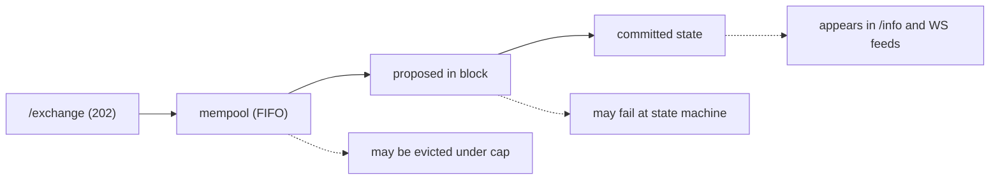
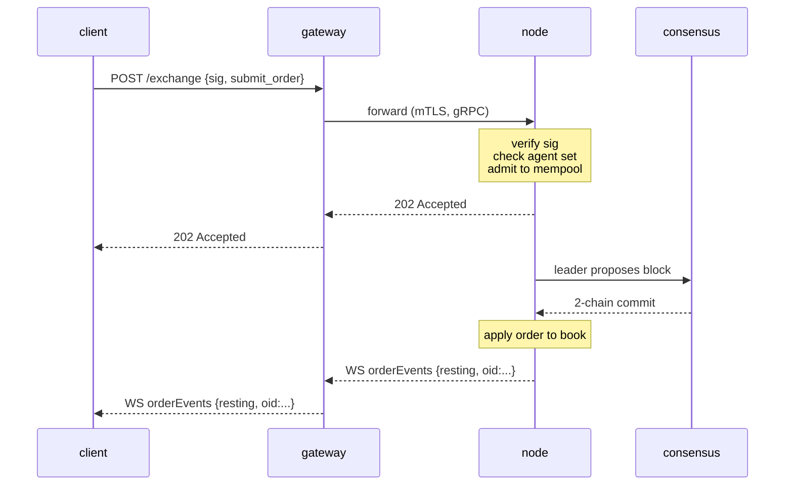

# `POST /exchange` — 提交签名操作

:::info
**状态。** 对于列出的操作变体为 **稳定** 状态。端点形状已承诺用于 V1。
:::

## TL;DR

每个状态变化的 **用户** 操作 — 下单、取消、金库存入、代理批准、质押等 — 都是一个单一的 EIP-712 签名 JSON 信封，发送到 `POST /exchange`。操作变体由 `type` 字段选择。**订单** 返回 `200 OK`，带有同步分配的 `oid`（处理程序等待提交）；每个 **其他** 操作在录入时返回 `202 Accepted`，提交确认通过 [WS 源](../ws/subscriptions.md) 或轮询到达。

:::warning
**仅限用户操作。** `/exchange` 是公共 **用户** 写入路径。特权/系统写入 — 预言机价格提交、水龙头积分、`SystemUserModify`、`SystemSpotSend`、验证器投票 — 永远 **不在** `/exchange` 上。它们通过由验证器权限控制的节点本地队列注入（参见 [非桥接表](#non-bridged-actions) 和 [水龙头](./faucet.md#why-this-is-not-on-exchange)）。发送系统操作的本机标签返回 `400 unsupported action`。
:::

## URL

```
POST  https://<net>-gateway.mtf.exchange/exchange
```

| 路径 | 线路形状 |
|------|-----------|
| `POST /exchange`（网关默认） | **MTF 本机**（本文档） |
| `POST /hl/exchange`（网关，在 `/hl` 下） | **HL 兼容** — 见 [hl-compat.md](./hl-compat.md) |

MTF 本机是网关的默认路径；HL 兼容在 `/hl/*` 下进行命名。自己运行节点，相同的本机 `/exchange` 直接在 `http://localhost:8080` 上提供。

## 请求信封

```json
{
  "signature": "0xabcd...1b",
  "nonce":     1735689600001,
  "action": {
    "type": "submit_order",
    "order": { /* 以下变体之一 */ }
  }
}
```

| 字段 | 类型 | 必需 | 描述 |
|-------|------|----------|-------------|
| `signature` | hex 字符串，65 字节（130 十六进制字符；`0x` 可选） | 是 | secp256k1 ECDSA 在 EIP-712 [类型数据摘要](#signing) 上的操作结构化字段 + `nonce`。`r ‖ s ‖ v`。既接受旧版 `v ∈ {27, 28}` 也接受 EIP-2098 `v ∈ {0, 1}`。 |
| `nonce` | uint64 | 是 | 每个行为者严格单调。按惯例 `Date.now()`。绑定到签名摘要。参见 [幂等性](../../integration/idempotency.md)。 |
| `action` | 对象 | 是 | 标记的变体：`{ "type": "<snake_case_tag>", ... }`。参见下面的 [操作目录](#action-catalog)。 |

:::info
**无顶级 `sender`。** 信封没有 `sender` 字段。其状态变化的账户由每个操作确定：
- **所有者声称操作** (`submit_order`, `cancel_order`) 在操作体内携带所有者 — `action.order.owner` / `action.cancel.owner`。服务器从签名中恢复签名者，并要求它等于该 `owner` **或** 其已批准的 [代理](../../concepts/agent-wallets.md)。
- **发送者授权操作**（治理、保证金、金库领导者、质押等）完全不携带所有者字段：恢复的签名者 *就是* 行为者，操作级授权（验证器成员资格、金库领导者等）在分派时运行。
:::

服务器从 `action.type` + `action.params` 重建 EIP-712 类型结构，并在 **那些字段值** 上恢复签名者 — 所以你发送的 `action.params` 必须携带你放在签名的类型消息中 **相同的值**（和相同的规范十进制字符串）。不匹配会恢复不同的签名者，请求被拒绝 `401`。参见 [类型数据签名](../../integration/typed-data-signing.md)。

## 签名

签名是在标准 EIP-712 摘要上的 secp256k1 ECDSA 恢复。每个操作被签名为 **结构化 EIP-712 类型数据** (`eth_signTypedData_v4`)，每个操作有一个主类型 `MetaFluxTransaction:<Action>`，所以钱包按名称呈现每个字段。服务器从 `action.type` + `action.params` 重建类型结构，重新计算摘要，并恢复签名者：

```
struct_hash = keccak256( typeHash(MetaFluxTransaction:<Action>) ‖ encodeData(fields) )
signed_hash = keccak256( 0x1901 ‖ domain_separator ‖ struct_hash )
```

其中域分隔符是：

```
domain_separator = keccak256(
  keccak256("EIP712Domain(string name,string version,uint256 chainId,address verifyingContract)") ‖
  keccak256("MetaFlux") ‖
  keccak256("1") ‖
  chainId_as_uint256_be ‖
  address_zero_padded_to_32
)
```

每个操作的类型字符串、原子 `encodeData` 规则和有序示例在 [类型数据签名](../../integration/typed-data-signing.md) 中 — 唯一的签名方案。跨实现的已知答案测试针对每个操作的摘要进行。

:::info
**`sig_scheme` 是残留的。** 早期构建在信封上进行了 `sig_scheme` 选择器；现在不再需要，服务器忽略它（类型数据恢复无条件运行）。 **省略它。** 如果存在，唯一接受的值是 `"typed"`。
:::

### 链 ID

| 网络 | `chainId` |
|---------|-----------|
| Devnet（默认） | `31337` |
| Testnet | `114514` |
| Mainnet | `8964` |

签名域 `chainId` **必须等于节点的共识 `chain_id`** — 通过 [`/info` `node_info`](./info.md#node_info)（`data.chain_id`）查询并使用该精确值。针对错误 `chainId` 签名返回 `401`，因为恢复的地址与操作的 `owner` 不同（或者，对于发送者授权的操作，恢复一个通过任何授权检查的幻影地址）。参见 [网络](../../networks.md) 了解端点。

## 数值约定

| 类型 | 线路形式 | 为什么 |
|------|----------|-----|
| `uint64` ≤ 2^53 | JSON 数字 | IEEE-754 中安全 |
| `uint64` > 2^53, `u128`，缩放整数 | JSON 字符串 | 本机 JSON 数字在 2^53 之后会无声地失去精度 |
| 地址 | hex 字符串 `"0x..."` | 20 字节，40 十六进制字符（有或没有 `0x`） |
| 布尔值 | `true` / `false` | 字面 JSON |
| 可选字段 | `null` 或省略 | 两者都接受；`null` 是规范 |

**固定点字段。** 价格和大小字段是 8 十进制固定点整数；USDC 金额是 6 十进制基本单位。值携带比例，而不是字段名 — 例如 `px = "10050000000"` 意味着 `100.50`。始终作为字符串发送；服务器解析到 `u128`。

## 签名者语义

大多数操作可以由 **主账户或** 活跃 [代理钱包](../../concepts/agent-wallets.md) 签名。一个子集是 **仅限主账户** — 代理被明确拒绝提款权限和账户管理权限。

| 能力类别 | 主账户可以签署吗？ | 代理可以签署吗？ |
|------------------|:----------------:|:---------------:|
| 下单/取消/修改订单 | 是 | 是 |
| 更新杠杆/保证金模式 | 是 | 是 |
| 金库存入/提取 | 是 | 是 |
| 子账户创建 | 是 | 否 |
| 子账户转账 | 是 | 否 |
| 代理批准/撤销 | 是 | 否 |
| 外部提款（USDC、现货） | 是 | 否 |
| 转换为多签 | 是 | 否 |
| 多签包装器 | （特殊 — 见 [多签](../../concepts/multi-sig.md)） | 否 |

每个操作在 [目录](#action-catalog) 中的条目明确列出其签名者规则。

---

## 操作目录

每个变体是一个标记的对象 `{ "type": "<snake_case_tag>", <flat body> }`。体键在 **操作对象下平平的**（没有 PascalCase `type`，也没有通用 `params` 包装器） — 例如 `submit_order` 携带一个 `order` 对象，`cancel_order` 携带一个 `cancel` 对象，发送者授权的操作携带一个 `params` 对象。点击即可查看字段级表。

:::warning
**`px` / `size` 是本机线路上的无符号固定点 `u64`**，作为 JSON 数字发送（节点将它们解码为 `u64`，然后在内部扩展）。这与 HL 兼容路径（十进制字符串）不同。地址是 `0x` 十六进制（40 个字符）；`cloid` 是 `0x` + 32 十六进制字符（16 字节）。
:::

### 订单放置和生命周期

| `type` | 目的 | 签名者 | 幂等 |
|--------|---------|-----------|-----------|
| [`submit_order`](#submit_order) | 下一个订单 | 所有者/代理 | 由 `cloid` |
| [`batch_order`](#batch_order) | N 个订单/一个签名 | 所有者/代理 | 每条腿 `cloid` |
| [`cancel_order`](#cancel_order) | 按 `oid` 取消 | 所有者/代理 | 是 |
| [`batch_cancel`](#batch_cancel) | N 个取消/一个签名 | 所有者/代理 | 是 |
| [`cancel_by_cloid`](#cancel_by_cloid) | 按客户订单 id 取消 | 发送者/代理 | 是 |
| [`cancel_all_orders`](#cancel_all_orders) | 取消全部（可选资产过滤） | 发送者/代理 | 是 |
| [`modify`](#modify) | 修改休息订单的 px/大小 | 发送者/代理 | 是 |
| [`batch_modify`](#batch_modify) | N 个修改/一个签名 | 发送者/代理 | 每条条目 |
| [`schedule_cancel`](#schedule_cancel) | 未来块取消全部触发 | 发送者/代理 | 是 |
| [`twap_order`](#twap_order) | 安排切片（TWAP）订单 | 发送者/代理 | 由 `twap_id` |
| [`twap_cancel`](#twap_cancel) | 取消运行中的 TWAP 父项 | 发送者/代理 | 是 |

### 现货交易

现货是一个代币对代币 CLOB（无杠杆、无头寸） — 与永续分开的账本和余额。休息现货订单将其在成交时欠下的资金锁定到 **预留余额**：`bid` 预留 **报价**（其在限价的名义价值），`ask` 预留其提供的 **基础**。订单大小在录入时被 **限制到** 你的余额可以资助的金额，费用从每一方收取。两个操作都是 **发送者授权的**（签名者是交易者；没有 `owner`）。参见 [现货交易](../../concepts/spot-trading.md) 了解完整的概念模型。

| `type` | 目的 | 签名者 | 幂等 |
|--------|---------|-----------|-----------|
| [`spot_order`](#spot_order) | 放置一个现货订单 | 发送者/代理 | 由 `cloid` |
| [`spot_cancel`](#spot_cancel) | 按 `oid` 取消休息现货订单 | 发送者/代理 | 是 |

### 现货保证金和赚取

:::info
**在 devnet 上可用（预览）。** 杠杆现货 ([现货保证金](../../concepts/spot-margin.md)) 及其借出供应方 ([赚取](../../concepts/earn.md)) 在 **devnet 上端到端运行**：存入抵押品、从赚取池借入、IOC 买入基础资产，然后关闭以偿还。将其视为 **预览** — 强制清算结算尚未通过（强制关闭不会实现 PnL 或减少未平仓利息），按对保证金率是仍在校准的治理参数。不要假设生产安全规模。
:::

杠杆现货头寸是 **按 `(account, pair)` 隔离的**：发布的报价抵押品是纯损失缓冲，买入 100% 由从对的赚取池中提取的报价借入资助，所购基础资产被 **隔离** 持有在保证金账户上（从不在你的可用余额中）。赚取是另一方 — 供应商为池股份存入可借出的报价，借出利息现货保证金交易者支付会提升每股的价值。所有六个操作都是 **发送者授权的**（签名者是行为者；没有 `owner`）。`amount` / `shares` / `borrow` 是作为 JSON 字符串发送的十进制；`size` / `limit_px` 是 `u64` 在 `1e8` / 原始批次平面上，就像 [`spot_order`](#spot_order)。每个都返回 [`202 Accepted`](#202-accepted--non-order-admission) 录入信封（而不是同步 `oid`）；通过 [`/info` `spot_margin_state`](./info.md#spot_margin_state) 和 [`earn_state`](./info.md#earn_state) 观察提交的结果。

| `type` | 目的 | 签名者 | 幂等 |
|--------|---------|-----------|-----------|
| [`spot_margin_deposit`](#spot_margin_deposit) | 为对发布报价抵押品 | 发送者/代理 | 否 |
| [`spot_margin_withdraw`](#spot_margin_withdraw) | 提取自由抵押品 | 发送者/代理 | 否 |
| [`spot_margin_open`](#spot_margin_open) | 借入 + IOC 买入基础资产杠杆 | 发送者/代理 | 否 |
| [`spot_margin_close`](#spot_margin_close) | 出售持有的基础资产，偿还贷款 | 发送者/代理 | 否 |
| [`earn_deposit`](#earn_deposit) | 为股份将报价供应到借出池 | 发送者/代理 | 否 |
| [`earn_withdraw`](#earn_withdraw) | 赎回池股份（空闲界限） | 发送者/代理 | 否 |

### 保证金和风险

| `type` | 目的 | 签名者 |
|--------|---------|-----------|
| [`update_leverage`](#update_leverage) | 更改资产的杠杆/隔离切换 | 发送者/代理 |
| [`update_isolated_margin`](#update_isolated_margin) | 签名隔离保证金增量 | 发送者/代理 |
| [`top_up_isolated_only_margin`](#top_up_isolated_only_margin) | 严格隔离保证金充值 | 发送者/代理 |
| [`user_portfolio_margin`](#user_portfolio_margin) | 注册/注销 PM | 发送者/代理 |

### 账户管理

| `type` | 目的 | 签名者 |
|--------|---------|-----------|
| [`approve_agent`](#approve_agent) | 批准代理钱包 | 发送者/代理 |
| [`set_display_name`](#set_display_name) | 设置账户句柄 | 发送者/代理 |
| [`set_referrer`](#set_referrer) | 绑定到推荐人地址 | 发送者/代理 |
| [`approve_builder_fee`](#approve_builder_fee) | 批准建筑商费用上限 | 发送者/代理 |
| [`create_sub_account`](#create_sub_account) | 在发送者下打开子账户 | 发送者/代理 |
| [`sub_account_transfer`](#sub_account_transfer) | 移动 perp 交叉抵押品父级 ↔ 子级 | 发送者/代理 |
| [`sub_account_spot_transfer`](#sub_account_spot_transfer) | 移动现货代币余额父级 ↔ 子级 | 发送者/代理 |
| [`convert_to_multi_sig_user`](#convert_to_multi_sig_user) | 将账户提升为多签 | 发送者/代理 |
| [`set_position_mode`](#set_position_mode) | 切换单向/对冲头寸模式 | 发送者/代理 |

### 质押和抽象

| `type` | 目的 | 签名者 |
|--------|---------|-----------|
| [`c_deposit`](#c_deposit) | 将现货 MTF 移动到自由质押余额 | 发送者/代理 |
| [`c_withdraw`](#c_withdraw) | 将自由质押余额移回现货 MTF | 发送者/代理 |
| [`token_delegate`](#token_delegate) | 委托/撤销委托质押 | 发送者/代理 |
| [`claim_rewards`](#claim_rewards) | 声称质押奖励 | 发送者/代理 |
| [`link_staking_user`](#link_staking_user) | 为质押目标设置别名 | 发送者/代理 |
| [`user_dex_abstraction`](#user_dex_abstraction) | 切换用户 DEX 抽象标志 | 发送者/代理 |
| [`user_set_abstraction`](#user_set_abstraction) | 自我范围抽象配置 | 发送者/代理 |
| [`agent_set_abstraction`](#agent_set_abstraction) | 代理范围抽象配置 | 发送者/代理 |
| [`priority_bid`](#priority_bid) | 支付优先费用进行块前放置 | 发送者/代理 |

### 加密订单

| `type` | 目的 | 签名者 |
|--------|---------|-----------|
| [`submit_encrypted_order`](#submit_encrypted_order) | 阈值加密订单密文 | 发送者/代理 |

### 金库和元流动性

| `type` | 目的 | 签名者 |
|--------|---------|-----------|
| [`create_vault`](#create_vault) | 领导者创建金库 | 发送者/代理 |
| [`vault_transfer`](#vault_transfer) | 领导者种子转账 | 发送者/代理 |
| [`vault_modify`](#vault_modify) | 仅限领导者金库配置更新 | 发送者/代理 |
| [`vault_withdraw`](#vault_withdraw) | 跟随者股份赎回 | 发送者/代理 |
| [`REDACTED`](#REDACTED) | MLP 白名单投票 | 验证器密钥 |
| [`REDACTED`](#REDACTED) | 注册/撤销策略运营商 | 金库领导者 |

### 桥接提取

外部提取通过 [MetaBridge](../../bridge/index.md) 离开链。操作是 **发送者授权的**：恢复的签名者是被借记的账户，所以提取权限有效上是 **仅限主账户** — 代理签名将作用于代理自己的（单独的）账户，永远不是主账户的。

| `type` | 目的 | 签名者 |
|--------|---------|-----------|
| [`core_evm_transfer`](#core_evm_transfer) | 将 USDC 从核心账本移动到 MetaFluxEVM | 发送者（主账户） |
| [`mb_withdraw`](#mb_withdraw) | 将 USDC 交叉抵押品提取到外部链 | 发送者（主账户） |

### 不在公共 `/exchange` 路径上

这些操作名称出现在早期草稿中（有些在 HL 兼容表面），但它们 **不在 MTF 本机 `/exchange` 处理程序上桥接**。它们要么是特权/系统写入，必须永远不通过公共用户路径，要么是被识别但未映射的模式存根。发布它们返回 `400 unsupported action`。参见下面的 [表](#non-bridged-actions) 了解每个的处置。

| 草稿名称 | 本机标签（如果被识别） | 为什么不桥接 |
|-----------|----------------------------|-----------------|
| `ScaleOrder` | — | 没有本机操作；在客户端梯形成 `batch_order` |
| `UpdateMarginMode` | — | 没有本机操作；隔离是 `update_leverage` 上的 `is_isolated` 标志 |
| `MultiSig` | — | 多签收集和执行包装器不桥接（预览/不执行 — 账户 *通过* `convert_to_multi_sig_user` 注册） |
| `RegisterReferrer` | — | 不桥接（推荐人通过 `set_referrer` 地址绑定） |
| `UsdcTransfer` / `SpotTransfer` | — | 用户对用户转账流不桥接 |
| `WithdrawUsdc` | — | 草稿名称；外部提取是 [`mb_withdraw`](#mb_withdraw) |
| `BorrowLend` | — | 不桥接 |
| `REDACTED` | — | 验证器/系统操作；通过共识路径，永不 `/exchange` |
| `RfqQuote` / `RfqAccept` | `rfq_request` / `rfq_accept` | 被识别但未映射的存根 → `unsupported action` |
| `FbaOrder` | `fba_submit` | 被识别但未映射的存根 → `unsupported action` |
| （金库分发） | `vault_distribute` | 部分/存根处理程序；不在 `/exchange` 上桥接 |
| （PM 生命周期） | `pm_enroll` / `pm_unenroll` / `pm_rebalance` | 被识别但未映射的存根 → `unsupported action` |
| （跨链） | `cross_chain_send` | 被识别但未映射的存根 → `unsupported action` |
| （加密提交替代） | `encrypted_order_submit` | 存根；使用 [`submit_encrypted_order`](#submit_encrypted_order) 代替 |

---

### `submit_order`

放置一个订单。订单体在 `action.order` 下携带；`owner` 是声明的账户（服务器要求恢复的签名者等于它或是其批准的代理）。要在一个签名下下许多订单，使用 [`batch_order`](#batch_order)。

```json
{
  "type": "submit_order",
  "order": {
    "owner":       "0x00000000000000000000000000000000000000aa",
    "market":       7,
    "side":         "bid",
    "kind":         "limit",
    "size":         100000000,
    "limit_px":     10050000000,
    "tif":          "gtc",
    "stp_mode":     "cancel_oldest",
    "reduce_only":  false,
    "cloid":        "0xabababababababababababababababab",
    "builder":      { "fee": 5, "user": "0x00000000000000000000000000000000000000ff" },
    "position_side": "long"
  }
}
```

| 字段 | 类型 | 范围/值 | 描述 |
|-------|------|----------------|-------------|
| `owner` | hex 地址 | 40 十六进制字符 | 声明的账户；必须等于恢复的签名者或其批准的代理。仅线路 — 在降低时丢弃 |
| `market` | uint32 | `[0, market_count)` | 资产/市场 id（身份映射到 `AssetId`） |
| `side` | 枚举 | `"bid"` / `"ask"` | — |
| `kind` | 枚举 | `"limit"` / `"market"` / `"stop_loss"` / `"take_profit"` | `limit` / `market` 下一个现场订单。`stop_loss` / `take_profit` 仅在也存在 `trigger` 块时 **才接受** — 该对停泊一个单一的仅减少 TP/SL 腿（参见 [触发订单](#trigger-orders-stop_loss--take_profit)）；没有 `trigger` 块的 `stop_loss` / `take_profit` *被拒绝*（`unsupported order kind`） |
| `trigger` | 对象 \| null | — | 可选 [触发块](#trigger-orders-stop_loss--take_profit)。其存在 — **在任何** `kind` 上 — 将这个 `submit_order` 转变为一个停泊的仅减少 TP/SL 腿，而不是现场订单：`{ "trigger_px": <u64>, "is_market": <bool>, "tpsl": "tp" \| "sl" }` |
| `size` | uint64 | `> 0` | 固定点刻度单位（扩展到 `u128`） |
| `limit_px` | uint64 | `> 0` | 固定点刻度单位（扩展到 `i128`） |
| `tif` | 枚举 | `"gtc"`, `"ioc"`, `"alo"` | `"aon"` 被拒绝（`unsupported time-in-force` — 无核心等价物） |
| `stp_mode` | 枚举 | `"cancel_oldest"`, `"cancel_newest"`, `"cancel_both"` | `"reject"` 被拒绝（`unsupported stp_mode` — 无核心等价物） |
| `reduce_only` | 布尔值 | — | 如果为真，在提交时被拒绝，如果它会增长头寸 |
| `cloid` | hex 字符串 \| null | `0x` + 32 十六进制字符（16 字节） | 可选客户订单 id；启用 `cancel_by_cloid` 和去重 |
| `builder` | 对象 \| null | — | 可选建筑商费用雕刻：`{ "fee": <bps u16>, "user": <0x-hex address> }` |
| `position_side` | 枚举 \| null | `"long"` / `"short"` | **[对冲模式](../../concepts/hedge-mode.md) 仅限。** 订单的目标腿。**在单向账户上省略**（默认值），**在对冲账户上发送** — 发送它的单向账户或省略它的对冲账户被拒绝。`reduce_only` 仅针对命名腿评估。参见下面的 [对冲模式](#position_side-hedge-mode) |

**幂等性**：对同一账户的重复 `cloid` 在录入时被拒绝，带有 `error: "duplicate cloid"`。使用 `cloid` 作为你的客户端去重键。

**常见错误**：`px` 不刻度对齐、`size` 低于市场最低值、`reduce_only` 会增长头寸、通过 STP 拒绝 `stp`、账户在 T1+ 清算层。

**响应状态条目**（每个订单，按顺序 — 参见下面 [响应 → 200 OK](#200-ok--order-path-synchronous-oid) 的完整联合）：

```json
{"resting": {"oid": 12345, "cloid": "0x..."}}                       // 发布到账本
{"filled":  {"oid": 12345, "total_sz": "100000000", "avg_px": "10050000000"}}
{"error":   "<reason>"}                                             // 提交/录入拒绝了这个条目
{"pending": {"action_hash": "0x...", "nonce": 1735689600001}}       // 录入，等待窗口中没有提交
```

#### `position_side`（对冲模式）

订单体上的可选 `position_side` 字段在账户处于 [对冲模式](../../concepts/hedge-mode.md) 时选择订单应用于哪条腿。

- **单向账户（默认）：** **省略** `position_side`。在单向账户上发送它被拒绝。
- **对冲账户：** `position_side` **必需** 在每个订单上（`"long"` 或 `"short"`）。在对冲账户上省略它被拒绝。

腿被明确选择 — 它 **永不推断** 来自 `side` — 所以一个意在 *减少空头* 的 `bid` 永不会意外打开或增长多头。当 `reduce_only` 被设置时，它 **仅针对命名腿评估**：`short` 上的 `reduce_only` 订单永不能触及 `long` 腿，反之亦然。没有隐含翻转 — 关闭多头腿永不打开空头。

| `side` | `position_side` | `reduce_only` | 效果（对冲账户） |
|--------|-----------------|---------------|------------------------|
| `bid` | `long` | false | 打开/添加到多头腿 |
| `ask` | `long` | true | 减少/关闭多头腿 |
| `ask` | `short` | false | 打开/添加到空头腿 |
| `bid` | `short` | true | 减少/关闭空头腿 |

使用 [`set_position_mode`](#set_position_mode) 将账户切换到对冲模式（平缓）。

#### 触发订单（`stop_loss` / `take_profit`）

单条腿保护性触发（止损或获利止单）表示为一个 `submit_order`，其 `order` 体携带一个 `trigger` 块。块的 **存在** — 而不是 `kind` — 是将其路由的内容：订单是 **停泊的** 在规范触发注册表中，而不是转到账本，并在标记价格穿过 `trigger_px` 时作为 **仅减少 IOC** 后来触发。

```json
{
  "type": "submit_order",
  "order": {
    "owner":       "0x00000000000000000000000000000000000000aa",
    "market":       7,
    "side":         "ask",
    "kind":         "take_profit",
    "size":         50000000,
    "limit_px":     0,
    "tif":          "ioc",
    "stp_mode":     "cancel_oldest",
    "reduce_only":  false,
    "trigger":     { "trigger_px": 4200000000000, "is_market": true, "tpsl": "tp" }
  }
}
```

| 字段 | 类型 | 范围/值 | 描述 |
|-------|------|----------------|-------------|
| `trigger.trigger_px` | uint64 | `> 0` | 触发价格在固定点刻度单位中（扩展到 `i128`）。停泊的腿在 **这个价格** 停泊 — 它被重新用作触发腿的价格（订单自己的 `limit_px` 被触发忽略） |
| `trigger.is_market` | 布尔值 | — | 建议标签（`true` = 触发的腿是市场/IOC）。停泊路径总是触发仅减少 IOC 无论如何；为读取路径保真而携带，不是控制 |
| `trigger.tpsl` | 枚举 | `"tp"` / `"sl"` | 建议获利止单/止损标签。执行者从腿 `side` vs 标记推断触发方向；这在 `/info` 中显示，不是控制 |

语义：

- **强制仅减少。** 触发腿总是关闭 — 它永不能打开或增长头寸 — 不管订单自己的 `reduce_only` 线路值。
- **腿 `side` 选择什么被保护。** `ask` 触发关闭多头；`bid` 触发关闭空头。在 [对冲账户](#position_side-hedge-mode) 上，携带 `position_side` 来命名腿，正好如同现场订单。
- **`trigger_px` 是停泊价格**，不是订单的 `limit_px` — 如你所愿发送 `limit_px`（`0` 很好）；触发块的价格是被使用的。
- **OCO。** 一起分组的触发腿在触发时折叠（触发的腿退休；其兄弟被取消）。

录入返回与现场 `submit_order` 相同的每个订单状态联合。停泊并报告通过订单路径的触发；最终触发是一个提交的效果在 [WS 源](../ws/subscriptions.md) / `/info` 上可观察。多腿进入加保护篮子使用 [`batch_order`](#batch_order) 带 `grouping: "normalTpsl"` / `"positionTpsl"`。

---

### `batch_order`

N 个订单由一个签名的信封/一个 nonce 携带。每个条目是一个完整的 [`submit_order`](#submit_order) 订单体（相同的字段，包括每个订单 `owner` / `cloid` / `builder`）。

```json
{
  "type": "batch_order",
  "params": {
    "orders": [
      { "owner": "0x...aa", "market": 1, "side": "bid", "kind": "limit",
        "size": 1000, "limit_px": 5000, "tif": "gtc",
        "stp_mode": "cancel_oldest", "reduce_only": false },
      { "owner": "0x...aa", "market": 2, "side": "ask", "kind": "limit",
        "size": 2000, "limit_px": 6000, "tif": "gtc",
        "stp_mode": "cancel_oldest", "reduce_only": false }
    ],
    "grouping": "na"
  }
}
```

| 字段 | 类型 | 值 | 描述 |
|-------|------|--------|-------------|
| `orders[*]` | 订单 | — | 每个条目有完整的 `submit_order` 订单形状 |
| `grouping` | 枚举 | `"na"`, `"normalTpsl"`, `"positionTpsl"` | 订单族分组；如果省略，默认为 `"na"` |

返回每条腿状态的数组（与 `submit_order` 相同的联合）。

---

### `cancel_order`

按 `oid` 取消单个订单。取消体在 `action.cancel` 下；`owner` 是声明的账户（恢复的签名者必须等于它或是批准的代理）。对于一个签名下的许多取消，使用 [`batch_cancel`](#batch_cancel)。

```json
{
  "type": "cancel_order",
  "cancel": {
    "owner":  "0x00000000000000000000000000000000000000aa",
    "market": 3,
    "oid":    12345
  }
}
```

| 字段 | 类型 | 描述 |
|-------|------|-------------|
| `owner` | hex 地址 | 声明的账户；仅线路 |
| `market` | uint32 | 资产/市场 id |
| `oid` | uint64 | 服务器订单 id（在 `submit_order` 响应中返回）。**必需** — 仅带 `cloid` 的取消被拒绝（`cancel requires an oid`）；使用 [`cancel_by_cloid`](#cancel_by_cloid) 代替 |
| `cloid` | hex 字符串 \| null | 在线路上接受但 **未** 用于此处取消 |

**幂等的**：对已取消/已成交订单的取消返回 `{"error":"order not found"}` 并是无害的。

---

### `batch_cancel`

N 个取消由一个签名的信封携带。每个条目是一个 [`cancel_order`](#cancel_order) 取消体（每个条目需要一个 `oid`；仅 cloid 的条目被拒绝）。

```json
{
  "type": "batch_cancel",
  "params": {
    "cancels": [
      { "owner": "0x...aa", "market": 1, "oid": 10 },
      { "owner": "0x...aa", "market": 2, "oid": 11 }
    ]
  }
}
```

与 `cancel_order` 相同的每个条目响应形状。

---

### `cancel_by_cloid`

按客户订单 id 取消。有用的时候调用者还没有看到服务器端 `oid`（`submit_order` 响应和取消决定之间的竞争）。这是一个 **发送者授权的** 操作（没有 `owner` 字段 — 恢复的签名者是行为者）。

```json
{
  "type": "cancel_by_cloid",
  "params": {
    "asset": 7,
    "cloid": "0xabababababababababababababababab"
  }
}
```

| 字段 | 类型 | 描述 |
|-------|------|-------------|
| `asset` | uint32 | 资产/市场 id |
| `cloid` | hex 字符串 | `0x` + 32 十六进制字符（16 字节） |

与 `cancel_order` 相同的响应形状。

---

### `cancel_all_orders`

取消发送者的所有休息订单，可选地过滤到一个资产。

```json
{
  "type": "cancel_all_orders",
  "params": { "asset": 3 }
}
```

| 字段 | 类型 | 描述 |
|-------|------|-------------|
| `asset` | uint32 \| null | `null` / 省略 = 所有资产；`Some(a)` = 仅资产 `a` |

返回取消订单的计数。

---

### `modify`

修改休息订单的价格和/或大小到位。至少一个 `new_px` / `new_size` 必须存在。目标订单通过 **`oid` 寻址** 或 **`cloid` 通过** （订单被下时的客户订单 id） — 发送一个或另一个。

```json
{
  "type": "modify",
  "params": {
    "market":   3,
    "oid":      12345,
    "new_px":   10049000000,
    "new_size": 100000000
  }
}
```

通过 `cloid` 而不是 `oid` 寻址（省略 `oid` 或保持它 `0`）：

```json
{
  "type": "modify",
  "params": {
    "market":       3,
    "cloid":        "0xabababababababababababababababab",
    "new_px":       10049000000,
    "always_place": true
  }
}
```

| 字段 | 类型 | 描述 |
|-------|------|-------------|
| `market` | uint32 | 资产/市场 id |
| `oid` | uint64 | 目标订单 id。默认为 `0`（= 通过 `cloid` 寻址）当省略 |
| `cloid` | hex 字符串 \| null | `0x` + 32 十六进制字符（16 字节）。设置时，目标由客户订单 id 解决（与 [`cancel_by_cloid`](#cancel_by_cloid) 使用的相同解决器）而不是 `oid`。格式不正确的 `cloid` 在录入时被拒绝 |
| `new_px` | uint64 \| null | 新价格在固定点刻度单位中（`null` / 省略 = 不变） |
| `new_size` | uint64 \| null | 新大小在固定点刻度单位中（`null` / 省略 = 不变） |
| `always_place` | 布尔值 | 当 `true` 时，不再休息的目标是尽力无操作而不是拒绝。默认为 `false` |

返回单个修改状态。

---

### `batch_modify`

在一个签名下应用 N 个 `modify`。每个条目有与 `modify.params` 相同的形状。

```json
{
  "type": "batch_modify",
  "params": {
    "modifications": [
      { "market": 1, "oid": 5, "new_px": 100, "new_size": null },
      { "market": 2, "oid": 6, "new_px": null, "new_size": 7 }
    ]
  }
}
```

| 字段 | 类型 | 描述 |
|-------|------|-------------|
| `modifications[*]` | 修改 | 每个条目有完整的 [`modify`](#modify) params 形状（`market`, `oid`, 可选 `new_px` / `new_size`） |

**响应。** 非订单操作 → [`202 Accepted` 录入信封](#202-accepted--non-order-admission)：

```json
{ "accepted": true, "mempool_depth": 3, "nonce": 1735689600001, "action_hash": "0x..." }
```

**在提交时** 条目按 **输入顺序** 应用并 **不是全有或全无**：每个修改独立地应用或以原因错误（提交结果携带一个状态每条目，按输入顺序，加上应用的计数）。HTTP 响应不携带每个条目的状态 — 通过返回的 `action_hash` 跟踪提交。一个空 `modifications` 数组被拒绝（`empty batch`）；超过 **1000** 条目被拒绝（受限）；一个条目带 `new_px` 和 `new_size` 两者 null 错误（`nothing to modify`）。

---

### `schedule_cancel`

武装一个未来块取消全部：在 `cancel_at_block`，发送者的所有开放订单被取消（死人开关）。

```json
{
  "type": "schedule_cancel",
  "params": { "cancel_at_block": 999 }
}
```

| 字段 | 类型 | 描述 |
|-------|------|-------------|
| `cancel_at_block` | uint64 | 发送者的开放订单被取消的块高度 |

---

### `twap_order`

安排一个切片（时间加权）订单。父级被切片成 `slice_count` 个子订单间隔 `delay_ms` 分开。

```json
{
  "type": "twap_order",
  "params": {
    "market":      4,
    "side":        "ask",
    "total_size":  1000000000,
    "slice_count": 10,
    "delay_ms":    500,
    "reduce_only": true
  }
}
```

| 字段 | 类型 | 描述 |
|-------|------|-------------|
| `market` | uint32 | 资产/市场 id |
| `side` | 枚举 | `"bid"` / `"ask"` |
| `total_size` | uint64 | 总大小在固定点刻度单位中（扩展到 `u128`） |
| `slice_count` | uint32 | 子切片的数量（`> 0`） |
| `delay_ms` | uint64 | 切片间延迟（毫秒） |
| `reduce_only` | 布尔值 | — |

**响应。** 非订单操作 → [`202 Accepted` 录入信封](#202-accepted--non-order-admission)：

```json
{ "accepted": true, "mempool_depth": 1, "nonce": 1735689600001, "action_hash": "0x..." }
```

父 `twap_id`（uint64）在提交时从一个确定性的每链计数器 **分配** 并在提交结果中携带 — 它 **不在** HTTP 响应中。通过返回的 `action_hash` 跟踪提交。零 `total_size` 或零 `slice_count` 在提交时错误。切片事件乘坐 [`user_events` WS 通道](../ws/subscriptions.md)（一个专用的 `twap*` 流是路线图）。

---

### `twap_cancel`

取消运行中的 TWAP 父级。已成交的切片保持成交；未来切片停止。

```json
{
  "type": "twap_cancel",
  "params": { "twap_id": 17 }
}
```

| 字段 | 类型 | 描述 |
|-------|------|-------------|
| `twap_id` | uint64 | `twap_order` 返回的 TWAP 父级 id |

---

### `spot_order`

在 **现货** 市场上下一个订单。现货交易是一个没有杠杆和没有头寸的代币对代币掉期；账本和余额与 perps 完全分开。订单体在 `action.order` 下携带。现货订单是 **发送者授权的** — 恢复的签名者是交易者，所以 **没有 `owner` 字段**。`pair` 是 **现货对 id**（`SpotPairSpec.pair_id`），这与 perp `market` id 和代币 id 不同。

```json
{
  "type": "spot_order",
  "order": {
    "pair":      200,
    "side":      "bid",
    "size":      100000000,
    "limit_px":  200000000,
    "tif":       "gtc",
    "stp_mode":  "cancel_oldest",
    "cloid":     "0xabababababababababababababababab"
  }
}
```

| 字段 | 类型 | 范围/值 | 描述 |
|-------|------|----------------|-------------|
| `pair` | uint32 | 活跃现货对 | 现货对 id（`SpotPairSpec.pair_id`） — **不是** 代币 id |
| `side` | 枚举 | `"bid"` / `"ask"` | `bid` 买入基础（支付报价）；`ask` 出售基础（接收报价） |
| `size` | uint64 | `> 0` | 基础资产大小在原始批次中（`10^sz_decimals` 每个整个单位）；扩展到 `u128` |
| `limit_px` | uint64 | `> 0` | 限价在 `1e8` 平面。市场订单（`0`） **尚不支持** — 总是发送一个限制 |
| `tif` | 枚举 | `"gtc"`, `"ioc"`, `"alo"` | `gtc` / `alo` 残余 **休息**（托管支持）；`ioc` 永不休息。`"aon"` 被拒绝 |
| `stp_mode` | 枚举 | `"cancel_oldest"`, `"cancel_newest"`, `"cancel_both"` | 自交易防止。`"reject"` 被拒绝（无核心等价物） |
| `cloid` | hex 字符串 \| null | `0x` + 32 十六进制字符（16 字节） | 可选客户订单 id |

**托管。** 一个休息现货订单（一个 `gtc` / `alo` 残余）锁定它在成交时欠下的资金到一个预留余额：`bid` 预留 **报价**（其在限价的名义价值），`ask` 预留它提供的 **基础**。预留资金不可支出；它们在成交时支付给对手，或在取消、自交易防止或市场停用时退款给你。每代币余额被精确保守。

**可支付性。** 订单大小在录入时被 **限制到** 你能资助的（买方由 `quote_balance ÷ limit_px`；卖方由你拥有的基础）。一个完全无法支付的订单是一个被接受的无操作（没有成交，没有休息）。

**费用和结算。** 一个成交在 **做市商的** 休息价格下交换基础为报价。做市商费用从做市商接收的腿中扣除；做市商费用从做市商接收的腿中。费用累积到现货费用账户。

**限制。** 每个账户可能每个现货对最多休息 **1000** 个订单；超过上限的新休息订单被拒绝（`spot resting-order cap reached` — 先取消一些）。识别的做市商账户豁免。当现货由治理暂停时，新订单被拒绝（`spot trading disabled`） — 但你仍然可以 [`spot_cancel`](#spot_cancel) 并回收托管。

**响应。** 像 perp [`submit_order`](#submit_order)，一个 `spot_order` 返回 **同步的** 每个订单状态一旦订单提交 — 真实的分配 `oid` 带一个 `resting` 或 `filled` 条目（或 `error`），或如果在订单等待窗口内没有提交则 `pending`。状态联合与 [`submit_order`](#200-ok--order-path-synchronous-oid) 相同。现货余额/开放订单也可通过 [`/info`](./info.md) 查询；现货成交尚未推送到 WebSocket 交易/蜡烛源。

---

### `spot_cancel`

取消 **你的** 一个休息现货订单按 `oid` 在一对上，退款它锁定的托管。发送者授权；**仅订单的所有者可能取消它** — 第三方（或错误的所有者）被拒绝（`not the order owner`）。未知或非休息的 `oid` 是一个类型化的错过（`order not found`）。取消 **不是** 被现货暂停门控，所以你总能退出一个休息订单并回收托管。

```json
{
  "type": "spot_cancel",
  "cancel": { "pair": 200, "oid": 12345 }
}
```

| 字段 | 类型 | 范围/值 | 描述 |
|-------|------|----------------|-------------|
| `pair` | uint32 | 活跃现货对 | 订单休息的现货对 id |
| `oid` | uint64 | 一个休息现货 `oid` | 要取消的服务器订单 id（对现货取消按 `cloid` 尚未映射） |

---

### `spot_margin_deposit`

:::info
**在 devnet 上可用（预览）。** 参见 [现货保证金和赚取](#spot-margin--earn) 概览了解预览注意事项。
:::

将报价（USDC）抵押品发布到你的 `(account, pair)` 保证金账户，从你的可用现货余额借记。抵押品是纯 **损失缓冲** — 它不资助买入（[`spot_margin_open`](#spot_margin_open) 借入做） 。发送者授权；体在 `action.params` 下携带。`pair` 是 **现货对 id**。账户在首次存入时创建并在重复存入时累积。

```json
{
  "type": "spot_margin_deposit",
  "params": { "pair": 200, "amount": "100" }
}
```

| 字段 | 类型 | 范围/值 | 描述 |
|-------|------|----------------|-------------|
| `pair` | uint32 | 启用保证金的活跃现货对 | 现货对 id（`SpotPairSpec.pair_id`） — **不是** 代币 id |
| `amount` | 十进制字符串 | `> 0` | 要发布的报价抵押品（整个单位），作为 JSON 字符串 |

**门控。** 保证金必须对对 **启用** — 对需要存在的按对风险参数，这是仍在校准的治理设置。在没有它们的对上的存入被拒绝（`spot margin not enabled for pair`）。未知对、非正 `amount` 或上方你的可用报价余额的金额都在录入时被拒绝。

**响应。** 返回 [`202 Accepted`](#202-accepted--non-order-admission) 录入信封（而不是同步 `oid`）。通过 [`/info` `spot_margin_state`](./info.md#spot_margin_state) 确认记入的抵押品。参见 [现货保证金](../../concepts/spot-margin.md)。

---

### `spot_margin_withdraw`

:::info
**在 devnet 上可用（预览）。** 参见 [现货保证金和赚取](#spot-margin--earn) 概览了解预览注意事项。
:::

从你的 `(account, pair)` 保证金账户移动自由抵押品回到你的可用报价余额。 **没有开放头寸** 全部抵押品是可提取的（排水的账户被修剪）。带 **开放头寸** 提取被门控在初始保证金要求上针对按对的最后现货交易价格标记的持有的基础 — 如果没有标记存在提取被拒绝（一个确定性的保守规则）。发送者授权；体在 `action.params` 下。

```json
{
  "type": "spot_margin_withdraw",
  "params": { "pair": 200, "amount": "50" }
}
```

| 字段 | 类型 | 范围/值 | 描述 |
|-------|------|----------------|-------------|
| `pair` | uint32 | 活跃现货对 | 保证金账户被键控的现货对 id |
| `amount` | 十进制字符串 | `> 0`, `≤` 发布的抵押品 | 要提取的报价抵押品（整个单位），作为 JSON 字符串 |

**门控。** 如果对没有保证金账户被拒绝，如果 `amount` 超过发布的抵押品，或（带开放头寸）如果剩余的抵押品会低于初始保证金要求，或如果没有标记价格来评估持有的基础。

**响应。** 返回 [`202 Accepted`](#202-accepted--non-order-admission) 录入信封。通过 [`/info` `spot_margin_state`](./info.md#spot_margin_state) 确认。

---

### `spot_margin_open`

:::info
**在 devnet 上可用（预览）。** 参见 [现货保证金和赚取](#spot-margin--earn) 概览了解预览注意事项。杠杆端到端在 devnet 上工作；**强制清算结算尚未通过**。
:::

打开一个杠杆多头：从对的赚取池借入 `borrow` 报价并 **IOC 买入** `size` 基础最多在 `limit_px`。买入 100% 由借入资助；你发布的抵押品是损失缓冲（杠杆 ≈ 名义/抵押品）。购买的基础被 **隔离** 持有在保证金账户上 — 它不被记入你的可用余额。任何 **未支出的借入在 IOC 结算后立即偿还**，所以未结清的贷款只等于买入实际支出的。零成交 IOC 是一个被接受的无操作（完整退款，什么都没有借入，账户保持打开）。v1 允许 **每个 `(account, pair)` 一个开放头寸** — 没有附加。发送者授权；体在 `action.params` 下。

```json
{
  "type": "spot_margin_open",
  "params": { "pair": 200, "size": 200, "limit_px": 200000000, "borrow": "400" }
}
```

| 字段 | 类型 | 范围/值 | 描述 |
|-------|------|----------------|-------------|
| `pair` | uint32 | 启用保证金的活跃现货对 | 现货对 id（`SpotPairSpec.pair_id`） |
| `size` | uint64 | `> 0` | 买入大小在基础原始批次中（`10^sz_decimals` 每个整个单位）；扩展到 `u128` |
| `limit_px` | uint64 | `> 0` | 限价在 `1e8` 平面 |
| `borrow` | 十进制字符串 | `> 0` | 从赚取池中抽取的报价本金（整个单位），作为 JSON 字符串 |

**初始保证金门控。** 打开在 **最坏情况成本** 上前面被门控（`limit_px × size`）：打开被拒绝除非 `collateral ≥ init_ratio × worst_cost`，其中 `init_ratio` 是对的校准初始保证金参数。因为门控使用最坏情况，一个通过打开永不需要展开 — 实现的支出只能更低（做市商价格 `≤ limit_px`，限制大小）。

**门控。** 如果对保证金不启用被拒绝，如果没有保证金账户（首先存入抵押品），如果对上已经打开头寸，如果赚取池的空闲流动性低于 `borrow`，如果现货交易被暂停，或在零 `size` / 非正 `borrow`。

**响应。** 返回 [`202 Accepted`](#202-accepted--non-order-admission) 录入信封（而不是同步 `oid` — 内部 IOC 的成交是一个提交的效果）。通过 [`/info` `spot_margin_state`](./info.md#spot_margin_state) 观察生成的 `borrowed` / `base_held`；赚取池的 `total_borrowed` 在 [`earn_state`](./info.md#earn_state) 上移动。参见 [现货保证金](../../concepts/spot-margin.md)。

---

### `spot_margin_close`

:::info
**在 devnet 上可用（预览）。** 参见 [现货保证金和赚取](#spot-margin--earn) 概览了解预览注意事项。
:::

关闭头寸：**IOC 出售** 持有的基础最少在 `limit_px`，偿还应计债务（本金 + 利息）到赚取池，返回剩余给你。在 **完全展开** 上抵押品加入偿还预算，任何剩余留给你，账户被修剪。 **部分成交保持账户打开**：未售基础回到隔离持有，仅实现收益偿还（抵押品保持不变），未结本金相应下降。v1 是完全关闭意图仅限（没有 `size` 参数 — 整个持有被提供）。发送者授权；体在 `action.params` 下。

```json
{
  "type": "spot_margin_close",
  "params": { "pair": 200, "limit_px": 200000000 }
}
```

| 字段 | 类型 | 范围/值 | 描述 |
|-------|------|----------------|-------------|
| `pair` | uint32 | 活跃现货对 | 头寸在其上的现货对 id |
| `limit_px` | uint64 | `> 0` | 关闭出售的底价，在 `1e8` 平面 |

**结算。** 利息自对的借入索引累积 `O(1)` 自打开以来。在关闭上，收益 + 抵押品不能覆盖债务，整个本金仍然离开池的借入账本并且 **不足被社会化给供应商**（池的供应总被减少，降低到零）。强制/清算驱动的结算 **尚未在此预览中通过** — 关闭是自愿用户操作。

**门控。** 如果没有保证金账户被拒绝，如果没有开放头寸（什么都没有持有），或如果头寸携带债务但对的赚取池缺失。

**响应。** 返回 [`202 Accepted`](#202-accepted--non-order-admission) 录入信封。通过 [`/info` `spot_margin_state`](./info.md#spot_margin_state) 确认完全 vs 部分关闭和偿还金额（一个修剪账户不再出现）；供应商侧效果在 [`earn_state`](./info.md#earn_state) 上显示。

---

### `earn_deposit`

:::info
**在 devnet 上可用（预览）。** 参见 [现货保证金和赚取](#spot-margin--earn) 概览了解预览注意事项。
:::

将报价供应到一个借出池并接收 **池股份** 以池的净资产价值定价。第一个供应商进入一个池造币股份 **1:1**；后来的存入对 NAV 定价，所以一旦借出人利息提升了池一个相同大小的存入造币比例 **更少** 的股份。池对任何是被登记现货对的报价的资产 **自动创建在首次存入**。发送者授权；体在 `action.params` 下。`asset` 是 **可借出的报价资产 id**（池键），不是对 id。

```json
{
  "type": "earn_deposit",
  "params": { "asset": 100, "amount": "5000" }
}
```

| 字段 | 类型 | 范围/值 | 描述 |
|-------|------|----------------|-------------|
| `asset` | uint32 | 被登记现货对的报价资产（或现有的池） | 可借出资产 id — 池键 |
| `amount` | 十进制字符串 | `> 0` | 要供应的报价（整个单位），作为 JSON 字符串 |

**门控。** 在非正 `amount` 上被拒绝，在可用余额低于 `amount` 上，或如果 `asset` 不是可借出的（不是任何对的报价且没有现有的池）。一个太小会造币零股份的存入被拒绝。

**响应。** 返回 [`202 Accepted`](#202-accepted--non-order-admission) 录入信封。通过 [`/info` `earn_state`](./info.md#earn_state) 确认造币股份/你的股份（通过 `user` 包括你的 `user_shares` / `user_value`）。参见 [赚取](../../concepts/earn.md)。

---

### `earn_withdraw`

:::info
**在 devnet 上可用（预览）。** 参见 [现货保证金和赚取](#spot-margin--earn) 概览了解预览注意事项。
:::

赎回池股份回到报价，支付到你的可用余额。支付 **被限制到池的空闲流动性**（`total_supplied − total_borrowed`）：一个大于空闲的赎回正好支付空闲并比例上较少地烧股份，所以供应商总能退出达到什么不是被借出的和永不搁置借出账本。有 **没有声称步骤** — 收益复合进股份价值当借出人利息提升 NAV，你在提取时实现它。发送者授权；体在 `action.params` 下。

```json
{
  "type": "earn_withdraw",
  "params": { "asset": 100, "shares": "1234.5" }
}
```

| 字段 | 类型 | 范围/值 | 描述 |
|-------|------|----------------|-------------|
| `asset` | uint32 | 一个你持有股份的池 | 可借出资产 id — 池键 |
| `shares` | 十进制字符串 | `> 0`, `≤` 你拥有的股份 | 要赎回的池股份，作为 JSON 字符串 |

**门控。** 如果池不存在被拒绝，在非正 `shares` 上，如果 `shares` 超过你拥有，如果池无溶剂（零 NAV 带未结股份），或如果池有 **零空闲流动性**（全部当前被借出 — 等待借出人偿还）。一个量化到零的赎回被拒绝。

**响应。** 返回 [`202 Accepted`](#202-accepted--non-order-admission) 录入信封；烧股份的计数可能 **少于请求** 当支付被空闲限制。通过 [`/info` `earn_state`](./info.md#earn_state) 确认剩余股份和池总计。参见 [赚取](../../concepts/earn.md)。

---

### `update_leverage`

为资产设置杠杆并，可选地，翻转资产到隔离模式。

```json
{
  "type": "update_leverage",
  "params": { "asset": 2, "leverage": 25, "is_isolated": true }
}
```

| 字段 | 类型 | 范围 | 描述 |
|-------|------|-------|-------------|
| `asset` | uint32 | — | 目标资产 |
| `leverage` | uint32 | `[1, 100]` 且 ≤ 每资产动态上限 | 新杠杆 |
| `is_isolated` | 布尔值 | — | `true` 也翻转资产到隔离模式 |

没有单独的保证金模式操作：隔离是这里的 `is_isolated` 标志。

---

### `update_isolated_margin`

将签名的保证金增量应用到隔离头寸（`+` 添加，`−` 提取）。

```json
{
  "type": "update_isolated_margin",
  "params": { "asset": 1, "delta": "-12.5" }
}
```

| 字段 | 类型 | 描述 |
|-------|------|-------------|
| `asset` | uint32 | 目标资产 |
| `delta` | 十进制（字符串或数字） | 签名保证金增量；非零 |

---

### `top_up_isolated_only_margin`

向严格隔离头寸添加保证金。充值方向仅限（正金额）。

```json
{
  "type": "top_up_isolated_only_margin",
  "params": { "asset": 5, "amount": "3.0" }
}
```

| 字段 | 类型 | 描述 |
|-------|------|-------------|
| `asset` | uint32 | 目标资产 |
| `amount` | 十进制（字符串或数字） | 正金额添加 |

---

### `user_portfolio_margin`

注册或注销账户在投资组合保证金中。

```json
{
  "type": "user_portfolio_margin",
  "params": { "enroll": true }
}
```

| 字段 | 类型 | 描述 |
|-------|------|-------------|
| `enroll` | 布尔值 | `true` = 注册，`false` = 注销 |

需要账户权益 ≥ `pm_min_equity`（治理参数）。参见 [投资组合保证金](../../concepts/portfolio-margin.md)。

---

### `approve_agent`

批准代理钱包代表账户签署。参见 [代理钱包](../../concepts/agent-wallets.md) 了解生命周期。

```json
{
  "type": "approve_agent",
  "params": {
    "agent":         "0x00000000000000000000000000000000000000aa",
    "name":          "trading-bot-1",
    "expires_at_ms": 1735689600000
  }
}
```

| 字段 | 类型 | 描述 |
|-------|------|-------------|
| `agent` | hex 地址 | 代理签名密钥的 20 字节地址 |
| `name` | 字符串 \| null | 可选记账标签 |
| `expires_at_ms` | uint64 \| null | Unix 毫秒过期；`null` = 永不过期 |

**响应。** 非订单操作 → [`202 Accepted` 录入信封](#202-accepted--non-order-admission)：

```json
{ "accepted": true, "mempool_depth": 1, "nonce": 1735689600001, "action_hash": "0x..." }
```

HTTP 体中没有同步批准确认 — 通过返回的 `action_hash` 跟踪提交。

**常见错误**（在提交时）：`cannot approve self`（代理地址等于发送者），`zero address`。重新批准已批准的代理 **覆盖** 其条目（`name` + `expires_at_ms`）而不是错误。

变得有效 **提交后一个块**。在那之前提交代理签名的操作返回 `401`。

---

### `set_display_name`

设置账户的人类可读句柄。

```json
{
  "type": "set_display_name",
  "params": { "display_name": "alice.mtf" }
}
```

| 字段 | 类型 | 描述 |
|-------|------|-------------|
| `display_name` | 字符串 | 句柄（例如 `alice.mtf`） |

---

### `set_referrer`

将账户绑定到推荐人 **地址**（不是代码）。

```json
{
  "type": "set_referrer",
  "params": { "referrer": "0x00000000000000000000000000000000000000bb" }
}
```

| 字段 | 类型 | 描述 |
|-------|------|-------------|
| `referrer` | hex 地址 | 20 字节推荐人地址 |

可设置 **一次** 每个账户；后续尝试返回 `{"error":"referrer already set"}`。

---

### `approve_builder_fee`

批准建筑商地址最多一个费用上限（bps）。`0` 撤销；核心处理程序在 8 bps 处上限。

```json
{
  "type": "approve_builder_fee",
  "params": {
    "builder": "0x00000000000000000000000000000000000000aa",
    "max_bps": 7
  }
}
```

| 字段 | 类型 | 描述 |
|-------|------|-------------|
| `builder` | hex 地址 | 20 字节建筑商地址 |
| `max_bps` | uint16 | bps 中的最大批准费用（`0` 撤销；在 8 处上限） |

---

### `convert_to_multi_sig_user`

将账户转换为多签名名册。 **不可逆转**。

```json
{
  "type": "convert_to_multi_sig_user",
  "params": {
    "signers": [
      "0x00000000000000000000000000000000000000aa",
      "0x00000000000000000000000000000000000000bb"
    ],
    "threshold": 2
  }
}
```

| 字段 | 类型 | 描述 |
|-------|------|-------------|
| `signers` | hex 地址数组 | 多签名签名者集合 |
| `threshold` | uint32 | M-of-N 阈值（`1 ≤ threshold ≤ signers.len()`；由核心处理程序验证） |

:::warning
**转换作品；收集和执行包装器是预览。** `convert_to_multi_sig_user` **注册** 名册（阈值 + 签名者集合）在账户上并立即生效。配套的 `multi_sig` 信封 **会收集签名并执行被包装的内部操作** 是 **尚未执行**：它验证名册、阈值和每个命名签名者在配置集合中，但它 **不验证** 成员签名也 **不运行** 内部操作。它也 **不在公共 `/exchange` 路径上桥接**（参见 [非桥接表](#non-bridged-actions)）。视多签为 **仅注册/预览** 现在 — 不依赖它来控制现场状态变化。
:::

参见 [多签](../../concepts/multi-sig.md)。

---

### `create_sub_account`

打开一个由发送者拥有的子账户（恢复的签名者成为唯一的主账户）。子账户获得一个派生的链上地址，携带它自己的余额。 **发送者授权** — 没有 `owner` 字段。

```json
{
  "type": "create_sub_account",
  "params": {
    "name":             "trading-bot-1",
    "explicit_index":   null,
    "shared_stp_group": true
  }
}
```

| 字段 | 类型 | 描述 |
|-------|------|-------------|
| `name` | 字符串 | 人类可读的子账户标签（非空） |
| `explicit_index` | uint32 \| null | 可选显式子账户索引；`null` = 使用下一个自由索引。一个使用中的显式索引在提交时被拒绝（`index in use`） |
| `shared_stp_group` | 布尔值 | 子账户是否共享父账户的自交易防止组 |

**响应。** 非订单操作 → [`202 Accepted` 录入信封](#202-accepted--non-order-admission)。被分配的 `sub_id` 和派生的子账户地址在 **提交结果中** 携带，不是 HTTP 体 — 通过返回的 `action_hash` 跟踪提交。

**常见错误**（在提交时）：`empty name`，`index in use`。

---

### `sub_account_transfer`

在主账户和其一个子账户之间移动 perp 交叉保证金 USDC 抵押品。 **发送者授权** — 没有 `owner` 字段；签名者是主账户。

```json
{
  "type": "sub_account_transfer",
  "params": {
    "sub_index": 0,
    "deposit":   true,
    "amount":    "150.5"
  }
}
```

| 字段 | 类型 | 描述 |
|-------|------|-------------|
| `sub_index` | uint32 | 发送者的子账户的索引（在创建时分配） |
| `deposit` | 布尔值 | `true` = 主账户 → 子账户；`false` = 子账户 → 主账户 |
| `amount` | 十进制字符串 | 交叉保证金 USDC 要移动（`> 0`），作为 JSON 字符串 |

源必须持有至少 `amount` 的自由交叉抵押品；借记 + 记入相等所以父加子总数被保守。

**响应。** 非订单操作 → [`202 Accepted` 录入信封](#202-accepted--non-order-admission)。

**常见错误**（在提交时）：`amount must be positive`，`sub account not found`（未知/非拥有的 `sub_index`），`insufficient cross collateral`。

---

### `sub_account_spot_transfer`

在主账户和其一个子账户之间移动 **现货代币** 余额。 **发送者授权** — 没有 `owner` 字段。

```json
{
  "type": "sub_account_spot_transfer",
  "params": {
    "sub_index": 0,
    "token":     101,
    "deposit":   false,
    "amount":    "42"
  }
}
```

| 字段 | 类型 | 描述 |
|-------|------|-------------|
| `sub_index` | uint32 | 发送者的子账户的索引 |
| `token` | uint32 | 现货代币 id 要移动 |
| `deposit` | 布尔值 | `true` = 主账户 → 子账户；`false` = 子账户 → 主账户 |
| `amount` | 十进制字符串 | 代币金额要移动（`> 0`），作为 JSON 字符串 |

源必须持有至少 `amount` 的代币；每代币父加子总数被保守。

**响应。** 非订单操作 → [`202 Accepted` 录入信封](#202-accepted--non-order-admission)。

**常见错误**（在提交时）：`amount must be positive`，`sub account not found`，`insufficient spot balance`。

---

### `set_position_mode`

切换发送者的账户在单向（每个市场单一净头寸）和 [对冲模式](../../concepts/hedge-mode.md)（每个市场一个单独的多头腿和空头腿）之间。这是 **发送者授权的** 操作 — 没有 `owner` 字段；恢复的签名者是行为者。

```json
{
  "type": "set_position_mode",
  "params": { "hedge": true }
}
```

| 字段 | 类型 | 值 | 描述 |
|-------|------|--------|-------------|
| `hedge` | 布尔值 | `true` / `false` | `true` = 对冲（双向），`false` = 单向（默认） |

**前置条件 — 在所有市场平缓。** 切换仅在发送者 **在任何市场都没有开放头寸**（每条腿平缓）时合法。如果任何头寸打开，操作被拒绝为 **清洁无操作**（状态保留字节相同）：这阻止现有净头寸从被无声重新解释为搁置腿。设置模式为它已经有的值，同时平缓，是无操作成功。

**常见错误**：`precondition failed: cannot change position mode with an open position`（账户不平缓）。

:::info
一旦账户在对冲模式中，**每个订单必须携带显式的 `position_side`**（`"long"` / `"short"`） — 参见 [`position_side` 在 `submit_order`](#position_side-hedge-mode) 上。每条腿保证金/清算和双腿头寸报告仍在推出中；参见 [对冲模式](../../concepts/hedge-mode.md) 了解当前可用性。
:::

---

### `c_deposit`

将整个 MTF 从发送者的 **现货 MTF 余额** 移动到他们的 **自由质押余额**（[`token_delegate`](#token_delegate) 提取的未委托池）。纯价值移动在两个账本之间 — 没有造币，没有烧 — 并且它 **不触及** 委托、投票权或验证器集合。 **发送者授权** — 没有 `owner` 字段。

```json
{
  "type": "c_deposit",
  "params": { "amount": "1000" }
}
```

| 字段 | 类型 | 描述 |
|-------|------|-------------|
| `amount` | 十进制字符串 | MTF 要移动现货 → 自由质押余额（`> 0`），作为 JSON 字符串 |

**响应。** 非订单操作 → [`202 Accepted` 录入信封](#202-accepted--non-order-admission)。通过 [`/info`](./info.md) 确认结果余额。

**常见错误**（在提交时）：`amount must be positive`，`insufficient spot MTF balance`，MTF 现货资产未在此链上配置。

---

### `c_withdraw`

[`c_deposit`](#c_deposit) 的精确反向：将整个 MTF 从发送者的 **自由质押余额** 移回他们的 **现货 MTF 余额**。没有解绑窗口应用 — 这是 *自由*（未委托）余额；**委托** 质押有它自己通过 [`token_delegate`](#token_delegate) 解绑窗口，这不触及。 **发送者授权** — 没有 `owner` 字段。

```json
{
  "type": "c_withdraw",
  "params": { "amount": "250.25" }
}
```

| 字段 | 类型 | 描述 |
|-------|------|-------------|
| `amount` | 十进制字符串 | MTF 要移动自由质押余额 → 现货（`> 0`），作为 JSON 字符串 |

**响应。** 非订单操作 → [`202 Accepted` 录入信封](#202-accepted--non-order-admission)。

**常见错误**（在提交时）：`amount must be positive`，`insufficient staking balance`，MTF 现货资产未在此链上配置。

---

### `token_delegate`

向验证器委托或委托取消质押。委托侧从 **自由质押余额** 提取（由 [`c_deposit`](#c_deposit) 资助）；委托取消进入一个可削减的解绑窗口在质押返回到该余额之前。

```json
{
  "type": "token_delegate",
  "params": {
    "validator":     "0x00000000000000000000000000000000000000aa",
    "amount":        "100.5",
    "is_undelegate": false
  }
}
```

| 字段 | 类型 | 描述 |
|-------|------|-------------|
| `validator` | hex 地址 | 20 字节验证器地址 |
| `amount` | 十进制（字符串或数字） | 质押金额 |
| `is_undelegate` | 布尔值 | `true` = 解除质押/队列委托取消；`false` = 委托 |

---

### `claim_rewards`

声称质押奖励，可选地作用于一个验证器。

```json
{
  "type": "claim_rewards",
  "params": { "validator": "0x00000000000000000000000000000000000000bb" }
}
```

| 字段 | 类型 | 描述 |
|-------|------|-------------|
| `validator` | hex 地址 \| null | `null` / 省略 = 跨所有委托声称；`Some(v)` = 仅验证器 `v` |

---

### `link_staking_user`

为发送者将质押目标地址设置别名。

```json
{
  "type": "link_staking_user",
  "params": { "target": "0x00000000000000000000000000000000000000aa" }
}
```

| 字段 | 类型 | 描述 |
|-------|------|-------------|
| `target` | hex 地址 | 20 字节质押目标地址 |

---

### `user_dex_abstraction`

为发送者切换全局 DEX 抽象标志。

```json
{
  "type": "user_dex_abstraction",
  "params": { "enabled": true }
}
```

| 字段 | 类型 | 描述 |
|-------|------|-------------|
| `enabled` | 布尔值 | `true` = 选择进入，`false` = 选择退出 |

---

### `user_set_abstraction`

自我范围抽象配置。`kind` 是一个不透明的分派标签；`value` 是设置。

```json
{
  "type": "user_set_abstraction",
  "params": { "kind": 3, "value": "42" }
}
```

| 字段 | 类型 | 描述 |
|-------|------|-------------|
| `kind` | uint8 | 子类型标签（0–255） |
| `value` | 十进制（字符串或数字） | 设置值（解释每个 `kind`） |

---

### `agent_set_abstraction`

代理范围抽象配置：代理签署以更新另一个用户的配置。核心处理程序在分派时强制代理批准检查针对 `user`。

```json
{
  "type": "agent_set_abstraction",
  "params": {
    "user":  "0x00000000000000000000000000000000000000bb",
    "kind":  1,
    "value": "9.9"
  }
}
```

| 字段 | 类型 | 描述 |
|-------|------|-------------|
| `user` | hex 地址 | 代理正在更新其配置的用户 |
| `kind` | uint8 | 子类型标签 |
| `value` | 十进制（字符串或数字） | 设置值 |

---

### `priority_bid`

支付一个优先费用（bps）推送发送者的流朝向下个块的前面。

```json
{
  "type": "priority_bid",
  "params": { "asset": 8, "bid_bps": 6 }
}
```

| 字段 | 类型 | 描述 |
|-------|------|-------------|
| `asset` | uint32 | 此 bid 被绑定的资产 |
| `bid_bps` | uint16 | Bid 在 bps（由核心处理程序在 8 处上限） |

---

### `submit_encrypted_order`

**状态：在 devnet 上可用（预览）。** 操作被接受并下面的待处理池力学适用，但阈值加密订单管道仍是预览表面 — 预期改变在它是生产等级之前。

将一个阈值加密订单密文发布到待处理池。明文是隐藏的直到 `target_block` 和一个阈值的解密股份。

```json
{
  "type": "submit_encrypted_order",
  "params": {
    "ciphertext":         [1, 2, 3],
    "commitment":         [0, 0, /* … 32 bytes … */ 0],
    "threshold":          2,
    "target_block":       100,
    "reveal_deadline_ms": 5000
  }
}
```

| 字段 | 类型 | 描述 |
|-------|------|-------------|
| `ciphertext` | 字节数组 | 加密订单的线路字节（有界） |
| `commitment` | 32 字节数组 | `keccak(plaintext‖salt)` 承诺 |
| `threshold` | uint8 | 股份需要以显示（`≥ 1`） |
| `target_block` | uint64 | 块在/之后解密可能进行 |
| `reveal_deadline_ms` | uint64 | 共识时间（毫秒）在其后显示被禁止 |

**响应。** 非订单操作 → [`202 Accepted` 录入信封](#202-accepted--non-order-admission)。待处理池深度在推送后在 **提交结果中** 携带，不是 HTTP 体。一个空的或超大小的密文、零 `threshold` 或一个完整的待处理池在提交时错误。

---

### `create_vault`

领导者创建一个金库。

```json
{
  "type": "create_vault",
  "params": {
    "name":             "mlp",
    "lock_period_secs": 604800,
    "parent":           null,
    "kind":             "Metaliquidity"
  }
}
```

| 字段 | 类型 | 值 | 描述 |
|-------|------|--------|-------------|
| `name` | 字符串 | — | 显示名称 |
| `lock_period_secs` | uint64 | — | 锁定期（当前协议固定；保留以用于 API 稳定性） |
| `parent` | uint64 \| null | — | 必须是 `null`（用户金库没有父级） |
| `kind` | 枚举 | `"User"`（默认），`"Metaliquidity"` | `Metaliquidity` 要求领导者在 MLP 白名单中 |

返回新的 `vault_id` 和派生的 `vault_address`。

---

### `vault_transfer`

领导者种子转账在领导者的主账户和金库子账户之间。

```json
{
  "type": "vault_transfer",
  "params": { "vault_id": 4, "deposit": true, "amount": "500" }
}
```

| 字段 | 类型 | 描述 |
|-------|------|-------------|
| `vault_id` | uint64 | 目标金库 id |
| `deposit` | 布尔值 | `true` = 领导者 → 金库；`false` = 金库 → 领导者 |
| `amount` | 十进制（字符串或数字） | USD 中的金额 |

---

### `vault_modify`

仅限领导者金库配置更新。每个 `new_*` 字段是可选的（`null` = 不变）。

```json
{
  "type": "vault_modify",
  "params": {
    "vault_id":               4,
    "new_name":               "v2",
    "new_lock_period_secs":   null,
    "new_management_fee_bps":  100,
    "new_paused":              true
  }
}
```

| 字段 | 类型 | 描述 |
|-------|------|-------------|
| `vault_id` | uint64 | 目标金库 id |
| `new_name` | 字符串 \| null | 新显示名称 |
| `new_lock_period_secs` | uint64 \| null | **如果 `Some` 且不同总是被拒绝**（反地毯：锁定不能缩短） |
| `new_management_fee_bps` | uint16 \| null | 新管理费 bps（在 2000 = 20% 处上限） |
| `new_paused` | 布尔值 \| null | 新暂停标志 |

---

### `vault_withdraw`

追随者股份赎回。

```json
{
  "type": "vault_withdraw",
  "params": { "vault_id": 4, "shares": "250" }
}
```

| 字段 | 类型 | 描述 |
|-------|------|-------------|
| `vault_id` | uint64 | 金库 id |
| `shares` | 十进制（字符串或数字） | 股份金额赎回（整数股份计数 = `shares.trunc()`） |

返回支付的 USD 美分和烧的股份。

---

### `REDACTED`

MIP-2 验证器治理投票：设置一个地址的 MLP 白名单中的成员。 **验证器授权** — 恢复的签名者必须是验证器；变化一旦达到验证器质押法定人数就适用。

```json
{
  "type": "REDACTED",
  "params": {
    "address": "0x00000000000000000000000000000000000000aa",
    "allowed": true
  }
}
```

| 字段 | 类型 | 描述 |
|-------|------|-------------|
| `address` | hex 地址 | 成员被设置的 MLP 地址 |
| `allowed` | 布尔值 | `true` = 添加到白名单；`false` = 移除 |

---

### `REDACTED`

MIP-2 金库领导者操作：注册或撤销一个链下策略运营商作为 Metaliquidity 金库的批准代理。 **金库领导者授权** 在分派；运营商必须在 MLP 白名单中。

```json
{
  "type": "REDACTED",
  "params": {
    "vault_id":      4,
    "operator":      "0x00000000000000000000000000000000000000bb",
    "allowed":       true,
    "expires_at_ms": null
  }
}
```

| 字段 | 类型 | 描述 |
|-------|------|-------------|
| `vault_id` | uint64 | 目标 Metaliquidity 金库 id |
| `operator` | hex 地址 | 链下策略密钥（必须是 MLP 白名单） |
| `allowed` | 布尔值 | `true` = 注册为批准代理；`false` = 撤销 |
| `expires_at_ms` | uint64 \| null | 可选批准过期；`null` = 永不过期 |

---

### `core_evm_transfer`

从 **Core 清算账本** 移动 USDC 到 **MetaFluxEVM** 侧：借记发送者的 USDC 交叉抵押品在 Core 上，并造币大小转换的 6 十进制 EVM USDC 到 `destination` 在下个 EVM 块上。MTF 类似物的一个 Core → EVM 资产转账。 **发送者授权** — 没有 `owner` 字段；恢复的签名者是账户被借记。代理签名因此作用于 **代理的自己** 的账户，永不主账户的，所以这有效上是主账户仅限（与 [签名者表](#signed-by-semantics) 一致）。

其 EIP-712 [类型数据](#signing) 主类型是 `MetaFluxTransaction:CoreEvmTransfer`。

```json
{
  "type": "core_evm_transfer",
  "params": {
    "amount":      "250.5",
    "to_evm":      true,
    "destination": "0xabababababababababababababababababababab"
  }
}
```

| 字段 | 类型 | 范围/值 | 描述 |
|-------|------|----------------|-------------|
| `amount` | 十进制字符串 | `> 0` | **整个 USDC** 平面中的金额（Core 交叉抵押品单位），作为 JSON 字符串。逐字携带进签名摘要，然后解析。EVM 侧接收 `amount × 1e6` FiatToken 基本单位（6 十进制比例） |
| `to_evm` | 布尔值 | `true` 仅限 | 方向。`true` = **Core → EVM**（此路径上仅支持的方向）。`false`（**EVM → Core**）是 **被拒绝的** — 见下文 |
| `destination` | hex 地址 | 40 十六进制字符（`0x` 可选） | EVM 侧收件人（20 字节）。自我桥接的发送者自己的 EVM 地址；任何 EVM 账户其他（EVM 记入是一个造币到此地址，无所有者检查） |

**方向（仅 Core → EVM）。** 仅 `to_evm: true` 被接受此处。一个 **EVM → Core** 移动（`to_evm: false`）是 **在提交时被拒绝**（`EVM->Core transfer must originate as an EVM burn tx, not /exchange`）：EVM 侧 USDC 借记是一个 FiatToken **烧** 仅节点的 EVM 执行器可以执行，并记入 Core 没有一个确认的烧会造币价值出自无。要移动 USDC EVM → Core，发送一个 EVM 交易烧 EVM USDC 到系统提取接收器；节点镜像烧到 Core 账本上。

**比例。** Core USDC 是整个 USDC 十进制交叉抵押品平面；EVM USDC 是一个 6 十进制 FiatToken 整数。转换是 `evm_units = whole_usdc × 1e6`。整个 USDC 金额在操作提交时从 Core 借记，所以排队的 EVM 记入总是完全支持（零和）。

**资金检查。** 移动在 **自由抵押品** 上被门控（权益减去由开放头寸持有的保证金），不是原始权益 — 支持开放头寸的抵押品不是可转账，镜像 [`mb_withdraw`](#mb_withdraw) / 可提取抵押品门。一个资金不足的转账在提交时错误（`insufficient free collateral for core->evm transfer`）。

**什么提交做。** 借记和 EVM 造币排队在提交时是原子性的：`amount` 离开发送者的 Core 交叉抵押品余额，并且一个 L1 → EVM 转账条目被排队所以节点在下个 EVM 块上造币大小转换的 6 十进制 EVM USDC 到 `destination`。因为 Core 在提交时被借记，排队的记入是完全支持的。

**响应。** 非订单操作 → [`202 Accepted` 录入信封](#202-accepted--non-order-admission)：

```json
{ "accepted": true, "mempool_depth": 1, "nonce": 1735689600001, "action_hash": "0x..." }
```

EVM 侧造币是异步的：Core 借记在提交时是立即的，EVM 记入在下个 EVM 块上。

**常见错误**（在提交时）：`amount must be positive`，`zero destination`，`evm disabled`（EVM 侧未在此链上启用），`EVM->Core transfer must originate as an EVM burn tx, not /exchange`，`insufficient free collateral for core->evm transfer`。

**陷阱。**
- `destination` 是 **EVM 侧** 收件人且 **不是** 所有者检查 — EVM 记入是一个造币到此地址。仔细检查它；转账到一个错误但格式正确的地址是不可恢复的。
- 设置 `to_evm: true`。反向方向不是一个 `/exchange` 操作 — 使用一个 EVM 烧交易（见上文）。

---

### `mb_withdraw`

外部提取在 [MetaBridge](../../bridge/index.md) 上：借记发送者的 USDC 交叉抵押品并排队一个 **出站** 桥消息以供验证器共同签署（活跃质押的 ⅔），之后资金被释放到目的地链上的 `dst_addr`。 **发送者授权** — 没有 `owner` 字段；恢复的签名者是账户被借记。代理签名因此作用于 **代理的自己** 的账户，永不主账户的，所以提取权限有效上是主账户仅限（与 [签名者表](#signed-by-semantics) 一致）。

```json
{
  "type": "mb_withdraw",
  "params": {
    "chain":    "Base",
    "asset":    0,
    "amount":   1000000,
    "dst_addr": "0xabababababababababababababababababababab"
  }
}
```

| 字段 | 类型 | 范围/值 | 描述 |
|-------|------|----------------|-------------|
| `chain` | 枚举 | `"Base"`, `"Arbitrum"`, `"Solana"` | 目的地链。必须有一个已登记 MetaBridge 合约且未暂停，或操作在提交时错误 |
| `asset` | uint32 | `0` | MetaFlux 资产 id。仅 `0`（USDC 交叉抵押品）今日被桥接；任何其他 id 在提交时错误（`only USDC cross-collateral is bridgeable`） |
| `amount` | uint64 | `> 0` | 6 十进制 USDC 基本单位中的金额（`1000000` = 1 USDC）；内部扩展到 `u128` |
| `dst_addr` | hex 字符串 | 40 或 64 十六进制字符（`0x` 可选） | 目的地：一个 20 字节 EVM 地址对于 Base / Arbitrum（内部左填充到 32 字节），或一个完整 32 字节收件人对于 Solana。任何其他长度在录入时被拒绝（`400`） |

**资金检查。** 提取被门控在 **自由抵押品** 上（权益减去由开放头寸持有的保证金），不是原始权益 — 支持开放头寸的抵押品不是可提取的，镜像前交易门。一个资金不足的提取在提交时错误（`insufficient free collateral for withdrawal`）。

**什么提交做。** 借记和排队在提交时是原子性的：金额离开交叉抵押品余额，一个待处理提取条目被记录（提交结果携带其 `withdrawal_id`，一个每账户计数器），并且一个出站 MetaBridge 消息被排队以供验证器共同签署。一旦活跃质押的 ⅔ 共同签署，中继器在目的地链上提交发布 — 参见 [桥页](../../bridge/index.md) 用于发布管道及其争议窗口。

**响应。** 非订单操作 → [`202 Accepted` 录入信封](#202-accepted--non-order-admission)：

```json
{ "accepted": true, "mempool_depth": 2, "nonce": 1735689600001, "action_hash": "0x..." }
```

HTTP 响应 **不携带** `withdrawal_id`；通过返回的 `action_hash` 跟踪提交。目的地链发布是异步的（跨链）：L1 借记在提交时是立即的，支付跟随共同签署、中继提交和链上争议窗口。

**常见错误**（在提交时）：`amount must be positive`，`chain paused (per-chain or global)`，`chain not deployed (no registered MetaBridge contract)`，`only USDC cross-collateral is bridgeable`，`insufficient free collateral for withdrawal`。

**陷阱。**
- `dst_addr` 被验证为 **长度仅限** — 没有校验和或所有者检查。发布到一个错误但格式正确的地址的资金是不可恢复的；仔细检查目的地，特别是 32 字节 Solana 形式。
- 为 Base / Arbitrum 发送 EVM 形式（40 十六进制字符）并为 Solana 发送 32 字节形式（64 十六进制字符）。服务器不能区分一个拼错的 64 字符 EVM 填充从一个真实 Solana 密钥。
- 一个重复提交是 **第二个提取**，不是重试 — 幂等性是每 nonce，并且每个提交的 `mb_withdraw` 再次借记。

---

<a id="non-bridged-actions"></a>

### 非桥接操作

以下草稿操作名称 **不是** 在 MTF 本机 `/exchange` 处理程序上通过。发布它们返回 `400 unsupported action`（被识别但未映射的存根）或 `400 action: unknown type`（没有本机标签）。它们仅在此进行文档化以重定向集成者到支持的路径。

| 草稿名称 | 本机标签 | 处置 | 使用代替 |
|-----------|-----------|-------------|-------------|
| `Order`（多个） / `Cancel`（多个） | — | 单个 vs. 批次是不同的标签 | [`submit_order`](#submit_order) + [`batch_order`](#batch_order)；[`cancel_order`](#cancel_order) + [`batch_cancel`](#batch_cancel) |
| `ScaleOrder` | — | 没有本机操作 | 在客户端梯形成 [`batch_order`](#batch_order) |
| `UpdateMarginMode` | — | 没有本机操作 | `is_isolated` 标志在 [`update_leverage`](#update_leverage) 上 |
| `MultiSig` | — | 收集和执行包装器未桥接（预览/未执行） | [`convert_to_multi_sig_user`](#convert_to_multi_sig_user) *注册* 名册 |
| `RegisterReferrer` | — | 未桥接 | [`set_referrer`](#set_referrer) 通过地址绑定 |
| `UsdcTransfer` / `SpotTransfer` | — | 用户对用户转账流未桥接 | — |
| `WithdrawUsdc` | — | 草稿名称；不是本机标签 | [`mb_withdraw`](#mb_withdraw) 外部提取 USDC 交叉抵押品 |
| `BorrowLend` | — | 未桥接 | — |
| `REDACTED` | — | 验证器/系统操作；共识路径仅限 | — |
| `RfqQuote` / `RfqAccept` | `rfq_request` / `rfq_accept` | 被识别但未映射的存根 → `unsupported action` | — |
| `FbaOrder` | `fba_submit` | 被识别但未映射的存根 → `unsupported action` | — |
| （金库分发） | `vault_distribute` | 部分/存根处理程序；未在 `/exchange` 上桥接 | — |
| （PM 生命周期） | `pm_enroll` / `pm_unenroll` / `pm_rebalance` | 被识别但未映射的存根 → `unsupported action` | 为注册/注销用 [`user_portfolio_margin`](#user_portfolio_margin) |
| （跨链） | `cross_chain_send` | 被识别但未映射的存根 → `unsupported action` | — |
| （加密提交替代） | `encrypted_order_submit` | 存根 | 用 [`submit_encrypted_order`](#submit_encrypted_order) |

---

## 响应

响应形状取决于操作类别：

- **订单类型操作**（`submit_order`）→ `200 OK` 带状态数组（处理程序 **等待** 提交 + 分派并返回真实分配的 `oid`）。
- **所有其他操作** → `202 Accepted` 带录入信封。
- **任何录入时拒绝** → 拒绝信封（`accepted:false`），带记录的 HTTP 状态。

### `200 OK` — 订单路径（同步 oid）

`submit_order` 块最多节点的订单等待窗口（默认 ~5 秒；devnet 在 ~250 毫秒中提交）所以响应携带真实 `oid` + 休息/成交状态。超时时它返回一个 `pending` 条目 — **永不一个伪造的 oid**。

```json
{ "statuses": [ { "resting": { "oid": 12345, "cloid": "0x..." } } ] }
```

每个订单状态联合（一个条目，按顺序）：

```json
{ "resting": { "oid": 12345, "cloid": "0x..." } }                       // 发布到账本（cloid 仅在此处回声，仅如果发送）
{ "filled":  { "oid": 12345, "total_sz": "100000000", "avg_px": "10050000000" } }  // 匹配
{ "error":   "<reason>" }                                               // 提交/录入拒绝了此条目
{ "pending": { "action_hash": "0x<keccak>", "nonce": 1735689600001 } }  // 录入但等待窗口中未看到提交
```

一个 `pending` 条目意味着操作被录入且可能后来仍提交 — 通过 [WS 源](../ws/subscriptions.md) 或轮询 `/info` 追踪它的 `action_hash`。

### `202 Accepted` — 非订单录入

每个非订单操作（取消、保证金、金库、质押、治理等）返回录入信封：

```json
{
  "accepted":      true,
  "mempool_depth": 3,
  "nonce":         1735689600001,
  "action_hash":   "0x<keccak256_of_action_json>"
}
```

`mempool_depth` 在录入时是信息性的。`action_hash` 是确定性的识别符（`0x` + 精确签名的 `action` JSON 字节的 keccak256）你可以与提交事件匹配。

### 拒绝信封

每个录入时拒绝（4xx）携带相同的平体 — `accepted:false`，`error` 原因，和此时的 `mempool_depth`：

```json
{ "accepted": false, "error": "signature: expected 130 hex chars, got 4", "mempool_depth": 0 }
```

### `400 Bad Request` — 格式不正确

| `error` 值 | 原因 | 补救 |
|---------------|-------|-------------|
| `signature: expected 130 hex chars, got N` | 错误的签名长度/忘记恢复字节（`v`） | 发送 65 字节 `r‖s‖v` |
| `owner: expected 40 hex chars, got N` | 在操作 `owner` 长度错误 | 删除 `0x`，计数十六进制字符 |
| `action: <parse error>` | `action` 不是有效 JSON / 未知 `type`（解析在签名恢复 **之后** 发生 — 坏 sig 401s 首先） | 检查上面的目录；发送有效 JSON |
| `unsupported action: <Variant>` | 操作变体被识别但未在 `/exchange` 上桥接 | 参见 [非桥接表](#non-bridged-actions) |
| `unsupported time-in-force` / `unsupported stp_mode` | 订单携带 `aon`（没有核心全或全无）/ `reject`（没有核心 STP 等价物） | 使用受支持的值 |
| `unsupported order kind` | `stop_loss` / `take_profit` **没有** 一个 `trigger` 块 | 添加一个 [`trigger`](#trigger-orders-stop_loss--take_profit) 块，或使用 `limit` / `market` |
| `action carries no owner` | 一个没有所有者的操作那不是发送者授权 | 使用受支持的操作 |
| `duplicate cloid` | `submit_order` 在同一账户上重新使用了客户订单 id | 使用一个新鲜的 `cloid` |

### `401 Unauthorized` — 签名/授权失败

| `error` 值 | 原因 |
|---------------|-------|
| `recover: <detail>` | 签名未能恢复（格式不正确的字节、坏恢复 id `v`、错误的 `chainId` → 幻影地址） |
| `signer is neither the owner nor an approved agent` | 恢复的地址 ≠ 操作的 `owner` 且不是其活跃批准的代理 |

:::info
**恢复首先运行。** 处理程序在 **原始 `action` 字节上** 恢复签名者 **在解析** 类型的操作之前。所以一个有坏签名和未知操作类型的请求返回 `401 recover:` 错误，不是 `400`。反重放（nonce 唯一性）在 **提交的状态**（一个 64 宽的每账户滑窗）强制，不在录入 — 一个重用 nonce 在 HTTP 边在录入时被录入并在提交时丢弃，所以这里没有同步 `nonce` 拒绝。
:::

### `429 Too Many Requests` — 速率限制

```json
{ "error": "rate limit exceeded", "retry_after_ms": 1200 }
```

参见 [速率限制](../rate-limits.md)。

### `503 Service Unavailable` — mempool 满

```json
{ "error": "mempool at capacity", "retry_after_ms": 200 }
```

退避并重试。持续的 503 指示网络拥塞；双向 WS 保活将反映此。

---

## 录入 ≠ 提交

`202` 意味着接受到 mempool。它 **不是** 意味着：

- 包含在块中（录入的操作可以在下个领导者提议之前在容量压力下被驱逐）。
- 在状态机处成功（例如一个具有仅减少违反的订单通过录入但在提交时错误）。



通过 [WS 源](../ws/subscriptions.md)（`orderEvents` / `userEvents`）或轮询 `/info` 的 `openOrders` / `userFills` 追踪提交状态。在录入处返回的 `action_hash` 在提交事件中不变地出现。

## 序列图 — 下一个订单并在账本上看到它



## 边缘案例

<details>
<summary>显示边缘案例</summary>

- **`ApproveAgent` 和首个代理签名订单之间的竞争。** 提交 `ApproveAgent`，等待 `orderEvents`/提交，然后启动代理流量。或者，接受首个 1–2 请求将 `401` 并使用线性退避重试 ≤2 块（~200 毫秒）。
- **取消在成交提交后到达。** 返回 `"order not found"`。无害。如果精度重要则先看成交。
- **订单录入但在提交处失败**（例如仅减少违反在提交后因中间成交发现）。提交事件携带 `{"error":"<reason>"}`；订单未在账本上。
- **固定点字段上的数值溢出。** 适配 `u128` 的任何东西被接受。服务器如果你编码的字符串超过 `2^128 - 1` 拒绝为 `400 invalid numeric`。
- **空 `batch_order.orders` / `batch_cancel.cancels`。** 在录入时被拒绝为 `400 empty batch`。
- **交叉块原子性。** 一个有多条腿的 `batch_order` **块原子的** — 所有腿看到相同的开始块状态。它们 **不是** 交叉块原子的（后来块中的第二个订单操作看到第一个的结果）。

</details>

## 另见

- [`POST /info`](./info.md) — 读路径（MTF 本机）
- [HL 兼容 `/exchange`](./hl-compat.md) — HL 客户端的替代线路形状
- [代理钱包](../../concepts/agent-wallets.md)
- [签名演练](../../integration/signing.md)
- [类型数据签名](../../integration/typed-data-signing.md) — EIP-712 签名方案
- [订单类型](../../concepts/order-types.md)
- [幂等性](../../integration/idempotency.md)
- [错误](../errors.md)
- [速率限制](../rate-limits.md)

## FAQ

<details>
<summary>显示常见问题</summary>

**问：操作如何被签署？**
答：作为 EIP-712 结构化类型数据（`eth_signTypedData_v4`），每个操作一个主类型（`MetaFluxTransaction:<Action>`），所以钱包（MetaMask、Rabby、Ledger）按名称渲染每个字段而不是不透明块。服务器从 `action.type` + `action.params` 重建类型结构，重新计算摘要，并恢复签名者 — 所以 `action.params` 必须携带相同的字段值（和相同的规范十进制字符串）你签署。一个跨实现的已知答案测试针对每个操作的摘要进行。完整规格：[类型数据签名](../../integration/typed-data-signing.md)。

**问：我可以在一个请求中批量不相关的操作吗？**
答：否。每个请求是一个 `action`。对多订单批处理使用 `batch_order`（一个 `orders: []` 数组在一个签名下），对多取消使用 `batch_cancel`（一个 `cancels: []` 数组），等等。

**问：最小可能的请求是什么？**
答：一个单个 oid 的取消：~250 字节包括 65 字节签名和 40 字符发送者。大多数订单是 350–500 字节。

**问：我如何处理 `429`？**
答：用 `retry_after_ms` 的线性退避。订单流机器人应该在客户侧前瞻性速率限制以保持在 `per_account_qps` 下 — 参见 [速率限制](../rate-limits.md)。

**问：`nonce` 需要是时间戳吗？**
答：否。它需要对 `sender` 严格增加。惯例是 `Date.now()` 因为那是单调的且在日志中人类可读的，但任何单调 uint64 工作。

</details>
