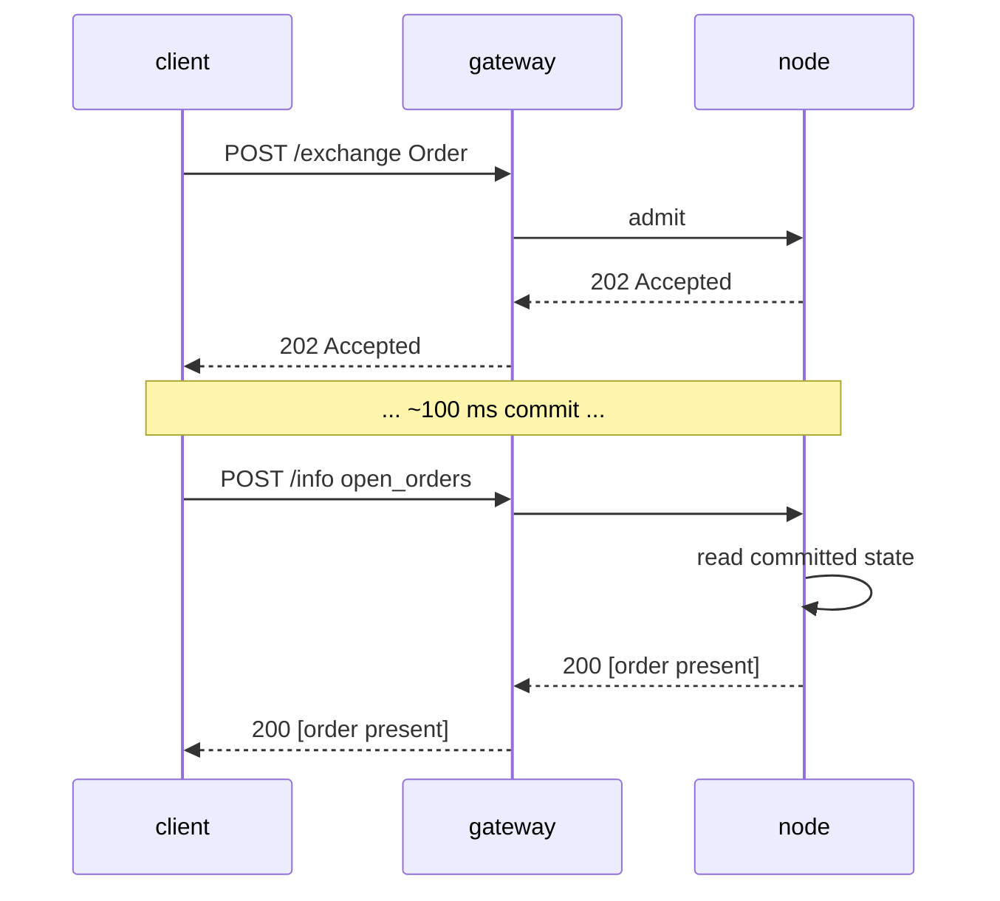

# `POST /info` — 读取与查询端点

:::info
**状态：** 信封结构**稳定**。查询类型会持续新增，但信封格式已锁定。
:::

## 简要说明

单一端点，多类型分发。根据请求体中的 `type` 字段进行路由。只读——不修改任何状态，无需签名。

:::tip
**按产品分类。** 永续合约市场的读取查询请参见[永续合约查询](./info/perpetuals.md)；现货、现货保证金及 Earn 的读取查询请参见[现货与保证金查询](./info/spot.md)。本页涵盖信封格式、使用约定，以及账户/治理/金库/验证者查询。
:::

## URL

```
POST  https://api.<net>.mtf.exchange/info
```

| 路径 | 数据格式 |
|------|-----------|
| `POST /info`（网关） | MTF 原生格式（本文档） |

网关提供 MTF 原生 `/info` 接口。若自行运行节点，相同的原生 `/info`
接口直接通过 `http://localhost:8080` 访问。

## 信封格式

请求：

```json
{ "type": "<query_type>", /* 各类型专属参数 */ }
```

响应：

```json
{ "type": "<query_type>", "data": { /* 各类型专属内容 */ } }
```

`type` 未知时返回 `400 Bad Request`，响应体为 `{"error":"unknown info type: <X>"}`。
资源不存在时（如未知金库 ID）返回 `404 Not Found`，响应体为 `{"error":"<resource> not found"}`。

## 查询类型

### `node_info`

节点静态身份信息及协议版本。无需传入参数。

```json
{ "type": "node_info" }
```

响应：

```json
{
  "type": "node_info",
  "data": {
    "network":           "testnet",
    "chain_id":          114514,
    "protocol_version":  "1.0.0",
    "validator_index":   null,
    "build_commit":      "unknown",
    "version":           "0.0.1",
    "freeze_halt_supported": true,
    "uptime_seconds":    0
  }
}
```

| 字段 | 类型 | 说明 |
|-------|------|-------------|
| `network` | `"devnet" \| "testnet" \| "mainnet"` | 网络类型，由 `chain_id` 推导（`31337`=devnet，`114514`=testnet，`8964`=mainnet） |
| `chain_id` | uint64 | EIP-712 链 ID — `/exchange` 签名域必须使用相同的值 |
| `protocol_version` | semver 字符串 | 通信协议版本 |
| `validator_index` | uint32 \| null | 本节点在活跃验证者集中的索引；**待填充：** 运行时调用 `set_validator_index` 前为 `null` |
| `build_commit` | hex 字符串 | 运营方发布的构建标识符；**待填充：** 发布前为 `"unknown"` |
| `version` | semver 字符串 | 节点软件发行版本，编译时写入。同一发行版的所有二进制文件共享同一 `version`，`build_commit` 用于区分具体构建 |
| `freeze_halt_supported` | bool | 该二进制始终为 `true`——能力标志：节点支持 [`exchange_status.scheduled_freeze_height`](#exchange_status)，在冻结高度提交后以退出码 `77` 干净退出，供节点守护进程切换至下一版本 |
| `uptime_seconds` | uint64 | 进程运行时长；**待填充：** 运行时调用 `set_uptime_seconds` 前为 `0` |

这些均为**节点级**字段（节点身份/运行时信息），而非共识状态，因此不同节点之间存在差异属于正常现象。

### `account_state`

账户完整快照。

```json
{ "type": "account_state", "address": "0x<addr>" }
```

| 参数 | 类型 | 必填 |
|-----|------|----------|
| `address` | hex 地址 | 是 |

对于**未知地址**（链上从未出现），返回 **200** 并附带全零记录（`account_value:"0"`，`positions` / `balances.spot` 均为空），而非 `404`。

响应示例（水龙头充值账户，无持仓）：

```json
{
  "type": "account_state",
  "data": {
    "address":         "0x00000000000000000000000000000000000ca11e",
    "account_value":   "3000",
    "free_collateral": "3000",
    "maint_margin":    "0",
    "init_margin":     "0",
    "health":          "3000",
    "tier":            "Safe",
    "mode":            "Cross",
    "pm_enabled":      false,
    "positions": [],
    "balances": {
      "usdc": "3000",
      "spot": { "MTF": { "total": "10", "hold": "0" } }
    }
  }
}
```

`balances.spot` 中每个 token 均为 `{total, hold}` 对象（与 HL 保持一致）：`hold` 是被挂单占用的托管金额，`total` 是完整余额，可用余额 = `total − hold`。即便 token 余额已被全部占用，该 token 仍会出现在列表中。若仅需读取保证金标量（无需遍历 `positions`、无需扫描余额——适合清算健康度轮询），请使用 [`margin_summary`](#margin_summary)。

有持仓的账户在 `positions` 下会包含以下条目：

```json
{
  "asset":             0,
  "size":              "100000000",
  "entry":             "67000.00",
  "upnl":              "5.00",
  "isolated":          false,
  "lev":               10,
  "liq":               "61000.00",
  "roe":               "0.0075",
  "funding":           "-0.12",
  "margin":            "201.00",
  "notional":          "6705.00"
}
```

| 字段 | 类型 | 说明 |
|-------|------|-------------|
| `account_value` | 十进制字符串 | 含已结算盈亏的权益，**USDC 整数单位**（`"3000"` = 3000 USDC，非基础单位） |
| `free_collateral` | 十进制字符串 | 权益减去未平仓持仓占用的初始保证金 |
| `maint_margin` | 十进制字符串 | 各资产维持保证金之和 |
| `init_margin` | 十进制字符串 | 已占用的初始保证金要求 |
| `health` | 十进制字符串 | `account_value − maint_margin`（有符号，可为负） |
| `tier` | 枚举 | `"Safe"`、`"T0"`、`"T1"`、`"T2"`、`"T3"`（`account_value / maint_margin` 的 BOLE 区间；无维持保证金时为 `"Safe"`）— 参见[分层清算](../../concepts/tiered-liquidation.md) |
| `mode` | 枚举 | `"Cross"`（全仓）、`"Isolated"`（逐仓）、`"StrictIso"`（严格逐仓），由账户当前持仓推导 |
| `pm_enabled` | bool | 是否启用投资组合保证金 |
| `positions[*].asset` | uint32 | 资产 ID |
| `positions[*].size` | i128 字符串 | 有符号持仓量，单位为**原始手数**——`size / 10^sz_decimals` = 整数单位（`sz_decimals` 为市场的数量精度，如 BTC 为 5）。此为数量维度，与 1e8 价格维度相互独立。 |
| `positions[*].entry` | 十进制字符串 | 每整数单位的开仓均价 = `\|entry_notional\| / \|real size\|`，**USDC 整数单位** |
| `positions[*].upnl` | 十进制字符串 | 盯市盈亏 = `real size × mark − signed entry_notional`，**USDC 整数单位**（有符号） |
| `positions[*].isolated` | bool | 非全仓保证金时为 `true` |
| `positions[*].lev` | uint8 | 持仓最大杠杆倍数 |
| `positions[*].liq` | 十进制字符串 | 该持仓单独触发维持保证金不足时的价格（USDC 整数单位），为单持仓全仓近似值；当数量/杠杆为零（无有限清算价）时为 `"0"` |
| `positions[*].roe` | 十进制字符串 | `upnl / initial_margin` 的十进制小数（`initial_margin = \|entry_notional\| / leverage`）；杠杆/名义价值为零时为 `"0"` |
| `positions[*].funding` | 十进制字符串 | 该腿已计提但未结算的资金费，**USDC 整数单位**（有符号）；`real_size × (cumulative_funding − funding_entry)` — 与资金费结算时使用的形式相同 |
| `positions[*].margin` | 十进制字符串 | 该腿贡献的维持保证金，**USDC 整数单位**：`\|entry_notional\| × maint_margin_ratio` |
| `positions[*].notional` | 十进制字符串 | 按标记价格计算的持仓名义价值，**USDC 整数单位**（有符号）：`real_size × mark_px` |
| `positions[*].side` | 枚举 \| 缺省 | **仅[对冲模式](../../concepts/hedge-mode.md)** — `"long"` / `"short"`，标识本对象所报告的方向。**单向账户不返回此字段**（单向账户仅有一个净持仓，`size` 可为负）。对冲账户在同一资产上同时持有多空两腿时，返回**两个**对象，各对应一个方向。 |
| `balances.usdc` | 十进制字符串 | **与 `account_value` 相同**（全仓 USDC 抵押品），并非独立的现货 USDC 余额 |
| `balances.spot` | 对象 | 非 USDC 现货 token 余额，以 **token 名称**为键（如 `"MTF"`）；每个值为 `{total, hold}` 对象（`hold` = 被挂单占用的托管金额；可用余额 = `total − hold`）；无现货余额时为空 |

### `margin_summary`

**仅返回保证金标量**——相当于 `account_state` 去掉 `positions[]` 遍历和现货余额扫描。适合高频清算健康度轮询（风控机器人、自动补充保证金等），当无需持仓/余额明细时为最佳选择。必填参数：`address`（0x hex）。

```json
{ "type": "margin_summary", "address": "0x<addr>" }
```

响应（`data`）包含：`address`、`account_value`、`free_collateral`、
`maint_margin`、`init_margin`、`health`、`tier`、`mode`、`pm_enabled`——
字段语义与 [`account_state`](#account_state) 中同名字段完全一致（由共同的辅助函数计算，两者结果永不相悖）。

### `vault_state`

金库完整快照。

```json
{ "type": "vault_state", "vault": "0x<vault_addr>" }
```

响应：

```json
{
  "type": "vault_state",
  "data": {
    "vault":              "0x<addr>",
    "name":               "MFlux Conservative",
    "tvl":             "10000000000",
    "share_price":     "10500000",
    "depositor_count":    142,
    "high_water_mark": "10500000",
    "performance_fee_bps":1000,
    "lock_period_ms":     86400000,
    "strategy":           "MarketNeutral"
  }
}
```

### `staking_state`

```json
{ "type": "staking_state", "address": "0x<addr>" }
```

响应：

```json
{
  "type": "staking_state",
  "data": {
    "address":         "0x<addr>",
    "total_staked": "1000000000",
    "delegations": [
      {
        "validator":         "0x<val_addr>",
        "amount":         "500000000",
        "since_ts":          1735000000000,
        "pending_rewards":"1000000"
      }
    ],
    "pending_unstakes": [
      { "amount": "200000000", "matures_at_ts": 1735780000000 }
    ]
  }
}
```

### `fee_schedule`

```json
{ "type": "fee_schedule" }
```

响应：

```json
{
  "type": "fee_schedule",
  "data": {
    "tiers": [
      { "volume_30d": "0",         "maker_bps": "2.0", "taker_bps": "5.0" },
      { "volume_30d": "100000000", "maker_bps": "1.5", "taker_bps": "4.5" },
      { "volume_30d": "1000000000","maker_bps": "1.0", "taker_bps": "4.0" }
    ],
    "builder_rebate_bps": "0.2",
    "burn_ratio":         "0.30",
    "referrer_share_bps": "1.0"
  }
}
```

费率以字符串形式表示，单位为十进制**基点**（`"2.0"` = 2 bps = 0.02%）。`burn_ratio` 为十进制小数（`"0.30"` = 手续费的 30% 被销毁）。详见[手续费说明](../../concepts/fees.md)。

### `open_orders`

账户在所有永续合约订单簿中的当前挂单。

```json
{ "type": "open_orders", "account_id": 42 }
```

| 参数 | 类型 | 必填 |
|-----|------|----------|
| `account_id` | uint64 | `account_id` / `address` 二选一 |
| `address` | hex 地址 | `account_id` / `address` 二选一 |

可使用 `account_id`（u64）或 `address`（0x hex）其中之一标识账户。若请求传入 `account_id`，响应中的 `data.account_id` 会将其回传。

响应：

```json
{
  "type": "open_orders",
  "data": {
    "address":    "0x<addr>",
    "account_id": 42,
    "orders": [
      {
        "oid":          12345,
        "market_id":    0,
        "side":         "bid",
        "px":        "99000",
        "size":      "700",
        "cloid":        "0x000000000000000000000000cafef00d",
        "inserted_at_ms": 1700000000000
      }
    ]
  }
}
```

| 字段 | 类型 | 说明 |
|-------|------|-------------|
| `address` | hex 地址 | 解析后的账户地址 |
| `account_id` | uint64 | 仅当请求使用 `account_id` 时回传 |
| `orders[*].oid` | uint64 | 服务端订单 ID |
| `orders[*].market_id` | uint32 | 挂单所在资产/市场 ID |
| `orders[*].side` | `"bid"` / `"ask"` | 订单方向 |
| `orders[*].px` | i128 字符串 | 挂单价格，定点十进制字符串 |
| `orders[*].size` | u128 字符串 | 剩余数量，定点十进制字符串 |
| `orders[*].cloid` | hex 字符串 \| null | 下单时指定的客户端订单 ID（`0x` + 32 位 hex）；未指定时为 `null` |
| `orders[*].inserted_at_ms` | uint64 | 下单/入账时间戳（共识时间，毫秒） |

### `user_fills`

账户的成交历史，直接从节点已提交状态中读取（每个账户维护一个有界环形缓冲区，折叠进 AppHash——无需外部索引器）。

```json
{ "type": "user_fills", "account_id": 42 }
```

| 参数 | 类型 | 必填 | 说明 |
|-----|------|----------|-------------|
| `account_id` | uint64 | `account_id` / `address` 二选一 | 内部账户 ID |
| `address` | hex 地址 | `account_id` / `address` 二选一 | 账户地址 |
| `limit` | uint32 | 否 | 限制返回**最近**记录条数；缺省或为 `0` 时返回完整环形缓冲区内容 |

可使用 `account_id`（u64）或 `address`（0x hex）其中之一标识账户。若请求传入 `account_id`，响应中的 `data.account_id` 会将其回传。

响应：

```json
{
  "type": "user_fills",
  "data": {
    "address":    "0x<addr>",
    "account_id": 42,
    "fills": [
      {
        "coin":           0,
        "side":           "B",
        "px":             "67042.50",
        "sz":             "0.125",
        "time":           1700000000555,
        "oid":            12345,
        "tid":            90123,
        "fee":            "4.19",
        "closed_pnl":     "0",
        "dir":            "Open Long",
        "start_position": "0",
        "block":          562,
        "hash":           "0x2315b79b9e82c2deb279a59448bf7841f3767d30d874e5b544d75bb9fd1e9b0c"
      }
    ]
  }
}
```

记录按时间升序排列（最旧在前，最新在后）。由于缓冲区有界，仅保留近期数据，并非全量历史。无成交记录的账户返回 `"fills": []`。

| 字段 | 类型 | 说明 |
|-------|------|-------------|
| `address` | hex 地址 | 解析后的账户地址 |
| `account_id` | uint64 | 仅当请求使用 `account_id` 时回传 |
| `fills[*].coin` | uint32 | 成交所在资产/市场 ID |
| `fills[*].side` | `"B"` / `"A"` | 本腿方向——`"B"` = 买入/买方，`"A"` = 卖出/卖方 |
| `fills[*].px` | 十进制字符串 | 成交价格，**USDC 十进制**（人类可读） |
| `fills[*].sz` | 十进制字符串 | 成交数量，**基础单位**（整数单位） |
| `fills[*].time` | uint64 | 成交时间戳（共识时间，毫秒） |
| `fills[*].oid` | uint64 | 本方订单 ID |
| `fills[*].tid` | uint64 | 确定性交易 ID（成交双方共享） |
| `fills[*].fee` | 十进制字符串 | 本方支付的手续费，**USDC 十进制** |
| `fills[*].closed_pnl` | 十进制字符串 | 平仓部分的已实现盈亏，**USDC 十进制**（有符号） |
| `fills[*].dir` | 字符串 | 方向标签，如 `"Open Long"`、`"Close Short"`、`"Open Short"`、`"Close Long"` |
| `fills[*].start_position` | 十进制字符串 | 成交前本腿的有符号持仓量，**基础单位**（整数单位，有符号） |
| `fills[*].block` | uint64 | 成交所在的已提交区块高度（链上定位符） |
| `fills[*].hash` | hex 字符串 | 原始订单的交易哈希，`0x` 前缀 hex——可用于链上追溯成交记录 |

### `user_fills_by_time`

与 [`user_fills`](#user_fills) 相同，但按每条记录的共识 `time` 限定时间窗口过滤。成交记录结构相同。

```json
{ "type": "user_fills_by_time", "address": "0x<addr>", "start_time": 1700000000000, "end_time": 1700003600000 }
```

| 参数 | 类型 | 是否必填 | 描述 |
|-----|------|----------|-------------|
| `account_id` | uint64 | `account_id` / `address` 二选一 | 内部账户 ID |
| `address` | hex address | `account_id` / `address` 二选一 | 账户地址 |
| `start_time` | uint64 | 否 | 时间窗口起始（毫秒，含端点）；按成交 `time` 过滤。缺省则下界开放 |
| `end_time` | uint64 | 否 | 时间窗口结束（毫秒，含端点）。缺省则上界开放 |

响应：

```json
{
  "type": "user_fills_by_time",
  "data": {
    "address":    "0x<addr>",
    "account_id": 42,
    "start_time": 1700000000000,
    "end_time":   1700003600000,
    "fills": [ /* same record shape as user_fills */ ]
  }
}
```

| 字段 | 类型 | 描述 |
|-------|------|-------------|
| `address` | hex address | 解析后的账户地址 |
| `account_id` | uint64 | 仅当请求使用 `account_id` 时回显 |
| `start_time` | uint64 \| null | 回显的窗口起始时间（若未传则为 `null`） |
| `end_time` | uint64 \| null | 回显的窗口结束时间（若未传则为 `null`） |
| `fills` | array | 窗口内的成交记录（每条记录结构与 [`user_fills`](#user_fills) 相同），按时间从旧到新排列 |

### `order_status`

通过 `oid`（服务端订单 ID）**或** `cloid`（客户端订单 ID）查询单笔订单的生命周期状态。读取实时订单簿、触发器注册表以及已提交的成交环形缓冲区——均为节点上的已提交状态。

```json
{ "type": "order_status", "oid": 12345 }
```

或通过客户端订单 ID：

```json
{ "type": "order_status", "cloid": "0x000000000000000000000000cafef00d" }
```

| 参数 | 类型 | 是否必填 | 描述 |
|-----|------|----------|-------------|
| `oid` | uint64 | `oid` / `cloid` 二选一 | 服务端订单 ID |
| `cloid` | hex string | `oid` / `cloid` 二选一 | 客户端订单 ID — `0x` + 32 位十六进制字符 |

两者均未提供 → `400 {"error":"missing field oid or cloid"}`。`cloid` 格式错误 → `400`。解析按以下优先级命中第一个结果：活跃挂单 → 已停驻触发器 → 终态成交 → 未知。

`data.status` 区分各分支：

`"resting"` — 永续或现货订单簿中的活跃挂单：

```json
{
  "type": "order_status",
  "data": {
    "status": "resting",
    "order": {
      "oid":            12345,
      "market_id":      0,
      "side":           "bid",
      "px":             "67000",
      "size":           "700",
      "inserted_at_ms": 1700000000000,
      "cloid":          "0x000000000000000000000000cafef00d"
    }
  }
}
```

`"triggered"` — 等待标记价格穿越的已停驻止盈/止损/条件入场单：

```json
{
  "type": "order_status",
  "data": {
    "status": "triggered",
    "trigger": {
      "oid":              12345,
      "market_id":        0,
      "side":             "ask",
      "trigger_px":       "66000",
      "trigger_above":    false,
      "size":             "700",
      "registered_at_ms": 1700000000000,
      "fired":            false
    }
  }
}
```

`"filled"` — 每账户环形缓冲区中最近的匹配成交记录（`fill` 对象结构与一条 [`user_fills`](#user_fills) 记录相同）：

```json
{
  "type": "order_status",
  "data": {
    "status": "filled",
    "fill": { /* same shape as a user_fills fill record */ }
  }
}
```

`"unknown"` — 从未出现，或已从有界环形缓冲区中淘汰（仅凭 `cloid` 查询但未匹配到任何挂单或触发器时也会落入此分支，因为触发器注册表和成交环形缓冲区均以 `oid` 为键）：

```json
{ "type": "order_status", "data": { "status": "unknown" } }
```

| 字段 | 类型 | 描述 |
|-------|------|-------------|
| `status` | `"resting" \| "triggered" \| "filled" \| "unknown"` | 解析后的生命周期状态 |
| `order` | object | 当状态为 `"resting"` 时存在 — `oid`、`market_id`、`side`（`"bid"`/`"ask"`）、`px` / `size`（定点小数字符串）、`inserted_at_ms`、`cloid`（hex \| null） |
| `trigger` | object | 当状态为 `"triggered"` 时存在 — `oid`、`market_id`、`side`、`trigger_px` / `size`（定点小数字符串）、`trigger_above`（布尔值：标记价格上穿时触发）、`registered_at_ms`、`fired`（布尔值） |
| `fill` | object | 当状态为 `"filled"` 时存在 — 匹配的成交记录（参见 [`user_fills`](#user_fills)） |

### `block_info`

已提交区块的元数据。无必填参数（`height` 被接受但忽略——读取状态仅保留最新已提交上下文）。

```json
{ "type": "block_info" }
```

响应：

```json
{
  "type": "block_info",
  "data": {
    "height":       562,
    "round":        562,
    "epoch":        0,
    "timestamp_ms": 1780475491562,
    "block_hash":   "0x2315b79b9e82c2deb279a59448bf7841f3767d30d874e5b544d75bb9fd1e9b0c"
  }
}
```

| 字段 | 类型 | 描述 |
|-------|------|-------------|
| `height` | uint64 | 最新已提交区块高度 |
| `round` | uint64 | 该区块的共识轮次 |
| `epoch` | uint64 | 当前纪元 |
| `timestamp_ms` | uint64 | 区块时间戳（共识毫秒） |
| `block_hash` | hex string (32 bytes) | 真实的已提交区块哈希（现已接入读取状态——不再是全零占位符） |

### `agents`

账户下已授权的代理钱包 / API 钱包。

```json
{ "type": "agents", "account_id": 42 }
```

| 参数 | 类型 | 是否必填 |
|-----|------|----------|
| `account_id` | uint64 | `account_id` / `address` 二选一 |
| `address` | hex address | `account_id` / `address` 二选一 |

响应：

```json
{
  "type": "agents",
  "data": {
    "address":    "0x<master>",
    "account_id": 42,
    "agents": [
      { "agent": "0x<agent_addr>", "name": "trading-bot", "expires_at_ms": 1700000500000 }
    ]
  }
}
```

| 字段 | 类型 | 描述 |
|-------|------|-------------|
| `address` | hex address | 解析后的主账户地址 |
| `account_id` | uint64 | 仅当请求使用 `account_id` 时回显 |
| `agents[*].agent` | hex address | 已授权的代理钱包地址 |
| `agents[*].name` | string \| null | 授权时设置的代理标签；未设置则为 `null` |
| `agents[*].expires_at_ms` | uint64 \| null | 代理授权到期时间（共识毫秒）；永不过期的授权为 `null` |

### `sub_accounts`

账户的子账户列表。

```json
{ "type": "sub_accounts", "account_id": 42 }
```

| 参数 | 类型 | 是否必填 |
|-----|------|----------|
| `account_id` | uint64 | `account_id` / `address` 二选一 |
| `address` | hex address | `account_id` / `address` 二选一 |

响应：

```json
{
  "type": "sub_accounts",
  "data": {
    "address":    "0x<parent>",
    "account_id": 42,
    "sub_accounts": [
      { "index": 0, "address": "0x<sub_addr>" }
    ]
  }
}
```

| 字段 | 类型 | 描述 |
|-------|------|-------------|
| `address` | hex address | 解析后的父账户地址 |
| `account_id` | uint64 | 仅当请求使用 `account_id` 时回显 |
| `sub_accounts[*].index` | uint32 | 父账户下的子账户索引 |
| `sub_accounts[*].address` | hex address | 子账户地址 |

### `protocol_metrics`

协议级别的已提交累加器与计数器。无参数。所有字段均直接读自已提交的 `Exchange` 状态（计数器、手续费池、BOLE 储备金、质押）——不依赖撮合引擎或预言机计算，因此可通过重放精确复现。

```json
{ "type": "protocol_metrics" }
```

响应：

```json
{
  "type": "protocol_metrics",
  "data": {
    "counters": {
      "total_orders":               1000,
      "total_fills":                750,
      "total_liquidations":         3,
      "total_deposits":             40,
      "total_withdrawals":          12,
      "total_vault_transfers":      0,
      "total_sub_account_transfers":0
    },
    "fee_pools": {
      "burned":         "8000",
      "mflux_vault":    "0",
      "validator_pool": "1000",
      "treasury":       "1000",
      "burned_mtf":     "55"
    },
    "insurance_fund_total":    "750",
    "treasury_backstop_total": "9000",
    "bole_pool": {
      "total_deposits":  "20000",
      "shortfall_total": "7"
    },
    "open_interest_total_1e8": "1500000",
    "staking": {
      "total_stake":   "100",
      "n_validators":  1,
      "n_active":      1,
      "n_jailed":      0,
      "current_epoch": 4
    },
    "counts": {
      "n_markets":             1,
      "n_spot_pairs":          5,
      "n_user_vaults":         0,
      "n_accounts_with_state": 12
    }
  }
}
```

| 字段 | 类型 | 描述 |
|-------|------|-------------|
| `counters.total_orders` | uint64 | 历史累计接受订单数 |
| `counters.total_fills` | uint64 | 历史累计成交数（唯一逐项交易信号——为**笔数**，非名义价值） |
| `counters.total_liquidations` | uint64 | 历史累计清算次数 |
| `counters.total_deposits` / `total_withdrawals` | uint64 | 历史累计充值 / 提现笔数 |
| `counters.total_vault_transfers` | uint64 | 历史累计金库充提转账笔数 |
| `counters.total_sub_account_transfers` | uint64 | 历史累计子账户转账笔数 |
| `fee_pools.burned` | Decimal string | 累计路由至回购销毁的 USDC（整数 USDC） |
| `fee_pools.mflux_vault` | Decimal string | MFlux 金库累计手续费应计额（`"0"` — 金库份额已清零） |
| `fee_pools.validator_pool` | Decimal string | 验证者池累计手续费应计额（整数 USDC） |
| `fee_pools.treasury` | Decimal string | 国库累计手续费应计额（整数 USDC） |
| `fee_pools.burned_mtf` | Decimal string | 回购执行器累计销毁的 MTF 数量 |
| `insurance_fund_total` | Decimal string | 各资产 `bole_pool.insurance_fund` 储备金之和（整数 USDC） |
| `treasury_backstop_total` | Decimal string | 各资产 `bole_pool.treasury_backstop` 储备金之和（整数 USDC） |
| `bole_pool.total_deposits` | Decimal string | BOLE 借贷池总存款额（整数 USDC） |
| `bole_pool.shortfall_total` | Decimal string | ADL → 保险基金 → 国库瀑布流程后残余坏账之和 |
| `open_interest_total_1e8` | u128 string | 各市场未平仓合约之和，**1e8 订单簿精度**（标注 `_1e8`，非整数 USDC） |
| `staking.total_stake` | Decimal string | 总质押 MTF 数量（整数 MTF） |
| `staking.n_validators` | uint64 | 已提交验证者集合中的验证者数量 |
| `staking.n_active` | uint64 | 本纪元活跃验证者数量 |
| `staking.n_jailed` | uint64 | 当前被监禁的验证者数量 |
| `staking.current_epoch` | uint64 | 当前质押纪元 |
| `counts.n_markets` | uint64 | 已注册的 MIP-3 永续合约市场数（`mip3_market_specs`） |
| `counts.n_spot_pairs` | uint64 | 已注册的现货交易对数（`mip3_spot_pair_specs`） |
| `counts.n_user_vaults` | uint64 | 已注册的用户金库数 |
| `counts.n_accounts_with_state` | uint64 | 拥有已提交用户状态的账户数 |

:::info
**无累计交易名义价值字段。** 引擎追踪每用户**30 天手续费交易量**（参见 [`user_fees`](#user_fees)）以及历史成交**笔数**（`counters.total_fills`）——**不存在已提交的全协议美元交易量累加器**，因此此读取接口有意省略该字段，以免暗示存在交易量总计。计数器是单调递增的活动计次，并非资金量。
:::

状态来源：`locus.{counters, fee_tracker.fee_distribution, bole_pool}` + `c_staking` + 注册表大小。

### `user_fees`

每账户手续费 / 交易量等级。必填：`account_id`（u64）**或** `address`（0x 十六进制）。

```json
{ "type": "user_fees", "account_id": 42 }
```

| 参数 | 类型 | 是否必填 |
|-----|------|----------|
| `account_id` | uint64 | `account_id` / `address` 二选一 |
| `address` | hex address | `account_id` / `address` 二选一 |

两者均未提供 → `400`。无手续费状态的账户返回 **200**，交易量为零、费率为基础档位 bps——遵循既定的零值惯例。

响应：

```json
{
  "type": "user_fees",
  "data": {
    "address":          "0x<addr>",
    "account_id":       42,
    "taker_volume_30d": "1250000",
    "maker_volume_30d": "800000",
    "vip_tier":         2,
    "mm_tier":          1,
    "referrer":         "0x<referrer>",
    "referrer_credit":  "420",
    "maker_bps":        1,
    "taker_bps":        3
  }
}
```

| 字段 | 类型 | 描述 |
|-------|------|-------------|
| `address` | hex address | 解析后的账户地址 |
| `account_id` | uint64 | 仅当请求使用 `account_id` 时回显 |
| `taker_volume_30d` | Decimal string | 滚动 30 日吃单交易量（整数 USDC） |
| `maker_volume_30d` | Decimal string | 滚动 30 日挂单交易量（整数 USDC） |
| `vip_tier` | uint | 已提交的每用户 VIP 等级索引；未追踪时为 `0` |
| `mm_tier` | uint | 已提交的每用户做市商等级索引；未追踪时为 `0` |
| `referrer` | hex address \| null | 该账户的推荐人地址（若已设置），否则为 `null` |
| `referrer_credit` | Decimal string | 该地址作为推荐人所累计的返佣总额（整数 USDC） |
| `maker_bps` | uint | **实际生效**的挂单手续费 bps，根据该账户 30 日挂单量在已提交 [`fee_schedule`](#fee_schedule) 交易量等级阶梯中解析得出 |
| `taker_bps` | uint | **实际生效**的吃单手续费 bps，根据该账户 30 日吃单量在已提交阶梯中解析得出 |

实际生效的 `maker_bps` / `taker_bps` 分别按买卖方向从已提交的交易量等级阶梯（[`fee_schedule`](#fee_schedule)）解析——挂单费率取账户挂单量对应档位，吃单费率取账户吃单量对应档位——所用算法与结算路径收费时相同，因此上报的 bps 与账户实际被扣收的费率一致。MIP-3 每市场专项费率覆盖**不**在此反映：此处为跨市场基础费率。`vip_tier` / `mm_tier` 仍为已提交的每用户等级索引，作为独立信号与实际 bps 一并返回。

状态来源：`locus.fee_tracker.{user_to_taker_volume_30d, user_to_maker_volume_30d, user_to_vip_tier, user_to_mm_tier, referee_to_referrer, referrer_credit}` + 已提交的交易量等级阶梯。

### `staking_apr`

年化质押排放率（实际生效值）及其已提交的输入参数。无需传入参数。

```json
{ "type": "staking_apr" }
```

响应：

```json
{
  "type": "staking_apr",
  "data": {
    "total_stake":             "1000000",
    "effective_apr":           "0.08",
    "effective_apr_bps":       "800",
    "governance_rate_bps":     800,
    "emission_floor_stake":    "50000000",
    "n_active_validators":     1,
    "current_epoch":           2,
    "is_gross_pre_commission": true
  }
}
```

| 字段 | 类型 | 说明 |
|-------|------|-------------|
| `total_stake` | Decimal string | 已质押的 MTF 总量（整数 MTF） |
| `effective_apr` | Decimal string | 出块奖励实际适用的年化排放率（小数形式） |
| `effective_apr_bps` | Decimal string | `effective_apr × 10_000`，截断取整 |
| `governance_rate_bps` | uint | 治理设定的 `reward_rate_bps`（已提交）——参见标志位 |
| `emission_floor_stake` | uint string | 质押下限（`50M` MTF），低于此值时利率保持不变 |
| `n_active_validators` | uint64 | 本 epoch 活跃验证节点数量 |
| `current_epoch` | uint64 | 当前质押 epoch |
| `is_gross_pre_commission` | bool | 始终为 `true` —— APR 为总收益率，未扣除各验证节点佣金 |

`effective_apr` 由出块奖励按以下曲线推导得出：

```text
effective_apr = 0.08 × √( 50M / max(total_stake, 50M) )
```

即：质押量在 50M MTF 及以下时为**固定 8%**；超过后按 1/√stake 衰减（例如：总质押 = 200M ⇒ 下限的 4 倍 ⇒ 比率 1/4 ⇒ √ = 1/2 ⇒ 4% / 400 bps）。

:::warning
**`governance_rate_bps` 已提交，但奖励逻辑并不使用该值。** 出块奖励的派发利率由上述**质押曲线**推导，而非来自 `reward_rate_bps`。两者同时对外暴露，是为了让分歧可被观测而非隐藏——实际派发的 APR 是 `effective_apr`，而非 `governance_rate_bps`。此外，`effective_apr` 是**总排放率**（`is_gross_pre_commission: true`）：单个委托人的净 APR 为 `effective_apr × (1 − commission)`。
:::

状态来源：`c_staking.{total_stake, reward_rate_bps, current_epoch, validators}` + 排放曲线。

### `oracle_sources`

每个市场已提交的预言机数据源子集。通过 `asset_id`（u32）**或** `coin`（交易对符号）定位市场。

```json
{ "type": "oracle_sources", "asset_id": 0 }
```

或通过名称查询：

```json
{ "type": "oracle_sources", "coin": "BTC" }
```

| 参数 | 类型 | 是否必填 |
|-----|------|----------|
| `asset_id` | uint32 | `asset_id` / `coin` 二选一 |
| `coin` | symbol | `asset_id` / `coin` 二选一 |

两者均未传入 → `400`；未知市场 → `404 {"error":"market not found"}`。

响应：

```json
{
  "type": "oracle_sources",
  "data": {
    "asset_id":          0,
    "name":              "BTC",
    "oracle_set":        true,
    "source_count":      3,
    "num_sources":       10,
    "enabled_sources":   [0, 2, 5],
    "subset_mask":       37,
    "weights_committed": false
  }
}
```

| 字段 | 类型 | 说明 |
|-------|------|-------------|
| `asset_id` | uint32 | 回显/解析后的资产 id |
| `name` | string | 市场交易对符号 |
| `oracle_set` | bool | 部署者是否已通过 `SetOracle` 显式确认该子集 |
| `source_count` | uint64 | 已启用的数据源数量（掩码的 popcount） |
| `num_sources` | uint8 | 数据源插槽总数（`NUM_ORACLE_SOURCES = 10`） |
| `enabled_sources` | uint8[] | 子集掩码中置位的比特位索引（已启用的数据源插槽） |
| `subset_mask` | uint16 | 已提交的 10 位 `oracle_source_subset_mask`（第 `i` 位置位 ⇒ 数据源 `i` 参与中位数计算） |
| `weights_committed` | bool | 始终为 `false` —— 各数据源权重未提交（参见标志位） |

:::warning
**链上仅存储数值掩码——数据来源的名称和权重均未提交**（`weights_committed: false`）。10 个数据源的身份由协议在链下固定，权重同样由协议固定，因此链上状态仅保存子集掩码。本接口将 `enabled_sources` 以**比特位索引**形式返回，而非具体来源名称，也不输出各来源的权重列表，以避免捏造数据。
:::

状态来源：`mip3_market_specs[asset].{oracle_source_subset_mask, oracle_set}`。

## 治理查询类型

链上治理接口：实时投票机制（`gov_state`）、跨类别待定提案视图（含法定人数距离，`gov_proposals`）以及已生效参数的审计记录（`gov_history`）。所有查询均读取已提交的 `Exchange` 状态，使用相同的 `{type, data}` 封装格式。质押法定人数为 ⅔（按质押量加权）；**已监禁**的验证节点从活跃质押分母及所有计票中排除，与链上生效检查逻辑保持一致。

### `gov_state`

实时治理全貌——质押法定人数上下文、待处理的 `voteGlobal` 轮次、已开启的 `govPropose` 提案，以及所有受治理参数的当前值。无需传入参数。

```json
{ "type": "gov_state" }
```

响应：

```json
{
  "type": "gov_state",
  "data": {
    "total_stake":  "150000",
    "quorum_bps":   6667,
    "quorum_stake": "100005",
    "pending_vote_global": [
      {
        "kind":          "set_reward_rate_bps",
        "kind_id":       3,
        "votes": [
          { "validator": "0x<val>", "value": "900", "stake": "60000", "submitted_at_ms": 1700000000000 }
        ],
        "leading_stake": "60000"
      }
    ],
    "open_proposals": [
      { "proposal_id": 5, "voters": 2, "aye_stake": "90000", "nay_stake": "30000" }
    ],
    "params": {
      "reward_rate_bps":   800,
      "default_taker_bps": 5,
      "default_maker_bps": 2,
      "burn_bps":          8000
    },
    "oracle_weight_overrides": [
      { "asset_id": 0, "weights": [1000, 1000, 1000] }
    ]
  }
}
```

| 字段 | 类型 | 说明 |
|-------|------|-------------|
| `total_stake` | decimal string | 所有验证节点的质押量总和 |
| `quorum_bps` | uint | ⅔ 法定人数阈值，以 bps 表示（`6667`） |
| `quorum_stake` | decimal string | 生效所需质押量（`total_stake × quorum_bps / 10000`） |
| `pending_vote_global[*].kind` | string | 受治理参数名称（snake_case），如 `"set_reward_rate_bps"` |
| `pending_vote_global[*].kind_id` | uint | 数字类型 id |
| `pending_vote_global[*].votes[*].validator` | hex address | 投票的验证节点 |
| `pending_vote_global[*].votes[*].value` | decimal string | 解码后的提案值（若载荷不透明则为十六进制 `0x…`） |
| `pending_vote_global[*].votes[*].stake` | decimal string | 该投票者的质押量 |
| `pending_vote_global[*].votes[*].submitted_at_ms` | uint64 | 投票提交时间戳（共识毫秒） |
| `pending_vote_global[*].leading_stake` | decimal string | 本轮中获得最多质押支持的单一载荷所汇聚的质押量 |
| `open_proposals[*].proposal_id` | uint64 | govPropose 轮次 id |
| `open_proposals[*].voters` | uint64 | 已投票数量 |
| `open_proposals[*].aye_stake` / `nay_stake` | decimal string | 赞成/反对票的质押量 |
| `params` | object | 所有受治理参数的当前值（每项均为已提交的标量） |
| `oracle_weight_overrides[*].asset_id` | uint32 | 已设置预言机权重覆盖的资产 |
| `oracle_weight_overrides[*].weights` | uint[] | 该资产已提交的各数据源权重 |

`params` 对象包含投票机制可调整的完整受治理参数集（手续费分配比例、质押参数、MIP-3 限额、风险上限、现货/EVM/跨链桥标志等）；每项均为当前已提交的实时值。

### `gov_proposals`

**所有**投票类别（不仅限于 `voteGlobal`）中的全部**活跃**治理提案，每项提案附带各载荷的实时质押计票及距 ⅔ 法定人数的差距。这是"当前正在投票的内容及其进展"的跨类别视图。无需传入参数。

```json
{ "type": "gov_proposals" }
```

响应：

```json
{
  "type": "gov_proposals",
  "data": {
    "total_active_stake":  "120000",
    "quorum_bps":          6667,
    "quorum_needed_stake": "80004",
    "proposals": [
      {
        "round":         1000003,
        "category":      "vote_global",
        "sub_id":        3,
        "proposer":      "0x<val>",
        "created_at_ms": 1700000000000,
        "voter_count":   1,
        "leading_stake": "60000",
        "meets_quorum":  false,
        "payloads": [
          { "payload_hex": "0392…", "stake": "60000", "meets_quorum": false }
        ],
        "proposal": {
          "kind":         3,
          "kind_name":    "set_reward_rate_bps",
          "value":        "900",
          "title":        "Raise staking rewards",
          "proposer":     "0x<val>",
          "opened_at_ms": 1700000000000
        }
      }
    ]
  }
}
```

| 字段 | 类型 | 说明 |
|-------|------|-------------|
| `total_active_stake` | decimal string | 未被监禁验证节点的质押量总和（法定人数分母） |
| `quorum_bps` | uint | ⅔ 法定人数阈值，以 bps 表示（`6667`） |
| `quorum_needed_stake` | decimal string | 单一载荷生效所需达到的质押量 |
| `proposals[*].round` | uint64 | 合成投票轮次 id |
| `proposals[*].category` | string | 投票类别，如 `"gov_propose"`、`"vote_global"`、`"dynamic_risk"`、`"treasury"`、`"metaliquidity"`、`"oracle_weights"`、`"funding_formula"`、`"spot_margin"` |
| `proposals[*].sub_id` | uint64 | 类别内相对 id（轮次号减去该类别的区间基数） |
| `proposals[*].proposer` | hex address \| null | 最早投票者（提案人代理） |
| `proposals[*].created_at_ms` | uint64 | 最早投票时间戳（共识毫秒） |
| `proposals[*].voter_count` | uint64 | 该轮次已投票数量 |
| `proposals[*].leading_stake` | decimal string | 单一载荷获得的最高汇聚质押量 |
| `proposals[*].meets_quorum` | bool | 领先载荷的质押量是否达到 ⅔ 法定人数 |
| `proposals[*].payloads[*].payload_hex` | hex string | 某一被投票载荷（无 `0x` 前缀） |
| `proposals[*].payloads[*].stake` | decimal string | 支持该载荷的活跃质押量 |
| `proposals[*].payloads[*].meets_quorum` | bool | 该载荷单独是否达到法定人数 |
| `proposals[*].proposal` | object \| null | 若该轮次通过 `govPropose` 发起，则为类型化的 govPropose 记录；否则为 `null` |
| `proposals[*].proposal.kind` | uint | 受治理参数类型 id |
| `proposals[*].proposal.kind_name` | string \| null | 解码后的类型名称（snake_case），未知时为 `null` |
| `proposals[*].proposal.value` | decimal string | 提案值 |
| `proposals[*].proposal.title` | string | 提案标题（人类可读） |
| `proposals[*].proposal.proposer` | hex address | 发起提案的账户 |
| `proposals[*].proposal.opened_at_ms` | uint64 | 提案开启时间戳（共识毫秒） |

### `gov_history`

已生效治理操作的审计记录（有界环形缓冲，按时间正序）——每条记录均可证明某参数已通过链上治理发生变更，而非保持创世值。无需传入参数。与 `gov_proposals`（待定侧）形成互补。

```json
{ "type": "gov_history" }
```

响应：

```json
{
  "type": "gov_history",
  "data": {
    "count": 1,
    "enacted": [
      {
        "round":         1000003,
        "kind":          3,
        "kind_name":     "set_reward_rate_bps",
        "value":         "900",
        "via":           "vote_global",
        "enacted_at_ms": 1700000900000,
        "description":   "reward_rate_bps -> 900"
      }
    ]
  }
}
```

| 字段 | 类型 | 说明 |
|-------|------|-------------|
| `count` | uint | 环形缓冲中的条目数量 |
| `enacted[*].round` | uint64 | 生效对应的合成投票轮次 |
| `enacted[*].kind` | uint | 受治理参数类型 id |
| `enacted[*].kind_name` | string \| null | 解码后的类型名称（snake_case），未知时为 `null` |
| `enacted[*].value` | decimal string | 已生效的值 |
| `enacted[*].via` | `"proposal" \| "vote_global" \| "other"` | 来源路径——`govPropose`/`govVote` 与直接 `voteGlobal` 的区分 |
| `enacted[*].enacted_at_ms` | uint64 | 生效时间戳（共识毫秒） |
| `enacted[*].description` | string | 变更内容的人类可读摘要 |

环形缓冲容量受链上已生效日志上限约束，因此仅保留近期记录，而非全量历史。

## 高级查询类型（RFQ / FBA / 投资组合保证金）

这些接口读取 RFQ、FBA 及投资组合保证金引擎的实时状态，与 `market_info.fba_enabled` / `account_state.pm_enabled` 标志共同呈现完整的引擎状态。使用相同的 `{type, data}` 封装格式及 MTF 原生惯例。**价格精度：** RFQ + FBA 的价格/数量均为原始 **1e8 定点数**整数字符串（即委托簿/订单精度，与 [`open_orders`](#open_orders) / [`l2_book`](./info/perpetuals.md#l2_book) 完全一致），**而非** USDC 整数；投资组合保证金金额为**美分**整数字符串。

### `rfq_open`

所有未平仓的 RFQ 请求及其做市商报价。无需传入参数。参见 [RFQ 概念说明](../../concepts/rfq.md)。

```json
{ "type": "rfq_open" }
```

响应：

```json
{
  "type": "rfq_open",
  "data": {
    "rfqs": [
      {
        "rfq_id":              1,
        "market_id":           7,
        "side":                "bid",
        "size":                "1000",
        "requester":           "0x<addr>",
        "requester_stp_group": 42,
        "expiry_ms":           5000,
        "limit_px":            "105",
        "created_at_ms":       10,
        "quotes": [
          {
            "maker":           "0x<addr>",
            "maker_stp_group": null,
            "price":           "104",
            "max_size":        "800",
            "valid_until_ms":  4000,
            "submitted_at_ms": 20
          }
        ]
      }
    ]
  }
}
```

`rfqs` 按 `rfq_id` 确定性排序迭代。引擎为空时返回 `"rfqs": []`。

| 字段 | 类型 | 说明 |
|-------|------|-------------|
| `rfqs[*].rfq_id` | uint64 | RFQ 请求 id |
| `rfqs[*].market_id` | uint32 | 该 RFQ 对应的资产/市场 id |
| `rfqs[*].side` | `"bid"` / `"ask"` | 请求方希望成交的方向 |
| `rfqs[*].size` | u128 string | 请求数量，1e8 定点数 |
| `rfqs[*].requester` | hex address | 发起请求的账户 |
| `rfqs[*].requester_stp_group` | uint \| null | 请求方自成交防护组；未设置时为 `null` |
| `rfqs[*].expiry_ms` | uint64 | RFQ 到期时间戳（共识毫秒） |
| `rfqs[*].limit_px` | i128 string \| null | 请求方限价，1e8 定点数；未设置时为 `null` |
| `rfqs[*].created_at_ms` | uint64 | 创建时间戳（共识毫秒） |
| `rfqs[*].quotes[*].maker` | hex address | 报价的做市商 |
| `rfqs[*].quotes[*].maker_stp_group` | uint \| null | 做市商自成交防护组；未设置时为 `null` |
| `rfqs[*].quotes[*].price` | i128 string | 报价价格，1e8 定点数 |
| `rfqs[*].quotes[*].max_size` | u128 string | 做市商愿意成交的最大数量，1e8 定点数 |
| `rfqs[*].quotes[*].valid_until_ms` | uint64 | 报价有效期截止时间（共识毫秒） |
| `rfqs[*].quotes[*].submitted_at_ms` | uint64 | 报价提交时间戳（共识毫秒） |

### `rfq_user`

某账户参与的询价请求（RFQ）——分为该账户发起的和该账户报价的。参见 [RFQ 概念](../../concepts/rfq.md)。

```json
{ "type": "rfq_user", "account_id": 42 }
```

| 参数 | 类型 | 是否必填 |
|-----|------|----------|
| `account_id` | uint64 | `account_id` / `address` 二选一 |
| `address` | hex address | `account_id` / `address` 二选一 |

可用 `account_id`（u64）或 `address`（0x 十六进制）标识账户；若请求中提供了 `account_id`，则响应中 `data.account_id` 会原样回显。两者均未提供 → `400`；`address` 格式有误 → `400 {"error":"invalid hex"}`。

响应：

```json
{
  "type": "rfq_user",
  "data": {
    "address":    "0x<addr>",
    "account_id": 42,
    "requested": [ /* <rfq>, 每条 RFQ 结构与 rfq_open 相同 */ ],
    "quoted":    [ /* <rfq> */ ]
  }
}
```

| 字段 | 类型 | 说明 |
|-------|------|-------------|
| `address` | hex address | 解析后的账户地址 |
| `account_id` | uint64 | 仅当请求使用 `account_id` 时回显 |
| `requested` | array&lt;rfq&gt; | 该账户发起的 RFQ（请求方）；每条 RFQ 结构与 [`rfq_open`](#rfq_open) 相同 |
| `quoted` | array&lt;rfq&gt; | 该账户参与报价的 RFQ（作为 `maker`）；每条 RFQ 结构相同 |

两个列表均按 `rfq_id` 确定性排序。若账户未参与任何 RFQ，则返回 **200**，两个列表均为空（遵循惯例的零值响应）。

### `fba_batch_state`

某市场的实时 FBA 池及指示性清算情况。参见 [FBA 概念](../../concepts/fba.md)。

```json
{ "type": "fba_batch_state", "market_id": 3 }
```

| 参数 | 类型 | 是否必填 |
|-----|------|----------|
| `market_id` | uint32 | 是 |

缺少 `market_id` → `400`。对于未注册的市场，**不会**返回 404：FBA 是按市场选择加入的，若某市场没有池，则返回 **200**，各字段为零值（`enabled:false`、`period_ms:0`、`orders` 为空、`indicative:null`）。

响应：

```json
{
  "type": "fba_batch_state",
  "data": {
    "market_id":      3,
    "enabled":        true,
    "period_ms":      200,
    "min_lot":        "1",
    "last_settle_ms": 500,
    "next_settle_ms": 700,
    "order_count":    2,
    "bid_count":      1,
    "ask_count":      1,
    "bid_size":       "10",
    "ask_size":       "6",
    "orders": [
      {
        "oid":             1,
        "owner":           "0x<addr>",
        "side":            "bid",
        "price":           "105",
        "size":            "10",
        "stp_group":       null,
        "submitted_at_ms": 1
      }
    ],
    "indicative": { "clearing_px": "100", "matched_size": "6" }
  }
}
```

| 字段 | 类型 | 说明 |
|-------|------|-------------|
| `market_id` | uint32 | 回显的市场 id |
| `enabled` | bool | 该市场是否已启用 FBA |
| `period_ms` | uint32 | 批次周期 |
| `min_lot` | u128 string | 最小手数，1e8 定点数 |
| `last_settle_ms` | uint64 | 上次批量结算时间戳（共识毫秒） |
| `next_settle_ms` | uint64 | **派生值** `last_settle_ms + period_ms`——即 begin-block `is_due` 检查所用的下一个到期边界（未显式存储）；`period_ms == 0` 时为 `0` |
| `order_count` | uint64 | 当前窗口内的订单数量 |
| `bid_count` / `ask_count` | uint64 | 窗口内各方向的订单数量 |
| `bid_size` / `ask_size` | u128 string | 各方向的累计数量，1e8 定点数 |
| `orders[*].oid` | uint64 | 服务器订单 id |
| `orders[*].owner` | hex address | 订单所有者 |
| `orders[*].side` | `"bid"` / `"ask"` | 订单方向 |
| `orders[*].price` | i128 string | 订单价格，1e8 定点数 |
| `orders[*].size` | u128 string | 订单数量，1e8 定点数 |
| `orders[*].stp_group` | uint \| null | 自成交防控组；未设置时为 `null` |
| `orders[*].submitted_at_ms` | uint64 | 订单提交时间戳（共识毫秒） |
| `indicative` | object \| null | 基于当前窗口，**下一**批次若现在清算时，可最大化成交量的统一价格及匹配数量——仅供只读计算，**尚未结算/提交**。若无交叉（单边或窗口为空）则为 `null` |
| `indicative.clearing_px` | i128 string | 指示性统一清算价格，1e8 定点数 |
| `indicative.matched_size` | u128 string | 按 `clearing_px` 可成交的数量，1e8 定点数 |

### `pm_summary`

账户的投资组合保证金注册状态及最新计算的情景数据。参见[投资组合保证金](../../concepts/portfolio-margin.md)。

```json
{ "type": "pm_summary", "account_id": 42 }
```

| 参数 | 类型 | 是否必填 |
|-----|------|----------|
| `account_id` | uint64 | `account_id` / `address` 二选一 |
| `address` | hex address | `account_id` / `address` 二选一 |

可用 `account_id`（u64）或 `address`（0x 十六进制）；两者均未提供 → `400`。未注册的账户返回 **200**，`enrolled:false`，各数值字段为零。

响应：

```json
{
  "type": "pm_summary",
  "data": {
    "address":                     "0x<addr>",
    "account_id":                  42,
    "enrolled":                    true,
    "enrolled_at_ms":              1000,
    "last_computed_block":         77,
    "pm_maint_margin_cents":       "250000",
    "net_value_cents":             "9000000",
    "concentration_penalty_cents": "1500"
  }
}
```

| 字段 | 类型 | 说明 |
|-------|------|-------------|
| `address` | hex address | 解析后的账户地址 |
| `account_id` | uint64 | 仅当请求使用 `account_id` 时回显 |
| `enrolled` | bool | 账户是否已加入投资组合保证金 |
| `enrolled_at_ms` | uint64 | 注册时间戳（共识毫秒）；未注册时为 `0` |
| `last_computed_block` | uint64 | 最近一次 PM 情景计算时的区块高度 |
| `pm_maint_margin_cents` | u128 string | 最近计算的 PM 维持保证金要求，单位**美分** |
| `net_value_cents` | i128 string | 最近计算的账户净值，单位**美分** |
| `concentration_penalty_cents` | u128 string | 最近计算的集中度罚金，单位**美分** |

最坏情景损失有意**省略**：该数据不持久化于已提交状态中，重新计算需重跑情景扫描，而情景扫描并非只读操作。

## 节点快照查询类型

以下查询类型暴露节点的已提交状态快照接口。每种类型均读取已提交的 `core_state::Exchange`，使用相同的 `{type, data}` 响应信封及 MTF 原生规范（金额为十进制字符串、地址为 `0x` 十六进制、资产 id 为 `u32`、顺序为 `BTreeMap`）。除集合本身规模较小（市场/金库/验证者）或已建立索引（`liquidatable` 通过 BOLE 索引）的情况外，均采用按地址/资产键值查找，而非 O(N) 全量扫描。现货/现货保证金/Earn 快照读取有专属页面（[现货与保证金查询](./info/spot.md)）；永续合约市场读取见[永续合约查询](./info/perpetuals.md)页面。以下为通用（跨产品）快照读取。

## 通用节点快照查询类型

非特定于单一交易产品的节点快照读取——涵盖交易所状态、前端/挂单辅助、清算、频率限制、金库、验证者、多签及聚合 `web_data2`。

### `exchange_status`

全局交易状态。无参数。

```json
{ "type": "exchange_status" }
```

响应：

```json
{
  "type": "exchange_status",
  "data": {
    "spot_disabled": false,
    "post_only_until_time_ms": 0,
    "post_only_until_height": 0,
    "scheduled_freeze_height": null,
    "mip3_enabled": true
  }
}
```

| 字段 | 类型 | 说明 |
|-------|------|-------------|
| `spot_disabled` | bool | 现货交易全局禁用状态 |
| `post_only_until_time_ms` | uint64 | 只挂单模式结束时间（共识毫秒）；`0` 表示未启用 |
| `post_only_until_height` | uint64 | 只挂单模式结束区块高度；`0` 表示未启用 |
| `scheduled_freeze_height` | uint64 \| null | 计划升级暂停高度，无则为 `null` |
| `mip3_enabled` | bool | 任意 MIP-3 市场/交易对规格注册后为 `true` |

状态来源：`spot_disabled`、`post_only_until_*`、`scheduled_freeze_height`、`mip3_market_specs` / `mip3_spot_pair_specs`。

### `frontend_open_orders`

类似 `open_orders`，但每笔订单额外包含 `tif` / `cloid` / `trigger` 详情。必填：`address`（0x 十六进制）。

```json
{ "type": "frontend_open_orders", "address": "0x<addr>" }
```

响应：

```json
{
  "type": "frontend_open_orders",
  "data": {
    "address": "0x<addr>",
    "orders": [
      {
        "oid": 7, "market_id": 0, "side": "bid", "px": "50000", "size": "20000",
        "tif": "gtc", "cloid": "0x000…cafe",
        "trigger": { "trigger_px": "49000", "trigger_above": false },
        "inserted_at_ms": 1700000000000
      }
    ]
  }
}
```

| 字段 | 类型 | 说明 |
|-------|------|-------------|
| `orders[*].oid` | uint64 | 链上订单 id |
| `orders[*].market_id` | uint32 | 资产 id |
| `orders[*].side` | `"bid" \| "ask"` | 订单方向 |
| `orders[*].px` / `size` | decimal string | 挂单价格 / 剩余数量 |
| `orders[*].tif` | `"alo" \| "ioc" \| "gtc"` | 有效期类型 |
| `orders[*].cloid` | hex string \| null | 客户端订单 id，无则为 `null` |
| `orders[*].trigger` | object \| null | 若该 oid 已注册触发条件则为 `{trigger_px, trigger_above}`，否则为 `null` |
| `orders[*].inserted_at_ms` | uint64 | 订单插入时间戳（共识毫秒） |

状态来源：每个订单簿的挂单 + `Exchange.trigger_registry`。

### `vault_summaries`

所有金库摘要。无参数。

```json
{ "type": "vault_summaries" }
```

响应：

```json
{
  "type": "vault_summaries",
  "data": {
    "vaults": [
      { "id": 7, "address": "0x<vault>", "leader": "0x<leader>", "tvl": "10000000000", "follower_count": 2, "kind": "user" }
    ]
  }
}
```

| 字段 | 类型 | 说明 |
|-------|------|-------------|
| `vaults[*].id` | uint64 | 金库 id |
| `vaults[*].address` / `leader` | hex address | 金库链上地址 / 领导者地址 |
| `vaults[*].tvl` | decimal string | NAV 近似值（高水位线，美分） |
| `vaults[*].follower_count` | uint64 | 份额持有人数量 |
| `vaults[*].kind` | `"user" \| "metaliquidity"` | 金库类型 |

状态来源：`Exchange.user_vaults`。

> **已标记。** `tvl` 使用高水位线作为 NAV 近似值；完整 NAV 需结合撮合引擎与预言机。

### `user_vault_equities`

用户已存入的金库及其份额/权益。必填：`address`（0x 十六进制）。

```json
{ "type": "user_vault_equities", "address": "0x<addr>" }
```

响应：

```json
{
  "type": "user_vault_equities",
  "data": {
    "address": "0x<addr>",
    "equities": [ { "vault_id": 7, "vault_address": "0x<vault>", "shares": "1000000000000000000", "equity": "5000000000" } ]
  }
}
```

| 字段 | 类型 | 说明 |
|-------|------|-------------|
| `equities[*].vault_id` | uint64 | 金库 id |
| `equities[*].vault_address` | hex address | 金库地址 |
| `equities[*].shares` | decimal string | 调用方持有的份额数量（18 位精度） |
| `equities[*].equity` | decimal string | `shares × share_price(high_water_mark)`，截断取整 |

状态来源：`user_vaults[*].follower_shares[addr]`（按金库键值索引）。

### `leading_vaults`

用户担任领导者的金库。必填：`address`（0x 十六进制）。返回与 `vault_summaries` 相同的行结构。

```json
{ "type": "leading_vaults", "address": "0x<addr>" }
```

响应：

```json
{ "type": "leading_vaults", "data": { "address": "0x<addr>", "vaults": [ /* <vault_summaries row> */ ] } }
```

状态来源：`Exchange.user_vaults` 中 `leader == addr` 的记录。

### `user_rate_limit`

用户的操作统计及频率限制配额。必填：`address`（0x 十六进制）。

```json
{ "type": "user_rate_limit", "address": "0x<addr>" }
```

响应：

```json
{
  "type": "user_rate_limit",
  "data": { "address": "0x<addr>", "last_nonce": 9, "pending_count": 2, "lifetime_count": 123 }
}
```

| 字段 | 类型 | 说明 |
|-------|------|-------------|
| `last_nonce` | uint64 | 最近接受的操作 nonce |
| `pending_count` | uint32 | 待处理（飞行中）的操作数量 |
| `lifetime_count` | uint64 | 历史累计提交操作数 |

状态来源：`locus.user_action_registry[addr]`（`UserActionStats`）；账户不存在时返回零值。

### `delegator_summary`

某地址的质押摘要。必填：`address`（0x 十六进制）。

```json
{ "type": "delegator_summary", "address": "0x<addr>" }
```

响应：

```json
{
  "type": "delegator_summary",
  "data": {
    "address": "0x<addr>", "total_delegated": "500", "pending_withdrawal": "50",
    "claimable_rewards": "7", "n_delegations": 2
  }
}
```

| 字段 | 类型 | 说明 |
|-------|------|-------------|
| `total_delegated` | decimal string | 有效委托总额 |
| `pending_withdrawal` | decimal string | 待处理取消委托总额 |
| `claimable_rewards` | decimal string | 累计可领取的委托奖励 |
| `n_delegations` | uint64 | 有效委托数量 |

状态来源：`c_staking.{delegations, pending_undelegations, delegator_rewards}`。

### `max_builder_fee`

`(address, builder)` 组合已批准的构建者费用上限。必填：`address`（0x 十六进制）+ `builder`（0x 十六进制）。

```json
{ "type": "max_builder_fee", "address": "0x<addr>", "builder": "0x<builder>" }
```

响应：

```json
{
  "type": "max_builder_fee",
  "data": { "address": "0x<addr>", "builder": "0x<builder>", "max_fee_bps": 8, "approved": true }
}
```

| 字段 | 类型 | 说明 |
|-------|------|-------------|
| `max_fee_bps` | uint32 | 已批准的 bps 上限；未批准时为 `0` |
| `approved` | bool | `(address, builder)` 是否为已批准的组合 |

状态来源：`locus.fee_tracker.approved_builders[addr][builder]`（键值索引）。

### `user_to_multi_sig_signers`

查询某地址的多签配置。必填参数：`address`（0x 十六进制）。

```json
{ "type": "user_to_multi_sig_signers", "address": "0x<addr>" }
```

响应：

```json
{
  "type": "user_to_multi_sig_signers",
  "data": { "address": "0x<addr>", "is_multi_sig": true, "threshold": 2, "signers": ["0x…", "0x…"] }
}
```

| 字段 | 类型 | 说明 |
|-------|------|-------------|
| `is_multi_sig` | bool | 该账户是否为多签账户 |
| `threshold` | uint32 | M-of-N 阈值；非多签时为 `0` |
| `signers` | hex address[] | 签名者集合；非多签时为空 |

状态来源：`multi_sig_tracker.configs[addr]`（`MultiSigConfig`）。

### `user_role`

查询账户的派生角色。必填参数：`address`（0x 十六进制）。

```json
{ "type": "user_role", "address": "0x<addr>" }
```

响应：

```json
{ "type": "user_role", "data": { "address": "0x<addr>", "role": "user" } }
```

| 字段 | 类型 | 说明 |
|-------|------|-------------|
| `role` | `"missing" \| "user" \| "agent" \| "vault" \| "sub_account"` | 派生角色 |

优先级：`vault`（属于 `user_vaults[*].vault_address`）→ `sub_account`（`sub_account_tracker.sub_to_parent`）→ `agent`（某主账户的已授权代理）→ `user`（拥有用户状态 / 配置 / 现货条目）→ `missing`。

### `validator_l1_votes`

查询验证者当前的 L1 投票情况。无需参数。

```json
{ "type": "validator_l1_votes" }
```

响应：

```json
{
  "type": "validator_l1_votes",
  "data": {
    "latest_round": 5,
    "votes": [ { "round": 5, "validator": "0x<validator>", "submitted_at_ms": 1700000000000 } ]
  }
}
```

| 字段 | 类型 | 说明 |
|-------|------|-------------|
| `latest_round` | uint64 | 最新已接受的投票轮次 |
| `votes[*].round` | uint64 | 投票轮次 |
| `votes[*].validator` | hex address | 发起投票的验证者 |
| `votes[*].submitted_at_ms` | uint64 | 提交时间戳（共识毫秒） |

状态来源：`validator_l1_vote_tracker.round_to_votes`。投票载荷为不透明的预言机字节（由 Module H 解码）——读取接口仅返回元数据，不返回原始载荷。

### `validator_summaries`

每个验证者的快照（HL `validatorSummaries`）。无需参数。按已提交 `BTreeMap` 顺序列出已提交 `c_staking.validators` 中的全部验证者（集合规模有限）。

```json
{ "type": "validator_summaries" }
```

响应：

```json
{
  "type": "validator_summaries",
  "data": {
    "epoch": 3,
    "total_stake": "1400",
    "n_active": 1,
    "validators": [
      {
        "validator": "0x1111…", "signer": "0xa1a1…", "validator_index": 0,
        "stake": "1000", "self_stake": "100", "commission_bps": 500,
        "is_active": true, "is_jailed": false, "jailed_at_ms": null,
        "unjail_at_ms": null, "first_active_epoch": 2
      }
    ]
  }
}
```

| 字段 | 类型 | 说明 |
|-------|------|-------------|
| `epoch` | uint64 | 当前质押周期（`c_staking.current_epoch`） |
| `total_stake` | decimal string | 全部验证者质押量之和 |
| `n_active` | uint64 | 活跃集规模 |
| `validators[*].validator` | 0x address | 验证者主地址 |
| `validators[*].signer` | 0x address | 运营签名者（热密钥） |
| `validators[*].validator_index` | uint32 | 共识索引 |
| `validators[*].stake` | decimal string | 总委托质押量 |
| `validators[*].self_stake` | decimal string | 验证者自身质押量 |
| `validators[*].commission_bps` | uint32 | 佣金率（基点） |
| `validators[*].is_active` | bool | 本周期是否在活跃集中 |
| `validators[*].is_jailed` | bool | 当前是否被监禁 |
| `validators[*].jailed_at_ms` | uint64 \| null | 监禁开始时间戳（未监禁时为 null） |
| `validators[*].unjail_at_ms` | uint64 \| null | 最早可解除监禁的时间戳（未监禁时为 null） |
| `validators[*].first_active_epoch` | uint64 | 验证者首次活跃的周期 |

状态来源：`c_staking.{validators, jailed, validator_index, active_set, current_epoch, total_stake}`。`name` / `n_recent_blocks` 不在链上追踪，故省略而非伪造。

### `gossip_root_ips`

已配置的 gossip 根节点/种子节点端点（HL `gossipRootIps`）。无需参数。这是网络拓扑信息，**并非**已提交状态：运行时在启动时将本节点的 `network.peers[].gossip` 端点发布至读取层。单节点部署无对等节点，返回结果为诚实空值。

```json
{ "type": "gossip_root_ips" }
```

响应：

```json
{ "type": "gossip_root_ips", "data": { "root_ips": ["seed-a.example:4001", "seed-b.example:4001"] } }
```

| 字段 | 类型 | 说明 |
|-------|------|-------------|
| `root_ips` | string[] | 已配置的 gossip 对等节点端点（`host:port`）；单节点时为空 |

状态来源：节点配置 `network.peers[].gossip`（启动时发布至 `NodeReadState`；非已提交状态，不计入 AppHash）。

### `web_data2`

面向前端的"全量"复合快照，按地址查询。必填参数：`address`（0x 十六进制）。数据由其他读取器组合而成，字段结构保持一致不漂移。

```json
{ "type": "web_data2", "address": "0x<addr>" }
```

响应：

```json
{
  "type": "web_data2",
  "data": {
    "address": "0x<addr>",
    "clearinghouse": {
      "account_value": "1000000", "margin_used": "100000",
      "positions": [ { "asset": 0, "size": "50", "entry_ntl": "2500", "mode": "cross", "lev": 10 } ]
    },
    "spot_balances": [ /* <spot_clearinghouse_state.balances> */ ],
    "open_orders": [ /* <frontend_open_orders.orders> */ ],
    "vault_equities": [ /* <user_vault_equities.equities> */ ],
    "exchange_status": { /* <exchange_status.data> */ }
  }
}
```

| 字段 | 类型 | 说明 |
|-------|------|-------------|
| `clearinghouse.account_value` | decimal string | 全仓账户权益 |
| `clearinghouse.margin_used` | decimal string | 各资产已用保证金之和 |
| `clearinghouse.positions` | object[] | 各资产的持仓信息 |
| `spot_balances` | object[] | 复用 `spot_clearinghouse_state.balances` |
| `open_orders` | object[] | 复用 `frontend_open_orders.orders` |
| `vault_equities` | object[] | 复用 `user_vault_equities.equities` |
| `exchange_status` | object | 复用 `exchange_status.data` |

状态来源：对上述读取器的复合调用。

## 错误码

| HTTP | 响应体 | 原因 |
|------|------|-------|
| 200 | 正常响应 | 成功（对 `account_state` 等查询**未知地址**时返回 **200** 及清零记录，而非 404） |
| 400 | `{"error":"missing field \`type\`"}` | 缺少 `type` 鉴别字段 |
| 400 | `{"error":"unknown info type: <X>"}` | `type` 拼写错误或不受支持 |
| 400 | `{"error":"missing field: address"}` / `{"error":"missing field market_id"}` | 缺少类型必填参数（字段命名风格因读取器而异） |
| 400 | `{"error":"invalid hex"}` | 地址参数格式有误 |
| 404 | `{"error":"market not found"}` | 资产 ID / 币种名称未知（仅限 `market_info`） |
| 404 | `{"error":"vault not found"}` | 金库地址未知（仅限 `vault_state`） |
| 405 | （无响应体） | 非 POST 请求 |
| 429 | `{"error":"rate limit exceeded","retry_after_ms":N}` | 参见[频率限制](../rate-limits.md) |

:::warning
**不存在 `account not found` 错误**：以账户为键的读取器（`account_state`、
`open_orders`、`user_rate_limit`、`staking_state` 等）对从未上链的地址
返回 **200** 清零记录，永远不会返回 404。
:::

## 写后读一致性

`/info` 从最新已提交区块读取数据。在时刻 `T` 通过 `POST /exchange` 提交的请求，须等到领导者提交包含该请求的区块后，才能在 `/info` 中可见（默认出块节奏下通常 <200 ms）。

若需要读取自身写入的数据，请订阅 [`userEvents` WS 频道](../ws/subscriptions.md#userevents)；已接收并已提交的事件将按顺序推送，无需轮询。

## 时序图——查询账户并查看自己的订单



## 参见

- [`POST /exchange`](./exchange.md) — 写入路径
- [`POST /faucet`](./faucet.md) — Devnet/测试网测试资金发放（USDC + MTF）
- [WS 订阅](../ws/subscriptions.md) — 推送等价接口

## 常见问题

<details>
<summary>展开常见问题</summary>

**问：`market_info` 为何同时接受 `asset_id` 和 `coin`？**
答：`asset_id` 是规范参数；`coin` 是为人工调用者提供的便捷方式。两者均解析到同一条记录。

**问：`user_fills` / `recent_trades` 是否需要外部索引器？**
答：不需要。两者均从节点上已提交的记录带读取（有界的按账户成交环形缓冲区和按市场交易环形缓冲区，已折叠入 AppHash），因此任何节点均可直接返回真实记录，无需外部索引器。环形缓冲区有大小上限，仅保留近期窗口数据；如需持续实时数据流，请订阅 [WS 频道](../ws/subscriptions.md)。

**问：各节点的响应是否具有确定性？**
答：是的。任何诚实节点在相同已提交高度上对相同查询返回完全一致的响应。处于不同提交高度的节点可能存在差异。节点本身的标识字段（`node_info.validator_index` / `uptime_seconds`、`gossip_root_ips`）不属于共识状态，在不同节点间合理存在差异。可通过 [`block_info`](#block_info) 查看节点已提交到的高度。

</details>
