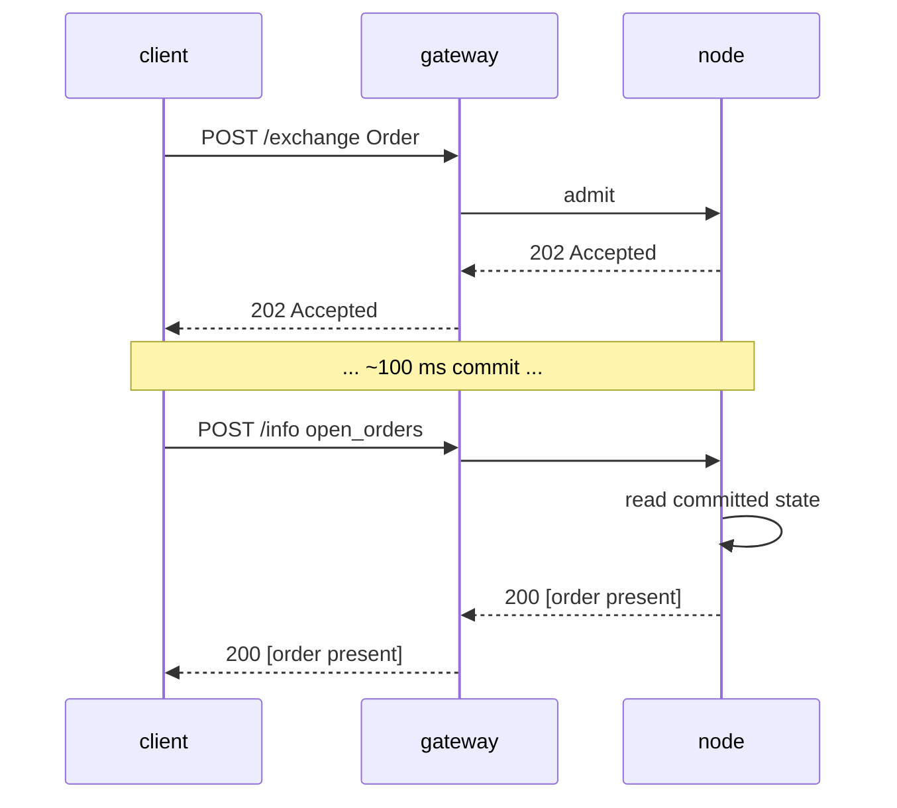

# `POST /info` — 读取路径（MTF 原生）

:::info
**状态：** 接口形态**稳定**。查询类型会持续新增，信封结构已锁定。
:::

## 简介

单一端点，多类型分发。根据请求体的 `type` 字段路由。只读——不修改任何状态，无需签名。

## URL

```
POST  https://<net>-gateway.mtf.exchange/info
```

| 路径 | 报文格式 |
|------|-----------|
| `POST /info`（网关默认路径） | MTF 原生（本文档） |
| `POST /hl/info`（网关，`/hl` 命名空间下） | **HL 兼容模式** — 参见 [hl-compat.md](./hl-compat.md) |

MTF 原生是网关的默认路径；HL 兼容模式挂载在 `/hl/*` 命名空间下。
自行运行节点时，同一原生 `/info` 接口直接通过
`http://localhost:8080` 提供服务。

## 信封格式

请求：

```json
{ "type": "<query_type>", /* 各类型特定参数 */ }
```

响应：

```json
{ "type": "<query_type>", "data": { /* 各类型特定数据 */ } }
```

遇到未知 `type` 时：返回 `400 Bad Request`，报文为 `{"error":"unknown info type: <X>"}`。
遇到未知资源（例如未知金库 id）时：返回 `404 Not Found`，报文为 `{"error":"<resource> not found"}`。

## 查询类型

### `node_info`

节点静态标识与协议版本。无需参数。

```json
{ "type": "node_info" }
```

响应：

```json
{
  "type": "node_info",
  "data": {
    "network":           "testnet",
    "chain_id":          114514,
    "protocol_version":  "1.0.0",
    "validator_index":   null,
    "build_commit":      "unknown",
    "version":           "0.0.1",
    "freeze_halt_supported": true,
    "uptime_seconds":    0
  }
}
```

| 字段 | 类型 | 说明 |
|-------|------|-------------|
| `network` | `"devnet" \| "testnet" \| "mainnet"` | 网络类型，由 `chain_id` 推导（`31337`=devnet，`114514`=testnet，`8964`=mainnet） |
| `chain_id` | uint64 | EIP-712 链 id — `/exchange` 签名域必须使用的同一值 |
| `protocol_version` | 语义版本字符串 | 报文协议版本 |
| `validator_index` | uint32 \| null | 本节点在活跃验证者集合中的索引；**待定：** 运行时调用 `set_validator_index` 之前为 `null` |
| `build_commit` | 十六进制字符串 | 运营方发布的构建标识符；**待定：** 发布前为 `"unknown"` |
| `version` | 语义版本字符串 | 节点软件发布版本，在构建时烧录。同一发布版本的所有二进制文件共享同一 `version`，`build_commit` 用于区分同版本下的不同构建 |
| `freeze_halt_supported` | bool | 本二进制始终为 `true` — 能力标志：节点支持 [`exchange_status.scheduled_freeze_height`](#exchange_status)，当冻结高度提交后以退出码 `77` 优雅停机，以便节点进程管理器切换至下一版本 |
| `uptime_seconds` | uint64 | 进程运行时长；**待定：** 运行时调用 `set_uptime_seconds` 之前为 `0` |

以上均为**节点级**字段（节点标识 / 运行时状态），而非共识状态，因此不同节点之间存在差异属于正常现象。

### `account_state`

账户快照。

```json
{ "type": "account_state", "address": "0x<addr>" }
```

| 参数 | 类型 | 必填 |
|-----|------|----------|
| `address` | 十六进制地址 | 是 |

**未知地址**（链上从未出现过）返回 **200**，数据为全零记录（`account_value:"0"`，`positions` / `balances.spot` 均为空），而非 `404`。

响应示例（水龙头充值账户，无持仓）：

```json
{
  "type": "account_state",
  "data": {
    "address":         "0x00000000000000000000000000000000000ca11e",
    "account_value":   "3000",
    "free_collateral": "3000",
    "maint_margin":    "0",
    "init_margin":     "0",
    "health":          "3000",
    "tier":            "Safe",
    "mode":            "Cross",
    "pm_enabled":      false,
    "positions": [],
    "balances": {
      "usdc": "3000",
      "spot": { "MTF": { "total": "10", "hold": "0" } }
    }
  }
}
```

`balances.spot` 中每个代币均为 `{total, hold}` 对象（与 HL 保持一致）：`hold` 为挂单（现货委托单）冻结的金额，`total` 为全部余额；可用金额为 `total − hold`。即使代币全部被冻结，该条目仍会出现。若只需读取保证金标量（无需遍历 `positions`，无需扫描余额——适合频繁查询清算健康度），请使用
[`margin_summary`](#margin_summary)。

有持仓的账户会在 `positions` 下新增条目：

```json
{
  "asset":             0,
  "size":              "100000000",
  "entry":             "67000.00",
  "upnl":              "5.00",
  "isolated":          false,
  "lev":               10,
  "liq":               "61000.00",
  "roe":               "0.0075",
  "funding":           "-0.12",
  "margin":            "201.00",
  "notional":          "6705.00"
}
```

| 字段 | 类型 | 说明 |
|-------|------|-------------|
| `account_value` | 十进制字符串 | 含已结算 PnL 的权益，**整 USDC 精度**（`"3000"` = 3000 USDC，非最小单位） |
| `free_collateral` | 十进制字符串 | 权益减去未平仓合约占用的初始保证金 |
| `maint_margin` | 十进制字符串 | Σ 各资产已用维持保证金 |
| `init_margin` | 十进制字符串 | 已占用的初始保证金要求 |
| `health` | 十进制字符串 | `account_value − maint_margin`（带符号，可为负数） |
| `tier` | 枚举 | `"Safe"`、`"T0"`、`"T1"`、`"T2"`、`"T3"`（`account_value / maint_margin` 的 BOLE 分级；无维持保证金时为 `"Safe"`）— 参见[分级清算](../../concepts/tiered-liquidation.md) |
| `mode` | 枚举 | `"Cross"`、`"Isolated"`、`"StrictIso"`（由账户未平仓合约推导） |
| `pm_enabled` | bool | 投资组合保证金启用状态 |
| `positions[*].asset` | uint32 | 资产 id |
| `positions[*].size` | i128 字符串 | 带符号的持仓量，单位为**原始手数**——`size / 10^sz_decimals` = 整数单位（`sz_decimals` 为市场的数量精度，BTC 为 5）。此为数量精度层，与 1e8 价格精度层相互独立。 |
| `positions[*].entry` | 十进制字符串 | 每整数单位开仓价格 = `\|entry_notional\| / \|real size\|`，**整 USDC 精度** |
| `positions[*].upnl` | 十进制字符串 | 盯市未实现盈亏 = `real size × mark − signed entry_notional`，**整 USDC 精度**（带符号） |
| `positions[*].isolated` | bool | `true` 表示逐仓保证金，`false` 表示全仓保证金 |
| `positions[*].lev` | uint8 | 持仓最大杠杆 |
| `positions[*].liq` | 十进制字符串 | 该持仓单独触发账户维持保证金的价格（整 USDC），为单仓全仓近似值；当 size / leverage 为零时（无有限强平价）返回 `"0"` |
| `positions[*].roe` | 十进制字符串 | `upnl / initial_margin` 的小数形式（`initial_margin = \|entry_notional\| / leverage`）；杠杆/名义价值为零时返回 `"0"` |
| `positions[*].funding` | 十进制字符串 | 该腿已计提但未结算的资金费，**整 USDC**（带符号）；`real_size × (cumulative_funding − funding_entry)` — 与资金费结算支付形式一致 |
| `positions[*].margin` | 十进制字符串 | 该腿贡献的维持保证金，**整 USDC**：`\|entry_notional\| × maint_margin_ratio` |
| `positions[*].notional` | 十进制字符串 | 按标记价格计算的持仓名义价值，**整 USDC**（带符号）：`real_size × mark_px` |
| `positions[*].side` | 枚举 \| 缺省 | **仅[对冲模式](../../concepts/hedge-mode.md)**——`"long"` / `"short"`，表示本对象报告的方向。**单向账户（持仓为单一净头寸，`size` 可为负）时省略。** 对冲账户若某资产同时持有多空两腿，则返回**两个**对象，各代表一侧。 |
| `balances.usdc` | 十进制字符串 | **与 `account_value` 保持一致**（全仓 USDC 保证金），而非独立的现货 USDC 余额 |
| `balances.spot` | object | 非 USDC 现货代币余额，以**代币名称**为键（如 `"MTF"`）；每个值为 `{total, hold}` 对象（`hold` = 现货挂单冻结金额；可用 = `total − hold`）；无现货余额时为空对象 |

### `margin_summary`

**仅保证金标量**——相当于 `account_state` 去掉 `positions[]` 遍历和现货余额扫描。适合需要频繁查询清算健康度（风控机器人、自动保证金补充）但不需要持仓/余额明细的场景。必填参数：`address`（0x 十六进制）。

```json
{ "type": "margin_summary", "address": "0x<addr>" }
```

响应 `data` 包含：`address`、`account_value`、`free_collateral`、
`maint_margin`、`init_margin`、`health`、`tier`、`mode`、`pm_enabled`——
字段语义与 [`account_state`](#account_state) 中同名字段完全一致（由共享辅助函数计算，两者结果永远一致）。

### `market_info`

单市场元数据。

```json
{ "type": "market_info", "asset_id": 0 }
```

或按名称查询：

```json
{ "type": "market_info", "coin": "BTC" }
```

响应：

```json
{
  "type": "market_info",
  "data": {
    "asset_id":        0,
    "name":            "BTC",
    "kind":            "perp",
    "sz_decimals":     5,
    "mark_px":         "67079.265",
    "oracle_px":       "67073.35",
    "mid_px":          "67079.27",
    "premium":         "0.0015",
    "tick_size":       "1000000",
    "step_size":       "1",
    "min_order":       "1",
    "max_leverage":    50,
    "maint_margin_ratio": "300",
    "init_margin_ratio":  "200",
    "funding": {
      "rate_per_hr":  "0",
      "cap_per_hr":   "400",
      "interval_ms":     3600000,
      "next_payment_ts": 0
    },
    "mark_source": "MedianOfOraclesAndMid",
    "fba_enabled": false,
    "open_interest": "0"
  }
}
```

:::info
**价格精度层说明。** 此读取接口中，`mark_px` 和 `oracle_px` 均采用**整 USDC 十进制精度**（即人类可读的美元价格——`"67079.265"` / `"67073.35"`），与账户持仓的标记价格单位一致。`mark_px` 是引擎内部 1e8 定点表示缩放后的账本标记价格，若账本尚无标记价格则回退至 oracle 价格；`oracle_px` 是最新已提交的指数价格。未设置时两者均为 `"0"`。注意**委托单/账本提交仍使用 1e8 定点精度**——`l2_book` 的报价和委托单 `limit_px` 均非整 USDC；MTF 严格区分这两套精度层，只有面向用户的读取接口（`market_info`、`markets`、持仓）以整 USDC 报价。其余字段语义详见下方 [`markets`](#markets) 表格。
:::

:::info
**价格精度与 `sz_decimals` 的区别。** `mark_px` 和 `oracle_px` 会**对齐到市场的价格最小变动单位**（`tick_size`，向零截断），因此读取结果不会出现子 tick 噪声——在 `$0.01` 最小变动单位（1e8 精度下 `tick_size: "1000000"`）下，`66735.255` 会报告为 `"66735.25"`。注意 `sz_decimals` 是**数量**精度（委托单数量粒度——`5` ⇒ `0.00001` 单位），不控制价格小数位；价格精度由 tick 大小决定。两者是相互独立的维度（与 HL 的设计一致）。
:::

### `markets`

所有已注册的 MIP-3 永续合约市场，一次性返回。无需参数。

```json
{ "type": "markets" }
```

`data` 载荷为**数组**，每个元素与 [`market_info`](#market_info) 对单个资产的响应结构相同。记录按 `asset_id` 升序确定性排列（节点遍历 `mip3_market_specs` 的 `BTreeMap`）。市场列表为空时返回 `"data": []`。

响应：

```json
{
  "type": "markets",
  "data": [
    {
      "asset_id":        0,
      "name":            "BTC",
      "kind":            "perp",
      "sz_decimals":     5,
      "mark_px":         "67042.335",
      "oracle_px":       "67042.335",
      "mid_px":          "67042.33",
      "premium":         "0.0015",
      "tick_size":       "1000000",
      "step_size":       "1",
      "min_order":       "1",
      "max_leverage":    50,
      "maint_margin_ratio": "300",
      "init_margin_ratio":  "200",
      "funding": {
        "rate_per_hr":  "0",
        "cap_per_hr":   "400",
        "interval_ms":     3600000,
        "next_payment_ts": 0
      },
      "mark_source": "MedianOfOraclesAndMid",
      "fba_enabled": false,
      "open_interest": "0"
    }
  ]
}
```

| 字段 | 类型 | 说明 |
|-------|------|-------------|
| `asset_id` | uint32 | 规范资产 id（排序键） |
| `name` | string | 市场代码，如 `"BTC"` |
| `kind` | `"perp"` | 市场类型（小写） |
| `sz_decimals` | uint8 | 数量显示小数位（来自底层现货代币注册表；无代币规格时为 `0`） |
| `mark_px` | 十进制字符串 | 账本标记价格，**整 USDC 精度**（由 1e8 缩放，oracle 兜底；未设置时为 `"0"`） |
| `oracle_px` | 十进制字符串 | 指数价格，**整 USDC 精度**（未设置时为 `"0"`） |
| `mid_px` | 十进制字符串 \| null | 真实账本中间价 `(best_bid + best_ask) / 2`，**整 USDC 精度**（tick 对齐）；账本单边或为空时为 `null` |
| `premium` | 十进制字符串 \| null | 最新已提交的资金溢价样本（带符号）；无样本时为 `null` |
| `tick_size` | i128 字符串 | 最小价格变动单位，**1e8 定点精度**（委托单/账本提交精度层） |
| `step_size` | u128 字符串 | 最小数量变动单位（手数大小），定点精度 |
| `min_order` | u128 字符串 | 最小委托单数量 |
| `max_leverage` | uint8 | 最大杠杆倍数 |
| `maint_margin_ratio` | bps 字符串 | 维持保证金比例，十进制基点 |
| `init_margin_ratio` | bps 字符串 | 初始保证金比例（`1 / max_leverage`），十进制基点 |
| `funding.rate_per_hr` | bps 字符串 | 最新资金溢价样本，十进制基点 |
| `funding.cap_per_hr` | bps 字符串 | 每小时资金费率上限，十进制基点 |
| `funding.interval_ms` | uint64 | 资金费结算间隔（1小时 = `3600000`） |
| `funding.next_payment_ts` | uint64 | 下次资金费结算时间戳（有样本前为 `0`） |
| `mark_source` | string | 标记价格来源描述符（`"MedianOfOraclesAndMid"`） |
| `fba_enabled` | bool | 该市场是否启用频繁批量竞价 |
| `open_interest` | u128 字符串 | 当前未平仓合约量，定点精度 |

每个元素与对应单资产 `market_info` 响应的 `data` 字节完全一致——两者均由同一个市场记录构建器生成，因此单查和批量查询的结构永远保持一致。字段层面的语义及待定代理注记（`mark_source`、`next_payment_ts`）详见 [`market_info`](#market_info)。

### `vault_state`

金库快照。

```json
{ "type": "vault_state", "vault": "0x<vault_addr>" }
```

响应：

```json
{
  "type": "vault_state",
  "data": {
    "vault":              "0x<addr>",
    "name":               "MFlux Conservative",
    "tvl":             "10000000000",
    "share_price":     "10500000",
    "depositor_count":    142,
    "high_water_mark": "10500000",
    "performance_fee_bps":1000,
    "lock_period_ms":     86400000,
    "strategy":           "MarketNeutral"
  }
}
```

### `staking_state`

```json
{ "type": "staking_state", "address": "0x<addr>" }
```

响应：

```json
{
  "type": "staking_state",
  "data": {
    "address":         "0x<addr>",
    "total_staked": "1000000000",
    "delegations": [
      {
        "validator":         "0x<val_addr>",
        "amount":         "500000000",
        "since_ts":          1735000000000,
        "pending_rewards":"1000000"
      }
    ],
    "pending_unstakes": [
      { "amount": "200000000", "matures_at_ts": 1735780000000 }
    ]
  }
}
```

### `fee_schedule`

```json
{ "type": "fee_schedule" }
```

响应：

```json
{
  "type": "fee_schedule",
  "data": {
    "tiers": [
      { "volume_30d": "0",         "maker_bps": "2.0", "taker_bps": "5.0" },
      { "volume_30d": "100000000", "maker_bps": "1.5", "taker_bps": "4.5" },
      { "volume_30d": "1000000000","maker_bps": "1.0", "taker_bps": "4.0" }
    ],
    "builder_rebate_bps": "0.2",
    "burn_ratio":         "0.30",
    "referrer_share_bps": "1.0"
  }
}
```

费率为以字符串表示的十进制**基点**（`"2.0"` = 2 bps = 0.02%）。`burn_ratio` 为十进制小数（`"0.30"` = 30% 的手续费被销毁）。详见[手续费](../../concepts/fees.md)。

### `open_orders`

账户维度下所有永续合约订单簿中的挂单。

```json
{ "type": "open_orders", "account_id": 42 }
```

| 参数 | 类型 | 必填 |
|-----|------|----------|
| `account_id` | uint64 | `account_id` / `address` 二选一 |
| `address` | hex address | `account_id` / `address` 二选一 |

可通过 `account_id`（u64）或 `address`（0x 十六进制）来标识账户。若请求中传入 `account_id`，响应的 `data.account_id` 中将原样返回。

响应：

```json
{
  "type": "open_orders",
  "data": {
    "address":    "0x<addr>",
    "account_id": 42,
    "orders": [
      {
        "oid":          12345,
        "market_id":    0,
        "side":         "bid",
        "px":        "99000",
        "size":      "700",
        "cloid":        "0x000000000000000000000000cafef00d",
        "inserted_at_ms": 1700000000000
      }
    ]
  }
}
```

| 字段 | 类型 | 说明 |
|-------|------|-------------|
| `address` | hex address | 已解析的账户地址 |
| `account_id` | uint64 | 仅当请求使用 `account_id` 时返回 |
| `orders[*].oid` | uint64 | 服务端订单 ID |
| `orders[*].market_id` | uint32 | 该订单所属的资产 / 市场 ID |
| `orders[*].side` | `"bid"` / `"ask"` | 订单方向 |
| `orders[*].px` | i128 string | 挂单价格，定点小数字符串 |
| `orders[*].size` | u128 string | 剩余数量，定点小数字符串 |
| `orders[*].cloid` | hex string \| null | 下单时指定的客户端订单 ID（`0x` + 32 位十六进制字符）；未设置时为 `null` |
| `orders[*].inserted_at_ms` | uint64 | 下单 / 入队时间戳（共识毫秒） |

### `l2_book`

市场维度的聚合买卖档位。

```json
{ "type": "l2_book", "market_id": 0 }
```

| 参数 | 类型 | 必填 |
|-----|------|----------|
| `market_id` | uint32 | 是 |

响应：

```json
{
  "type": "l2_book",
  "data": {
    "market_id": 0,
    "bids": [ { "px": "99000", "size": "700", "n_orders": 1 } ],
    "asks": [ { "px": "101000", "size": "750", "n_orders": 2 } ]
  }
}
```

买单按最优优先排列（价格降序），卖单升序。每个档位汇总了该价位的总 `size` 及挂单数量 `n_orders`。未知或空仓市场将返回空的 `bids` / `asks` 数组。

| 字段 | 类型 | 说明 |
|-------|------|-------------|
| `market_id` | uint32 | 回显的市场 ID |
| `bids[*].px` / `asks[*].px` | i128 string | 档位价格，定点小数字符串 |
| `bids[*].size` / `asks[*].size` | u128 string | 该档位的汇总数量 |
| `bids[*].n_orders` / `asks[*].n_orders` | uint64 | 该档位的挂单笔数 |

### `recent_trades`

市场维度的公开成交记录，直接从节点已提交的链上状态返回（每个市场维护一个有界成交环形缓冲区，已折叠进 AppHash，无需外部索引器）。

```json
{ "type": "recent_trades", "market_id": 0 }
```

| 参数 | 类型 | 必填 | 说明 |
|-----|------|----------|-------------|
| `market_id` | uint32 | 是 | 资产 / 市场 ID |
| `limit` | uint32 | 否 | 限制返回**最近**记录的条数；缺省或为 `0` 时返回完整环形缓冲区 |

响应：

```json
{
  "type": "recent_trades",
  "data": {
    "market_id":      0,
    "last_trade_ms":  1700000000555,
    "trades": [
      {
        "coin":  0,
        "side":  "B",
        "px":    "67042.50",
        "sz":    "0.125",
        "time":  1700000000555,
        "tid":   90123,
        "block": 562,
        "hash":  "0x2315b79b9e82c2deb279a59448bf7841f3767d30d874e5b544d75bb9fd1e9b0c"
      }
    ]
  }
}
```

记录按时间升序排列（最旧在前，最新在后）。环形缓冲区有容量上限，因此仅包含近期数据，并非全量历史。未知或从未成交的市场将返回 `"trades": []` 及 `last_trade_ms: 0`。

| 字段 | 类型 | 说明 |
|-------|------|-------------|
| `market_id` | uint32 | 回显的市场 ID |
| `last_trade_ms` | uint64 | 最后一笔成交的时间戳（无成交时为 `0`） |
| `trades[*].coin` | uint32 | 该笔成交所属的资产 / 市场 ID |
| `trades[*].side` | `"B"` / `"A"` | 吃单（主动方）方向标记 — `"B"` = 买入，`"A"` = 卖出 |
| `trades[*].px` | Decimal string | 成交价格，**十进制 USDC**（人类可读格式） |
| `trades[*].sz` | Decimal string | 成交数量，**基础单位**（整数单位） |
| `trades[*].time` | uint64 | 成交时间戳（共识毫秒） |
| `trades[*].tid` | uint64 | 确定性成交 ID（买卖双腿共享） |
| `trades[*].block` | uint64 | 该笔成交结算所在的已提交区块高度（链上定位标识） |
| `trades[*].hash` | hex string | 源订单的交易哈希，`0x` 前缀十六进制 — 可用于链上溯源 |

### `candle`

查询 `(coin, interval)` 在指定时间窗口内的历史 OHLCV K 线数据。对应实时 WebSocket 频道 [`candles`](../ws/subscriptions.md#candles) 的 REST 接口 — WS 推送成交中的正在形成的 K 线，本接口返回已收盘的历史 K 线。

```json
{ "type": "candle", "coin": "BTC", "interval": "1m" }
```

| 参数 | 类型 | 必填 | 说明 |
|-----|------|----------|-------------|
| `coin` | string | 是 | 市场代码，例如 `"BTC"` |
| `interval` | string | 是 | 周期标识 — 可选值：`1m`、`5m`、`15m`、`1h`、`4h`、`1d` |
| `start_time` | uint64 | 否 | 窗口起始时间（ms），按 K 线开盘时间过滤。默认为 `0` |
| `end_time` | uint64 | 否 | 窗口结束时间（ms），按 K 线开盘时间过滤。默认不限上界 |

参数可直接展平传入（如上），也可嵌套在 `req` 对象下；`start_time` / `end_time` 同时支持驼峰写法 `startTime` / `endTime`。缺少 `coin` 或 `interval` 时返回 `400 {"error":"missing field <name>"}`。

响应：

```json
{
  "type": "candle",
  "data": [
    {
      "t": 1700000040000,
      "T": 1700000099999,
      "s": "BTC",
      "i": "1m",
      "o": "67000.00",
      "c": "67042.50",
      "h": "67080.00",
      "l": "66990.00",
      "v": "12.5",
      "q": "837843.75",
      "n": 37
    }
  ]
}
```

K 线按 `t`（开盘时间）升序排列，最新元素为正在形成的 K 线。若 `interval` 标识不支持、市场无任何已索引成交，或部署环境未接入索引器，则返回空数组。

| 字段 | 类型 | 说明 |
|-------|------|-------------|
| `t` | uint64 | K 线**开盘**时间戳（ms，按周期对齐） |
| `T` | uint64 | K 线**收盘**时间戳（ms）— `t + interval − 1` |
| `s` | string | 币种 / 市场代码 |
| `i` | string | 周期标识 |
| `o` / `c` / `h` / `l` | Decimal string | **开**盘 / **收**盘 / **最高** / **最低**价，**十进制 USDC**（人类可读美元值，例如 `"67042.50"`） |
| `v` | Decimal string | **基础资产成交量** — K 线内累计成交数量（币本位，非名义价值） |
| `q` | Decimal string | **计价货币（USD）成交额** — K 线内所有成交的 `Σ 价格 × 数量` |
| `n` | uint64 | K 线内的成交（撮合）笔数 |

:::info
**序列无间隙。** 若某个周期内**无成交**，仍会生成一根平坦 K 线，以上根 K 线收盘价填充：`o = h = l = c = 前根收盘价`，且 `v = q = 0`，`n = 0`。消费方可获得每个周期连续的 K 线序列，无需自行插值填补空缺。**市场首笔成交前不生成任何 K 线** — 序列从首笔成交所在的周期桶开始，因此返回空数组意味着该市场从未发生成交（或未接入历史数据），而非早期 K 线被丢弃。
:::

:::info
**此类型由网关提供服务，而非节点。** K 线是从公开成交流衍生的展示数据 — **不属于**已提交的链上状态，不涉及 app-hash，也不具备共识保证。网关从自身的滚动存储中响应 `candle` 请求；若直接查询裸节点，将返回 `unknown info type: candle`。当网关尚无该市场的成交历史时，诚实地返回空数据（`"data": []`）。
:::

### `user_fills`

账户维度的历史成交记录，直接从节点已提交的链上状态返回（每个账户维护一个有界成交环形缓冲区，已折叠进 AppHash，无需外部索引器）。

```json
{ "type": "user_fills", "account_id": 42 }
```

| 参数 | 类型 | 必填 | 说明 |
|-----|------|----------|-------------|
| `account_id` | uint64 | `account_id` / `address` 二选一 | 内部账户 ID |
| `address` | hex address | `account_id` / `address` 二选一 | 账户地址 |
| `limit` | uint32 | 否 | 限制返回**最近**记录的条数；缺省或为 `0` 时返回完整环形缓冲区 |

可通过 `account_id`（u64）或 `address`（0x 十六进制）来标识账户。若请求中传入 `account_id`，响应的 `data.account_id` 中将原样返回。

响应：

```json
{
  "type": "user_fills",
  "data": {
    "address":    "0x<addr>",
    "account_id": 42,
    "fills": [
      {
        "coin":           0,
        "side":           "B",
        "px":             "67042.50",
        "sz":             "0.125",
        "time":           1700000000555,
        "oid":            12345,
        "tid":            90123,
        "fee":            "4.19",
        "closed_pnl":     "0",
        "dir":            "Open Long",
        "start_position": "0",
        "block":          562,
        "hash":           "0x2315b79b9e82c2deb279a59448bf7841f3767d30d874e5b544d75bb9fd1e9b0c"
      }
    ]
  }
}
```

记录按时间升序排列（最旧在前，最新在后）。环形缓冲区有容量上限，因此仅包含近期数据，并非全量历史。无成交记录的账户将返回 `"fills": []`。

| 字段 | 类型 | 说明 |
|-------|------|-------------|
| `address` | hex address | 已解析的账户地址 |
| `account_id` | uint64 | 仅当请求使用 `account_id` 时返回 |
| `fills[*].coin` | uint32 | 该笔成交所属的资产 / 市场 ID |
| `fills[*].side` | `"B"` / `"A"` | 本腿方向标记 — `"B"` = 买入/买方，`"A"` = 卖出/卖方 |
| `fills[*].px` | Decimal string | 成交价格，**十进制 USDC**（人类可读格式） |
| `fills[*].sz` | Decimal string | 成交数量，**基础单位**（整数单位） |
| `fills[*].time` | uint64 | 成交时间戳（共识毫秒） |
| `fills[*].oid` | uint64 | 本方订单 ID |
| `fills[*].tid` | uint64 | 确定性成交 ID（买卖双腿共享） |
| `fills[*].fee` | Decimal string | 本方支付的手续费，**十进制 USDC** |
| `fills[*].closed_pnl` | Decimal string | 平仓部分的已实现盈亏，**十进制 USDC**（有符号） |
| `fills[*].dir` | string | 方向标签，例如 `"Open Long"`、`"Close Short"`、`"Open Short"`、`"Close Long"` |
| `fills[*].start_position` | Decimal string | 成交前本腿的有符号持仓数量，**基础单位**（整数单位，有符号） |
| `fills[*].block` | uint64 | 该笔成交结算所在的已提交区块高度（链上定位标识） |
| `fills[*].hash` | hex string | 源订单的交易哈希，`0x` 前缀十六进制 — 可用于链上溯源 |

### `user_fills_by_time`

与 [`user_fills`](#user_fills) 类似，但按每条记录的共识 `time` 过滤至指定时间窗口。成交记录字段结构相同。

```json
{ "type": "user_fills_by_time", "address": "0x<addr>", "start_time": 1700000000000, "end_time": 1700003600000 }
```

| 参数 | 类型 | 必填 | 说明 |
|-----|------|----------|-------------|
| `account_id` | uint64 | `account_id` / `address` 二选一 | 内部账户 ID |
| `address` | hex address | `account_id` / `address` 二选一 | 账户地址 |
| `start_time` | uint64 | 否 | 窗口起始时间（ms，含边界），按成交 `time` 过滤。缺省时下界开放 |
| `end_time` | uint64 | 否 | 窗口结束时间（ms，含边界）。缺省时上界开放 |

响应：

```json
{
  "type": "user_fills_by_time",
  "data": {
    "address":    "0x<addr>",
    "account_id": 42,
    "start_time": 1700000000000,
    "end_time":   1700003600000,
    "fills": [ /* same record shape as user_fills */ ]
  }
}
```

| 字段 | 类型 | 说明 |
|-------|------|-------------|
| `address` | hex address | 已解析的账户地址 |
| `account_id` | uint64 | 仅当请求使用 `account_id` 时返回 |
| `start_time` | uint64 \| null | 回显的窗口起始时间（未传入时为 `null`） |
| `end_time` | uint64 \| null | 回显的窗口结束时间（未传入时为 `null`） |
| `fills` | array | 窗口内的成交记录（与 [`user_fills`](#user_fills) 的单条成交字段结构相同），按时间升序 |

### `order_status`

通过 `oid`（服务端订单 ID）**或** `cloid`（客户端订单 ID）查询单笔订单的生命周期状态。查询范围涵盖实时订单簿、触发器注册表及已提交成交环形缓冲区，均为节点已提交的链上状态。

```json
{ "type": "order_status", "oid": 12345 }
```

或通过客户端订单 ID 查询：

```json
{ "type": "order_status", "cloid": "0x000000000000000000000000cafef00d" }
```

| 参数 | 类型 | 必填 | 说明 |
|-----|------|----------|-------------|
| `oid` | uint64 | `oid` / `cloid` 二选一 | 服务端订单 ID |
| `cloid` | hex string | `oid` / `cloid` 二选一 | 客户端订单 ID — `0x` + 32 位十六进制字符 |

两者均未传入时返回 `400 {"error":"missing field oid or cloid"}`。`cloid` 格式非法时返回 `400`。解析按以下顺序在首次命中时停止：实时挂单 → 已挂起触发器 → 终态成交记录 → 未知。

`data.status` 区分以下分支：

`"resting"` — 永续合约或现货订单簿中的实时挂单：

```json
{
  "type": "order_status",
  "data": {
    "status": "resting",
    "order": {
      "oid":            12345,
      "market_id":      0,
      "side":           "bid",
      "px":             "67000",
      "size":           "700",
      "inserted_at_ms": 1700000000000,
      "cloid":          "0x000000000000000000000000cafef00d"
    }
  }
}
```

`"triggered"` — 已挂起的止盈/止损/条件单，等待标记价格穿越：

```json
{
  "type": "order_status",
  "data": {
    "status": "triggered",
    "trigger": {
      "oid":              12345,
      "market_id":        0,
      "side":             "ask",
      "trigger_px":       "66000",
      "trigger_above":    false,
      "size":             "700",
      "registered_at_ms": 1700000000000,
      "fired":            false
    }
  }
}
```

`"filled"` — 账户成交环形缓冲区中最近匹配的成交记录（`fill` 对象结构与 [`user_fills`](#user_fills) 的单条成交记录相同）：

```json
{
  "type": "order_status",
  "data": {
    "status": "filled",
    "fill": { /* same shape as a user_fills fill record */ }
  }
}
```

`"unknown"` — 从未出现，或已从有界环形缓冲区中淘汰（仅凭 `cloid` 查询但未命中任何挂单或触发器时也解析为此状态，因为触发器注册表和成交环形缓冲区均以 `oid` 为键）：

```json
{ "type": "order_status", "data": { "status": "unknown" } }
```

| 字段 | 类型 | 说明 |
|-------|------|-------------|
| `status` | `"resting" \| "triggered" \| "filled" \| "unknown"` | 已解析的生命周期状态 |
| `order` | object | 状态为 `"resting"` 时存在 — 包含 `oid`、`market_id`、`side`（`"bid"`/`"ask"`）、`px` / `size`（定点小数字符串）、`inserted_at_ms`、`cloid`（hex \| null） |
| `trigger` | object | 状态为 `"triggered"` 时存在 — 包含 `oid`、`market_id`、`side`、`trigger_px` / `size`（定点小数字符串）、`trigger_above`（布尔值：标记价格向上穿越时触发）、`registered_at_ms`、`fired`（布尔值） |
| `fill` | object | 状态为 `"filled"` 时存在 — 对应的成交记录（见 [`user_fills`](#user_fills)） |

### `funding_history`

特定市场的资金费溢价历史样本。

```json
{ "type": "funding_history", "market_id": 0 }
```

| 参数 | 类型 | 是否必填 |
|-----|------|----------|
| `market_id` | uint32 | 是 |

响应：

```json
{
  "type": "funding_history",
  "data": {
    "market_id": 0,
    "samples": [
      { "ts_ms": 1700000000000, "premium": "0.0015", "funding_rate": "0.0015" },
      { "ts_ms": 1700000008000, "premium": "-0.0007", "funding_rate": "-0.0007" }
    ]
  }
}
```

样本为资金费追踪器中溢价快照的有序环形缓冲区。
`premium` 是钳制前的原始 `Decimal` 值，以字符串形式呈现（带符号，全精度）；`funding_rate` 是该溢价经过每资产资金费率上限（`±funding_rate_cap`，动态风险覆盖值，或默认 `0.04`/小时基准值）钳制后的实际收取费率——即实际会被扣收的已实现费率。当溢价在上限范围内时，`funding_rate == premium`；超出上限时，`funding_rate` 被钳制到带符号的上限值。未知或空市场返回 `"samples": []`。

| 字段 | 类型 | 说明 |
|-------|------|-------------|
| `market_id` | uint32 | 回传的市场 ID |
| `samples[*].ts_ms` | uint64 | 样本时间戳（共识毫秒） |
| `samples[*].premium` | decimal string | 原始资金费溢价样本，钳制前（带符号） |
| `samples[*].funding_rate` | decimal string | 已实现费率 = `premium` 经每资产上限钳制后的值（带符号） |

### `predicted_fundings`

所有已注册永续合约市场的预测资金费率及下次结算时间。无需参数。

```json
{ "type": "predicted_fundings" }
```

`data` 载荷为**数组**，按 `asset` 升序确定性排列（节点遍历市场规格 `BTreeMap`）。若市场为空，返回 `"data": []`。

响应：

```json
{
  "type": "predicted_fundings",
  "data": [
    { "asset": 0, "predicted_rate": "0.0015", "next_funding_time": 1700003600000 }
  ]
}
```

`predicted_rate` 为最新溢价样本（每小时费率代理值，decimal 字符串）——首个样本前为 `"0"`。`next_funding_time` 为推导出的下次结算时间戳（`last_sample_ts + 1h`），首个样本前为 `0`。

| 字段 | 类型 | 说明 |
|-------|------|-------------|
| `asset` | uint32 | 资产/市场 ID |
| `predicted_rate` | decimal string | 最新溢价样本（每小时费率代理值）；样本前为 `"0"` |
| `next_funding_time` | uint64 | 下次资金费结算时间戳（共识毫秒）；样本前为 `0` |

### `block_info`

已提交区块的元数据。无必填参数（`height` 可传但会被忽略——读取状态仅保留最新已提交上下文）。

```json
{ "type": "block_info" }
```

响应：

```json
{
  "type": "block_info",
  "data": {
    "height":       562,
    "round":        562,
    "epoch":        0,
    "timestamp_ms": 1780475491562,
    "block_hash":   "0x2315b79b9e82c2deb279a59448bf7841f3767d30d874e5b544d75bb9fd1e9b0c"
  }
}
```

| 字段 | 类型 | 说明 |
|-------|------|-------------|
| `height` | uint64 | 最新已提交区块高度 |
| `round` | uint64 | 该区块的共识轮次 |
| `epoch` | uint64 | 当前纪元 |
| `timestamp_ms` | uint64 | 区块时间戳（共识毫秒） |
| `block_hash` | hex string (32 bytes) | 真实已提交区块哈希（已接入读取状态，不再是全零占位符） |

### `agents`

账户已授权的代理/API 钱包。

```json
{ "type": "agents", "account_id": 42 }
```

| 参数 | 类型 | 是否必填 |
|-----|------|----------|
| `account_id` | uint64 | `account_id` / `address` 二选一 |
| `address` | hex address | `account_id` / `address` 二选一 |

响应：

```json
{
  "type": "agents",
  "data": {
    "address":    "0x<master>",
    "account_id": 42,
    "agents": [
      { "agent": "0x<agent_addr>", "name": "trading-bot", "expires_at_ms": 1700000500000 }
    ]
  }
}
```

| 字段 | 类型 | 说明 |
|-------|------|-------------|
| `address` | hex address | 解析后的主地址 |
| `account_id` | uint64 | 仅当请求使用 `account_id` 时回传 |
| `agents[*].agent` | hex address | 已授权的代理钱包地址 |
| `agents[*].name` | string \| null | 授权时设置的代理标签；未设置则为 `null` |
| `agents[*].expires_at_ms` | uint64 \| null | 代理授权到期时间（共识毫秒）；永不过期的授权为 `null` |

### `sub_accounts`

账户的子账户列表。

```json
{ "type": "sub_accounts", "account_id": 42 }
```

| 参数 | 类型 | 是否必填 |
|-----|------|----------|
| `account_id` | uint64 | `account_id` / `address` 二选一 |
| `address` | hex address | `account_id` / `address` 二选一 |

响应：

```json
{
  "type": "sub_accounts",
  "data": {
    "address":    "0x<parent>",
    "account_id": 42,
    "sub_accounts": [
      { "index": 0, "address": "0x<sub_addr>" }
    ]
  }
}
```

| 字段 | 类型 | 说明 |
|-------|------|-------------|
| `address` | hex address | 解析后的父账户地址 |
| `account_id` | uint64 | 仅当请求使用 `account_id` 时回传 |
| `sub_accounts[*].index` | uint32 | 父账户下的子账户索引 |
| `sub_accounts[*].address` | hex address | 子账户地址 |

### `mip3_active_bids`

MIP-3 无许可永续合约部署 Gas 拍卖快照。无需参数。

```json
{ "type": "mip3_active_bids" }
```

响应：

```json
{
  "type": "mip3_active_bids",
  "data": {
    "auction_round":   2,
    "current_bid":     "12345",
    "current_winner":  "0x<bidder>",
    "auction_end_ms":  1700086400000,
    "started_at_ms":   1700000000000,
    "bids": [
      {
        "bidder":          "0x<bidder>",
        "amount":          "12345",
        "submitted_at_ms": 1700000000500,
        "tag":             "ETH-PERP"
      }
    ]
  }
}
```

| 字段 | 类型 | 说明 |
|-------|------|-------------|
| `auction_round` | uint64 | 当前拍卖轮次 |
| `current_bid` | decimal string | 当前领先出价金额 |
| `current_winner` | hex address \| null | 当前胜出竞拍者；无人出价则为 `null` |
| `auction_end_ms` | uint64 | 拍卖结束时间戳（共识毫秒） |
| `started_at_ms` | uint64 | 拍卖开始时间戳（共识毫秒） |
| `bids[*].bidder` | hex address | 竞拍者地址 |
| `bids[*].amount` | decimal string | 出价金额 |
| `bids[*].submitted_at_ms` | uint64 | 出价提交时间戳（共识毫秒） |
| `bids[*].tag` | string | 出价标签（例如拟议市场名称） |

### `protocol_metrics`

协议全局已提交累计量/计数器。无需参数。所有字段直接读取已提交的 `Exchange` 状态（计数器、手续费池、BOLE 储备、质押）——不依赖撮合引擎或预言机计算，因此回放结果完全一致。

```json
{ "type": "protocol_metrics" }
```

响应：

```json
{
  "type": "protocol_metrics",
  "data": {
    "counters": {
      "total_orders":               1000,
      "total_fills":                750,
      "total_liquidations":         3,
      "total_deposits":             40,
      "total_withdrawals":          12,
      "total_vault_transfers":      0,
      "total_sub_account_transfers":0
    },
    "fee_pools": {
      "burned":         "8000",
      "mflux_vault":    "0",
      "validator_pool": "1000",
      "treasury":       "1000",
      "burned_mtf":     "55"
    },
    "insurance_fund_total":    "750",
    "treasury_backstop_total": "9000",
    "bole_pool": {
      "total_deposits":  "20000",
      "shortfall_total": "7"
    },
    "open_interest_total_1e8": "1500000",
    "staking": {
      "total_stake":   "100",
      "n_validators":  1,
      "n_active":      1,
      "n_jailed":      0,
      "current_epoch": 4
    },
    "counts": {
      "n_markets":             1,
      "n_spot_pairs":          5,
      "n_user_vaults":         0,
      "n_accounts_with_state": 12
    }
  }
}
```

| 字段 | 类型 | 说明 |
|-------|------|-------------|
| `counters.total_orders` | uint64 | 历史累计已受理订单数 |
| `counters.total_fills` | uint64 | 历史累计成交数（唯一可拆解的交易信号——为**计数**，非名义金额） |
| `counters.total_liquidations` | uint64 | 历史累计清算次数 |
| `counters.total_deposits` / `total_withdrawals` | uint64 | 历史累计充值/提现次数 |
| `counters.total_vault_transfers` | uint64 | 历史累计金库充提划转次数 |
| `counters.total_sub_account_transfers` | uint64 | 历史累计子账户划转次数 |
| `fee_pools.burned` | Decimal string | 累计用于回购销毁的 USDC（整数 USDC） |
| `fee_pools.mflux_vault` | Decimal string | 累计 MFlux 金库手续费应计（`"0"`——金库份额已归零） |
| `fee_pools.validator_pool` | Decimal string | 累计验证者池手续费应计（整数 USDC） |
| `fee_pools.treasury` | Decimal string | 累计国库手续费应计（整数 USDC） |
| `fee_pools.burned_mtf` | Decimal string | 回购执行器累计销毁的 MTF |
| `insurance_fund_total` | Decimal string | 各资产 `bole_pool.insurance_fund` 储备之和（整数 USDC） |
| `treasury_backstop_total` | Decimal string | 各资产 `bole_pool.treasury_backstop` 储备之和（整数 USDC） |
| `bole_pool.total_deposits` | Decimal string | BOLE 借贷池累计总存款（整数 USDC） |
| `bole_pool.shortfall_total` | Decimal string | ADL → 保险 → 国库瀑布处理后残余坏账之和 |
| `open_interest_total_1e8` | u128 string | 各市场未平仓量之和，**1e8 账本单位**（标注 `_1e8`，非整数 USDC） |
| `staking.total_stake` | Decimal string | 总质押 MTF（整数 MTF） |
| `staking.n_validators` | uint64 | 已提交集合中的验证者数量 |
| `staking.n_active` | uint64 | 本纪元活跃验证者数量 |
| `staking.n_jailed` | uint64 | 当前被监禁的验证者数量 |
| `staking.current_epoch` | uint64 | 当前质押纪元 |
| `counts.n_markets` | uint64 | 已注册的 MIP-3 永续合约市场数（`mip3_market_specs`） |
| `counts.n_spot_pairs` | uint64 | 已注册的现货交易对数（`mip3_spot_pair_specs`） |
| `counts.n_user_vaults` | uint64 | 已注册的用户金库数 |
| `counts.n_accounts_with_state` | uint64 | 拥有已提交用户状态的账户数 |

:::info
**无累计交易名义金额字段。** 引擎追踪每用户**30 日手续费交易量**（参见 [`user_fees`](#user_fees)）以及历史累计成交**次数**（`counters.total_fills`）——不存在**已提交的全协议交易美元累计量**，因此该接口有意不提供此数据，以免误导用户认为存在交易量总计。计数器为单调递增的活动计次，而非金额。
:::

状态来源：`locus.{counters, fee_tracker.fee_distribution, bole_pool}` + `c_staking` + 注册表大小。

### `user_fees`

账户手续费/交易量等级。必填：`account_id`（u64）**或** `address`（0x 十六进制）。

```json
{ "type": "user_fees", "account_id": 42 }
```

| 参数 | 类型 | 是否必填 |
|-----|------|----------|
| `account_id` | uint64 | `account_id` / `address` 二选一 |
| `address` | hex address | `account_id` / `address` 二选一 |

两者均未提供 → `400`。若账户无手续费状态，返回 **200**，交易量归零，并使用基础档位 bps——遵循既有的归零惯例。

响应：

```json
{
  "type": "user_fees",
  "data": {
    "address":          "0x<addr>",
    "account_id":       42,
    "taker_volume_30d": "1250000",
    "maker_volume_30d": "800000",
    "vip_tier":         2,
    "mm_tier":          1,
    "referrer":         "0x<referrer>",
    "referrer_credit":  "420",
    "maker_bps":        1,
    "taker_bps":        3
  }
}
```

| 字段 | 类型 | 说明 |
|-------|------|-------------|
| `address` | hex address | 解析后的账户地址 |
| `account_id` | uint64 | 仅当请求使用 `account_id` 时回传 |
| `taker_volume_30d` | Decimal string | 滚动 30 日吃单交易量（整数 USDC） |
| `maker_volume_30d` | Decimal string | 滚动 30 日挂单交易量（整数 USDC） |
| `vip_tier` | uint | 已提交的用户 VIP 等级索引；未追踪时为 `0` |
| `mm_tier` | uint | 已提交的用户做市商等级索引；未追踪时为 `0` |
| `referrer` | hex address \| null | 该账户的推荐人地址（如已设置），否则为 `null` |
| `referrer_credit` | Decimal string | 该地址作为推荐人累计获得的返佣之和（整数 USDC） |
| `maker_bps` | uint | **实际生效**的挂单手续费 bps，依据该账户 30 日挂单量从已提交 [`fee_schedule`](#fee_schedule) 交易量档位阶梯解析 |
| `taker_bps` | uint | **实际生效**的吃单手续费 bps，依据该账户 30 日吃单量从已提交阶梯解析 |

实际生效的 `maker_bps` / `taker_bps` 按方向分别从已提交交易量档位阶梯（[`fee_schedule`](#fee_schedule)）解析——挂单费率对应账户的挂单量，吃单费率对应其吃单量——所用例程与结算路径扣费一致，故报告的 bps 与账户实际被收取的费率相符。MIP-3 单市场规格覆盖值**不**在此反映：此处为跨市场基准费率。`vip_tier` / `mm_tier` 仍为已提交的每用户等级索引，作为独立信号与实际生效 bps 并列呈现。

状态来源：`locus.fee_tracker.{user_to_taker_volume_30d, user_to_maker_volume_30d, user_to_vip_tier, user_to_mm_tier, referee_to_referrer, referrer_credit}` + 已提交交易量档位阶梯。

### `staking_apr`

实际年化质押释放率及其已提交的输入参数。无需参数。

```json
{ "type": "staking_apr" }
```

响应：

```json
{
  "type": "staking_apr",
  "data": {
    "total_stake":             "1000000",
    "effective_apr":           "0.08",
    "effective_apr_bps":       "800",
    "governance_rate_bps":     800,
    "emission_floor_stake":    "50000000",
    "n_active_validators":     1,
    "current_epoch":           2,
    "is_gross_pre_commission": true
  }
}
```

| 字段 | 类型 | 说明 |
|-------|------|-------------|
| `total_stake` | Decimal string | 总质押 MTF（整数 MTF） |
| `effective_apr` | Decimal string | 区块开始奖励效应实际采用的年化释放率（小数） |
| `effective_apr_bps` | Decimal string | `effective_apr × 10_000`，截断取整 |
| `governance_rate_bps` | uint | 治理设定的 `reward_rate_bps`（已提交）——参见标志位说明 |
| `emission_floor_stake` | uint string | 底线质押量（`50M` MTF），低于此值费率保持不变 |
| `n_active_validators` | uint64 | 本纪元活跃验证者数量 |
| `current_epoch` | uint64 | 当前质押纪元 |
| `is_gross_pre_commission` | bool | 始终为 `true`——APR 为税前总收益率，未扣除每验证者佣金 |

`effective_apr` 为区块开始奖励效应推导的曲线：

```text
effective_apr = 0.08 × √( 50M / max(total_stake, 50M) )
```

即：质押量在 50M MTF 及以下时**固定 8%**，超出后按 1/√质押量衰减（例如：总质押 = 200M ⇒ 为底线的 4 倍 ⇒ 比率 1/4 ⇒ √ = 1/2 ⇒ 4% / 400 bps）。

:::warning
**`governance_rate_bps` 已提交但奖励效应并不使用该值。** 奖励效应的发放费率来自上述**质押曲线**，而非 `reward_rate_bps`。两者均对外暴露，以便差异可被观测而非隐藏——实际发放 APR 为 `effective_apr`，而非 `governance_rate_bps`。且 `effective_apr` 为**总释放率**（`is_gross_pre_commission: true`）：单个委托人的净 APR 为 `effective_apr × (1 − 佣金率)`。
:::

状态来源：`c_staking.{total_stake, reward_rate_bps, current_epoch, validators}` + 释放曲线。

### `oracle_sources`

已提交的每市场预言机来源子集。通过 `asset_id`
(u32) **或** `coin`（代号）解析市场。

```json
{ "type": "oracle_sources", "asset_id": 0 }
```

或按名称查询：

```json
{ "type": "oracle_sources", "coin": "BTC" }
```

| 参数 | 类型 | 是否必填 |
|-----|------|----------|
| `asset_id` | uint32 | `asset_id` / `coin` 二选一 |
| `coin` | symbol | `asset_id` / `coin` 二选一 |

两者均缺失 → `400`；市场未找到 → `404 {"error":"market not found"}`。

响应：

```json
{
  "type": "oracle_sources",
  "data": {
    "asset_id":          0,
    "name":              "BTC",
    "oracle_set":        true,
    "source_count":      3,
    "num_sources":       10,
    "enabled_sources":   [0, 2, 5],
    "subset_mask":       37,
    "weights_committed": false
  }
}
```

| 字段 | 类型 | 描述 |
|-------|------|-------------|
| `asset_id` | uint32 | 回显/解析后的资产 id |
| `name` | string | 市场代号 |
| `oracle_set` | bool | 部署者是否通过 `SetOracle` 明确确认了子集 |
| `source_count` | uint64 | 已启用来源的数量（掩码的 popcount） |
| `num_sources` | uint8 | 来源槽位总数（`NUM_ORACLE_SOURCES = 10`） |
| `enabled_sources` | uint8[] | 子集掩码中已置位的位索引（已启用的来源槽位） |
| `subset_mask` | uint16 | 已提交的 10 位 `oracle_source_subset_mask`（第 `i` 位置 1 表示来源 `i` 参与中位数计算） |
| `weights_committed` | bool | 始终为 `false` —— 每来源权重**未**提交（详见标志说明） |

:::warning
**链上仅存储数值位掩码——场所名称和权重均未提交**
（`weights_committed: false`）。10 个来源的身份由协议在链下固定，
其权重亦由协议固定，因此已提交状态仅携带子集位掩码。
本接口将 `enabled_sources` 作为**位索引**返回，而非具体场所名称，
且不会伪造任何每场所权重列表。
:::

状态来源：`mip3_market_specs[asset].{oracle_source_subset_mask, oracle_set}`。

## 治理查询类型

链上治理接口：实时投票机制（`gov_state`）、跨类别待定提案视图（含法定人数距离，`gov_proposals`），以及已通过参数的审计记录（`gov_history`）。均读取已提交的 `Exchange` 状态，使用相同的 `{type, data}` 信封。法定人数为 ⅔（按质押权重计算）；**被监禁**的验证者将从有效质押分母及所有计票中排除，与链上通过检查保持一致。

### `gov_state`

实时治理界面——质押法定人数上下文、待定的 `voteGlobal` 轮次、
已开启的 `govPropose` 提案，以及所有治理参数的当前值。无需参数。

```json
{ "type": "gov_state" }
```

响应：

```json
{
  "type": "gov_state",
  "data": {
    "total_stake":  "150000",
    "quorum_bps":   6667,
    "quorum_stake": "100005",
    "pending_vote_global": [
      {
        "kind":          "set_reward_rate_bps",
        "kind_id":       3,
        "votes": [
          { "validator": "0x<val>", "value": "900", "stake": "60000", "submitted_at_ms": 1700000000000 }
        ],
        "leading_stake": "60000"
      }
    ],
    "open_proposals": [
      { "proposal_id": 5, "voters": 2, "aye_stake": "90000", "nay_stake": "30000" }
    ],
    "params": {
      "reward_rate_bps":   800,
      "default_taker_bps": 5,
      "default_maker_bps": 2,
      "burn_bps":          8000
    },
    "oracle_weight_overrides": [
      { "asset_id": 0, "weights": [1000, 1000, 1000] }
    ]
  }
}
```

| 字段 | 类型 | 描述 |
|-------|------|-------------|
| `total_stake` | decimal string | 所有验证者质押量之和 |
| `quorum_bps` | uint | ⅔ 法定人数阈值（bps，`6667`） |
| `quorum_stake` | decimal string | 通过所需的质押量（`total_stake × quorum_bps / 10000`） |
| `pending_vote_global[*].kind` | string | 治理参数名称（snake_case），例如 `"set_reward_rate_bps"` |
| `pending_vote_global[*].kind_id` | uint | 数值类型 id |
| `pending_vote_global[*].votes[*].validator` | hex address | 投票验证者 |
| `pending_vote_global[*].votes[*].value` | decimal string | 解码后的提案值（若载荷不透明则为十六进制 `0x…`） |
| `pending_vote_global[*].votes[*].stake` | decimal string | 投票者的质押量 |
| `pending_vote_global[*].votes[*].submitted_at_ms` | uint64 | 投票提交时间戳（共识毫秒） |
| `pending_vote_global[*].leading_stake` | decimal string | 本轮中单一载荷所汇聚的最大质押量 |
| `open_proposals[*].proposal_id` | uint64 | govPropose 轮次 id |
| `open_proposals[*].voters` | uint64 | 已投票数量 |
| `open_proposals[*].aye_stake` / `nay_stake` | decimal string | 赞成/反对的质押量 |
| `params` | object | 所有治理参数的当前值（每项均为已提交的标量） |
| `oracle_weight_overrides[*].asset_id` | uint32 | 拥有每资产预言机权重覆盖的资产 |
| `oracle_weight_overrides[*].weights` | uint[] | 该资产已提交的每来源权重 |

`params` 对象包含投票机制可调整的完整治理参数集（手续费分配比例、质押参数、MIP-3 限额、风险上限、现货/EVM/跨链桥标志等）；每项均为实时已提交值。

### `gov_proposals`

所有投票类别（不仅限于 `voteGlobal`）的全部**活跃**治理提案，
每项附带实时每载荷质押计票及距 ⅔ 法定人数的差距。
提供跨类别的"当前正在投票的内容及其进展"视图。无需参数。

```json
{ "type": "gov_proposals" }
```

响应：

```json
{
  "type": "gov_proposals",
  "data": {
    "total_active_stake":  "120000",
    "quorum_bps":          6667,
    "quorum_needed_stake": "80004",
    "proposals": [
      {
        "round":         1000003,
        "category":      "vote_global",
        "sub_id":        3,
        "proposer":      "0x<val>",
        "created_at_ms": 1700000000000,
        "voter_count":   1,
        "leading_stake": "60000",
        "meets_quorum":  false,
        "payloads": [
          { "payload_hex": "0392…", "stake": "60000", "meets_quorum": false }
        ],
        "proposal": {
          "kind":         3,
          "kind_name":    "set_reward_rate_bps",
          "value":        "900",
          "title":        "Raise staking rewards",
          "proposer":     "0x<val>",
          "opened_at_ms": 1700000000000
        }
      }
    ]
  }
}
```

| 字段 | 类型 | 描述 |
|-------|------|-------------|
| `total_active_stake` | decimal string | 未被监禁的验证者质押总量（法定人数分母） |
| `quorum_bps` | uint | ⅔ 法定人数阈值（bps，`6667`） |
| `quorum_needed_stake` | decimal string | 单一载荷通过所需达到的质押量 |
| `proposals[*].round` | uint64 | 合成投票轮次 id |
| `proposals[*].category` | string | 投票类别，例如 `"gov_propose"`、`"vote_global"`、`"dynamic_risk"`、`"treasury"`、`"metaliquidity"`、`"oracle_weights"`、`"funding_formula"`、`"spot_margin"` |
| `proposals[*].sub_id` | uint64 | 类别内相对 id（轮次减去该类别的范围基准） |
| `proposals[*].proposer` | hex address \| null | 最早投票者（提案人代理） |
| `proposals[*].created_at_ms` | uint64 | 最早投票时间戳（共识毫秒） |
| `proposals[*].voter_count` | uint64 | 本轮已投票数量 |
| `proposals[*].leading_stake` | decimal string | 单一载荷所汇聚的最大质押量 |
| `proposals[*].meets_quorum` | bool | 领先载荷的质押量是否达到 ⅔ 法定人数 |
| `proposals[*].payloads[*].payload_hex` | hex string | 某一被投票的载荷（无 `0x` 前缀） |
| `proposals[*].payloads[*].stake` | decimal string | 该载荷汇聚的活跃质押量 |
| `proposals[*].payloads[*].meets_quorum` | bool | 该载荷单独是否达到法定人数 |
| `proposals[*].proposal` | object \| null | 若本轮通过 `govPropose` 开启，则为类型化的 govPropose 记录，否则为 `null` |
| `proposals[*].proposal.kind` | uint | 治理参数类型 id |
| `proposals[*].proposal.kind_name` | string \| null | 解码后的类型名称（snake_case），未知时为 `null` |
| `proposals[*].proposal.value` | decimal string | 提案值 |
| `proposals[*].proposal.title` | string | 人类可读的提案标题 |
| `proposals[*].proposal.proposer` | hex address | 开启提案的账户 |
| `proposals[*].proposal.opened_at_ms` | uint64 | 提案开启时间戳（共识毫秒） |

### `gov_history`

已通过治理的审计记录（有界环形缓冲，从旧到新）——每条记录均证明某参数已通过链上治理发生变更（相对于初始值）。无需参数。是 `gov_proposals`（待定侧）的补充。

```json
{ "type": "gov_history" }
```

响应：

```json
{
  "type": "gov_history",
  "data": {
    "count": 1,
    "enacted": [
      {
        "round":         1000003,
        "kind":          3,
        "kind_name":     "set_reward_rate_bps",
        "value":         "900",
        "via":           "vote_global",
        "enacted_at_ms": 1700000900000,
        "description":   "reward_rate_bps -> 900"
      }
    ]
  }
}
```

| 字段 | 类型 | 描述 |
|-------|------|-------------|
| `count` | uint | 环形缓冲中的条目数 |
| `enacted[*].round` | uint64 | 执行通过的合成投票轮次 |
| `enacted[*].kind` | uint | 治理参数类型 id |
| `enacted[*].kind_name` | string \| null | 解码后的类型名称（snake_case），未知时为 `null` |
| `enacted[*].value` | decimal string | 已通过的值 |
| `enacted[*].via` | `"proposal" \| "vote_global" \| "other"` | 来源路径——`govPropose`/`govVote` 或直接 `voteGlobal` |
| `enacted[*].enacted_at_ms` | uint64 | 通过时间戳（共识毫秒） |
| `enacted[*].description` | string | 变更的人类可读摘要 |

环形缓冲受限于链上已通过日志的上界，因此仅为近期窗口，并非全部历史记录。

## 差异化查询类型（RFQ / FBA / 组合保证金）

这些接口读取 MTF 差异化引擎背后的实时状态——与 `market_info.fba_enabled` / `account_state.pm_enabled` 标志相辅相成，提供引擎本身的状态视图。使用相同的 `{type, data}` 信封及 MTF 原生惯例。**价格精度：** RFQ + FBA 的价格/数量为原始 **1e8 定点**整数字符串（与 [`open_orders`](#open_orders) / [`l2_book`](#l2_book) 的挂单/盘口精度一致），**而非** USDC 整数；组合保证金金额为 **USD 分**整数字符串。

### `rfq_open`

所有已开启的 RFQ 请求及其做市商报价。无需参数。参见 [RFQ 概念](../../concepts/rfq.md)。

```json
{ "type": "rfq_open" }
```

响应：

```json
{
  "type": "rfq_open",
  "data": {
    "rfqs": [
      {
        "rfq_id":              1,
        "market_id":           7,
        "side":                "bid",
        "size":                "1000",
        "requester":           "0x<addr>",
        "requester_stp_group": 42,
        "expiry_ms":           5000,
        "limit_px":            "105",
        "created_at_ms":       10,
        "quotes": [
          {
            "maker":           "0x<addr>",
            "maker_stp_group": null,
            "price":           "104",
            "max_size":        "800",
            "valid_until_ms":  4000,
            "submitted_at_ms": 20
          }
        ]
      }
    ]
  }
}
```

`rfqs` 按 `rfq_id` 确定性遍历。引擎为空时返回 `"rfqs": []`。

| 字段 | 类型 | 描述 |
|-------|------|-------------|
| `rfqs[*].rfq_id` | uint64 | RFQ 请求 id |
| `rfqs[*].market_id` | uint32 | 本次 RFQ 对应的资产/市场 id |
| `rfqs[*].side` | `"bid"` / `"ask"` | 请求方希望成交的方向 |
| `rfqs[*].size` | u128 string | 请求数量，1e8 定点 |
| `rfqs[*].requester` | hex address | 请求方账户 |
| `rfqs[*].requester_stp_group` | uint \| null | 请求方自成交防护组；未设置时为 `null` |
| `rfqs[*].expiry_ms` | uint64 | RFQ 到期时间戳（共识毫秒） |
| `rfqs[*].limit_px` | i128 string \| null | 请求方限价，1e8 定点；未设置时为 `null` |
| `rfqs[*].created_at_ms` | uint64 | 创建时间戳（共识毫秒） |
| `rfqs[*].quotes[*].maker` | hex address | 报价做市商 |
| `rfqs[*].quotes[*].maker_stp_group` | uint \| null | 做市商 STP 组；未设置时为 `null` |
| `rfqs[*].quotes[*].price` | i128 string | 报价价格，1e8 定点 |
| `rfqs[*].quotes[*].max_size` | u128 string | 做市商愿意成交的最大数量，1e8 定点 |
| `rfqs[*].quotes[*].valid_until_ms` | uint64 | 报价有效期截止时间戳（共识毫秒） |
| `rfqs[*].quotes[*].submitted_at_ms` | uint64 | 报价提交时间戳（共识毫秒） |

### `rfq_user`

某账户参与的 RFQ——分为其发起的请求和其参与报价的请求。参见 [RFQ 概念](../../concepts/rfq.md)。

```json
{ "type": "rfq_user", "account_id": 42 }
```

| 参数 | 类型 | 是否必填 |
|-----|------|----------|
| `account_id` | uint64 | `account_id` / `address` 二选一 |
| `address` | hex address | `account_id` / `address` 二选一 |

使用 `account_id`（u64）或 `address`（0x 十六进制）标识账户；若请求提供 `account_id`，则在 `data.account_id` 中回显。两者均缺失 → `400`；`address` 格式有误 → `400 {"error":"invalid hex"}`。

响应：

```json
{
  "type": "rfq_user",
  "data": {
    "address":    "0x<addr>",
    "account_id": 42,
    "requested": [ /* <rfq>，与 rfq_open 中每条 RFQ 的结构相同 */ ],
    "quoted":    [ /* <rfq> */ ]
  }
}
```

| 字段 | 类型 | 描述 |
|-------|------|-------------|
| `address` | hex address | 解析后的账户地址 |
| `account_id` | uint64 | 仅当请求使用 `account_id` 时回显 |
| `requested` | array&lt;rfq&gt; | 该账户发起的 RFQ（作为请求方）；每条 RFQ 结构与 [`rfq_open`](#rfq_open) 相同 |
| `quoted` | array&lt;rfq&gt; | 该账户参与报价的 RFQ（作为 `maker`）；每条 RFQ 结构相同 |

每个列表均按 `rfq_id` 确定性遍历。若账户未参与任何 RFQ，
返回 **200**，两个列表均为空（符合既定的零值惯例）。

### `fba_batch_state`

某市场的实时 FBA 池及指示性清算状态。参见 [FBA 概念](../../concepts/fba.md)。

```json
{ "type": "fba_batch_state", "market_id": 3 }
```

| 参数 | 类型 | 是否必填 |
|-----|------|----------|
| `market_id` | uint32 | 是 |

缺少 `market_id` → `400`。未注册市场**不会返回 404**：FBA 为每市场可选开启，未建立池的市场返回 **200**，字段均为零值（`enabled:false`、`period_ms:0`、`orders` 为空、`indicative:null`）。

响应：

```json
{
  "type": "fba_batch_state",
  "data": {
    "market_id":      3,
    "enabled":        true,
    "period_ms":      200,
    "min_lot":        "1",
    "last_settle_ms": 500,
    "next_settle_ms": 700,
    "order_count":    2,
    "bid_count":      1,
    "ask_count":      1,
    "bid_size":       "10",
    "ask_size":       "6",
    "orders": [
      {
        "oid":             1,
        "owner":           "0x<addr>",
        "side":            "bid",
        "price":           "105",
        "size":            "10",
        "stp_group":       null,
        "submitted_at_ms": 1
      }
    ],
    "indicative": { "clearing_px": "100", "matched_size": "6" }
  }
}
```

| 字段 | 类型 | 描述 |
|-------|------|-------------|
| `market_id` | uint32 | 回显的市场 id |
| `enabled` | bool | 该市场是否已启用 FBA |
| `period_ms` | uint32 | 批次周期 |
| `min_lot` | u128 string | 最小手数，1e8 定点 |
| `last_settle_ms` | uint64 | 上次批次结算时间戳（共识毫秒） |
| `next_settle_ms` | uint64 | **推导值** `last_settle_ms + period_ms`——区块开始时 `is_due` 检查所用的下一个到期边界（非显式存储）；`period_ms == 0` 时为 `0` |
| `order_count` | uint64 | 当前窗口内的订单数量 |
| `bid_count` / `ask_count` | uint64 | 当前窗口内各方向的订单数量 |
| `bid_size` / `ask_size` | u128 string | 各方向汇总数量，1e8 定点 |
| `orders[*].oid` | uint64 | 服务端订单 id |
| `orders[*].owner` | hex address | 订单所有者 |
| `orders[*].side` | `"bid"` / `"ask"` | 订单方向 |
| `orders[*].price` | i128 string | 订单价格，1e8 定点 |
| `orders[*].size` | u128 string | 订单数量，1e8 定点 |
| `orders[*].stp_group` | uint \| null | 自成交防护组；未设置时为 `null` |
| `orders[*].submitted_at_ms` | uint64 | 订单提交时间戳（共识毫秒） |
| `indicative` | object \| null | 基于当前窗口，**下一次**批次将按成交量最大化均衡价格清算的指示性价格及成交量——仅只读计算，**尚未结算/提交**。单边或窗口为空时（无撮合）为 `null` |
| `indicative.clearing_px` | i128 string | 指示性均衡清算价格，1e8 定点 |
| `indicative.matched_size` | u128 string | 在 `clearing_px` 下可成交的数量，1e8 定点 |

### `pm_summary`

账户的组合保证金注册状态及最近一次计算的情景数据。详见[组合保证金](../../concepts/portfolio-margin.md)。

```json
{ "type": "pm_summary", "account_id": 42 }
```

| 参数 | 类型 | 是否必填 |
|-----|------|----------|
| `account_id` | uint64 | `account_id` / `address` 二选一 |
| `address` | hex address | `account_id` / `address` 二选一 |

传入 `account_id`（u64）或 `address`（0x 十六进制）任意一个；两者均缺失则返回 `400`。未注册组合保证金的账户将返回 **200**，其中 `enrolled:false`，各数值字段均为零。

响应：

```json
{
  "type": "pm_summary",
  "data": {
    "address":                     "0x<addr>",
    "account_id":                  42,
    "enrolled":                    true,
    "enrolled_at_ms":              1000,
    "last_computed_block":         77,
    "pm_maint_margin_cents":       "250000",
    "net_value_cents":             "9000000",
    "concentration_penalty_cents": "1500"
  }
}
```

| 字段 | 类型 | 说明 |
|-------|------|-------------|
| `address` | hex address | 解析后的账户地址 |
| `account_id` | uint64 | 仅当请求中使用了 `account_id` 时返回 |
| `enrolled` | bool | 账户是否已注册组合保证金 |
| `enrolled_at_ms` | uint64 | 注册时间戳（共识毫秒）；未注册时为 `0` |
| `last_computed_block` | uint64 | 最近一次组合保证金情景计算时的区块高度 |
| `pm_maint_margin_cents` | u128 string | 最近计算的组合保证金维持要求，单位为**美分** |
| `net_value_cents` | i128 string | 最近计算的账户净值，单位为**美分** |
| `concentration_penalty_cents` | u128 string | 最近计算的集中度惩罚，单位为**美分** |

最坏情景亏损值被有意**省略**：该值不会持久化到已提交状态中，重新计算需重跑情景扫描，而这并非只读操作。

## 节点快照查询类型

以下查询类型暴露节点的已提交状态快照层。每次读取均访问已提交的 `core_state::Exchange`，使用相同的 `{type, data}` 信封以及 MTF 原生约定（十进制字符串金额、`0x` 十六进制地址、`u32` 资产 ID、`BTreeMap` 排序）。除集合本身规模较小（市场/金库/验证节点）或已建立索引（通过 BOLE 索引的 `liquidatable`）的情况外，均采用键值查找（按地址/资产），而非全表扫描。以下按交易类型拆分——先介绍[现货/杠杆现货/Earn](#spot-spot-margin--earn-query-types) 的读取接口，再介绍[通用](#general-node-snapshot-query-types)（永续合约及跨产品）快照读取。永续合约市场的读取接口位于上方主[查询类型](#query-types)章节中，永续合约为默认交易类型。

## 现货、杠杆现货与 Earn 查询类型

[现货](../../products/spot.md)市场、杠杆[现货保证金](../../products/spot-margin.md)及 [Earn](../../concepts/earn.md) 借贷池的读取层。

### `spot_meta`

现货交易对全集及代币注册表。无需参数。

```json
{ "type": "spot_meta" }
```

响应：

```json
{
  "type": "spot_meta",
  "data": {
    "pairs": [
      { "id": 100, "name": "USDC", "base": 100, "quote": 100, "taker_fee_bps": 0, "min_notional": "0", "active": true },
      { "id": 101, "name": "BTC",  "base": 101, "quote": 101, "taker_fee_bps": 0, "min_notional": "0", "active": false },
      { "id": 104, "name": "MTF",  "base": 104, "quote": 104, "taker_fee_bps": 0, "min_notional": "0", "active": false },
      { "id": 110, "name": "BTC/USDC", "base": 101, "quote": 100, "taker_fee_bps": 5, "min_notional": "100", "active": true },
      { "id": 113, "name": "MTF/USDC", "base": 104, "quote": 100, "taker_fee_bps": 5, "min_notional": "100", "active": true }
    ],
    "tokens": [
      { "id": 100, "name": "USDC", "sz_decimals": 2, "wei_decimals": 6 },
      { "id": 101, "name": "BTC",  "sz_decimals": 5, "wei_decimals": 8 },
      { "id": 102, "name": "ETH",  "sz_decimals": 4, "wei_decimals": 18 },
      { "id": 103, "name": "SOL",  "sz_decimals": 2, "wei_decimals": 9 },
      { "id": 104, "name": "MTF",  "sz_decimals": 2, "wei_decimals": 8 }
    ]
  }
}
```

:::info
**`pairs` 包含两类条目。** 每个代币的"自对"（`id` = 代币 ID，`base == quote`，如 `100`/USDC、`101`/BTC、……、`104`/MTF）是将代币注册表映射为交易对的结果；**真实可交易交易对**的 ID 为 `110+`（`BTC/USDC`=110、`ETH/USDC`=111、`SOL/USDC`=112、`MTF/USDC`=113），具有不同的 `base`/`quote` 且 `active:true`。自对的 `active` 字段反映该代币的独立订单簿是否上线（在 Devnet 上仅 USDC 为 true）。
:::

| 字段 | 类型 | 说明 |
|-------|------|-------------|
| `pairs[*].id` | uint32 | 交易对 ID（`SpotPairSpec.pair_id`）；`110+` = 真实 `BASE/USDC` 交易对 |
| `pairs[*].name` | string | 交易对名称（如 `"BTC/USDC"`） |
| `pairs[*].base` / `quote` | uint32 | 基础资产 / 计价资产 ID（自对时二者相等） |
| `pairs[*].taker_fee_bps` | uint16 | Taker 手续费（bps）；未设置时为 `0` |
| `pairs[*].min_notional` | decimal string | 最小名义金额（USDC 美分）；未设置时为 `"0"` |
| `pairs[*].active` | bool | 该交易对是否开放交易 |
| `tokens[*].id` | uint32 | 现货代币资产 ID（`100`=USDC、`101`=BTC、`102`=ETH、`103`=SOL、`104`=MTF） |
| `tokens[*].name` | string | 代币名称（如 `"USDC"`、`"MTF"`） |
| `tokens[*].sz_decimals` | uint8 | 显示/数量精度 |
| `tokens[*].wei_decimals` | uint8 | 原生（ERC-20 式）代币小数位（USDC=6、BTC=8、ETH=18、SOL=9、MTF=8） |

`tokens` 和 `pairs` 均按已提交 `BTreeMap` 顺序排列（按资产/交易对 ID）。

状态来源：`Exchange.mip3_spot_pair_specs`（交易对）+ `Exchange.mip3_spot_token_specs`（代币）。

### `spot_clearinghouse_state`

账户的现货代币余额。必填：`address`（0x 十六进制）。

```json
{ "type": "spot_clearinghouse_state", "address": "0x<addr>" }
```

响应：

```json
{
  "type": "spot_clearinghouse_state",
  "data": {
    "address": "0x<addr>",
    "balances": [ { "asset": 104, "name": "MTF", "total": "10", "hold": "0" } ]
  }
}
```

| 字段 | 类型 | 说明 |
|-------|------|-------------|
| `balances[*].asset` | uint32 | 现货资产 ID（`104` = MTF） |
| `balances[*].name` | string | 代币/交易对名称，否则为 `asset:<id>` |
| `balances[*].total` | decimal string | 完整余额，向零截断 |
| `balances[*].hold` | decimal string | 被挂单现货订单锁定的金额（托管中）；可用余额 = `total − hold` |

代币集合为账户余额与托管（`reserved`）键的并集——完全被锁定、可用余额为零的代币仍会显示。按账户范围扫描（非全表遍历）。状态来源：`locus.spot_clearinghouse.{balances, reserved}`（均以 `(owner, asset)` 为键）。

### `spot_margin_state`

:::info
**仅在 Devnet（预览版）可用。** 杠杆[现货保证金](../../products/spot-margin.md)的读取层；预览版注意事项详见概念页面。
:::

查询某账户持有的所有现货保证金仓位。必填：`user`（0x 十六进制）。

```json
{ "type": "spot_margin_state", "user": "0x<addr>" }
```

响应：

```json
{
  "type": "spot_margin_state",
  "data": {
    "user": "0x<addr>",
    "accounts": [
      {
        "pair": 200,
        "collateral": "5",
        "borrowed": "20",
        "borrow_index_snapshot": "1",
        "base_held": "9.99",
        "current_debt": "22",
        "params": { "init_bps": 2000, "maint_bps": 1000 }
      }
    ]
  }
}
```

| 字段 | 类型 | 说明 |
|-------|------|-------------|
| `accounts[*].pair` | uint32 | 该仓位对应的现货交易对 ID |
| `accounts[*].collateral` | decimal string | 已提交的计价资产抵押品（亏损缓冲） |
| `accounts[*].borrowed` | decimal string | 未偿还借款**本金**（按快照时的指数计） |
| `accounts[*].borrow_index_snapshot` | decimal string | 开仓时记录的资金池借款指数（利息累计基准） |
| `accounts[*].base_held` | decimal string | 通过杠杆买入并隔离存放的基础资产（不计入可用余额） |
| `accounts[*].current_debt` | decimal string | 截至当前的累计债务：`borrowed × (pool_index / snapshot)` |
| `accounts[*].params` | object \| null | 每个交易对的 `{ init_bps, maint_bps }`；`null` 表示该交易对未启用保证金或尚未校准 |

仓位按交易对 ID 排序。无仓位的账户返回空的 `accounts` 数组。

### `earn_state`

:::info
**仅在 Devnet（预览版）可用。** [Earn](../../concepts/earn.md) 借贷池的读取层；预览版注意事项详见概念页面。
:::

返回所有 Earn 借贷池数据，若提供 `user` 则同时返回该账户的质押信息。可选：`user`（0x 十六进制）。

```json
{ "type": "earn_state", "user": "0x<addr>" }
```

响应：

```json
{
  "type": "earn_state",
  "data": {
    "pools": [
      {
        "asset": 100,
        "total_supplied": "1000",
        "total_borrowed": "20",
        "idle": "980",
        "shares_total": "1000",
        "share_value": "1",
        "borrow_index": "1",
        "reserve_factor_bps": 1000,
        "borrow_rate_bps_annual": 0,
        "reserve_accrued": "0",
        "user_shares": "100",
        "user_value": "100"
      }
    ]
  }
}
```

| 字段 | 类型 | 说明 |
|-------|------|-------------|
| `pools[*].asset` | uint32 | 可借出的计价资产 ID（资金池键值） |
| `pools[*].total_supplied` | decimal string | 资金池净资产价值——已供给本金加上已回收利息 |
| `pools[*].total_borrowed` | decimal string | 当前借给现货保证金借款方的计价资产总额 |
| `pools[*].idle` | decimal string | `total_supplied − total_borrowed`——可即时提取的上限 |
| `pools[*].shares_total` | decimal string | 流通份额总量 |
| `pools[*].share_value` | decimal string | `total_supplied / shares_total`（无份额时为 `0`） |
| `pools[*].borrow_index` | decimal string | 累计借款指数（利息累计基准） |
| `pools[*].reserve_factor_bps` | uint16 | 协议从借款利息中提取的比例（bps） |
| `pools[*].borrow_rate_bps_annual` | uint32 | 年化借款利率（bps） |
| `pools[*].reserve_accrued` | decimal string | 从利息中累计的协议准备金 |
| `pools[*].user_shares` | decimal string | **仅在传入 `user` 时返回**——该账户在资金池中持有的份额 |
| `pools[*].user_value` | decimal string | **仅在传入 `user` 时返回**——`user_shares × share_value` |

资金池按资产 ID 排序。不传 `user` 时，`user_shares` / `user_value` 字段不返回。

## 通用节点快照查询类型

不局限于单一交易产品的节点快照读取接口——涵盖交易所状态、前端/挂单辅助、清算、速率限制、金库、验证节点、多签以及聚合数据 `web_data2`。

### `exchange_status`

全局交易状态。无需参数。

```json
{ "type": "exchange_status" }
```

响应：

```json
{
  "type": "exchange_status",
  "data": {
    "spot_disabled": false,
    "post_only_until_time_ms": 0,
    "post_only_until_height": 0,
    "scheduled_freeze_height": null,
    "mip3_enabled": true
  }
}
```

| 字段 | 类型 | 说明 |
|-------|------|-------------|
| `spot_disabled` | bool | 现货交易是否已全局禁用 |
| `post_only_until_time_ms` | uint64 | 只挂单窗口结束时间（共识毫秒）；`0` 表示无此限制 |
| `post_only_until_height` | uint64 | 只挂单窗口结束区块高度；`0` 表示无此限制 |
| `scheduled_freeze_height` | uint64 \| null | 已计划的升级暂停区块高度；无则为 `null` |
| `mip3_enabled` | bool | 任意 MIP-3 市场/交易对规格注册后为 `true` |

状态来源：`spot_disabled`、`post_only_until_*`、`scheduled_freeze_height`、`mip3_market_specs` / `mip3_spot_pair_specs`。

### `frontend_open_orders`

类似 `open_orders`，但每笔订单额外包含 `tif` / `cloid` / `trigger` 详情。必填：`address`（0x 十六进制）。

```json
{ "type": "frontend_open_orders", "address": "0x<addr>" }
```

响应：

```json
{
  "type": "frontend_open_orders",
  "data": {
    "address": "0x<addr>",
    "orders": [
      {
        "oid": 7, "market_id": 0, "side": "bid", "px": "50000", "size": "20000",
        "tif": "gtc", "cloid": "0x000…cafe",
        "trigger": { "trigger_px": "49000", "trigger_above": false },
        "inserted_at_ms": 1700000000000
      }
    ]
  }
}
```

| 字段 | 类型 | 说明 |
|-------|------|-------------|
| `orders[*].oid` | uint64 | 链上订单 ID |
| `orders[*].market_id` | uint32 | 资产 ID |
| `orders[*].side` | `"bid" \| "ask"` | 订单方向 |
| `orders[*].px` / `size` | decimal string | 挂单价格/剩余数量 |
| `orders[*].tif` | `"alo" \| "ioc" \| "gtc"` | 有效时间类型 |
| `orders[*].cloid` | hex string \| null | 客户端订单 ID；无则为 `null` |
| `orders[*].trigger` | object \| null | 若该订单 ID 已注册触发条件则为 `{trigger_px, trigger_above}`，否则为 `null` |
| `orders[*].inserted_at_ms` | uint64 | 插入时间戳（共识毫秒） |

状态来源：每个订单簿的挂单 + `Exchange.trigger_registry`。

### `liquidatable`

当前被标记为待清算的账户。无需参数。

```json
{ "type": "liquidatable" }
```

响应：

```json
{
  "type": "liquidatable",
  "data": { "accounts": [ { "address": "0x<addr>", "tier": "PartialMarket50" } ] }
}
```

| 字段 | 类型 | 说明 |
|-------|------|-------------|
| `accounts[*].address` | hex address | 需要处理的账户地址 |
| `accounts[*].tier` | `"YellowCard" \| "PartialMarket50" \| "FullMarket" \| "BackstopTakeover"` | BOLE 清算档级 |

状态来源：`Exchange.bole_index.tier`（BOLE 待处理索引——**非**全账户重新扫描）。

> **注意。** `bole_index` 标注了 `#[serde(skip)]`，属于衍生的非规范状态，在首次使用或快照加载后通过全量扫描重建。在新发布的快照上，运行时至少执行一次 BOLE 流程之前，该索引为空。

### `active_asset_data`

用户在某资产上的杠杆/保证金模式/最大交易规模。必填：`address`（0x 十六进制）+ `asset_id`（u32）。

```json
{ "type": "active_asset_data", "address": "0x<addr>", "asset_id": 0 }
```

响应：

```json
{
  "type": "active_asset_data",
  "data": {
    "address": "0x<addr>", "asset_id": 0, "leverage": 7,
    "margin_mode": "isolated", "max_trade_size": "5000000000", "has_position": true
  }
}
```

| 字段 | 类型 | 说明 |
|-------|------|-------------|
| `leverage` | uint32 | 已有仓位时为仓位杠杆，否则为账户默认杠杆，再否则为市场最大杠杆 |
| `margin_mode` | `"cross" \| "isolated" \| "strict_iso"` | 生效中的保证金模式 |
| `max_trade_size` | decimal string | 该资产的单笔最大下单上限（见 `max_market_order_ntls`） |
| `has_position` | bool | 用户在该资产上是否持有非零仓位 |

状态来源：`locus.clearinghouses[asset].positions[addr]`、`locus.user_account_configs[addr]`、市场规格/动态风险参数。

### `max_market_order_ntls`

各资产市价单最大名义价值上限。无需参数。

```json
{ "type": "max_market_order_ntls" }
```

响应：

```json
{
  "type": "max_market_order_ntls",
  "data": { "ntls": [ { "asset_id": 0, "max_market_order_ntl": "5000000000" } ] }
}
```

| 字段 | 类型 | 描述 |
|-------|------|-------------|
| `ntls[*].asset_id` | uint32 | 资产 ID |
| `ntls[*].max_market_order_ntl` | decimal string | 基于持仓限额（OI cap）推导的规模上限 |

状态来源：各市场 `PerpAnnotation.oi_cap`，若无则取 `default_mip3_limits.max_oi_per_market`。

> **标记说明。** 已提交状态中不存在专用的每资产"市价单最大名义价值"字段；持仓上限（OI cap）是最接近的已提交风险上限，以**规模**单位上报（撮合层按实时标记价格换算为名义价值）。

### `vault_summaries`

所有金库的汇总信息。无需参数。

```json
{ "type": "vault_summaries" }
```

响应：

```json
{
  "type": "vault_summaries",
  "data": {
    "vaults": [
      { "id": 7, "address": "0x<vault>", "leader": "0x<leader>", "tvl": "10000000000", "follower_count": 2, "kind": "user" }
    ]
  }
}
```

| 字段 | 类型 | 描述 |
|-------|------|-------------|
| `vaults[*].id` | uint64 | 金库 ID |
| `vaults[*].address` / `leader` | hex address | 金库链上地址 / 领导者地址 |
| `vaults[*].tvl` | decimal string | 净资产价值代理值（高水位线，美元分） |
| `vaults[*].follower_count` | uint64 | 份额持有人数量 |
| `vaults[*].kind` | `"user" \| "metaliquidity"` | 金库类型 |

状态来源：`Exchange.user_vaults`。

> **标记说明。** `tvl` 使用高水位线作为净资产价值的代理；完整净资产价值需结合撮合引擎和预言机数据。

### `user_vault_equities`

用户已存入的金库及其份额/权益信息。必填参数：`address`（0x 十六进制）。

```json
{ "type": "user_vault_equities", "address": "0x<addr>" }
```

响应：

```json
{
  "type": "user_vault_equities",
  "data": {
    "address": "0x<addr>",
    "equities": [ { "vault_id": 7, "vault_address": "0x<vault>", "shares": "1000000000000000000", "equity": "5000000000" } ]
  }
}
```

| 字段 | 类型 | 描述 |
|-------|------|-------------|
| `equities[*].vault_id` | uint64 | 金库 ID |
| `equities[*].vault_address` | hex address | 金库地址 |
| `equities[*].shares` | decimal string | 调用方持有的份额数量（18 位精度） |
| `equities[*].equity` | decimal string | `shares × share_price(high_water_mark)`，截断取整 |

状态来源：`user_vaults[*].follower_shares[addr]`（以金库为键）。

### `leading_vaults`

由该用户担任领导者的金库。必填参数：`address`（0x 十六进制）。返回与 `vault_summaries` 相同的行结构。

```json
{ "type": "leading_vaults", "address": "0x<addr>" }
```

响应：

```json
{ "type": "leading_vaults", "data": { "address": "0x<addr>", "vaults": [ /* <vault_summaries row> */ ] } }
```

状态来源：`Exchange.user_vaults` 按 `leader == addr` 筛选。

### `user_rate_limit`

用户的操作统计信息及频率限制余量。必填参数：`address`（0x 十六进制）。

```json
{ "type": "user_rate_limit", "address": "0x<addr>" }
```

响应：

```json
{
  "type": "user_rate_limit",
  "data": { "address": "0x<addr>", "last_nonce": 9, "pending_count": 2, "lifetime_count": 123 }
}
```

| 字段 | 类型 | 描述 |
|-------|------|-------------|
| `last_nonce` | uint64 | 上一笔被接受操作的 nonce |
| `pending_count` | uint32 | 待处理（在途）操作数量 |
| `lifetime_count` | uint64 | 历史累计提交操作总数 |

状态来源：`locus.user_action_registry[addr]`（`UserActionStats`）；账户不存在时返回零值。

### `spot_deploy_state`

MIP-1 现货交易对部署 Gas 竞拍状态。无需参数。

```json
{ "type": "spot_deploy_state" }
```

响应：

```json
{
  "type": "spot_deploy_state",
  "data": {
    "auction_round": 3, "current_bid": "999", "current_winner": "0x<bidder>",
    "auction_end_ms": 0, "started_at_ms": 0, "total_burned": "4200", "deposit": "0"
  }
}
```

| 字段 | 类型 | 描述 |
|-------|------|-------------|
| `auction_round` | uint64 | 当前竞拍轮次 |
| `current_bid` | decimal string | 当前最高出价 |
| `current_winner` | hex address \| null | 当前最高出价方 |
| `auction_end_ms` / `started_at_ms` | uint64 | 竞拍时间窗口（共识毫秒时间戳） |
| `total_burned` | decimal string | 历史累计销毁的中标出价名义金额 |
| `deposit` | decimal string | 托管保证金总额（基础单位） |

状态来源：`Exchange.spot_pair_deploy_gas_auction`。

### `delegator_summary`

某地址的质押汇总信息。必填参数：`address`（0x 十六进制）。

```json
{ "type": "delegator_summary", "address": "0x<addr>" }
```

响应：

```json
{
  "type": "delegator_summary",
  "data": {
    "address": "0x<addr>", "total_delegated": "500", "pending_withdrawal": "50",
    "claimable_rewards": "7", "n_delegations": 2
  }
}
```

| 字段 | 类型 | 描述 |
|-------|------|-------------|
| `total_delegated` | decimal string | 有效委托总量 |
| `pending_withdrawal` | decimal string | 待解除委托总量 |
| `claimable_rewards` | decimal string | 累计可领取委托奖励 |
| `n_delegations` | uint64 | 有效委托数量 |

状态来源：`c_staking.{delegations, pending_undelegations, delegator_rewards}`。

### `max_builder_fee`

`(address, builder)` 对已审批的构建者费用上限。必填参数：`address`（0x 十六进制）+ `builder`（0x 十六进制）。

```json
{ "type": "max_builder_fee", "address": "0x<addr>", "builder": "0x<builder>" }
```

响应：

```json
{
  "type": "max_builder_fee",
  "data": { "address": "0x<addr>", "builder": "0x<builder>", "max_fee_bps": 8, "approved": true }
}
```

| 字段 | 类型 | 描述 |
|-------|------|-------------|
| `max_fee_bps` | uint32 | 已审批的 bps 上限；未审批时为 `0` |
| `approved` | bool | `(address, builder)` 是否为已审批组合 |

状态来源：`locus.fee_tracker.approved_builders[addr][builder]`（以键值对存储）。

### `user_to_multi_sig_signers`

某地址的多签配置信息。必填参数：`address`（0x 十六进制）。

```json
{ "type": "user_to_multi_sig_signers", "address": "0x<addr>" }
```

响应：

```json
{
  "type": "user_to_multi_sig_signers",
  "data": { "address": "0x<addr>", "is_multi_sig": true, "threshold": 2, "signers": ["0x…", "0x…"] }
}
```

| 字段 | 类型 | 描述 |
|-------|------|-------------|
| `is_multi_sig` | bool | 该账户是否为多签账户 |
| `threshold` | uint32 | M-of-N 签名阈值；非多签时为 `0` |
| `signers` | hex address[] | 签名者集合；非多签时为空 |

状态来源：`multi_sig_tracker.configs[addr]`（`MultiSigConfig`）。

### `user_role`

推导的账户角色。必填参数：`address`（0x 十六进制）。

```json
{ "type": "user_role", "address": "0x<addr>" }
```

响应：

```json
{ "type": "user_role", "data": { "address": "0x<addr>", "role": "user" } }
```

| 字段 | 类型 | 描述 |
|-------|------|-------------|
| `role` | `"missing" \| "user" \| "agent" \| "vault" \| "sub_account"` | 推导的角色 |

优先级顺序：`vault`（属于 `user_vaults[*].vault_address`）→ `sub_account`（`sub_account_tracker.sub_to_parent`）→ `agent`（某主账户的已审批代理）→ `user`（持有用户状态/配置/现货记录）→ `missing`。

### `perps_at_open_interest_cap`

持仓量已达到或超过上限的资产。无需参数。

```json
{ "type": "perps_at_open_interest_cap" }
```

响应：

```json
{ "type": "perps_at_open_interest_cap", "data": { "assets": [0] } }
```

| 字段 | 类型 | 描述 |
|-------|------|-------------|
| `assets` | uint32[] | 持仓量已达到或超过 `oi_cap` 的资产 ID 列表，升序排列 |

状态来源：各订单簿的 `open_interest` 与 `PerpAnnotation.oi_cap` 对比（未设置正值上限的订单簿跳过）。

### `validator_l1_votes`

当前验证者 L1 投票信息。无需参数。

```json
{ "type": "validator_l1_votes" }
```

响应：

```json
{
  "type": "validator_l1_votes",
  "data": {
    "latest_round": 5,
    "votes": [ { "round": 5, "validator": "0x<validator>", "submitted_at_ms": 1700000000000 } ]
  }
}
```

| 字段 | 类型 | 描述 |
|-------|------|-------------|
| `latest_round` | uint64 | 最新被接受的投票轮次 |
| `votes[*].round` | uint64 | 投票轮次 |
| `votes[*].validator` | hex address | 发起投票的验证者 |
| `votes[*].submitted_at_ms` | uint64 | 提交时间戳（共识毫秒） |

状态来源：`validator_l1_vote_tracker.round_to_votes`。投票载荷为不透明的预言机字节（由模块 H 解码）——读取接口仅返回元数据，不返回原始载荷。

### `margin_table`

保证金分级表（杠杆倍数 → 维持/初始保证金比率）。无需参数。

```json
{ "type": "margin_table" }
```

响应：

```json
{
  "type": "margin_table",
  "data": { "tiers": [ { "asset_id": 0, "max_leverage": 50, "maint_margin_ratio": "300", "init_margin_ratio": "200" } ] }
}
```

| 字段 | 类型 | 描述 |
|-------|------|-------------|
| `tiers[*].asset_id` | uint32 | 资产 ID |
| `tiers[*].max_leverage` | uint8 | 有效最大杠杆倍数（覆盖值或静态值） |
| `tiers[*].maint_margin_ratio` | bps string | 维持保证金比率（覆盖值或 3% 静态下限） |
| `tiers[*].init_margin_ratio` | bps string | `1 / max_leverage` |

状态来源：`dynamic_risk_overrides[asset]`，若无则取静态基准值。

> **标记说明。** 已提交状态每个市场仅存储单一有效风险等级（覆盖值或静态值），而非 HL 所提供的多行杠杆阶梯。代理值为每市场一个等级——即引擎当前执行的那一行。

### `perp_dexs`

列出永续合约 DEX 列表。无需参数。

```json
{ "type": "perp_dexs" }
```

响应：

```json
{ "type": "perp_dexs", "data": { "dexs": [ { "index": 0, "n_assets": 1, "assets": [0] } ] } }
```

| 字段 | 类型 | 描述 |
|-------|------|-------------|
| `dexs[*].index` | uint64 | `Exchange.perp_dexs` 中的 DEX 索引 |
| `dexs[*].n_assets` | uint64 | 该 DEX 中的资产订单簿数量 |
| `dexs[*].assets` | uint32[] | 该 DEX 中的资产 ID 列表 |

状态来源：`Exchange.perp_dexs`。

### `validator_summaries`

各验证者快照（HL `validatorSummaries`）。无需参数。按已提交 `BTreeMap` 顺序列出 `c_staking.validators` 中所有验证者（数量有限，集合规模有界）。

```json
{ "type": "validator_summaries" }
```

响应：

```json
{
  "type": "validator_summaries",
  "data": {
    "epoch": 3,
    "total_stake": "1400",
    "n_active": 1,
    "validators": [
      {
        "validator": "0x1111…", "signer": "0xa1a1…", "validator_index": 0,
        "stake": "1000", "self_stake": "100", "commission_bps": 500,
        "is_active": true, "is_jailed": false, "jailed_at_ms": null,
        "unjail_at_ms": null, "first_active_epoch": 2
      }
    ]
  }
}
```

| 字段 | 类型 | 描述 |
|-------|------|-------------|
| `epoch` | uint64 | 当前质押纪元（`c_staking.current_epoch`） |
| `total_stake` | decimal string | 所有验证者质押总量 |
| `n_active` | uint64 | 活跃验证者集合规模 |
| `validators[*].validator` | 0x address | 验证者主地址 |
| `validators[*].signer` | 0x address | 操作签名者（热钱包密钥） |
| `validators[*].validator_index` | uint32 | 共识索引 |
| `validators[*].stake` | decimal string | 委托质押总量 |
| `validators[*].self_stake` | decimal string | 验证者自有质押量 |
| `validators[*].commission_bps` | uint32 | 佣金比率（基点） |
| `validators[*].is_active` | bool | 本纪元是否在活跃集合中 |
| `validators[*].is_jailed` | bool | 当前是否处于监禁状态 |
| `validators[*].jailed_at_ms` | uint64 \| null | 监禁开始时间戳（未监禁时为 null） |
| `validators[*].unjail_at_ms` | uint64 \| null | 最早可解除监禁时间戳（未监禁时为 null） |
| `validators[*].first_active_epoch` | uint64 | 该验证者首次进入活跃集合的纪元 |

状态来源：`c_staking.{validators, jailed, validator_index, active_set, current_epoch, total_stake}`。`name` / `n_recent_blocks` 未在链上追踪——直接省略，不作填充。

### `gossip_root_ips`

已配置的 Gossip 根节点/种子节点端点（HL `gossipRootIps`）。无需参数。此为网络拓扑信息，**非**已提交状态：运行时在启动时将本节点的 `network.peers[].gossip` 端点发布至读取层。单节点部署无对等节点 → 诚实地返回空值。

```json
{ "type": "gossip_root_ips" }
```

响应：

```json
{ "type": "gossip_root_ips", "data": { "root_ips": ["seed-a.example:4001", "seed-b.example:4001"] } }
```

| 字段 | 类型 | 说明 |
|-------|------|-------------|
| `root_ips` | string[] | 已配置的 Gossip 对等节点端点（`host:port`）；单节点部署时为空 |

状态来源：节点配置 `network.peers[].gossip`（启动时发布至 `NodeReadState`；非已提交状态，不纳入 AppHash）。

### `web_data2`

为前端聚合的"一站式"地址快照。必填参数：`address`（0x 十六进制格式）。由其他读取器组合而成，确保数据结构永不偏移。

```json
{ "type": "web_data2", "address": "0x<addr>" }
```

响应：

```json
{
  "type": "web_data2",
  "data": {
    "address": "0x<addr>",
    "clearinghouse": {
      "account_value": "1000000", "margin_used": "100000",
      "positions": [ { "asset": 0, "size": "50", "entry_ntl": "2500", "mode": "cross", "lev": 10 } ]
    },
    "spot_balances": [ /* <spot_clearinghouse_state.balances> */ ],
    "open_orders": [ /* <frontend_open_orders.orders> */ ],
    "vault_equities": [ /* <user_vault_equities.equities> */ ],
    "exchange_status": { /* <exchange_status.data> */ }
  }
}
```

| 字段 | 类型 | 说明 |
|-------|------|-------------|
| `clearinghouse.account_value` | decimal string | 全仓账户价值 |
| `clearinghouse.margin_used` | decimal string | 各资产已用保证金之和 |
| `clearinghouse.positions` | object[] | 各资产当前持仓 |
| `spot_balances` | object[] | 复用 `spot_clearinghouse_state.balances` |
| `open_orders` | object[] | 复用 `frontend_open_orders.orders` |
| `vault_equities` | object[] | 复用 `user_vault_equities.equities` |
| `exchange_status` | object | 复用 `exchange_status.data` |

状态来源：由上述读取器组合而成。

## hl-compat 别名 → MTF 原生类型（对照表）

网关的 [hl-compat](./hl-compat.md) 接口以驼峰命名别名暴露每种节点快照类型，供直接替换的客户端使用。左列为该别名，中列为其映射的 MTF 原生节点类型；✅ = 已提供，⚠️ = 通过标记代理提供（在已提交状态中无精确对应数据）。

| hl-compat 别名 | MTF 原生类型 | 状态 | 备注 |
|----------------------------|------------------------------|--------|-------|
| `meta` | `markets` | ✅ | 已提供（S6） |
| `spotMeta` | `spot_meta` | ✅ | `mip3_spot_pair_specs` + `mip3_spot_token_specs` |
| `clearinghouseState` | `account_state` | ✅ | 已提供（S6） |
| `spotClearinghouseState` | `spot_clearinghouse_state` | ✅ | 以 `(owner, asset)` 为键 |
| `exchangeStatus` | `exchange_status` | ✅ | 标量开关标志 |
| `openOrders` | `open_orders` | ✅ | 已提供（S6） |
| `frontendOpenOrders` | `frontend_open_orders` | ✅ | 含触发条件 / tif / cloid |
| `liquidatable` | `liquidatable` | ✅ | BOLE 索引（⚠️ 首次 BOLE 扫描前为空） |
| `activeAssetData` | `active_asset_data` | ✅ | 持仓 / 配置 / 行情 |
| `maxMarketOrderNtls` | `max_market_order_ntls` | ⚠️ | 以未平仓量上限作为委托规模上限代理 |
| `vaultSummaries` | `vault_summaries` | ✅ | ⚠️ `tvl` = 历史最高净值代理 |
| `userVaultEquities` | `user_vault_equities` | ✅ | 按金库逐一索引 |
| `leadingVaults` | `leading_vaults` | ✅ | 按领导者过滤 |
| `userRateLimit` | `user_rate_limit` | ✅ | `UserActionStats` |
| `spotDeployState` | `spot_deploy_state` | ✅ | 现货 Gas 拍卖 |
| `delegatorSummary` | `delegator_summary` | ✅ | 质押汇总 |
| `maxBuilderFee` | `max_builder_fee` | ✅ | `approved_builders` |
| `userToMultiSigSigners` | `user_to_multi_sig_signers` | ✅ | `MultiSigConfig` |
| `userRole` | `user_role` | ✅ | 从注册表推导 |
| `perpsAtOpenInterestCap` | `perps_at_open_interest_cap` | ✅ | 未平仓量与 `oi_cap` 对比 |
| `validatorL1Votes` | `validator_l1_votes` | ✅ | 元数据（不透明载荷） |
| `validatorSummaries` | `validator_summaries` | ✅ | 质押量 / 佣金 / 活跃+被惩罚标志 |
| `gossipRootIps` | `gossip_root_ips` | ✅ | 已配置的对等节点端点（单节点时为空） |
| `marginTable` | `margin_table` | ⚠️ | 每市场一个有效梯度层（不支持多行梯度表） |
| `perpDexs` | `perp_dexs` | ✅ | 索引 + 资产数量 |
| `webData2` | `web_data2` | ✅ | 聚合快照 |
| `userFees` | `fee_schedule` | ✅ | 已提供（S6） |
| `delegations` | `staking_state` | ✅ | 已提供（S6） |
| `perpDeployAuctionStatus` | `mip3_active_bids` | ✅ | 已提供（S6） |
| `subAccounts` | `sub_accounts` | ✅ | 已提供（S6） |

## 错误码

| HTTP | 响应体 | 原因 |
|------|------|-------|
| 200 | 正常响应 | 成功（`account_state` 等接口查询**未知地址**时返回 **200** 并附带全零记录，而非 404） |
| 400 | `{"error":"missing field \`type\`"}` | 缺少 `type` 判别字段 |
| 400 | `{"error":"unknown info type: <X>"}` | `type` 拼写错误或不支持 |
| 400 | `{"error":"missing field: address"}` / `{"error":"missing field market_id"}` | 缺少特定类型必填参数（大小写因读取器而异） |
| 400 | `{"error":"invalid hex"}` | 地址参数格式错误 |
| 404 | `{"error":"market not found"}` | 资产 ID / 币种名称未知（仅限 `market_info`） |
| 404 | `{"error":"vault not found"}` | 金库地址未知（仅限 `vault_state`） |
| 405 | （无响应体） | 非 POST 请求 |
| 429 | `{"error":"rate limit exceeded","retry_after_ms":N}` | 参见[频率限制](../rate-limits.md) |

:::warning
**不存在 `account not found` 错误**：基于账户键的读取器（`account_state`、
`open_orders`、`user_rate_limit`、`staking_state` 等）对从未在链上出现过的地址
返回 **200** 全零记录，永远不会返回 404。
:::

## 写后读一致性

`/info` 从最近已提交的区块读取数据。在时间 `T` 通过 `POST /exchange` 提交的请求，在领导者将包含该请求的区块提交之前（默认 tick 通常 <200 ms），不会出现在 `/info` 的查询结果中。

如需实现写后即读语义，请订阅 [`userEvents` WS 频道](../ws/subscriptions.md#userevents)；已接收并提交的事件按顺序到达，无需轮询。

## 时序图 — 查询账户及自有委托



## 参见

- [`POST /exchange`](./exchange.md) — 写入路径
- [`POST /faucet`](./faucet.md) — Devnet/测试网测试资金发放（USDC + MTF）
- [HL-compat `/info`](./hl-compat.md) — 驼峰命名结构，支持更多查询类型
- [WS 订阅](../ws/subscriptions.md) — 推送等价接口

## 常见问题

<details>
<summary>展开常见问题</summary>

**Q：为什么 `market_info` 同时接受 `asset_id` 和 `coin`？**
A：`asset_id` 为规范标识符，`coin` 是为人工调用提供的便捷方式。两者均解析至同一条记录。

**Q：`user_fills` / `recent_trades` 需要外部索引服务吗？**
A：不需要。两者均读取节点上已提交的带状数据（有界的每账户成交环形缓冲区和每市场交易环形缓冲区，已纳入 AppHash），因此任意节点均可直接提供真实记录，无需外部索引服务。环形缓冲区有界，仅保留近期窗口数据；如需不间断的实时推送，请订阅 [WS 频道](../ws/subscriptions.md)。

**Q：各节点的响应是否具有确定性？**
A：是的。在相同已提交高度下，任意诚实节点对相同查询返回相同响应。已提交高度不同的节点可能返回不同结果。节点身份字段（`node_info.validator_index` / `uptime_seconds`、`gossip_root_ips`）不属于共识状态，不同节点合理地存在差异。可通过 [`block_info`](#block_info) 查看节点已提交的区块高度。

</details>
