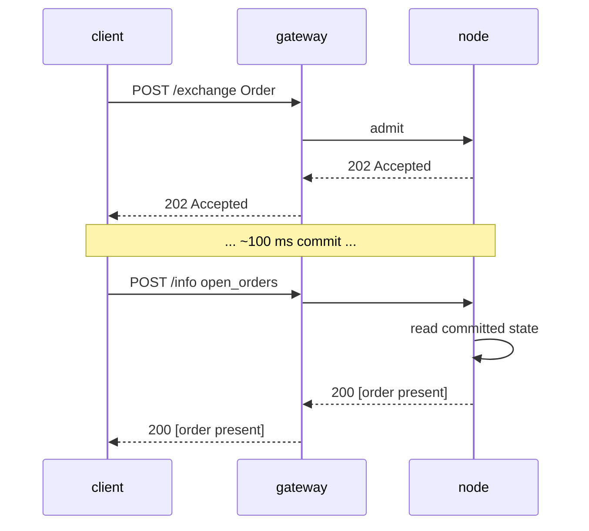

# `POST /info` — 读取路径（MTF-native）

:::info
**状态.** **稳定**形状。查询类型会随时间增加；信封已承诺。
:::

## 快速摘要

单端点、多类型。根据请求体的 `type` 字段进行分派。只读 — 永远不改变状态，永远不需要签名。

## URL

```
POST  https://<net>-gateway.mtf.exchange/info
```

| 路径 | Wire shape |
|------|-----------|
| `POST /info`（网关默认值） | MTF-native（本文档） |
| `POST /hl/info`（网关，在 `/hl` 下） | **HL-compat** — 参见 [hl-compat.md](./hl-compat.md) |

MTF-native 是网关的默认路径；HL-compat 在 `/hl/*` 下命名空间。
运行自己的节点，相同的本地 `/info` 直接在
`http://localhost:8080` 服务。

## 信封

请求：

```json
{ "type": "<query_type>", /* type-specific args */ }
```

响应：

```json
{ "type": "<query_type>", "data": { /* type-specific */ } }
```

在未知 `type` 上：`400 Bad Request` 且 `{"error":"unknown info type: <X>"}`。
在未知资源（例如未知保险库 id）上：`404 Not Found` 且 `{"error":"<resource> not found"}`。

## 查询类型

### `node_info`

静态节点标识 + 协议版本。无参数。

```json
{ "type": "node_info" }
```

响应：

```json
{
  "type": "node_info",
  "data": {
    "network":           "testnet",
    "chain_id":          114514,
    "protocol_version":  "1.0.0",
    "validator_index":   null,
    "build_commit":      "unknown",
    "version":           "0.0.1",
    "freeze_halt_supported": true,
    "uptime_seconds":    0
  }
}
```

| 字段 | 类型 | 描述 |
|-------|------|-------------|
| `network` | `"devnet" \| "testnet" \| "mainnet"` | 网络变体，派生自 `chain_id`（`31337`=devnet，`114514`=testnet，`8964`=mainnet） |
| `chain_id` | uint64 | EIP-712 链 id — `/exchange` 签名域必须使用的相同值 |
| `protocol_version` | semver 字符串 | Wire-protocol 版本 |
| `validator_index` | uint32 \| null | 该节点在活跃验证者集合中的索引；**标记**：`null` 直到运行时调用 `set_validator_index` |
| `build_commit` | 十六进制字符串 | 操作员发布的构建标识符；**标记**：`"unknown"` 直到发布 |
| `version` | semver 字符串 | 节点软件发布版本，在构建时烘烤。发布在其二进制文件中共享一个 `version` — `build_commit` 是每次构建的区分符 |
| `freeze_halt_supported` | bool | 此二进制始终为 `true` — 功能标志：节点尊重 [`exchange_status.scheduled_freeze_height`](#exchange_status)，在冻结高度提交后干净地停止，退出代码 `77`，以便节点监管器可以换入下一个版本 |
| `uptime_seconds` | uint64 | 进程正常运行时间；**标记**：`0` 直到运行时调用 `set_uptime_seconds` |

这些是**每个节点**字段（节点标识/运行时），不是共识状态，所以在节点之间合法地不同。

### `account_state`

每个账户快照。

```json
{ "type": "account_state", "address": "0x<addr>" }
```

| 参数 | 类型 | 必需 |
|-----|------|----------|
| `address` | 十六进制地址 | 是 |

**未知地址**（从未在链上出现过）返回 **200** 且完全为零的
记录（`account_value:"0"`、空 `positions`/`balances.spot`），而不是 `404`。

响应（一个水龙头资助的账户，没有头寸）：

```json
{
  "type": "account_state",
  "data": {
    "address":         "0x00000000000000000000000000000000000ca11e",
    "account_value":   "3000",
    "free_collateral": "3000",
    "maint_margin":    "0",
    "init_margin":     "0",
    "health":          "3000",
    "tier":            "Safe",
    "mode":            "Cross",
    "pm_enabled":      false,
    "positions": [],
    "balances": {
      "usdc": "3000",
      "spot": { "MTF": { "total": "10", "hold": "0" } }
    }
  }
}
```

每个 `balances.spot` 代币是一个 `{total, hold}` 对象（HL 奇偶性）：`hold` 是
锁定在静止现货单后的金额（托管），`total` 是完整
余额；可花费的金额是 `total − hold`。完全持有的代币
仍然出现。对于
**轻量**读取仅边距标量（无 `positions` 遍历，无余额
扫描 — 清算健康轮询的正确调用），使用
[`margin_summary`](#margin_summary)。

一个有头寸的账户在 `positions` 下添加条目：

```json
{
  "asset":             0,
  "size":              "100000000",
  "entry":             "67000.00",
  "upnl":              "5.00",
  "isolated":          false,
  "lev":               10,
  "liq":               "61000.00",
  "roe":               "0.0075",
  "funding":           "-0.12",
  "margin":            "201.00",
  "notional":          "6705.00"
}
```

| 字段 | 类型 | 描述 |
|-------|------|-------------|
| `account_value` | 十进制字符串 | 包括已结算 PnL 的权益，**整 USDC 平面**（`"3000"` = 3000 USDC，不是基本单位） |
| `free_collateral` | 十进制字符串 | 权益减开放头寸持有的初始保证金 |
| `maint_margin` | 十进制字符串 | Σ 每项资产保证金使用（维护） |
| `init_margin` | 十进制字符串 | 持有的初始保证金要求 |
| `health` | 十进制字符串 | `account_value − maint_margin`（带符号；可以为负） |
| `tier` | 枚举 | `"Safe"`、`"T0"`、`"T1"`、`"T2"`、`"T3"`（`account_value / maint_margin` 的 BOLE 波段；无维护保证金时为 `"Safe"`） — 参见 [分层清算](../../concepts/tiered-liquidation.md) |
| `mode` | 枚举 | `"Cross"`、`"Isolated"`、`"StrictIso"`（派生自账户的开放头寸） |
| `pm_enabled` | bool | 投资组合保证金选择状态 |
| `positions[*].asset` | uint32 | 资产 id |
| `positions[*].size` | i128 字符串 | 有符号头寸规模（**原始批次**） — `size / 10^sz_decimals` = 整个单位（`sz_decimals` 是市场的规模精度，例如 BTC 为 5）。这是 SIZE 平面，正交于 1e8 价格平面。 |
| `positions[*].entry` | 十进制字符串 | 每个整数单位的入场价格 = `\|entry_notional\| / \|real size\|`，**整 USDC 平面** |
| `positions[*].upnl` | 十进制字符串 | 按市价计算的 PnL = `real size × mark − signed entry_notional`，**整 USDC 平面**（带符号） |
| `positions[*].isolated` | bool | `true` 除非头寸是全额保证金的 |
| `positions[*].lev` | uint8 | 头寸最大杠杆 |
| `positions[*].liq` | 十进制字符串 | 价格（整 USDC），此头寸单独将账户带到维护的价格 — 单头寸全额近似；当规模/杠杆为零时为 `"0"`（无有限清算价格） |
| `positions[*].roe` | 十进制字符串 | `upnl / initial_margin` 作为十进制分数（`initial_margin = \|entry_notional\| / leverage`）；在零杠杆/名义本金时为 `"0"` |
| `positions[*].funding` | 十进制字符串 | 累计但未结算的腿部资金，**整 USDC**（带符号）；`real_size × (cumulative_funding − funding_entry)` — 资金结算支付的相同形式 |
| `positions[*].margin` | 十进制字符串 | 腿贡献的维护保证金，**整 USDC**：`\|entry_notional\| × maint_margin_ratio` |
| `positions[*].notional` | 十进制字符串 | 头寸名义本金按市价，**整 USDC**（带符号）：`real_size × mark_px` |
| `positions[*].side` | 枚举 \| 不存在 | **[对冲模式](../../concepts/hedge-mode.md) 仅** — `"long"`/`"short"`，此对象报告的腿。**在单向账户中省略**（单个*净*头寸，其 `size` 可能为负）。在一个资产上同时持有两条腿的对冲账户返回**两个**对象，每条腿一个。 |
| `balances.usdc` | 十进制字符串 | **镜像 `account_value`**（全额 USDC 抵押品），不是单独的现货 USDC 余额 |
| `balances.spot` | 对象 | 非 USDC 现货代币余额，由**代币名称**键入（例如 `"MTF"`）；每个值是一个 `{total, hold}` 对象（`hold` = 静止现货单后的托管锁定；可花费 = `total − hold`）；如果没有则为空 |

### `margin_summary`

**仅保证金标量** — `account_state` 减去 `positions[]` 遍历和
现货余额扫描。正确的调用用于频繁的清算健康轮询（风险监视机器人、自动保证金补足），其中不需要头寸/余额详情。必需：`address`（0x 十六进制）。

```json
{ "type": "margin_summary", "address": "0x<addr>" }
```

响应（`data`）：`address`、`account_value`、`free_collateral`、
`maint_margin`、`init_margin`、`health`、`tier`、`mode`、`pm_enabled` —
与 [`account_state`](#account_state) 上同名字段相同的语义（由共享辅助函数计算，所以两者
永远不会不同）。

### `market_info`

每个市场元数据。

```json
{ "type": "market_info", "asset_id": 0 }
```

或按名称：

```json
{ "type": "market_info", "coin": "BTC" }
```

响应：

```json
{
  "type": "market_info",
  "data": {
    "asset_id":        0,
    "name":            "BTC",
    "kind":            "perp",
    "sz_decimals":     5,
    "mark_px":         "67079.265",
    "oracle_px":       "67073.35",
    "mid_px":          "67079.27",
    "premium":         "0.0015",
    "tick_size":       "1000000",
    "step_size":       "1",
    "min_order":       "1",
    "max_leverage":    50,
    "maint_margin_ratio": "300",
    "init_margin_ratio":  "200",
    "funding": {
      "rate_per_hr":  "0",
      "cap_per_hr":   "400",
      "interval_ms":     3600000,
      "next_payment_ts": 0
    },
    "mark_source": "MedianOfOraclesAndMid",
    "fba_enabled": false,
    "open_interest": "0"
  }
}
```

:::info
**价格报告平面。** 在此读取中，`mark_px` 和 `oracle_px` 都在
**整 USDC 十进制平面**（人类美元 — `"67079.265"`/`"67073.35"`），与账户头寸的市价相同单位。`mark_px` 是按书市价从引擎的内部 1e8 固定点表示中缩放下来，在书还没有市价时回退到预言机 px；`oracle_px` 是最后提交的指数
价格。任何一个都可能是 `"0"` 当未设置时。注意**单/书提交平面保持 1e8 固定点** — `l2_book` 层级 px 和单 `limit_px` 不是整 USDC；MTF
保持这两个比例平面不同，只有人类面对面读取（`market_info`、
`markets`、头寸）报告整 USDC 中的价格。记录其余部分的字段语义在下面的 [`markets`](#markets) 表中。
:::

:::info
**价格精度 vs `sz_decimals`。** `mark_px` 和 `oracle_px` 是**按市场的价格滴答打卡**（`tick_size`，向零截断）所以读取永远不会显示子滴答噪声 — 在 `$0.01` 滴答（`tick_size: "1000000"` 在 1e8 平面）
`66735.255` 报告为 `"66735.25"`。注意 `sz_decimals` 是**规模**精度
（单量粒度 — `5` ⇒ `0.00001` 单位），它**不**统管价格十进制数；价格滴答确实如此。两个是独立轴（HL 使用的相同分割）。
:::

### `markets`

每个注册的 MIP-3 永续市场，在一个调用中。无参数。

```json
{ "type": "markets" }
```

`data` 有效负载是一个**数组**，其中相同的丰富每市场记录
[`market_info`](#market_info) 为单个资产返回。记录按
按升序 `asset_id` 确定性地排序（节点迭代
`mip3_market_specs` `BTreeMap`）。空的宇宙返回 `"data": []`。

响应：

```json
{
  "type": "markets",
  "data": [
    {
      "asset_id":        0,
      "name":            "BTC",
      "kind":            "perp",
      "sz_decimals":     5,
      "mark_px":         "67042.335",
      "oracle_px":       "67042.335",
      "mid_px":          "67042.33",
      "premium":         "0.0015",
      "tick_size":       "1000000",
      "step_size":       "1",
      "min_order":       "1",
      "max_leverage":    50,
      "maint_margin_ratio": "300",
      "init_margin_ratio":  "200",
      "funding": {
        "rate_per_hr":  "0",
        "cap_per_hr":   "400",
        "interval_ms":     3600000,
        "next_payment_ts": 0
      },
      "mark_source": "MedianOfOraclesAndMid",
      "fba_enabled": false,
      "open_interest": "0"
    }
  ]
}
```

| 字段 | 类型 | 描述 |
|-------|------|-------------|
| `asset_id` | uint32 | 规范资产 id（排序键） |
| `name` | 字符串 | 市场符号，例如 `"BTC"` |
| `kind` | `"perp"` | 市场类型（小写） |
| `sz_decimals` | uint8 | 大小显示十进制数（来自基础现货代币注册表；如果没有代币规范则为 `0`） |
| `mark_px` | 十进制字符串 | 按书市价，**整 USDC 平面**（按书市价从 1e8 缩放，预言机回退；如果未设置则为 `"0"`） |
| `oracle_px` | 十进制字符串 | 指数价格，**整 USDC 平面**（如果未设置则为 `"0"`） |
| `mid_px` | 十进制字符串 \| null | 真实单书中间 `(best_bid + best_ask) / 2`，**整 USDC 平面**（滴答打卡）；当书单面/空时为 `null` |
| `premium` | 十进制字符串 \| null | 最后提交的资金溢价样本（带符号）；当没有样本时为 `null` |
| `tick_size` | i128 字符串 | 最小价格增量，**1e8 固定点**（单/书提交平面） |
| `step_size` | u128 字符串 | 最小规模增量（批次大小），固定点 |
| `min_order` | u128 字符串 | 最小单规模 |
| `max_leverage` | uint8 | 最大杠杆 |
| `maint_margin_ratio` | bps 字符串 | 维护保证金比率，十进制 bps |
| `init_margin_ratio` | bps 字符串 | 初始保证金比率（`1 / max_leverage`），十进制 bps |
| `funding.rate_per_hr` | bps 字符串 | 最后资金溢价样本，十进制 bps |
| `funding.cap_per_hr` | bps 字符串 | 每小时资金费率上限，十进制 bps |
| `funding.interval_ms` | uint64 | 资金节奏（1h = `3600000`） |
| `funding.next_payment_ts` | uint64 | 下一个资金支付 ts（`0` 直到样本存在） |
| `mark_source` | 字符串 | 市价描述符（`"MedianOfOraclesAndMid"`） |
| `fba_enabled` | bool | 为该市场启用频繁批拍卖 |
| `open_interest` | u128 字符串 | 当前开放利益，固定点 |

每个元素在字节上与相应的单资产 `market_info`
响应的 `data` 相同 — 两者都由相同的每市场记录构建器构建，所以
单一和批量形状永远不会漂移。参见 [`market_info`](#market_info) 中
字段级语义和 FLAGGED-proxy 注意（`mark_source`、
`next_payment_ts`）。

### `vault_state`

每个保险库快照。

```json
{ "type": "vault_state", "vault": "0x<vault_addr>" }
```

响应：

```json
{
  "type": "vault_state",
  "data": {
    "vault":              "0x<addr>",
    "name":               "MFlux Conservative",
    "tvl":             "10000000000",
    "share_price":     "10500000",
    "depositor_count":    142,
    "high_water_mark": "10500000",
    "performance_fee_bps":1000,
    "lock_period_ms":     86400000,
    "strategy":           "MarketNeutral"
  }
}
```

### `staking_state`

```json
{ "type": "staking_state", "address": "0x<addr>" }
```

响应：

```json
{
  "type": "staking_state",
  "data": {
    "address":         "0x<addr>",
    "total_staked": "1000000000",
    "delegations": [
      {
        "validator":         "0x<val_addr>",
        "amount":         "500000000",
        "since_ts":          1735000000000,
        "pending_rewards":"1000000"
      }
    ],
    "pending_unstakes": [
      { "amount": "200000000", "matures_at_ts": 1735780000000 }
    ]
  }
}
```

### `fee_schedule`

```json
{ "type": "fee_schedule" }
```

响应：

```json
{
  "type": "fee_schedule",
  "data": {
    "tiers": [
      { "volume_30d": "0",         "maker_bps": "2.0", "taker_bps": "5.0" },
      { "volume_30d": "100000000", "maker_bps": "1.5", "taker_bps": "4.5" },
      { "volume_30d": "1000000000","maker_bps": "1.0", "taker_bps": "4.0" }
    ],
    "builder_rebate_bps": "0.2",
    "burn_ratio":         "0.30",
    "referrer_share_bps": "1.0"
  }
}
```

费率为十进制**基本点**作为字符串（`"2.0"` = 2 bps = 0.02%）。`burn_ratio` 是十进制分数（`"0.30"` = 30% 的费用被烧毁）。参见 [fees](../../concepts/fees.md)。

### `open_orders`

账户范围内的静止单，跨越每个永续账本。

```json
{ "type": "open_orders", "account_id": 42 }
```

| 参数 | 类型 | 必需 |
|-----|------|----------|
| `account_id` | uint64 | `account_id`/`address` 之一 |
| `address` | 十六进制地址 | `account_id`/`address` 之一 |

`account_id`（u64）或 `address`（0x 十六进制）之一标识账户。当
请求提供 `account_id` 时，它在 `data.account_id` 中回显。

响应：

```json
{
  "type": "open_orders",
  "data": {
    "address":    "0x<addr>",
    "account_id": 42,
    "orders": [
      {
        "oid":          12345,
        "market_id":    0,
        "side":         "bid",
        "px":        "99000",
        "size":      "700",
        "cloid":        "0x000000000000000000000000cafef00d",
        "inserted_at_ms": 1700000000000
      }
    ]
  }
}
```

| 字段 | 类型 | 描述 |
|-------|------|-------------|
| `address` | 十六进制地址 | 已解析账户地址 |
| `account_id` | uint64 | 仅当请求使用 `account_id` 时回显 |
| `orders[*].oid` | uint64 | 服务器单 id |
| `orders[*].market_id` | uint32 | 资产/市场 id 该单静止于 |
| `orders[*].side` | `"bid"`/`"ask"` | 单边 |
| `orders[*].px` | i128 字符串 | 静止价格，固定点十进制字符串 |
| `orders[*].size` | u128 字符串 | 剩余规模，固定点十进制字符串 |
| `orders[*].cloid` | 十六进制字符串 \| null | 客户单 id 该单被放置（`0x` + 32 十六进制字符）；无时为 `null` |
| `orders[*].inserted_at_ms` | uint64 | 放置/插入时间戳（共识 ms） |

### `l2_book`

市场范围内的汇总买卖价位。

```json
{ "type": "l2_book", "market_id": 0 }
```

| 参数 | 类型 | 必需 |
|-----|------|----------|
| `market_id` | uint32 | 是 |

响应：

```json
{
  "type": "l2_book",
  "data": {
    "market_id": 0,
    "bids": [ { "px": "99000", "size": "700", "n_orders": 1 } ],
    "asks": [ { "px": "101000", "size": "750", "n_orders": 2 } ]
  }
}
```

买方为最优先（降序价格），卖方升序。每个层级汇总
求和的 `size` 和静止单 `n_orders` 计数。未知/空
市场返回空 `bids`/`asks` 数组。

| 字段 | 类型 | 描述 |
|-------|------|-------------|
| `market_id` | uint32 | 回显市场 id |
| `bids[*].px`/`asks[*].px` | i128 字符串 | 层级价格，固定点十进制字符串 |
| `bids[*].size`/`asks[*].size` | u128 字符串 | 该层级的求和规模 |
| `bids[*].n_orders`/`asks[*].n_orders` | uint64 | 该层级的静止单 |

### `recent_trades`

市场范围内的公开交易带，直接从承诺的链上状态服务
（一个有界的每市场交易环折叠到 AppHash — 无外部索引器）。

```json
{ "type": "recent_trades", "market_id": 0 }
```

| 参数 | 类型 | 必需 | 描述 |
|-----|------|----------|-------------|
| `market_id` | uint32 | 是 | 资产/市场 id |
| `limit` | uint32 | 否 | 上限返回的**最新**记录数；不存在/`0` ⇒ 完整环 |

响应：

```json
{
  "type": "recent_trades",
  "data": {
    "market_id":      0,
    "last_trade_ms":  1700000000555,
    "trades": [
      {
        "coin":  0,
        "side":  "B",
        "px":    "67042.50",
        "sz":    "0.125",
        "time":  1700000000555,
        "tid":   90123,
        "block": 562,
        "hash":  "0x2315b79b9e82c2deb279a59448bf7841f3767d30d874e5b544d75bb9fd1e9b0c"
      }
    ]
  }
}
```

记录按旧序优先排序（最新最后）。环是有界的，所以这是
最近的窗口，不是所有历史。未知/从未交易的市场返回
`"trades": []` 和 `last_trade_ms: 0`。

| 字段 | 类型 | 描述 |
|-------|------|-------------|
| `market_id` | uint32 | 回显市场 id |
| `last_trade_ms` | uint64 | 最后交易的时间戳（如果无则为 `0`） |
| `trades[*].coin` | uint32 | 交易执行的资产/市场 id |
| `trades[*].side` | `"B"`/`"A"` | 接单者（主动方）边标记 — `"B"` = 买，`"A"` = 卖 |
| `trades[*].px` | 十进制字符串 | 执行价格，**十进制 USDC**（人类可读） |
| `trades[*].sz` | 十进制字符串 | 成交规模，**基本单位**（整个单位） |
| `trades[*].time` | uint64 | 交易时间戳（共识 ms） |
| `trades[*].tid` | uint64 | 确定性交易 id（由打印的两条腿共享） |
| `trades[*].block` | uint64 | 交易结算的已承诺块高度（链上定位器） |
| `trades[*].hash` | 十六进制字符串 | 发源单的交易哈希，`0x` 前缀十六进制 — 让打印在链上追踪 |

### `candle`

`(coin, interval)` 的历史 OHLCV 条形图，覆盖时间窗口。REST
伴随直播 [`candles`](../ws/subscriptions.md#candles) WS 通道 —
WS 在交易着陆时推送形成条形图，此读取返回关闭
历史。

```json
{ "type": "candle", "coin": "BTC", "interval": "1m" }
```

| 参数 | 类型 | 必需 | 描述 |
|-----|------|----------|-------------|
| `coin` | 字符串 | 是 | 市场符号，例如 `"BTC"` |
| `interval` | 字符串 | 是 | 桶代币 — `1m`、`5m`、`15m`、`1h`、`4h`、`1d` 之一 |
| `start_time` | uint64 | 否 | 窗口开始（ms）；在条形开放上过滤。默认 `0` |
| `end_time` | uint64 | 否 | 窗口结束（ms）；在条形开放上过滤。默认无界 |

参数可以平坦传递（上文）或在 `req` 对象下嵌套；`start_time`/
`end_time` 也接受 camelCase `startTime`/`endTime` 拼写。缺少
`coin` 或 `interval` → `400 {"error":"missing field <name>"}`。

响应：

```json
{
  "type": "candle",
  "data": [
    {
      "t": 1700000040000,
      "T": 1700000099999,
      "s": "BTC",
      "i": "1m",
      "o": "67000.00",
      "c": "67042.50",
      "h": "67080.00",
      "l": "66990.00",
      "v": "12.5",
      "q": "837843.75",
      "n": 37
    }
  ]
}
```

条形图按 `t`（开放时间）最旧优先排序；最新元素是
形成条形图。空数组是诚实空答案用于不支持
`interval` 代币、没有索引交易的市场、或没有
索引器连接的部署。

| 字段 | 类型 | 描述 |
|-------|------|-------------|
| `t` | uint64 | 条形**开放**时间戳（ms，桶对齐） |
| `T` | uint64 | 条形**关闭**时间戳（ms） — `t + interval − 1` |
| `s` | 字符串 | 币/市场符号 |
| `i` | 字符串 | 间隔桶代币 |
| `o`/`c`/`h`/`l` | 十进制字符串 | **O**pen/**c**lose/**h**igh/**l**ow 价格，**十进制 USDC**（人类美元，例如 `"67042.50"`） |
| `v` | 十进制字符串 | **基本资产成交量** — Σ 该条形图中的交易规模（币规模，不是名义本金） |
| `q` | 十进制字符串 | **报价（USD）成交量** — `Σ 价格 × 规模` 在条形图的成交 |
| `n` | uint64 | 条形图中的交易（成交）计数 |

:::info
**该系列是无间隙的。** 没有交易的间隔仍然发出平条
携带前一条形图的关闭向前：`o = h = l = c = previous close`，和
`v = q = 0`，`n = 0`。消费者得到连续的每个间隔条形图系列，无
孔隙要插值。**市场的第一个交易前不发出条形图** — 系列
从第一个打印的桶开始，所以空数组意味着市场
从未交易过（或没有历史连接），而不是早期桶被删除。
:::

:::info
**该类型由网关服务，不是节点。** 蜡烛是派生的
显示数据从公开交易流折叠 — 它们**不**承诺
链状态，永远不接触应用哈希，不携带共识保证。网关
从其自己的滚动存储回答 `candle`；一个裸节点查询
直接返回 `unknown info type: candle`。诚实空（`"data": []`）当
网关还没有市场的交易历史时。
:::

### `user_fills`

账户范围内的成交历史，直接从承诺的链上状态服务
（一个有界的每账户成交环折叠到 AppHash — 无外部索引器）。

```json
{ "type": "user_fills", "account_id": 42 }
```

| 参数 | 类型 | 必需 | 描述 |
|-----|------|----------|-------------|
| `account_id` | uint64 | `account_id`/`address` 之一 | 内部账户 id |
| `address` | 十六进制地址 | `account_id`/`address` 之一 | 账户地址 |
| `limit` | uint32 | 否 | 上限返回的**最新**记录数；不存在/`0` ⇒ 完整环 |

`account_id`（u64）或 `address`（0x 十六进制）之一标识账户。当
请求提供 `account_id` 时，它在 `data.account_id` 中回显。

响应：

```json
{
  "type": "user_fills",
  "data": {
    "address":    "0x<addr>",
    "account_id": 42,
    "fills": [
      {
        "coin":           0,
        "side":           "B",
        "px":             "67042.50",
        "sz":             "0.125",
        "time":           1700000000555,
        "oid":            12345,
        "tid":            90123,
        "fee":            "4.19",
        "closed_pnl":     "0",
        "dir":            "Open Long",
        "start_position": "0",
        "block":          562,
        "hash":           "0x2315b79b9e82c2deb279a59448bf7841f3767d30d874e5b544d75bb9fd1e9b0c"
      }
    ]
  }
}
```

记录按旧序优先排序（最新最后）。环是有界的，所以这是
最近的窗口，不是所有历史。无成交的账户返回
`"fills": []`。

| 字段 | 类型 | 描述 |
|-------|------|-------------|
| `address` | 十六进制地址 | 已解析账户地址 |
| `account_id` | uint64 | 仅当请求使用 `account_id` 时回显 |
| `fills[*].coin` | uint32 | 成交执行的资产/市场 id |
| `fills[*].side` | `"B"`/`"A"` | 此腿的边标记 — `"B"` = 买/出价，`"A"` = 卖/要价 |
| `fills[*].px` | 十进制字符串 | 执行价格，**十进制 USDC**（人类可读） |
| `fills[*].sz` | 十进制字符串 | 成交规模，**基本单位**（整个单位） |
| `fills[*].time` | uint64 | 成交时间戳（共识 ms） |
| `fills[*].oid` | uint64 | 这一方的单 id |
| `fills[*].tid` | uint64 | 确定性交易 id（由打印的两条腿共享） |
| `fills[*].fee` | 十进制字符串 | 该方支付的费用，**十进制 USDC** |
| `fills[*].closed_pnl` | 十进制字符串 | 已关闭部分的已实现 PnL，**十进制 USDC**（带符号） |
| `fills[*].dir` | 字符串 | 方向标签，例如 `"Open Long"`、`"Close Short"`、`"Open Short"`、`"Close Long"` |
| `fills[*].start_position` | 十进制字符串 | 成交前的有符号腿规模，**基本单位**（整个单位，带符号） |
| `fills[*].block` | uint64 | 成交结算的已承诺块高度（链上定位器） |
| `fills[*].hash` | 十六进制字符串 | 发源单的交易哈希，`0x` 前缀十六进制 — 让成交在链上追踪 |

### `user_fills_by_time`

喜欢 [`user_fills`](#user_fills)，但过滤到每个
记录的共识 `time` 的时间窗口。相同的成交记录形状。

```json
{ "type": "user_fills_by_time", "address": "0x<addr>", "start_time": 1700000000000, "end_time": 1700003600000 }
```

| 参数 | 类型 | 必需 | 描述 |
|-----|------|----------|-------------|
| `account_id` | uint64 | `account_id`/`address` 之一 | 内部账户 id |
| `address` | 十六进制地址 | `account_id`/`address` 之一 | 账户地址 |
| `start_time` | uint64 | 否 | 窗口开始（ms，包含）；在成交 `time` 上过滤。不存在 ⇒ 开放下界 |
| `end_time` | uint64 | 否 | 窗口结束（ms，包含）。不存在 ⇒ 开放上界 |

响应：

```json
{
  "type": "user_fills_by_time",
  "data": {
    "address":    "0x<addr>",
    "account_id": 42,
    "start_time": 1700000000000,
    "end_time":   1700003600000,
    "fills": [ /* same record shape as user_fills */ ]
  }
}
```

| 字段 | 类型 | 描述 |
|-------|------|-------------|
| `address` | 十六进制地址 | 已解析账户地址 |
| `account_id` | uint64 | 仅当请求使用 `account_id` 时回显 |
| `start_time` | uint64 \| null | 回显窗口开始（如果省略则为 `null`） |
| `end_time` | uint64 \| null | 回显窗口结束（如果省略则为 `null`） |
| `fills` | 数组 | 窗口内成交记录（与 [`user_fills`](#user_fills) 相同的每个成交形状），最旧优先 |

### `order_status`

单个单生命周期查找按 `oid`（服务器单 id）**或** `cloid`（客户端
单 id）。读取直播账本、触发注册表和承诺成交
环 — 全部链上承诺状态。

```json
{ "type": "order_status", "oid": 12345 }
```

或按客户单 id：

```json
{ "type": "order_status", "cloid": "0x000000000000000000000000cafef00d" }
```

| 参数 | 类型 | 必需 | 描述 |
|-----|------|----------|-------------|
| `oid` | uint64 | `oid`/`cloid` 之一 | 服务器单 id |
| `cloid` | 十六进制字符串 | `oid`/`cloid` 之一 | 客户端单 id — `0x` + 32 十六进制字符 |

都不存在 → `400 {"error":"missing field oid or cloid"}`。畸形
`cloid` → `400`。解析在第一次命中停止，顺序：直播静止
单 → 驻留触发 → 终端成交 → 未知。

`data.status` 区分分支：

`"resting"` — 直播单在永续或现货账本中开放：

```json
{
  "type": "order_status",
  "data": {
    "status": "resting",
    "order": {
      "oid":            12345,
      "market_id":      0,
      "side":           "bid",
      "px":             "67000",
      "size":           "700",
      "inserted_at_ms": 1700000000000,
      "cloid":          "0x000000000000000000000000cafef00d"
    }
  }
}
```

`"triggered"` — 驻留 TP/SL/停止入场等待其市价交叉：

```json
{
  "type": "order_status",
  "data": {
    "status": "triggered",
    "trigger": {
      "oid":              12345,
      "market_id":        0,
      "side":             "ask",
      "trigger_px":       "66000",
      "trigger_above":    false,
      "size":             "700",
      "registered_at_ms": 1700000000000,
      "fired":            false
    }
  }
}
```

`"filled"` — 每账户环中最近的匹配成交（`fill`
对象与 [`user_fills`](#user_fills) 记录形状相同）：

```json
{
  "type": "order_status",
  "data": {
    "status": "filled",
    "fill": { /* same shape as a user_fills fill record */ }
  }
}
```

`"unknown"` — 从未见过，或从有界环中驱逐（`cloid` 仅查询
匹配无静止/触发单也在这里解析，因为触发
注册表和成交环由 `oid` 键入）：

```json
{ "type": "order_status", "data": { "status": "unknown" } }
```

| 字段 | 类型 | 描述 |
|-------|------|-------------|
| `status` | `"resting" \| "triggered" \| "filled" \| "unknown"` | 已解析生命周期状态 |
| `order` | 对象 | 在 `"resting"` 上存在 — `oid`、`market_id`、`side`（`"bid"`/`"ask"`）、`px`/`size`（固定点十进制字符串）、`inserted_at_ms`、`cloid`（十六进制 \| null） |
| `trigger` | 对象 | 在 `"triggered"` 上存在 — `oid`、`market_id`、`side`、`trigger_px`/`size`（固定点十进制字符串）、`trigger_above`（bool：当市价从上方交叉时触发）、`registered_at_ms`、`fired`（bool） |
| `fill` | 对象 | 在 `"filled"` 上存在 — 匹配的成交记录（参见 [`user_fills`](#user_fills)） |

### `funding_history`

市场范围内的资金溢价样本。

```json
{ "type": "funding_history", "market_id": 0 }
```

| 参数 | 类型 | 必需 |
|-----|------|----------|
| `market_id` | uint32 | 是 |

响应：

```json
{
  "type": "funding_history",
  "data": {
    "market_id": 0,
    "samples": [
      { "ts_ms": 1700000000000, "premium": "0.0015", "funding_rate": "0.0015" },
      { "ts_ms": 1700000008000, "premium": "-0.0007", "funding_rate": "-0.0007" }
    ]
  }
}
```

样本是资金跟踪器的有序溢价快照环。
`premium` 是确切的预钳制 `Decimal` 呈现为字符串（带符号，完整
精度）；`funding_rate` 是该溢价通过每资产资金
上限（`±funding_rate_cap`，动态风险覆盖否则 `0.04`/小时基线）
— 即实现的费率那会实际被收取。当溢价
在上限内时，`funding_rate == premium`；高于上限，`funding_rate` 被限制为
有符号上限。未知/空市场返回 `"samples": []`。

| 字段 | 类型 | 描述 |
|-------|------|-------------|
| `market_id` | uint32 | 回显市场 id |
| `samples[*].ts_ms` | uint64 | 样本时间戳（共识 ms） |
| `samples[*].premium` | 十进制字符串 | 原始资金溢价样本，预钳制（带符号） |
| `samples[*].funding_rate` | 十进制字符串 | 实现费率 = `premium` 限制在每资产上限（带符号） |

### `predicted_fundings`

每市场预测资金费率 + 下一个支付时间，跨越每个注册的
永续市场。无参数。

```json
{ "type": "predicted_fundings" }
```

`data` 有效负载是一个**数组**，按升序 `asset` 确定性地排序
（节点迭代市场规范 `BTreeMap`）。空的宇宙返回
`"data": []`。

响应：

```json
{
  "type": "predicted_fundings",
  "data": [
    { "asset": 0, "predicted_rate": "0.0015", "next_funding_time": 1700003600000 }
  ]
}
```

`predicted_rate` 是最后溢价样本（每小时费率代理，十进制
字符串） — `"0"` 在第一个样本前。`next_funding_time` 是派生的下一个
支付时间戳（`last_sample_ts + 1h`），`0` 在第一个样本前。

| 字段 | 类型 | 描述 |
|-------|------|-------------|
| `asset` | uint32 | 资产/市场 id |
| `predicted_rate` | 十进制字符串 | 最后溢价样本（每小时费率代理）；`"0"` 样本前 |
| `next_funding_time` | uint64 | 下一个资金支付时间戳（共识 ms）；`0` 样本前 |

### `block_info`

承诺块元数据。无必需参数（`height` 被接受但忽略 —
读取状态仅保持最新承诺上下文）。

```json
{ "type": "block_info" }
```

响应：

```json
{
  "type": "block_info",
  "data": {
    "height":       562,
    "round":        562,
    "epoch":        0,
    "timestamp_ms": 1780475491562,
    "block_hash":   "0x2315b79b9e82c2deb279a59448bf7841f3767d30d874e5b544d75bb9fd1e9b0c"
  }
}
```

| 字段 | 类型 | 描述 |
|-------|------|-------------|
| `height` | uint64 | 最新承诺块高度 |
| `round` | uint64 | 该块的共识轮 |
| `epoch` | uint64 | 当前时代 |
| `timestamp_ms` | uint64 | 块时间戳（共识 ms） |
| `block_hash` | 十六进制字符串（32 字节） | 真实承诺块哈希（现在连接到读取状态 — 不再是全零占位符） |

### `agents`

帐户的已批准代理/API 钱包。

```json
{ "type": "agents", "account_id": 42 }
```

| 参数 | 类型 | 必需 |
|-----|------|----------|
| `account_id` | uint64 | `account_id`/`address` 之一 |
| `address` | 十六进制地址 | `account_id`/`address` 之一 |

响应：

```json
{
  "type": "agents",
  "data": {
    "address":    "0x<master>",
    "account_id": 42,
    "agents": [
      { "agent": "0x<agent_addr>", "name": "trading-bot", "expires_at_ms": 1700000500000 }
    ]
  }
}
```

| 字段 | 类型 | 描述 |
|-------|------|-------------|
| `address` | 十六进制地址 | 已解析主地址 |
| `account_id` | uint64 | 仅当请求使用 `account_id` 时回显 |
| `agents[*].agent` | 十六进制地址 | 已批准代理钱包地址 |
| `agents[*].name` | 字符串 \| null | 批准时设置的代理标签；如果未设置则为 `null` |
| `agents[*].expires_at_ms` | uint64 \| null | 代理批准过期（共识 ms）；`null` 用于永不过期的批准 |

### `sub_accounts`

帐户的子帐户。

```json
{ "type": "sub_accounts", "account_id": 42 }
```

| 参数 | 类型 | 必需 |
|-----|------|----------|
| `account_id` | uint64 | `account_id`/`address` 之一 |
| `address` | 十六进制地址 | `account_id`/`address` 之一 |

响应：

```json
{
  "type": "sub_accounts",
  "data": {
    "address":    "0x<parent>",
    "account_id": 42,
    "sub_accounts": [
      { "index": 0, "address": "0x<sub_addr>" }
    ]
  }
}
```

| 字段 | 类型 | 描述 |
|-------|------|-------------|
| `address` | 十六进制地址 | 已解析父地址 |
| `account_id` | uint64 | 仅当请求使用 `account_id` 时回显 |
| `sub_accounts[*].index` | uint32 | 父系下的子帐户索引 |
| `sub_accounts[*].address` | 十六进制地址 | 子帐户地址 |

### `mip3_active_bids`

MIP-3 无许可永续部署气拍卖快照。无参数。

```json
{ "type": "mip3_active_bids" }
```

响应：

```json
{
  "type": "mip3_active_bids",
  "data": {
    "auction_round":   2,
    "current_bid":     "12345",
    "current_winner":  "0x<bidder>",
    "auction_end_ms":  1700086400000,
    "started_at_ms":   1700000000000,
    "bids": [
      {
        "bidder":          "0x<bidder>",
        "amount":          "12345",
        "submitted_at_ms": 1700000000500,
        "tag":             "ETH-PERP"
      }
    ]
  }
}
```

| 字段 | 类型 | 描述 |
|-------|------|-------------|
| `auction_round` | uint64 | 当前拍卖轮 |
| `current_bid` | 十进制字符串 | 领先出价金额 |
| `current_winner` | 十六进制地址 \| null | 当前获胜出价者，`null` 如果无 |
| `auction_end_ms` | uint64 | 拍卖关闭时间戳（共识 ms） |
| `started_at_ms` | uint64 | 拍卖开始时间戳（共识 ms） |
| `bids[*].bidder` | 十六进制地址 | 出价者地址 |
| `bids[*].amount` | 十进制字符串 | 出价金额 |
| `bids[*].submitted_at_ms` | uint64 | 出价提交时间戳（共识 ms） |
| `bids[*].tag` | 字符串 | 出价标签（例如建议的市场名称） |

### `protocol_metrics`

协议范围内的已承诺累加器/计数器。无参数。每个字段都是
直接从承诺的 `Exchange` 状态读取（计数器、费用池、BOLE 储备、
质押） — 没有从匹配引擎或预言机计算，所以回放
完全重现它。

```json
{ "type": "protocol_metrics" }
```

响应：

```json
{
  "type": "protocol_metrics",
  "data": {
    "counters": {
      "total_orders":               1000,
      "total_fills":                750,
      "total_liquidations":         3,
      "total_deposits":             40,
      "total_withdrawals":          12,
      "total_vault_transfers":      0,
      "total_sub_account_transfers":0
    },
    "fee_pools": {
      "burned":         "8000",
      "mflux_vault":    "0",
      "validator_pool": "1000",
      "treasury":       "1000",
      "burned_mtf":     "55"
    },
    "insurance_fund_total":    "750",
    "treasury_backstop_total": "9000",
    "bole_pool": {
      "total_deposits":  "20000",
      "shortfall_total": "7"
    },
    "open_interest_total_1e8": "1500000",
    "staking": {
      "total_stake":   "100",
      "n_validators":  1,
      "n_active":      1,
      "n_jailed":      0,
      "current_epoch": 4
    },
    "counts": {
      "n_markets":             1,
      "n_spot_pairs":          5,
      "n_user_vaults":         0,
      "n_accounts_with_state": 12
    }
  }
}
```

| 字段 | 类型 | 描述 |
|-------|------|-------------|
| `counters.total_orders` | uint64 | 生命周期单接纳 |
| `counters.total_fills` | uint64 | 生命周期成交（唯一的逐项交易信号 — **计数**，不是名义本金） |
| `counters.total_liquidations` | uint64 | 生命周期清算 |
| `counters.total_deposits`/`total_withdrawals` | uint64 | 生命周期存款/取款计数 |
| `counters.total_vault_transfers` | uint64 | 生命周期金库存款/取款转账 |
| `counters.total_sub_account_transfers` | uint64 | 生命周期子帐户转账 |
| `fee_pools.burned` | 十进制字符串 | 累计 USDC 路由到回购及销毁（整 USDC） |
| `fee_pools.mflux_vault` | 十进制字符串 | 累计 MFlux-金库费用应计（`"0"` — 金库股份归零） |
| `fee_pools.validator_pool` | 十进制字符串 | 累计验证者池费用应计（整 USDC） |
| `fee_pools.treasury` | 十进制字符串 | 累计财政费用应计（整 USDC） |
| `fee_pools.burned_mtf` | 十进制字符串 | 回购执行器退役的累计 MTF |
| `insurance_fund_total` | 十进制字符串 | Σ 每资产 `bole_pool.insurance_fund` 储备（整 USDC） |
| `treasury_backstop_total` | 十进制字符串 | Σ 每资产 `bole_pool.treasury_backstop` 储备（整 USDC） |
| `bole_pool.total_deposits` | 十进制字符串 | BOLE 贷款池总存款（整 USDC） |
| `bole_pool.shortfall_total` | 十进制字符串 | Σ 在 ADL → 保险 → 财政瀑布之后驻留的残余坏账 |
| `open_interest_total_1e8` | u128 字符串 | Σ 每市场开放利益，**1e8 账本平面**（标记为 `_1e8`，不是整 USDC） |
| `staking.total_stake` | 十进制字符串 | 总质押 MTF（整 MTF） |
| `staking.n_validators` | uint64 | 承诺集中的验证者 |
| `staking.n_active` | uint64 | 此时代活跃的验证者 |
| `staking.n_jailed` | uint64 | 当前禁用的验证者 |
| `staking.current_epoch` | uint64 | 当前质押时代 |
| `counts.n_markets` | uint64 | 注册的 MIP-3 永续市场（`mip3_market_specs`） |
| `counts.n_spot_pairs` | uint64 | 注册的现货对（`mip3_spot_pair_specs`） |
| `counts.n_user_vaults` | uint64 | 注册的用户金库 |
| `counts.n_accounts_with_state` | uint64 | 具有承诺用户状态的帐户 |

:::info
**无累计交易名义本金数字。** 引擎跟踪每用户**30 日费用
成交量**（参见 [`user_fees`](#user_fees)）和生命周期成交**计数**
（`counters.total_fills`） — 有**无承诺的运行协议范围内交易 USD
累加器**，所以此读取故意省略一个，而不是暗示成交量
总和存在。计数器是单调活动统计数字，不是金钱。
:::

状态来源：`locus.{counters, fee_tracker.fee_distribution, bole_pool}` + `c_staking` + 注册表大小。

### `user_fees`

每帐户费用/成交量层级。必需：`account_id`（u64）**或** `address`（0x 十六进制）。

```json
{ "type": "user_fees", "account_id": 42 }
```

| 参数 | 类型 | 必需 |
|-----|------|----------|
| `account_id` | uint64 | `account_id`/`address` 之一 |
| `address` | 十六进制地址 | `account_id`/`address` 之一 |

都不存在 → `400`。无费用状态的帐户返回 **200** 且
零成交量和基础层 bps — 建立的零化习语。

响应：

```json
{
  "type": "user_fees",
  "data": {
    "address":          "0x<addr>",
    "account_id":       42,
    "taker_volume_30d": "1250000",
    "maker_volume_30d": "800000",
    "vip_tier":         2,
    "mm_tier":          1,
    "referrer":         "0x<referrer>",
    "referrer_credit":  "420",
    "maker_bps":        1,
    "taker_bps":        3
  }
}
```

| 字段 | 类型 | 描述 |
|-------|------|-------------|
| `address` | 十六进制地址 | 已解析帐户地址 |
| `account_id` | uint64 | 仅当请求使用 `account_id` 时回显 |
| `taker_volume_30d` | 十进制字符串 | 滚动 30 日接单成交量（整 USDC） |
| `maker_volume_30d` | 十进制字符串 | 滚动 30 日做市成交量（整 USDC） |
| `vip_tier` | uint | 承诺每用户 VIP 层索引；无跟踪时为 `0` |
| `mm_tier` | uint | 承诺每用户做市商层索引；无跟踪时为 `0` |
| `referrer` | 十六进制地址 \| null | 此帐户的引荐人（如果设置），否则 `null` |
| `referrer_credit` | 十进制字符串 | Σ 作为引荐人返利累计至此地址（整 USDC） |
| `maker_bps` | uint | **有效**做市费 bps，从承诺的 [`fee_schedule`](#fee_schedule) 成交量层阶梯在此帐户的 30 日做市成交量处解析 |
| `taker_bps` | uint | **有效**接单费 bps，从承诺阶梯在此帐户的 30 日接单成交量处解析 |

有效的 `maker_bps`/`taker_bps` 每一侧从承诺的
成交量层阶梯解析（[`fee_schedule`](#fee_schedule)） — 做市费率在帐户的做市成交量，接单费率在其接单成交量 — 使用结算路径收费相同的例程，所以报告的 bps 与
帐户计费相匹配。MIP-3 每市场规范覆盖**不**反映在这里：
这是跨市场基础费率。`vip_tier`/`mm_tier` 仍然是承诺的
每用户层索引，是一个单独的信号，与有效的
bps 一起呈现。

状态来源：`locus.fee_tracker.{user_to_taker_volume_30d, user_to_maker_volume_30d, user_to_vip_tier, user_to_mm_tier, referee_to_referrer, referrer_credit}` + 承诺的成交量层阶梯。

### `staking_apr`

有效年化质押发行费率 + 其承诺投入。无参数。

```json
{ "type": "staking_apr" }
```

响应：

```json
{
  "type": "staking_apr",
  "data": {
    "total_stake":             "1000000",
    "effective_apr":           "0.08",
    "effective_apr_bps":       "800",
    "governance_rate_bps":     800,
    "emission_floor_stake":    "50000000",
    "n_active_validators":     1,
    "current_epoch":           2,
    "is_gross_pre_commission": true
  }
}
```

| 字段 | 类型 | 描述 |
|-------|------|-------------|
| `total_stake` | 十进制字符串 | 总质押 MTF（整 MTF） |
| `effective_apr` | 十进制字符串 | 开始块奖励效果实际应用的年度发行费率（分数） |
| `effective_apr_bps` | 十进制字符串 | `effective_apr × 10_000`，截断 |
| `governance_rate_bps` | uint | 治理设定的 `reward_rate_bps`（承诺） — 参见标志 |
| `emission_floor_stake` | uint 字符串 | 下限质押（`50M` MTF），低于该费率是平坦 |
| `n_active_validators` | uint64 | 此时代活跃的验证者 |
| `current_epoch` | uint64 | 当前质押时代 |
| `is_gross_pre_commission` | bool | 总是 `true` — APR 是总额，每验证者佣金前 |

`effective_apr` 是开始块奖励效果派生的曲线：

```text
effective_apr = 0.08 × √( 50M / max(total_stake, 50M) )
```

即，**平坦 8%** 在/低于 50M MTF 质押，以上衰减 ∝ 1/√质押（例如
总质押 = 200M ⇒ 4× 下限 ⇒ 比率 1/4 ⇒ √ = 1/2 ⇒ 4%/400 bps）。

:::warning
**`governance_rate_bps` 是承诺但非被奖励效果消费。** 奖励
效果从**质押曲线**派生支付费率（上文），不是从
`reward_rate_bps`。两者都曝光，以便差异可观察而不是
隐藏 — 有效支付 APR 是 `effective_apr`，不是 `governance_rate_bps`。
并且 `effective_apr` 是一个**总发行**费率（`is_gross_pre_commission: true`）：
个人代理的净 APR 是 `effective_apr × (1 − commission)`。
:::

状态来源：`c_staking.{total_stake, reward_rate_bps, current_epoch, validators}` + 发行曲线。

### `oracle_sources`

承诺的每市场预言机源子集。按 `asset_id`
（u32）**或** `coin`（符号）解析市场。

```json
{ "type": "oracle_sources", "asset_id": 0 }
```

或按名称：

```json
{ "type": "oracle_sources", "coin": "BTC" }
```

| 参数 | 类型 | 必需 |
|-----|------|----------|
| `asset_id` | uint32 | `asset_id`/`coin` 之一 |
| `coin` | 符号 | `asset_id`/`coin` 之一 |

都缺少 → `400`；未知市场 → `404 {"error":"market not found"}`。

响应：

```json
{
  "type": "oracle_sources",
  "data": {
    "asset_id":          0,
    "name":              "BTC",
    "oracle_set":        true,
    "source_count":      3,
    "num_sources":       10,
    "enabled_sources":   [0, 2, 5],
    "subset_mask":       37,
    "weights_committed": false
  }
}
```

| 字段 | 类型 | 描述 |
|-------|------|-------------|
| `asset_id` | uint32 | 回显/已解析资产 id |
| `name` | 字符串 | 市场符号 |
| `oracle_set` | bool | 部署者是否通过 `SetOracle` 明确确认子集 |
| `source_count` | uint64 | 已启用源的数量（遮罩的 popcount） |
| `num_sources` | uint8 | 总源槽（`NUM_ORACLE_SOURCES = 10`） |
| `enabled_sources` | uint8[] | 子集遮罩的设置位索引（已启用源槽） |
| `subset_mask` | uint16 | 承诺的 10 位 `oracle_source_subset_mask`（位 `i` 设置 ⇒ 源 `i` 馈送中位数） |
| `weights_committed` | bool | 总是 `false` — 每源权重不是承诺的（参见标志） |

:::warning
**仅数值位遮罩在链上 — 地点名称和权重不是
承诺的**（`weights_committed: false`）。10 个源标识是
协议固定链外，其权重是
协议固定，所以承诺状态仅携带子集位遮罩。此读取
曝光 `enabled_sources` 作为**位索引**，不是命名地点，并发出无
每地点权重列表，而不是伪造一个。
:::

状态来源：`mip3_market_specs[asset].{oracle_source_subset_mask, oracle_set}`。

## 治理查询类型

链上治理表面：直播投票机制（`gov_state`）、
跨类别待提议视图带法定人数距离（`gov_proposals`），和
制定参数审计线索（`gov_history`）。全部读取承诺
`Exchange` 状态；相同 `{type, data}` 信封。质押法定人数是 ⅔
（质押加权）；**被禁用的**验证者从活跃质押
分母和每个统计中排除，匹配链上制定检查。

### `gov_state`

直播治理表面 — 质押法定人数上下文，待命 `voteGlobal` 轮，
开放的 `govPropose` 提案，和每个治理参数的当前值。
无参数。

```json
{ "type": "gov_state" }
```

响应：

```json
{
  "type": "gov_state",
  "data": {
    "total_stake":  "150000",
    "quorum_bps":   6667,
    "quorum_stake": "100005",
    "pending_vote_global": [
      {
        "kind":          "set_reward_rate_bps",
        "kind_id":       3,
        "votes": [
          { "validator": "0x<val>", "value": "900", "stake": "60000", "submitted_at_ms": 1700000000000 }
        ],
        "leading_stake": "60000"
      }
    ],
    "open_proposals": [
      { "proposal_id": 5, "voters": 2, "aye_stake": "90000", "nay_stake": "30000" }
    ],
    "params": {
      "reward_rate_bps":   800,
      "default_taker_bps": 5,
      "default_maker_bps": 2,
      "burn_bps":          8000
    },
    "oracle_weight_overrides": [
      { "asset_id": 0, "weights": [1000, 1000, 1000] }
    ]
  }
}
```

| 字段 | 类型 | 描述 |
|-------|------|-------------|
| `total_stake` | 十进制字符串 | Σ 跨验证者质押 |
| `quorum_bps` | uint | ⅔ 法定人数阈值在 bps（`6667`） |
| `quorum_stake` | 十进制字符串 | 制定所需的质押（`total_stake × quorum_bps / 10000`） |
| `pending_vote_global[*].kind` | 字符串 | 治理参数名（snake_case），例如 `"set_reward_rate_bps"` |
| `pending_vote_global[*].kind_id` | uint | 数值种类 id |
| `pending_vote_global[*].votes[*].validator` | 十六进制地址 | 投票验证者 |
| `pending_vote_global[*].votes[*].value` | 十进制字符串 | 解码提议值（十六进制 `0x…` 如果有效负载不透明） |
| `pending_vote_global[*].votes[*].stake` | 十进制字符串 | 投票者的质押 |
| `pending_vote_global[*].votes[*].submitted_at_ms` | uint64 | 投票提交时间戳（共识 ms） |
| `pending_vote_global[*].leading_stake` | 十进制字符串 | 此轮中单一有效负载后面的最大质押 |
| `open_proposals[*].proposal_id` | uint64 | govPropose 轮 id |
| `open_proposals[*].voters` | uint64 | 投票数量 |
| `open_proposals[*].aye_stake`/`nay_stake` | 十进制字符串 | 质押投票赞同/反对 |
| `params` | 对象 | 每个治理参数的当前值（每个承诺标量） |
| `oracle_weight_overrides[*].asset_id` | uint32 | 具有每资产预言机权重覆盖的资产 |
| `oracle_weight_overrides[*].weights` | uint[] | 资产的承诺每源权重 |

`params` 对象携带完整的治理参数集投票机制
可以移动（费用分配分割、质押旋钮、MIP-3 限制、风险上限、现货/
EVM/桥接标志、…）；每个是直播承诺值。

### `gov_proposals`

每个活动治理提案跨越所有投票类别（不仅仅是
`voteGlobal`），每个具有其直播每有效负载质押统计和到 ⅔
法定人数的距离。跨类别"现在正在投票什么，有多接近"视图。无参数。

```json
{ "type": "gov_proposals" }
```

响应：

```json
{
  "type": "gov_proposals",
  "data": {
    "total_active_stake":  "120000",
    "quorum_bps":          6667,
    "quorum_needed_stake": "80004",
    "proposals": [
      {
        "round":         1000003,
        "category":      "vote_global",
        "sub_id":        3,
        "proposer":      "0x<val>",
        "created_at_ms": 1700000000000,
        "voter_count":   1,
        "leading_stake": "60000",
        "meets_quorum":  false,
        "payloads": [
          { "payload_hex": "0392…", "stake": "60000", "meets_quorum": false }
        ],
        "proposal": {
          "kind":         3,
          "kind_name":    "set_reward_rate_bps",
          "value":        "900",
          "title":        "Raise staking rewards",
          "proposer":     "0x<val>",
          "opened_at_ms": 1700000000000
        }
      }
    ]
  }
}
```

| 字段 | 类型 | 描述 |
|-------|------|-------------|
| `total_active_stake` | 十进制字符串 | Σ 非禁用验证者的质押（法定人数分母） |
| `quorum_bps` | uint | ⅔ 法定人数阈值在 bps（`6667`） |
| `quorum_needed_stake` | 十进制字符串 | 单一有效负载必须达到制定的质押 |
| `proposals[*].round` | uint64 | 合成投票轮 id |
| `proposals[*].category` | 字符串 | 投票类别，例如 `"gov_propose"`、`"vote_global"`、`"dynamic_risk"`、`"treasury"`、`"metaliquidity"`、`"oracle_weights"`、`"funding_formula"`、`"spot_margin"` |
| `proposals[*].sub_id` | uint64 | 类别相对 id（轮减去类别的范围基数） |
| `proposals[*].proposer` | 十六进制地址 \| null | 最早投票者（提议代理） |
| `proposals[*].created_at_ms` | uint64 | 最早投票时间戳（共识 ms） |
| `proposals[*].voter_count` | uint64 | 轮上的投票数量 |
| `proposals[*].leading_stake` | 十进制字符串 | 后面一个有效负载的最大质押 |
| `proposals[*].meets_quorum` | bool | 是否领先有效负载的质押达到 ⅔ 法定人数 |
| `proposals[*].payloads[*].payload_hex` | 十六进制字符串 | 不同的投票有效负载（无 `0x` 前缀） |
| `proposals[*].payloads[*].stake` | 十进制字符串 | 活跃质押后面该有效负载 |
| `proposals[*].payloads[*].meets_quorum` | bool | 此有效负载单独是否达到法定人数 |
| `proposals[*].proposal` | 对象 \| null | 轮打开 `govPropose` 时输入的记录，否则 `null` |
| `proposals[*].proposal.kind` | uint | 治理参数种类 id |
| `proposals[*].proposal.kind_name` | 字符串 \| null | 解码种类名（snake_case），如果未知则为 `null` |
| `proposals[*].proposal.value` | 十进制字符串 | 建议值 |
| `proposals[*].proposal.title` | 字符串 | 人类可读提案标题 |
| `proposals[*].proposal.proposer` | 十六进制地址 | 打开提案的帐户 |
| `proposals[*].proposal.opened_at_ms` | uint64 | 提案打开时间戳（共识 ms） |

### `gov_history`

制定治理审计线索（有界环，最旧优先） — 每个入场
证明参数通过链上治理而不是其起源值而移动。无
参数。补充 `gov_proposals`（待命方）。

```json
{ "type": "gov_history" }
```

响应：

```json
{
  "type": "gov_history",
  "data": {
    "count": 1,
    "enacted": [
      {
        "round":         1000003,
        "kind":          3,
        "kind_name":     "set_reward_rate_bps",
        "value":         "900",
        "via":           "vote_global",
        "enacted_at_ms": 1700000900000,
        "description":   "reward_rate_bps -> 900"
      }
    ]
  }
}
```

| 字段 | 类型 | 描述 |
|-------|------|-------------|
| `count` | uint | 环中的条目数 |
| `enacted[*].round` | uint64 | 制定的合成投票轮 |
| `enacted[*].kind` | uint | 治理参数种类 id |
| `enacted[*].kind_name` | 字符串 \| null | 解码种类名（snake_case），如果未知则为 `null` |
| `enacted[*].value` | 十进制字符串 | 制定值 |
| `enacted[*].via` | `"proposal" \| "vote_global" \| "other"` | 源轨道 — `govPropose`/`govVote` vs 直接 `voteGlobal` |
| `enacted[*].enacted_at_ms` | uint64 | 制定时间戳（共识 ms） |
| `enacted[*].description` | 字符串 | 人类可读的变更总结 |

环在链上制定日志界限，所以这是最近的窗口，不是
所有历史。

## 区分器查询类型（RFQ/FBA/投资组合保证金）

这些读取直播状态后面的 MTF 区分器引擎 — 它们补充
`market_info.fba_enabled`/`account_state.pm_enabled` 标志与引擎
状态本身。相同 `{type, data}` 信封和 MTF-native 约定。**价格
平面：** RFQ + FBA 价格/规模是原始**1e8 固定点**整数字符串（
账本/单平面，与 [`open_orders`](#open_orders)/[`l2_book`](#l2_book) 相同），
**不是**整 USDC；投资组合保证金幅度是**USD 美分**整数字符串。

### `rfq_open`

每个开放 RFQ 请求加上其做市商报价。无参数。参见 [RFQ 概念](../../concepts/rfq.md)。

```json
{ "type": "rfq_open" }
```

响应：

```json
{
  "type": "rfq_open",
  "data": {
    "rfqs": [
      {
        "rfq_id":              1,
        "market_id":           7,
        "side":                "bid",
        "size":                "1000",
        "requester":           "0x<addr>",
        "requester_stp_group": 42,
        "expiry_ms":           5000,
        "limit_px":            "105",
        "created_at_ms":       10,
        "quotes": [
          {
            "maker":           "0x<addr>",
            "maker_stp_group": null,
            "price":           "104",
            "max_size":        "800",
            "valid_until_ms":  4000,
            "submitted_at_ms": 20
          }
        ]
      }
    ]
  }
}
```

`rfqs` 按 `rfq_id` 确定性迭代。空引擎返回 `"rfqs": []`。

| 字段 | 类型 | 描述 |
|-------|------|-------------|
| `rfqs[*].rfq_id` | uint64 | RFQ 请求 id |
| `rfqs[*].market_id` | uint32 | RFQ 用于的资产/市场 id |
| `rfqs[*].side` | `"bid"`/`"ask"` | 请求者想要获取的边 |
| `rfqs[*].size` | u128 字符串 | 请求的规模，1e8 固定点 |
| `rfqs[*].requester` | 十六进制地址 | 请求帐户 |
| `rfqs[*].requester_stp_group` | uint \| null | 请求者自交易预防组；无时为 `null` |
| `rfqs[*].expiry_ms` | uint64 | RFQ 过期时间戳（共识 ms） |
| `rfqs[*].limit_px` | i128 字符串 \| null | 请求者限价，1e8 固定点；无时为 `null` |
| `rfqs[*].created_at_ms` | uint64 | 创建时间戳（共识 ms） |
| `rfqs[*].quotes[*].maker` | 十六进制地址 | 报价做市商 |
| `rfqs[*].quotes[*].maker_stp_group` | uint \| null | 做市商 STP 组；无时为 `null` |
| `rfqs[*].quotes[*].price` | i128 字符串 | 报价价格，1e8 固定点 |
| `rfqs[*].quotes[*].max_size` | u128 字符串 | 做市商将成交的最大规模，1e8 固定点 |
| `rfqs[*].quotes[*].valid_until_ms` | uint64 | 报价有效性截止时间（共识 ms） |
| `rfqs[*].quotes[*].submitted_at_ms` | uint64 | 报价提交时间戳（共识 ms） |

### `rfq_user`

帐户是方 — 分为打开的和报价的 RFQs。参见 [RFQ 概念](../../concepts/rfq.md)。

```json
{ "type": "rfq_user", "account_id": 42 }
```

| 参数 | 类型 | 必需 |
|-----|------|----------|
| `account_id` | uint64 | `account_id`/`address` 之一 |
| `address` | 十六进制地址 | `account_id`/`address` 之一 |

`account_id`（u64）或 `address`（0x 十六进制）之一标识帐户；当
请求提供 `account_id` 时在 `data.account_id` 中回显。都不存在 → `400`；畸形
`address` → `400 {"error":"invalid hex"}`。

响应：

```json
{
  "type": "rfq_user",
  "data": {
    "address":    "0x<addr>",
    "account_id": 42,
    "requested": [ /* <rfq>, same per-RFQ shape as rfq_open */ ],
    "quoted":    [ /* <rfq> */ ]
  }
}
```

| 字段 | 类型 | 描述 |
|-------|------|-------------|
| `address` | 十六进制地址 | 已解析帐户地址 |
| `account_id` | uint64 | 仅当请求使用 `account_id` 时回显 |
| `requested` | array&lt;rfq&gt; | 此帐户打开的 RFQs（请求者）；与 [`rfq_open`](#rfq_open) 相同的每个 RFQ 形状 |
| `quoted` | array&lt;rfq&gt; | 此帐户报价的 RFQs（显示为 `maker`）；相同的每个 RFQ 形状 |

每个列表按 `rfq_id` 确定性迭代。与任何事物无关的帐户
返回 **200** 且两个列表为空（建立的零化习语）。

### `fba_batch_state`

直播 FBA 池加上一个市场的指示性清算。参见 [FBA 概念](../../concepts/fba.md)。

```json
{ "type": "fba_batch_state", "market_id": 3 }
```

| 参数 | 类型 | 必需 |
|-----|------|----------|
| `market_id` | uint32 | 是 |

缺少 `market_id` → `400`。未注册市场没有 **404**：FBA
是每市场选择加入，所以没有池的市场返回 **200** 且零
字段（`enabled:false`、`period_ms:0`、空 `orders`、`indicative:null`）。

响应：

```json
{
  "type": "fba_batch_state",
  "data": {
    "market_id":      3,
    "enabled":        true,
    "period_ms":      200,
    "min_lot":        "1",
    "last_settle_ms": 500,
    "next_settle_ms": 700,
    "order_count":    2,
    "bid_count":      1,
    "ask_count":      1,
    "bid_size":       "10",
    "ask_size":       "6",
    "orders": [
      {
        "oid":             1,
        "owner":           "0x<addr>",
        "side":            "bid",
        "price":           "105",
        "size":            "10",
        "stp_group":       null,
        "submitted_at_ms": 1
      }
    ],
    "indicative": { "clearing_px": "100", "matched_size": "6" }
  }
}
```

| 字段 | 类型 | 描述 |
|-------|------|-------------|
| `market_id` | uint32 | 回显市场 id |
| `enabled` | bool | 此市场是否启用 FBA |
| `period_ms` | uint32 | 批期 |
| `min_lot` | u128 字符串 | 最小批量规模，1e8 固定点 |
| `last_settle_ms` | uint64 | 最后批结算时间戳（共识 ms） |
| `next_settle_ms` | uint64 | **派生的** `last_settle_ms + period_ms` — 下一个期满边界开始块 `is_due` 检查使用（未明确存储）；`0` 当 `period_ms == 0` |
| `order_count` | uint64 | 当前窗口中的单 |
| `bid_count`/`ask_count` | uint64 | 窗口中的每边单计数 |
| `bid_size`/`ask_size` | u128 字符串 | 每边求和规模，1e8 固定点 |
| `orders[*].oid` | uint64 | 服务器单 id |
| `orders[*].owner` | 十六进制地址 | 单所有者 |
| `orders[*].side` | `"bid"`/`"ask"` | 单边 |
| `orders[*].price` | i128 字符串 | 单价，1e8 固定点 |
| `orders[*].size` | u128 字符串 | 单规模，1e8 固定点 |
| `orders[*].stp_group` | uint \| null | 自交易预防组；无时为 `null` |
| `orders[*].submitted_at_ms` | uint64 | 单提交时间戳（共识 ms） |
| `indicative` | 对象 \| null | 成交量最大化统一价格 + 匹配规模**下一个**批*会*在当前窗口给定的清算 — 计算只读，**尚未结算/承诺**。当没有交叉（单边或空窗口）时为 `null` |
| `indicative.clearing_px` | i128 字符串 | 指示性统一清算价格，1e8 固定点 |
| `indicative.matched_size` | u128 字符串 | 会在 `clearing_px` 清算的规模，1e8 固定点 |

### `pm_summary`

投资组合保证金注册 + 帐户的最后计算场景数字。参见 [投资组合保证金](../../concepts/portfolio-margin.md)。

```json
{ "type": "pm_summary", "account_id": 42 }
```

| 参数 | 类型 | 必需 |
|-----|------|----------|
| `account_id` | uint64 | `account_id`/`address` 之一 |
| `address` | 十六进制地址 | `account_id`/`address` 之一 |

`account_id`（u64）或 `address`（0x 十六进制）之一；都不存在 → `400`。未注册的
帐户返回 **200** 且 `enrolled:false` 和零数字。

响应：

```json
{
  "type": "pm_summary",
  "data": {
    "address":                     "0x<addr>",
    "account_id":                  42,
    "enrolled":                    true,
    "enrolled_at_ms":              1000,
    "last_computed_block":         77,
    "pm_maint_margin_cents":       "250000",
    "net_value_cents":             "9000000",
    "concentration_penalty_cents": "1500"
  }
}
```

| 字段 | 类型 | 描述 |
|-------|------|-------------|
| `address` | 十六进制地址 | 已解析帐户地址 |
| `account_id` | uint64 | 仅当请求使用 `account_id` 时回显 |
| `enrolled` | bool | 帐户是否注册投资组合保证金 |
| `enrolled_at_ms` | uint64 | 注册时间戳（共识 ms）；无时为 `0` |
| `last_computed_block` | uint64 | 最后 PM 场景计算的块高度 |
| `pm_maint_margin_cents` | u128 字符串 | 最后计算的 PM 维护要求，**USD 美分** |
| `net_value_cents` | i128 字符串 | 最后计算的帐户净值，**USD 美分** |
| `concentration_penalty_cents` | u128 字符串 | 最后计算的浓度罚款，**USD 美分** |

最坏情况场景损失是故意**省略**：它不在
承诺状态中持久化，重新计算它会要求重新运行场景扫描，
这不是只读操作。

## 节点快照查询类型

以下查询类型曝光节点的承诺状态快照表面。每个读取承诺
`core_state::Exchange` 并使用相同的 `{type, data}` 信封和 MTF-native 约定（十进制字符串金钱、`0x` 十六进制地址、`u32` 资产 ids、`BTreeMap` 顺序）。键入查找（按地址/资产），不是 O(N) 扫描，除了集合本质上较小（市场/金库/验证者）或已索引的地方（`liquidatable` 通过 BOLE 索引）。

### `spot_meta`

现货对宇宙 + 每代币注册表。无参数。

```json
{ "type": "spot_meta" }
```

响应：

```json
{
  "type": "spot_meta",
  "data": {
    "pairs": [
      { "id": 100, "name": "USDC", "base": 100, "quote": 100, "taker_fee_bps": 0, "min_notional": "0", "active": true },
      { "id": 101, "name": "BTC",  "base": 101, "quote": 101, "taker_fee_bps": 0, "min_notional": "0", "active": false },
      { "id": 104, "name": "MTF",  "base": 104, "quote": 104, "taker_fee_bps": 0, "min_notional": "0", "active": false },
      { "id": 110, "name": "BTC/USDC", "base": 101, "quote": 100, "taker_fee_bps": 5, "min_notional": "100", "active": true },
      { "id": 113, "name": "MTF/USDC", "base": 104, "quote": 100, "taker_fee_bps": 5, "min_notional": "100", "active": true }
    ],
    "tokens": [
      { "id": 100, "name": "USDC", "sz_decimals": 2, "wei_decimals": 6 },
      { "id": 101, "name": "BTC",  "sz_decimals": 5, "wei_decimals": 8 },
      { "id": 102, "name": "ETH",  "sz_decimals": 4, "wei_decimals": 18 },
      { "id": 103, "name": "SOL",  "sz_decimals": 2, "wei_decimals": 9 },
      { "id": 104, "name": "MTF",  "sz_decimals": 2, "wei_decimals": 8 }
    ]
  }
}
```

:::info
**`pairs` 携带两种条目。** 每代币"自对"（`id` =
代币 id，`base == quote`，例如 `100`/USDC、`101`/BTC、…、`104`/MTF）是
代币注册表投射为对；**真实可交易对**有 ids `110+`
（`BTC/USDC`=110、`ETH/USDC`=111、`SOL/USDC`=112、`MTF/USDC`=113）具有不同的
`base`/`quote` 和 `active:true`。自对的 `active` 反映是否该
代币的独立账本是直播（仅 USDC 是，在 devnet 上）。
:::

| 字段 | 类型 | 描述 |
|-------|------|-------------|
| `pairs[*].id` | uint32 | 对 id（`SpotPairSpec.pair_id`）；`110+` = 真实 `BASE/USDC` 对 |
| `pairs[*].name` | 字符串 | 对名称（例如 `"BTC/USDC"`） |
| `pairs[*].base`/`quote` | uint32 | 基数/报价资产 id（自对相等） |
| `pairs[*].taker_fee_bps` | uint16 | 接单费（bps）；无时为 `0` |
| `pairs[*].min_notional` | 十进制字符串 | 最小名义本金（USDC 美分）；无时为 `"0"` |
| `pairs[*].active` | bool | 对是否活跃用于交易 |
| `tokens[*].id` | uint32 | 现货代币资产 id（`100`=USDC、`101`=BTC、`102`=ETH、`103`=SOL、`104`=MTF） |
| `tokens[*].name` | 字符串 | 代币名称（例如 `"USDC"`、`"MTF"`） |
| `tokens[*].sz_decimals` | uint8 | 显示/规模精度 |
| `tokens[*].wei_decimals` | uint8 | 本地（ERC-20 风格）代币小数（USDC=6、BTC=8、ETH=18、SOL=9、MTF=8） |

`tokens` 和 `pairs` 在承诺的 `BTreeMap` 顺序（按资产/对 id）。

状态来源：`Exchange.mip3_spot_pair_specs`（对）+ `Exchange.mip3_spot_token_specs`（代币）。

### `spot_clearinghouse_state`

每帐户现货代币余额。必需：`address`（0x 十六进制）。

```json
{ "type": "spot_clearinghouse_state", "address": "0x<addr>" }
```

响应：

```json
{
  "type": "spot_clearinghouse_state",
  "data": {
    "address": "0x<addr>",
    "balances": [ { "asset": 104, "name": "MTF", "total": "10", "hold": "0" } ]
  }
}
```

| 字段 | 类型 | 描述 |
|-------|------|-------------|
| `balances[*].asset` | uint32 | 现货资产 id（`104` = MTF） |
| `balances[*].name` | 字符串 | 代币/对名称，否则 `asset:<id>` |
| `balances[*].total` | 十进制字符串 | 完整余额，向零截断 |
| `balances[*].hold` | 十进制字符串 | 锁定在静止现货单（托管）后；可花费 = `total − hold` |

代币集是帐户余额和托管（`reserved`）键的并集 —
完全持有零可花费的代币仍然出现。范围扫描
每帐户（不是全表走）。状态来源：
`locus.spot_clearinghouse.{balances, reserved}`（都由 `(owner, asset)` 键入）。

### `spot_margin_state`

:::info
**在 devnet 上可用（预览）。** 杠杆 [现货保证金](../../concepts/spot-margin.md) 的读取表面；参见概念页了解预览注意事项。
:::

由一个帐户持有的每个现货保证金头寸。必需：`user`（0x 十六进制）。

```json
{ "type": "spot_margin_state", "user": "0x<addr>" }
```

响应：

```json
{
  "type": "spot_margin_state",
  "data": {
    "user": "0x<addr>",
    "accounts": [
      {
        "pair": 200,
        "collateral": "5",
        "borrowed": "20",
        "borrow_index_snapshot": "1",
        "base_held": "9.99",
        "current_debt": "22",
        "params": { "init_bps": 2000, "maint_bps": 1000 }
      }
    ]
  }
}
```

| 字段 | 类型 | 描述 |
|-------|------|-------------|
| `accounts[*].pair` | uint32 | 头寸所在的现货对 id |
| `accounts[*].collateral` | 十进制字符串 | 发布的报价抵押品（损失缓冲） |
| `accounts[*].borrowed` | 十进制字符串 | 未偿贷款**本金**（在快照索引处） |
| `accounts[*].borrow_index_snapshot` | 十进制字符串 | 开放时捕获的池借入指数（债务应计基础） |
| `accounts[*].base_held` | 十进制字符串 | 分隔的基数在杠杆购买（不在可花费余额中） |
| `accounts[*].current_debt` | 十进制字符串 | 债务到现在累计：`borrowed × (pool_index / snapshot)` |
| `accounts[*].params` | 对象 \| null | 每对 `{ init_bps, maint_bps }`；`null` = 对保证金未启用/未校准 |

头寸按对 id 顺序列出。无头寸的帐户返回空 `accounts` 数组。

### `earn_state`

:::info
**在 devnet 上可用（预览）。** [Earn](../../concepts/earn.md) 贷款池的读取表面；参见概念页了解预览注意事项。
:::

每个 Earn 贷款池，加上提供 `user` 时的一个帐户的质押。可选：`user`（0x 十六进制）。

```json
{ "type": "earn_state", "user": "0x<addr>" }
```

响应：

```json
{
  "type": "earn_state",
  "data": {
    "pools": [
      {
        "asset": 100,
        "total_supplied": "1000",
        "total_borrowed": "20",
        "idle": "980",
        "shares_total": "1000",
        "share_value": "1",
        "borrow_index": "1",
        "reserve_factor_bps": 1000,
        "borrow_rate_bps_annual": 0,
        "reserve_accrued": "0",
        "user_shares": "100",
        "user_value": "100"
      }
    ]
  }
}
```

| 字段 | 类型 | 描述 |
|-------|------|-------------|
| `pools[*].asset` | uint32 | 可借用报价资产 id（池键） |
| `pools[*].total_supplied` | 十进制字符串 | 池 NAV — 供应的本金加折叠的应得利息 |
| `pools[*].total_borrowed` | 十进制字符串 | 当前借给现货保证金借方的报价 |
| `pools[*].idle` | 十进制字符串 | `total_supplied − total_borrowed` — 瞬间可提现的界限 |
| `pools[*].shares_total` | 十进制字符串 | 未偿股份总数 |
| `pools[*].share_value` | 十进制字符串 | `total_supplied / shares_total`（无股份时为 `0`） |
| `pools[*].borrow_index` | 十进制字符串 | 累计借入指数（债务应计基础） |
| `pools[*].reserve_factor_bps` | uint16 | 借用利息的协议切割（bps） |
| `pools[*].borrow_rate_bps_annual` | uint32 | 年化借入费率（bps） |
| `pools[*].reserve_accrued` | 十进制字符串 | 从利息累计的协议储备 |
| `pools[*].user_shares` | 十进制字符串 | **仅用 `user`** — 帐户在池中持有的股份 |
| `pools[*].user_value` | 十进制字符串 | **仅用 `user`** — `user_shares × share_value` |

池按资产 id 顺序列出。省略 `user` 删除 `user_shares`/`user_value` 字段。

### `exchange_status`

全球交易状态。无参数。

```json
{ "type": "exchange_status" }
```

响应：

```json
{
  "type": "exchange_status",
  "data": {
    "spot_disabled": false,
    "post_only_until_time_ms": 0,
    "post_only_until_height": 0,
    "scheduled_freeze_height": null,
    "mip3_enabled": true
  }
}
```

| 字段 | 类型 | 描述 |
|-------|------|-------------|
| `spot_disabled` | bool | 现货交易全球禁用 |
| `post_only_until_time_ms` | uint64 | 仅发布窗口结束（共识 ms）；`0` = 无 |
| `post_only_until_height` | uint64 | 仅发布窗口结束（高度）；`0` = 无 |
| `scheduled_freeze_height` | uint64 \| null | 计划升级停止高度，`null` 如无 |
| `mip3_enabled` | bool | `true` 一旦任何 MIP-3 市场/对规范注册 |

状态来源：`spot_disabled`、`post_only_until_*`、`scheduled_freeze_height`、`mip3_market_specs`/`mip3_spot_pair_specs`。

### `frontend_open_orders`

类似 `open_orders`，加上每个单的 `tif`/`cloid`/`trigger` 详情。必需：`address`（0x 十六进制）。

```json
{ "type": "frontend_open_orders", "address": "0x<addr>" }
```

响应：

```json
{
  "type": "frontend_open_orders",
  "data": {
    "address": "0x<addr>",
    "orders": [
      {
        "oid": 7, "market_id": 0, "side": "bid", "px": "50000", "size": "20000",
        "tif": "gtc", "cloid": "0x000…cafe",
        "trigger": { "trigger_px": "49000", "trigger_above": false },
        "inserted_at_ms": 1700000000000
      }
    ]
  }
}
```

| 字段 | 类型 | 描述 |
|-------|------|-------------|
| `orders[*].oid` | uint64 | 链上单 id |
| `orders[*].market_id` | uint32 | 资产 id |
| `orders[*].side` | `"bid" \| "ask"` | 单边 |
| `orders[*].px`/`size` | 十进制字符串 | 静止价格/剩余规模 |
| `orders[*].tif` | `"alo" \| "ioc" \| "gtc"` | 有效期 |
| `orders[*].cloid` | 十六进制字符串 \| null | 客户单 id，`null` 如无 |
| `orders[*].trigger` | 对象 \| null | `{trigger_px, trigger_above}` 如触发为 oid 注册，否则 `null` |
| `orders[*].inserted_at_ms` | uint64 | 插入时间戳（共识 ms） |

状态来源：每账本静止单 + `Exchange.trigger_registry`。

### `liquidatable`

当前被标记用于清算的帐户。无参数。

```json
{ "type": "liquidatable" }
```

响应：

```json
{
  "type": "liquidatable",
  "data": { "accounts": [ { "address": "0x<addr>", "tier": "PartialMarket50" } ] }
}
```

| 字段 | 类型 | 描述 |
|-------|------|-------------|
| `accounts[*].address` | 十六进制地址 | 需要行动的帐户 |
| `accounts[*].tier` | `"YellowCard" \| "PartialMarket50" \| "FullMarket" \| "BackstopTakeover"` | BOLE 层 |

状态来源：`Exchange.bole_index.tier`（BOLE 需要行动索引 — **不是**完整帐户重新扫描）。

> **标记。** `bole_index` 是 `#[serde(skip)]` 派生的、非规范状态、由完整扫描首次使用后重建/快照加载后。在新发布的快照上，它是空的直到运行时至少运行一次 BOLE 通过。

### `active_asset_data`

用户的每资产杠杆/保证金模式/最大交易规模。必需：`address`（0x 十六进制）+ `asset_id`（u32）。

```json
{ "type": "active_asset_data", "address": "0x<addr>", "asset_id": 0 }
```

响应：

```json
{
  "type": "active_asset_data",
  "data": {
    "address": "0x<addr>", "asset_id": 0, "leverage": 7,
    "margin_mode": "isolated", "max_trade_size": "5000000000", "has_position": true
  }
}
```

| 字段 | 类型 | 描述 |
|-------|------|-------------|
| `leverage` | uint32 | 头寸杠杆如果开放，否则帐户默认，否则市场最大 |
| `margin_mode` | `"cross" \| "isolated" \| "strict_iso"` | 有效保证金模式 |
| `max_trade_size` | 十进制字符串 | 每资产最大单天花板（参见 `max_market_order_ntls`） |
| `has_position` | bool | 用户是否在此资产上有非零头寸 |

状态来源：`locus.clearinghouses[asset].positions[addr]`、`locus.user_account_configs[addr]`、市场规范/动态风险。

### `max_market_order_ntls`

每资产最大市场单名义本金。无参数。

```json
{ "type": "max_market_order_ntls" }
```

响应：

```json
{
  "type": "max_market_order_ntls",
  "data": { "ntls": [ { "asset_id": 0, "max_market_order_ntl": "5000000000" } ] }
}
```

| 字段 | 类型 | 描述 |
|-------|------|-------------|
| `ntls[*].asset_id` | uint32 | 资产 id |
| `ntls[*].max_market_order_ntl` | 十进制字符串 | OI-上限派生的规模天花板 |

状态来源：每市场 `PerpAnnotation.oi_cap`，否则 `default_mip3_limits.max_oi_per_market`。

> **标记。** 承诺状态中不存在专用每资产"最大市场单名义本金"字段；OI 上限是最接近的承诺风险天花板，以**规模**单位报告（匹配层在直播市价处转换为名义本金）。

### `vault_summaries`

所有金库摘要。无参数。

```json
{ "type": "vault_summaries" }
```

响应：

```json
{
  "type": "vault_summaries",
  "data": {
    "vaults": [
      { "id": 7, "address": "0x<vault>", "leader": "0x<leader>", "tvl": "10000000000", "follower_count": 2, "kind": "user" }
    ]
  }
}
```

| 字段 | 类型 | 描述 |
|-------|------|-------------|
| `vaults[*].id` | uint64 | 金库 id |
| `vaults[*].address`/`leader` | 十六进制地址 | 金库链上地址/领导者 |
| `vaults[*].tvl` | 十进制字符串 | NAV 代理（高水位标记，USD 美分） |
| `vaults[*].follower_count` | uint64 | 股份持有者数量 |
| `vaults[*].kind` | `"user" \| "metaliquidity"` | 金库种类 |

状态来源：`Exchange.user_vaults`。

> **标记。** `tvl` 使用高水位标记作为 NAV 代理；完整 NAV 需要匹配引擎 + 预言机。

### `user_vault_equities`

用户存入的金库 + 股份/权益。必需：`address`（0x 十六进制）。

```json
{ "type": "user_vault_equities", "address": "0x<addr>" }
```

响应：

```json
{
  "type": "user_vault_equities",
  "data": {
    "address": "0x<addr>",
    "equities": [ { "vault_id": 7, "vault_address": "0x<vault>", "shares": "1000000000000000000", "equity": "5000000000" } ]
  }
}
```

| 字段 | 类型 | 描述 |
|-------|------|-------------|
| `equities[*].vault_id` | uint64 | 金库 id |
| `equities[*].vault_address` | 十六进制地址 | 金库地址 |
| `equities[*].shares` | 十进制字符串 | 呼叫方的股份计数（18-dec） |
| `equities[*].equity` | 十进制字符串 | `shares × share_price(high_water_mark)`，截断 |

状态来源：`user_vaults[*].follower_shares[addr]`（每金库键入）。

### `leading_vaults`

用户领导的金库。必需：`address`（0x 十六进制）。返回与 `vault_summaries` 相同的行形状。

```json
{ "type": "leading_vaults", "address": "0x<addr>" }
```

响应：

```json
{ "type": "leading_vaults", "data": { "address": "0x<addr>", "vaults": [ /* <vault_summaries row> */ ] } }
```

状态来源：`Exchange.user_vaults` 由 `leader == addr` 过滤。

### `user_rate_limit`

用户的行动统计/费率限制预算。必需：`address`（0x 十六进制）。

```json
{ "type": "user_rate_limit", "address": "0x<addr>" }
```

响应：

```json
{
  "type": "user_rate_limit",
  "data": { "address": "0x<addr>", "last_nonce": 9, "pending_count": 2, "lifetime_count": 123 }
}
```

| 字段 | 类型 | 描述 |
|-------|------|-------------|
| `last_nonce` | uint64 | 最后接纳行动 nonce |
| `pending_count` | uint32 | 待命（在飞行中）行动计数 |
| `lifetime_count` | uint64 | 生命周期行动提交 |

状态来源：`locus.user_action_registry[addr]`（`UserActionStats`）；缺少帐户 → 零化。

### `spot_deploy_state`

MIP-1 现货对部署气拍卖状态。无参数。

```json
{ "type": "spot_deploy_state" }
```

响应：

```json
{
  "type": "spot_deploy_state",
  "data": {
    "auction_round": 3, "current_bid": "999", "current_winner": "0x<bidder>",
    "auction_end_ms": 0, "started_at_ms": 0, "total_burned": "4200", "deposit": "0"
  }
}
```

| 字段 | 类型 | 描述 |
|-------|------|-------------|
| `auction_round` | uint64 | 当前轮 |
| `current_bid` | 十进制字符串 | 领先出价 |
| `current_winner` | 十六进制地址 \| null | 当前高出价者 |
| `auction_end_ms`/`started_at_ms` | uint64 | 拍卖窗口（共识 ms） |
| `total_burned` | 十进制字符串 | 累计烧毁获胜出价名义本金 |
| `deposit` | 十进制字符串 | 总托管存款（基本单位） |

状态来源：`Exchange.spot_pair_deploy_gas_auction`。

### `delegator_summary`

地址的质押摘要。必需：`address`（0x 十六进制）。

```json
{ "type": "delegator_summary", "address": "0x<addr>" }
```

响应：

```json
{
  "type": "delegator_summary",
  "data": {
    "address": "0x<addr>", "total_delegated": "500", "pending_withdrawal": "50",
    "claimable_rewards": "7", "n_delegations": 2
  }
}
```

| 字段 | 类型 | 描述 |
|-------|------|-------------|
| `total_delegated` | 十进制字符串 | 活跃委派总和 |
| `pending_withdrawal` | 十进制字符串 | 待命取消委派总和 |
| `claimable_rewards` | 十进制字符串 | 累计代理奖励 |
| `n_delegations` | uint64 | 活跃委派数量 |

状态来源：`c_staking.{delegations, pending_undelegations, delegator_rewards}`。

### `max_builder_fee`

`(address, builder)` 的已批准构建者费用天花板。必需：`address`（0x 十六进制）+ `builder`（0x 十六进制）。

```json
{ "type": "max_builder_fee", "address": "0x<addr>", "builder": "0x<builder>" }
```

响应：

```json
{
  "type": "max_builder_fee",
  "data": { "address": "0x<addr>", "builder": "0x<builder>", "max_fee_bps": 8, "approved": true }
}
```

| 字段 | 类型 | 描述 |
|-------|------|-------------|
| `max_fee_bps` | uint32 | 已批准 bps 天花板；`0` 如未批准 |
| `approved` | bool | `(address, builder)` 是否是已批准对 |

状态来源：`locus.fee_tracker.approved_builders[addr][builder]`（键入）。

### `user_to_multi_sig_signers`

地址的多签配置。必需：`address`（0x 十六进制）。

```json
{ "type": "user_to_multi_sig_signers", "address": "0x<addr>" }
```

响应：

```json
{
  "type": "user_to_multi_sig_signers",
  "data": { "address": "0x<addr>", "is_multi_sig": true, "threshold": 2, "signers": ["0x…", "0x…"] }
}
```

| 字段 | 类型 | 描述 |
|-------|------|-------------|
| `is_multi_sig` | bool | 帐户是否是多签 |
| `threshold` | uint32 | M-of-N 阈值；`0` 如不是多签 |
| `signers` | 十六进制地址[] | 签名者集合；如不是多签则为空 |

状态来源：`multi_sig_tracker.configs[addr]`（`MultiSigConfig`）。

### `user_role`

派生帐户角色。必需：`address`（0x 十六进制）。

```json
{ "type": "user_role", "address": "0x<addr>" }
```

响应：

```json
{ "type": "user_role", "data": { "address": "0x<addr>", "role": "user" } }
```

| 字段 | 类型 | 描述 |
|-------|------|-------------|
| `role` | `"missing" \| "user" \| "agent" \| "vault" \| "sub_account"` | 派生角色 |

优先顺序：`vault`（`user_vaults[*].vault_address`）→ `sub_account`（`sub_account_tracker.sub_to_parent`）→ `agent`（某个主的已批准代理）→ `user`（有用户状态/配置/现货条目）→ `missing`。

### `perps_at_open_interest_cap`

其开放利益在/超过上限的资产。无参数。

```json
{ "type": "perps_at_open_interest_cap" }
```

响应：

```json
{ "type": "perps_at_open_interest_cap", "data": { "assets": [0] } }
```

| 字段 | 类型 | 描述 |
|-------|------|-------------|
| `assets` | uint32[] | 资产 ids 在/超过其 `oi_cap`，升序 |

状态来源：每书 `open_interest` vs `PerpAnnotation.oi_cap`（无正面上限的书被跳过）。

### `validator_l1_votes`

当前验证者 L1 投票。无参数。

```json
{ "type": "validator_l1_votes" }
```

响应：

```json
{
  "type": "validator_l1_votes",
  "data": {
    "latest_round": 5,
    "votes": [ { "round": 5, "validator": "0x<validator>", "submitted_at_ms": 1700000000000 } ]
  }
}
```

| 字段 | 类型 | 描述 |
|-------|------|-------------|
| `latest_round` | uint64 | 最新接纳投票轮 |
| `votes[*].round` | uint64 | 投票轮 |
| `votes[*].validator` | 十六进制地址 | 投票验证者 |
| `votes[*].submitted_at_ms` | uint64 | 提交时间戳（共识 ms） |

状态来源：`validator_l1_vote_tracker.round_to_votes`。投票有效负载是不透明的预言机字节（由模块 H 解码） — 读取表面报告元数据，不是原始有效负载。

### `margin_table`

保证金层级表（杠杆 → 维护/初始比率）。无参数。

```json
{ "type": "margin_table" }
```

响应：

```json
{
  "type": "margin_table",
  "data": { "tiers": [ { "asset_id": 0, "max_leverage": 50, "maint_margin_ratio": "300", "init_margin_ratio": "200" } ] }
}
```

| 字段 | 类型 | 描述 |
|-------|------|-------------|
| `tiers[*].asset_id` | uint32 | 资产 id |
| `tiers[*].max_leverage` | uint8 | 有效最大杠杆（覆盖否则静态） |
| `tiers[*].maint_margin_ratio` | bps 字符串 | 维护保证金比率（覆盖否则 3% 静态下限） |
| `tiers[*].init_margin_ratio` | bps 字符串 | `1 / max_leverage` |

状态来源：`dynamic_risk_overrides[asset]` 否则静态基线。

> **标记。** 承诺状态为每个市场存储单一有效风险层级（覆盖或静态），不是 HL 提供的多行杠杆阶梯。代理是每个市场一层级 — 引擎今天实施的行。

### `perp_dexs`

列出永续 DEX(es)。无参数。

```json
{ "type": "perp_dexs" }
```

响应：

```json
{ "type": "perp_dexs", "data": { "dexs": [ { "index": 0, "n_assets": 1, "assets": [0] } ] } }
```

| 字段 | 类型 | 描述 |
|-------|------|-------------|
| `dexs[*].index` | uint64 | DEX 在 `Exchange.perp_dexs` 中的索引 |
| `dexs[*].n_assets` | uint64 | DEX 中的资产书数量 |
| `dexs[*].assets` | uint32[] | DEX 中的资产 ids |

状态来源：`Exchange.perp_dexs`。

### `validator_summaries`

每验证者快照（HL `validatorSummaries`）。无参数。列出承诺 `c_staking.validators` 中的每个验证者（小的、有界的集合）在承诺的 `BTreeMap` 顺序中。

```json
{ "type": "validator_summaries" }
```

响应：

```json
{
  "type": "validator_summaries",
  "data": {
    "epoch": 3,
    "total_stake": "1400",
    "n_active": 1,
    "validators": [
      {
        "validator": "0x1111…", "signer": "0xa1a1…", "validator_index": 0,
        "stake": "1000", "self_stake": "100", "commission_bps": 500,
        "is_active": true, "is_jailed": false, "jailed_at_ms": null,
        "unjail_at_ms": null, "first_active_epoch": 2
      }
    ]
  }
}
```

| 字段 | 类型 | 描述 |
|-------|------|-------------|
| `epoch` | uint64 | 当前质押时代（`c_staking.current_epoch`） |
| `total_stake` | 十进制字符串 | Σ 跨验证者质押 |
| `n_active` | uint64 | 活跃集的规模 |
| `validators[*].validator` | 0x 地址 | 验证者主地址 |
| `validators[*].signer` | 0x 地址 | 操作签名者（热键） |
| `validators[*].validator_index` | uint32 | 共识索引 |
| `validators[*].stake` | 十进制字符串 | 总委派质押 |
| `validators[*].self_stake` | 十进制字符串 | 验证者自己的贡献 |
| `validators[*].commission_bps` | uint32 | 佣金（基本点） |
| `validators[*].is_active` | bool | 在此时代的活跃集中 |
| `validators[*].is_jailed` | bool | 当前被禁用 |
| `validators[*].jailed_at_ms` | uint64 \| null | 监禁开始 ts（如不被禁用则为 null） |
| `validators[*].unjail_at_ms` | uint64 \| null | 最早取消监禁 ts（如不被禁用则为 null） |
| `validators[*].first_active_epoch` | uint64 | 验证者首次活跃的时代 |

状态来源：`c_staking.{validators, jailed, validator_index, active_set, current_epoch, total_stake}`。`name`/`n_recent_blocks` 未在链上跟踪 — 省略而不是伪造。

### `gossip_root_ips`

配置的八卦根/种子对等端点（HL `gossipRootIps`）。无参数。网络拓扑，**不是**承诺状态：运行时在启动时向读取层发布此节点的 `network.peers[].gossip` 端点。单个节点无对等 → 诚实空。

```json
{ "type": "gossip_root_ips" }
```

响应：

```json
{ "type": "gossip_root_ips", "data": { "root_ips": ["seed-a.example:4001", "seed-b.example:4001"] } }
```

| 字段 | 类型 | 描述 |
|-------|------|-------------|
| `root_ips` | 字符串[] | 配置的八卦对等端点（`host:port`）；在单个节点上为空 |

状态来源：节点配置 `network.peers[].gossip`（在启动时发布到 `NodeReadState`；不是承诺状态，不是折叠到 AppHash）。

### `web_data2`

地址的复合"所有前端"快照。必需：`address`（0x 十六进制）。由其他读取器组成，所以形状永远不会漂移。

```json
{ "type": "web_data2", "address": "0x<addr>" }
```

响应：

```json
{
  "type": "web_data2",
  "data": {
    "address": "0x<addr>",
    "clearinghouse": {
      "account_value": "1000000", "margin_used": "100000",
      "positions": [ { "asset": 0, "size": "50", "entry_ntl": "2500", "mode": "cross", "lev": 10 } ]
    },
    "spot_balances": [ /* <spot_clearinghouse_state.balances> */ ],
    "open_orders": [ /* <frontend_open_orders.orders> */ ],
    "vault_equities": [ /* <user_vault_equities.equities> */ ],
    "exchange_status": { /* <exchange_status.data> */ }
  }
}
```

| 字段 | 类型 | 描述 |
|-------|------|-------------|
| `clearinghouse.account_value` | 十进制字符串 | 全额帐户值 |
| `clearinghouse.margin_used` | 十进制字符串 | Σ 每资产保证金使用 |
| `clearinghouse.positions` | 对象[] | 每资产开放头寸 |
| `spot_balances` | 对象[] | 重用 `spot_clearinghouse_state.balances` |
| `open_orders` | 对象[] | 重用 `frontend_open_orders.orders` |
| `vault_equities` | 对象[] | 重用 `user_vault_equities.equities` |
| `exchange_status` | 对象 | 重用 `exchange_status.data` |

状态来源：上面读取器上的复合。

## hl-compat 别名 → MTF-native 类型（奇偶性表）

网关的 [hl-compat](./hl-compat.md) 表面在 camelCase 别名下曝光每个节点快照类型以便放入客户端。左列是该别名；中间是它映射到的 MTF-native 节点类型；✅ = 服务，⚠️ = 通过标记的代理服务（承诺状态中无确切支持）。

| hl-compat 别名 | MTF-native 类型 | 状态 | 注释 |
|----------------------------|------------------------------|--------|-------|
| `meta` | `markets` | ✅ | 已服务（S6） |
| `spotMeta` | `spot_meta` | ✅ | `mip3_spot_pair_specs` + `mip3_spot_token_specs` |
| `clearinghouseState` | `account_state` | ✅ | 已服务（S6） |
| `spotClearinghouseState` | `spot_clearinghouse_state` | ✅ | 由 `(owner, asset)` 键入 |
| `exchangeStatus` | `exchange_status` | ✅ | 标量标志 |
| `openOrders` | `open_orders` | ✅ | 已服务（S6） |
| `frontendOpenOrders` | `frontend_open_orders` | ✅ | + trigger/tif/cloid |
| `liquidatable` | `liquidatable` | ✅ | BOLE 索引（⚠️ 空直到第一个 BOLE 通过） |
| `activeAssetData` | `active_asset_data` | ✅ | 头寸/配置/市场 |
| `maxMarketOrderNtls` | `max_market_order_ntls` | ⚠️ | OI 上限作为规模天花板代理 |
| `vaultSummaries` | `vault_summaries` | ✅ | ⚠️ `tvl` = 高水位标记 NAV 代理 |
| `userVaultEquities` | `user_vault_equities` | ✅ | 每金库键入 |
| `leadingVaults` | `leading_vaults` | ✅ | 由领导者过滤 |
| `userRateLimit` | `user_rate_limit` | ✅ | `UserActionStats` |
| `spotDeployState` | `spot_deploy_state` | ✅ | 现货气拍卖 |
| `delegatorSummary` | `delegator_summary` | ✅ | 质押聚合 |
| `maxBuilderFee` | `max_builder_fee` | ✅ | `approved_builders` |
| `userToMultiSigSigners` | `user_to_multi_sig_signers` | ✅ | `MultiSigConfig` |
| `userRole` | `user_role` | ✅ | 从注册表派生 |
| `perpsAtOpenInterestCap` | `perps_at_open_interest_cap` | ✅ | OI vs `oi_cap` |
| `validatorL1Votes` | `validator_l1_votes` | ✅ | 元数据（不透明有效负载） |
| `validatorSummaries` | `validator_summaries` | ✅ | 质押/佣金/活跃+禁用标志 |
| `gossipRootIps` | `gossip_root_ips` | ✅ | 配置对等端点（在单个节点上为空） |
| `marginTable` | `margin_table` | ⚠️ | 每市场一个有效层级（无多行阶梯） |
| `perpDexs` | `perp_dexs` | ✅ | 索引 + 资产计数 |
| `webData2` | `web_data2` | ✅ | 复合 |
| `userFees` | `fee_schedule` | ✅ | 已服务（S6） |
| `delegations` | `staking_state` | ✅ | 已服务（S6） |
| `perpDeployAuctionStatus` | `mip3_active_bids` | ✅ | 已服务（S6） |
| `subAccounts` | `sub_accounts` | ✅ | 已服务（S6） |

## 错误

| HTTP | 主体 | 原因 |
|------|------|-------|
| 200 | 正常响应 | 成功（`account_state` 等上的**未知地址**是 **200** 且零化记录，**不是** 404） |
| 400 | `{"error":"missing field \`type\`"}` | 无 `type` 区分器 |
| 400 | `{"error":"unknown info type: <X>"}` | 拼写错误或不支持的 `type` |
| 400 | `{"error":"missing field: address"}`/`{"error":"missing field market_id"}` | 省略必需的类型特定参数（大小写因读取器而异） |
| 400 | `{"error":"invalid hex"}` | 地址参数格式错误 |
| 404 | `{"error":"market not found"}` | 资产 id/币名称未知（仅 `market_info`） |
| 404 | `{"error":"vault not found"}` | 金库地址未知（仅 `vault_state`） |
| 405 | （无主体） | 不是 POST |
| 429 | `{"error":"rate limit exceeded","retry_after_ms":N}` | 参见 [速率限制](../rate-limits.md) |

:::warning
有**无 `account not found` 错误**：帐户键入读取器（`account_state`、
`open_orders`、`user_rate_limit`、`staking_state`、…）为从未在链上出现过的地址返回 **200** 零化
记录 — 它们从不 404。
:::

## 读后写一致性

`/info` 从最新承诺块读取。在时间 `T` 处接纳的 `POST /exchange` 直到领导者提交包含它的块（通常在默认滴答处 <200 ms）才在 `/info` 中可见。

对于读你写语义，订阅 [`userEvents` WS 通道](../ws/subscriptions.md#userevents)；已接纳然后承诺事件按顺序到达，消除了轮询的需要。

## 序列 — 查询帐户，看你自己的单



## 另见

- [`POST /exchange`](./exchange.md) — 写入路径
- [`POST /faucet`](./faucet.md) — devnet/testnet 测试基金补助（USDC + MTF）
- [HL-compat `/info`](./hl-compat.md) — camelCase 形状、附加查询类型
- [WS 订阅](../ws/subscriptions.md) — 推送等价物

## 常见问题

<details>
<summary>显示常见问题</summary>

**Q: 为什么 `market_info` 上同时接受 `asset_id` 和 `coin`？**
A: `asset_id` 是规范的；`coin` 是人类呼叫者的便利。两者解析为相同的记录。

**Q: `user_fills`/`recent_trades` 需要外部索引器吗？**
A: 否。两者都读承诺的链上带（有界的每帐户成交环和每市场交易环折叠到 AppHash），所以任何节点直接提供真实记录 — 不需要外部索引器。环是有界的，所以它们保有最近窗口；对于不间断的直播馈送订阅 [WS 通道](../ws/subscriptions.md)。

**Q: 响应跨节点确定性吗？**
A: 是。任何诚实节点在相同的承诺高度为相同查询返回相同的响应。具有不同承诺高度的节点可能不同。每节点标识字段（`node_info.validator_index`/`uptime_seconds`、`gossip_root_ips`）**不是**共识状态，合法地不同。使用 [`block_info`](#block_info) 查看节点已承诺到的高度。

</details>


