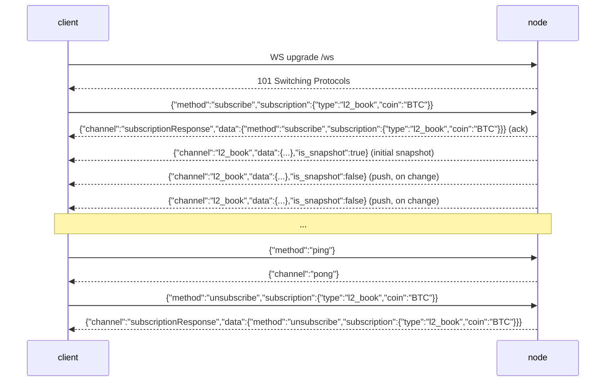

# WebSocket API

:::info
**状态。** 目前在节点上线，支持 `l2_book`、`bbo`（成交簿/最优报价）、`trades`、`active_asset_ctx`（每个市场的标记价格/预言机价格/资金费率/未平仓头寸）、`all_mids`、`fills`、`user_events` 和 `candles`（滚动 OHLCV K 线，按 `(coin, interval)`）— 所有都推送真实已提交数据，按变化驱动（某个频道仅在其状态相比上一次提交发生变化时才发出一帧）— 加上 `post`（WS 上的请求/响应）和 `ping`/`pong`。参见[订阅](./subscriptions.md)了解每个频道的数据结构。
:::

:::info
**频道名称采用 snake_case（MTF 原生）。** 节点的 `/ws` 接口是 MTF 原生的，所以频道的网络名称是 snake_case：`l2_book`、`bbo`、`trades`、`active_asset_ctx`、`fills`、`candles`、`user_events`。想要 HL-camelCase 频道名称（`l2Book`、`userEvents`、`userFills`、`candle` 等）的客户端连接到网关的 **`/hl/ws`**（HL 兼容），底层会翻译为原生 snake_case。根据统一网关路由：`<net>-gateway.mtf.exchange/ws` = 原生 snake_case，`/hl/ws` = HL camelCase。
:::

## 快速摘要

单个 WS 连接复用了对多个频道的订阅。帧协议镜像了 HL 的格式（`{"method":"subscribe","subscription":{"type":...}}`），但是 **频道名称是 MTF 原生 snake_case**（`l2_book`、`user_events` 等）：你发送一个订阅，服务器回复一个 `subscriptionResponse` 确认，随后一个初始快照，然后在状态提交时推送 `{"channel":...,"data":...}` 帧。Book 频道（`l2_book`、`bbo`）是 **按市场的**，需要一个 `coin`。阅读本页了解连接生命周期；参见[订阅](./subscriptions.md)了解频道目录。

## URL

```
wss://<net>-gateway.mtf.exchange/ws
```

MTF 原生 WS（snake_case 频道）是网关在 `/ws` 处的默认选项；HL 兼容 WS（camelCase 频道）位于 `/hl/ws`。网关前门终止 TLS（`wss://`）。自己运行节点时，相同的原生 WS 以纯协议形式在 `ws://localhost:8080/ws` 处提供 — 帧协议无论哪种方式都是相同的。

## 连接生命周期



## 帧

所有帧都是 JSON **文本**帧。二进制帧被拒绝并返回错误帧（连接保持打开）。入站帧由 `method` 键控；出站帧由 `channel` 键控。

### `subscribe`

```json
{
  "method": "subscribe",
  "subscription": { "type": "<channel>", "coin": "<coin>" }
}
```

- `subscription.type`（必需）— 频道名称（snake_case，例如 `l2_book`）。未知名称会产生错误帧。
- `subscription.coin`（按市场的频道 `l2_book` / `bbo` / `trades` / `active_asset_ctx` 必需；`user_events` 则省略）— 参见[币种参数](#coin-parameter)。

服务器依次回复 **两个** 帧：

1. 确认帧：

```json
{
  "channel": "subscriptionResponse",
  "data": { "method": "subscribe", "subscription": { "type": "l2_book", "coin": "BTC" } }
}
```

2. 订阅频道上的初始快照帧（参见[订阅](./subscriptions.md)中的每个频道）。对于 `l2_book` / `bbo` 这是最新已提交 book 的真实快照；对于尚无实时来源的频道，这是一个空但有效的正文。

重复订阅相同的 `(type, coin)` 会被 **静默忽略**（无第二个确认，无错误）— 匹配 HL 行为。

### `unsubscribe`

```json
{ "method": "unsubscribe", "subscription": { "type": "l2_book", "coin": "BTC" } }
```

确认（镜像订阅确认，使用 `method: "unsubscribe"`）：

```json
{
  "channel": "subscriptionResponse",
  "data": { "method": "unsubscribe", "subscription": { "type": "l2_book", "coin": "BTC" } }
}
```

确认后，在你重新订阅之前，该 `(type, coin)` 上不再有帧到达。取消订阅一个你从未订阅过的 `(type, coin)` 是无操作的（你仍然会得到确认）。

### `ping` / `pong`

```json
{ "method": "ping" }
```

```json
{ "channel": "pong" }
```

一个bare `{"method":"ping"}`（没有 `subscription`）是应用层心跳；服务器回复 `{"channel":"pong"}`。节点也会自动回答低级 WebSocket 控制帧 ping（RFC 6455 `Ping`）和 `Pong`，所以任一心跳机制都可以工作。

### 错误帧

任何格式错误或无法识别的入站帧都会产生一个错误帧 **而不关闭连接**：

```json
{ "channel": "error", "data": { "error": "<reason>" } }
```

原因包括：格式错误的 JSON、缺少 `method`、缺少 `subscription` / `subscription.type`、未知的频道名称（`"unknown channel: <name>"`）、二进制帧或未知的方法。客户端可以在同一套接字上更正并重试。

### 推送消息

实时数据帧共享一个信封：

```json
{ "channel": "<channel>", "data": { /* channel-specific */ }, "is_snapshot": false }
```

- `is_snapshot` 是一个布尔值：在初始订阅帧（完整快照）上为 `true`，在之后按变化驱动的推送上为 `false`。**无论哪种情况，每个帧的主体都是完整快照**（例如 `l2_book` 是完整的前 20 档，`all_mids` 是完整的映射，`account_state` 是完整的账户状态）—— `is_snapshot` 只是信息性的，并不是"这是差异"的标志。一个在每帧上简单替换本地状态的客户端始终保持正确，可以忽略此字段。
- 信封的快照标志是 **方言感知的**，正如频道 `type` 名称一样：在此原生 `/ws` 接口上它是 snake_case `is_snapshot`；在 HL 兼容的 `/hl/ws` 接口上，同一帧字段是 camelCase `isSnapshot`。
- 帧上 **没有** `seq`、`ts` 或 `sub_id` 字段。按 `channel` 和 `data` 内的 `coin` 进行分解（对于按市场的频道）。

更新是 **按变化驱动的**：每次提交后，节点 **仅在某个被订阅频道的已提交状态相比上一次提交确实发生变化时** 才为该频道发布一帧。一次未改动某被观看频道的提交不会为其发出任何帧 —— 所以您收到的帧数少于区块数，且永不重复推送未变化的数据（参见[按订阅者推送](#per-subscriber-push)）。

### `post`（WS 上的请求/响应）

一个 `post` 允许你在同一套接字上发出一个一次性请求/响应调用，而不是打开 REST 连接。`request` 正文是 REST 路由接受的相同 `{type, payload}` 信封，并通过 **相同的处理程序** 如 `POST /info` 和 `POST /exchange` 进行分发 — 包括对操作的签名验证。

请求：

```json
{
  "method": "post",
  "id": 42,
  "request": { "type": "info", "payload": { "type": "node_info" } }
}
```

响应（在 `id` 上关联）：

```json
{
  "channel": "post",
  "data": {
    "id": 42,
    "response": { "type": "info", "payload": { /* same body as POST /info */ } }
  }
}
```

- `request.type` 是 `"info"` 或 `"action"`。
- 对于 `"action"`，`payload` 必须是一个完整的已签名交换信封（`signature` / `nonce` / `action`），与 [`POST /exchange`](../rest/exchange.md) 相同。操作在 **紧凑的 `serde_json` 序列化的 `action` 对象** 上签名 — SDK 固定的确定性规范形式。
- 错误作为一个正常的 `post` 帧返回，其中 `response.type: "error"` 和一个字符串 `payload`（从不关闭连接）：

```json
{ "channel": "post", "data": { "id": 42, "response": { "type": "error", "payload": "<message>" } } }
```

一个失败但格式良好的操作（例如签名错误）回复为一个正常的 `action` 响应，其中 `payload.accepted: false` 和一个 `error` 字符串，而不是一个 `error` 类型的响应。

## 币种参数

扇出集线器由 `(channel, coin)` 键控。对于按市场的频道 `l2_book` 和 `bbo`，这意味着：

- **`coin` 是必需的。** 没有它，你会落在无币 `(channel, None)` 桶上，按市场的 book 发布者从不写入 — 你只会收到初始空快照和无实时更新。
- **一个 `BTC` 订阅者只会收到 `BTC` 帧。** ETH 提交永远不会到达 BTC 订阅，反之亦然。

在键控之前，`coin` 被规范化为 **资产 ID 字符串**，所以两种形式解析为同一个桶：

- 一个 **数字资产 id** — 例如 `"0"`、`"7"` — 直接映射到该市场（MTF 原生规范键）。
- 一个 **符号** — 例如 `"BTC"` — 对照已提交的宇宙（`mip3_market_specs`，匹配 `symbol` 或 `asset_name`）解析为其资产 id。

一个由 `"BTC"` 键控的订阅者和一个由数字 id `"0"` 键控的订阅者（如果 BTC 是资产 0）因此共享 **相同的** 路由桶作为按提交发布。一个既不是数字也不是已知宇宙符号的币被保留为其自己的桶 — 你会收到确认 + 空快照但永远不会得到实时帧（诚实的"未知市场"而不是一个虚构的映射）。

## 按订阅者推送

推送是 **订阅者门控、按市场且按变化驱动的**。在每个已提交块后，节点对每个市场检查 `has_receivers(channel, coin)` — 一个 O(1) 查找 — 只有这样才会聚合该市场的 book，并 **仅在它相比上一次提交发生变化时** 广播。后果：

- 没有人在看的市场只花费 O(1) 检查；不构建任何 book。
- 一个 `BTC` 订阅者永远不会触发 `ETH` book 构建。
- 某市场的 book 在一次提交上未变化时，该次提交不为其广播任何内容 —— 无重复推送。
- 帧被传递到 **每个** 该 `(channel, coin)` 桶的当前订阅者。

## 背压和滞后

每个订阅由一个有界广播环形缓冲区（容量 **256** 帧）支持。落后超过 256 帧的消费者被 **丢弃**：服务器发送一个最终错误帧描述滞后，然后停止在该订阅上转发。

```json
{ "channel": "error", "data": { "error": "lagged behind broadcast by <n> messages" } }
```

在这个信号上，重新订阅（你会获得一个新快照）。节点 **不会** 静默跳过 — 对于衍生品链，book 状态中的间隙比显式丢弃更糟。

## 身份验证

公共市场频道（`l2_book`、`bbo`、`trades`、`all_mids`）**不需要身份验证**。

按账户频道（`fills`、`user_events`）是实时的并按 0x `user` 地址路由，但 **尚无身份验证门** — 任何连接都可以订阅任何地址的源（数据是相同的公开已提交填充，按账户键控）。一个专门的身份验证-在订阅信封（所以一个连接只看到自己的账户）在路线图上。对于经过身份验证的读/写，今天使用 `post` 频道（信息读取，以及通过与 `POST /exchange` 相同的 EIP-712 验证的签名操作）。参见[订阅](./subscriptions.md)。

## 复用

单个连接可以持有许多订阅；每个由其 `(channel, coin)` 分解。每个订阅拥有其自己的广播接收器和转发器任务；连接将它们的帧交错到单个套接字上。按 `channel` 加上 `data` 内的 `coin` 路由入站帧。

```
l2_book  coin "0" (BTC)
l2_book  coin "1" (ETH)
bbo      coin "0" (BTC)
```

## 关闭行为

- 一个客户端 `close` 帧（或 EOF）拆除连接并中止每个转发器任务。
- 一个读错误记录并关闭。
- 一个滞后的订阅被单独丢弃（错误帧），但 **连接保持打开** — 其上的其他订阅继续流动。

目前没有自定义关闭代码表；标准 WebSocket 关闭代码适用。

## 重新连接策略

1. 断开连接后，用指数退避重新连接（建议：基数 200 毫秒，最大 30 秒，抖动 ±20%）。
2. 从头重新订阅每个 `(type, coin)`。每次订阅后的第一帧是一个新快照，所以没有恢复令牌要管理 — 丢弃本地 book 状态并从快照重建。
3. 在一个 `lagged` 错误帧上，对该订阅像对待断开连接一样对待并重新订阅。

:::warning
目前 **没有** `seq` / `resume` / `resume_token` 机制。每个（重新）订阅从一个新快照开始。恢复缓冲区在路线图上，尚未实现。
:::

## 另请参见

- [WS 订阅目录](./subscriptions.md)
- [`POST /exchange`](../rest/exchange.md) — `post` 操作路径使用的相同 EIP-712 信封
- [`POST /info`](../rest/info.md) — 一次性读取的 REST 等效项（也可通过 `post` 访问）
