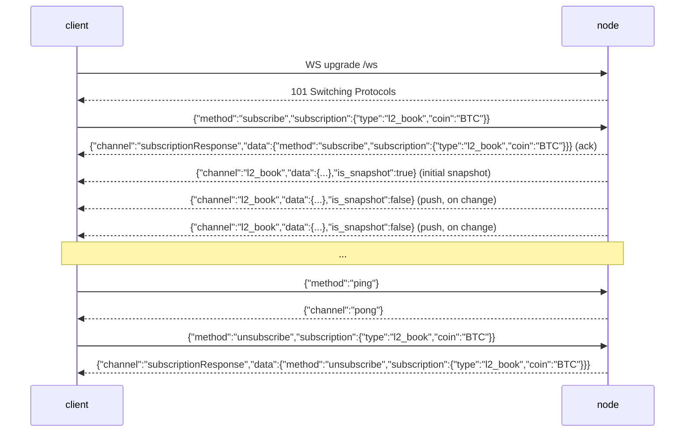

# WebSocket API

:::info
**状态。** 节点目前已上线以下频道：`l2_book`、`bbo`（买卖盘/最优报价）、`trades`、`active_asset_ctx`（每个市场的标记价/预言机价/资金费率/持仓量）、`all_mids`、`fills`、`user_events`，以及 `candles`（滚动 OHLCV K线，按 `(coin, interval)` 维度推送）——所有频道均推送已提交的真实数据，采用变更驱动模式（仅在该频道状态自上次提交以来发生变化时才会推出一帧）——另外还支持 `post`（通过 WS 进行请求/响应）以及 `ping`/`pong`。各频道的数据结构详见[订阅说明](./subscriptions.md)。
:::

:::info
**频道名称采用 snake_case（MTF 原生格式）。** 节点的 `/ws` 接入面是 MTF 原生的，因此频道的线路名称为 snake_case：`l2_book`、`bbo`、`trades`、`active_asset_ctx`、`fills`、`candles`、`user_events`。网关在 `api.<net>.mtf.exchange/ws` 上提供相同的原生 WS 接口。
:::

## 概述

一条 WS 连接可复用，同时订阅多个频道。帧协议与 HL 一致（`{"method":"subscribe","subscription":{"type":...}}`），但**频道名称为 MTF 原生 snake_case**（`l2_book`、`user_events` 等）：客户端发送订阅请求后，服务端先回复一个 `subscriptionResponse` 确认帧，随后推送初始快照，之后每当状态提交发生变更时持续推送 `{"channel":...,"data":...}` 帧。买卖盘频道（`l2_book`、`bbo`）是**按市场**维度订阅的，必须传入 `coin` 参数。本页介绍连接生命周期，各频道目录请参阅[订阅说明](./subscriptions.md)。

## 连接地址

```
wss://api.<net>.mtf.exchange/ws
```

MTF 原生 WS（snake_case 频道）由网关在 `/ws` 路径提供。网关入口负责 TLS 终止（`wss://`）。若自行运行节点，相同的原生 WS 以明文形式在 `ws://localhost:8080/ws` 上提供——帧协议完全一致。

## 连接生命周期



## 帧格式

所有帧均为 JSON **文本**帧。二进制帧会被拒绝并返回错误帧（连接保持不断开）。入站帧以 `method` 字段作为键；出站帧以 `channel` 字段作为键。

### `subscribe`

```json
{
  "method": "subscribe",
  "subscription": { "type": "<channel>", "coin": "<coin>" }
}
```

- `subscription.type`（必填）——频道名称（snake_case，例如 `l2_book`）。未知的频道名会返回错误帧。
- `subscription.coin`（按市场频道 `l2_book` / `bbo` / `trades` / `active_asset_ctx` 必填；`user_events` 不需要传入）——详见 [coin 参数](#coin-参数)。

服务端依次回复**两**帧：

1. 确认帧（ack）：

```json
{
  "channel": "subscriptionResponse",
  "data": { "method": "subscribe", "subscription": { "type": "l2_book", "coin": "BTC" } }
}
```

2. 所订阅频道的初始快照帧（各频道的数据结构见[订阅说明](./subscriptions.md)）。对于 `l2_book` / `bbo`，这是最新已提交买卖盘的真实快照；对于尚无实时数据源的频道，返回一个空但合法的数据体。

对相同 `(type, coin)` 重复订阅会被**静默忽略**（不会再发送 ack，也不会报错）——与 HL 行为一致。

### `unsubscribe`

```json
{ "method": "unsubscribe", "subscription": { "type": "l2_book", "coin": "BTC" } }
```

确认帧（与订阅 ack 格式相同，`method` 改为 `"unsubscribe"`）：

```json
{
  "channel": "subscriptionResponse",
  "data": { "method": "unsubscribe", "subscription": { "type": "l2_book", "coin": "BTC" } }
}
```

收到 ack 后，该 `(type, coin)` 不再推送任何帧，直到重新订阅为止。对从未订阅过的 `(type, coin)` 执行取消订阅为空操作（仍会收到 ack）。

### `ping` / `pong`

```json
{ "method": "ping" }
```

```json
{ "channel": "pong" }
```

裸 `{"method":"ping"}`（不含 `subscription`）是应用层心跳；服务端回复 `{"channel":"pong"}`。节点同样会自动响应低层 WebSocket 控制帧 Ping（RFC 6455 `Ping`）并返回 `Pong`，两种心跳机制均可使用。

### 错误帧

任何格式错误或无法识别的入站帧都会产生一个错误帧，**且不会关闭连接**：

```json
{ "channel": "error", "data": { "error": "<reason>" } }
```

触发原因包括：JSON 格式错误、缺少 `method`、缺少 `subscription` / `subscription.type`、未知频道名（`"unknown channel: <name>"`）、二进制帧，或未知的 method。客户端可在同一连接上修正后重试。

### 推送消息

实时数据帧共用同一个信封结构：

```json
{ "channel": "<channel>", "data": { /* channel-specific */ }, "is_snapshot": false }
```

- `is_snapshot` 为布尔值：订阅后的初始帧（完整快照）为 `true`，后续变更驱动的推送帧为 `false`。**每帧数据体始终是完整快照**（例如 `l2_book` 始终包含完整的前20档买卖盘，`all_mids` 始终是完整的映射表，`account_state` 始终是完整的账户状态）——`is_snapshot` 仅供参考，并非"这是增量差异"的标志。客户端只需在每帧到达时直接替换本地状态，无需关注该字段。
- 帧上**没有** `seq`、`ts` 或 `sub_id` 字段。请通过 `channel` 字段（以及按市场频道中 `data` 内的 `coin`）进行解复用。

更新采用**变更驱动**模式：每次提交后，节点仅在某个已订阅频道的已提交状态**自上次提交以来真正发生变化时**，才向其推送一帧。某次提交未触及所监听频道则不推送任何内容——因此收到的帧数少于区块数，不会有冗余的重复推送（详见[按订阅者推送](#按订阅者推送)）。

### `post`（通过 WS 进行请求/响应）

`post` 允许在同一连接上发起单次请求/响应调用，无需额外建立 REST 连接。`request` 体采用与 REST 路由相同的 `{type, payload}` 信封，并通过**完全相同的处理器**分发——与 `POST /info` 和 `POST /exchange` 一致，包含对 action 的签名校验。

请求：

```json
{
  "method": "post",
  "id": 42,
  "request": { "type": "info", "payload": { "type": "node_info" } }
}
```

响应（通过 `id` 关联）：

```json
{
  "channel": "post",
  "data": {
    "id": 42,
    "response": { "type": "info", "payload": { /* same body as POST /info */ } }
  }
}
```

- `request.type` 为 `"info"` 或 `"action"`。
- 对于 `"action"`，`payload` 必须是完整的已签名交易信封（`signature` / `nonce` / `action`），与 [`POST /exchange`](../rest/exchange.md) 完全一致。action 的签名基于 **`action` 对象的紧凑 `serde_json` 序列化**——即 SDK 所固定的确定性规范形式。
- 错误以正常的 `post` 帧形式返回，`response.type` 为 `"error"`，`payload` 为字符串（不会关闭连接）：

```json
{ "channel": "post", "data": { "id": 42, "response": { "type": "error", "payload": "<message>" } } }
```

格式合法但执行失败的 action（例如签名错误）会以正常的 `action` 响应帧返回，`payload.accepted: false` 并附带 `error` 字符串，而非 `error` 类型响应。

## coin 参数

分发路由以 `(channel, coin)` 为键。对于按市场频道 `l2_book` 和 `bbo`，这意味着：

- **`coin` 为必填项。** 不传则落入无 coin 的 `(channel, None)` 桶，而按市场买卖盘发布者从不向该桶写入——届时只会收到初始空快照，没有任何实时更新。
- **订阅 `BTC` 的客户端只收到 `BTC` 的帧。** ETH 的提交永远不会到达 BTC 的订阅，反之亦然。

`coin` 在作为路由键之前会被规范化为**资产 ID 字符串**，因此以下两种形式最终指向同一个桶：

- **数字资产 ID**——例如 `"0"`、`"7"`——直接映射到对应市场（MTF 原生的规范键）。
- **符号**——例如 `"BTC"`——通过已提交的全量市场表（`mip3_market_specs`，按 `symbol` 或 `asset_name` 匹配）解析为其资产 ID。

因此，以 `"BTC"` 为键的订阅者与以数字 ID `"0"` 为键的订阅者（若 BTC 的资产 ID 为 0）共享**同一个**路由桶，在每次提交时同步接收推送。若 coin 既非数字也非已知的全量市场符号，则原样保留为独立桶——你会收到 ack 和空快照，但永远不会有实时帧（这是诚实的"未知市场"提示，而非伪造映射）。

## 按订阅者推送

推送是**订阅者隔离、按市场维度、变更驱动**的。每个已提交区块处理完毕后，节点会对每个市场执行 `has_receivers(channel, coin)` 检查（O(1) 查找），仅当有订阅者时才聚合该市场的买卖盘，并**仅在自上次提交以来状态发生变化时**广播。由此带来以下特性：

- 无人订阅的市场只需 O(1) 检查开销，不会构建买卖盘。
- BTC 的订阅者不会触发 ETH 买卖盘的构建。
- 某次提交中买卖盘未发生变化的市场，该次提交不会广播任何内容，不存在冗余重推。
- 帧会推送给该 `(channel, coin)` 桶下的**所有**当前订阅者。

## 背压与滞后

每个订阅由一个有界广播环形缓冲区支撑（容量为 **256** 帧）。若消费者落后超过 256 帧，该订阅将被**强制断开**：服务端发送最后一个描述滞后情况的错误帧，随后停止该订阅的推送。

```json
{ "channel": "error", "data": { "error": "lagged behind broadcast by <n> messages" } }
```

收到此信号后，请重新订阅（届时将获得一个新的快照）。节点**不会**静默跳过滞后帧——对于衍生品链而言，买卖盘状态出现缺口比显式断开更为危险。

## 鉴权

公开市场频道（`l2_book`、`bbo`、`trades`、`all_mids`）**无需鉴权**。

账户级频道（`fills`、`user_events`）为实时数据，按 0x `user` 地址路由，但**目前尚未设置鉴权门控**——任何连接均可订阅任意地址的推送（数据与已公开提交的 fills 相同，以账户为键）。支持订阅时鉴权的信封（使连接仅能查看自身账户数据）已列入路线图。当前如需进行已鉴权的读写操作，请使用 `post` 频道（info 读取，以及通过与 `POST /exchange` 相同的 EIP-712 验证提交已签名 action）。详见[订阅说明](./subscriptions.md)。

## 多路复用

单条连接可持有多个订阅，每个订阅以 `(channel, coin)` 进行解复用。每个订阅拥有独立的广播接收器和转发任务，连接将各订阅的帧交织合并后发送到同一个 socket 上。入站帧请通过 `channel` 字段加上 `data` 中的 `coin` 字段进行路由。

```
l2_book  coin "0" (BTC)
l2_book  coin "1" (ETH)
bbo      coin "0" (BTC)
```

## 关闭行为

- 客户端发送 `close` 帧（或 EOF）会断开连接并中止所有转发任务。
- 读取错误会记录日志并关闭连接。
- 滞后的订阅会被单独断开（发送错误帧），但**连接本身保持开启**——该连接上的其他订阅继续正常推送。

目前没有自定义关闭码表；适用标准 WebSocket 关闭码。

## 重连策略

1. 断开后，以指数退避策略重连（建议：基础间隔 200ms，最大间隔 30s，抖动 ±20%）。
2. 从头重新订阅每个 `(type, coin)`。每次订阅后的第一帧是全新的快照，无需管理任何恢复令牌——直接丢弃本地买卖盘状态，从快照重建即可。
3. 收到 `lagged` 错误帧时，对该订阅按断线处理并重新订阅。

:::warning
目前**没有** `seq` / `resume` / `resume_token` 机制。每次（重新）订阅均从全新快照开始。断点续传缓冲区已列入路线图，尚未实现。
:::

## 延伸阅读

- [WS 订阅目录](./subscriptions.md)
- [`POST /exchange`](../rest/exchange.md) —— `post` action 路径使用的相同 EIP-712 信封
- [`POST /info`](../rest/info.md) —— 单次读取的 REST 等效接口（也可通过 `post` 调用）
