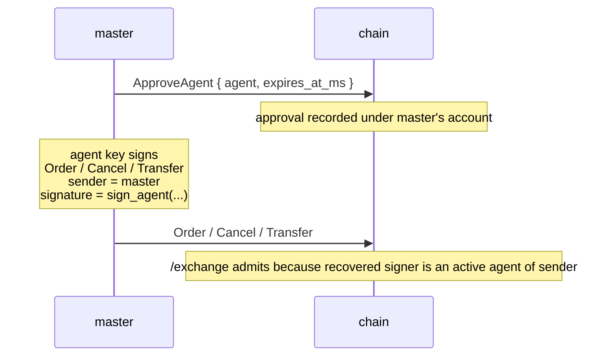

# 代理钱包

:::tip
**稳定版。**
:::

**代理钱包**（又称"API 钱包"）是一种密钥，用于代替主账户签署交易操作，但本身不具备提款权限。这正是所有专业做市商的实际运作方式：主密钥冷存储，热密钥驱动机器人。

与主流链上永续合约 DEX 的 API 钱包采用相同的底层机制，在协议层完全兼容，可直接替换使用。

## 为什么使用代理钱包

- **冷存储主密钥。** 从冷存储端完成一次授权，之后高价值密钥无需再参与任何签名。
- **按机器人隔离授权范围。** 为不同策略或不同机器分配独立的代理；某个代理被泄露时，只需撤销该代理，不影响其他代理。
- **有效期管理。** 授权时设置过期时间戳，密钥到期自动失效，无需手动撤销。
- **可审计。** 每个操作都由特定代理签名，链上日志清晰，便于取证分析。

## 生命周期



主密钥只需签署一次 `ApproveAgent`。该区块确认后，代理即可使用 `sender = master_addr` 签署任意操作，链上会将其视同主账户签名。授权可设置明确的过期时间，让热密钥在无需显式撤销的情况下自动退出使命。

## 授权验证逻辑

每笔发往 [`POST /exchange`](../api/rest/exchange.md) 的请求都包含三个字段：

```
sender    = "0x<claimed master address>"
signature = secp256k1 ECDSA over the EIP-712 envelope
action    = the state-mutating action
```

链上对每笔请求执行如下验证：

```
recovered_addr = ecrecover(eip712_envelope(action), signature)

if recovered_addr == sender:
    admit                                # master signed
else if recovered_addr is an active agent of sender (not expired):
    admit                                # an active agent of sender signed
else:
    return 401
```

有两点值得特别关注：

1. **无 Bearer Token，无 API Key。** 签名本身即是认证凭据。证明授权的是代理私钥的持有权，与请求 URL 或 Header 无关。
2. **`sender` 仅因签名有效而被信任。** 声称 `sender = 任意地址` 毫无意义，只有当恢复出的签名者属于该账户已授权的代理集合时，请求才会被接受。

## EIP-712 签名封装，详解

任意操作的签名载荷构造如下：

```
message_hash  = keccak256( msgpack(action) )
signed_hash   = keccak256( 0x1901 ‖ domain_separator ‖ message_hash )
signature     = secp256k1_sign( signed_hash, agent_private_key )
```

其中：

```
domain_separator = keccak256(
    keccak256("EIP712Domain(string name,string version,uint256 chainId,address verifyingContract)") ‖
    keccak256("MetaFlux") ‖
    keccak256("1") ‖
    chain_id_as_uint256_be ‖
    address(0).padded_to_32
)
```

此构造与 EIP-712 标准封装语义完全一致；已支持 EIP-712 的 EVM 生态客户端（MetaMask、Rabby、Ledger、WalletConnect）无需任何改动，直接指向该域即可使用。

`action` 以 **EIP-712 结构化类型数据**形式签名——每种操作变体对应一个主类型（`MetaFluxTransaction:<Action>`），钱包可按字段名逐一展示。各操作的类型字符串详见[类型化数据签名](../integration/typed-data-signing.md)。无论是主密钥还是已授权的代理签名，签名恢复和 EVM 兼容性逻辑不变。

## 链上存储内容

每个主账户维护一个已授权代理集合，每条授权记录包含：

```
approval = {
  agent          : address (20 bytes),
  approved_at_ms : u64 (block time at approval),
  expires_at_ms  : u64 or null (null = no expiry),
  name           : optional label for bookkeeping
}
```

所有时间字段均来自共识层出块时间，非本地系统时钟。确定性保证：在同一区块高度，所有验证节点对代理状态的判断完全一致。

## 授权代理

主账户通过 [`POST /exchange`](../api/rest/exchange.md) 提交 `ApproveAgent` 操作：

```json
{
  "sender":    "0x<master_addr>",
  "signature": "0x<master_signature>",
  "action": {
    "type": "ApproveAgent",
    "params": {
      "agent":          "0x<agent_addr>",
      "expires_at_ms":  1735689600000,
      "name":           "trading-bot-1"
    }
  }
}
```

`expires_at_ms` 取值说明：
- `null` → 永不过期（直到显式撤销）
- 正整数 → Unix 毫秒时间戳，超过该时间后链上拒绝该代理签名的请求

`name` 仅作为自用标签，用于日常管理——会在 `userState` / `subAccounts` 信息查询中回显。

## 使用代理进行交易

授权所在区块确认后，使用**代理**私钥签署操作，但提交时 `sender` 填写**主账户**地址。SDK 负责构造 EIP-712 封装并提交签名包。链上从签名中恢复代理地址，发现与 `sender` 不匹配后，查询授权集合并放行。

## 生效延迟

`ApproveAgent` 在区块高度 `H` 确认后：
- 从区块 `H+1` 起，新授权对请求生效

实际操作中：发送 `ApproveAgent` 后，等待一个共识周期再发起代理签名的流量。SDK 的线性退避重试策略可平滑处理这个边界情况。

收紧过期时间（实质上是提前撤销代理）同样遵循一个区块的延迟。

## 轮换与过期

代理失效的两种方式：

- **过期**：在授权时设置，自动执行——一旦 `now > expires_at_ms`，请求即被拒绝，无需额外操作。
- **重新授权并收紧过期时间**：对同一代理地址提交新的 `ApproveAgent` 会覆盖原有记录；将 `expires_at_ms` 设为过去的时间，即可立即使该密钥失效。

日常轮换时，优先使用过期机制。SDK 会透明地处理续期节奏。

## 重放保护

链上按用户维护 nonce 序列：

- 每个操作都携带一个 `nonce`
- 针对同一用户重复使用 nonce 的请求会被拒绝，即使签名本身有效

实际意义：只要每个操作携带唯一 nonce，同一代理可安全地并发提交操作。SDK 通常采用带抖动的 Unix 毫秒时间戳作为 nonce。

对于代理签名的请求，nonce 空间以**主账户**（`sender`）为键，而非代理本身。同一主账户下的两个不同代理共享同一 nonce 空间。

## 生产环境检查清单

在生产环境中运行代理密钥集群的经过验证的最佳实践：

| 事项 | 原因 |
|------|-----|
| 主密钥存于冷存储（硬件钱包 / HSM） | 主密钥仅需签署 `ApproveAgent`（以及提款时的 `WithdrawUsdc`）——属于低频操作 |
| 每台主机 / 容器分配独立代理 | 某台主机被攻破时，仅暴露该代理的权限，撤销时不影响其他代理 |
| `expires_at_ms` 设为距授权时间不超过 30 天 | 强制定期续期；遗漏续期即自动撤销 |
| 代理名称中编码主机名与启动时间 | 审计取证一目了然，例如 `mm-host-3 / 2026-Q2` |
| 轮换脚本：在旧密钥过期前预先注册新代理 | 在旧密钥过期前 24 小时提交新密钥的 `ApproveAgent`；切换流量；等待旧密钥自动过期 |
| 泄露应急演练：每季度测试撤销与轮换操作手册 | 密钥真正泄露时，流程是否已成肌肉记忆至关重要 |
| 监听 `userEvents` 中的 `agentApproved` / `agentExpired` 事件 | 确认链上状态与预期一致 |
| 仅撤单代理与完整交易代理分开使用 | 仅撤单密钥在半可信环境中风险更低 |

### 轮换流程示例

```
day -1   submit ApproveAgent { agent: new_key, expires_at_ms: NOW + 30d }
          wait 1 block (consensus tick); confirm via /info agents
day 0    flip traffic in your bot: stop using old_key, start using new_key
day 0    submit ApproveAgent { agent: old_key, expires_at_ms: NOW + 1h }
          to bound the old key's remaining authority window
day +1h  old_key expires automatically
```

预先注册可避免新旧密钥同时有效的窗口期
（当然同时有效也完全没问题——并发代理共享主账户的 nonce 空间）。

## 代理不能做什么

代理**没有提款权限**，这是设计层面的约束。任何将资金从主账户转出的操作（提款到外部链、转账到其他地址）都必须由主密钥签署。代理管理本身（创建或延长授权）同样仅限主密钥操作——不支持代理的代理这类递归授权。

代理*可以*进行交易、撤销订单、在限定范围内调整保证金模式、挂单/撤销 TWAP，以及大多数常规交易操作。

## 常见故障排查

| 现象 | 原因 | 解决方法 |
|---------|-------|-----|
| 所有代理签名请求均返回 `401` | 授权尚未上链确认 | 在 `ApproveAgent` 后等待一个区块 |
| 原本正常，突然返回 `401` | 代理已过期 | 重新授权（设新过期时间）或轮换至新代理 |
| 仅提款操作返回 `401` | 代理无提款权限（设计如此） | 提款须使用主密钥签名 |
| 新主账户立即返回 `401` | `sender` 声称为主账户，但签名者是其他地址且不存在对应授权 | 检查签名所用密钥是否正确 |

## 参见

- [`POST /exchange`](../api/rest/exchange.md) — 请求准入路径
- [签名流程详解](../integration/signing.md) — EIP-712 端到端完整示例
- [从 HL 迁移](../integration/migrating-from-hl.md) — HL 机器人的直接迁移模式
