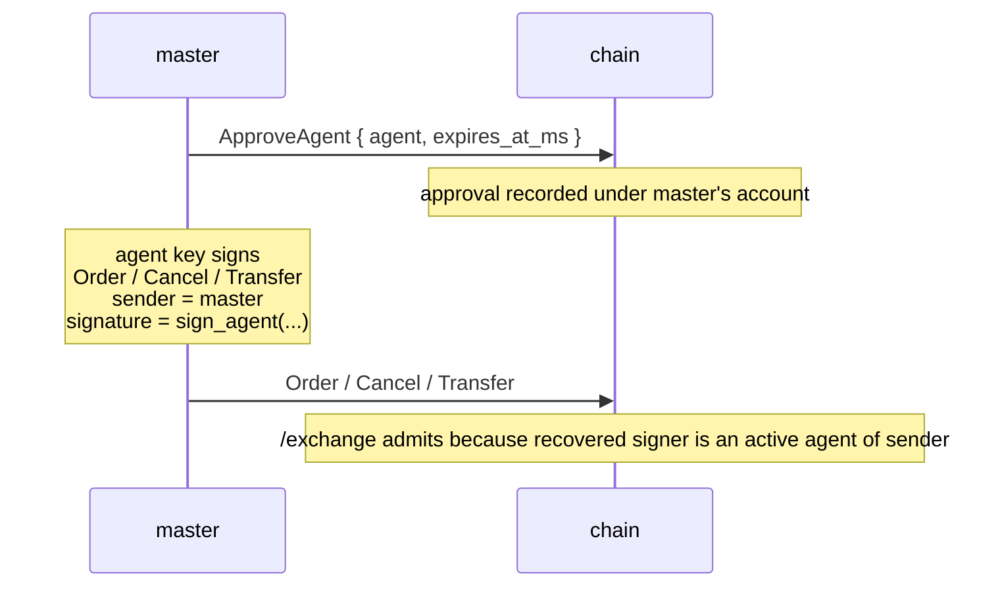

# Agent 钱包

:::tip
**稳定版本。**
:::

**Agent 钱包**（也称"API 钱包"）是代表主账户签署交易操作的密钥，但从不拥有提现权限。这是每个严肃做市商的实际运作方式：主密钥保存在冷存储中，热密钥运行机器人。

与主流链上永续 DEX 的 API 钱包相同的原理。协议级别完全兼容。

## 为什么使用 Agent 钱包

- **冷存储主钥。** 从冷存储批准一次，然后永不再从高价值密钥签署。
- **每个 Bot 的作用域。** 不同的 Agent 用于不同的策略或机器；撤销受到危害的那个而不影响其他。
- **过期。** 使用过期时间戳批准；即使忘记撤销，密钥也会自动失效。
- **审计。** 每个操作都由特定的 Agent 签署，因此链日志在法医上是干净的。

## 生命周期



主账户签署一次 `ApproveAgent`。提交该块后，Agent 可以用 `sender = master_addr` 签署任何操作，链将其视为主账户签署的。批准可以带有显式过期时间，因此热密钥即使您从未显式撤销也会自动失效。

## 授权检查

对 [`POST /exchange`](../api/rest/exchange.md) 的每个请求包含三部分：

```
sender    = "0x<claimed master address>"
signature = secp256k1 ECDSA over the EIP-712 envelope
action    = the state-mutating action
```

链对每个请求进行以下检查：

```
recovered_addr = ecrecover(eip712_envelope(action), signature)

if recovered_addr == sender:
    admit                                # master signed
else if recovered_addr is an active agent of sender (not expired):
    admit                                # an active agent of sender signed
else:
    return 401
```

两个值得强调的结果：

1. **没有 Bearer 令牌，没有 API 密钥。** 签名本身就是身份验证。拥有 Agent 私钥就是证明权限的因素；请求 URL 或标头中的任何内容都不会授予访问权限。
2. **`sender` 仅因为签名而受服务器信任。** 说 `sender = anyone` 没有证明任何东西，直到恢复的签署者与该账户的批准集匹配。

## EIP-712 信封详解

任何操作的签署有效载荷是：

```
message_hash  = keccak256( msgpack(action) )
signed_hash   = keccak256( 0x1901 ‖ domain_separator ‖ message_hash )
signature     = secp256k1_sign( signed_hash, agent_private_key )
```

其中：

```
domain_separator = keccak256(
    keccak256("EIP712Domain(string name,string version,uint256 chainId,address verifyingContract)") ‖
    keccak256("MetaFlux") ‖
    keccak256("1") ‖
    chain_id_as_uint256_be ‖
    address(0).padded_to_32
)
```

此组合符合 EIP-712 标准信封语义；EVM 堆栈上已经支持 EIP-712 的客户端（MetaMask、Rabby、Ledger、WalletConnect）可以直接指向此域。

`action` 以 **EIP-712 结构化类型数据**签署——每个操作变体有一个主类型（`MetaFluxTransaction:<Action>`），以便钱包按名称显示每个字段。有关每个操作的类型字符串，请参见[类型化数据签署](../integration/typed-data-signing.md)。无论主账户还是批准的 Agent 签署，签名恢复和 EVM 兼容性都不变。

## 链存储的内容

每个主账户的批准 Agent 集合：

```
approval = {
  agent          : address (20 bytes),
  approved_at_ms : u64 (block time at approval),
  expires_at_ms  : u64 or null (null = no expiry),
  name           : optional label for bookkeeping
}
```

所有时间字段都是共识导出的块时间，而不是挂钟时间。确定性：每个验证者在同一块高度对 Agent 状态的认识相同。

## 批准 Agent

主账户通过 [`POST /exchange`](../api/rest/exchange.md) 提交一个 `ApproveAgent` 操作：

```json
{
  "sender":    "0x<master_addr>",
  "signature": "0x<master_signature>",
  "action": {
    "type": "ApproveAgent",
    "params": {
      "agent":          "0x<agent_addr>",
      "expires_at_ms":  1735689600000,
      "name":           "trading-bot-1"
    }
  }
}
```

`expires_at_ms`：
- `null` → 无过期（保留至明确撤销）
- 正整数 → 链拒绝 Agent 签署请求的 unix 毫秒时间

`name` 纯粹是您自己簿记的标签——在 `userState` / `subAccounts` 信息查询中显示。

## 从 Agent 交易

批准块提交后，用 **Agent 的**密钥签署任何东西，但使用 **主账户** 的地址作为 `sender` 提交。您的 SDK 处理 EIP-712 信封并提交签署的包。链从签名中恢复 Agent 的地址，看到与 `sender` 的不匹配，检查批准集，并允许。

## 传播延迟

在 `ApproveAgent` 在块高度 `H` 提交后：
- 块 `H+1` 及更高的请求看到新批准

实际上这意味着：发送 `ApproveAgent` 后等待一个共识 Tick，再开始 Agent 签署的流量。带有线性退避的 SDK 重试策略可以很好地处理边界。

紧缩过期（实际上撤销 Agent）遵循相同的一块延迟。

## 轮换和过期

Agent 停止有效的两种方式：

- **过期**在批准时设置并自动执行——一旦 `now > expires_at_ms`，请求失败。您不需要发送任何其他东西。
- **重新批准**并带有紧缩的过期。为同一 Agent 地址提交新的 `ApproveAgent` 会覆盖之前的记录；将 `expires_at_ms` 设置为过去时间可有效撤销密钥。

对于常规轮换，首选过期。SDK 透明地处理续期周期。

## 重放保护

链强制执行每用户 nonce：

- 每个操作携带一个 `nonce`
- 对同一用户重用 nonce 会被拒绝，即使签名在其他方面有效

实际含义：只要每个都携带唯一的 nonce，同一 Agent 可以安全地提交并发操作。SDK 通常使用带有抖动的 unix 毫秒。

对于 Agent 签署的请求，nonce 空间以**主账户**（`sender`）为键，而不是 Agent。同一主账户的两个不同 Agent 共享 nonce 空间。

## 生产检查清单

在生产中运行 Agent 密钥集群的久经考验的模式：

| 项目 | 原因 |
|------|-----|
| 主钥在冷存储中（硬件钱包 / HSM） | 主钥仅签署 `ApproveAgent`（和提现时的 `WithdrawUsdc`）——罕见事件 |
| 每个主机 / 容器一个 Agent | 如果主机遭到危害，只有该 Agent 的权限暴露；撤销而不影响其他 |
| `expires_at_ms` 设置为从批准起 ≤ 30 天 | 强制轮换周期；错过的续期是自动撤销 |
| Agent 名称编码主机 + 开始时间 | 使审计取证变得琐碎：`mm-host-3 / 2026-Q2` |
| 轮换脚本：在旧 Agent 过期前预发布新 Agent | 在旧 Agent 过期前 24 小时提交新密钥的 `ApproveAgent`；切换流量；让旧 Agent 过期 |
| 危害演练：撤销 + 轮换 runbook 每季度测试一次 | 当密钥实际泄漏时，机械执行最重要 |
| 监视 `userEvents` 的 `agentApproved` / `agentExpired` 事件 | 确认链侧状态与您的预期匹配 |
| 为仅取消与完整交易使用不同的 Agent | 仅取消密钥在半受信环境中更安全 |

### 轮换模式

```
day -1   submit ApproveAgent { agent: new_key, expires_at_ms: NOW + 30d }
          wait 1 block (consensus tick); confirm via /info agents
day 0    flip traffic in your bot: stop using old_key, start using new_key
day 0    submit ApproveAgent { agent: old_key, expires_at_ms: NOW + 1h }
          to bound the old key's remaining authority window
day +1h  old_key expires automatically
```

预发布避免了可能同时使用两个密钥的任何窗口
（这也没问题——并发 Agent 共享主账户的 nonce 空间）。

## Agent 不能做什么

根据设计，Agent **没有提现权限**。任何将资金移出主账户的操作（提现到外部链、转移到其他地址）必须由主密钥签署。Agent 管理本身（创建或扩展批准）也仅限主账户——没有递归的 Agent-of-Agent。

Agent *可以*交易、取消、在限制范围内修改保证金模式、下达 / 取消 TWAP，以及大多数普通交易流。

## 故障情况

| 症状 | 原因 | 解决方案 |
|---------|-------|-----|
| 每个 Agent 签署请求上都返回 `401` | 批准尚未提交 | 在 `ApproveAgent` 后等待一个块 |
| 在已知良好期后返回 `401` | Agent 已过期 | 重新批准（新过期）或轮换到新 Agent |
| 仅在提现操作上返回 `401` | Agent 不能提现（设计上） | 使用主密钥签署提现 |
| 在新主账户上立即返回 `401` | 声称 `sender` 是主账户但签署者是其他人且不存在批准 | 检查您正在使用正确的密钥进行签署 |

## 另请参阅

- [`POST /exchange`](../api/rest/exchange.md) — 许可路径
- [签署演练](../integration/signing.md) — 具体的端到端 EIP-712 示例
- [从 HL 迁移](../integration/migrating-from-hl.md) — HL 机器人的直接替代模式
