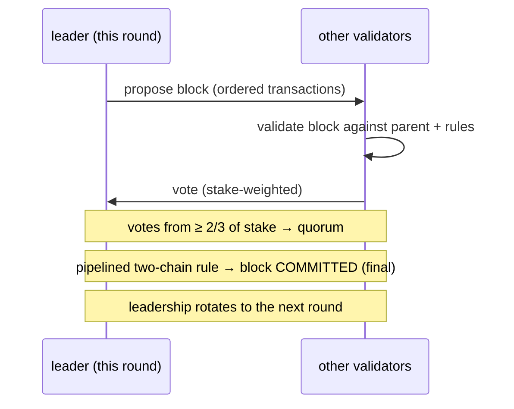
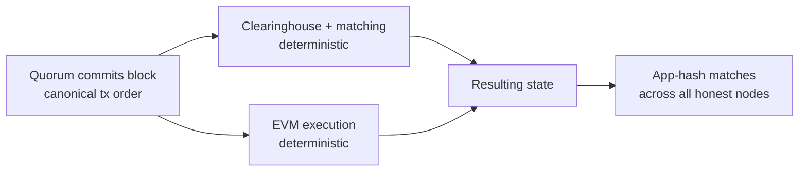

# 共识机制（MetaFluxBFT）

:::info
**已上线。** MetaFluxBFT 是 MetaFlux L1 的生产级共识引擎。它将每一笔交易——订单、撤单、清算、转账、EVM 调用——排入同一条规范链，实现确定性、即时终局。
:::

## 概述

**MetaFluxBFT** 是 MetaFlux 的拜占庭容错（BFT）权益证明共识引擎。一组按质押权重排列的验证者逐块就所有交易的唯一规范排序达成共识。一旦某个区块获得法定人数提交，它便**立即成为终局**——没有概率性确认，无需"等待 N 个区块"，也不会发生链重组。正是这种即时、全局的交易排序，使 MetaFlux 得以运行完全链上的订单簿与清算所：每一次撮合、成交、资金费结算与清算，都基于全网已达成共识的订单进行。

## 为何交易所需要这一特性

交易场所的公平性依赖于所有人以相同顺序看到同一本订单簿。MetaFluxBFT 为交易者和开发者提供两项关键保证：

| 属性 | 对你意味着什么 |
|----------|------------------------|
| **全局排序** | 每笔交易在序列中有且仅有一个经过共识的位置。撮合引擎严格按照该顺序处理订单——不存在任何可绕过你进行重排序的特权通道。 |
| **即时终局** | 已提交的区块不可回滚。成交或结算在区块提交的瞬间即告完成——你永远不必为链重组的风险打折扣。 |

两者共同实现了**抗抢跑撮合**与**即时结算**：保障链安全的规范序列，正是订单簿撮合所依据的序列。

## 设计渊源

MetaFluxBFT 是 MetaFlux 自主实现的共识引擎，学术上源自**HotStuff / Jolteon** 系列流水线 BFT 协议（该研究路线同样包含 DiemBFT）。这一协议族具有以下特征：

- **基于领导者** — 每轮由一名验证者提议下一个区块，其余验证者对其投票。
- **部分同步** — 在任何时候都保持*安全性*（不会产生相互冲突的已终结历史），一旦网络能够及时传递消息，协议便恢复*活性*。
- **双链提交** — 终局性通过一条短小的流水线投票链实现，而非单轮全有或全无，从而在保留 BFT 安全性的同时压低确认延迟。

MetaFlux 基于上述公开研究成果构建自有引擎，而非分叉现有代码库，从而可针对链上交易所的需求进行专项调优（确定性执行、集成 EVM、基于质押的验证者集合）。

## 验证者与质押

验证者集合直接由**链上质押**决定——MetaFluxBFT 是一套权益证明协议。任何满足质押要求的人均可运行验证者节点；委托者以 MTF 支持验证者（参见 [Staking](./staking.md)）。

- **按权重投票。** 验证者对共识的影响力与其背后的质押量成正比，而非每节点一票。
- **法定人数 = 三分之二质押量。** 只有当代表**至少三分之二总质押投票权**的验证者投票支持某区块时，该区块才会被提交。三分之二法定人数是 BFT 安全保障的核心。
- **领导者轮换。** 提议权在验证者集合中轮流流转，不允许任何单一验证者垄断区块生产。

### 纪元（Epochs）

验证者集合在一个**纪元**内固定不变，仅在纪元边界处才可能发生变更。在一个纪元期间保持集合稳定，使共识过程具有确定性和可预期性，同时随着质押迁移、验证者加入或退出，集合仍可随时间演进。纪元结束时，协议采用基于新质押状态派生的验证者集合进入下一个纪元。

## 安全性与活性

MetaFluxBFT 在经典 BFT 意义上承诺以下两项保证：

:::tip 安全性
**链永远不会将两段相互冲突的历史都最终确认**，前提是超过三分之二的质押投票权是诚实的。等价地说，MetaFluxBFT 可以容忍最多**三分之一**的投票权出现拜占庭错误（任意故障），而不会提交相互冲突的区块。即使在网络缓慢或消息延迟的情况下，安全性依然成立。
:::

:::tip 活性
**链持续推进**——持续提交新区块——只要网络足够同步，能够及时传递消息。由于领导者轮换，单个停滞或无响应的领导者无法阻断链的运转：协议会向前推进领导权并继续出块。
:::

这是部分同步 BFT 中的标准分离原则：*安全性始终成立，活性在同步条件下成立*。

## 终局性与确定性执行

MetaFluxBFT 的终局性是**即时且绝对**的。法定人数一旦提交某个区块，该区块——以及它所承载的精确交易排序——便永久定格。没有概率性结算期，也不存在链重组风险。

执行层构建于已提交的排序之上，并且是**完全确定性**的：

1. 共识确定区块内交易的规范顺序。
2. 每个节点对该顺序执行**相同**的状态转换——用于交易的清算所与撮合引擎，以及用于智能合约交易的 EVM。
3. 由于输入（有序交易）和转换函数完全一致，每个诚实节点会独立得出**完全相同的最终状态**。

各节点通过比较最终状态的紧凑指纹（"app-hash"）来确认彼此一致。相同的排序加上确定性执行，意味着每个诚实节点的 app-hash 都匹配——网络无需信任任何单一节点的计算，即可保持精确一致。

## 问责机制

验证者在经济上对其参与行为负责。**可被证明存在恶意行为**的验证者将被**监禁**（撤出活跃参与资格）并**惩罚**（没收部分质押）。持续不可用同样可能导致监禁。这将验证者的经济利益与诚实运营绑定，并以真实质押为共识保证背书。委托者应综合评估验证者的运营记录；惩罚与监禁对委托质押的影响详见 [Staking](./staking.md)。

## 整体协同

MetaFluxBFT 是整个协议体系的基础：

- **订单簿与清算所**依据唯一规范排序进行撮合与结算——这正是链上撮合公平性的来源。
- **清算**与**资金费**在共识派生的时间点应用于同一排序，因此每个节点执行的清算与资金费结算完全一致。
- **EVM 侧链**同样基于已提交排序执行，共享相同的终局性。
- **质押**与**治理**反哺共识：质押决定验证者集合，治理参数本身也通过链进行提交。

## 参见

- [Staking](./staking.md) — 委托 MTF、支持验证者、获取奖励，以及保障共识安全的惩罚/监禁规则
- [Mark prices](./mark-prices.md) — 共识派生价格，驱动保证金与清算
- [Tiered liquidation](./tiered-liquidation.md) — 如何在已提交排序上执行清算
- [EVM execution model](../evm/execution-model.md) — EVM 如何在已提交区块排序上执行

## 常见问题

展开常见问题

**问：我需要等待多少个确认？**
答：不需要等待。终局性是即时的——区块一旦提交即为最终状态，无法被重组。成交在其所在区块提交的瞬间即完成结算。

**问：链能否回滚一笔交易？**
答：不能。不存在链重组。已提交的历史是永久性的。

**问：当前领导者离线会怎样？**
答：领导权会自动轮换。停滞的领导者无法阻断链的运转；协议会推进领导权，一旦网络能够及时传递消息，便继续提交区块。

**问：网络能容忍多少故障质押？**
答：最多三分之一的总质押投票权可以出现拜占庭错误，而不会导致链最终确认相互冲突的历史。安全性要求超过三分之二的投票权保持诚实。

**问：这是工作量证明吗？**
答：不是。MetaFluxBFT 是权益证明——验证者集合和投票权源自链上 MTF 质押，而非挖矿。

