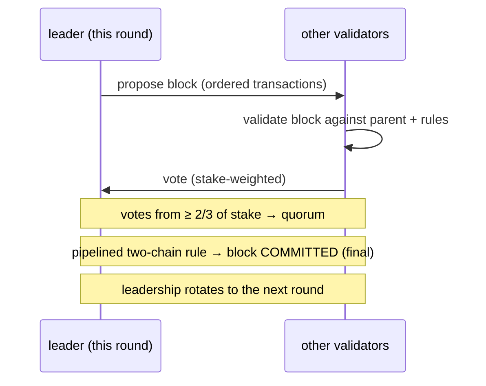
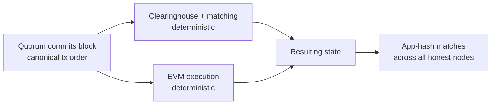

# 共识 (MetaFluxBFT)

:::info
**已上线。** MetaFluxBFT 是保护 MetaFlux L1 的生产级共识引擎。它将每一笔交易 —— 下单、撤单、清算、转账、EVM 调用 —— 排成唯一的规范链，具备确定性的即时终局性。
:::

## 摘要

**MetaFluxBFT** 是 MetaFlux 的拜占庭容错（BFT）权益证明共识引擎。一组按权益加权的验证者逐区块就每一笔交易的唯一规范顺序达成一致。区块一旦被法定人数提交即**立刻终局** —— 没有概率性确认，无需"等待 N 个区块"，也没有重组。这种即时、全序的排序正是 MetaFlux 能够运行完全链上订单簿与清算所的原因：每一次撮合、成交、资金费支付和清算，都针对全网已经达成一致的订单进行结算。

## 交易所为何需要它

只有当所有人以相同的顺序看到相同的订单簿时，交易场所才是公平的。MetaFluxBFT 提供两个对交易者和构建者直接相关的属性：

| 属性 | 对你意味着什么 |
|------|------------------------|
| **全序排序** | 每一笔交易在序列中都有唯一被一致认可的位置。撮合引擎严格按该顺序处理订单 —— 不存在能绕过你重新排序的特权侧通道。 |
| **即时终局性** | 已提交的区块无法被回滚。成交或结算在提交的那一刻即完成 —— 你永远不必为重组的可能性而打折扣。 |

两者共同带来**抗抢跑（front-running-resistant）的撮合**与**即时结算**：保护链安全的同一条规范序列，正是订单簿用来撮合的序列。

## 设计渊源

MetaFluxBFT 是一套 **MetaFlux 原生（MTF-native）** 的实现，处于 **HotStuff / Jolteon** 流水线化 BFT 协议家族的学术谱系之中（该研究脉络也包括 DiemBFT）。该家族的特点是：

- **基于 leader** —— 每一轮由一名验证者提议下一个区块，其余验证者对其投票。
- **部分同步（partially synchronous）** —— 在任何时刻都保持*安全性*（绝不产生互相冲突的已终局历史），并在网络能够及时传递消息后取得*进展*。
- **两链提交（two-chain commit）** —— 终局性通过一条简短的、流水线化的投票链达成，而非单一的全有或全无的轮次，从而在保持 BFT 安全性的同时维持低确认延迟。

MetaFlux 在这些公开的研究基础上构建自己的引擎，而非 fork 现有代码库，使协议得以针对链上交易所的需求进行调优（确定性执行、集成 EVM、由权益派生的验证者集合）。

## 验证者与质押

验证者集合直接由**链上权益**派生 —— MetaFluxBFT 是权益证明协议。任何满足权益要求的人都可以运行验证者；委托人用 MTF 支持验证者（见[质押](./staking.md)）。

- **按权益加权投票。** 验证者对共识的影响力与支持它的权益成正比，而非每个节点一票。
- **法定人数 = 三分之二权益。** 只有当代表**至少三分之二总质押投票权**的验证者为某区块投票时，该区块才会被提交。这个三分之二的法定人数是 BFT 保证的核心。
- **leader 轮换。** 提议权在验证者集合中轮换，因此没有任何单一验证者控制出块。

### 纪元（Epoch）

验证者集合在一个**纪元（epoch）**内固定，只能在纪元边界处变更。在一个纪元的持续期间保持集合稳定，使共识具有确定性和可预测性，同时仍允许集合随着权益变动、验证者加入或退出而逐步演化。当纪元翻转时，协议在下一个纪元采用新的、由权益派生的集合。

## 安全性与活性

两个保证定义了 MetaFluxBFT 在经典 BFT 意义上的承诺：

:::tip 安全性（Safety）
**只要超过三分之二的质押投票权是诚实的，链就绝不会终局两段互相冲突的历史。** 等价地说，MetaFluxBFT 容忍至多**三分之一**的投票权为拜占庭（任意故障）而绝不会提交冲突区块。即便网络缓慢或消息延迟，安全性依然成立。
:::

:::tip 活性（Liveness）
**链持续取得进展** —— 提交新区块 —— 只要网络足够同步、能够及时传递消息。由于 leader 轮换，单个停滞或无响应的 leader 无法使链停摆：协议会推进 leadership 并继续运行。
:::

这是部分同步 BFT 中的标准划分：*始终安全*，*在同步下保持活性*。

## 终局性与确定性执行

MetaFluxBFT 的终局性是**即时且绝对**的。法定人数提交某区块的那一刻，该区块 —— 及其所承载的精确交易顺序 —— 即为永久。没有概率性的沉淀期，也没有重组风险。

执行在该已提交顺序之上分层进行，并且是**完全确定性**的：

1. 共识固定区块中交易的规范顺序。
2. 每个节点对该顺序运行**相同的**状态转换 —— 交易部分由清算所与撮合引擎处理，智能合约交易由 EVM 处理。
3. 由于输入（已排序交易）和转换函数完全相同，每个诚实节点都会独立得出**完全相同的结果状态**。

节点通过比对结果状态的一个紧凑指纹（"app-hash"）来确认彼此一致。相同的排序加上确定性执行，意味着每个诚实节点的 app-hash 都匹配 —— 全网在不信任任何单一节点计算的前提下保持精确一致。

## 问责（Accountability）

验证者对其参与方式承担经济责任。**可被证明地作恶**的验证者会被**监禁（jailed，从活跃参与中移除）**并被**罚没（slashed，损失一部分权益）**。持续不可用同样可能导致监禁。这把验证者的经济地位与诚实运营绑定，用真实的在险权益为共识保证背书。委托人应权衡验证者的运营记录；关于罚没与监禁如何传导至委托权益，见[质押](./staking.md)。

## 整体如何衔接

MetaFluxBFT 是协议其余部分赖以立足的基础：

- **订单簿与清算所**针对唯一的规范顺序撮合与结算 —— 这正是链上撮合公平的原因。
- **清算**与**资金费**在该顺序中由共识派生的位点上施加，因此每个节点的清算与资金费计算完全一致。
- **EVM 侧链**同样在已提交顺序上执行，共享同一终局性。
- **质押**与**治理**反馈进共识：权益决定验证者集合，而治理设定的参数本身也通过链提交。

## 另见

- [质押](./staking.md) —— 委托 MTF、支持验证者、赚取奖励，以及保护共识的罚没/监禁规则
- [标记价格](./mark-prices.md) —— 推动保证金与清算的共识派生价格
- [分级清算](./tiered-liquidation.md) —— 清算如何在已提交顺序上施加
- [EVM 执行模型](../evm/execution-model.md) —— EVM 如何在已提交区块顺序上执行

## 常见问题

展开常见问题

**问：我应该等待多少个确认？**
答：无需等待。终局性是即时的 —— 区块一旦提交即为终局，无法被重组。成交在其区块提交的那一刻即结算。

**问：链能回滚一笔交易吗？**
答：不能。没有重组。已提交的历史是永久的。

**问：如果当前 leader 掉线会怎样？**
答：leadership 轮换。停滞的 leader 无法使链停摆；只要网络在及时传递消息，协议就会推进 leadership 并继续提交区块。

**问：网络能容忍多少故障权益？**
答：至多三分之一的总质押投票权可以是拜占庭的，而链绝不会终局冲突历史。安全性要求超过三分之二的投票权是诚实的。

**问：这是工作量证明吗？**
答：不是。MetaFluxBFT 是权益证明 —— 验证者集合与投票权由链上 MTF 权益派生，而非来自挖矿。

