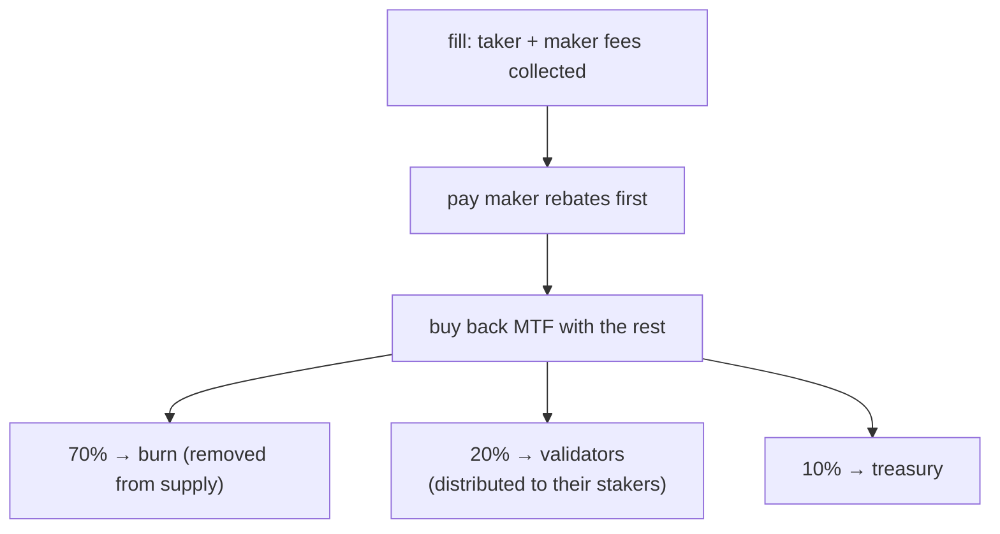

# 手续费

:::info
**概念说明页。** 本页介绍每笔成交的手续费计算方式、构建者与推荐人的费用分成、现货及清算手续费，以及所收手续费的去向。具体费率（按交易量分层的手续费档位、挂单返佣档位及质押折扣档位）请参阅[费率表](./fee-schedule.md)。手续费参数均为网络参数，可通过治理流程更新。
:::

## 简要概览

每笔成交均收取挂单方和吃单方手续费，具体费率依据[费率表](./fee-schedule.md)确定。构建者分成可将部分手续费转给订单流来源方，推荐人分成可将部分吃单手续费转给推荐人。扣除挂单返佣后，协议将剩余手续费收入用于**回购 MTF**，再将回购所得 MTF 按 **70% 销毁 / 20% 验证者 / 10% 国库**的比例分配。手续费在成交时从账户余额中扣除，并显示在 [`userFills`](../api/rest/info.md#user_fills) 中。

## 手续费计算方式

手续费在整 USDC 精度平面上结算：名义价值为价格乘以数量的乘积，向零截断。

### 单笔成交

```text
notional    = |price × size|
taker_fee   = notional × taker_rate
maker_fee   = notional × maker_rate
builder_fee = notional × builder_rate    # additive, taker-only, capped
```

吃单费率和挂单费率来自您在[费率表](./fee-schedule.md)中所属的档位：包括基于 30 日交易量的基础费率、基于挂单量占比的额外挂单返佣，以及基于 MTF 质押量的吃单折扣。有效挂单费率为负值时，代表协议**向**挂单方支付返佣，资金来源于同一订单流收取的吃单手续费——协议的支出不会超过其收入。

每笔成交的手续费记录在 [`userFills`](../api/rest/info.md#user_fills) 的每条记录中，字段为 `fee`（USDC 基本单位；正值 = 已支付，负值 = 已收到返佣）。

## 构建者分成

订单流来源方可通过在订单上设置构建者地址来获得部分吃单手续费。每笔成交时，分成直接支付至该地址。常见使用场景：

- 负责导流的前端界面或聚合器，
- 捆绑执行功能的行情数据 API，
- 代为下达保护性订单的自动化风控服务。

构建者必须是已注册地址（参见 [`approve_builder_fee`](../api/rest/exchange.md#approve_builder_fee)）。未注册的构建者将被静默忽略。构建者分成为附加费用，仅适用于吃单方，并设有单笔订单上限，不影响挂单方。

## 推荐人分成

当账户设置了推荐人后，其**吃单手续费**中的一部分将**优先**转给推荐人，再分配剩余部分——该分成从协议收入中扣除，而非额外向吃单方收费。挂单手续费不设推荐人分成。

推荐关系为单层结构（不支持多级链式推荐，防止类庞氏结构）。推荐人通过 [`set_referrer`](../api/rest/exchange.md#set_referrer) 设置一次后不可更改；不允许将自身设为推荐人。

构建者分成与推荐人分成可同时适用于同一笔成交，两者独立结算。

## 手续费去向

所收手续费流经统一的价值积累通道：



1. **优先支付挂单返佣。** 净挂单费率为负值时（参见[费率表](./fee-schedule.md)），返佣从同一订单流收取的手续费中结算。
2. **剩余部分用于回购 MTF。** 扣除返佣后的全部手续费收入，将按协议标记价格市价回购 MTF。这形成购买压力，并在分配前将手续费收入转化为 MTF。
3. **回购所得 MTF 按 70 / 20 / 10 分配：**
   - **70% 销毁**——永久移出流通（通缩机制）。
   - **20% 分配给验证者**，由验证者发放给其质押者。这是**质押分红**——手续费收入通过验证者份额流向质押者。
   - **10% 归入国库**（同时吸收舍入余量，确保分配无泄漏）。

累计池总量（已回购销毁的 MTF、验证者池、国库）记录在提交状态中，可通过读取路径 [`protocol_metrics`](../api/rest/info.md#protocol_metrics) 查询：

```bash
curl -X POST https://devnet-gateway.mtf.exchange/info -d '{"type":"protocol_metrics"}'
```

质押分红通过验证者份额发放，质押更多 MTF（或委托给验证者）可获得更大份额——详见[质押](./staking.md)。

## 现货手续费

现货成交同样适用挂单/吃单费率结构，但现货手续费从**独立于永续合约的手续费账户**中扣除，且从**各方实际收到的币种**中收取，而非始终从报价余额中扣除：

- **吃单方**手续费从吃单方收到的币种中扣除，
- **挂单方**手续费从挂单方收到的币种中扣除。

因此，现货**买方**（收到基础资产）以**基础资产**支付手续费，**卖方**（收到报价资产）以**报价资产**支付手续费。每个现货交易对可设置独立的挂单/吃单费率；若未设置，则沿用全局现货默认费率。请参阅 [`/info fee_schedule`](../api/rest/info.md#fee_schedule) 响应中的现货档位，以及[现货交易](../products/spot.md#matching-fills-and-fees)中的结算模型说明。

## 清算成交手续费

清算平仓通过上述标准吃单手续费通道处理。独立清算费——一项额外收费，在保险池与国库之间分配，用于维持保险池偿付能力并补偿吸收强制订单流的挂单方——是尚未激活的设计意图。待其上线后，被清算账户将在平仓结算的亏损中支付该费用，并在 [`userFills`](../api/rest/info.md#user_fills) 的清算成交记录中标注。清算平仓机制详见[分层清算](./tiered-liquidation.md)。

## 查询接口

```bash
# tier overview (MTF-native — gateway default path; running the node yourself: localhost:8080)
curl -X POST https://devnet-gateway.mtf.exchange/info -d '{"type":"fee_schedule"}'

# your personal tier and recent volume — MTF-native (gateway default path)
curl -X POST https://devnet-gateway.mtf.exchange/info \
  -d '{"type":"user_fees","address":"0x<addr>"}'

# or the HL-compat shape under /hl on the gateway
curl -X POST https://devnet-gateway.mtf.exchange/hl/info \
  -d '{"type":"userFees","user":"0x<addr>"}'
```

## 边界情形

<details>
<summary>展开边界情形</summary>

- **子账户的交易量汇总。** 主账户及其所有子账户共享同一交易量档位。在同一主账户下运行多策略的团队可享受汇总后的档位。
- **档位评估频率。** 档位基于当前 30 日滚动窗口持续评估，无周期性快照。推动您进入新档位的成交将从下一笔成交起生效。
- **构建者分成 ≠ 推荐人分成。** 两者可同时作用于同一笔成交——账户设有推荐人，且该笔订单指定了构建者，两条分成路径独立结算。
- **负费率挂单档位。** 当净挂单费率低于零时，挂单方从同一订单流（及同一区块内所有成交）收取的吃单手续费中获得返佣；协议的支出不会超过其收入。

</details>

## 另请参阅

- [费率表](./fee-schedule.md) — 费率卡：交易量手续费档位、挂单返佣档位、质押折扣档位，以及三者的组合方式
- [质押](./staking.md) — 质押 MTF 以获得验证者份额分红及吃单折扣
- [`POST /info fee_schedule`](../api/rest/info.md#fee_schedule)
- [`POST /info user_fees`](../api/rest/info.md#user_fees) — MTF 原生接口：每用户档位 / 30 日交易量
- [`POST /info protocol_metrics`](../api/rest/info.md#protocol_metrics) — 累计手续费池（销毁 / 国库 / 验证者）
- [`POST /info userFees`](../api/rest/hl-compat.md#userfees) — HL 兼容接口
- [分层清算](./tiered-liquidation.md) — 清算机制说明

## 常见问题

<details>
<summary>展开常见问题</summary>

**问：手续费是按成交次数还是按订单收取？**
答：按成交次数。部分成交的订单在每次成交时按已成交数量比例计算手续费。

**问：手续费以 USDC 还是 MTF 支付？**
答：以成交币种支付（永续合约为 USDC；现货为实际收到的币种）。协议随后将手续费收入用于回购 MTF，并以回购所得的 MTF 进行销毁和分配。

**问：是否有最低手续费下限？**
答：没有下限。极小额成交对应的手续费不足一分（显示时向下取整，内部以完整精度计算）。

**问：TWAP 的每个切片都收取吃单费吗？**
答：是的——每个切片均以协议自主裁量的 IOC 方式执行。TWAP 总手续费 = 各切片手续费之和。

**问：构建者分成可以为零吗？**
答：可以。若订单未设置构建者，则不分配任何分成；完整的协议份额流入回购与分配通道。

**问：质押者如何从手续费中获益？**
答：通过验证者份额获益。回购完成后，20% 的回购 MTF 分配给验证者，再由验证者发放给其质押者——因此质押（或委托）可获得一部分手续费收入。详见[质押](./staking.md)。

</details>
</content>
