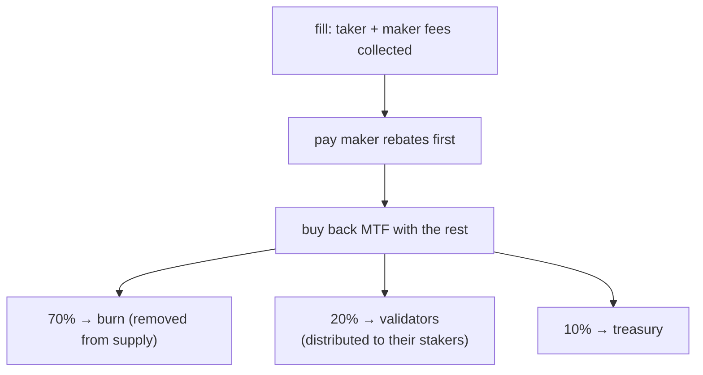

# 手续费

:::info
**概念页。** 本页解释单笔成交的交易手续费如何计算、建筑者与推荐人返利、现货与清算手续费，以及收取的手续费流向何处。实际费率 —— 交易量费率分级、制造者返利分级和质押折扣分级 —— 见[费率表](./fee-schedule.md)。手续费数值是网络参数，可通过治理更新。
:::

## TL;DR

每笔成交都收取一笔制造者手续费和一笔接收者手续费，由[费率表](./fee-schedule.md)设定。建筑者返利可将一部分路由给订单流来源方，推荐人返利可将接收者手续费的一部分路由给推荐人。在支付制造者返利后，协议用剩余的手续费收入**回购 MTF**，然后将回购的 MTF 按 **70% 销毁 / 20% 验证者 / 10% 财政库**分割。手续费在成交时从你的余额扣除，并在 [`userFills`](../api/rest/info.md#user_fills) 中显示。

## 手续费如何计算

手续费在整数 USDC 平面上结算：名义价值是价格乘以规模的乘积，向零截断。

### 每笔成交

```text
notional    = |price × size|
taker_fee   = notional × taker_rate
maker_fee   = notional × maker_rate
builder_fee = notional × builder_rate    # additive, taker-only, capped
```

接收者与制造者费率来自你在[费率表](./fee-schedule.md)上的分级：来自 30 天交易量的基础费率、来自制造者交易量份额的额外制造者返利，以及来自你质押多少 MTF 的接收者折扣。负的有效制造者费率是支付**给**制造者的返利，由同一笔流上收取的接收者手续费资助 —— 协议永远不会支付超过其收取的金额。

每笔成交的手续费在每个 [`userFills`](../api/rest/info.md#user_fills) 条目中显示为 `fee`（USDC 基础单位；正数 = 已支付，负数 = 收到的返利）。

## 建筑者返利

订单流来源方可以通过在订单上设置建筑者地址来声明一份接收者手续费的份额。该返利在每次成交时支付给该地址。典型用途：

- 路由该流的前端或聚合器，
- 捆绑执行的市场数据 API，
- 放置保护性订单的自动风控服务。

建筑者必须是注册地址（见 [`approve_builder_fee`](../api/rest/exchange.md#approve_builder_fee)）。未注册的建筑者会被无声地丢弃。建筑者返利是叠加的，且仅作用于接收者方，带有每订单上限；它不改变制造者方。

## 推荐人返利

当一个账户设置了推荐人时，其**接收者手续费**的一份在其余部分分配**之前**被路由给推荐人 —— 它来自协议的所得，而不是对接收者的额外收费。制造者手续费不携带推荐人返利。

推荐为单层（无多层链 —— 反庞氏）。推荐人通过 [`set_referrer`](../api/rest/exchange.md#set_referrer) 设置一次，此后不可变；将自己设置为自己的推荐人会被拒绝。

建筑者返利和推荐人返利可以同时适用于同一笔成交 —— 它们各自独立支付。

## 手续费流向何处

收取的手续费流经一条价值累积管线：



1. **制造者返利首先支付。** 负的净制造者费率（见[费率表](./fee-schedule.md)）由同一笔流上收取的手续费结算。
2. **其余部分回购 MTF。** 支付返利后剩下的所有手续费收入用于在协议标记价处市场买入 MTF。这产生买盘压力，并在分配前将手续费收入转换为 MTF。
3. **回购的 MTF 按 70 / 20 / 10 分割：**
   - **70% 被销毁** —— 永久退出流通（通货紧缩）。
   - **20% 归验证者**，由其分配给其质押者。这是**质押者分红** —— 手续费收入经由验证者的份额抵达质押者。
   - **10% 归财政库**（并吸收舍入尘埃，使分割无泄漏）。

累积的池总额（回购并销毁的 MTF、验证者池、财政库）在承诺状态中追踪，并通过 [`protocol_metrics`](../api/rest/info.md#protocol_metrics) 在读取路径上公开：

```bash
curl -X POST https://devnet-gateway.mtf.exchange/info -d '{"type":"protocol_metrics"}'
```

由于质押者分红通过验证者份额交付，质押更多的 MTF（或委托给验证者）以获得更大的份额 —— 见[质押](./staking.md)。

## 现货手续费

相同的制造者/接收者形状适用于现货成交，但现货手续费在与永续**分离的费用账户**上收取，且它们从**各方所接收的腿**上扣除 —— 不总是从报价余额：

- **接收者**手续费从接收者所接收的腿上扣除，
- **制造者**手续费从制造者所接收的腿上扣除。

因此现货**买方**（接收基础资产）以**基础资产**支付其手续费，**卖方**（接收报价）以**报价**支付其手续费。每个现货对可设置自己的制造者/接收者费率；当一对未设置它们时，全局现货默认值适用。参见 [`/info fee_schedule`](../api/rest/info.md#fee_schedule) 响应中的现货分级，以及[现货交易](./spot-trading.md#matching-fills-and-fees)了解结算模型。

## 清算成交上的手续费

清算平仓通过上面描述的标准接收者手续费路径走。一笔离散的清算手续费 —— 在保险池和财政库之间分割的额外收费，用于保持保险偿付能力并补偿吸收强制流的制造者 —— 是一项尚未激活的设计意图。当它上线时，被清算的账户将作为平仓时结算的损失的一部分支付它，并在 [`userFills`](../api/rest/info.md#user_fills) 中的清算成交上标记。平仓机制见[分级清算](./tiered-liquidation.md)。

## 查询

```bash
# tier overview (MTF-native — gateway default path; running the node yourself: localhost:8080)
curl -X POST https://devnet-gateway.mtf.exchange/info -d '{"type":"fee_schedule"}'

# your personal tier and recent volume — MTF-native (gateway default path)
curl -X POST https://devnet-gateway.mtf.exchange/info \
  -d '{"type":"user_fees","address":"0x<addr>"}'

# or the HL-compat shape under /hl on the gateway
curl -X POST https://devnet-gateway.mtf.exchange/hl/info \
  -d '{"type":"userFees","user":"0x<addr>"}'
```

## 边界情况

<details>
<summary>显示边界情况</summary>

- **跨子账户的交易量。** 一个主账户和它所有的子账户共享一个交易量分级。一个在一个主账户下运行许多策略的交易台获得聚合分级。
- **分级评估频率。** 分级在当前 30 天窗口上持续重新评估 —— 没有定期快照。一笔将你推入新分级的交易在下次成交时适用。
- **建筑者返利 ≠ 推荐人返利。** 两者都可以适用于同一笔成交 —— 用户的账户有推荐人，且该成交的订单指定了建筑者。两条路线各自独立支付。
- **负费用制造者分级。** 当净制造者费率低于零时，制造者从同一笔流上收取的接收者手续费中获得报酬（并跨同一区块内的所有成交）；协议永远不会支付超过其收取的金额。

</details>

## 另见

- [费率表](./fee-schedule.md) —— 费率卡：交易量费率分级、制造者返利分级和质押折扣分级，以及三者如何组合
- [质押](./staking.md) —— 质押 MTF 以获取验证者份额分红和接收者折扣
- [`POST /info fee_schedule`](../api/rest/info.md#fee_schedule)
- [`POST /info user_fees`](../api/rest/info.md#user_fees) —— MTF 原生的每用户分级 / 30 天交易量
- [`POST /info protocol_metrics`](../api/rest/info.md#protocol_metrics) —— 累积手续费池（销毁 / 财政库 / 验证者）
- [`POST /info userFees`](../api/rest/hl-compat.md#userfees) —— HL-compat
- [分级清算](./tiered-liquidation.md) —— 清算机制

## 常见问题

<details>
<summary>显示常见问题</summary>

**问：手续费是按每笔成交还是每个订单应用的？**
答：按每笔成交。部分成交的订单在每次成交事件时按成交规模比例累积手续费。

**问：手续费以 USDC 还是 MTF 支付？**
答：你以成交货币支付（永续为 USDC；现货为所接收的腿）。协议随后用手续费收入回购 MTF，被销毁和分配的正是回购的 MTF。

**问：是否存在最小费用下限？**
答：无下限。一笔微小的成交会计算出不足一分的手续费（在显示上向下舍入，在内部以完整精度收取）。

**问：TWAP 切片是否各自支付接收者手续费？**
答：是的 —— 每个切片是协议自由裁量下的 IOC。总 TWAP 手续费 = 各切片手续费之和。

**问：建筑者返利可以为零吗？**
答：可以。如果你没有在订单上设置建筑者，就不会分配返利；完整的协议份额流入回购并分配管线。

**问：质押者如何从手续费中获益？**
答：通过验证者份额。回购后，回购的 MTF 的 20% 归验证者，由其分配给其质押者 —— 因此质押（或委托）让你赚取一份手续费收入。见[质押](./staking.md)。

</details>
</content>
