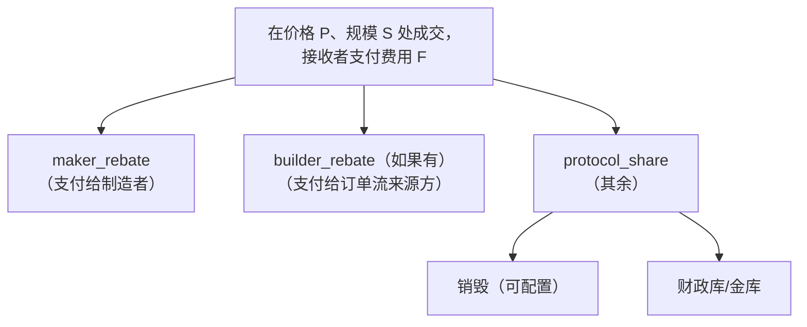

# 手续费

:::info
**状态。** **稳定** 的形状；分级值是网络参数，可通过治理更新。
:::

## TL;DR

按成交量分级的制造者/接收者的单笔成交费。建筑者返利将一部分路由给订单流来源方。接收者收入的可配置比例被销毁。费用在成交时从 USDC 余额扣除，并在 [`userFills`](../api/rest/info.md#user_fills) 中显示。

## 分级表（默认 — 查看实时值）

:::warning
**目标 vs. 实时。** 下面的分级计划是**目标**设计。实时结算路径目前收费为**单一全局分级** — `default_taker_bps =
5`, `default_maker_bps = 1` (`GlobalFeeSchedule::default`)。每个用户 30 天交易量分级存在为 `FeeTracker` 累加器，但**尚未连接**到费用收取。将该阶梯视为路线图，而非当前费率。
:::

```bash
curl -X POST https://devnet-gateway.mtf.exchange/info -d '{"type":"fee_schedule"}'
```

| 30 天交易量 | 制造者 | 接收者 |
|---------------|------:|------:|
| `< 100k`     | 2.0 bps | 5.0 bps |
| `100k – 1M`  | 1.5 bps | 4.5 bps |
| `1M – 10M`   | 1.0 bps | 4.0 bps |
| `10M – 100M` | 0.5 bps | 3.5 bps |
| `100M – 1B`  | 0.0 bps | 3.0 bps |
| `> 1B`       | −0.5 bps | 2.5 bps |

Bps = 基点（1 bps = 0.01%）。负的制造者 = 制造者返利。

交易量以 USDC 名义价值计量，跨所有市场、跨所有子账户求和。交易量在 30 天窗口上滚动前进。

## 手续费流向



## 如何计算手续费

> 费用在**整数 USDC `Decimal` 平面**上结算（名义价值 = 原始 `px × size` 整数乘积），向零截断。

### 每笔成交

```
notional    = |px × qty|                         # raw scale-0 Decimal 乘积
taker_fee   = trunc( notional × taker_bps / 10_000 )      # fee_amount()
maker_fee   = trunc( notional × maker_bps / 10_000 )
builder_fee = trunc( notional × builder_bps / 10_000 )    # ADDITIVE, taker-only, ≤ 8 bps
```

默认值（`GlobalFeeSchedule::default`）：`default_taker_bps = 5`, `default_maker_bps = 1`。（每个用户 30 天交易量分级存在为追踪器，但结算路径目前收费为单一全局分级 — 下面的分级表是*目标*计划。）

### 基础费用分配

**接收者**费用首先分割推荐人分享，然后分割剩余部分。**制造者**费用进行批发分割（无推荐人、无建筑者）：

```
# 接收者费用：
referrer_share = trunc( taker_fee × 1_000 / 10_000 )   # = 接收者费用的 10%（REFERRER_BPS = 1000），仅当设置了推荐人时
protocol_fee   = taker_fee − referrer_share
# protocol_fee（和整个 maker_fee）分割为 80/10/10：
burn      = trunc( protocol_fee × 8_000 / 10_000 )     # 80%  → 回购和销毁
validator = trunc( protocol_fee × 1_000 / 10_000 )     # 10%  → 验证者（按权重）
treasury  = protocol_fee − burn − validator            # 10%  → 基金会/财政库（吸收截断尘埃，无泄漏）
# mflux_vault 份额 = 0（修订于 2026-05-28）
```

| 符号 | 默认 | 备注 |
|--------|---------|-------|
| `default_taker_bps` | `5` (5 bps) | `GlobalFeeSchedule` |
| `default_maker_bps` | `1` (1 bps) | `GlobalFeeSchedule` |
| 推荐人份额 | **接收者费用的 10%** (`REFERRER_BPS = 1000`) | — |
| `burn_bps` | `8_000` (80 %) | 已修订 |
| `validator_bps` | `1_000` (10 %) | — |
| `treasury_bps` | `1_000` (10 %) | — |
| `mflux_vault_bps` | `0` | 金库费用份额归零 |
| `BUILDER_FEE_MAX_BPS` | `8` | vs HL 的 10 |
| 部署者费用上限 | `5` 默认（`MAX_DEPLOYER_FEE_CAP_BPS = 20`） | — |

> ⚠️ **之前文本的更正。** (1) 推荐人份额是**接收者费用的 10%** (`REFERRER_BPS = 1000` bps-of-fee)，**不是** `1 bps × 名义价值`。(2) 协议分割是 **80 / 10 / 10**（销毁 / 验证者 / 财政库），**不是** 通用"协议"池上的 `burn_ratio = 0.30`，也**不是**历史上的 `50/25/15/10`。80% 是一次**回购和销毁**（累积 USDC 市场买入 MTF 然后销毁 — 买盘压力 + 通货紧缩），而不是直接 USDC 销毁。(3) MFlux 金库费用份额是 **0**。(4) 默认接收者/制造者为单一分级时的 `5 / 1` bps。

### 销毁 = 回购和销毁

80% "销毁"份额作为 USDC 累积；一个定期回购执行器清空池，在确定性标记处市场买入 MTF，并销毁获得的 MTF（`fee_distribution.burned` USDC 池 → `burned_mtf`）。它**不是**直接 USDC 销毁或抽象供应减少。

## 建筑者返利

交易发起方可以通过在其订单上设置 `builder: 0x<builder_addr>` 来声明一份（作为可选的 `params.builder` 在 `Order` 上传递）来声明份额。返利在每次成交时支付给该地址。

用例：
- 路由用户流的前端/聚合器。
- 捆绑执行的市场数据 API。
- 放置保护性支撑的自动风险服务。

建筑者必须是注册地址（参见 [`approve_builder_fee`](../api/rest/exchange.md#approve_builder_fee)；推荐人基元是 [`set_referrer`](../api/rest/exchange.md#set_referrer)）。未注册的建筑者会被无声地删除。

## 销毁（回购和销毁）

协议收入的 **80 %**（`burn_bps = 8_000`）用于回购和销毁 — 累积 USDC 市场买入 MTF，然后销毁。（之前的 `0.30` 比率已过时。）获得和销毁的 MTF 永久退出流通。

累积金额（`burned` USDC 池、`burned_mtf`、`treasury`、验证者池）在承诺状态中追踪，并通过 [`protocol_metrics`](../api/rest/info.md#protocol_metrics) (`fee_pools.{burned, burned_mtf, treasury, validator_pool, mflux_vault}`) 在读取路径上公开：

```bash
curl -X POST https://devnet-gateway.mtf.exchange/info -d '{"type":"protocol_metrics"}'
```

## 推荐人份额

当账户设置了`推荐人`时，**其接收者费用的 10%** (`REFERRER_BPS = 1000` bps-of-fee) 在 80/10/10 分割前切割给推荐人 — 它来自协议获得，不是对接收者的额外收费：

```
referrer_share = trunc( taker_fee × 1000 / 10000 )   # 接收者费用的 10%，不是名义价值
protocol_fee   = taker_fee − referrer_share          # 然后分割 80/10/10
```

单层（无多层推荐 — 反庞氏）。使用 `SetReferrer` 设置一次；此后不可变（`setReferrer(self)` 被拒绝）。制造者费用**没有**推荐人分割。

## 现货费用

相同的制造者/接收者分级形状适用于现货成交，但现货费用在**单独的费用账户**上收取（与永续分离），并从**各方接收的腿**上扣除 — 不总是从报价余额：

- **接收者**费用从接收者接收的腿上扣除，
- **制造者**费用从制造者接收的腿上扣除。

因此现货**买方**（接收基础资产）在**基础资产**中支付其费用，**卖方**（接收报价）在**报价**中支付其费用。每个现货对可设置自己的 `taker_fee_bps` / `maker_fee_bps`；当一对留下它们未设置时，全局现货默认值适用。参见 `/info fee_schedule` 响应中的 `fee_schedule.spot_tiers`，以及 [现货交易](./spot-trading.md#matching-fills-and-fees) 了解结算模型。

## 清算成交上的费用

> **实现待定 / 未验证。** 一个离散**清算费用**（下面描述的 `100 bps`、保险/财政库分割、`is_liquidation` 标志）**不是**当前实现的。清算平仓（T1/T2）目前通过与普通成交相同的 `charge_fees` 接收者路由。将下面的部分视为**设计意图**，而不是验证的参数 — 在引用数字之前根据实时行为确认。

预期的模型：清算成交在标准接收者费用之上收取清算费用，在保险池和财政库之间分割，以保持保险偿付能力并补偿吸收强制流的制造者。清算账户将其作为在 T1/T2 结算的损失的一部分支付，在 [`userFills`](../api/rest/info.md#user_fills) 中出现，带有 `is_liquidation: true`。

## 查询

```bash
# 分级概览（MTF 原生 — 网关默认路径；运行自己的节点：localhost:8080）
curl -X POST https://devnet-gateway.mtf.exchange/info -d '{"type":"fee_schedule"}'

# 你的个人分级和最近交易量 — MTF 原生（网关默认路径）
curl -X POST https://devnet-gateway.mtf.exchange/info \
  -d '{"type":"user_fees","address":"0x<addr>"}'

# 或网关上 /hl 下的 HL-compat 形状
curl -X POST https://devnet-gateway.mtf.exchange/hl/info \
  -d '{"type":"userFees","user":"0x<addr>"}'
```

每笔成交费用在每个 `userFills` 条目中显示为 `fee`（USDC 基础单位；正数 = 已支付，负数 = 收到的返利）。

## 实际工作示例

一个有 5000 万美元 30 天交易量的市场制造者：
- 分级：`10M – 100M` → 制造者 0.5 bps，接收者 3.5 bps。

一个 1 BTC × 100 美元成交，他们是制造者：
- notional = $100
- maker fee = $100 × 0.00005 = $0.005（由制造者支付；正数因为仍在具有正制造者费用的分级中）

一个有 5 亿美元 30 天交易量的市场制造者：
- 分级：`100M – 1B` → 制造者 0.0 bps，接收者 3.0 bps。
- 制造者费用为零；仅在接收者方向支付。

一个有 50 亿美元 30 天交易量的市场制造者：
- 分级：`> 1B` → 制造者 −0.5 bps，接收者 2.5 bps。
- 每个 100 美元制造者成交获得 0.005 美元。

## 边界情况

<details>
<summary>显示边界情况</summary>

- **跨子账户的交易量。** 一个主账户和它的所有子账户共享一个交易量分级。使用这个来扩展 — 在一个主账户下运行许多策略的交易台获得聚合分级。
- **分级评估频率。** 分级根据当前 30 天窗口在每个区块重新评估。无定期快照 — 一个将你推入新分级的 10 美元交易在下次成交时适用。
- **建筑者返利 ≠ 推荐人份额。** 两者都可以适用于同一成交：用户账户有推荐人，该成交的订单指定了建筑者。两条路线都独立支付。
- **负费用制造者分级。** 当 `maker_fee_bps < 0` 时，制造者从协议收入中获得报酬。这由同一成交上的接收者费用（以及同一区块内的所有成交）资助；协议永远不会支付超过获得的。

</details>

## 另见

- [`POST /info fee_schedule`](../api/rest/info.md#fee_schedule)
- [`POST /info user_fees`](../api/rest/info.md#user_fees) — MTF 原生的每用户分级 / 30 天交易量
- [`POST /info protocol_metrics`](../api/rest/info.md#protocol_metrics) — 累积费用池（销毁 / 财政库 / 验证者）
- [`POST /info userFees`](../api/rest/hl-compat.md#userfees) — HL-compat
- [分级清算](./tiered-liquidation.md) — 清算费用机制

## 常见问题

<details>
<summary>显示常见问题</summary>

**问：手续费是按每笔成交还是每个订单基础应用的？**
答：按每笔成交。部分成交的订单在每次成交事件时按成交规模比例累积费用。

**问：手续费以 USDC 还是 MTF 支付？**
答：USDC，从账户的 USDC 余额扣除。销毁部分单独以面额表示；协议在内部转换并在 MTF 中销毁。

**问：是否存在最小费用下限？**
答：无下限。一个在 10 万标记处的 0.00001 BTC 成交会计算一个小数分的费用（在显示上向下舍入，在内部以完整精度支付）。

**问：TWAP 切片是否各自支付接收者？**
答：是的 — 每个切片是协议自由裁量权下的 IOC。总 TWAP 费用 = 切片费用之和。

**问：建筑者返利可以为 0 吗？**
答：可以。如果你没有在订单上设置 `params.builder`，就不会分配返利；完整的协议份额落在销毁 + 财政库中。

</details>
