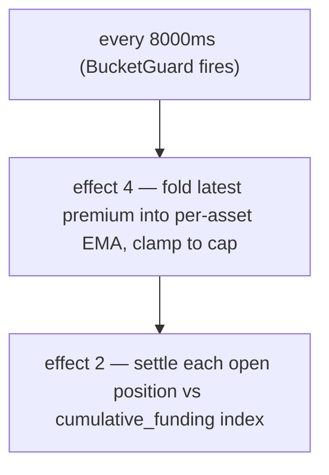

# 资金费率

:::tip
**稳定版。**
:::

## 概览

永续合约头寸每 **8 秒**在链上结算一次资金费用，费率与永续合约**相对预言机的溢价**成正比——溢价以深度加权的**冲击价格**衡量，而非单笔成交价——并叠加一个小额基准**利息**项。当永续合约价格高于预言机时，多头向空头支付资金费；低于预言机时，空头向多头支付。费率上限默认为每市场 **`±4%/小时`**，并以**预言机价格**作为结算基准。

## 为什么存在资金费

永续合约没有到期日，因此没有套利力量将其锚定到标的资产。资金费承担了这个职能：当永续价格漂移至高于现货时，多头付费，从而激励做空、抑制做多，直到永续价格回落。协议本身不参与任何一方——完全是用户之间的结算。

## 公式

> 上方概览是概念模型，以下数字为**已实现**的数值。如有出入，以代码为准；差异已在行内标注。

### 计算方式

资金费由溢价（冲击价格 − 预言机）的**确定性 EMA** 驱动，每 **8 秒**结算一次，而非按小时结算。上限为 **4%/小时**，而非 0.05%。

每个出块开头有两个效果运行资金费周期，各自受 8000 ms 的 `BucketGuard` 保护：

- **效果 4 `update_funding_rates`** — 将最新溢价样本折叠进每资产 EMA，然后截断。
- **效果 2 `distribute_funding`** — 将每个未平仓头寸与累计资金指数进行结算。

#### 0. 溢价基准——冲击价格（而非最新成交价）

每区块的**溢价样本**是永续合约**冲击价格**与预言机之间的差值：

```
premium = (impact_mid − oracle) / oracle
impact_mid = mid( impact_bid, impact_ask )
impact_bid/ask = VWAP of walking the committed book to fill a fixed notional (default ~$10k)
```

使用*冲击*价格——即以真实规模成交时的成交量加权价格——而非最新成交价或最优报价，意味着单笔成交或小单挂在离谱价位**无法**影响资金费率：必须真正移动深度才行。这与参考版永续合约设计一致。（旧版单市场模式改为采样 `premium = (mark − oracle)/oracle`；新建及迁移后的市场使用上述冲击价格基准。）

#### 1. 溢价指数 EMA（每市场）

溢价通过**确定性 EMA**（即*溢价指数*）进行平滑。累加器存储定点分数 `(num, denom)`——无浮点数，使用精确的 `rust_decimal::Decimal` 运算，确保各节点间状态位对齐。每个样本按如下方式折入：

```
num'   = num   * decay + sample
denom' = denom * decay + 1
value  = num / denom
```

- `sample` = 该资产的最新溢价 × 每资产 `funding_rate_multiplier`（默认 `1.0`；由动态风险引擎自动调整）。
- `decay = 0.5`（拟议默认值 → 在 5 秒采样节奏下半衰期约 7 秒）。更新时截断至 `[0, 1]`。
- 采样节奏：**5 秒**；EMA 折叠 + 结算节奏：**8000 ms**（`funding_update_guard` / `funding_distribute_guard`）。

> **状态：** 完整资金费循环已**全面上线**。每个 8 秒周期，费率驱动器从已提交状态中采样溢价（即上述每个永续市场的冲击价格与预言机之间的溢价，每市场一个样本），将其折叠进每资产溢价指数 EMA，推导费率（利息 + 截断），封顶后，结算推进累计资金指数，并在头寸持有者余额间转移 `size × Δindex`（零和：多头付给空头或空头付给多头，不铸造/销毁代币）——所有操作均基于已提交的市场状态，无需外部溢价数据源。经守恒性与确定性模糊测试，以及 4 节点端到端测试，验证了发散 → 溢价 → EMA → 指数 → 余额转移的完整流程。

#### 2. 从溢价指数推导费率（利息 + 截断）

资金费率**并非**原始溢价指数。平滑后的指数 `premium_idx` 与基准**利息**项通过每步截断结合：

```
interest = 0.0000125 / h        # = 0.01% / 8h — the baseline carry
clamp    = ±0.0005              # per-step bound

funding = premium_idx + clamp( interest − premium_idx, −clamp, +clamp )
```

当溢价指数较小时，资金费率漂移向 `interest` 基准；当溢价较大时，`premium_idx` 项主导，截断限制了利息每步拉回的幅度。`interest` 和 `clamp` 均可通过每资产治理覆盖。（旧版单市场模式改为直接将 EMA 值读作费率，不经利息/截断变换。）

#### 3. 外层上限

`funding` 最终截断至每小时上限：

```
cap_per_hour = 0.04          # 4 %/h default
funding = clamp(funding, −cap_per_hour, +cap_per_hour)
```

上限为每市场治理参数：当设置 `dynamic_risk_overrides[asset].funding_rate_cap` 时，将替换默认的 `0.04`。

#### 4. 支付计算（每头寸，每次结算）

资金费按市场计入累计指数（`clearinghouse.cumulative_funding`）；每个头寸记录其最后结算时的指数（`funding_entry`）。结算时：

```
payment = size_signed * oracle_px * (cum_global - funding_entry) * funding_rate_multiplier[asset]
funding_entry := cum_global      # roll forward
```

（运算逻辑已连接并锁定确定性；实际余额转移随完整 BOLE 结算落地。）

| 符号 | 含义 / 精度域 |
|--------|-----------------|
| `size_signed` | 带符号头寸大小；`i128`。多头 > 0，空头 < 0。 |
| `oracle_px` | 合成预言机价格——整数 USDC `Decimal` 精度域（见[标记价格](./mark-prices.md)）。 |
| `cum_global − funding_entry` | 自头寸上次结算以来该市场累计的资金费。 |
| `decay` | EMA 衰减系数 0.5。 |
| `cap_per_hour` | 默认 `0.04`（4%/小时）；可通过动态风险每市场覆盖。 |
| `funding_rate_multiplier` | 每资产乘数，默认 `1.0`，由动态风险自动调整。 |

`funding_rate`（EMA 值）带符号：正值 → 多头付给空头；负值 → 空头付给多头。

**基准利息：** `0.0000125/h`（= `0.01%/8h`）——溢价 EMA 叠加的基准持仓成本。

> ⚠️ **与旧版文档的差异。** 旧版文档描述为"每小时结算"、"60 分钟 EMA 窗口"和"上限 0.05%/小时"。实际实现为每 **8 秒**结算，EMA `decay` 为 **0.5**（半衰期约 7 秒），上限为 **4%/小时**。每小时的心理模型用于粗略估算持仓成本尚可，但链上节奏和上限以上述为准。

## 结算节奏

资金费每 **8 秒**结算一次（`funding_distribute_guard` 间隔），由共识推导的区块时间戳驱动——而非墙钟小时。头寸与累计资金指数结算，因此中途开仓的头寸只需支付开仓后的应计资金费（不存在"按小时快照"的节点）。



支付以余额调整方式结算——无链上成交，无手续费。在用户历史记录中以 `kind: "funding"` 显示。

## 预言机不可信时的门控机制

资金费**以预言机价格为基准结算**，因此协议不信任的价格不得驱动支付。每个周期，溢价样本会经过*门控*：当以下情况发生时，该样本被跳过（采样为 **0**）：

- 该市场**预言机缺失或 ≤ 0**，或
- **预言机数据过期**超过 `funding_oracle_staleness_ms`（默认 **60 秒**），或
- **订单簿过薄**，无法在买卖两侧均满足冲击名义价值（无法计算冲击价格）。

被跳过的样本以 0 折入，因此溢价指数 EMA **向 0 衰减**，资金费率逐渐消退，而非基于过期或可操控的基准结算。（另见[边界情况](#edge-cases)。）

:::info
**这就是为什么你可能看到标记价格与预言机差距很大而资金费率 ≈ 0。** 如果某市场的预言机数据源损坏或不被信任，资金费将被门控关闭并衰减至 0——即使[标记价格](./mark-prices.md#mark-vs-oracle--why-they-diverge)（由订单簿和外部永续合约构建）仍远离最后一个有效预言机价格。大幅价差伴随约 0 的资金费率，是协议*拒绝基于劣质预言机收取资金费*的表现，而非资金费 bug。
:::

## 示例演算

市场：BTC 永续合约，当前状态（预言机精度域，单位整数 USDC）：

```
mark         = 100.50
oracle       = 100.00
premium      = mark - oracle = 0.50
EMA(premium) settles toward 0.50 with decay 0.5 over a few 5s samples
funding cap  = 4% / hour (default)
```

假设 EMA 值在该时间段解析为资金费率 `+0.0005`（0.05%），远低于 4%/小时上限。账户持仓：

```
long 1 BTC      → pays funding
short 0.5 BTC   → receives funding
```

```
funding_rate = clamp(ema_value, -0.04, +0.04) = +0.0005   (not capped — far below 4%/h)

long 1 BTC:
  payment = +1   * oracle_px * Δcum  ≈ +1   * 100.00 * 0.0005 = +0.0500 USDC  (long pays)

short 0.5 BTC:
  payment = -0.5 * oracle_px * Δcum  ≈ -0.5 * 100.00 * 0.0005 = -0.0250 USDC  (short receives 0.0250)
```

（支付使用 `size_signed * oracle_px * (cum_global - funding_entry)`；此处 `Δcum` 为头寸上次结算以来累计的资金费。）每 8 秒结算一次，每次金额极小；上限仅在持续单边失衡时才发挥约束作用，此时 4%/小时为天花板。

## 资金费上限与动态限制

| 参数 | 默认值 | 来源 / 覆盖方式 |
|-----------|---------|-------------------|
| 资金费上限（每小时） | `0.04`（`4%/小时`） | `dynamic_risk_overrides[asset].funding_rate_cap`（治理投票） |
| EMA `decay` | `0.5`（半衰期约 7 秒） | 拟议值；校准可能调整为 0.3/0.7 |
| 采样节奏 | `5 秒` | 协议固定 |
| 结算 / 更新间隔 | `8000 ms` | `funding_distribute_guard` / `funding_update_guard` BucketGuards |
| 基准利息 | `0.0000125/h`（`0.01%/8h`） | 协议固定 |
| `funding_rate_multiplier` | `1.0` | 每资产，由动态风险自动调整 |

每资产 `funding_rate_multiplier` 是 MetaFlux 相比 HL 治理静态值的改进：它由动态风险引擎基于 30 天已实现波动率自动驱动，在溢价样本进入 EMA 之前进行缩放。

## 资金费历史记录

账户维度的历史记录可通过 [`POST /info userFills`](../api/rest/info.md) 或 [HL 兼容接口 `userFills`](../api/rest/hl-compat.md) 查询——资金费支付记录的 `kind` 字段为 `"funding"`，并标注相关资产。

市场维度的历史记录：

```bash
curl -X POST https://devnet-gateway.mtf.exchange/info \
  -H 'content-type: application/json' \
  -d '{"type":"funding_history","market_id":0}'
```

返回有序的 `(ts_ms, premium)` 样本环（见
[`funding_history`](../api/rest/info/perpetuals.md#funding_history)）：

```json
{
  "type": "funding_history",
  "data": {
    "market_id": 0,
    "samples": [
      { "ts_ms": 1700000000000, "premium": "0.0015" },
      { "ts_ms": 1700000008000, "premium": "-0.0007" }
    ]
  }
}
```

专用的 `fundingTicks` WebSocket 频道在 [WS 路线图](../api/ws/subscriptions.md#roadmap--not-yet-available)中；目前请轮询 [`funding_history`](../api/rest/info/perpetuals.md#funding_history)。

## 资金费不做什么

- **与手续费无关。** 资金费是用户之间的结算；手续费是向平台收取的挂单方/吃单方返佣。见[手续费](./fees.md)。
- **不对保证金计息。** USDC 余额不会因资金费而产生利息。资金费纯粹用于缩小标记价格与预言机的差距。
- **无法在长周期内预测。** 资金费率可能逐小时反转，请勿将其视为固定持仓成本建模。

## 边界情况

<details>
<summary>展开边界情况</summary>

- **头寸在周期中途开仓。** 不存在**按小时快照**——资金费累积至一个指数中，头寸只需支付自上次结算以来的指数变动。刚好在一次结算后开仓，当期几乎无需支付；不存在"是否在快照内"的断崖效应。
- **头寸在周期中途平仓。** 同理——头寸在平仓时结算截至当前的累计资金费；不存在任何方向的零头期舍入。
- **负费率情形。** 某市场永续合约价格持续低于预言机（空头向多头支付）时，`funding_rate` 在持续时期为负；多头获得资金费。
- **预言机过期 / 订单簿过薄。** 溢价样本门控为 0，费率向 0 衰减——见[门控机制](#gating-when-the-oracle-is-untrusted)。资金费不会基于不受信任的预言机结算。

</details>

## 另见

- [标记价格](./mark-prices.md) — `oracle` 的推导方式
- [分层清算](./tiered-liquidation.md) — 资金费支付会调整 `account_value`，进而影响 `health`
- [`fundingTicks` WebSocket 频道（路线图）](../api/ws/subscriptions.md#roadmap--not-yet-available)
- [手续费](./fees.md) — 与资金费相互独立

## 常见问题

<details>
<summary>展开常见问题</summary>

**问：资金费机制和中心化交易所一样吗？**
答：概念模型相同。大多数中心化交易所每 8 小时结算一次；MetaFlux 每 8 秒结算一次（`funding_distribute_guard` 间隔），因此单次支付金额极小，持仓成本也更加平稳。4%/小时的上限约束的是持续单边费率的极端情形。

**问：资金费会导致我被强制清算吗？**
答：有可能——资金费支付会减少 `account_value`。结算每 8 秒进行一次，金额极小（不存在大额小时扣款），但若费率持续单边且接近上限，`account_value` 仍会随时间缓慢流失，可能将你从 T0 档位推入 T1。若头寸较大且费率持续对你不利，请密切关注 `health`。

**问：资金费适用于现货头寸吗？**
答：不适用。资金费是永续合约专有机制，现货头寸不产生任何资金费。

**问：收到的资金费需要纳税吗？**
答：这不是协议层面的问题，请咨询所在司法管辖区的税务专业人士。

</details>
