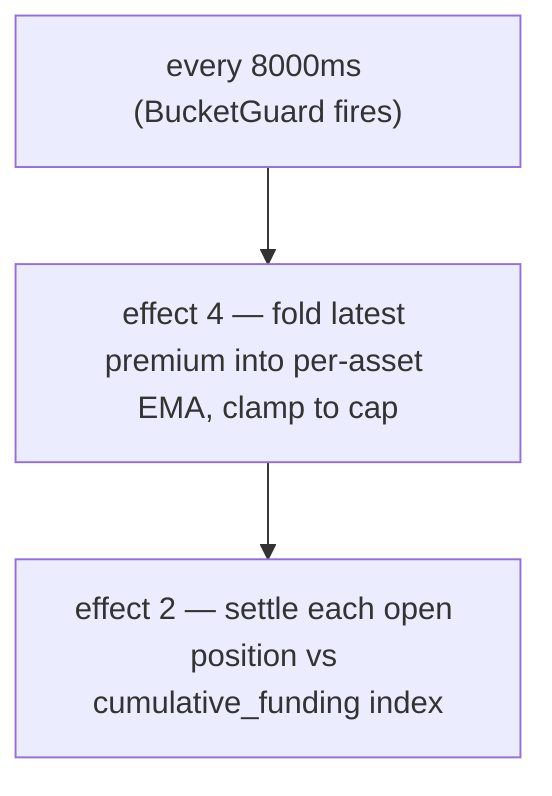

# 资金费率

:::tip
**稳定。**
:::

## 概览

永续头寸产生连续资金支付（链上每**8秒**结算一次），金额与永续合约相对预言机的**溢价**成正比——从深度加权的**冲击价格**衡量，而非单笔交易——加上一个小的基础**利息**项。当永续合约交易价格高于预言机时，多头向空头支付；当低于预言机时，空头向多头支付。结果被限制在每个市场默认值**±4% / 小时**，并针对**预言机**结算。

## 资金费率为什么存在

永续合约没有到期日期，所以没有套利力将其钉住于现货。资金费率发挥这个作用：当永续合约价格偏离现货价格时，多头支付会激励空头并抑制多头，直到永续合约价格下跌。协议从不站在任何一方——这是用户之间的交易。

## 公式

> 上面的概览是概念模型。下面的数字是**实现的**值。当文字和代码不一致时，代码优先；差异在内联处标出。

### 计算方式

资金费率由溢价（冲击价格 − 预言机）的**确定性EMA**驱动，每**8秒**结算一次，而非每小时。上限为**4% / 小时**，而非0.05%。

两个区块开始效应运行该周期，每个都在8000毫秒的`BucketGuard`后面：

- **效果4 `update_funding_rates`** — 将最新溢价样本折叠到每资产EMA中，然后夹紧。
- **效果2 `distribute_funding`** — 根据累积资金指数结算每个开放头寸。

#### 0. 溢价基础 — 冲击价格（而非最后交易）

每个区块的**溢价样本**是永续合约的**冲击价格**与预言机之间的差距：

```
premium = (impact_mid − oracle) / oracle
impact_mid = mid( impact_bid, impact_ask )
impact_bid/ask = VWAP of walking the committed book to fill a fixed notional (default ~$10k)
```

使用*冲击*价格——填充真实头寸的成交量加权价格——而非最后交易或最优报价，意味着单笔成交或出价离谱的单手订单**无法**移动资金费率：你必须移动真实深度。这镜像了参考永续设计。（遗留的每市场模式改为采样`premium = (mark − oracle)/oracle`；新市场和迁移的市场使用上面的冲击基础。）

#### 1. 溢价指数EMA（每市场）

溢价由**确定性EMA**平滑（*溢价指数*）。累加器存储固定点分数`(num, denom)` — 无浮点数，精确的`rust_decimal::Decimal`算术，使节点间状态按位相同。每个样本的折叠如下：

```
num'   = num   * decay + sample
denom' = denom * decay + 1
value  = num / denom
```

- `sample` = 资产的最新溢价 × 每资产`funding_rate_multiplier`（默认`1.0`；由动态风险引擎自动驱动）。
- `decay = 0.5`（建议默认 → ≈ 在5秒样本频率下半衰期约7秒）。在更新时夹紧到`[0, 1]`。
- 样本频率：**5秒**；EMA折叠+结算频率：**8000毫秒**（`funding_update_guard` / `funding_distribute_guard`）。

> **状态：** 完整的资金费率循环是**端到端实时的**。每个8秒周期，速率驱动程序从承诺状态采样溢价（上面的冲击对比预言机溢价，每个永续市场一个样本），将其折叠到每资产溢价指数EMA中，推导速率（利息+夹紧），限制它，然后结算推进累积资金指数并在头寸所有者的余额之间移动`size × Δindex`（零和：多头向空头支付或反之，无铸造/销毁）— 全部来自承诺市场状态，无外部溢价馈送器。保护性和确定性模糊测试，有4节点端到端验证发散 → 溢价 → EMA → 指数 → 余额转移。

#### 2. 从溢价指数得出的速率（利息+夹紧）

资金费率**不是**原始溢价指数。平滑指数`premium_idx`与基准**利息**项通过每步夹紧组合：

```
interest = 0.0000125 / h        # = 0.01% / 8h — baseline carry
clamp    = ±0.0005              # per-step bound

funding = premium_idx + clamp( interest − premium_idx, −clamp, +clamp )
```

当溢价指数很小时，资金费率向`interest`基准漂移；当溢价很大时，`premium_idx`项占主导地位，夹紧限制利息每步拉回的力度。`interest`和`clamp`都是每资产治理可覆盖的。（遗留的每市场模式改为直接读取EMA值作为速率，没有利息/夹紧变换。）

#### 3. 外部上限

`funding`最后夹紧到每小时上限：

```
cap_per_hour = 0.04          # 4 %/h default
funding = clamp(funding, −cap_per_hour, +cap_per_hour)
```

上限是每市场治理参数：`dynamic_risk_overrides[asset].funding_rate_cap`在设置时替换`0.04`默认值。

#### 4. 支付（每个头寸，每次结算）

资金费率累积到每市场的累积指数中（`clearinghouse.cumulative_funding`）；每个头寸携带其最后结算指数（`funding_entry`）。在结算时：

```
payment = size_signed * oracle_px * (cum_global - funding_entry) * funding_rate_multiplier[asset]
funding_entry := cum_global      # roll forward
```

（算术被接线和确定性锁定；实际余额转移与完整BOLE结算一起进行。）

| 符号 | 含义 / 平面 |
|--------|-----------------|
| `size_signed` | 有符号头寸大小；`i128`。多头 > 0，空头 < 0。 |
| `oracle_px` | 组合预言机价格 — 整个USDC`Decimal`平面（见[标记价格](./mark-prices.md)）。 |
| `cum_global − funding_entry` | 自该头寸最后结算以来该市场累积的资金费率。 |
| `decay` | EMA衰减0.5。 |
| `cap_per_hour` | 默认`0.04`（4%/小时）；每市场通过动态风险覆盖。 |
| `funding_rate_multiplier` | 每资产乘数，默认`1.0`，由动态风险自动驱动。 |

`funding_rate`（EMA值）有符号：正 → 多头向空头支付；负 → 空头向多头支付。

**基础利息：** `0.0000125/h`（= `0.01%/8h`）— 溢价EMA添加到的基准carry。

> ⚠️ **更正与之前的文本。** 旧文本说"每小时"、"60分钟EMA窗口"和"上限0.05%/小时"。实现每**8秒**结算一次，EMA`decay`是**0.5**（≈7秒半衰期），上限是**4%/小时**。每小时的心理模型对于粗略的carry数学很好，但链上的频率和上限如上所述。

## 支付频率

资金费率每**8秒**结算一次（`funding_distribute_guard`间隔），由共识衍生的区块时间戳驱动 — 不是挂钟小时。头寸根据累积资金指数结算，所以在间隔中间开设的头寸只为自开设以来的累积支付（无"小时快照"步骤）。



支付结算为余额调整 — 无链上交易，无费用。它们在用户历史中显示为`kind: "funding"`。

## 预言机不受信任时的门控

资金费率**针对预言机结算**，所以协议不信任的价格不能驱动支付。每个周期溢价样本是*门控的*：当以下情况时，它被跳过（采样为**0**）

- 市场的**预言机缺失或 ≤ 0**，或
- **预言机陈旧**超过`funding_oracle_staleness_ms`（默认**60秒**），或
- **订单簿太薄**无法在两侧填充冲击名义金额（没有冲击价格）。

跳过的样本折叠为0，所以溢价指数EMA**衰减到0**，资金费率逐渐消退而不是针对陈旧或可操纵的基础结算。（参见也[边界情况](#边界情况)。）

:::info
**这就是为什么你可以看到大的标记↔预言机差距而资金费率≈0。** 如果市场的预言机馈送被破坏或不受信任，资金费率被门控关闭并衰减到0 — 即使[标记](./mark-prices.md#mark-vs-oracle--why-they-diverge)（由订单簿和外部永续构建）距离最后良好的预言机很远。宽差距和~0资金费率是协议*拒绝对坏预言机收取资金费率*，不是资金费率bug。
:::

## 工作示例

市场：BTC永续合约，当前状态（预言机平面为整个USDC）：

```
mark         = 100.50
oracle       = 100.00
premium      = mark - oracle = 0.50
EMA(premium) settles toward 0.50 with decay 0.5 over a few 5s samples
funding cap  = 4% / hour (default)
```

假设EMA值对间隔解析为`+0.0005`（0.05%）的资金费率（远低于4%/小时上限）。账户头寸：

```
long 1 BTC      → pays funding
short 0.5 BTC   → receives funding
```

```
funding_rate = clamp(ema_value, -0.04, +0.04) = +0.0005   (not capped — far below 4%/h)

long 1 BTC:
  payment = +1   * oracle_px * Δcum  ≈ +1   * 100.00 * 0.0005 = +0.0500 USDC  (long pays)

short 0.5 BTC:
  payment = -0.5 * oracle_px * Δcum  ≈ -0.5 * 100.00 * 0.0005 = -0.0250 USDC  (short receives 0.0250)
```

（支付使用`size_signed * oracle_px * (cum_global - funding_entry)`；这里`Δcum`是自头寸最后结算以来累积的资金费率。）每8秒结算，每个间隔的幅度很小；上限仅对持续单边不平衡重要，其中4%/小时是上限。

## 资金费率上限和动态限制

| 参数 | 默认值 | 来源 / 覆盖 |
|-----------|---------|-------------------|
| 资金费率上限（每小时） | `0.04`（`4%/小时`） | `dynamic_risk_overrides[asset].funding_rate_cap`（治理投票） |
| EMA`decay` | `0.5`（≈7秒半衰期） | 建议；校准可能调整为0.3/0.7 |
| 样本频率 | `5秒` | 协议固定 |
| 结算 / 更新间隔 | `8000毫秒` | `funding_distribute_guard` / `funding_update_guard` BucketGuards |
| 基础利息 | `0.0000125/h`（`0.01%/8h`） | 协议固定 |
| `funding_rate_multiplier` | `1.0` | 每资产，由动态风险自动驱动 |

每资产`funding_rate_multiplier`是MetaFlux相对于HL治理静态值的差异：它由动态风险引擎根据30天实现波动率自动驱动，在溢价样本进入EMA之前缩放它。

## 资金费率历史

按账户历史通过[`POST /info userFills`](../api/rest/info.md)或[HL兼容`userFills`](../api/rest/hl-compat.md) — 资金支付出现在`kind: "funding"`和相关资产处。

按市场历史：

```bash
curl -X POST https://devnet-gateway.mtf.exchange/info \
  -H 'content-type: application/json' \
  -d '{"type":"funding_history","market_id":0}'
```

返回有序的`(ts_ms, premium)`样本环（参见[`funding_history`](../api/rest/info.md#funding_history)）：

```json
{
  "type": "funding_history",
  "data": {
    "market_id": 0,
    "samples": [
      { "ts_ms": 1700000000000, "premium": "0.0015" },
      { "ts_ms": 1700000008000, "premium": "-0.0007" }
    ]
  }
}
```

专用的`fundingTicks` WS通道在[WS路线图](../api/ws/subscriptions.md#roadmap--not-yet-available)上；同时轮询[`funding_history`](../api/rest/info.md#funding_history)。

## 资金费率不会做什么

- **与费用无关。** 资金费率是用户之间的；费用是做市商/接受者回扣给场所。参见[费用](./fees.md)。
- **对抵押品无利息。** USDC余额不会从资金费率累积利息。资金费率纯粹是关于缩小标记-预言机差距。
- **在长时间窗口上不可预测。** 资金费率可以在小时间翻转符号。不要把它建模为恒定carry。

## 边界情况

<details>
<summary>显示边界情况</summary>

- **头寸在间隔中间打开。** 没有**每小时快照** — 资金费率累积到累计指数中，头寸只为自上次结算以来的指数移动支付。在结算后不久打开，你对该周期的支付几乎为零；没有"在快照中/不在快照中"悬崖。
- **头寸在间隔中间关闭。** 同样 — 头寸在退出时结算其至今累积；任何一方都没有部分周期舍入。
- **负制度。** 永续合约持续低于预言机的市场（空头向多头支付）在持续期间看到`funding_rate`为负；多头接收资金费率。
- **预言机陈旧 / 订单簿薄。** 溢价样本被门控为0，速率衰减到0 — 参见[门控](#预言机不受信任时的门控)。资金费率不会针对不受信任的预言机结算。

</details>

## 另见

- [标记价格](./mark-prices.md) — 如何推导`oracle`
- [分级清算](./tiered-liquidation.md) — 资金支付调整`account_value`，其移动`health`
- [`fundingTicks` WS通道（路线图）](../api/ws/subscriptions.md#roadmap--not-yet-available)
- [费用](./fees.md) — 与资金费率分离

## 常见问题

<details>
<summary>显示常见问题</summary>

**问：资金费率与中心化交易所相同吗？**
答：同样的心理模型。大多数中心化交易所每8小时支付一次；MetaFlux每8秒结算一次（`funding_distribute_guard`间隔），所以每次支付的影响很小，carry更稳定。4%/小时上限是限制持续单边速率的原因。

**问：资金费率可以对我强制清算吗？**
答：是的 — 资金支付降低`account_value`。结算每8秒以微小增量进行（无大型每小时借记），但持续单边速率接近上限仍然会随着时间流失`account_value`，可以将你从T0波段推入T1。如果你的头寸很大且速率持续对你不利，请注意`health`。

**问：资金费率适用于现货头寸吗？**
答：不适用。资金费率是永续合约机制只有。现货头寸不累积carry。

**问：资金费率收益应税吗？**
答：这不是协议问题。与你司法管辖区的会计师交谈。

</details>
