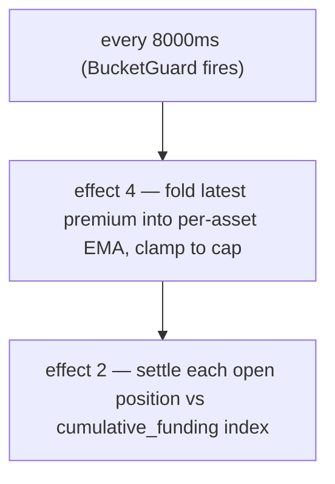

# 资金费率

:::tip
**稳定。**
:::

## 概述

永续合约仓位会持续累积资金费用（每 **8 秒**在链上结算一次），费率与永续合约相对预言机的**溢价**成正比——溢价由深度加权的**冲击价格**衡量，而非单笔成交——并叠加一个小额的基础**利息**项。永续合约价格高于预言机时，多头向空头付费；低于预言机时，空头向多头付费。费率上限默认为每市场 **`±4% / 小时`**，结算基准为**预言机价格**。

## 资金费率存在的意义

永续合约没有到期日，因此没有套利力量将其锚定到标的资产。资金费率承担了这个角色：当永续合约价格高于现货时，多头付费，这激励空头入场、抑制多头做多，直到价格回归。协议本身不参与任何一方——纯粹是用户之间的结算。

## 公式

> 上文概述是概念性模型，以下数值为**实际实现值**。若文字描述与代码有出入，以代码为准；差异之处均有行内标注。

### 计算方式

资金费率由溢价（冲击价格 − 预言机）的**确定性 EMA** 驱动，每 **8 秒**结算一次，而非每小时。上限为 **4% / 小时**，而非 0.05%。

每个区块起始会执行两个效果，各自受 8000 ms `BucketGuard` 保护：

- **效果 4 `update_funding_rates`** — 将最新溢价样本折叠进每资产的 EMA，然后截断至上限。
- **效果 2 `distribute_funding`** — 按累积资金指数结算每个未平仓仓位。

#### 0. 溢价基础——冲击价格（非最新成交价）

每区块的**溢价样本**是永续合约**冲击价格**与预言机之间的差值：

```
premium = (impact_mid − oracle) / oracle
impact_mid = mid( impact_bid, impact_ask )
impact_bid/ask = VWAP of walking the committed book to fill a fixed notional (default ~$10k)
```

使用*冲击*价格——即实际填满一笔固定名义金额所需的成交量加权价——而非最新成交价或最优报价，意味着单笔成交或一手挂单**无法**影响资金费率：必须移动真实的盘口深度才能改变溢价。这与参考版永续合约设计一致。（老版本的每市场模式改用 `premium = (mark − oracle)/oracle`；新建和迁移的市场均采用上述冲击价格基准。）

#### 1. 溢价指数 EMA（每市场）

溢价由**确定性 EMA**（即*溢价指数*）平滑处理。累加器以定点分数 `(num, denom)` 存储——无浮点，使用精确的 `rust_decimal::Decimal` 算术，确保节点间状态逐位一致。每个样本按如下方式折叠：

```
num'   = num   * decay + sample
denom' = denom * decay + 1
value  = num / denom
```

- `sample` = 该资产的最新溢价 × 每资产的 `funding_rate_multiplier`（默认 `1.0`；由动态风险引擎自动调节）。
- `decay = 0.5`（拟议默认值 → 在 5 秒采样间隔下约 7 秒半衰期）。更新时截断至 `[0, 1]`。
- 采样间隔：**5 秒**；EMA 折叠 + 结算间隔：**8000 ms**（`funding_update_guard` / `funding_distribute_guard`）。

> **状态说明：** 完整的资金费率循环已**端到端上线**。每 8 秒，费率驱动器从已提交状态中采样溢价（即上述冲击价格相对预言机的溢价，每个永续合约市场采一个样本），将其折叠进每资产的溢价指数 EMA，推导费率（利息 + 截断），限幅后，结算环节推进累积资金指数，并在仓位持有人的余额之间转移 `size × Δindex`（零和：多头付给空头或反之，无增发/销毁）——全部基于已提交的市场状态，无需外部溢价数据源。已通过守恒性和确定性模糊测试验证，并有 4 节点端到端测试证明：偏差 → 溢价 → EMA → 指数 → 余额转移全链路正确。

#### 2. 从溢价指数推导费率（利息 + 截断）

资金费率**并非**原始溢价指数。平滑后的指数 `premium_idx` 与基础**利息**项结合，通过每步截断计算：

```
interest = 0.0000125 / h        # = 0.01% / 8h — the baseline carry
clamp    = ±0.0005              # per-step bound

funding = premium_idx + clamp( interest − premium_idx, −clamp, +clamp )
```

当溢价指数较小时，资金费率向 `interest` 基准漂移；当溢价较大时，`premium_idx` 项主导，截断值限制了利息每步的回拉幅度。`interest` 和 `clamp` 均可通过每资产治理覆盖。（老版本的每市场模式直接将 EMA 值用作费率，不做利息/截断变换。）

#### 3. 外层上限

`funding` 最终被限幅至每小时上限：

```
cap_per_hour = 0.04          # 4 %/h default
funding = clamp(funding, −cap_per_hour, +cap_per_hour)
```

上限为每市场治理参数：若设置了 `dynamic_risk_overrides[asset].funding_rate_cap`，则替换默认的 `0.04`。

#### 4. 支付计算（每仓位，每次结算）

资金费率累积进每市场的累积指数（`clearinghouse.cumulative_funding`）；每个仓位记录其上次结算时的指数（`funding_entry`）。结算时：

```
payment = size_signed * oracle_px * (cum_global - funding_entry) * funding_rate_multiplier[asset]
funding_entry := cum_global      # roll forward
```

（算术逻辑已完整实现并锁定确定性；实际余额转移与完整 BOLE 结算一同落账。）

| 符号 | 含义 / 精度域 |
|--------|-----------------|
| `size_signed` | 带符号仓位大小；`i128`。多头 > 0，空头 < 0。 |
| `oracle_px` | 合成预言机价格——整 USDC `Decimal` 精度域（参见[标记价格](./mark-prices.md)）。 |
| `cum_global − funding_entry` | 自该仓位上次结算以来，本市场累积的资金费用。 |
| `decay` | EMA 衰减系数 0.5。 |
| `cap_per_hour` | 默认 `0.04`（4%/小时）；可通过动态风险每市场覆盖。 |
| `funding_rate_multiplier` | 每资产乘数，默认 `1.0`，由动态风险自动调节。 |

`funding_rate`（EMA 值）带符号：正值 → 多头付给空头；负值 → 空头付给多头。

**基础利息：** `0.0000125/h`（= `0.01%/8h`）——溢价 EMA 叠加在其之上的基准资金成本。

> ⚠️ **与旧文档的差异说明。** 旧版文档描述的是"每小时"、"60 分钟 EMA 窗口"和"上限 0.05%/小时"。实际实现每 **8 秒**结算，EMA `decay` 为 **0.5**（约 7 秒半衰期），上限为 **4%/小时**。每小时的心理模型用于粗略的资金成本估算尚可，但链上节奏和上限以上述为准。

## 结算节奏

资金费率每 **8 秒**结算一次（`funding_distribute_guard` 间隔），由共识推导的区块时间戳驱动——而非挂钟小时。仓位按累积资金指数结算，因此中途开仓的仓位只需支付自开仓以来累积的费用（没有"整点快照"这一步骤）。



支付以余额调整的方式结算——不产生链上交易，也不收取手续费。在用户历史记录中显示为 `kind: "funding"`。

## 预言机不可信时的熔断机制

资金费率**以预言机价格为基准结算**，因此协议不信任的价格不得驱动支付。每个周期的溢价样本都会*经过检验*：当以下情况发生时，该样本被跳过（采样为 **0**）：

- 该市场的**预言机缺失或 ≤ 0**，或
- **预言机数据陈旧**，超过 `funding_oracle_staleness_ms`（默认 **60 秒**），或
- **盘口过薄**，无法在买卖两侧都填满冲击名义金额（无法计算冲击价格）。

被跳过的样本以 0 折叠，因此溢价指数 EMA **向 0 衰减**，资金费率逐渐归零，而非基于陈旧或可被操纵的基准结算。（另见[边界情况](#edge-cases)。）

:::info
**这就是为什么你可能看到标记价格与预言机差距较大，而资金费率接近 0。** 若某市场的预言机数据损坏或被认为不可信，资金费率将被熔断并衰减至 0——即使[标记价格](./mark-prices.md#mark-vs-oracle--why-they-diverge)（由盘口和外部永续合约构建）仍远离上一个有效预言机价格。大幅价差伴随约 0 的资金费率，是协议*拒绝基于问题预言机收取资金费用*的结果，并非资金费率本身的故障。
:::

## 示例演算

市场：BTC 永续合约，当前状态（预言机精度域，单位整 USDC）：

```
mark         = 100.50
oracle       = 100.00
premium      = mark - oracle = 0.50
EMA(premium) settles toward 0.50 with decay 0.5 over a few 5s samples
funding cap  = 4% / hour (default)
```

假设 EMA 在该间隔内收敛出的资金费率为 `+0.0005`（0.05%），远低于 4%/小时上限。账户持仓如下：

```
long 1 BTC      → pays funding
short 0.5 BTC   → receives funding
```

```
funding_rate = clamp(ema_value, -0.04, +0.04) = +0.0005   (not capped — far below 4%/h)

long 1 BTC:
  payment = +1   * oracle_px * Δcum  ≈ +1   * 100.00 * 0.0005 = +0.0500 USDC  (long pays)

short 0.5 BTC:
  payment = -0.5 * oracle_px * Δcum  ≈ -0.5 * 100.00 * 0.0005 = -0.0250 USDC  (short receives 0.0250)
```

（支付使用 `size_signed * oracle_px * (cum_global - funding_entry)`；此处 `Δcum` 为仓位上次结算以来累积的资金费用。）每 8 秒结算一次，单次金额极小；上限主要约束的是持续单边失衡的情形，4%/小时是其天花板。

## 资金费率上限与动态限制

| 参数 | 默认值 | 来源 / 覆盖方式 |
|-----------|---------|-------------------|
| 资金费率上限（每小时） | `0.04`（`4%/小时`） | `dynamic_risk_overrides[asset].funding_rate_cap`（治理投票） |
| EMA `decay` | `0.5`（约 7 秒半衰期） | 拟议值；校准时可能调整为 0.3/0.7 |
| 采样间隔 | `5 秒` | 协议固定 |
| 结算 / 更新间隔 | `8000 ms` | `funding_distribute_guard` / `funding_update_guard` BucketGuards |
| 基础利息 | `0.0000125/h`（`0.01%/8h`） | 协议固定 |
| `funding_rate_multiplier` | `1.0` | 每资产，由动态风险自动调节 |

每资产的 `funding_rate_multiplier` 是 MetaFlux 相较于 HL 治理静态值的差异化设计：它由动态风险引擎基于 30 天已实现波动率自动调节，在溢价样本进入 EMA 之前对其进行缩放。

## 资金费率历史

账户维度的历史记录可通过 [`POST /info userFills`](../api/rest/info.md) 或 [HL 兼容接口 `userFills`](../api/rest/hl-compat.md) 查询——资金费用支付记录的 `kind` 字段为 `"funding"`，并标注相关资产。

市场维度的历史记录：

```bash
curl -X POST https://devnet-gateway.mtf.exchange/info \
  -H 'content-type: application/json' \
  -d '{"type":"funding_history","market_id":0}'
```

返回有序的 `(ts_ms, premium)` 样本环（参见
[`funding_history`](../api/rest/info.md#funding_history)）：

```json
{
  "type": "funding_history",
  "data": {
    "market_id": 0,
    "samples": [
      { "ts_ms": 1700000000000, "premium": "0.0015" },
      { "ts_ms": 1700000008000, "premium": "-0.0007" }
    ]
  }
}
```

专用的 `fundingTicks` WebSocket 频道已列入 [WS 路线图](../api/ws/subscriptions.md#roadmap--not-yet-available)；在此之前请轮询 [`funding_history`](../api/rest/info.md#funding_history)。

## 资金费率的范围边界

- **与手续费无关。** 资金费率是用户间的转移；手续费是给交易场所的挂单方/吃单方返佣。参见[手续费](./fees.md)。
- **不对保证金计息。** USDC 余额不会因资金费率而产生利息。资金费率纯粹用于弥合标记价格与预言机的偏差。
- **无法预测长期走势。** 资金费率可能逐小时翻转方向，不要将其视为固定的资金成本。

## 边界情况

<details>
<summary>展开边界情况</summary>

- **仓位在间隔中途开立。** 没有**整点快照**——资金费率累积至一个指数中，仓位只为自上次结算以来的指数变动付费。刚好在结算后开仓，当期几乎无需支付；不存在"在快照内 / 不在快照内"的断崖效应。
- **仓位在间隔中途平仓。** 同上——仓位平仓时结算其截至平仓日期的累积费用；不存在对不完整周期的向上或向下舍入。
- **负费率情形。** 当某市场永续合约价格持续低于预言机（空头向多头付费）时，`funding_rate` 在较长时间内为负；多头持续收取资金费用。
- **预言机陈旧 / 盘口过薄。** 溢价样本被熔断为 0，费率向 0 衰减——参见[熔断机制](#gating-when-the-oracle-is-untrusted)。资金费率不会基于不可信的预言机结算。

</details>

## 参见

- [标记价格](./mark-prices.md) — `oracle` 的推导方式
- [分级清算](./tiered-liquidation.md) — 资金费用支付会调整 `account_value`，进而影响 `health`
- [`fundingTicks` WebSocket 频道（路线图）](../api/ws/subscriptions.md#roadmap--not-yet-available)
- [手续费](./fees.md) — 与资金费率相互独立

## 常见问题

<details>
<summary>展开常见问题</summary>

**问：资金费率机制和中心化交易所一样吗？**
答：概念模型相同。大多数中心化交易所每 8 小时结算一次；MetaFlux 每 8 秒结算一次（`funding_distribute_guard` 间隔），因此单次支付金额极小，资金成本也更加平滑。4%/小时的上限约束的是持续单边费率的极端情形。

**问：资金费率会导致我被强制清算吗？**
答：会。资金费用支付会减少 `account_value`。结算每 8 秒进行一次，单次金额极小（不存在大额小时扣款），但若费率持续单边且接近上限，`account_value` 会随时间持续流失，可能将你从 T0 档位推入 T1。若仓位较大且费率持续对你不利，请密切关注 `health`。

**问：资金费率适用于现货仓位吗？**
答：不适用。资金费率是永续合约专有机制，现货仓位不产生任何资金费用。

**问：收到的资金费用需要纳税吗？**
答：这不属于协议层面的问题，请咨询所在司法管辖区的税务顾问。

</details>
