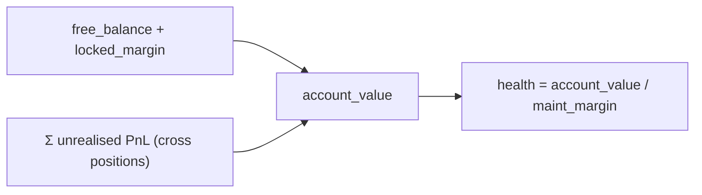
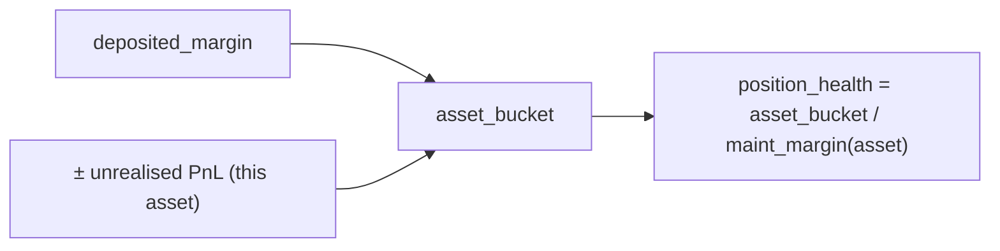
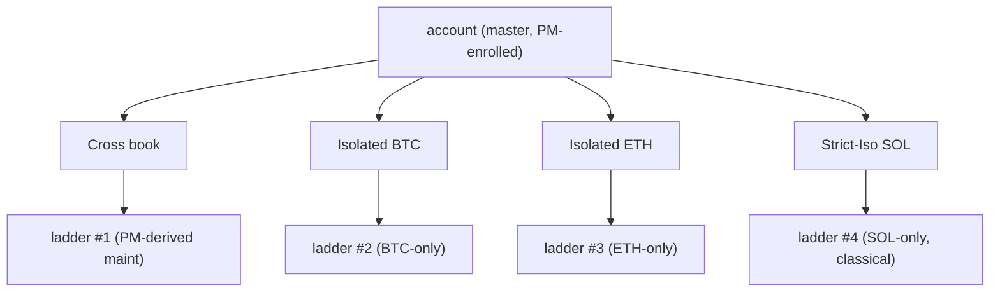
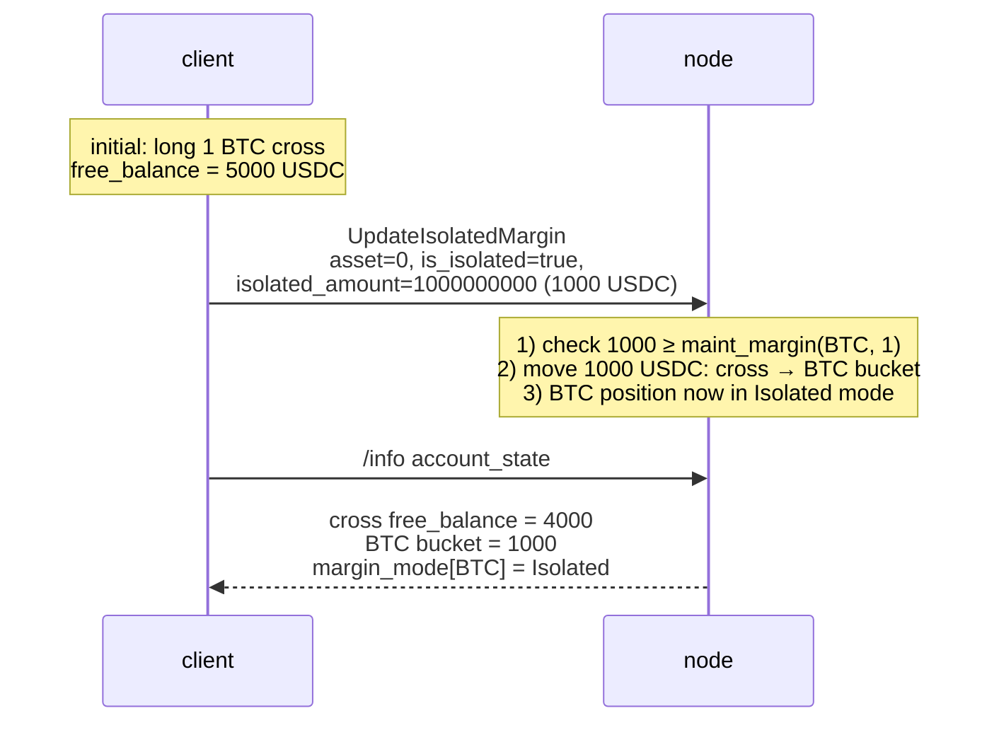

# 保证金模式

:::tip
**稳定。**
:::

## 概览

三种模式，每种资产：**Cross（交叉）**、**Isolated（隔离）**、**Strict-Iso（严格隔离）**。Cross 将保证金汇集在您所有头寸中；Isolated 为每种资产隔离保证金；Strict-Iso 还进一步将该资产从任何[投资组合保证金](./portfolio-margin.md)净额中排除。

## 对比

| 模式 | 保证金来源 | 损失可消耗 | 投资组合保证金资格 | 清算隔离 |
|------|-------------------|----------------|-------------|----------------------|
| **Cross** | 自由余额、账户范围 | 其他头寸 | 是 | 账户整体阶梯 |
| **Isolated** | 每种资产预留桶 | 仅该桶 | 否 | 每种资产阶梯；最大损失 = 桶 |
| **Strict-Iso** | 每种资产预留桶 | 仅该桶 | 否（即使主账户已投资组合保证金注册也排除） | 每种资产阶梯 |

在 Cross 模式下，盈利头寸可以支撑不太健康的头寸——您的自由余额在账户中是流动的。在 Isolated 模式下，一种资产爆仓被限制在该资产的桶内。

## 保证金如何计算

> 所有数额都在**整个 USDC `Decimal` 平面**上（名义价值、保证金、保证金），而不在 1e8 账簿平面上——参见[标记价格：两个价格平面](./mark-prices.md#two-price-planes-read-this-before-reading-any-number)。

### 初始保证金（交易前门槛）

开立新头寸的订单必须提交初始保证金：

```
notional        = |px × size|                         # raw integer product, Decimal scale-0
effective_lev   = dynamic_risk_override.max_leverage   # if set, else position cap, else MAX_LEVERAGE_CAP (50)
required_init    = ceil( notional / effective_lev )    # rounded UP — conservative
free_collateral  = cross_account_value − Σ held_initial_margin
reject  iff  required_init > free_collateral            # InsufficientMargin
```

因此 `init_margin = notional / max_leverage`——经典的 `1 / max_leverage` 比率。`effective_lev` 是 `max(1, …)`；全局上限是 `MAX_LEVERAGE_CAP = 50`，带有硬性 `UpdateLeverage` 上限 **100×** 以及可以收紧它的每种资产动态风险覆盖。四舍五入**向上**（`Decimal::ceil`），因此余数始终收紧门槛。`reduce_only` 订单绕过门槛（它们只会缩小头寸）。

`held_initial_margin` 汇总每个**交叉**开放头寸的 `ceil(|entry_notional| / effective_lev(asset))`（隔离头寸被排除——它们的保证金是单独提交的桶）。

### 维持保证金与健康度

```
health = account_value / maint_margin
```

- `account_value` = `cross_account_value`（自由余额 ± 未实现损益），有符号 `i128`。
- `maint_margin` = 每个持有的头寸的总和 `|entry_notional| × maint_margin_ratio`（从头寸动态导出）**或**当[投资组合保证金](./portfolio-margin.md)已注册时的投资组合保证金数字（`last_computed_pm_cents / 100`）。

每种资产维持比率是治理设置的市场动态风险覆盖，否则是协议基线 **300 bps = 3 %**。衍生的强制平仓滑点下限是有效比率的一半（基线市场为 1.5 %），除非明确覆盖。

维持保证金低于初始要求（`notional / max_leverage`），因此头寸可以开立然后跌至维持保证金下限，然后才被清算。健康度 < 1.0 进入[清算阶梯](./tiered-liquidation.md)在等级带（1.1 / 1.0 / 0.8 / 0.667）。

> 算术始终使用 `Decimal` / `i128`（没有浮点数）；等级决定甚至在 `Decimal` 除法之前右移两个操作数一个共同的量，当账户值超过 `Decimal::MAX` 时，保留健康度比率以便等级决定不受影响。

## Cross——默认值



`maint_margin` 是每个头寸维持保证金要求的总和（如果已[投资组合保证金](./portfolio-margin.md)已注册，则为投资组合保证金数字）。

含义：BTC 上的 10% 不利动作会降低账户范围的健康度，即使您的 ETH 头寸没有问题。您可以通过平仓 ETH 赢家来支撑 BTC 头寸。

## Isolated

:::warning
**实现差距。** 下面的概念模型是**目标行为**。
交易前保证金门槛目前实现**只有 Cross / 汇集保证金
路径**——交易路径以交叉方式开立每个头寸。头寸
`margin_mode` 字段（0 = cross，1 = isolated）已经被读取以*排除*
隔离头寸不在交叉持有保证金总和中，但专用的
隔离保证金交易前门槛（检查订单自己提交的 `isolated_margin`
对比其名义价值）尚未接线。
:::

当您为资产切换 `is_isolated: true` 时，协议将 `isolated_amount` USDC 从交叉余额移到每个头寸桶。该头寸的收益/损失仅结算到桶中：



如果 `position_health` 跌入清算等级，**每个头寸**阶梯就会触发。账户的其余部分不受影响。

您可以在头寸开放时对桶进行存款/取款：

```json
// add 500 USDC to the isolated bucket on asset 0
{ "type":"UpdateIsolatedMargin", "params": {
  "asset": 0, "is_isolated": true, "isolated_amount": "500000000"
}}
```

`isolated_amount` 可以是**正数**（移动 cross → bucket）或**负数**（取款 bucket → cross）。会导致头寸跌入更差等级的取款被拒绝。

## Strict-Iso

与 Isolated 相同的墙，加上对投资组合保证金场景包含的显式退出。即使您的主账户是投资组合保证金注册的，严格隔离头寸：

- **不**贡献给交叉场景引擎
- **不**获得净额信用
- 在**经典**模型下被保证金（每种资产基线）

将 Strict-Iso 用于：
- 投资组合保证金的相关性假设不适用的新的/非流动资产
- 您希望与对冲核心账簿隔离的投机预算
- 上市（MIP-3），其中维持比率是保守的，直到流动性增长

## 何时使用各种模式

| 目标 | 模式 |
|------|------|
| 在连贯账簿上最大化资本效率 | Cross（+ PM）|
| 在一个账户下运行多个不相关的策略 | 每种策略 Isolated，或子账户 |
| 包含一个危险头寸免于威胁其余部分 | Isolated 或 Strict-Iso |
| 跨资产对冲，需要净额信用 | Cross + PM |
| 交易长尾上市，未知波动率制度 | Strict-Iso |

对于多策略隔离，[子账户](./sub-accounts.md)通常比 Isolated 更合适——子账户隔离整个账户，包括代理密钥和订单空间，而不仅仅是保证金。

## 过渡

切换模式使用 [`update_isolated_margin`](../api/rest/exchange.md#update_isolated_margin) 操作（`is_isolated` 标志——没有单独的保证金模式操作），并且仅在以下情况下允许：

| From → To | 允许条件 |
|-----------|--------------|
| Cross → Isolated | 您指定至少涵盖维持保证金的 `isolated_amount` |
| Isolated → Cross | 桶合并到交叉余额；只要合并账户保留在 `Safe` 等级就允许 |
| Isolated → Strict-Iso | 总是允许（无保证金移动）|
| Strict-Iso → Isolated | 总是允许 |
| Strict-Iso/Isolated → Cross（在投资组合保证金注册的主账户下）| 要求头寸适合投资组合保证金场景集 |

在头寸中期切换模式**不是**平仓并重新开仓——头寸保留，仅保证金会计改变。

## 清算行为

[分级清算](./tiered-liquidation.md)阶梯独立应用于每个范围：

- **Cross**：整个账户的一个阶梯
- **Isolated**：每个隔离资产一个阶梯
- **Strict-Iso**：每个严格隔离资产一个阶梯

交叉等级 T1 关闭交叉账簿上的头寸，与其对维持保证金的贡献成正比。隔离 T1 仅关闭隔离头寸。T3 后备和 T4 ADL 是按范围——隔离爆仓不会从交叉赢家收回。



## 序列——从交叉翻转到隔离



## 边界情况

<details>
<summary>显示边界情况</summary>

- **保证金添加时自动存款。** 隔离头寸仅从桶中获取维持保证金不足——一旦桶耗尽，头寸被清算。交叉**不**自动覆盖隔离桶；您必须手动 `UpdateIsolatedMargin` 带正 `isolated_amount` 来补充。
- **平仓隔离头寸。** 平仓完整头寸将桶释放回交叉余额。
- **新资产的模式。** 新头寸默认为 Cross，除非资产的 `meta` 标志 `onlyIsolated: true` 强制 Isolated（在部署时通过 [MIP-3](../mip/mip-3.md) 设置每个市场）。
- **投资组合保证金主账户下的隔离。** 投资组合保证金净额信用仅适用于交叉头寸。隔离头寸按经典方式求和。一个投资组合保证金注册的主账户，带有一个巨大的隔离头寸和微小的交叉账簿，几乎看不到任何投资组合保证金好处。

</details>

## 另见

- [投资组合保证金](./portfolio-margin.md)——投资组合保证金 vs 经典数学
- [分级清算](./tiered-liquidation.md)——每个范围的阶梯
- [子账户](./sub-accounts.md)——完整的账户级别隔离
- [`update_isolated_margin`](../api/rest/exchange.md#update_isolated_margin)——保证金模式是这里的 `is_isolated` 标志；没有单独的保证金模式操作

## 常见问题

<details>
<summary>显示常见问题</summary>

**问：一种资产可以同时有隔离和严格隔离桶吗？**
答：不能。模式是每种资产，单一值：`Cross | Isolated | StrictIso`。

**问：切换模式需要交易成本吗？**
答：没有费用，没有成交。这是纯状态转变。

**问：如果我将隔离桶消耗到维持保证金以下会发生什么？**
答：该资产的清算阶梯触发。您账户的其余部分不受影响。

**问：自动去杠杆化（ADL）是跨范围还是按范围？**
答：按范围。隔离头寸上的 ADL 仅从*该*资产的交易对手收回，而不是从您的交叉账簿或其他隔离头寸收回。

</details>
