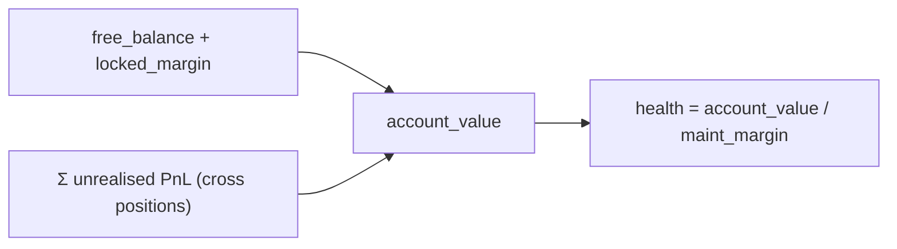
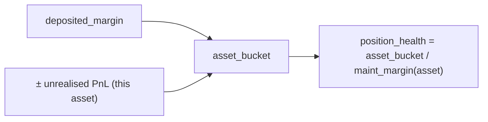
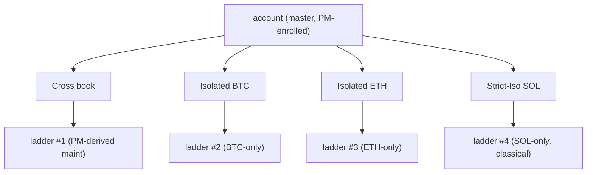
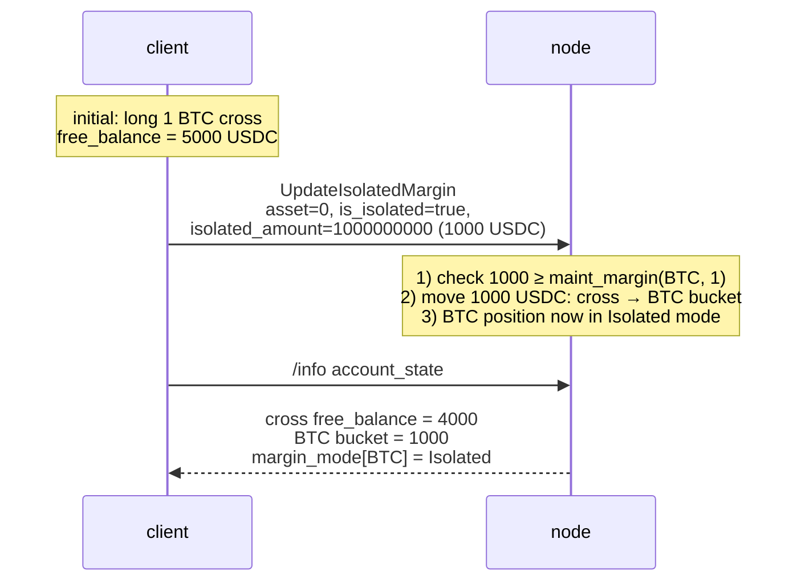

# 保证金模式

:::tip
**稳定版。**
:::

## TL;DR

每个资产支持三种模式：**全仓（Cross）**、**逐仓（Isolated）**、**严格逐仓（Strict-Iso）**。全仓模式将所有持仓的保证金集中管理；逐仓模式为每个资产单独划拨保证金；严格逐仓在逐仓基础上，还将该资产从任何[投资组合保证金](./portfolio-margin.md)轧差计算中完全排除。

## 模式对比

| 模式 | 保证金来源 | 亏损波及范围 | 是否支持 PM | 清算隔离方式 |
|------|-----------|------------|-------------|------------|
| **全仓（Cross）** | 可用余额，全账户共享 | 其他持仓 | 是 | 全账户统一清算阶梯 |
| **逐仓（Isolated）** | 每个资产的独立保证金仓 | 仅限该仓 | 否 | 单资产清算阶梯；最大亏损 = 该仓余额 |
| **严格逐仓（Strict-Iso）** | 每个资产的独立保证金仓 | 仅限该仓 | 否（即便主账户已开启 PM，也明确排除在外） | 单资产清算阶梯 |

全仓模式下，盈利持仓可以为亏损持仓提供缓冲——可用余额在账户层面是通用的。逐仓模式下，某一资产爆仓只会影响该资产的独立保证金仓，不会殃及其他仓位。

## 保证金计算方式

> 所有金额均以**整数 USDC `Decimal` 平面**计算（名义价值、保证金均如此），而非 1e8 账本平面——详见[标记价格：两个价格平面](./mark-prices.md#two-price-planes-read-this-before-reading-any-number)。

### 初始保证金（开仓门槛）

开仓指令新增敞口时，必须提交初始保证金：

```
notional        = |px × size|                         # raw integer product, Decimal scale-0
effective_lev   = dynamic_risk_override.max_leverage   # if set, else position cap, else MAX_LEVERAGE_CAP (50)
required_init    = ceil( notional / effective_lev )    # rounded UP — conservative
free_collateral  = cross_account_value − Σ held_initial_margin
reject  iff  required_init > free_collateral            # InsufficientMargin
```

即 `init_margin = notional / max_leverage`，对应经典的 `1 / max_leverage` 比率。`effective_lev` 取值为 `max(1, …)`；全局上限为 `MAX_LEVERAGE_CAP = 50`，`UpdateLeverage` 的硬性天花板为 **100×**，各资产的动态风险参数可进一步收紧该值。向上取整（`Decimal::ceil`）确保有余数时始终从严，不会放宽门槛。`reduce_only` 指令绕过此门槛（仅用于缩减敞口）。

`held_initial_margin` 汇总所有**全仓**开放持仓的 `ceil(|entry_notional| / effective_lev(asset))`（逐仓持仓不计入——其保证金来自单独划拨的保证金仓）。

### 维持保证金与账户健康度

```
health = account_value / maint_margin
```

- `account_value` = `cross_account_value`（可用余额 ± 未实现盈亏），类型为有符号 `i128`。
- `maint_margin` = 所有持仓腿的 `|entry_notional| × maint_margin_ratio` 之和（实时从持仓派生），若已开启[投资组合保证金](./portfolio-margin.md)则使用 PM 数值（`last_computed_pm_cents / 100`）。

各资产的维持保证金比率：若治理层已设置动态风险参数，则采用该参数，否则使用协议基准值 **300 bps = 3%**。强制平仓滑点下限为有效比率的一半（基准市场为 1.5%），除非被显式覆盖。

维持保证金低于初始保证金要求（`notional / max_leverage`），因此开仓后，价格可以跌至维持保证金底线才触发清算。健康度 < 1.0 时，进入[清算阶梯](./tiered-liquidation.md)的分层区间（1.1 / 1.0 / 0.8 / 0.667）。

> 整个计算过程使用 `Decimal` / `i128`（无浮点数）；当账户价值可能超出 `Decimal::MAX` 时，分层判断会在 `Decimal` 除法前对两个操作数做同步右移，以保持健康度比率不变，确保分层结果准确。

## 全仓模式——默认模式



`maint_margin` 为各持仓维持保证金之和（若已开启[投资组合保证金](./portfolio-margin.md)则使用 PM 数值）。

实际影响：BTC 单边下跌 10% 会拉低全账户健康度，即便 ETH 持仓表现良好。此时可以平掉盈利的 ETH 持仓来为 BTC 止血。

## 逐仓模式

:::warning
**实现进度说明。** 以下概念描述为**目标行为**。
当前开仓前保证金校验仅实现了**全仓/共享保证金路径**——交易路径将所有仓位以全仓方式开仓。持仓字段 `margin_mode`（0 = cross，1 = isolated）已可读取并*排除*逐仓持仓的跨仓保证金汇总，但专属于逐仓模式的开仓前校验（用于核验订单自带的 `isolated_margin` 是否覆盖其名义价值）尚未接入。
:::

为某资产设置 `is_isolated: true` 后，协议会将 `isolated_amount` USDC 从全仓余额划拨至该持仓的独立保证金仓。该持仓的盈亏仅在该仓内结算：



若 `position_health` 跌入某一清算分层，则触发**该持仓**的清算阶梯，账户其余部分不受影响。

可在持仓开放期间向保证金仓充值或提取：

```json
// add 500 USDC to the isolated bucket on asset 0
{ "type":"UpdateIsolatedMargin", "params": {
  "asset": 0, "is_isolated": true, "isolated_amount": "500000000"
}}
```

`isolated_amount` 可为**正值**（全仓 → 保证金仓）或**负值**（保证金仓 → 全仓）。若提取后会导致持仓进入更差的清算分层，则请求将被拒绝。

## 严格逐仓模式

与逐仓模式相同的隔离机制，另外明确退出 PM 场景计算。即使主账户已开启投资组合保证金，严格逐仓持仓：

- **不参与**全仓场景引擎
- **不享受**轧差信用
- 按**经典**模型计算保证金（单资产基准）

适用场景：
- 新资产或低流动性资产，PM 的相关性假设不适用
- 您希望与核心对冲仓位严格隔离的投机预算
- 上币初期（MIP-3），维持保证金比率偏保守，待流动性成熟后再调整

## 各场景适用模式

| 目标 | 推荐模式 |
|------|---------|
| 在一致仓位组合上最大化资金效率 | 全仓（+ PM） |
| 在同一账户下运行多个不相关策略 | 每策略逐仓，或使用子账户 |
| 隔离某一高风险持仓，防止影响其余仓位 | 逐仓或严格逐仓 |
| 跨资产对冲，希望享受轧差信用 | 全仓 + PM |
| 交易尾部资产，波动率机制尚不明朗 | 严格逐仓 |

多策略隔离场景下，[子账户](./sub-accounts.md)通常比逐仓模式更合适——子账户隔离的是整个账户（含代理密钥和订单空间），而非仅隔离保证金。

## 模式切换

切换模式通过 [`update_isolated_margin`](../api/rest/exchange.md#update_isolated_margin) 操作（即 `is_isolated` 标志——不存在单独的保证金模式操作），且仅在以下条件下允许：

| 切换方向 | 允许条件 |
|---------|---------|
| 全仓 → 逐仓 | 您指定的 `isolated_amount` 至少覆盖维持保证金 |
| 逐仓 → 全仓 | 保证金仓并入全仓余额；合并后账户需处于 `Safe` 分层 |
| 逐仓 → 严格逐仓 | 任意时刻均可（无需移动保证金） |
| 严格逐仓 → 逐仓 | 任意时刻均可 |
| 严格逐仓/逐仓 → 全仓（在 PM 已开启的主账户下） | 要求该持仓符合 PM 场景集 |

持仓中途切换模式**不会**平仓后重新开仓——持仓保持不变，仅保证金记账方式发生变化。

## 清算行为

[分层清算](./tiered-liquidation.md)阶梯在各自作用域内独立运行：

- **全仓**：整个账户共用一条清算阶梯
- **逐仓**：每个逐仓资产各有一条清算阶梯
- **严格逐仓**：每个严格逐仓资产各有一条清算阶梯

全仓 T1 按各持仓对维持保证金的贡献比例平仓。逐仓 T1 仅平仓该逐仓持仓。T3 后备机制和 T4 ADL 均按作用域划分——逐仓爆仓不会从全仓盈利持仓中追回。



## 操作时序——全仓切换为逐仓



## 边界情况

<details>
<summary>展开查看边界情况</summary>

- **追加保证金时不会自动存入。** 逐仓持仓的维持保证金缺口仅从保证金仓中补充——仓内资金耗尽后，该持仓将被清算。全仓余额**不会**自动为逐仓保证金仓兜底；必须手动调用 `UpdateIsolatedMargin` 并传入正的 `isolated_amount` 来补仓。
- **关闭逐仓持仓。** 完全平仓后，保证金仓内的资金将释放回全仓余额。
- **新资产的默认模式。** 新建持仓默认为全仓模式，除非该资产在 `meta` 中设置了 `onlyIsolated: true` 标志（在部署时通过 [MIP-3](../mip/mip-3.md) 按市场配置）。
- **PM 主账户下的逐仓持仓。** PM 轧差信用仅适用于全仓持仓。逐仓持仓按经典方式单独计算。若一个 PM 主账户持有一个巨大的逐仓持仓和极小的全仓仓位，则几乎享受不到 PM 的优势。

</details>

## 相关文档

- [投资组合保证金](./portfolio-margin.md) — PM 与经典模型的数学原理
- [分层清算](./tiered-liquidation.md) — 各作用域的清算阶梯
- [子账户](./sub-accounts.md) — 完整账户层面的隔离
- [`update_isolated_margin`](../api/rest/exchange.md#update_isolated_margin) — 保证金模式通过此处的 `is_isolated` 标志控制，不存在单独的模式操作

## 常见问题

<details>
<summary>展开查看常见问题</summary>

**Q：同一资产能同时拥有逐仓和严格逐仓两个保证金仓吗？**
A：不能。模式是单资产单值的：`Cross | Isolated | StrictIso`。

**Q：切换模式会产生交易费用吗？**
A：不产生任何费用，也不触发成交。这是纯粹的状态变更。

**Q：如果逐仓保证金仓跌破维持保证金，会发生什么？**
A：该资产的清算阶梯将被触发，账户其余部分不受影响。

**Q：自动减仓（ADL）是跨作用域还是按作用域执行的？**
A：按作用域执行。逐仓持仓的 ADL 仅从*该*资产的对手方追回，不涉及您的全仓持仓或其他逐仓持仓。

</details>
