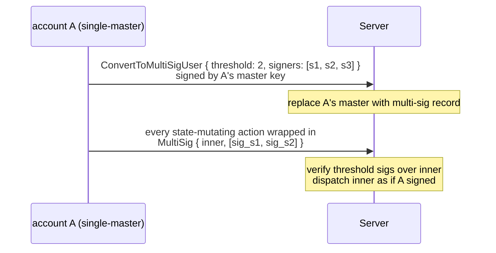
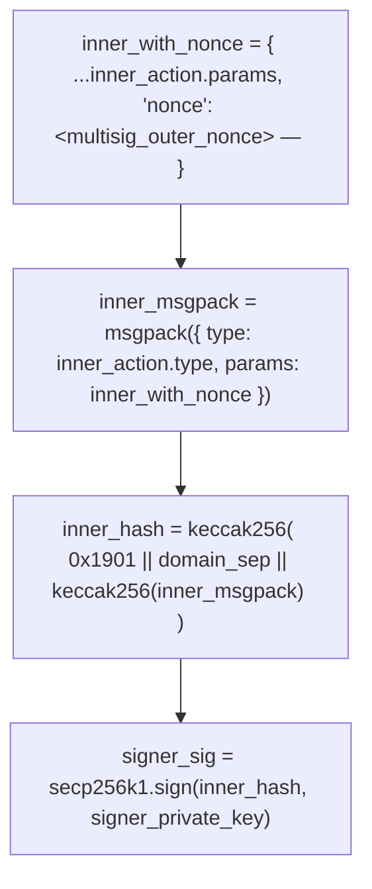

# 多签账户

:::info
**预览功能。**
:::

## 概览

将普通账户升级为 M-of-N 多签模式：主密钥将被一组签名人取代，所有改变状态的操作都必须收集到不少于 `threshold` 个签名，且此转换**不可逆**。适用于机构托管、DAO 国库及联合控制交易台等场景。

## 为什么选择多签

普通账户依赖单一主密钥——密钥一旦丢失，账户即告失控。多签将托管风险分散至多个签名人：

- 2-of-3：三个签名人中任意两人均可操作；丢失一个密钥不会锁死账户。
- 3-of-5：需要 3 个签名；容忍最多 2 个密钥丢失；即便 2 个密钥被盗也无法转移资金。

这与 Gnosis Safe 及各类机构自托管方案所采用的基础原语完全一致，区别在于直接内置于协议层，无需通过智能合约实现。

## 生命周期



## 转换

```json
{
  "type": "ConvertToMultiSigUser",
  "params": {
    "threshold": 2,
    "signers": [ "0x...s1", "0x...s2", "0x...s3" ]
  }
}
```

由**当前**主密钥签名（单签模式，也是该账户最后一次独立签名）。

| 约束条件 | 取值范围 |
|------------|-------|
| `threshold` | `[1, len(signers)]` |
| `len(signers)` | `[2, 16]` |
| `signers[*]` | 各地址不得重复 |

提交后：
- 账户的 `is_multisig: true` 以及 `multisig_set: { threshold, signers }` 将被持久化存储。
- 此后任何未经包装的直接操作（包括原主密钥签名的请求）均会被拒绝，返回 `{"error":"account is multisig"}`。

**不可逆**：协议不提供 `RevertFromMultiSig`。签名人集合可通过多签包装的 `UpdateMultiSig` 进行**更新**（见下文），但无法回退至单主密钥模式。

## 以多签身份操作

所有操作均需包装在 `MultiSig` 中：

```json
{
  "sender":    "0x<multisig_addr>",
  "signature": "0x<any_signer_sig>",   ← outer envelope signed by any one signer
  "action": {
    "type": "MultiSig",
    "params": {
      "inner_action": {
        "type": "Order",
        "params": { ... }
      },
      "signatures": [
        { "signer": "0x...s1", "signature": "0x<sig over inner>" },
        { "signer": "0x...s2", "signature": "0x<sig over inner>" }
      ],
      "nonce": 1735689600099
    }
  }
}
```

服务端校验流程：

1. 外层信封的签名可恢复至 `signers` 中的某一成员（集合中任意单一签名人即可）。
2. 每个 `signatures[*].signature` 可恢复至对应的 `signatures[*].signer`。
3. 恢复出的签名人全部在 `signers` 集合内、互不重复，且数量 ≥ `threshold`。
4. 每个内层签名均覆盖 **`inner_action` 的规范 msgpack（含外层 `nonce`）**，并使用与普通操作相同的 EIP-712 信封格式。

任一校验失败，将返回 `{"error":"multisig threshold not met"}`、`{"error":"multisig duplicate signer"}` 或 `{"error":"signer not in set"}`。

全部校验通过后，内层操作将以 `sender` 直接签名的方式被分发执行。

### 对内层操作签名

每位签名人按如下流程计算签名：



包装后的请求包在链下构建（由协调方收集各签名），由任意一名签名人提交上链。

## 更新签名人集合

```json
{
  "type": "UpdateMultiSig",
  "params": {
    "threshold": 3,
    "signers":   [ "0x...s1", "0x...s2", "0x...s4", "0x...s5", "0x...s6" ]
  }
}
```

通过 `MultiSig` 包装提交，需要**当前**签名人集合中的 `threshold` 个签名。下一个区块生效，届时新集合正式接管。

适用场景：
- 轮换已泄露的密钥
- 增加或移除签名人
- 调整 `threshold`（例如团队扩张后从 2-of-3 升级为 3-of-5）

## 链下协调

协议本身不提供多签流程的协调机制——签名人需要借助带外方式共享待签消息并汇总签名。常见模式如下：

| 模式 | 机制 |
|---------|-----------|
| 内部协调服务 | 每位签名人的钱包轮询共享收件箱；序列化内层操作后签名；将签名上传至共享位置；协调方在签名数达到阈值后提交 |
| 私有共享频道 | 加密群聊或邮件；各签名人粘贴自己的签名；由一名签名人汇总后提交 |
| 多签 SDK（规划中） | 官方 SDK 将内置签名收集工作流，对上层隐藏协调层细节 |

在 SDK 正式发布前，集成方需自行实现协调方逻辑。链上部分保持不变——只有签名本身才是关键。

## 与子账户及代理钱包的兼容性

| 问题 | 回答 |
|----------|--------|
| 多签账户可以拥有子账户吗？ | 可以。`CreateSubAccount` 本身即是一个多签包装操作，每个子账户同样继承多签签名要求。 |
| 多签账户可以授权代理钱包吗？ | 可以。`ApproveAgent` 需要多签包装提交。授权完成后，代理可以正常签名，**无需**再次收集多签——代理的单一签名即可用于其被授权的所有操作。这是典型的机构化配置：多签掌握提款权限与代理管理权；代理负责日常交易流程。 |
| 多签账户本身可以作为另一账户的代理吗？ | 可以——多签账户可被批准为代理。其他账户通过 `ApproveAgent { agent: <multisig_addr> }` 完成授权，此后由多签签名人集合按需签名。 |

## 边界情况

<details>
<summary>展开边界情况</summary>

- **密钥丢失**：M-of-N 可容忍最多 `N - M` 个密钥丢失。规划密钥托管时应分散风险（不同司法管辖区、不同 HSM 设备、不同负责人）。
- **密钥泄露**：在资金被转移之前，M-of-N 最多可容忍 `M - 1` 个密钥被攻破。应尽早发现——为多签账户的 `userEvents` 设置速率监控告警。
- **Nonce 冲突**：多签账户的 nonce 与普通账户相同，按账户维度单调递增。两笔并行签名流程若选取了相同的 nonce，只有一笔会成功提交，另一笔返回 `{"error":"nonce_too_small"}`。建议由协调方统一分配 nonce。
- **签名时效**：签名本身不会自动过期——今天收集的签名在请求包提交之前始终有效。部分集成方会自行在链下添加 TTL 机制。

</details>

## 查询

```bash
curl -X POST https://devnet-gateway.mtf.exchange/info \
  -d '{"type":"user_to_multi_sig_signers","user":"0x<multisig>"}'
```

```json
{
  "type": "user_to_multi_sig_signers",
  "data": {
    "address":      "0x<multisig>",
    "is_multi_sig": true,
    "threshold":    2,
    "signers":      ["0x...", "0x...", "0x..."]
  }
}
```

对于普通账户，`is_multi_sig` 为 `false`，`signers` 为空。签名人集合与阈值直接来源于已提交的 `multi_sig_tracker` 配置。

## 时序图——多签下单

```mermaid
sequenceDiagram
    participant S1 as signer s1
    participant S2 as signer s2
    participant C as coordinator
    participant Chain as chain
    Note over S1: T-1 prepares inner_action = Order{...}<br/>computes inner_hash — signs → sig_s1
    S1->>C: sends inner_action + sig_s1 to coordinator
    Note over S2: T-2 receives inner_action via coordinator<br/>verifies inner_hash — signs → sig_s2
    S2->>C: sends sig_s2 to coordinator
    Note over C: T-3 coordinator (any signer or service):<br/>assembles MultiSig{ inner_action, signatures: [sig_s1, sig_s2], nonce }<br/>wraps in outer envelope — signs outer with own key
    C->>Chain: POST /exchange
    Note over Chain: T-4 chain admits:<br/>verify outer sig<br/>verify both inner sigs ≥ threshold(2)<br/>dispatch Order → admit to mempool
    Chain-->>C: return 202
    Note over Chain: T+commit inner Order applied — orderEvents fires;<br/>multi-sig account now has the new resting order
```

## 参见

- [`POST /exchange convert_to_multi_sig_user`](../api/rest/exchange.md#convert_to_multi_sig_user)
- [`/exchange` 签名语义](../api/rest/exchange.md#signed-by-semantics) — 多签包装信封
- [代理钱包](./agent-wallets.md) — 将多签与代理委托结合使用
- [子账户](./sub-accounts.md) — 多签账户可拥有子账户

## 常见问题

<details>
<summary>展开常见问题</summary>

**Q：可以设置 1-of-N（"任意"签名）吗？**
A：可以——设置 `threshold: 1` 即可。适合需要冗余保障但不需要协调流程的场景。功能上等同于多个共享提款权限的独立账户，但链上开销更低。

**Q：内层操作的签名可以跨操作复用吗？**
A：不可以。每个签名与特定的内层操作和 nonce 绑定。将签名用于不同的内层操作会返回 `{"error":"multisig threshold not met"}`。

**Q：多签包装支持递归嵌套吗？**
A：不支持。`MultiSig { inner_action: MultiSig { ... } }` 会被直接拒绝，只允许单层包装。

**Q：多签能包装另一个 `MultiSig` 吗？（元问题。）**
A：同上——递归嵌套被禁止。若需要以多签账户身份代表另一个多签账户操作，应由外层账户将内层多签账户批准为代理。

</details>
