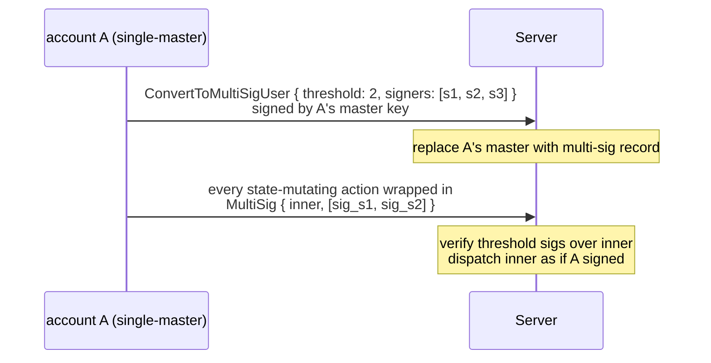
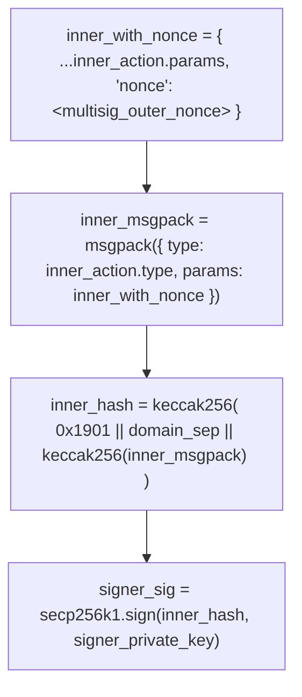

# 多签账户

:::info
**预览版功能。**
:::

## 速览

将常规账户转换为 M-of-N 多签：主密钥被签名者集合替代，每个状态改变的操作都必须收集来自 `threshold` 个签名者的签名，且转换是**不可逆的**。专为机构托管、DAO 国库和联合控制交易桌设计。

## 为什么使用多签

常规账户有单一主密钥。丧失密钥 = 全部丧失。多签将托管风险分散给多个签名者：

- 2-of-3：三个签名者中的任意两个可以行动；丧失一个密钥不会锁定账户。
- 3-of-5：需要 3 个签名；最多可以丧失 2 个密钥；最多 2 个被攻破的密钥无法移动资金。

这与支撑每个 Gnosis Safe/机构自托管设置的原始概念相同，但在协议层实现，而不是通过智能合约。

## 生命周期



## 转换

```json
{
  "type": "ConvertToMultiSigUser",
  "params": {
    "threshold": 2,
    "signers": [ "0x...s1", "0x...s2", "0x...s3" ]
  }
}
```

由**当前**主密钥签名（单签，这个账户最后仅有的单独签名）。

| 约束条件 | 值 |
|------------|-------|
| `threshold` | `[1, len(signers)]` |
| `len(signers)` | `[2, 16]` |
| `signers[*]` | 不同的地址 |

提交后：
- 账户的 `is_multisig: true` 和 `multisig_set: { threshold, signers }` 被存储。
- 后续任何人（包括旧主密钥）的直接（非包装）操作被拒绝，错误为 `{"error":"account is multisig"}`。

**不可逆**：没有 `RevertFromMultiSig`。签名者集合可以通过多签包装的 `UpdateMultiSig` **更新**（见下文），但您无法回到单主密钥。

## 作为多签行动

将每个操作包装在 `MultiSig` 中：

```json
{
  "sender":    "0x<multisig_addr>",
  "signature": "0x<any_signer_sig>",   ← outer envelope signed by any one signer
  "action": {
    "type": "MultiSig",
    "params": {
      "inner_action": {
        "type": "Order",
        "params": { ... }
      },
      "signatures": [
        { "signer": "0x...s1", "signature": "0x<sig over inner>" },
        { "signer": "0x...s2", "signature": "0x<sig over inner>" }
      ],
      "nonce": 1735689600099
    }
  }
}
```

服务器检查：

1. 外部信封的签名恢复为 `signers` 中的一个（集合中的任何单签）。
2. 每个 `signatures[*].signature` 恢复为 `signatures[*].signer`。
3. 恢复的签名者都在 `signers` 中、互不重复，且数量 ≥ `threshold`。
4. 每个内部签名都针对 **`inner_action` 的规范 msgpack，带有包装器的 `nonce`**，包装在与常规操作相同的 EIP-712 信封中。

如果任何检查失败：`{"error":"multisig threshold not met"}` 或 `{"error":"multisig duplicate signer"}` 或 `{"error":"signer not in set"}`。

如果所有检查通过：内部操作被分派，就如同 `sender` 直接签名了它。

### 对内部操作进行签名

每个签名者计算：



包装器束随后在链外构建（协调者收集签名）并由任何签名者提交。

## 更新签名者集合

```json
{
  "type": "UpdateMultiSig",
  "params": {
    "threshold": 3,
    "signers":   [ "0x...s1", "0x...s2", "0x...s4", "0x...s5", "0x...s6" ]
  }
}
```

包装在 `MultiSig` 中，需要来自**当前**集合的 `threshold` 个签名。在下一个区块有效；从那时起新集合生效。

用于：
- 轮换被攻破的密钥
- 添加或移除签名者
- 更改 `threshold`（例如在交易桌增长时从 2-of-3 移至 3-of-5）

## 链外协调

协议不捆绑多签流程——签名者需要带外方式来共享要签名的消息并收集签名。常见模式：

| 模式 | 机制 |
|---------|-----------|
| 内部协调器服务 | 每个签名者的钱包轮询共享收件箱；序列化内部操作；签名；上传签名回去；协调者在达到阈值时提交 |
| 共享私人频道 | 加密群聊/邮件；每个签名者粘贴其签名；一个签名者聚合并提交 |
| 多签 SDK（计划中） | 官方 SDK 提供签名者收集工作流，隐藏协调层 |

在 SDK 发布前，集成商实现自己的协调器。链上部分保持不变——只有签名重要。

## 与子账户和代理的兼容性

| 问题 | 答案 |
|----------|--------|
| 多签账户可以有子账户吗？ | 是。`CreateSubAccount` 本身是一个多签包装操作。每个子账户继承多签签名要求。 |
| 多签账户可以批准代理钱包吗？ | 是。`ApproveAgent` 是多签包装的。一旦批准，代理可以正常签名**无需**进一步的多签收集——代理的签名足以用于其获准执行的操作。这是典型的机构设置：多签持有提现权限 + 代理管理；代理运行日常交易流。 |
| 多签账户本身可以为另一账户作为代理签名吗？ | 是——多签账户可以被批准为代理。其他批准它们的账户调用 `ApproveAgent { agent: <multisig_addr> }`。多签签名者集合按需签名。 |

## 边界情况

<details>
<summary>显示边界情况</summary>

- **丧失密钥**：M-of-N 容忍最多 `N - M` 个丧失。规划密钥托管以分散丧失风险（不同司法管辖区、不同 HSM、不同人员）。
- **被攻破的密钥**：M-of-N 容忍最多 `M - 1` 个攻破，资金才能被移动。尽早检测——在多签账户的 `userEvents` 上设置速率监控警报。
- **Nonce 碰撞**：多签的 nonce 是按账户的、单调的，与单签相同。两个并行签名工作选择相同 nonce：只有一个提交；另一个返回 `{"error":"nonce_too_small"}`。协调者应该分配 nonce。
- **签名过期**：签名本身不会过期——今天收集的签名在提交前一直有效。某些集成商添加自己的链外 TTL。

</details>

## 查询

```bash
curl -X POST https://devnet-gateway.mtf.exchange/info \
  -d '{"type":"user_to_multi_sig_signers","user":"0x<multisig>"}'
```

```json
{
  "type": "user_to_multi_sig_signers",
  "data": {
    "address":      "0x<multisig>",
    "is_multi_sig": true,
    "threshold":    2,
    "signers":      ["0x...", "0x...", "0x..."]
  }
}
```

`is_multi_sig` 对于纯账户为 `false`（`signers` 为空）。签名者集合 + 阈值直接来自已提交的 `multi_sig_tracker` 配置。

## 序列——多签订单

```mermaid
sequenceDiagram
    participant S1 as signer s1
    participant S2 as signer s2
    participant C as coordinator
    participant Chain as chain
    Note over S1: T-1 prepares inner_action = Order{...}<br/>computes inner_hash; signs → sig_s1
    S1->>C: sends inner_action + sig_s1 to coordinator
    Note over S2: T-2 receives inner_action via coordinator<br/>verifies inner_hash; signs → sig_s2
    S2->>C: sends sig_s2 to coordinator
    Note over C: T-3 coordinator (any signer or service):<br/>assembles MultiSig{ inner_action, signatures: [sig_s1, sig_s2], nonce }<br/>wraps in outer envelope; signs outer with own key
    C->>Chain: POST /exchange
    Note over Chain: T-4 chain admits:<br/>verify outer sig<br/>verify both inner sigs ≥ threshold(2)<br/>dispatch Order → admit to mempool
    Chain-->>C: return 202
    Note over Chain: T+commit inner Order applied; orderEvents fires;<br/>multi-sig account now has the new resting order
```

## 另见

- [`POST /exchange convert_to_multi_sig_user`](../api/rest/exchange.md#convert_to_multi_sig_user)
- [`/exchange` signed-by semantics](../api/rest/exchange.md#signed-by-semantics) — multi-sig wrapper envelope
- [Agent wallets](./agent-wallets.md) — combine multi-sig with agent delegation
- [Sub-accounts](./sub-accounts.md) — multi-sig accounts can have subs

## 常见问题

<details>
<summary>显示常见问题</summary>

**问：我可以做 1-of-N（"任何"签名）吗？**
答：是的——`threshold: 1`。适用于无需协调的冗余。功能上等同于具有共享提现权限的 N 个单独账户，但链上更便宜。

**问：内部操作签名可以在不同的内部操作间共享吗？**
答：不行。每个签名都针对特定的内部操作 + nonce。尝试在不同的内部操作上重用签名返回 `{"error":"multisig threshold not met"}`。

**问：多签包装是递归的吗？**
答：不是。`MultiSig { inner_action: MultiSig { ... } }` 被拒绝。只有一层。

**问：多签可以包装 `MultiSig` 吗？（元问题。）**
答：同上——递归被阻止。要代表另一个多签进行操作，外部账户将内部多签批准为代理。

</details>
